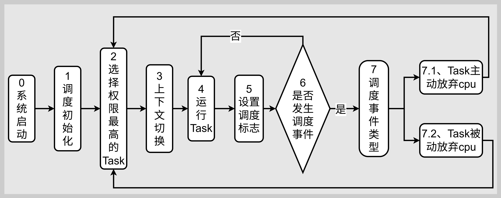
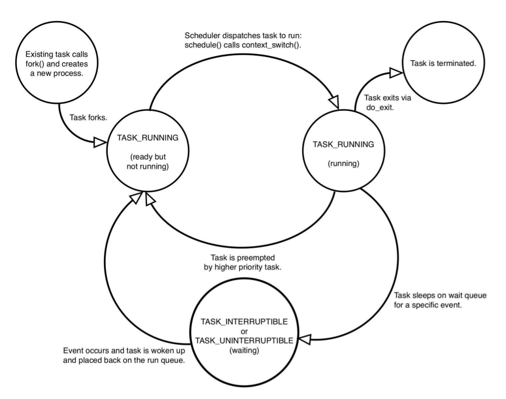
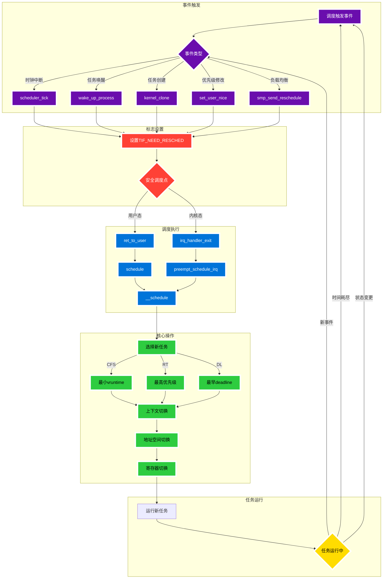
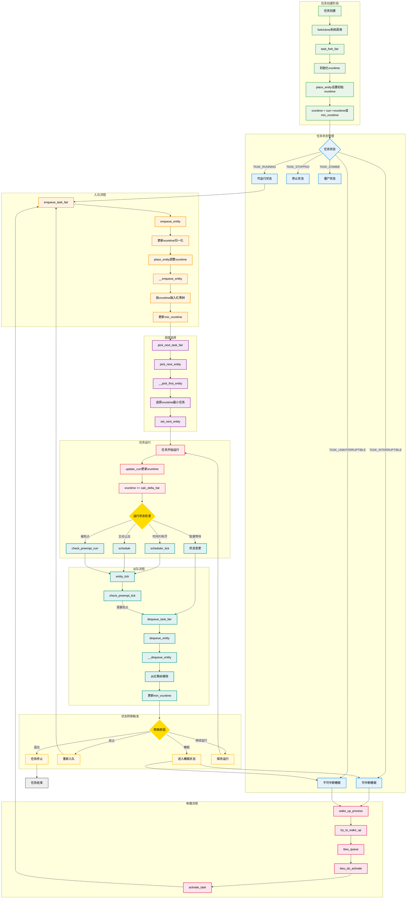

# linux内核--调度的初始化和运行流程分析

[TOC]

# 0、调度的概念与调度通用流程图

* 调度的概念：调度器的本质是一个资源分配器 ，负责决定在什么时候、哪个进程/线程可以使用CPU资源，及使用多长时间。在具体的内核中，就是进行进程/线程/任务的切换。

* 调度的通用流程：

    

* 其中涉及到的相关概念：

    * 调度队列
    * TCB
    * 两者的链接方式
    * 设置调度标志的时机
    * 执行调度的时机


# 1、linux内核中调度相关的各种概念与数据结构

## 1.1、调度队列的抽象

调度策略：系统提供几种不同的调度策略

```c
#define SCHED_NORMAL		0	// CFS调度
#define SCHED_FIFO			1	// 实时FIFO
#define SCHED_RR			2	// 实时轮转
#define SCHED_BATCH		    3	// 批处理
/* 4 SCHED_ISO: reserved but not implemented yet */
#define SCHED_IDLE			5	// 空闲调度
#define SCHED_DEADLINE	    6	// 最早截止时间调度
```

调度类：系统针对不同的调度策略提供不同的调度类，即提供不同的调度操作函数

```c
struct sched_class stop_sched_class;   // 最高优先级
struct sched_class dl_sched_class;     // Deadline调度
struct sched_class rt_sched_class;     // 实时调度
struct sched_class fair_sched_class;   // CFS调度
struct sched_class idle_sched_class;   // 空闲调度
```

运行时调度队列：每个cpu使用一个单独的struct rq运行时队列，并维护三种具体的运行时调度队列

```c
struct cfs_rq     ==> CFS调度队列   （vruntime排序的红黑树）
struct rt_rq      ==> RT调度队列      （优先级位图下管理的链表）
struct dl_rq      ==> DL调度队列     （deadline排序的红黑树）
```

调度类、调度策略、运行时调度队列的对应关系

|                     调度策略                      |                  调度类                  |   运行队列    |
| :-----------------------------------------------: | :--------------------------------------: | :-----------: |
|                  SCHED_DEADLINE                   |              dl_sched_class              | struct dl_rq  |
|            SCHED_FIFO、<br />SCHED_RR             |              rt_sched_class              | struct rt_rq  |
| SCHED_NORMAL、<br />SCHED_BATCH、<br />SCHED_IDLE |             fair_sched_class             | struct cfs_rq |
|                     特殊情况                      | stop_sched_class、<br />idle_sched_class |   特殊处理    |


## 1.2、Task与调度队列的链接关系

* 链接关系：rq 通过cfs_rq / rt_rq / dl_rq 链接 task_struct的sched_entity / sched_rt_entity / sched_dl_entity

    

    * struct cfs_rq ==> CFS调度队列 ==> 使用struct sched_entity的vruntime作为键值排序的红黑树

    * struct rt_rq ==> RT调度队列 ==> 使用task_struct中的各种prio计算的优先级数值进行排序的位图链表

    * struct dl_rq   ==> DL调度队列 ==> 使用struct sched_dl_entity的dl_deadline作为键值排序的红黑树


# 2、linux内核中的调度的具体流程分析

## 2.1、代码调用链分析

### 2.1.0、整体调用链分析

​	linux内核整体上遵循通用的调度流程，包含第0章中通用调度流程的所有步骤。

​	接下来分析在32位arm v7-a架构下，linux内核在通用流程中的每一步是如何实现的，以及每一步涉及到linux内核自己所使用的具体方式。包括：

* 调度队列如何初始化、如何工作
* 调度实体如何初始化、如何工作
* 调度类如何初始化、如何工作
* 任务和调度队列在如何链接

等等问题，接下来分析linux内核调度流程的整体代码调用链：

```c
// 0、系统启动
// arch/arm/kernel/head.S
ENTRY(stext)
    /* 从__enable_mmu返回之后是返回到 __primary_switch 函数 */
    adr_l	lr, __primary_switch	@ address to jump to after
    mov	r13, lr						@ mmu has been enabled
    b	__enable_mmu
        b	__turn_mmu_on
            mov	r3, r13
            ret	r3	@这里就是返回到 __primary_switch 函数
                ldr	pc, =__mmap_switched
                    b	start_kernel
// 1、调度初始化
						sched_init();

// 2、选择权限最高的Task
// 可以分为：1️⃣系统启动之后的首次调度，2️⃣系统运行过程中进行的调度
// kernel\sched\core.c
__schedule
    next = pick_next_task(rq, prev, &rf);
// 3、上下文切换
		rq = context_switch(rq, prev, next, &rf);
			switch_to(prev, next, prev);
				last = __switch_to(prev,task_thread_info(prev), task_thread_info(next));
				// 重点有：地址空间、寄存器等等内容的切换
				ENTRY(__switch_to)
// 4、运行Task
                    // 恢复新任务的寄存器并跳转
                    ARM(	ldmia	r4, {r4 - sl, fp, sp, pc}  )
/*
在Task运行过程中，会发生各种各样的情况，其中能够影响调度的有如下因素
4.1、时间因素
    - 时间片耗尽 ：通过 scheduler_tick 定期检查当前任务是否用完时间片
    - 定时器到期 ：各种定时器事件触发调度需求
4.2、任务状态变化
    - 任务唤醒 ：高优先级任务被唤醒，需要抢占当前任务
    - 任务阻塞 ：当前任务因I/O等原因阻塞，需要切换到其他任务
    - 任务创建/退出 ：新任务创建或任务结束改变调度环境
4.3、优先级变化
    - 动态优先级调整 ：任务优先级发生变化
    - 调度策略切换 ：任务在不同调度类之间切换
4.4、系统事件
    - 中断处理 ：中断可能唤醒高优先级任务
    - 系统调用 ：某些系统调用可能触发调度
    - 负载均衡 ：SMP系统中的CPU间负载平衡          
*/
                    
// 5、设置调度标志
/*
由于以上因素影响了调度，所以有如下设置标度标志的时机
5.1、时钟中断
5.2、任务唤醒
5.3、调度策略变化
5.4、创建新Task
5.5、其他特殊场景
	负载均衡、RCU、空闲注入等特殊场景
*/

// 6、是否发生调度事件，是则跳转到第7步，否则跳转到第4步
/*
在系统运行的各个时间点都可能设置了调度标志，但是某些时间点是进行调度无法保证内核数据的一致性，
所以系统设置固定的安全调度点，在安全调度点判断是否设置调度标志，是则进行调度，否则继续执行原先的Task。
6.1、中断返回路径
    - 从内核态返回用户态 ：检查 TIF_NEED_RESCHED 并调用 schedule()
    - 从中断返回 ： preempt_schedule_irq() 处理中断返回时的调度
6.2、统调用返回
    - 系统调用完成返回用户空间前检查调度标志
6.3、主动调度点
    - schedule() 直接调用 ：任务主动让出CPU
    - cond_resched() ：内核长时间运行时的主动检查点
    - 阻塞操作 ：如等待I/O、锁等
6.4、抢占调度
    - 内核抢占 ：在支持内核抢占的系统中，从中断返回内核态时
    - 用户抢占 ：从内核返回用户态时
*/

// 7、调度事件类型
/*
按照第5步中，设置的调度表示时机，总体上分为主动调度和被动调度两大类，每个内核会设置不同的名称：
7.1、Task主动放弃cpu
7.2、Task被动放弃cpu
*/
```


在上述linux内核调度流程的整体代码调用链中，相关步骤的具体流程如下:

### 2.1.1、调度初始化sched_init代码分析

```c
// 1、调度初始化
// sched_init
// struct rq / struct cfs_rq / struct rt_rq / struct dl_rq结构体得到初始化
// kernel\sched\core.c
void __init sched_init(void)
    	for_each_possible_cpu(i) {
    		...
            // 1.1、分配当前cpu[i]的rq运行时队列
           	// 这里只是指向运行时队列的内存地址，其内存分配在此之前已经确定
			struct rq *rq = cpu_rq(i);
    		// 1.2、初始化当前cpu[i]的rq运行时队列中的 cfs_rq队列
    		init_cfs_rq(&rq->cfs);
                // 初始化任务时间线为空的缓存红黑树根节点
                cfs_rq->tasks_timeline = RB_ROOT_CACHED;
                // 初始化最小虚拟运行时间
                cfs_rq->min_vruntime = (u64)(-(1LL << 20));
                // 在SMP（对称多处理器）系统中初始化removed结构的自旋锁
                raw_spin_lock_init(&cfs_rq->removed.lock);
    		// 1.3、初始化当前cpu[i]的rq运行时队列中的 rt_rq队列
            init_rt_rq(&rq->rt);
                // 声明指向优先级数组的指针，用于管理不同优先级的实时任务队列
                struct rt_prio_array *array = &rt_rq->active;
                // 遍历所有实时优先级级别（0到MAX_RT_PRIO-1）
                for (i = 0; i < MAX_RT_PRIO; i++) {
                    // 初始化每个优先级对应的任务链表头
                    INIT_LIST_HEAD(array->queue + i);
                    // 清除位图中对应优先级的位
                    __clear_bit(i, array->bitmap);
                }
                /* 设置位图搜索的分隔符
                 * 在MAX_RT_PRIO位置设置位，作为位搜索算法的边界标记
                 * 这样可以避免搜索超出有效优先级范围 */
                __set_bit(MAX_RT_PRIO, array->bitmap);
    		// 1.4、初始化当前cpu[i]的rq运行时队列中的 dl_rq队列
            init_dl_rq(&rq->dl);
                /* 初始化Deadline任务的红黑树根节点
                 * root是一个缓存红黑树，用于按deadline时间排序所有Deadline任务
                 * 最左边的节点（deadline最早）是下一个要调度的任务
                 * RB_ROOT_CACHED提供O(1)时间获取最早deadline任务的能力 */
                dl_rq->root = RB_ROOT_CACHED;
    		...
		}
```


#### 运行时队列struct rq的地址计算

​	其中Linux内核per-CPU变量系统的核心机制： 基准地址 + 偏移量 = 实际地址 ，然后通过临时指针变量进行结构化访问和初始化。

```c
// 1. Section中的基准地址
// kernel\sched\sched.h
/* 编译时在section中定义的基准地址 */
DECLARE_PER_CPU_SHARED_ALIGNED(struct rq, runqueues);
/* runqueues变量在.data..percpu..shared_aligned段中有一个基准地址 */

// 2. 偏移量计算和存储
// mm\percpu.c
/* 全局偏移量数组，存储每个CPU的偏移量 */
unsigned long __per_cpu_offset[NR_CPUS] __read_mostly;

void __init setup_per_cpu_areas(void)
{
    /* 计算基础偏移量：运行时基地址 - 编译时基准地址 */
    delta = (unsigned long)pcpu_base_addr - (unsigned long)__per_cpu_start;
    
    /* 为每个CPU计算并存储偏移量 */
    for_each_possible_cpu(cpu)
        __per_cpu_offset[cpu] = delta + pcpu_unit_offsets[cpu];
        /*
         * __per_cpu_offset[cpu] = 
         *   (运行时基地址 - 编译时基准地址) + CPU特定偏移
         */
}

// 3. 实际地址计算
// include\asm-generic\percpu.h
/* 地址计算的核心公式 */
#define per_cpu(var, cpu) \
    (*VERIFY_PERCPU_PTR(&(var) + per_cpu_offset(cpu)))
    
#define per_cpu_offset(x) (__per_cpu_offset[x])

/*
 * 实际计算过程：
 * 实际地址 = &runqueues + __per_cpu_offset[cpu]
 *         = section基准地址 + 偏移量
 */

// 4. 临时指针变量指向实际地址
// kernel\sched\core.c
void __init sched_init(void)
{
    for_each_possible_cpu(i) {
        struct rq *rq;  /* 临时指针变量 */
        
        /* 通过基准地址+偏移量计算实际地址，并让指针指向它 */
        rq = cpu_rq(i);  /* rq = &runqueues + __per_cpu_offset[i] */
        
        /* 通过指针按照struct rq结构进行初始化 */
        raw_spin_lock_init(&rq->lock);
        rq->nr_running = 0;
        rq->calc_load_active = 0;
        rq->calc_load_update = jiffies + LOAD_FREQ;
        
        init_cfs_rq(&rq->cfs);
        init_rt_rq(&rq->rt);
        init_dl_rq(&rq->dl);
        /* ... 更多初始化 ... */
    }
}

// 内存布局示意
Section中的基准地址（编译时）：
__per_cpu_start: [其他变量][runqueues基准][其他变量] __per_cpu_end
                          ↑
                    &runqueues (基准地址)

运行时每个CPU的实际内存：
CPU0: [其他变量][runqueues_cpu0][其他变量]  <- 基准地址 + offset[0]
CPU1: [其他变量][runqueues_cpu1][其他变量]  <- 基准地址 + offset[1]
CPU2: [其他变量][runqueues_cpu2][其他变量]  <- 基准地址 + offset[2]

地址计算：
rq = cpu_rq(0) = &runqueues + __per_cpu_offset[0] -> runqueues_cpu0
rq = cpu_rq(1) = &runqueues + __per_cpu_offset[1] -> runqueues_cpu1
rq = cpu_rq(2) = &runqueues + __per_cpu_offset[2] -> runqueues_cpu2
    
// 关键优势
1. 高效访问 ：O(1)时间复杂度的地址计算
2. 类型安全 ：编译时类型检查
3. 缓存友好 ：每个CPU访问自己的内存区域
4. 无锁访问 ：当前CPU访问自己的运行队列无需锁
```


### 2.1.2、选择新任务pick_next_task代码分析

```c
// 2、选择权限最高的Task
// pick_next_task
static inline struct task_struct *
pick_next_task(struct rq *rq, struct task_struct *prev, struct rq_flags *rf)
    // 2.1、如果所有任务否是cfs，那么直接使用cfs的函数pick_next_task_fair查找next task
    if (likely(prev->sched_class <= &fair_sched_class && rq->nr_running == rq->cfs.h_nr_running)) {
    	p = pick_next_task_fair(rq, prev, rf);
        // 2.2、如果CFS调度类没有可运行的任务，选择idle任务作为下一个运行任务
		if (!p) {
			p = pick_next_task_idle(rq);
        }
	}
	// 2.3、按照调度类的优先级顺序，依次从高到底在调度类中查找
	// 下一个优先级最高的task，找到之后即可返回。
	for_each_class(class) {
		// 遍历所有调度类，按优先级从高到低的顺序
		// 调度类优先级顺序通常为：stop > dl > rt > fair > idle
		p = class->pick_next_task(rq); // 调用当前调度类的任务选择函数
		if (p)
			return p; // 如果找到可运行的任务，立即返回
	}
```


#### 调度类struct sched_class的初始化与使用

```c
// 1、链接脚本层面的调度类布局定义
// 1.1、链接脚本中的调度类节定义
// 在include\asm-generic\vmlinux.lds.h中定义了调度类的内存布局：
// 从低优先级到高优先级：idle → fair → rt → dl → stop
#define SCHED_DATA				\
	STRUCT_ALIGN();				\
	__begin_sched_classes = .;		\
	*(__idle_sched_class)			\
	*(__fair_sched_class)			\
	*(__rt_sched_class)			\
	*(__dl_sched_class)			\
	*(__stop_sched_class)			\
	__end_sched_classes = .;

// 1.2、调度类边界和遍历宏定义
// 在kernel\sched\sched.h中中定义了边界和遍历机制：
/* Defined in include/asm-generic/vmlinux.lds.h */
extern struct sched_class __begin_sched_classes[];
extern struct sched_class __end_sched_classes[];

#define sched_class_highest (__end_sched_classes - 1)  // 指向最高优先级调度类(stop)
#define sched_class_lowest  (__begin_sched_classes - 1) // 指向最低优先级之前的位置

// for_each_class 从高优先级到低优先级遍历：stop → dl → rt → fair → idle
#define for_each_class(class) \
	for_class_range(class, sched_class_highest, sched_class_lowest)

// 2、调度类声明层面
// 2.1、调度类外部声明
// 在kernel\sched\sched.h中声明了所有调度类：
extern const struct sched_class stop_sched_class;   // 停止调度类（最高优先级）
extern const struct sched_class dl_sched_class;     // Deadline调度类
extern const struct sched_class rt_sched_class;     // 实时调度类
extern const struct sched_class fair_sched_class;   // 公平调度类（CFS）
extern const struct sched_class idle_sched_class;   // 空闲调度类（最低优先级）

// 3、具体调度类实现层面
// 3.1、Stop调度类实现
// 在kernel\sched\stop_task.c中：
const struct sched_class stop_sched_class
	__section("__stop_sched_class") = {
	.enqueue_task		= enqueue_task_stop,
	.dequeue_task		= dequeue_task_stop,
	.pick_next_task		= pick_next_task_stop,
	// ... 其他函数指针
};

// 3.2、Deadline调度类实现
// 在kernel\sched\deadline.c中：
const struct sched_class dl_sched_class
	__section("__dl_sched_class") = {
	.enqueue_task		= enqueue_task_dl,
	.dequeue_task		= dequeue_task_dl,
	.pick_next_task		= pick_next_task_dl,
	// ... EDF算法相关函数
};

// 3.3、实时调度类实现
// 在kernel/sched/rt.c中：
const struct sched_class rt_sched_class
	__section("__rt_sched_class") = {
	.enqueue_task		= enqueue_task_rt,
	.dequeue_task		= dequeue_task_rt,
	.pick_next_task		= pick_next_task_rt,
	// ... 实时调度相关函数
};

// 3.4、公平调度类实现
// 在kernel/sched/fair.c
const struct sched_class fair_sched_class
	__section("__fair_sched_class") = {
	.enqueue_task		= enqueue_task_fair,
	.dequeue_task		= dequeue_task_fair,
	.pick_next_task		= __pick_next_task_fair,
	// ... CFS算法相关函数
};

// 3.5、空闲调度类实现
// 在kernel/sched/idle.c中：
const struct sched_class idle_sched_class
	__section("__idle_sched_class") = {
	/* no enqueue/yield_task for idle tasks */
	.dequeue_task		= dequeue_task_idle,
	.pick_next_task		= pick_next_task_idle,
	// ... 空闲调度相关函数
};

// 4、运行时使用层面
// 4.1、调度类遍历机制
// 在kernel\sched\core.c的pick_next_task 函数中：
pick_next_task
    for_each_class(class) {
        // 遍历所有调度类，按优先级从高到低的顺序
        // 调度类优先级顺序通常为：stop > dl > rt > fair > idle
        p = class->pick_next_task(rq); // 调用当前调度类的任务选择函数
        if (p)
            return p; // 如果找到可运行的任务，立即返回
    }

// 5、初始化流程总结
// 5.1、编译时初始化
    链接脚本定义 ： SCHED_DATA 宏定义了调度类在内存中的布局顺序
    属性标记 ：每个调度类使用 __section() 属性放置到对应的内存节中
    优先级排序 ：链接器按照节定义顺序排列调度类，形成优先级顺序

// 5.2、运行时访问
    边界确定 ：通过 __begin_sched_classes 和 __end_sched_classes 确定调度类数组边界
    遍历机制 ： for_each_class 宏从最高优先级开始遍历
    动态调度 ：在 pick_next_task 中按优先级顺序查找可运行任务

// 5.3、设计优势
    编译时确定 ：调度类优先级在编译时就确定，运行时无需额外初始化
    高效遍历 ：通过指针算术实现O(1)的优先级遍历
    模块化设计 ：每个调度类独立实现，易于维护和扩展
    优先级保证 ：严格按照优先级顺序进行任务选择，保证实时性要求

这种设计巧妙地利用了链接脚本和编译器特性，在编译时就完成了调度类的初始化和优先级排序，
运行时只需要简单的指针遍历即可实现高效的调度决策。
```


#### 调度类中class->pick_next_task的核心流程

##### 1、stop 调度类的 pick_next_task

```c
// stop 调度类的 pick_next_task
// 在kernel\sched\stop_task.c
const struct sched_class stop_sched_class
	__section("__stop_sched_class") = {
...
	.pick_next_task		= pick_next_task_stop,
...
};

// 在kernel\sched\stop_task.c
pick_next_task_stop
    pick_next_task_stop
    	// 1、如果队列中没有stop的task，返回NULL，否则，返回rq->stop
    	if (!sched_stop_runnable(rq)) return NULL;
				// sched_stop_runnable(rq)中检查：
				// 1) stop任务存在  2) stop任务在运行队列中
				return rq->stop && task_on_rq_queued(rq->stop);
                    // task_on_rq_queued(rq->stop)函数中
					// 检查任务的on_rq字段是否等于TASK_ON_RQ_QUEUED	
                    return p->on_rq == TASK_ON_RQ_QUEUED;
		// 2、队列中有stop的task，返回rq->stop
    	return rq->stop;
```

##### 2、deadline调度类的 pick_next_task

```c
// Deadline调度类实现
// 在kernel\sched\deadline.c中：
const struct sched_class dl_sched_class
	__section("__dl_sched_class") = {
...
	.pick_next_task		= pick_next_task_dl,
...
};

// kernel\sched\deadline.c
pick_next_task_dl
    // 1、选择下一个Deadline实体
    dl_se = pick_next_dl_entity(dl_rq);
        // 1.1、获取红黑树中最左侧的节点（deadline最早的任务）
        struct rb_node *left = rb_first_cached(&dl_rq->root);
            // 缓存最左侧节点指针，实现O(1)访问
            #define rb_first_cached(root) (root)->rb_leftmost
        // 1.2、通过红黑树节点获取Deadline调度实体
        return rb_entry(left, struct sched_dl_entity, rb_node);
            // 通过结构体成员指针获取结构体首地址
            #define	rb_entry(ptr, type, member) container_of(ptr, type, member)
    // 2、从调度实体获取任务结构
    p = dl_task_of(dl_se);
		// 通过结构体成员指针获取结构体首地址
		return container_of(dl_se, struct task_struct, dl);
    // 设置下一个Deadline任务
    set_next_task_dl(rq, p, true);     
    // 3、返回选中的任务
    return p;
```

##### 3、rt 调度类的 pick_next_task

```c
// rt 调度类实现
// 在kernel/sched/rt.c中：
const struct sched_class rt_sched_class
	__section("__rt_sched_class") = {
...
	.pick_next_task		= pick_next_task_rt,
...
};

// kernel\sched\rt.c
pick_next_task_rt
    // 检查是否有可运行的RT任务
    if (!sched_rt_runnable(rq)) return NULL;
        // 检查RT运行队列中是否有排队的任务
        return rq->rt.rt_queued > 0;
    // 1、选择下一个RT任务
    p = _pick_next_task_rt(rq);
        // 1.1、获取RT运行队列
        struct rt_rq *rt_rq  = &rq->rt;
        do {
            // 1.2、选择下一个RT实体
            rt_se = pick_next_rt_entity(rt_rq);
                // 1.2.1、获取活跃优先级数组
                struct rt_prio_array *array = &rt_rq->active;
                // 1.2.2、查找最高优先级
                idx = sched_find_first_bit(array->bitmap);    
                    #elif BITS_PER_LONG == 32
                        // 优先查找第一个设置的位
                        if (b[0]) return __ffs(b[0]);
            				// 返回末尾0的个数：
            				// 由于rt是按照优先级排序的，
            				// 在bitmap中使用每个bit位表示优先级，
            				// 那么末尾0的个数就是优先级的数字
            				return __builtin_ctzl(word);
                        // 前面的没有再查找后面的
                        if (b[1]) return __ffs(b[1]) + 32;
                // 1.2.3、获取对应优先级的队列
                queue = array->queue + idx;
                // 1.2.4、从队列头部获取第一个RT实体
                next = list_entry(queue->next, struct sched_rt_entity, run_list);
                // 1.2.5、返回最高优先级的RT实体
                return next;    
            if (unlikely(!rt_se)) return NULL;
            // 1.3、获取组调度的子队列
            rt_rq = group_rt_rq(rt_se);
            	// 非组调度情况（CONFIG_RT_GROUP_SCHED 未启用）
	            return NULL;  // 直接返回NULL
            	// 组调度情况（CONFIG_RT_GROUP_SCHED 启用）
            	return rt_se->my_q;
        } while (rt_rq);
        // 1.4、从RT实体获取任务结构
        return rt_task_of(rt_se);
			// 通过结构体成员指针获取结构体首地址
			return container_of(rt_se, struct task_struct, rt);
    // 设置下一个RT任务
    set_next_task_rt(rq, p, true);
    // 2、返回选中的任务
    return p; 
```

##### 4、cfs 公平调度类的 pick_next_task

```c
// cfs 公平调度类的 pick_next_task
// 在kernel/sched/fair.c
const struct sched_class fair_sched_class
    __section("__fair_sched_class") = {
...
	.pick_next_task		= __pick_next_task_fair,
...
};

// kernel\sched\fair.c
__pick_next_task_fair
    pick_next_task_fair(rq, NULL, NULL);
        do {
            // 1、获取当前运行的调度实体
            struct sched_entity *curr = cfs_rq->curr;
            // 2、选择下一个调度实体
            se = pick_next_entity(cfs_rq, curr);
                struct sched_entity *left = __pick_first_entity(cfs_rq);
                    // 2.1、选择红黑树中最左侧节点，即vruntime最小的节点
                    struct rb_node *left = rb_first_cached(&cfs_rq->tasks_timeline);
            			// 返回红黑树中做左侧节点，时间复杂度O(1)
            			#define rb_first_cached(root) (root)->rb_leftmost
                    // 2.2、通过结构体成员获取结构体首地址
                    return rb_entry(left, struct sched_entity, run_node);
            			#define	rb_entry(ptr, type, member) container_of(ptr, type, member)
        } while (cfs_rq);
        // 3、从调度实体获取任务结构
        p = task_of(se);
			// 通过结构体成员获取结构体首地址
			return container_of(se, struct task_struct, se);
```

##### 5、idle 空闲调度类的pick_next_task

```c
// idle 空闲调度类实现
// 在kernel/sched/idle.c中：
const struct sched_class idle_sched_class
	__section("__idle_sched_class") = {
...
	.pick_next_task		= pick_next_task_idle,
...
};

// kernel\sched\idle.c
pick_next_task_idle
	// 1、直接获取空闲任务
	// idle调度类 没有任务选择算法，
	// 每个CPU的运行队列 rq 都有一个固定的空闲任务 rq->idle    
	struct task_struct *next = rq->idle;
	// 设置下一个空闲任务
	set_next_task_idle(rq, next, true);
	// 2、返回空闲任务
	return next;
```


### 2.1.3、Task的状态转换图分析

在linux内核中的task_struct结构体中，有一个state成员用来标志Task的状态：

```c
struct task_struct {
...
	// == -1  unrunnable	不运行状态
	// == 0   runnable		运行状态
	// >  0   stopped		停止状态
	volatile long			state;
...
}
```

转换关系图：系统使用任务调度将Task放在各个状态之间进行切换。




### 2.1.4、调度标志 TIF_NEED_RESCHED

linu内核中是否需要调度的标志设置在task_struct ==> thread_info ==> flags中：

```c
#define TIF_NEED_RESCHED	1	/* rescheduling necessary */

struct thread_info {
    // TIF_NEED_RESCHED标志设置在这里
	unsigned long		flags;
...
}

struct task_struct {
#ifdef CONFIG_THREAD_INFO_IN_TASK
	struct thread_info		thread_info;
#endif
	/* -1 unrunnable, 0 runnable, >0 stopped: */
	volatile long			state;
...
}
```

linux内核中常用的设置调度标志TIF_NEED_RESCHED的函数：

```c
// include\linux\sched.h
set_tsk_need_resched(struct task_struct *tsk)
	set_tsk_thread_flag(tsk,TIF_NEED_RESCHED);
		set_ti_thread_flag(task_thread_info(tsk), flag);
			set_bit(flag, (unsigned long *)&ti->flags);
```

linux内核中常用的清除调度标志TIF_NEED_RESCHED的函数：

```c
// include\linux\sched.h
clear_tsk_need_resched(struct task_struct *tsk)
	clear_tsk_thread_flag(tsk,TIF_NEED_RESCHED);
		clear_ti_thread_flag(task_thread_info(tsk), flag);
			clear_bit(flag, (unsigned long *)&ti->flags);
```

linux内核中常用的测试调度标志TIF_NEED_RESCHED的函数：

```c
// include\linux\sched.h
static inline int test_tsk_need_resched(struct task_struct *tsk)
	return unlikely(test_tsk_thread_flag(tsk,TIF_NEED_RESCHED));
		return test_ti_thread_flag(task_thread_info(tsk), flag);
			return test_bit(flag, (unsigned long *)&ti->flags);
```

​	**注意**：虽然 set_tsk_need_resched() 和 clear_tsk_need_resched() 是最常用的高级接口，但Linux内核中还存在其他直接操作 TIF_NEED_RESCHED 标志的函数，特别是在SMP环境下使用原子操作的函数。这些函数在不同的上下文中被调用，以确保调度器能够正确地处理任务重调度请求。


### 2.1.5、调度标志的设置时机

以下列举几个linux内核中设置调度标志的时机：

#### 1、系统时钟中断时

```c
/*
触发系统时钟中断的情况：
- 周期性触发 ：每个时钟tick（通常1ms或更短）都会调用 scheduler_tick
- 时间片耗尽 ：当前任务运行时间超过分配的时间片时
- 虚拟运行时间检查 ：在CFS中，当任务的 vruntime 超过阈值时
- 实时任务超时 ：RT任务运行时间超过配额时
*/

// 比如 SCHED_NORMAL 调度策略使用的cfs调度类中提供的task_tick函数
// kernel\sched\fair.c
const struct sched_class fair_sched_class
	__section("__fair_sched_class") = {
...
	.task_tick		= task_tick_fair,
...
}

// 时钟中断 schedule_tick
// kernel\sched\core.c
scheduler_tick
	curr->sched_class->task_tick(rq, curr, 0);
	task_tick_fair
		entity_tick(cfs_rq, se, queued);
			check_preempt_tick(cfs_rq, curr);
				resched_curr(rq_of(cfs_rq));
					set_tsk_need_resched(curr);
						// 最终设置调度标志 TIF_NEED_RESCHED
						set_tsk_thread_flag(tsk,TIF_NEED_RESCHED);
```

#### 2、唤醒Task时

```c
/*
唤醒Task的情况：
- I/O完成 ：等待I/O的任务被唤醒时
- 信号处理 ：任务接收到信号被唤醒时
- 同步原语释放 ：mutex、semaphore等被释放时
- 定时器到期 ：sleep、nanosleep等定时器到期时
- 优先级比较 ：被唤醒任务优先级高于当前运行任务时
*/

// kernel\sched\core.c
wake_up_process
    return try_to_wake_up(p, TASK_NORMAL, 0);
		ttwu_queue(p, cpu, wake_flags);
			ttwu_do_activate(rq, p, wake_flags, &rf);
				ttwu_do_wakeup(rq, p, wake_flags, rf);
					check_preempt_curr(rq, p, wake_flags);
						resched_curr(rq);
                            set_tsk_need_resched(curr);
                                // 最终设置调度标志 TIF_NEED_RESCHED
                                set_tsk_thread_flag(tsk,TIF_NEED_RESCHED);
```

#### 3、创建task时

```c
/*
创建task的情况：
- fork系统调用 ：创建子进程时
- clone系统调用 ：创建线程时
- 内核线程创建 ： kthread_create 等创建内核线程时
- 新任务优先级检查 ：新创建的任务优先级高于当前任务时
- 负载均衡考虑 ：新任务可能触发CPU间的负载重新分配
*/

// kernel\fork.c
kernel_clone(&args);
		wake_up_new_task(p);
			check_preempt_curr(rq, p, WF_FORK);
				resched_curr(rq);
                    set_tsk_need_resched(curr);
                        // 最终设置调度标志 TIF_NEED_RESCHED
                        set_tsk_thread_flag(tsk,TIF_NEED_RESCHED);
```

#### 4、设置Task的nice时

```c
/*
设置Task的nice情况：
- setpriority系统调用 ：用户空间修改进程优先级时
- nice系统调用 ：调整进程nice值时
- sched_setscheduler系统调用 ：改变调度策略时
- 权重重新计算 ：nice值变化导致任务权重变化时
- 相对优先级变化 ：与其他任务的相对优先级发生变化时
*/

// 比如 SCHED_NORMAL 调度策略使用的cfs调度类中提供的task_tick函数
// kernel\sched\fair.c
const struct sched_class fair_sched_class
	__section("__fair_sched_class") = {
...
	.prio_changed		= prio_changed_fair,
...
}

// kernel\sched\core.c
set_user_nice
    p->sched_class->prio_changed(rq, p, old_prio);
	prio_changed_fair
        resched_curr(rq);
            set_tsk_need_resched(curr);
                // 最终设置调度标志 TIF_NEED_RESCHED
                set_tsk_thread_flag(tsk,TIF_NEED_RESCHED);		
```

#### 5、做负载均衡时

```c
/*
做负载均衡的情况：
- 周期性负载均衡 ：每个调度域定期检查负载不均衡
- CPU空闲时 ：CPU进入空闲状态时触发负载均衡
- 任务迁移完成 ：任务从繁忙CPU迁移到目标CPU后
- NOHZ负载均衡 ：在NO_HZ模式下的特殊负载均衡
- 新任务放置 ：新任务选择CPU时可能触发负载重新分配
*/

// kernel\sched\core.c
// tick中断中检查需要负载均衡，并触发软中断
scheduler_tick
    trigger_load_balance(rq);
		raise_softirq(SCHED_SOFTIRQ);
// kernel\sched\fair.c
// 执行软中断
run_rebalance_domains
    rebalance_domains(this_rq, idle);
		if (load_balance(cpu, rq, sd, idle, &continue_balancing))
            	active_load_balance_cpu_stop, busiest, &busiest->active_balance_work);
					attach_one_task(target_rq, p);
						attach_task(rq, p);
							check_preempt_curr(rq, p, 0);
                                resched_curr(rq);
                                    set_tsk_need_resched(curr);
                                        // 最终设置调度标志 TIF_NEED_RESCHED
                                        set_tsk_thread_flag(tsk,TIF_NEED_RESCHED);
```


### 2.1.6、执行调度的时机

调度也就是抢占，主要有两种方式：

* **用户态抢占**
    * 定义：
        * 是指当进程在用户空间执行时，内核可以中断该进程并切换到另一个进程。这是最常见和最容易实现的抢占方式。
    * 触发时机：
        * 系统调用返回时 ：从内核态返回用户态前检查调度标志
        * 中断处理返回用户态时 ：中断处理完成后返回用户空间前
        * 异常处理返回时 ：处理完页面错误等异常后

* **内核态抢占**
    * 定义：
        * 内核态抢占是指当进程在内核空间执行时（如系统调用、中断处理），内核可以中断当前执行并切换到更高优先级的进程。这需要 CONFIG_PREEMPTION 配置选项支持。
    * 触发时机：
        * 中断处理程序返回内核态时 ：如果有更高优先级任务需要运行
        * 自愿调度点 ：内核代码中的 cond_resched() 调用
        * 锁释放时 ：释放自旋锁等同步原语时
        * 系统调用过程中 ：长时间运行的系统调用中的抢占点


根据上述用户态抢占和内核态抢占的分析，提供七种抢占的函数调用路径分析：

#### 1、用户态抢占路径（User Preemption）

用户态抢占发生在从内核态返回用户态时，通过检查调度标志来决定是否需要切换任务。

##### 1.1、用户态中断返回路径

```c
硬件中断 → vector_irq
↓
__irq_usr (entry-armv.S:425) [用户态中断处理]
↓
irq_handler (处理具体中断)
↓
ret_to_user_from_irq (entry-common.S:165)
↓
检查 TI_FLAGS 中的调度标志
↓
slow_work_pending (entry-common.S:108) [如果有待处理工作]
↓
do_work_pending (处理信号、调度等)
↓
schedule() [间接调用]
```

##### 1.2、系统调用返回路径

```c
svc #0 指令 → vector_swi (entry-common.S:232)
↓
执行系统调用处理
↓
__ret_fast_syscall (entry-common.S:44) [快速返回路径]
↓
检查 _TIF_SYSCALL_WORK 标志 (entry-common.S:60)
↓
fast_work_pending (entry-common.S:75) [如果有待处理工作]
↓
slow_work_pending → do_work_pending
↓
schedule() [如果需要调度]
```

##### 1.3、异常处理返回路径

```c
数据访问异常/指令预取异常/未定义指令异常
↓
__dabt_usr / __pabt_usr / __und_usr [用户态异常处理]
↓
异常处理函数 (do_DataAbort / do_PrefetchAbort / do_undefinstr)
↓
ret_from_exception (entry-armv.S:695)
↓
ret_to_user (entry-common.S:155)
↓
检查调度标志 → schedule() [可能调用]
```

##### 1.4、进程创建返回路径

```c
ret_from_fork (entry-common.S:185) [新进程首次调度]
↓
schedule_tail (完成任务切换)
↓
finish_task_switch
↓
ret_slow_syscall
↓
返回用户态前检查调度标志
↓
schedule() [可能调用]
```

#### 2、内核态抢占路径（Kernel Preemption）

内核态抢占发生在内核执行过程中，需要 `CONFIG_PREEMPTION` 配置支持。

##### 2.1、内核态中断抢占路径

```c
硬件中断 → vector_irq (entry-armv.S:1075)
↓
__irq_svc (entry-armv.S:133) [内核态中断处理]
↓
irq_handler (处理具体中断)
↓
检查 _TIF_NEED_RESCHED 标志 (entry-armv.S:213)
↓
svc_preempt (entry-armv.S:223) [如果需要抢占]
↓
preempt_schedule_irq (core.c:5010) [关键函数]
↓
__schedule(true) [直接调用，true表示抢占调度]
```

##### 2.2、定时器中断抢占路径

```c
定时器中断 → vector_irq
↓
__irq_svc [内核态定时器中断]
↓
tick_handler (定时器处理)
↓
scheduler_tick (调度器时钟处理)
↓
task_tick_fair/task_tick_rt/task_tick_dl (调度类特定处理)
↓
resched_curr (如果需要设置调度标志)
↓
中断返回时检查抢占 → preempt_schedule_irq
↓
__schedule(true)
```

##### 2.3、多核处理器间中断（IPI）抢占路径

```c
IPI中断 → do_IPI (smp.c:630)
↓
handle_IPI (smp.c:690)
↓
do_handle_IPI (smp.c:635)
↓
IPI_RESCHEDULE: scheduler_ipi (smp.c:650)
↓
设置调度标志
↓
中断返回时检查抢占 → preempt_schedule_irq
↓
__schedule(true)
```

#### 3、关键区别总结

| 特性           | 用户态抢占 (路径1-4) | 内核态抢占 (路径5-7)  |
| -------------- | -------------------- | --------------------- |
| **触发时机**   | 返回用户态前         | 内核执行过程中        |
| **检查点**     | ret_to_user系列函数  | 中断返回内核态时      |
| **关键函数**   | do_work_pending      | preempt_schedule_irq  |
| **调度调用**   | schedule()           | __schedule(true)      |
| **配置要求**   | 默认支持             | 需要CONFIG_PREEMPTION |
| **安全性**     | 高（用户态无特权）   | 需要仔细控制          |
| **实现复杂度** | 相对简单             | 较复杂                |

#### 4、核心控制机制

调度标志检查：

- **用户态抢占**：检查 `TI_FLAGS` 中的调度相关标志
- **内核态抢占**：检查 `_TIF_NEED_RESCHED` 标志和 `preempt_count`

#### 5、关键汇编代码

```assembly
// arch/arm/kernel/entry-armv.S
// 内核态中断返回检查抢占
tst r0, #_TIF_NEED_RESCHED
blne svc_preempt  // 调用内核态抢占
```

```assembly
// arch/arm/kernel/entry-common.S
// 用户态返回检查调度
ldr r1, [tsk, #TI_FLAGS]
movs r1, r1, lsl #16
bne slow_work_pending  // 处理待处理工作
```

#### 6、抢占控制

- `preempt_count > 0`：禁用内核态抢占
- `preempt_count = 0`：允许内核态抢占
- 用户态抢占不受 `preempt_count` 影响

这七种路径涵盖了ARM 32位Linux内核中所有主要的调度触发场景，用户态抢占保证基本响应性，内核态抢占提供更好的实时性能。


### 2.1.7、具体调度schedule函数分析

#### 1、schedule和__schedule函数

```c
// kernel\sched\core.c
// 定义schedule函数：主动调度函数，用于用户态抢占场景
// asmlinkage: 表示函数遵循汇编调用约定，参数通过栈传递
// __visible: 确保函数在优化时不被内联或删除，保持可见性
// __sched: 调度器相关函数标记，用于调试和性能分析
asmlinkage __visible void __sched schedule(void)
{
	// 获取当前正在运行的任务结构体指针
	struct task_struct *tsk = current;

	// 提交当前任务的工作状态，处理可能的工作队列任务
	// 确保在调度前完成当前任务的相关工作
	sched_submit_work(tsk);

	// 开始调度循环，使用do-while确保至少执行一次调度
	do {
		// 禁用内核抢占，防止在调度过程中被其他任务抢占
		// 这是关键的同步保护机制
		preempt_disable();

		// 调用核心调度函数，参数false表示这是主动调度（非抢占调度）
		// __schedule是真正执行任务切换的核心函数
		__schedule(false);

		// 重新启用抢占，但不立即检查重新调度标志
		// 这避免了在调度完成后立即再次调度的问题
		sched_preempt_enable_no_resched();

	// 检查是否需要重新调度，如果TIF_NEED_RESCHED标志被设置则继续循环
	// 这处理了在调度过程中可能出现的新的调度请求
	} while (need_resched());

	// 更新任务的工作状态，完成调度后的清理工作
	// 主要用于工作队列和延迟工作的状态同步
	sched_update_worker(tsk);
}
```

```c
// kernel\sched\core.c
static void __sched notrace __schedule(bool preempt)
{
...
    // 获取所在cpu
    cpu = smp_processor_id();
	// 获取cpu对应运行时队列struct rq
    rq = cpu_rq(cpu);
...
    // 更新运行时队列的时间
    update_rq_clock(rq);
...
    // 选择new task
    next = pick_next_task(rq, prev, &rf);
    // 完成task的上下文切换主要有两方面：
	// task的地址空间切换：struct mm_struct
    // task的寄存器切换：r0、sp、fp等等
    rq = context_switch(rq, prev, next, &rf);
... 
}
```

#### 2、pick_next_task函数

选择new task的逻辑为：

* cfs_rq 队列上：红黑树是按照vruntime的大小排序的，选择最小的，即最左侧节点对应的task
* rt_rq 队列上：使用优先级大小排序，选择优先级最高的队列，找到此优先级下最靠前的task
* dl_rq 队列上：红黑树是按照task的deadline的大小排序，选择最小的，即最左侧节点对应的task

```c
// kernel\sched\core.c
static inline struct task_struct *
pick_next_task(struct rq *rq, struct task_struct *prev, struct rq_flags *rf)
    // 1、如果所有任务否是cfs，那么直接使用cfs的函数pick_next_task_fair查找next task
    if (likely(prev->sched_class <= &fair_sched_class && rq->nr_running == rq->cfs.h_nr_running)) {
    	p = pick_next_task_fair(rq, prev, rf);
        // 2、如果CFS调度类没有可运行的任务，选择idle任务作为下一个运行任务
		if (!p) {
			p = pick_next_task_idle(rq);
        }
	}
	// 3、按照调度类的优先级顺序，依次从高到底在调度类中查找
	// 下一个优先级最高的task，找到之后即可返回。
	for_each_class(class) {
		// 遍历所有调度类，按优先级从高到低的顺序
		// 调度类优先级顺序通常为：stop > dl > rt > fair > idle
		p = class->pick_next_task(rq); // 调用当前调度类的任务选择函数
		if (p)
			return p; // 如果找到可运行的任务，立即返回
	}
```


#### 3、context_switch函数

```c
// kernel\sched\core.c
static __always_inline struct rq *
context_switch(struct rq *rq, struct task_struct *prev,
	       struct task_struct *next, struct rq_flags *rf)
{
...
    // Task地址空间的切换
	switch_mm_irqs_off(prev->active_mm, next->mm, next);
...
    // 切换寄存器和栈
	switch_to(prev, next, prev);
... 
}
```

##### 其中地址空间切换函数 switch_mm_irqs_off 

```c
// include\linux\mmu_context.h
# define switch_mm_irqs_off switch_mm

// arch\arm\include\asm\mmu_context.h
static inline void
switch_mm(struct mm_struct *prev, struct mm_struct *next, struct task_struct *tsk)
	check_and_switch_context(next, tsk);
		cpu_switch_mm(mm->pgd, mm);
		// cpu_switch_mm 具体就是 cpu_v7_switch_mm
		// arch\arm\mm\proc-v7-2level.S
		ENTRY(cpu_v7_switch_mm)
            // 设置TTBR0寄存器，TTBR0指向当前进程的页表基址
            mcr	p15, 0, r0, c2, c0, 0		@ set TTB 0
```

这是arm 64架构下的地址空间切换示意图，arm 32类似：


##### 其中寄存器切换函数switch_to

```c
// arch\arm\include\asm\switch_to.h
#define switch_to(prev,next,last)					\
do {									\
	__complete_pending_tlbi();					\
	last = __switch_to(prev,task_thread_info(prev), task_thread_info(next));	\
} while (0)

// arch\arm\kernel\entry-armv.S
ENTRY(__switch_to)
...
    // TI_CPU_SAVE ：thread_info结构体中用于保存CPU寄存器的偏移量
    add	ip, r1, #TI_CPU_SAVE
	// 保存的寄存器 ：r4-r10（sl=r10）、fp（r11）、sp（r13）、lr（r14）
    ARM(	stmia	ip!, {r4 - sl, fp, sp, lr} )
...
   	// ldmia 指令同时恢复了栈指针（sp）和程序计数器（pc）
	ARM(	ldmia	r4, {r4 - sl, fp, sp, pc}  )
...
ENDPROC(__switch_to)
```

这是arm 64架构下寄存器切换的示意图，arm32类似：


##### 其中`cpu_switch_mm`到`cpu_v7_switch_mm`的转换过程：

##### 1. 函数调用链路

```c
cpu_switch_mm(mm->pgd, mm) 
    ↓
cpu_do_switch_mm (宏定义)
    ↓  
processor.switch_mm (函数指针)
    ↓
cpu_v7_switch_mm (ARMv7具体实现)
```

##### 2. 关键数据结构和映射机制

###### 2.1 `processor` 结构体定义

在 arch\arm\mm\proc-macros.S 中，`define_processor_functions` 宏定义了 `processor` 结构体：

```assembly
// arch\arm\mm\proc-macros.S
.macro define_processor_functions name:req, dabort:req, pabort:req, nommu=0, suspend=0, bugs=0
    .type   \name\()_processor_functions, #object
    .align 2
ENTRY(\name\()_processor_functions)
    .word   \dabort
    .word   \pabort
    .word   cpu_\name\()_proc_init
    .word   \bugs
    .word   cpu_\name\()_proc_fin
    .word   cpu_\name\()_reset
    .word   cpu_\name\()_do_idle
    .word   cpu_\name\()_dcache_clean_area
    .word   cpu_\name\()_switch_mm          @ 第9个字段：switch_mm函数指针
    // ... existing code ...
.endm
```

###### 2.2 ARMv7 处理器函数表定义

在 arch\arm\mm\proc-v7.S 中：

```assembly
// arch\arm\mm\proc-v7.S
@ 定义ARMv7处理器函数表
define_processor_functions v7, dabort=v7_early_abort, pabort=v7_pabort, suspend=1, bugs=cpu_v7_bugs_init
```

这会展开为：

```assembly
v7_processor_functions:
    .word   v7_early_abort
    .word   v7_pabort  
    .word   cpu_v7_proc_init
    .word   cpu_v7_bugs_init
    .word   cpu_v7_proc_fin
    .word   cpu_v7_reset
    .word   cpu_v7_do_idle
    .word   cpu_v7_dcache_clean_area
    .word   cpu_v7_switch_mm        @ 关键：switch_mm函数指针
    .word   cpu_v7_set_pte_ext
    // ... existing code ...
```

###### 2.3 处理器信息结构体 (`proc_info_list`)

在同一文件中定义了各种ARMv7处理器的信息：

```assembly
// arch\arm\mm\proc-v7.S
.macro __v7_proc name, initfunc, mm_mmuflags = 0, io_mmuflags = 0, hwcaps = 0, proc_fns = v7_processor_functions, cache_fns = v7_cache_fns
    // ... existing code ...
    .long   \proc_fns                @ 指向processor函数表
    // ... existing code ...
.endm

@ 具体的ARMv7处理器定义
__v7_proc_info:
    .long   0x000f0000              @ CPU ID
    .long   0x000f0000              @ CPU ID mask  
    __v7_proc __v7_proc_info, __v7_setup
```

##### 3. 运行时映射过程

###### 3.1 系统启动时的处理器识别

1. **CPU识别**：系统启动时，内核读取CP15协处理器的Main ID Register (MIDR)来识别CPU类型
2. **匹配proc_info**：根据CPU ID在 `.proc.info.init` 段中查找匹配的 `proc_info_list` 结构体
3. **设置函数指针**：将匹配的 `processor_functions` 结构体地址赋值给全局的 `processor` 变量

###### 3.2 函数指针的设置

在 arch\arm\include\asm\proc-fns.h 中：

```c
// arch\arm\include\asm\proc-fns.h
extern struct processor processor;
#define cpu_do_switch_mm(pgd,mm) processor.switch_mm(pgd,mm)
```

##### 4. 最终的函数实现

```assembly
// arch\arm\mm\proc-v7-2level.S
ENTRY(cpu_v7_switch_mm)
#ifdef CONFIG_MMU
    mmid    r1, r1                  @ 获取 mm->context.id
    ALT_SMP(orr r0, r0, #TTB_FLAGS_SMP)
    ALT_UP(orr  r0, r0, #TTB_FLAGS_UP)
    mcr p15, 0, r1, c13, c0, 1      @ 设置context ID
    isb
    mcr p15, 0, r0, c2, c0, 0       @ 设置TTBR0 (页表基址)
    isb
#endif
    bx  lr
ENDPROC(cpu_v7_switch_mm)
```

##### 5. 总结

整个映射过程的关键在于：

1. **编译时**：通过宏定义建立处理器函数表，将 `cpu_v7_switch_mm` 的地址放入 `v7_processor_functions` 结构体的第9位

2. **运行时**：系统启动时根据CPU ID找到对应的 `proc_info_list`，并将其中的 `processor_functions` 赋值给全局 `processor` 变量

3. **调用时**：`cpu_do_switch_mm` 宏展开为 `processor.switch_mm`，实际调用的就是 `cpu_v7_switch_mm` 函数

这种设计实现了ARM架构下不同处理器的统一接口，同时允许每个处理器有自己特定的优化实现。对于ARMv7处理器，最终会调用 `cpu_v7_switch_mm` 来完成页表切换和TTBR寄存器的更新。


## 2.2、linux内核的调度流程图






