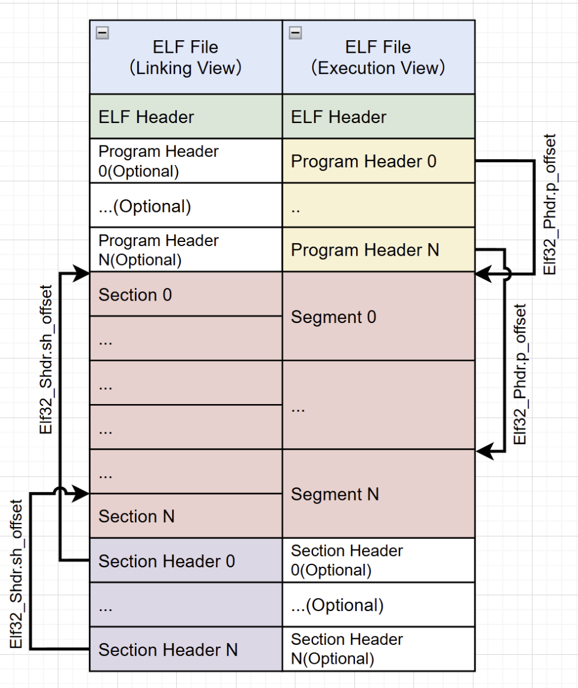
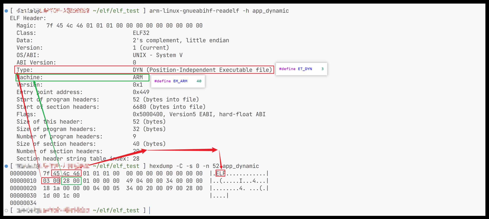
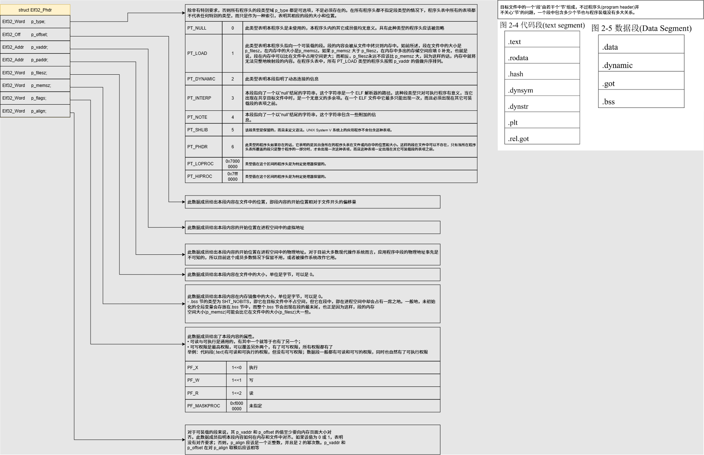
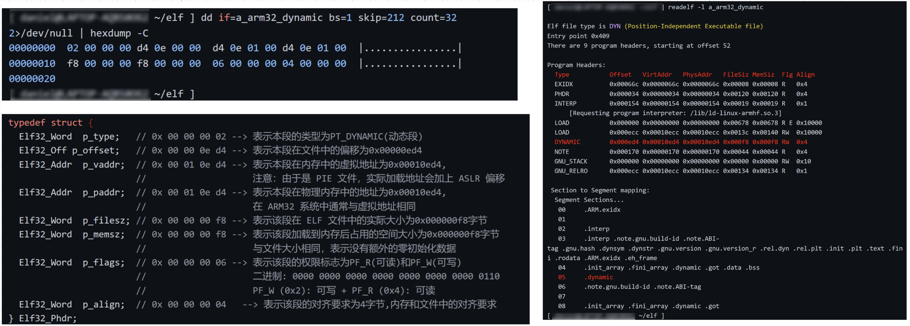
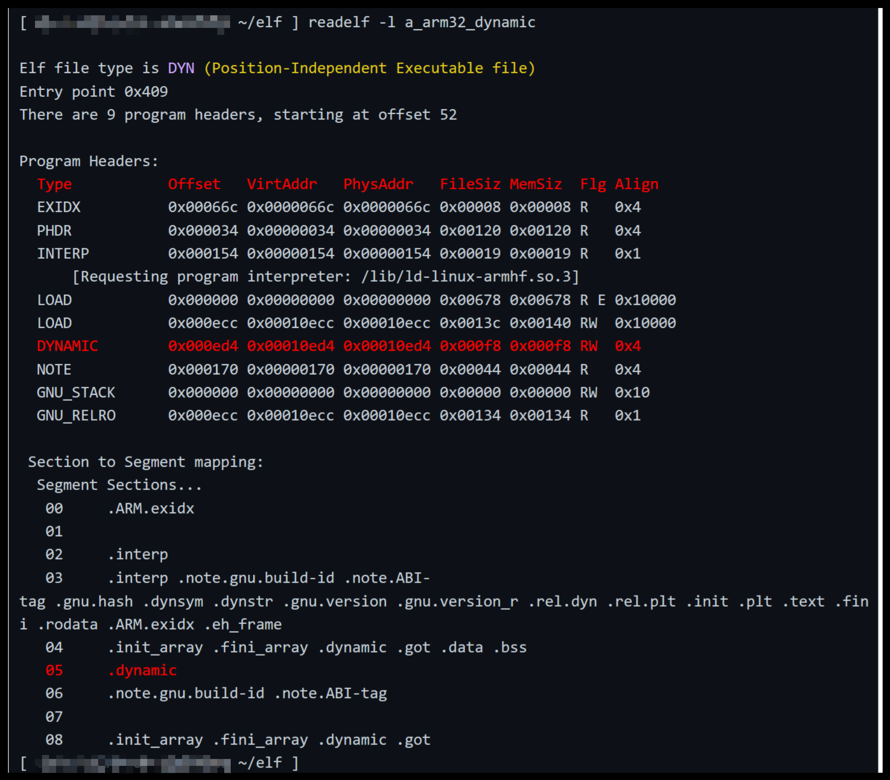
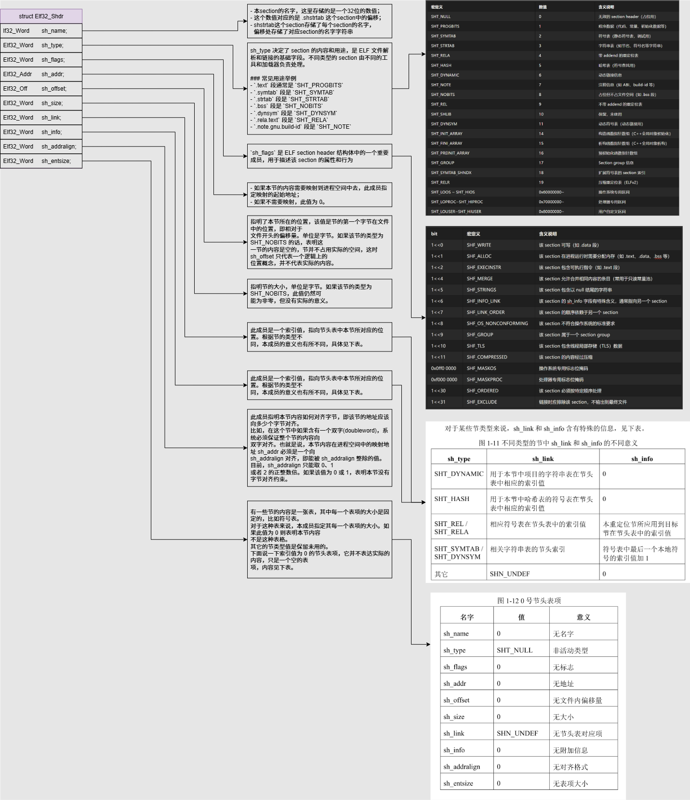
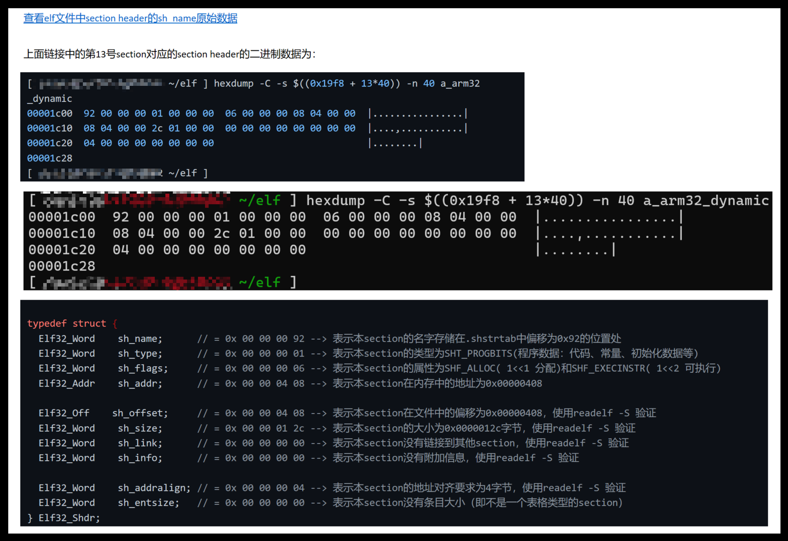
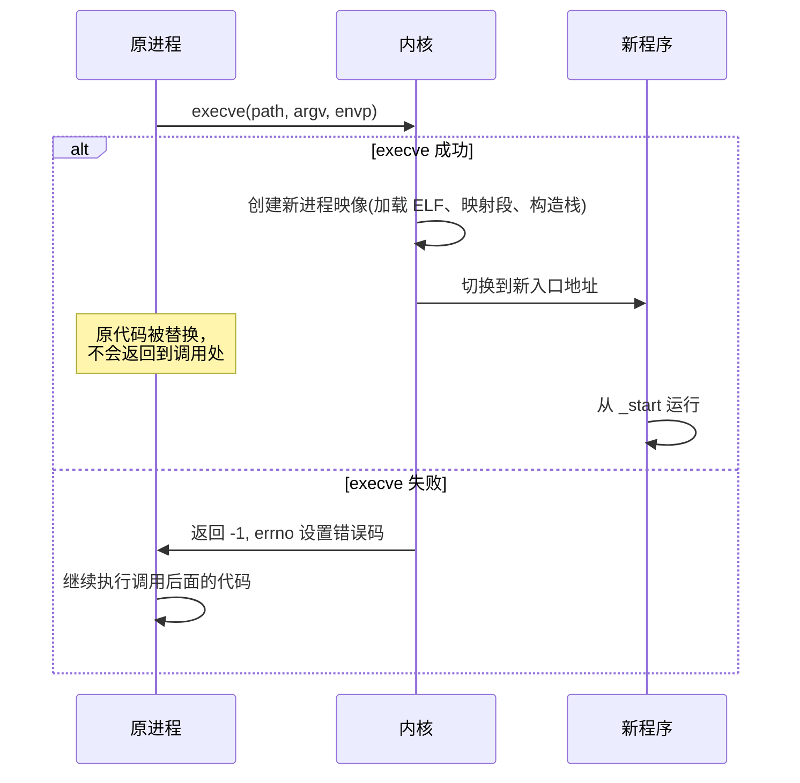

# ELF文件及Liteos_a内核加载ELF文件分析

[TOC]

# 1、ELF 文件的介绍

​	ELF（Executable and Linkable Format）是Linux及类Unix系统中用于可执行文件、共享库、目标代码和核心转储的标准二进制文件格式。它取代了早期的a.out和COFF格式，因其可扩展性、跨平台性和高效性成为现代操作系统的核心文件格式。


# 2、ELF 文件的具体格式分析

## 2.1、ELF 文件整体结构

ELF文件的基本类型，具体可分为：

- 可重定位文件(relocatable file，就是大家平常见到的.o文件)
    - 可重定位文件用在编译和链接阶段；

- 可执行文件(executable file, 比如在进程分析那篇文章中提到的“mksh”、“init”等没有扩展名的文件)
    - 可执行文件用在程序运行阶段；

- 共享库文件(shared object file，就是.so文件，用来做动态链接)
    - 共享库则同时用在编译链接和运行阶段。

- 核心转储文件(core dump file，就是core dump文件)
    - 核心转储文件是操作系统在程序异常终止时自动生成的内存快照文件，主要用于**记录程序崩溃瞬间的运行状态**，为调试和故障分析提供关键数据。

这里不介绍 core dump 文件格式。本篇文章的重点在于分析操作系统如何加载可执行程序，所有只前三个类型的ELF文件格式。

在不同阶段，使用不同视角（链接视角、执行视角）来理解ELF文件，整体布局（32位ELF文件、64位类似）如下图所示：



- ELF Header, ELF头部，定义ELF文件的全局性信息。
- Program Header Table， 描述段(Segment)信息的数组，每个元素对应一个段；通常包含在可执行文件中，可重定文件中可选(通常不包含)
- Segment and Section，段(Segment)由若干节(Section)组成；段在运行时被加载到进程地址空间中，包含在可执行文件中；节是段的组成单元，包含在可执行文件和可重定位文件中
- Section Header Table，描述节(Section)信息的数组，每个元素对应一个节；通常包含在可重定位文件中，可执行文件中为可选(通常包含)

接下来我们就使用32位系统的ELF格式继续具体的分析。


## 2.1、ELF Header 结构

ELF Header 使用一个结构体描述，例如在musl c库中有如下定义：

```c
// third_party_musl\include\elf.h
typedef struct {
  unsigned char	e_ident[EI_NIDENT];
  Elf32_Half	e_type;
  Elf32_Half	e_machine;
  Elf32_Word	e_version;
  Elf32_Addr	e_entry;
  Elf32_Off		e_phoff;
  Elf32_Off		e_shoff;
  Elf32_Word	e_flags;
  Elf32_Half	e_ehsize;
  Elf32_Half	e_phentsize;
  Elf32_Half	e_phnum;
  Elf32_Half	e_shentsize;
  Elf32_Half	e_shnum;
  Elf32_Half	e_shstrndx;
} Elf32_Ehdr;
```

ELF32 文件头（Elf32_Ehdr）成员作用一览表：

| **成员名**        | **数据类型**    | **作用描述**                                                 | **关键细节**                                                 |
| ----------------- | --------------- | ------------------------------------------------------------ | ------------------------------------------------------------ |
| **`e_ident[16]`** | `unsigned char` | **ELF 身份标识**，包含文件格式的魔数、位数（32/64）、字节序、版本等 | **前 4 字节固定**：`0x7F` + `'E'` + `'L'` + `'F'`  **第 5 字节（EI_CLASS）**：`1`=32 位，`2`=64 位  **第 6 字节（EI_DATA）**：`1`=小端序，`2`=大端序 |
| **`e_type`**      | `Elf32_Half`    | **文件类型**，标识是目标文件、可执行文件还是共享库           | `ET_REL=1`（可重定位文件，如 `.o`）  `ET_EXEC=2`（可执行文件）  `ET_DYN=3`（共享库，如 `.so`） |
| **`e_machine`**   | `Elf32_Half`    | **目标机器架构**，指定 CPU 类型                              | `EM_386=3`（x86）  `EM_ARM=40`（ARM）  `EM_MIPS=8`（MIPS）   |
| **`e_version`**   | `Elf32_Word`    | **ELF 版本号**，固定为 `EV_CURRENT`（当前版本，通常为 1）    | 用于兼容性检查                                               |
| **`e_entry`**     | `Elf32_Addr`    | **程序入口虚拟地址**，操作系统加载后从此地址开始执行         | 可执行文件（`ET_EXEC`）中为有效地址（如 `0x8048000`）  目标文件（`ET_REL`）中为 `0` |
| **`e_phoff`**     | `Elf32_Off`     | **程序头表（Program Header Table）在文件中的偏移**           | 若为 `0`，表示无程序头表（如目标文件）                       |
| **`e_shoff`**     | `Elf32_Off`     | **节头表（Section Header Table）在文件中的偏移**             | 定位所有节（Section）的元数据                                |
| **`e_flags`**     | `Elf32_Word`    | **处理器特定标志**，与架构相关（ARM 中用于指定 ABI 版本等）  | x86 平台通常为 `0`                                           |
| **`e_ehsize`**    | `Elf32_Half`    | **ELF 头大小（字节）**，固定为 `sizeof(Elf32_Ehdr)=52`（32 位） | 用于验证文件完整性                                           |
| **`e_phentsize`** | `Elf32_Half`    | **程序头表中每个条目的大小（字节）**                         | 应等于 `sizeof(Elf32_Phdr)`（32 位下通常为 32）              |
| **`e_phnum`**     | `Elf32_Half`    | **程序头表中的条目数量**（即段的个数）                       | `0` 表示无可加载段                                           |
| **`e_shentsize`** | `Elf32_Half`    | **节头表中每个条目的大小（字节）**                           | 应等于 `sizeof(Elf32_Shdr)`（32 位下通常为 40）              |
| **`e_shnum`**     | `Elf32_Half`    | **节头表中的条目数量**（即节的个数）                         | 若超过 `SHN_LORESERVE=0xFF00`，需通过节头表第 0 项的实际值解析 |
| **`e_shstrndx`**  | `Elf32_Half`    | **节名称字符串表的索引号**，指向存储所有节名的字符串表（如 `.shstrtab`） | 若为 `SHN_UNDEF=0`，表示无节名字符串表                       |


其中关键字段协作关系：

1. 文件定位
    - 加载器通过 `e_phoff` 和 `e_phentsize` 定位程序头表，解析内存映射信息（如代码段/数据段）。
    - 链接器通过 `e_shoff` 和 `e_shentsize` 定位节头表，获取 `.text`、`.data` 等节的数据偏移。
2. 动态链接
    - `e_entry` 在动态链接时指向动态链接器（如 `/lib/ld-linux.so`）的入口，而非程序 main 函数。
3. 节名解析
    - `e_shstrndx` 指向的字符串表存储所有节名（如 `.text`），节头表中的 `sh_name` 字段是其在该表的偏移量。


使用 readelf -h 工具验证示例：




ELF32 文件头是操作系统加载二进制文件的“导航图”：

- **前 16 字节** 提供文件基础标识（魔数、位宽、字节序）。
- **`e_phoff` 和 `e_shoff`** 分别指向段（执行视图）和节（链接视图）的元数据表。
- **`e_shstrndx`** 是理解节名含义的钥匙，而 **`e_entry`** 决定了程序执行起点。
     掌握这些字段，即可理解二进制文件如何被系统加载、链接和运行。


## 2.2、ELF Program Header 结构

ELF Program Header 使用一个结构体 Elf32_Phdr 描述，例如在musl c库中有如下定义：

```c
// third_party_musl\include\elf.h
typedef struct {
  Elf32_Word	p_type;     // 0x 00 00 00 02 --> 表示本段的类型为PT_DYNAMIC(动态段)
  Elf32_Off		p_offset;   // 0x 00 00 0e d4 --> 表示本段在文件中的偏移为0x00000ed4
  Elf32_Addr	p_vaddr;    // 0x 00 01 0e d4 --> 表示本段在内存中的虚拟地址为0x00010ed4,
                            //                    注意：由于是 PIE 文件，实际加载地址会加上 ASLR 偏移
  Elf32_Addr	p_paddr;    // 0x 00 01 0e d4 --> 表示本段在物理内存中的地址为0x00010ed4,
                            //                    在 ARM32 系统中通常与虚拟地址相同
  Elf32_Word	p_filesz;   // 0x 00 00 00 f8 --> 表示该段在 ELF 文件中的实际大小为0x000000f8字节
  Elf32_Word	p_memsz;    // 0x 00 00 00 f8 --> 表示该段加载到内存后占用的空间大小为0x000000f8字节
                            //                    与文件大小相同，表示没有额外的零初始化数据
  Elf32_Word	p_flags;    // 0x 00 00 00 06 --> 表示该段的权限标志为PF_R(可读)和PF_W(可写)
                            //                    二进制: 0000 0000 0000 0000 0000 0000 0000 0110
                            //                    PF_W (0x2): 可写 + PF_R (0x4): 可读   
  Elf32_Word	p_align;    // 0x 00 00 00 04   --> 表示该段的对齐要求为4字节,内存和文件中的对齐要求
} Elf32_Phdr;
```

ELF32 程序头表项（Elf32_Phdr）成员作用一览表：

| **成员名**     | **数据类型** | **作用描述**                                     | **关键细节**                                                 |
| -------------- | ------------ | ------------------------------------------------ | ------------------------------------------------------------ |
| **`p_type`**   | `Elf32_Word` | **段类型**，定义段的用途或解释方式               | **常见类型**：  • `PT_LOAD=1`（可加载段，如代码/数据段）  • `PT_DYNAMIC=2`（动态链接信息段）  • `PT_INTERP=3`（动态链接器路径，如 `/lib/ld-linux.so`）  • `PT_NOTE=4`（辅助信息段）  • `PT_PHDR=6`（程序头表自身位置）  • `PT_TLS=7`（线程局部存储段） |
| **`p_offset`** | `Elf32_Off`  | **段在文件中的偏移**，指向段数据的起始位置       | • 从文件开头到段数据的字节偏移  • 若为 `PT_PHDR` 类型，指向程序头表自身位置 |
| **`p_vaddr`**  | `Elf32_Addr` | **段在内存中的虚拟地址**，加载后首字节的虚拟地址 | • 可执行文件加载时需满足：`p_vaddr ≡ p_offset mod p_align`  • PIE 文件需加上 ASLR 偏移 |
| **`p_paddr`**  | `Elf32_Addr` | **物理地址**，保留给无虚拟内存的系统             | • 在 Linux/ARM 等支持虚拟内存的系统中通常与 `p_vaddr` 相同  • 应用程序中可忽略 |
| **`p_filesz`** | `Elf32_Word` | **段在文件中的长度**（字节）                     | • 可能为 `0`（如 `.bss` 段在文件中无内容）  • 若 `p_memsz > p_filesz`，内存中多出部分填 `0` |
| **`p_memsz`**  | `Elf32_Word` | **段在内存中的长度**（字节）                     | • 必须 `≥ p_filesz`（如 `.bss` 段在文件中大小为 `0`，内存中需分配未初始化数据空间） |
| **`p_flags`**  | `Elf32_Word` | **段权限标志**，控制内存访问属性                 | **标志位掩码**：  • `PF_R=4`（可读）  • `PF_W=2`（可写）  • `PF_X=1`（可执行）  例：`0x6`（二进制 `110`）表示 `PF_R+PF_W` |
| **`p_align`**  | `Elf32_Word` | **段对齐要求**（文件与内存）                     | • **值 `0` 或 `1`\**：无对齐要求  • \**其他值**：必须是 **2 的正整数次幂**（如 `4`, `0x10000`）  • 需满足：`p_vaddr ≡ p_offset mod p_align` |



其中的关键字段说明：

1. **加载段（PT_LOAD）**
    - 唯一可被直接映射到内存的段类型，按 `p_vaddr` 升序排列。
    - 包含代码（`.text`）、数据（`.data`）、未初始化数据（`.bss`）等核心内容。
2. **动态链接相关段**
    - **`PT_INTERP`**：指定动态链接器路径（如 `/lib/ld-linux-armhf.so.3`），必须在可加载段之前。
    - **`PT_DYNAMIC`**：包含动态链接表（`.dynamic` 节），如符号表、重定位表地址。
3. **对齐约束**
    - 可加载段必须满足 **`p_vaddr ≡ p_offset mod p_align`**，否则加载失败。例如对齐值 `0x10000` 要求段在文件/内存中按 **64KB** 对齐。
4. **权限与内存保护**
    - `p_flags` 直接对应内存页的 `PROT_READ`/`PROT_WRITE`/`PROT_EXEC` 标志，影响内存安全性（如 `PF_X` 缺失可防止代码注入）。


使用 dd 工具验证示例：




## 2.3、ELF Section 结构

​	ELF（Executable and Linkable Format）文件中的 **Section（节）** 是链接视图的核心单元，用于组织代码、数据、符号和元数据。以下介绍section的整体结构，对于具体的某个section信息，比如.text、data等等的数据存储格式，各位自行网上搜索即可，需要什么学什么，要有针对性的学习并掌握。


### 2.3.1、Section的核心作用

1. **功能划分**

    Section按功能将程序划分为逻辑单元，便于编译器和链接器处理不同类型的资源。例如：

    - `.text`：存储可执行指令（代码）
    - `.data`/`.rodata`：存储已初始化数据/只读常量
    - `.bss`：预留未初始化全局变量的内存空间（文件不占空间，加载时分配零页）

2. **链接与重定位**

    - 可重定位文件（`.o`）包含重定位信息（如 `.rel.text`），指导链接器修正外部符号引用。
    - 符号表（`.symtab`）记录函数、变量地址和类型，支持跨文件符号解析。

3. **调试与元数据**

    - `.debug`：存储调试信息（需 `-g`编译选项）
    - `.strtab`：字符串表，存储节名和符号名
    - `.comment`：编译器版本信息。


### 2.3.2、常见Section及其属性

| **Section名称** |  **类型标志**  |        **内存标志**         |               **内容描述**               |
| :-------------: | :------------: | :-------------------------: | :--------------------------------------: |
|   **`.text`**   | `SHT_PROGBITS` | `SHF_ALLOC + SHF_EXECINSTR` |           程序代码（机器指令）           |
|   **`.data`**   | `SHT_PROGBITS` |   `SHF_ALLOC + SHF_WRITE`   |          已初始化全局/静态变量           |
|   **`.bss`**    |  `SHT_NOBITS`  |   `SHF_ALLOC + SHF_WRITE`   | 未初始化全局/静态变量（内存中初始化为0） |
|  **`.rodata`**  | `SHT_PROGBITS` |         `SHF_ALLOC`         | 只读数据（如字符串常量、const全局变量）  |
| **`.got.plt`**  | `SHT_PROGBITS` |   `SHF_ALLOC + SHF_WRITE`   |      全局偏移表（动态链接跳转地址）      |
| **`.dynamic`**  | `SHT_DYNAMIC`  |         `SHF_ALLOC`         |       动态链接库依赖和重定位表指针       |
|  **`.symtab`**  |  `SHT_SYMTAB`  |              -              |      符号表（函数/变量地址和类型）       |
| **`.shstrtab`** |  `SHT_STRTAB`  |              -              |        所有Section名称的字符串表         |


更具体的section：


## 2.4、ELF  Segment 结构

​	ELF 文件中的 **Segment（段）** 是程序执行视图的核心单元，由操作系统加载器（Loader）根据程序头表（Program Header Table）解析，用于指导文件内容如何映射到进程内存空间。

### 2.4.1、Segment 的定义与核心作用

1. **本质**

    Segment 是多个 **Section（节）的集合**，这些 Section 具有**相同的内存访问属性**（如可读、可写、可执行）。例如，`.text`（代码）和 `.rodata`（只读数据）通常合并为**只读可执行段**（R-X），而 `.data`（已初始化数据）和 `.bss`（未初始化数据）合并为**可读写段**（RW-）。

    - **关键区别**：
        - **Section**：链接视图的逻辑单元，供编译器和链接器使用（如符号解析）。
        - **Segment**：执行视图的物理单元，供操作系统加载程序到内存。

2. **核心目标**

    - **减少内存碎片**：操作系统以 **页（Page，通常 4KB）** 管理内存。合并 Section 可避免小尺寸 Section 独占整页（例如：`.text`（4097B）和 `.init`（512B）未合并需 3 页；合并后仅需 2 页）。
    - **统一权限管理**：以 Segment 为单位设置内存页权限（如 `R-X`或 `RW-`），避免为每个 Section 单独设置权限，提高安全性并降低 TLB 压力。
    - **优化加载效率**：程序头表预先定义 Segment 布局，加载器直接映射文件偏移到虚拟地址，无需解析单个 Section。


### 2.4.2、常见 Segment 类型详解

以下为程序头表中的主要 Segment 类型及其作用：

| **Segment 类型** | **作用描述**                                            | **包含的典型 Section**              | **内存权限** |
| :--------------: | :------------------------------------------------------ | :---------------------------------- | :----------- |
|    **`LOAD`**    | 需加载到内存的代码或数据段，程序主体内容                | `.text`、`.rodata`、`.data`、`.bss` | `R-X`或 `RW` |
|  **`DYNAMIC`**   | 动态链接信息段，存储共享库依赖和重定位表                | `.dynamic`、`.got.plt`              | `RW`         |
|   **`INTERP`**   | 指定动态链接器路径（如 `/lib/ld-linux.so.2`）           | `.interp`                           | `R`          |
|    **`PHDR`**    | 程序头表自身的位置                                      | 程序头表                            | `R`          |
|    **`TLS`**     | 线程局部存储（Thread-Local Storage）数据                | `.tdata`、`.tbss`                   | `RW`         |
| **`GNU_STACK`**  | 控制**栈权限**（如禁止栈执行，防御缓冲区溢出攻击）      | 无实际内容，仅标志属性              | `RW`（默认） |
| **`GNU_RELRO`**  | 指定重定位后只读的段，增强安全性（如保护 GOT 表防篡改） | `.got`、`.dynamic`                  | `R`          |

> - `LOAD`段通常有 **两个**：
>     - **代码段**（`R-X`）：包含 `.text`（指令）、`.rodata`（常量）等。
>     - **数据段**（`RW`）：包含 `.data`（初始化变量）、`.bss`（未初始化变量）。
> - `.bss`在文件中无内容（`NOBITS`），但 `MemSiz > FileSiz`，加载时额外分配归零内存。


### 2.4.3、section与segment的对应关系




## 2.5、ELF Section Header 结构

ELF Section Header 使用一个结构体 Elf32_Shdr 描述，例如在musl c库中有如下定义：

```c
// third_party_musl\include\elf.h
typedef struct {
  Elf32_Word	sh_name;      // = 0x 00 00 00 92 --> 表示本section的名字存储在.shstrtab中偏移为0x92的位置处
  Elf32_Word	sh_type;      // = 0x 00 00 00 01 --> 表示本section的类型为SHT_PROGBITS(程序数据：代码、常量、初始化数据等)
  Elf32_Word	sh_flags;     // = 0x 00 00 00 06 --> 表示本section的属性为SHF_ALLOC( 1<<1 分配)和SHF_EXECINSTR( 1<<2 可执行)
  Elf32_Addr	sh_addr;      // = 0x 00 00 04 08 --> 表示本section在内存中的地址为0x00000408

  Elf32_Off		sh_offset;    // = 0x 00 00 04 08 --> 表示本section在文件中的偏移为0x00000408
  Elf32_Word	sh_size;      // = 0x 00 00 01 2c --> 表示本section的大小为0x0000012c字节
  Elf32_Word	sh_link;      // = 0x 00 00 00 00 --> 表示本section没有链接到其他section
  Elf32_Word	sh_info;      // = 0x 00 00 00 00 --> 表示本section没有附加信息

  Elf32_Word	sh_addralign; // = 0x 00 00 00 04 --> 表示本section的地址对齐要求为4字节
  Elf32_Word	sh_entsize;   // = 0x 00 00 00 00 --> 表示本section没有条目大小（即不是一个表格类型的section）
} Elf32_Shdr;
```

ELF32 程序头表项（Elf32_Shdr）成员作用一览表：

|     **成员名**     | **数据类型** |                        **作用描述**                        |                         **关键细节**                         |
| :----------------: | :----------: | :--------------------------------------------------------: | :----------------------------------------------------------: |
|   **`sh_name`**    | `Elf32_Word` | **节名称在字符串表中的索引**，指向 `.shstrtab`节的偏移位置 | • 示例值 `0x92`表示节名存储在 `.shstrtab`节偏移 `0x92`处 • 实际名称如 `.text`/`.data`需解析字符串表获取 |
|   **`sh_type`**    | `Elf32_Word` |            **节的类型**，定义节内容的语义和用途            | **常见类型**： • `SHT_PROGBITS=1`（程序数据：代码/常量/初始化数据） • `SHT_NOBITS=8`（如 `.bss`节，文件中不占空间） • `SHT_SYMTAB=2`（符号表） • `SHT_STRTAB=3`（字符串表） • `SHT_REL=9`（重定位表） |
|   **`sh_flags`**   | `Elf32_Word` |           **节的标志位**，控制内存分配和访问属性           | **标志位掩码**： • `SHF_ALLOC=0x2`（需加载到内存） • `SHF_EXECINSTR=0x4`（包含可执行指令） • `SHF_WRITE=0x1`（可写） 示例值 `0x6`（二进制 `110`）表示 `SHF_ALLOC + SHF_EXECINSTR`（代码段属性） |
|   **`sh_addr`**    | `Elf32_Addr` |        **节在内存中的虚拟地址**，加载后首字节的位置        | • 可执行文件中为实际地址（如 `0x00000408`） • 可重定位文件（`.o`）中为 `0`（链接时确定） |
|  **`sh_offset`**   | `Elf32_Off`  |     **节在文件中的偏移量**，从文件头到节数据的起始位置     | • 示例值 `0x00000408`表示从文件开头偏移 `0x408`字节处存储该节 • 若为 `SHT_NOBITS`类型（如 `.bss`），此值仅表示逻辑位置 |
|   **`sh_size`**    | `Elf32_Word` |                **节在文件中的大小**（字节）                | • 对于 `.bss`节（`SHT_NOBITS`），文件大小为 `0`，但内存大小非零 • 示例值 `0x12C`表示该节占用 `300`字节 |
|   **`sh_link`**    | `Elf32_Word` |              **关联节的索引**，解释依赖节类型              | **语义依赖**： • 符号表（`.symtab`）→ 关联的字符串表索引（`.strtab`） • 重定位表（`.rel.text`）→ 关联的符号表索引 • 示例值 `0`表示无关联节 |
|   **`sh_info`**    | `Elf32_Word` |              **附加信息索引**，解释依赖节类型              | **语义依赖**： • 符号表 → 局部符号起始索引 • 重定位表 → 目标节索引（如 `.text`） • 示例值 `0`表示无附加信息 |
| **`sh_addralign`** | `Elf32_Word` |                **节地址对齐要求**（内存中）                | • 必须是 **2 的幂次**（如 `4`/`16`） • 值 `0`或 `1`表示无对齐约束 • 示例值 `4`要求地址是 `4`的倍数 |
|  **`sh_entsize`**  | `Elf32_Word` |    **固定大小条目表的条目大小**（如符号表每条记录大小）    | • 非表结构（如代码节）为 `0` • 符号表（`.symtab`）中为 `sizeof(Elf32_Sym)=16` • 重定位表中为 `sizeof(Elf32_Rel)=8` |




其中的关键字段说明：

1. **节名称解析流程**

    `sh_name`的值是 `.shstrtab`节（节名称字符串表）中的偏移量。例如：

    - 若 `.shstrtab`内容为 `\0.text\0.data\0.bss`，则 `sh_name=1`指向 `"text"`，`sh_name=6`指向 `"data"`。

2. **节类型与标志的关系**

    - **代码节**（如 `.text`）：`sh_type=SHT_PROGBITS`+ `sh_flags=SHF_ALLOC|SHF_EXECINSTR`
    - **数据节**（如 `.data`）：`sh_type=SHT_PROGBITS`+ `sh_flags=SHF_ALLOC|SHF_WRITE`
    - **未初始化数据节**（如 `.bss`）：`sh_type=SHT_NOBITS`+ `sh_flags=SHF_ALLOC|SHF_WRITE`。

3. **内存与文件大小的差异**

    对于 `.bss`节：

    - `sh_size=0`（文件中不占用空间）
    - 但加载到内存时需分配 `sh_size`字节并初始化为 `0`（通过 `p_memsz`在程序头中定义）。

4. **对齐约束的强制要求**

    加载器需确保：`sh_addr % sh_addralign == 0`。例如对齐值 `0x1000`（4KB）时，地址必须是 `0x1000`的倍数 。

5. **`sh_link`和 `sh_info`的联合使用**

    - **符号表**（`sh_type=SHT_SYMTAB`）：
        - `sh_link`→ 关联字符串表索引（`.strtab`）
        - `sh_info`→ 局部符号起始索引（全局符号从 `0`开始）
    - **重定位表**（`sh_type=SHT_REL`）：
        - `sh_link`→ 关联符号表索引
        - `sh_info`→ 目标节索引（如 `.text`的索引）。


使用 hexdump 工具验证示例：




# 3、ELF文件的生成流程

整体流程：源文件 ==> .i 文件 ==> .s 文件 ==> .o 文件 ==> 可执行文件 / .so 文件

这个流程是传统编译器在编译源文件的流程，目前现代编译器都有各自优化的方式，不会按照这种传统流程一步步编译源文件，不过对于了解编译的核心原理来说，传统流程还是足够了。

各位网友对于编译器感兴趣的自行上网搜索学习，也可分享出来，造福大众。


## 3.1、源文件 ==> .i 文件

宏展开、include包含展开：

```bash
预处理（动态）: module1.c --> module1.dynamic.i
arm-linux-gnueabihf-gcc -Wno-unused-variable -marm \
    -march=armv7-a -mfpu=vfpv3-d16 -mfloat-abi=hard -fPIC -E module1.c -o module1.dynamic.i
```


## 3.2、.i 文件 ==> .s 文件

编译成.s汇编文件：

```bash
编译汇编（动态）: module1.dynamic.i --> module1.dynamic.s
arm-linux-gnueabihf-gcc -Wno-unused-variable -marm -march=armv7-a \
    -mfpu=vfpv3-d16 -mfloat-abi=hard -fPIC -S module1.dynamic.i -o  module1.dynamic.s  
```


## 3.3、.s 文件 ==> .o 文件

汇编成 可重定位的.o目标文件，包含Section Header Table，没有Program Header Table：

```bash
汇编（动态）: module1.dynamic.s --> module1.dynamic.o
arm-linux-gnueabihf-gcc -Wno-unused-variable -marm -march=armv7-a -mfpu=vfpv3-d16 \
    -mfloat-abi=hard -fPIC -c module1.dynamic.s -o module1.dynamic.o
```


## 3.4、.o 文件 ==> .so 文件

.so 文件通常都有Section Header Table和Program Header Table，可参与链接过程：

```bash
创建共享库（使用PIC）...
arm-linux-gnueabihf-gcc -Wno-unused-variable -marm -march=armv7-a -mfpu=vfpv3-d16 -mfloat-abi=hard \
    -fPIC -shared -Wl,-soname,libmodules.so module1.dynamic.o module2.dynamic.o -o libmodules.so
```


## 3.5、.o/.so 文件 ==> 动态链接可执行文件

```bash
链接动态可执行文件（使用PIC）...
arm-linux-gnueabihf-gcc -Wno-unused-variable -marm -march=armv7-a -mfpu=vfpv3-d16 -mfloat-abi=hard \
    -fPIC main.dynamic.o -L. -lmodules -Wl,-rpath,. -o app_dynamic
```


## 3.6、.o 文件 ==> 静态库 .a 文件

```bash
创建静态库（不使用PIC）...
arm-linux-gnueabihf-ar rcs libmodules.a module1.static.o module2.static.o
```


## 3.7、.o 文件 ==> 静态链接可执行文件

```bash
链接静态可执行文件（不使用PIC）...
arm-linux-gnueabihf-gcc -Wno-unused-variable -marm -march=armv7-a -mfpu=vfpv3-d16 \
    -mfloat-abi=hard -static main.static.o libmodules.a -o app_static
```


# 4、ELF文件的通用加载流程分析

## 4.1、通用流程图

​	对于可执行文件的加载，每个操作系统内核在细节上各有不同，但在整体的架构上都遵循类似的流程，大致有如下几步：


* 1、用户态通过系统调用传入参数到内核态并验证

    * 用户态的应用程序使用 execve 家族的库函数，借助系统调用将可执行文件的所在路径、加载程序所需参数等等传入内核态。到了内核态会对这些信息进行验证。
* 2、创建新的进程空间
    * 在内核中申请一个新的进程空间结构体。

* 3、切换到新的进程空间
    * 将当前进程的进程空间，从旧的切换成新的，并备份旧的。

* 4、映射PT_LOAD类型的Segment

    *  在新进程空间中申请虚拟内存区域并与elf文件中PT_LOAD类型的Segment关联
    * 将此虚拟内存区域 和某个 具体的文件对应的 内核节点（比如Liteos_a内核中使用Vnode）绑定
      （`region->unTypeData.rf.vnode = filep->f_vnode;`）

* 5、销毁旧的进程空间

    * 将旧进程空间所占内存释放。

* 6、构造新程序的CPU寄存器和用户态上下文

    * 将当前线程的进程空间指向新的进程空间；
    * 构造当前线程在用户态的上下文（栈、返回地址等等）。

* 7、跳转执行新程序

    * execve从用户态使用系统调用进入内核态，完成前面流程之后，按照原来返回，

    * 不过返回的是新程序的入口地址，不向普通系统调用返回的是原程序，

    - Liteos_a内核的系统调用返回指令类似如下：
      
        ```assembly
        LDMFD  SP!, {R0-R3, R12, LR}	@ 恢复R0-R3、R12、LR
        RFEIA  SP!                   	@ 异常返回，恢复到用户态
        ```


## 4.2、execve 测试用例

这里使用 WSL2 中的 linux x86-64 进行测试，其他系统和架构类似。


### 4.2.1、测试用例代码

```c
// test_execve.c
#include <stdio.h>
#include <unistd.h>
#include <errno.h>
#include <string.h>

int main(void) {
    printf("PID: %d - Start of program\n", getpid());

    char *args[] = {"/bin/echo", "Hello from execve", NULL};

    // 改成一个不存在的路径来测试失败的情况
    const char *path = "/bin/echo"; // 改成 "/bin/nonexist" 试试

    printf("Calling execve: %s\n", path);
    if (execve(path, args, NULL) == -1) {
        // execve 返回，说明执行失败
        printf("execve failed: %s\n", strerror(errno));
        printf("Continuing in original process after execve failure...\n");
    }
	
    // execve 执行成功之后是不会运行到这里输出 End of Program 的
    printf("PID: %d - End of program\n", getpid());
    return 0;
}
```


### 4.2.2、测试方法说明

1、测试成功情况

```bash
userNamel@HostName ~/test
$ gcc test_execve.c -o test_execve
```

输出类似：

```bash
userNamel@HostName ~/test
$ ./test_execve
PID: 418 - Start of program
Calling execve: /bin/echo
Hello from execve
```

注意：**没有**输出 `End of program`，因为 `execve` 成功替换了进程映像。


2、测试失败情况

把：

```c
const char *path = "/bin/echo";
```

改成：

```c
const char *path = "/bin/nonexist";
```

重新编译并运行：

```bash
userNamel@HostName ~/test
$ ./test_execve
PID: 439 - Start of program
Calling execve: /bin/nonexist
execve failed: No such file or directory
Continuing in original process after execve failure...
PID: 439 - End of program
```

这里 `execve` 返回 `-1`，errno 提示错误原因，进程继续执行原代码。


### 4.2.3、execve 成功/失败对比时序图




# 5、Liteos_a内核加载ELF文件的流程

用户态 execve 函数得到整体调用链：

```c
// third_party_musl\src\process\execve.c
int execve(const char *path, char *const argv[], char *const envp[])
	syscall(SYS_execve, path, argv, envp);
	// kernel_liteos_a\syscall\syscall_lookup.h
	SYSCALL_HAND_DEF(__NR_execve, SysExecve, int, ARG_NUM_3)
	// kernel_liteos_a\syscall\fs_syscall.c
	SysExecve
		LOS_DoExecveFile
// 1、检查用户态通过系统调用传入的 execve 参数
            // 1.1、检查参数有效性：文件名不能为空，argv/envp如果不为空必须是用户空间地址
            if ((fileName == NULL) || ((argv != NULL) && 
                !LOS_IsUserAddress((VADDR_T)(UINTPTR)argv)) ||
                ((envp != NULL) && 
                !LOS_IsUserAddress((VADDR_T)(UINTPTR)envp))) { return -EINVAL; }
            // 1.2、拷贝用户参数到内核空间(可执行文件的路径名)，并做合法性校验
            ret = OsCopyUserParam(&loadInfo, fileName, kfileName, PATH_MAX);
            #ifdef LOSCFG_SHELL
                // 1.3、获取文件真实路径，失败则返回文件不存在
                if (OsGetRealPath(kfileName, 
                                  buf, (PATH_MAX + 1)) != LOS_OK) { return -ENOENT; }
                // 1.4、如果获取到的路径非空，则用真实路径作为文件名
                if (buf[0] != '\0') { loadInfo.fileName = buf; }
            #endif
// 2、创建新的用户虚拟地址空间
		loadInfo.newSpace = OsCreateUserVmSpace();
		...
        ret = OsLoadELFFile(&loadInfo);
			OsFlushAspace(loadInfo);
// 3、保存旧的进程空间，并切换到新的进程空间
				OsExecProcessVmSpaceReplace
// 4、映射 PT_LOAD 类似的 Segment 到新的进程空间中
			// 将ELF各个LOAD段映射到新虚拟空间，设置入口地址和栈。
			ret = OsLoadELFSegment(loadInfo);
				OsMmapELFFile
                    OsDoMmapFile
// 5、销毁旧的进程空间
		OsExecRecycleAndInit
        	LOS_VmSpaceFree(oldSpace);
// 6、构造新程序的CPU寄存器和用户态上下文
		ret = OsExecve(&loadInfo);
            OsExecStart
                taskCB->userMapBase = mapBase;
                taskCB->userMapSize = mapSize;
				// 构造新程序的用户态入口函数
                taskCB->taskEntry = (TSK_ENTRY_FUNC)entry;
				// 构造新程序的就寄存器上下文
                TaskContext *taskContext = (TaskContext *)OsTaskStackInit(...);
				// 构造新程序的栈上下文
				OsUserTaskStackInit(taskContext, (UINTPTR)taskCB->taskEntry, sp);
// 7、跳转执行新程序
        // 按照系统调用流程原路返回用户空间，不过是返回新程序入口地址
        // 由于用户态的execve是通过系统调用（使用的是 _osExceptSwiHdl 异常）进入内核态的，
        // 所以execve函数会从 _osExceptSwiHdl 异常处理程序返回用户态，
        // 但是返回地址已经被更换成了新程序的入口函数，一般是elf文件的main函数
        // 或者加载器的入口函数，liteos_a内核中的加载器是/lib/libc.so
        // 所以在执行完 _osExceptSwiHdl 模式切换的 
        // RFEIA   SP!   @ 异常返回，恢复到用户态
        // 这条指令之后，CPU就运行在新程序当中了，原先的进程空间已经被销毁。
        return loadInfo.stackTop;  // 返回新进程栈顶地址
```

其中的 OsCreateUserVmSpace 函数：

```c
// kernel_liteos_a\kernel\base\vm\los_vm_map.c
LosVmSpace *OsCreateUserVmSpace(VOID)
{
    // 1、分配进程空间 LosVmSpace 结构体的内存
    LosVmSpace *space = LOS_MemAlloc(m_aucSysMem0, sizeof(LosVmSpace));
	// 2、分配新进程空间对应页表所需的物理内存页（4K，Liteos_a内核使用二级页表，4K大小的页面）
    VADDR_T *ttb = LOS_PhysPagesAllocContiguous(1);
	// 3、初始化新进程空间和对应页表
    retVal = OsUserVmSpaceInit(space, ttb);
    LosVmPage *vmPage = OsVmVaddrToPage(ttb);
    LOS_ListAdd(&space->archMmu.ptList, &(vmPage->node));
    // 4、返回进程空间结构体对应的指针
    return space;
}
```

其中的 OsExecProcessVmSpaceReplace 函数：

```c
// kernel_liteos_a\kernel\base\core\los_process.c
LITE_OS_SEC_TEXT LosVmSpace* 
OsExecProcessVmSpaceReplace(LosVmSpace *newSpace, 
                            UINTPTR stackBase, INT32 randomDevFD)
{
    // 1、获取当前正在运行的进程PCB和任务TCB
    LosProcessCB *processCB = OsCurrProcessGet();
    LosTaskCB *runTask = OsCurrTaskGet();
    OsProcessThreadGroupDestroy();
    OsTaskCBRecycleToFree();
    // 2、记录旧的进程空间地址
    LosVmSpace *oldSpace = processCB->vmSpace;
    // 3、将PCB的进程空间成员指向新进程空间的地址
    processCB->vmSpace = newSpace;
    processCB->vmSpace->heapBase += OsGetRndOffset(randomDevFD);
    processCB->vmSpace->heapNow = processCB->vmSpace->heapBase;
    processCB->vmSpace->mapBase += OsGetRndOffset(randomDevFD);
    processCB->vmSpace->mapSize = stackBase - processCB->vmSpace->mapBase;
    runTask->archMmu = (UINTPTR)&processCB->vmSpace->archMmu;
    // 4、切换进程的MMU
    LOS_ArchMmuContextSwitch((LosArchMmu *)runTask->archMmu);
    // 5、返回旧进程空间的地址
    return oldSpace;
}
```

其中的 OsDoMmapFile 函数：

```c
// kernel_liteos_a\kernel\extended\dynload\src\los_load_elf.c
STATIC UINTPTR 
OsDoMmapFile(INT32 fd, UINTPTR addr, const LD_ELF_PHDR *elfPhdr, 
			 UINT32 prot, UINT32 flags, UINT32 mapSize)
{
    UINTPTR mapAddr;
    UINT32 size;
    UINT32 offset = elfPhdr->offset - ROUNDOFFSET(elfPhdr->vAddr, PAGE_SIZE);
    addr = ROUNDDOWN(addr, PAGE_SIZE);

    // 根据 ELF 文件中 PT_LOAD 类型的 Segment 的虚拟地址，调用mmap函数进行虚实映射 
    if (mapSize != 0) {
        mapAddr = (UINTPTR)LOS_MMap(addr, mapSize, prot, flags, fd, offset >> PAGE_SHIFT);
    } else {
        size = elfPhdr->memSize + ROUNDOFFSET(elfPhdr->vAddr, PAGE_SIZE);
        if (size == 0) {
            return addr;
        }
        mapAddr = (UINTPTR)LOS_MMap(addr, size, prot, flags, fd, offset >> PAGE_SHIFT);
    }
    if (!LOS_IsUserAddress((VADDR_T)mapAddr)) {
        PRINT_ERR("%s %d, Failed to map a valid addr\n", __FUNCTION__, __LINE__);
        return 0;
    }
    return mapAddr;
}
```

其中的 LOS_VmSpaceFree 函数：

```c
// kernel_liteos_a\kernel\base\vm\los_vm_map.c
STATUS_T LOS_VmSpaceFree(LosVmSpace *space)
{
    ...
    // 1、删除并释放旧进程空间中的内存节点（Liteos_a内核中内存管理使用到的数据结构）
    LOS_ListDelete(&space->node);
    OsVmSpaceAllRegionFree(space);
	...
    // 2、销毁旧进程空间的虚实映射关系
    LOS_ArchMmuDestroy(&space->archMmu);
    (VOID)LOS_MuxRelease(&space->regionMux);
    (VOID)LOS_MuxDestroy(&space->regionMux);
    // 3、释放旧进程空间的内存
    LOS_MemFree(m_aucSysMem0, space);
    return LOS_OK;
}
```
