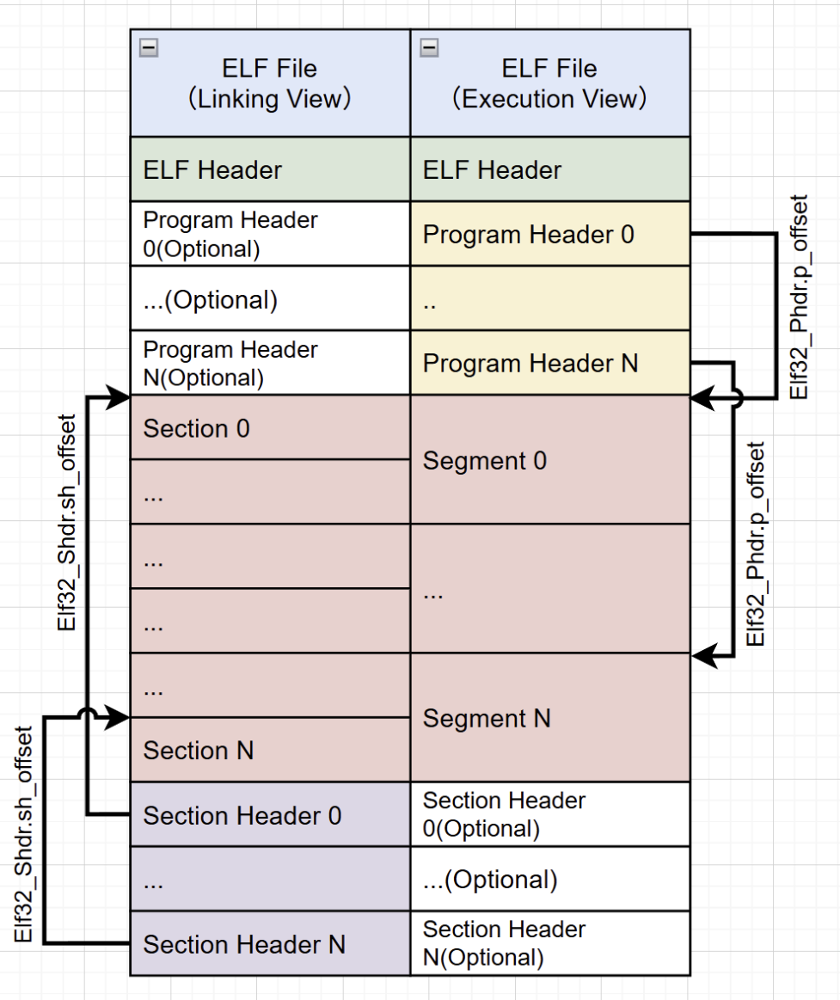
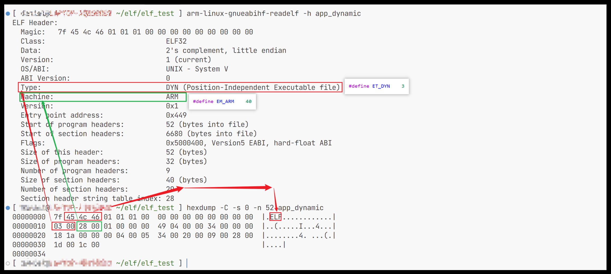

# ELF文件及Liteos_a内核加载ELF文件分析

[TOC]

# 1、ELF文件的介绍

​	ELF（Executable and Linkable Format）是Linux及类Unix系统中用于可执行文件、共享库、目标代码和核心转储的标准二进制文件格式。它取代了早期的a.out和COFF格式，因其可扩展性、跨平台性和高效性成为现代操作系统的核心文件格式。

# 2、ELF文件的具体格式分析

## 2.1、ELF整体结构分析

ELF文件的基本类型，具体可分为：

- 可重定位文件(relocatable file，就是大家平常见到的.o文件)
    - 可重定位文件用在编译和链接阶段；

- 可执行文件(executable file, 比如在进程分析那篇文章中提到的“mksh”、“init”等没有扩展名的文件)
    - 可执行文件用在程序运行阶段；

- 共享库文件(shared object file，就是.so文件，用来做动态链接)
    - 共享库则同时用在编译链接和运行阶段。

- 核心转储文件(core dump file，就是core dump文件)
    - 核心转储文件是操作系统在程序异常终止时自动生成的内存快照文件，主要用于**记录程序崩溃瞬间的运行状态**，为调试和故障分析提供关键数据。

这里不介绍 core dump 文件的格式。本篇文章的注定在于分析操作系统如何加载可执行程序，所有重点在前三个类型的ELF文件格式。

在不同阶段，使用不同视角来理解ELF文件，整体布局如下图所示：

- ELF Header, ELF头部，定义全局性信息
- Program Header Table， 描述段(Segment)信息的数组，每个元素对应一个段；通常包含在可执行文件中，可重定文件中可选(通常不包含)
- Segment and Section，段(Segment)由若干区(Section)组成；段在运行时被加载到进程地址空间中，包含在可执行文件中；区是段的组成单元，包含在可执行文件和可重定位文件中
- Section Header Table，描述区(Section)信息的数组，每个元素对应一个区；通常包含在可重定位文件中，可执行文件中为可选(通常包含)

接下来我们就使用32位系统的ELF格式继续具体的分析。

## 2.1、ELF Header 结构分析

ELF32 文件头（Elf32_Ehdr）成员作用一览表：

| **成员名**        | **数据类型**    | **作用描述**                                                 | **关键细节**                                                 |
| ----------------- | --------------- | ------------------------------------------------------------ | ------------------------------------------------------------ |
| **`e_ident[16]`** | `unsigned char` | **ELF 身份标识**，包含文件格式的魔数、位数（32/64）、字节序、版本等 | **前 4 字节固定**：`0x7F` + `'E'` + `'L'` + `'F'`  **第 5 字节（EI_CLASS）**：`1`=32 位，`2`=64 位  **第 6 字节（EI_DATA）**：`1`=小端序，`2`=大端序 |
| **`e_type`**      | `Elf32_Half`    | **文件类型**，标识是目标文件、可执行文件还是共享库           | `ET_REL=1`（可重定位文件，如 `.o`）  `ET_EXEC=2`（可执行文件）  `ET_DYN=3`（共享库，如 `.so`） |
| **`e_machine`**   | `Elf32_Half`    | **目标机器架构**，指定 CPU 类型                              | `EM_386=3`（x86）  `EM_ARM=40`（ARM）  `EM_MIPS=8`（MIPS）   |
| **`e_version`**   | `Elf32_Word`    | **ELF 版本号**，固定为 `EV_CURRENT`（当前版本，通常为 1）    | 用于兼容性检查                                               |
| **`e_entry`**     | `Elf32_Addr`    | **程序入口虚拟地址**，操作系统加载后从此地址开始执行         | 可执行文件（`ET_EXEC`）中为有效地址（如 `0x8048000`）  目标文件（`ET_REL`）中为 `0` |
| **`e_phoff`**     | `Elf32_Off`     | **程序头表（Program Header Table）在文件中的偏移**           | 若为 `0`，表示无程序头表（如目标文件）                       |
| **`e_shoff`**     | `Elf32_Off`     | **节头表（Section Header Table）在文件中的偏移**             | 定位所有节（Section）的元数据                                |
| **`e_flags`**     | `Elf32_Word`    | **处理器特定标志**，与架构相关（ARM 中用于指定 ABI 版本等）  | x86 平台通常为 `0`                                           |
| **`e_ehsize`**    | `Elf32_Half`    | **ELF 头大小（字节）**，固定为 `sizeof(Elf32_Ehdr)=52`（32 位） | 用于验证文件完整性                                           |
| **`e_phentsize`** | `Elf32_Half`    | **程序头表中每个条目的大小（字节）**                         | 应等于 `sizeof(Elf32_Phdr)`（32 位下通常为 32）              |
| **`e_phnum`**     | `Elf32_Half`    | **程序头表中的条目数量**（即段的个数）                       | `0` 表示无可加载段                                           |
| **`e_shentsize`** | `Elf32_Half`    | **节头表中每个条目的大小（字节）**                           | 应等于 `sizeof(Elf32_Shdr)`（32 位下通常为 40）              |
| **`e_shnum`**     | `Elf32_Half`    | **节头表中的条目数量**（即节的个数）                         | 若超过 `SHN_LORESERVE=0xFF00`，需通过节头表第 0 项的实际值解析 |
| **`e_shstrndx`**  | `Elf32_Half`    | **节名称字符串表的索引号**，指向存储所有节名的字符串表（如 `.shstrtab`） | 若为 `SHN_UNDEF=0`，表示无节名字符串表                       |

其中关键字段协作关系：

1. 文件定位
    - 加载器通过 `e_phoff` 和 `e_phentsize` 定位程序头表，解析内存映射信息（如代码段/数据段）。
    - 链接器通过 `e_shoff` 和 `e_shentsize` 定位节头表，获取 `.text`、`.data` 等节的数据偏移。
2. 动态链接
    - `e_entry` 在动态链接时指向动态链接器（如 `/lib/ld-linux.so`）的入口，而非程序 main 函数。
3. 节名解析
    - `e_shstrndx` 指向的字符串表存储所有节名（如 `.text`），节头表中的 `sh_name` 字段是其在该表的偏移量。

使用 readelf -h 工具验证示例：

ELF32 文件头是操作系统加载二进制文件的“导航图”：

- **前 16 字节** 提供文件基础标识（魔数、位宽、字节序）。
- **`e_phoff` 和 `e_shoff`** 分别指向段（执行视图）和节（链接视图）的元数据表。
- **`e_shstrndx`** 是理解节名含义的钥匙，而 **`e_entry`** 决定了程序执行起点。
     掌握这些字段，即可理解二进制文件如何被系统加载、链接和运行。

## 2.2、ELF Program Header 结构分析

## 2.3、ELF Section 和 Segment 结构分析

## 2.4、ELF Section Header 结构分析

# 3、ELF文件的生成流程分析

# 4、ELF文件的加载流程分析

# 5、Liteos_a内核加载ELF文件的流程

