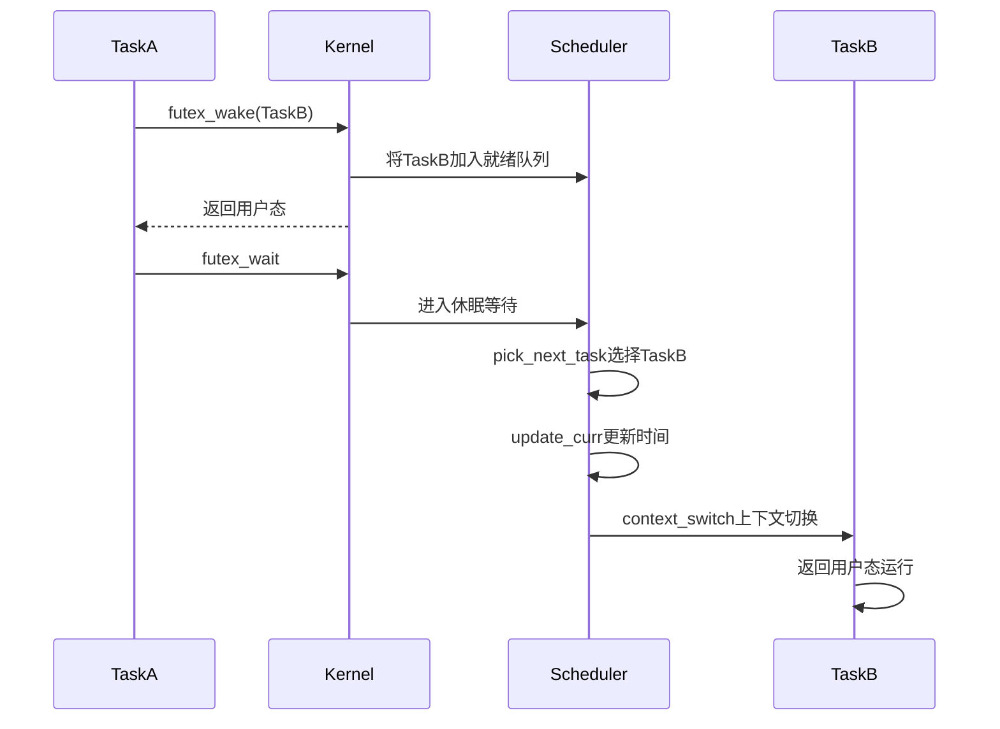
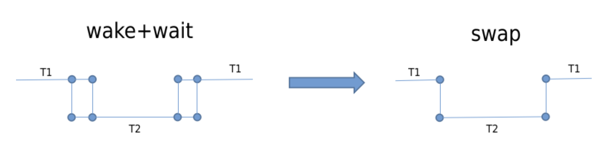
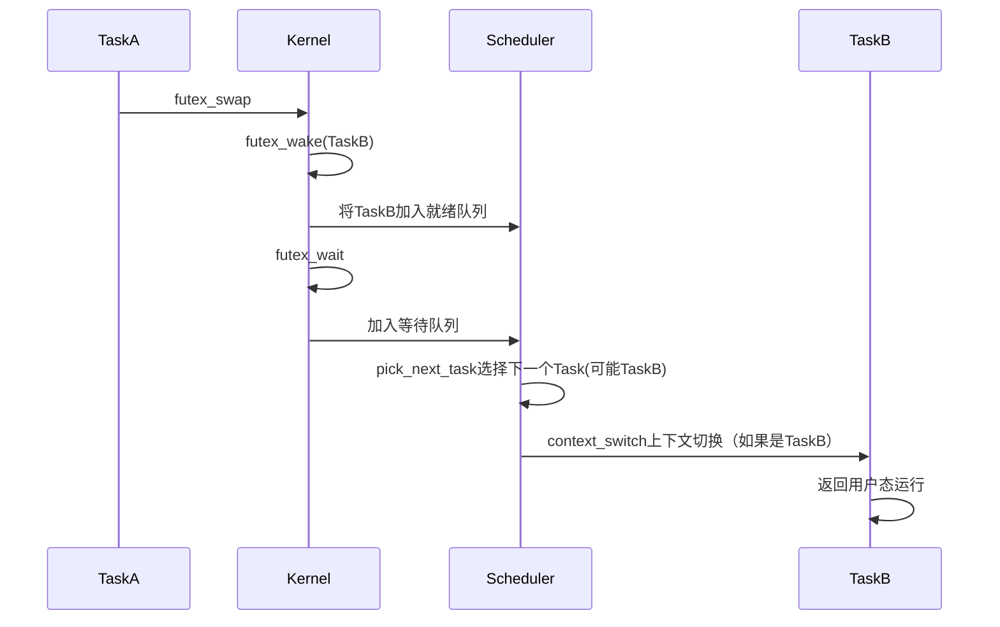
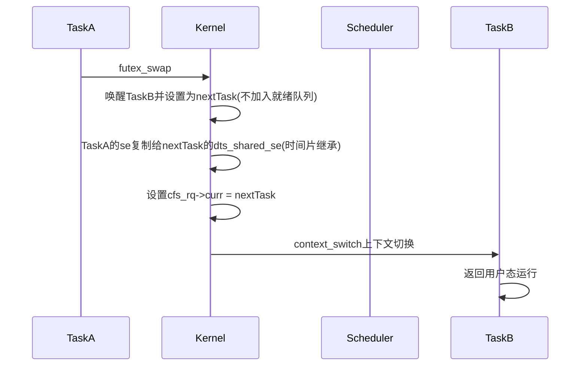

# Linux内核的Futex机制分析

[TOC]

# 1、Linux内核中传统的futex流程

传统的用户态态线程之间的相互唤醒和等待使用futex系统调用，主要流程如下：

* 1、TaskA执行futex_wake系统调用唤醒TaskB，并将其加入就绪队列，之后TaskA返回用户态。
* 2、Task接着执行futex_wait系统调用进入内核休眠等待，调度器使用pick_next_task选择下一个Task，如果调度到Task，那么之后进行update_curr更新时间（包括实际运行时间、虚拟运行时间vruntime），再进行context_switch上下文切换（包括地址空间切换、寄存器切换）。之后CPU返回TaskB的用户态运行。

用户态任务切换时序图：




# 2、Google引入的futex_swap优化方式

​	谷歌工程师Peter Oskolkov [posk@google.com](mailto:posk@google.com)向 LKML（Linux Kernel Mail List） 提出的补丁中有关 futex_swap() 的实现。可以确定的是，SwitchTo 构建在这个futex_swap内核函数之上。futex_swap接口引出：

https://lore.kernel.org/lkml/48058b850de10f949f96b4f311adb649b1fb3ff2.camel@posk.io/

​	对于一些线程交互的场景，例如线程T1与线程T2协助完成一项任务，T1完成一个阶段任务后，需要移交给T2然后等待T2的结果，T2完成阶段任务后再移交给T1。常见的RPC通信一般都是这种交互模式，例如client唤醒server执行相应的任务，client自己休眠，然后server执行完成后唤醒client。用futex操作简化成下面的三个步骤。
```bash
a. T1: futex-wake T2, futex-wait
b. T2: wakes, does what it has been woken to do
c. T2: futex-wake T1, futex-wait
```

其中步骤a和c都有2次系统调用，如果有一个futex内核接口，能一次实现两个过程，即一个接口完成1个线程的唤醒和1个线程的休眠，将会带来一些的性能提升。



在futex_swap中，将futex_wake和futex_wait合二为一，使用一次系统调用即可完整用户态的任务切换。

* 1|TaskA执行futex_swap系统调用进入内核，内核先执行futex_wake操作唤醒TaskB并加入就绪队列。

* 2、Task接着执行futex_wait操作，加入等待队列，之后调度器选择下一个Task，可能是Taskzb，接着完成上下文，跳转执行TaskB的用户态程序。

用户态任务切换时序图：




# 3、基于futex_swap实现的DTS优化方式

​	将原任务直接切换到新任务，bypass调度的技术命名为direct-thread-switch，bypass调度的前提必须是利用原任务的剩余时间片，否则会打破CFS调度的公平性。具体由briansun [imbriansun@gmail.com](mailto:imbriansun@gmail.com)提交到华为欧拉操作系统论坛上实现的patch

https://gitee.com/openeuler/kernel/commit/dad99a5750c4c942300c6626888a6ad52e62bf24

​	从patch的描述看，direct-thread-switch是在futex_swap的基础上实现的，是对futex_swap的进一步优化。futex_swap将futex_wake+futex_wait融合到一次系统调用，实现线程T2的唤醒和线程T1的休眠，涉及2次调度。而direct-thread-switch则是在此基础上，bypass调度，直接利用线程T1的剩余时间片来运行线程T2，避免了2次调度的开销。由于是基于futex_swap，其使用场景同样受限，典型场景是IPC通信，线程模型为T1->T2—T2->T1。

在futex_swap操作的基础上使用DTS（Direct Thread Switch），优化futex_swap在线程切换过程中的消耗时间。

* 1、TaskA执行futex_swap系统调用进入内核，唤醒TaskB并设置为nextTask，但是不将其加入就绪队列。

* 2、TaskA将自己的se调度实体复制给nextTask的dts_shared_se成员中，即把TaskA的时间片继承给nextTask。

* 3、直接设置cfs_rq->curr = nextTask，即将nextTask直接设置为当前正在运行的Task，绕过了传统的pick_next_task及其相关的流程，避免红黑树操作、调度类遍历和不必要的负载检查。

* 4、之后接着继续上下文切换context_switch，CPU跳转执行nextTask，即TaskB的用户态。

用户态任务切换时序图：




# 4、参考内容

1、[魅族内核团队对于futex_swap + DTS的性能优化的分析](https://kernel.meizu.com/2024/03/15/Futex%E6%9C%BA%E5%88%B6%E7%9A%84%E5%86%85%E6%A0%B8%E4%BC%98%E5%8C%96/)

3、[openEuler在openEuler-22.09分支上引入DTS特性的PR](https://gitee.com/openeuler/kernel/commit/dad99a5750c4c942300c6626888a6ad52e62bf24)

2、[代码分析参考openEuler-22.09分支](https://gitee.com/openeuler/kernel/tree/openEuler-22.09/)


