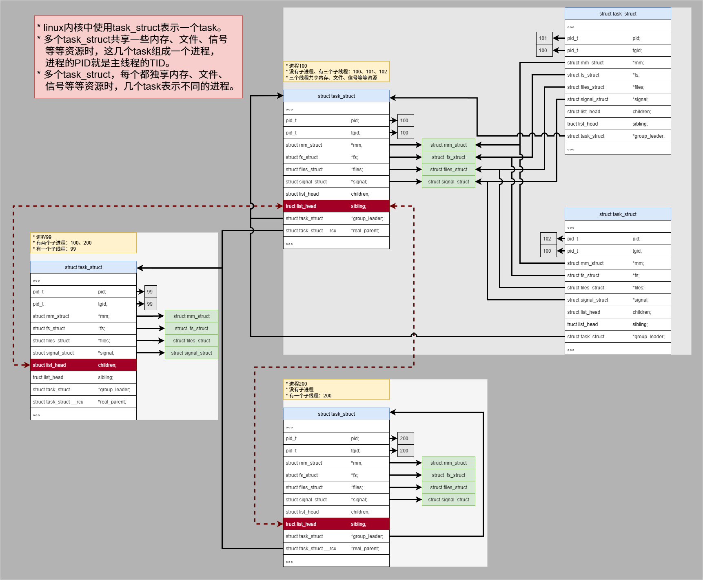
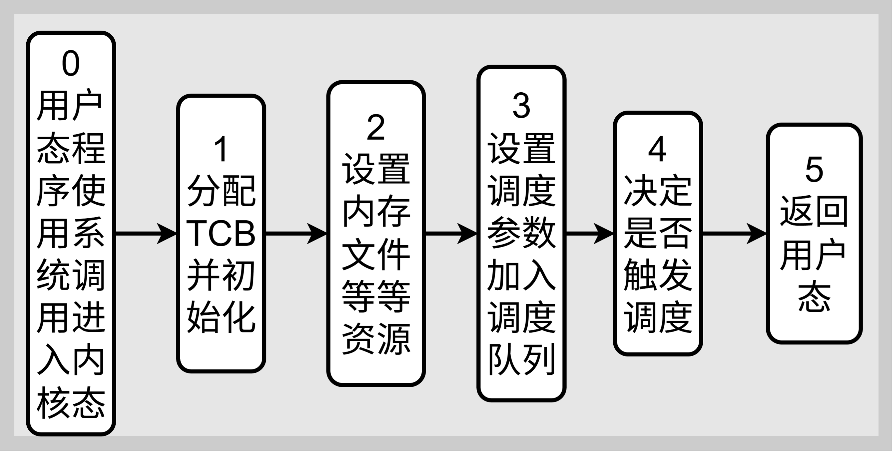
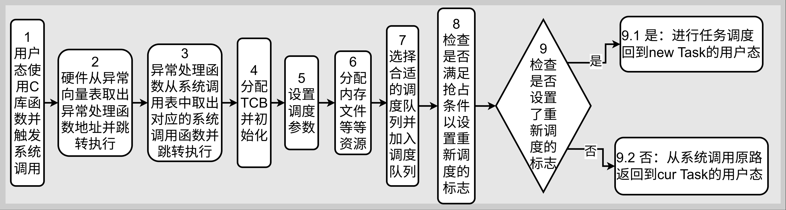
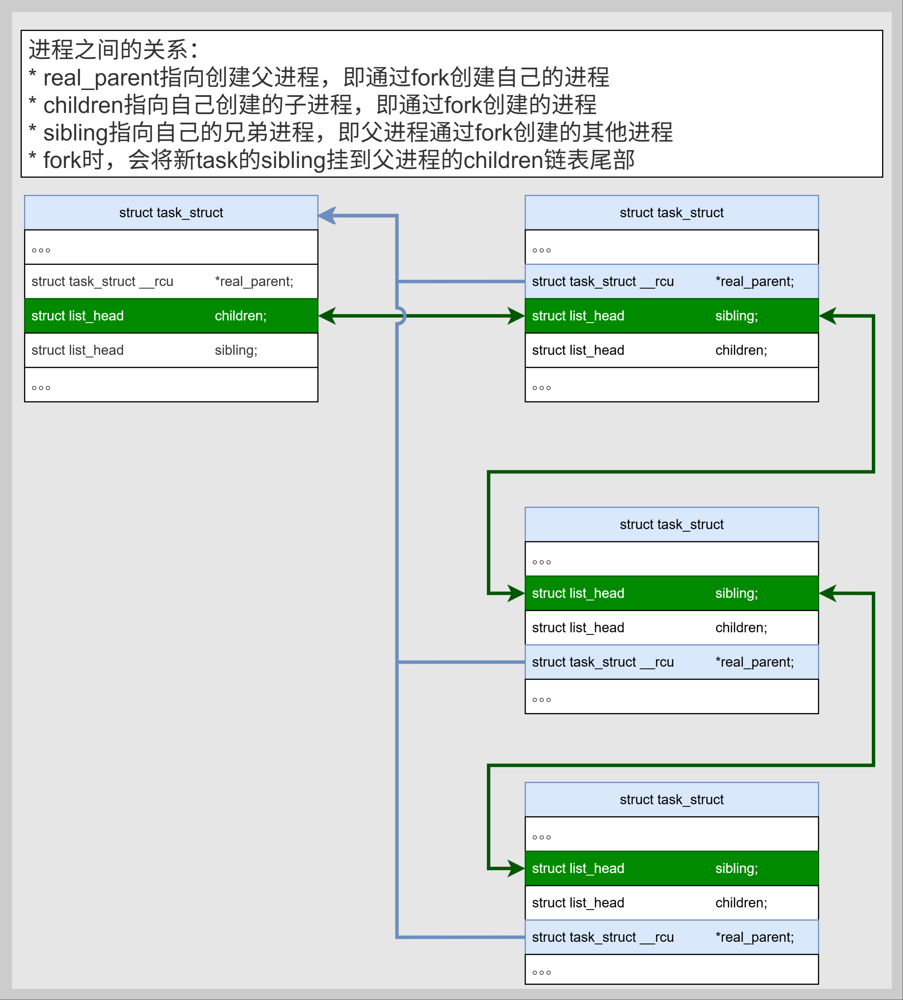
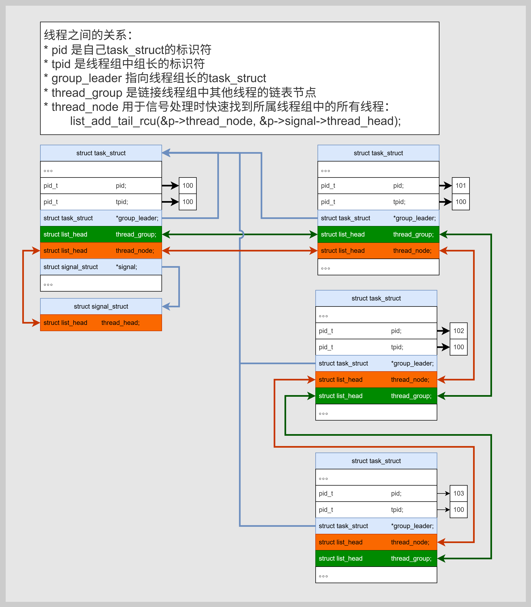
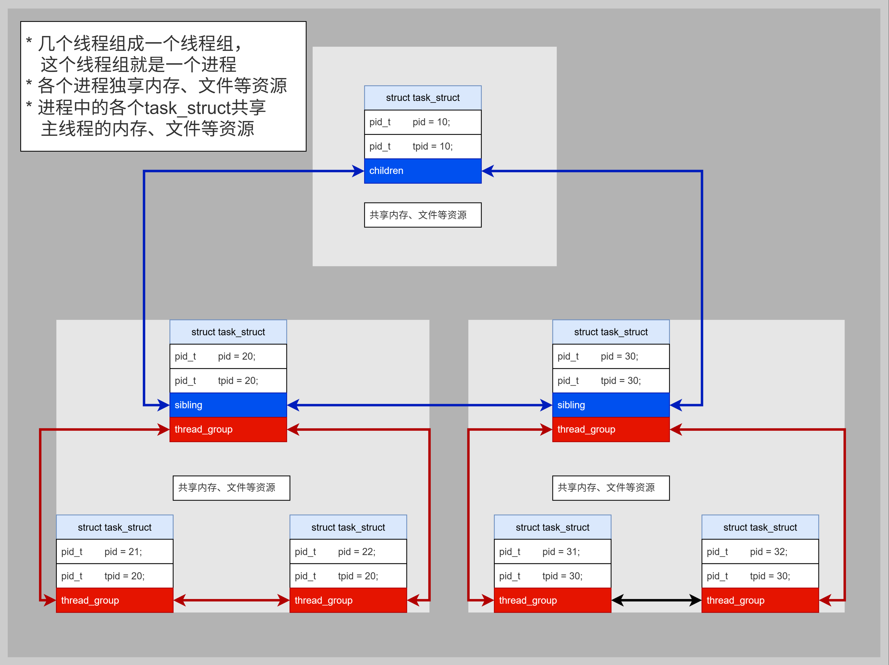

# Linux内核进程线程模型及其创建流程分析

[TOC]

# 0、环境版本

* OH版本：oh-v6.0-beta1 
* linux版本：linux-5.10
* musl c库版本：musl-1.2.5
* arm架构版本：arm v7-a架构，32位系统


# 1、linux内核中的任务task模型

​	linux内核中未使用进程PCB、线程TCB来抽象一个程序模型，而是采用任务task来描述一个程序，使用task_struct结构体抽象一个程序在内核中的是实体。linux内核中进程和线程在task任务中的表示关系如下图：




# 2、进程/线程创建流程分析

## 2.1、整体调用流程

多数OS都按照一个类似的流程进行process或thread的创建：

* ==> 0、用户态使用系统调用syscall进入内核态
* ==> 1、分配TCB并初始化
* ==> 2、设置内存、文件等等资源
* ==> 3、设置调度参数并加入调度队列
* ==> 4、决定是否触发调度
* ==> 5、返回用户态

流程图为：




linux内核中的流程：

* ==> 1、用户态C库提供创建进程/线程的库函数并触发svc异常
    * fork：fork ==> _Fork ==> __syscall(SYS_fork); ==> svc 0 (sys_fork系统调用编号 2 存入r7)

    * pthread_create： pthread_create --> __clone --> svc 0 (sys_clone系统调用编号 120 存入r7)
* ==> 2、硬件自动从异常向量表中取出svc异常对应的内核处理函数ENTRY(vector_swi)地址并跳转执行
* ==> 3、svc异常处理函数vector_swi中按照scno从系统调用表tbl中取系统调用处理函数sys_fork / sys_clone
* ==> 4、分配任务的TCB并初始化
* ==> 5、设置调度参数
* ==> 6、分配信号量、文件描述符、文件系统等资源
* fork：新分配task_struct的内存、文件等成员重新malloc分配内存，并复制当前task_struct的内容。
  
* pthread_create：新task_struct的内存、文件等结构体成员不分配内存，且指向当前task_struct的内容。
* ==> 7、选择调度队列并将Task加入调度队列
* ==> 8、检查是否满足抢占条件并设置需要重新调度的标志
* ==> 9、检查在系统调用过程中是否设置了重新调度的标志
* 9.1、是：进行任务调度返回new task的用户态；
  
* 9.2、否：从系统调用原路返回cur task的用户态。

流程图为：




## 2.2、具体调用链分析

```c
-------------------------------------------------------------------------------------------------
// User Mode
fork									|		pthread_create
// 1、用户态使用C库函数创建进程/线程，并触发系统调用syscall
	_Fork								|   		__clone
        svc 0 /* r7 = 2(sys_fork) */	|       		svc 0 /* r7 = 120(sys_clone) */
-------------------------------------------------------------------------------------------------
// Kernel Mode
// 2、硬件从异常向量表跳转执行svc异常处理程序
    		ENTRY(vector_swi)
    			// 从sys_xxx返回时，返回到__ret_fast_syscall
			    invoke_syscall tbl, scno, r10, __ret_fast_syscall
// 3、根据传入的系统调用编号scno跳转执行具体的系统调用函数
                sys_fork / sys_clone
                    kernel_clone
                        p = copy_process(NULL, trace, NUMA_NO_NODE, args);
// 4、分配并初始化TCB结构体
                            p = dup_task_struct(current, node);
// 5、设置调度参数
                            retval = sched_fork(clone_flags, p);
// 6、分配信号量、文件描述符、文件系统等资源
							// fork：用户态没有传入CLONE_VM、CLONE_FS等标志，new task_struct新建并复制old task_struct的资源
							// pthread_create：用户态传入CLONE_VM、CLONE_FS等标志，new task_struct共享old task_struct的资源
                            retval = copy_semundo(clone_flags, p);
                            retval = copy_files(clone_flags, p);
                            retval = copy_fs(clone_flags, p);
                            retval = copy_sighand(clone_flags, p);
                            retval = copy_signal(clone_flags, p);
                            retval = copy_mm(clone_flags, p);
                            retval = copy_namespaces(clone_flags, p);
                            retval = copy_io(clone_flags, p);
                            retval = copy_thread(clone_flags, args->stack, args->stack_size, p, args->tls);
                            pid = alloc_pid(p->nsproxy->pid_ns_for_children, args->set_tid, args->set_tid_size);
                        wake_up_new_task(p);
// 7、选择调度队列并将Task加入调度队列
                            __set_task_cpu(p, select_task_rq(p, task_cpu(p), SD_BALANCE_FORK, 0));
                            activate_task(rq, p, ENQUEUE_NOCLOCK);
// 8、检查是否满足抢占条件并设置需要重新调度的标志
                            check_preempt_curr(rq, p, WF_FORK);
                        return nr;
				// 从sys_clone返回时，返回到__ret_fast_syscall
				__ret_fast_syscall
// 9、检查在系统调用过程中是否设置了重新调度的标志
                    // 从thread_info加载线程标志位到r1
                    // 重新检查是否需要系统调用跟踪
                    ldr	r1, [tsk, #TI_FLAGS]
                    // 将r1左移16位，同时设置条件标志位
                    // 这样可以检查高16位的标志位（如_TIF_SYSCALL_WORK）
                    // movs指令会根据结果设置Z标志位
                    movs	r1, r1, lsl #16        
                    // 如果结果非零(ne)，跳转到需要额外处理的路径
                    // 说明有系统调用跟踪或其他工作需要处理
                    bne	fast_work_pending
                    	bl	do_work_pending	
// 9.1、如果设置了_TIF_NEED_RESCHED需要重新调度的标志，使用schedule触发调度
                    		if (likely(thread_flags & _TIF_NEED_RESCHED)) {
								schedule(); }
									__schedule(false);
										// 选择下一个task
										next = pick_next_task(rq, prev, &rf);
										// 切换上下文
										rq = context_switch(rq, prev, next, &rf);
											switch_to(prev, next, prev);
												__switch_to(prev,task_thread_info(prev), task_thread_info(next));
                                                    // 操作 ：从r4指向的内存地址开始，依次加载寄存器r4到sl（r10）、fp（r11）、sp（r13）、pc（r15）
                                                    // 关键点 ：加载pc寄存器会直接跳转到新任务的执行位置，完成任务切换
													ARM(	ldmia	r4, {r4 - sl, fp, sp, pc}  )
// 9.2、如果没有设置_TIF_NEED_RESCHED标志，继续系统调用的流程
						// 比较do_work_pending函数的返回值（r0）与0
                        // 返回值为0表示没有更多工作需要处理
                        cmp	r0, #0	
                        // 如果返回值等于0，跳转到no_work_pending标签
                        // 继续正常的系统调用返回流程
                        beq	no_work_pending			
	                        restore_user_regs fast = 0, offset = 0
                                    // return & move spsr_svc into cpsr
                                    // 关键指令：跳转到用户态PC地址，同时将spsr_svc复制到cpsr完成特权级切换
									movs	pc, lr
// Kernel Mode
-------------------------------------------------------------------------------------------------
// User Mode
调用fork的下一行代码继续执行				|		调用pthread_create的下一行代码继续执行
	。。。								  |		  	。。。
// User Mode
-------------------------------------------------------------------------------------------------
```


## 2.3、linux内核中task_struct的链接关系分析

### 2.3.1、进程链接图




### 2.3.2、线程链接图




### 2.3.3、进程线程组合链接图




### 2.3.4、链接关系源码分析

进程链接关系源码调用链：

```c
sys_fork
	kernel_clone(&args);
		p = copy_process(NULL, trace, NUMA_NO_NODE, args);
		// 1、初始化新建task的children和sibling链表
		INIT_LIST_HEAD(&p->children);
		INIT_LIST_HEAD(&p->sibling);	
	
		// 2、设置 p->real_parent
		// 使用CLONE_PARENT或者CLONE_THREAD标志，
		// 会将新建task的父进程设置调用者进程的父进程
		// 即新建的是当前进程的兄弟进程
		if (clone_flags & (CLONE_PARENT|CLONE_THREAD)) {
			p->real_parent = current->real_parent;
			。。。
		}
		// 不过fork系统调用没有设置上述标志，
		// 即新建task的父进程就是调用者
		else {
			p->real_parent = current;
			。。。
		}

        // 3、将 p->sibling 挂到父进程的 p->real_parent->children 上
        // 新建task的pid不为0，说明新建成功
        if (likely(p->pid)) {
            // 新建task是线程组的Leader
            if (thread_group_leader(p)) {
                // 把新建task的 sibling 挂到 父进程的 链表尾部
                list_add_tail(&p->sibling, &p->real_parent->children);

```

线程链接关系源码调用链：

```c
sys_clone
	kernel_clone(&args);
		p = copy_process(NULL, trace, NUMA_NO_NODE, args);
			// 1、创建新task时，将task的tsk->thread_node 挂载到对应的 sig->thread_head 中
			retval = copy_signal(clone_flags, p);
				sig->thread_head = (struct list_head)LIST_HEAD_INIT(tsk->thread_node);
				tsk->thread_node = (struct list_head)LIST_HEAD_INIT(sig->thread_head);

			// 2、设置新建task的线程组长 p->group_leader 
			// 创建线程时 新task的 group_leader 就是调用者的 group_leader
			if (clone_flags & CLONE_THREAD) {
				p->group_leader = current->group_leader;
				p->tgid = current->tgid;
			}
			// 创建进程时 新task的 group_leader 就是自己
			else {
				p->group_leader = p;
				p->tgid = p->pid;
			}

			// 3、初始化 thread_group 节点
			INIT_LIST_HEAD(&p->thread_group);

			// 4、将新建task的 p->thread_group 挂到
			// 	  线程组长的 p->group_leader->thread_group 尾部
			// 新建task的pid不为0，说明新建成功
			if (likely(p->pid)) {
				// 创建 进程 时
				if (thread_group_leader(p)) { }
				// 创建 线程 时
				else {
					list_add_tail_rcu(&p->thread_group, &p->group_leader->thread_group);
					list_add_tail_rcu(&p->thread_node, &p->signal->thread_head);
```


