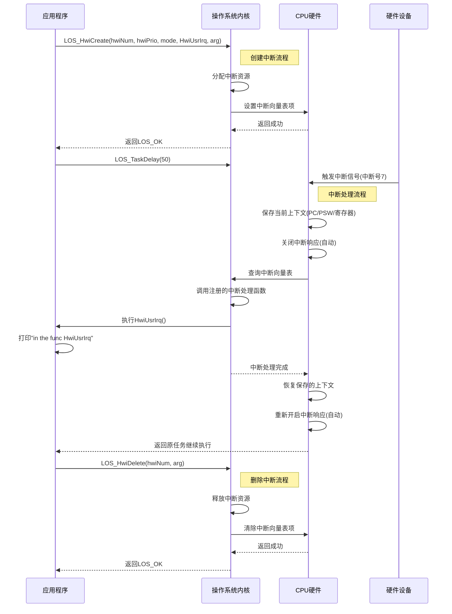
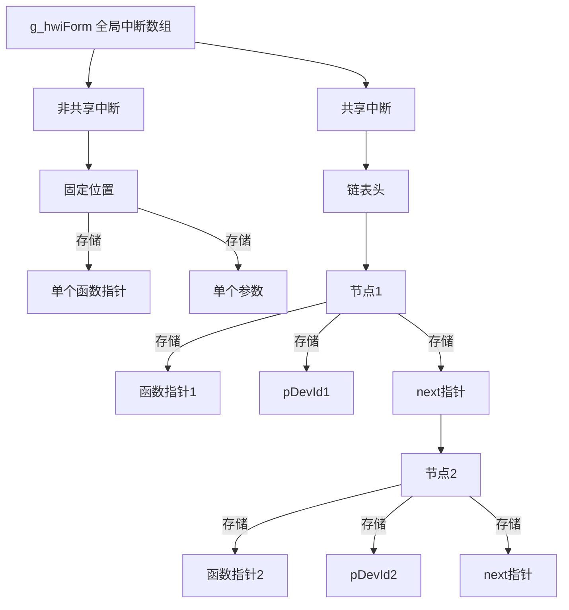

# 中断异常机制与Liteos_a内核中断异常机制分析

[TOC]

# 0. 一句话总结

​	中断是**外部硬件触发的异步事件**（如键盘输入），异常是**CPU内部指令引发的同步事件**（如除零错误），二者均通过暂停当前程序、执行处理程序再恢复现场的方式响应紧急事件，是操作系统实现多任务和错误处理的核心机制。

注意：本文不讨论GIC的原理和使用方法，只讨论内核处理中断时的核心流程，以及在一个具体的内核，比如Liteos_a内核中的代码实现。GIC的讨论见文章： [中断控制器GICv2以及Liteos_a内核使用流程分析.md](中断控制器GICv2以及Liteos_a内核使用流程分析.md) 


# 1. 中断与异常的通用知识点

## 1.1 中断与异常的概念

**中断（Interrupt）**

- **来源**：CPU外部硬件设备（如键盘、磁盘、定时器）。
- **特性**：
  - **异步性**：与当前指令无关，随时可能发生。
  - **可屏蔽性**：部分中断可被屏蔽（如通过中断控制器忽略非紧急请求）。
- **类型**：
  - **可屏蔽中断**：可通过设置屏蔽字忽略（如I/O设备请求）。
  - **不可屏蔽中断（NMI）**：必须立即响应（如电源故障）。


**异常（Exception）**

- **来源**：CPU执行指令时检测到的内部问题或特殊条件。

- **特性**：

  - **同步性**：由当前指令直接触发（如非法指令、缺页）。
  - **不可屏蔽**：必须立即处理。

- **分类**：

  | **类型**          | **触发时机**       | **处理方式**             | **示例**             |
  | ----------------- | ------------------ | ------------------------ | -------------------- |
  | **故障（Fault）** | 指令执行中检测错误 | 修复后**重新执行原指令** | 缺页异常、除零错误   |
  | **自陷（Trap）**  | 指令执行后主动触发 | **执行下一条指令**       | 系统调用、调试断点   |
  | **终止（Abort）** | 不可恢复的硬件错误 | **终止程序**             | 内存校验错、总线错误 |


## 1.2 中断与异常的通用结构

**中断向量表（IDT）**

- **作用**：存储中断/异常处理程序的入口地址，每个事件对应唯一**中断向量号**（如x86中0-255）。
- **定位方式**：CPU通过**中断描述符表寄存器（IDTR）** 获取IDT基地址。

**关键寄存器**

- **程序计数器（PC）**：保存被中断指令的地址。
- **程序状态字（PSW）**：保存CPU状态（如中断屏蔽位、特权级）。


## 1.3 中断与异常的处理流程图

```bash
+---------------------+  
| 当前程序执行          |  
+----------+----------+  
           |  
           | 发生中断/异常  
           ↓  
+----------+----------+  
| 1. 关中断            |  // 屏蔽新中断，保存现场期间防打断  
| 2. 保存现场          |  // 压栈保存PC、PSW、通用寄存器  
+----------+----------+  
           |  
           | 通过IDT查询处理程序  
           ↓  
+----------+----------+  
| 3. 执行处理程序       |  // 根据类型跳转（如ISR处理设备数据，缺页异常加载页面）  
+----------+----------+  
           |  
           | 恢复现场  
           ↓  
+----------+----------+  
| 4. 开中断并返回       |  // 故障：返回原指令；陷阱：返回下条指令；终止：终止程序  
+---------------------+
```


## 1.4 关键机制说明

**现场保护与恢复**

- **保护范围**：PC、PSW、通用寄存器、栈指针（若特权级切换需保存SS/ESP）。
- **恢复指令**：`IRET`（中断返回）同时恢复PC、PSW和栈。

**中断屏蔽与嵌套**

- **关中断时机**：保存现场和恢复现场期间，避免处理流程被打断。
- **嵌套允许性**：中断可嵌套（高优先级打断低优先级），异常通常不可嵌套。

**特权级切换**

- **触发条件**：用户态程序触发异常/中断时，CPU切换至内核态。
- **堆栈切换**：从用户栈切换到内核栈，通过TSS（任务状态段）获取内核栈指针。

**中断门 vs. 陷阱门**

- **中断门**：执行处理程序时**自动关闭中断**（IF=0），防止嵌套。
- **陷阱门**：保持中断开启（IF不变），适用于需快速响应的场景（如系统调用）。


**核心差异对比**

| **特征**     | **中断**            | **异常**                   |
| ------------ | ------------------- | -------------------------- |
| **触发源**   | 外部硬件            | CPU执行指令                |
| **同步性**   | 异步（与指令无关）  | 同步（由指令触发）         |
| **优先级**   | 可分级（如NMI最高） | 无明确优先级               |
| **返回点**   | 原指令的下一条      | 故障→原指令；陷阱→下条指令 |
| **处理目标** | 响应外部事件        | 处理程序错误或主动服务请求 |


# 2、Liteos_a内核中断与异常的实现

## 2.1、Liteos_a内核中断与异常的概念

​	中断是指出现需要时，CPU暂停执行当前程序，转而执行新程序的过程。即在程序运行过程中，出现了一个必须由CPU立即处理的事务，此时CPU暂时中止当前程序的执行转而处理这个事务，这个过程就叫做中断。通过中断机制，可以使CPU避免把大量时间耗费在等待、查询外设状态的操作上，大大提高系统实时性以及执行效率。

目前的中断支持有：

- 中断初始化
- 中断创建
- 开/关中断
- 恢复中断
- 删除中断

异常处理是操作系统对运行期间发生的异常情况（芯片硬件异常）进行处理的一系列动作，例如虚拟内存缺页异常、打印异常发生时函数的调用栈信息、CPU现场信息、任务的堆栈情况等。


## 2.2、Liteos_a内核的中断与异常运行机制

​	外设可以在没有CPU介入的情况下完成一定的工作，但某些情况下也需要CPU为其执行一定的工作。通过中断机制，在外设不需要CPU介入时，CPU可以执行其它任务，而当外设需要CPU时，产生一个中断信号，该信号连接至中断控制器。

​	中断控制器一方面接收其它外设中断引脚的输入，另一方面会发出中断信号给CPU。可以通过对中断控制器编程来打开和关闭中断源、设置中断源的优先级和触发方式。常用的中断控制器有VIC（Vector Interrupt Controller）和GIC（General Interrupt Controller）。在ARM Cortex-A7中使用的中断控制器是GIC。

CPU收到中断控制器发送的中断信号后，中断当前任务来响应中断请求。

​	异常指可以打断CPU正常运行流程的一些事情，如未定义指令异常、试图修改只读的数据异常、不对齐的地址访问异常等。当异常发生时，CPU暂停当前的程序，先处理异常事件，然后再继续执行被异常打断的程序。

以ARMv7-a架构为例，中断和异常处理的入口为中断向量表，中断向量表包含各个中断和异常处理的入口函数。

中断向量表：

| 中断向量序号 | 异常/中断名称           | 处理程序符号              | 描述             |
| :----------: | :---------------------- | :------------------------ | :--------------- |
|      0       | reset_vector            | (未提供)                  | 系统复位/启动    |
|      1       | Undefined Instruction   | _osExceptUndefInstrHdl    | 未定义的指令异常 |
|      2       | Software Interrupt      | _osExceptSwiHdl           | 软件中断         |
|      3       | Prefetch Abort          | _osExceptPrefetchAbortHdl | 预取指令中止异常 |
|      4       | Data Abort              | _osExceptDataAbortHdl     | 数据访问中止异常 |
|      5       | Address Abort           | _osExceptAddrAbortHdl     | 地址异常中止     |
|      6       | IRQ (Interrupt Request) | OsIrqHandler              | 外部中断请求     |
|      7       | FIQ (Fast Interrupt)    | _osExceptFiqHdl           | 快速中断请求     |


## 2.3、Liteos_a内核中断与异常处理流程图

同 1.3 节。


## 2.4、Liteos_a内核中断与异常模块的总结

分析到这里，可以看出Liteos_a内核完整的实现了 1.1 ~ 1.3 小节中断与异常所有的通用机制。接下来就借助Liteos_a内核的源代码继续分析，Liteos_a内核是如何通过代码将中断与异常的这些机制一一实现的。


# 3、Liteos_a内核中断与异常开发案例

## 3.1、接口说明

异常处理为内部机制，不对外提供接口，中断模块提供对外接口如下：

**创建删除中断：**

| 接口名        | 接口描述                                                     |
| ------------- | ------------------------------------------------------------ |
| LOS_HwiCreate | 中断创建，注册中断号、中断触发模式、中断优先级、中断处理程序。<br />中断被触发时，会调用该中断处理程序 |
| LOS_HwiDelete | 根据所提供的中断号删除中断                                   |

**开/关中断：**

| 接口名         | 接口描述                                                     |
| -------------- | ------------------------------------------------------------ |
| LOS_IntUnlock  | 打开当前处理器所有中断响应                                   |
| LOS_IntLock    | 关闭当前处理器所有中断响应                                   |
| LOS_IntRestore | 与LOS_IntLock配套使用，恢复到使用LOS_IntLock关闭所有中断之前的状态 |

**获取系统中断信息：**

| 接口名                  | 接口描述                 |
| ----------------------- | ------------------------ |
| LOS_GetSystemHwiMaximum | 获取系统支持的最大中断数 |


## 3.2、开发流程

调用中断创建接口LOS_HwiCreate创建中断。

调用LOS_HwiDelete接口删除指定中断，此接口根据实际情况使用，判断是否需要删除中断。


## 3.3、编程实例

### 3.3.1、实例描述

本实例实现如下功能：

* 1、创建中断。

* 2、删除中断。

​	代码实现如下，演示如何创建中断和删除中断，当指定的中断号HWI_NUM_TEST产生中断时，会调用中断处理函数（该示例代码的测试函数可以加在kernel/liteos_a/testsuites/kernel/src/osTest.c中的TestTaskEntry中进行测试）：


### 3.3.2、编程示例

```c
#include "los_hwi.h"
/*中断处理函数*/
STATIC VOID HwiUsrIrq(VOID)
{
    PRINK("in the func HwiUsrIrq \n");
}

static UINT32 Example_Interrupt(VOID)
{
    UINT32 ret;
    HWI_HANDLE_T hwiNum = 7; // 7: 使用的中断号
    HWI_PRIOR_T hwiPrio = 3; // 3: 中断优先级
    HWI_MODE_T mode = 0;
    HWI_ARG_T arg = 0;

    /*创建中断*/
    ret = LOS_HwiCreate(hwiNum, hwiPrio, mode, 
                        (HWI_PROC_FUNC)HwiUsrIrq, (HwiIrqParam *)arg);
    if (ret == LOS_OK) {
        PRINK("Hwi create success!\n");
    } else {
        PRINK("Hwi create failed!\n");
        return LOS_NOK;
    }

    /* 延时50个Ticks， 当有硬件中断发生时，会调用函数HwiUsrIrq*/
    LOS_TaskDelay(50);

    /*删除中断*/
    ret = LOS_HwiDelete(hwiNum, (HwiIrqParam *)arg);
    if (ret == LOS_OK) {
        PRINK("Hwi delete success!\n");
    } else {
        PRINK("Hwi delete failed!\n");
        return LOS_NOK;
    }
    return LOS_OK;
}
```

编译运行得到的结果为：

```bash
Hwi create success!
Hwi delete success!
```


### 3.3.3、示例时序图




# 4、Liteos_a内核中断与异常的源码分析

## 4.1、系统中断模块初始化 OsHwiInit

```c
reset_vector
    bl main
    	OsMain
    		ArchEarlyInit
    			OsHwiInit 	// 中断初始化
    			OsExcInit	// 异常初始化
```

其中 OsHwiInit 函数：

```c
LITE_OS_SEC_TEXT_INIT VOID OsHwiInit(VOID)
{
    UINT32 hwiNum;

    // 遍历所有硬件中断号，初始化中断处理结构体数组
    for (hwiNum = 0; hwiNum < OS_HWI_MAX_NUM; hwiNum++) {
        g_hwiForm[hwiNum].pfnHook = NULL;
        g_hwiForm[hwiNum].uwParam = 0;
        g_hwiForm[hwiNum].pstNext = NULL;
    }
	// 将中断名称数组全部清零
    (VOID)memset_s(g_hwiFormName, (sizeof(CHAR *) * OS_HWI_MAX_NUM), 
                   0, (sizeof(CHAR *) * OS_HWI_MAX_NUM));

    // 进行硬件GIC（Generic Interrupt Controller：通用中断控制器）的初始化
    // GIC v2、GIC v3
    HalIrqInit();

    return;
}
```

其中即使用 GIC v2版本的 HalIrqInit 函数为例：

```c
// kernel_liteos_a\arch\arm\gic\gic_v2.c
VOID HalIrqInit(VOID)
{
    UINT32 i;
	// 设置外部中断的触发方式为：低电平有效
    /* set external interrupts to be level triggered, active low. */
    for (i = 32; i < OS_HWI_MAX_NUM; i += 16) { /* 32: Start interrupt number, 16: Interrupt bit width */
        GIC_REG_32(GICD_ICFGR(i / 16)) = 0; /* 16: Register bit offset */
    }
	// 设置中断的目标寄存器为 cpu0，即主核
    /* set external interrupts to CPU 0 */
    for (i = 32; i < OS_HWI_MAX_NUM; i += 4) { /* 32: Start interrupt number, 4: Interrupt bit width */
        GIC_REG_32(GICD_ITARGETSR(i / 4)) = 0x01010101;
    }
	// 设置中断的优先级
    /* set priority on all interrupts */
    for (i = 0; i < OS_HWI_MAX_NUM; i += 4) { /* 4: Interrupt bit width */
        GIC_REG_32(GICD_IPRIORITYR(i / 4)) = GICD_INT_DEF_PRI_X4;
    }
	// 禁用所有中断，防止误触发
    /* disable all interrupts. */
    for (i = 0; i < OS_HWI_MAX_NUM; i += 32) { /* 32: Interrupt bit width */
        GIC_REG_32(GICD_ICENABLER(i / 32)) = ~0; /* 32: Interrupt bit width */
    }
	// 
    HalIrqInitPercpu();
	// 使能GIC的分发器（Distributor）
    /* enable gic distributor control */
    GIC_REG_32(GICD_CTLR) = 1;
	// 设置核间中断 IPI
#ifdef LOSCFG_KERNEL_SMP
    /* register inter-processor interrupt */
    (VOID)LOS_HwiCreate(LOS_MP_IPI_WAKEUP, 0xa0, 0, OsMpWakeHandler, 0);
    (VOID)LOS_HwiCreate(LOS_MP_IPI_SCHEDULE, 0xa0, 0, OsMpScheduleHandler, 0);
    (VOID)LOS_HwiCreate(LOS_MP_IPI_HALT, 0xa0, 0, OsMpHaltHandler, 0);
#ifdef LOSCFG_KERNEL_SMP_CALL
    (VOID)LOS_HwiCreate(LOS_MP_IPI_FUNC_CALL, 0xa0, 0, OsMpFuncCallHandler, 0);
#endif
#endif
}

```

其中 HalIrqInitPercpu 函数：

```c
VOID HalIrqInitPercpu(VOID)
{
    //  1、设置GIC的优先级掩码寄存器（GICC_PMR）为0xFF，表示允许所有优先级的中断通过，不屏蔽任何中断。
    /* unmask interrupts */
    GIC_REG_32(GICC_PMR) = 0xFF;
	// 2、设置GIC的CPU接口控制寄存器（GICC_CTLR）为1，开启GIC的CPU接口，使能该CPU核接收和响应中断。
    /* enable gic cpu interface */
    GIC_REG_32(GICC_CTLR) = 1;
}
```

其中异常初始化 OsExcInit 函数：

```c
typedef struct {
    VOID *stackTop;
    UINT32 stackSize;
    CHAR *stackName;
} StackInfo;

const StackInfo *g_stackInfo = NULL;
UINT32 g_stackNum;

STATIC const StackInfo g_excStack[] = {
    { &__svc_stack,   OS_EXC_SVC_STACK_SIZE,   "svc_stack" },
    { &__exc_stack,   OS_EXC_STACK_SIZE,       "exc_stack" }
};

VOID OsExcStackInfoReg(const StackInfo *stackInfo, UINT32 stackNum)
{
    g_stackInfo = stackInfo;
    g_stackNum = stackNum;
}

VOID OsExcInit(VOID)
{
    OsExcStackInfoReg(g_excStack, sizeof(g_excStack) / sizeof(g_excStack[0]));
}
```


## 4.2、中断创建 LOS_HwiCreate

​	LOS_HwiCreate 中断创建，注册中断号、中断触发模式、中断优先级、中断处理程序。中断被触发时，会调用该中断处理程序。总体来说就是把一个中断号对应的中断处理函数写入全局中断数组中。

共享中断号和独享中断号的中断在全局数组中的结构图：




```c
LITE_OS_SEC_TEXT_INIT UINT32 
LOS_HwiCreate(HWI_HANDLE_T hwiNum, HWI_PRIOR_T hwiPrio, HWI_MODE_T hwiMode, 
              HWI_PROC_FUNC hwiHandler, HwiIrqParam *irqParam)
{
    UINT32 ret;

    // 1、参数检查
	// 优先级、中断处理函数、中断号等是否合法；
    (VOID)hwiPrio;
    if (hwiHandler == NULL) {
        return OS_ERRNO_HWI_PROC_FUNC_NULL;
    }
    if ((hwiNum > OS_USER_HWI_MAX) || ((INT32)hwiNum < OS_USER_HWI_MIN)) {
        return OS_ERRNO_HWI_NUM_INVALID;
    }

#ifdef LOSCFG_NO_SHARED_IRQ
    // 2、如果不支持共享中断，调用不支持共享的中断创建函数
    ret = OsHwiCreateNoShared(hwiNum, hwiMode, hwiHandler, irqParam);
#else
    // 3、如果支持共享中断，调用支持共享的中断创建函数
    ret = OsHwiCreateShared(hwiNum, hwiMode, hwiHandler, irqParam);
#endif
    return ret;
}
```

其中 OsHwiCreateNoShared 函数：

```c
STATIC UINT32 OsHwiCreateNoShared(HWI_HANDLE_T hwiNum, HWI_MODE_T hwiMode,
                                  HWI_PROC_FUNC hwiHandler, const HwiIrqParam *irqParam)
{
    HWI_ARG_T retParam;
    UINT32 intSave;

    HWI_LOCK(intSave);
    // 1、如果该中断号还未注册处理函数
    if (g_hwiForm[hwiNum].pfnHook == NULL) {
        // 设置中断处理函数指针
        // 就是将用户设置的中断处理函数 放入用于管理中断的数组 g_hwiForm 中
        g_hwiForm[hwiNum].pfnHook = hwiHandler;

        retParam = OsHwiCpIrqParam(irqParam);
        if (retParam == LOS_NOK) {
            HWI_UNLOCK(intSave);
            return OS_ERRNO_HWI_NO_MEMORY;
        }
        g_hwiForm[hwiNum].uwParam = retParam;
    } 
    // 2、如果该中断号已注册处理函数
    else {
        HWI_UNLOCK(intSave);
        // 返回已创建错误码
        return OS_ERRNO_HWI_ALREADY_CREATED;
    }
    HWI_UNLOCK(intSave);
    return LOS_OK;
}
```

其中 OsHwiCreateShared 函数：

```c
STATIC UINT32 
OsHwiCreateShared(HWI_HANDLE_T hwiNum, HWI_MODE_T hwiMode, 
                  HWI_PROC_FUNC hwiHandler, const HwiIrqParam *irqParam)
{
    UINT32 intSave;
    HwiHandleForm *hwiFormNode = NULL;
    HwiHandleForm *hwiForm = NULL;
    HwiIrqParam *hwiParam = NULL;
    HWI_MODE_T modeResult = hwiMode & IRQF_SHARED;

    if (modeResult && ((irqParam == NULL) || (irqParam->pDevId == NULL))) {
        return OS_ERRNO_HWI_SHARED_ERROR;
    }

    HWI_LOCK(intSave);

    hwiForm = &g_hwiForm[hwiNum];
    // 1、如果链表已存在节点，但当前不是共享中断，或头节点未标记为共享，返回错误
    if ((hwiForm->pstNext != NULL) && 
        ((modeResult == 0) || (!(hwiForm->uwParam & IRQF_SHARED)))) {
        HWI_UNLOCK(intSave);
        return OS_ERRNO_HWI_SHARED_ERROR;
    }
	// 2、遍历链表，检查是否已为该设备注册过中断,注册错误 OS_ERRNO_HWI_ALREADY_CREATED
    while (hwiForm->pstNext != NULL) {
        hwiForm = hwiForm->pstNext;
        hwiParam = (HwiIrqParam *)(hwiForm->uwParam);
        if (hwiParam->pDevId == irqParam->pDevId) {
            HWI_UNLOCK(intSave);
            return OS_ERRNO_HWI_ALREADY_CREATED;
        }
    }

    // 3、分配新的中断处理节点
    hwiFormNode = (HwiHandleForm *)LOS_MemAlloc(m_aucSysMem0, sizeof(HwiHandleForm));
    if (hwiFormNode == NULL) {
        HWI_UNLOCK(intSave);
        return OS_ERRNO_HWI_NO_MEMORY;
    }
	// 4、拷贝中断参数
    hwiFormNode->uwParam = OsHwiCpIrqParam(irqParam);
    if (hwiFormNode->uwParam == LOS_NOK) {
        HWI_UNLOCK(intSave);
        (VOID)LOS_MemFree(m_aucSysMem0, hwiFormNode);
        return OS_ERRNO_HWI_NO_MEMORY;
    }
	// 5、设置中断处理函数和链表指针
    hwiFormNode->pfnHook = hwiHandler;
    hwiFormNode->pstNext = (struct tagHwiHandleForm *)NULL;
    hwiForm->pstNext = hwiFormNode;

    if ((irqParam != NULL) && (irqParam->pName != NULL)) {
        g_hwiFormName[hwiNum] = (CHAR *)irqParam->pName;
    }

    // 6、标记头节点为共享中断
    g_hwiForm[hwiNum].uwParam = modeResult;

    HWI_UNLOCK(intSave);
    return LOS_OK;
}
```


## 4.3、中断删除 LOS_HwiDelete

根据所提供的中断号删除中断。

```c
LITE_OS_SEC_TEXT_INIT UINT32 LOS_HwiDelete(HWI_HANDLE_T hwiNum, HwiIrqParam *irqParam)
{
    UINT32 ret;

    if ((hwiNum > OS_USER_HWI_MAX) || ((INT32)hwiNum < OS_USER_HWI_MIN)) {
        return OS_ERRNO_HWI_NUM_INVALID;
    }

#ifdef LOSCFG_NO_SHARED_IRQ
    // 删除非共享中断
    ret = OsHwiDelNoShared(hwiNum);
#else
    // 删除共享中断
    ret = OsHwiDelShared(hwiNum, irqParam);
#endif
    return ret;
}
```

其中 OsHwiDelNoShared 函数：

```c
STATIC UINT32 OsHwiDelNoShared(HWI_HANDLE_T hwiNum)
{
    UINT32 intSave;
    // 1) 加锁，保护中断删除的临界区，防止多核并发问题
    HWI_LOCK(intSave); 
    // 2) 清空该中断号的处理函数指针
    g_hwiForm[hwiNum].pfnHook = NULL; 
    // 3) 如果中断参数不为空, 释放中断参数内存
    if (g_hwiForm[hwiNum].uwParam) { 
        (VOID)LOS_MemFree(m_aucSysMem0, (VOID *)g_hwiForm[hwiNum].uwParam); 
    }
    // 4) 清空中断参数指针
    g_hwiForm[hwiNum].uwParam = 0; 
    // 5) 解锁
    HWI_UNLOCK(intSave); 
    // 6) 返回成功
    return LOS_OK; 	
}
```

其中 OsHwiDelShared 函数：

```c
STATIC UINT32 OsHwiDelShared(HWI_HANDLE_T hwiNum, const HwiIrqParam *irqParam)
{
    HwiHandleForm *hwiForm = NULL;
    HwiHandleForm *hwiFormtmp = NULL;
    UINT32 hwiValid = FALSE;
    UINT32 intSave;
    
    // 1) 加锁，保护临界区，防止并发问题
    HWI_LOCK(intSave);                  // 加锁，保护临界区，防止并发问题
    // 2) 获取该中断号的头节点
    hwiForm = &g_hwiForm[hwiNum];       
    hwiFormtmp = hwiForm;               // 临时指针指向头节点
    // 3) 如果是共享中断，但参数无效（未传递irqParam或pDevId），返回错误
    if ((hwiForm->uwParam & IRQF_SHARED) && 
        ((irqParam == NULL) || (irqParam->pDevId == NULL))) {
        HWI_UNLOCK(intSave);
        return OS_ERRNO_HWI_SHARED_ERROR;
    }
    // 4) 如果有链表节点，但不是共享中断，直接删除第一个节点，非共享中断只有一个节点，所以删除这一个就行了
    if ((hwiForm->pstNext != NULL) && !(hwiForm->uwParam & IRQF_SHARED)) {
        hwiForm = hwiForm->pstNext;
        if (hwiForm->uwParam) {
            (VOID)LOS_MemFree(m_aucSysMem0, (VOID *)hwiForm->uwParam); // 释放参数内存
        }
        (VOID)LOS_MemFree(m_aucSysMem0, hwiForm); // 释放节点内存
        hwiFormtmp->pstNext = NULL;               // 头节点指向NULL

        g_hwiFormName[hwiNum] = NULL;             // 清空中断名称

        HWI_UNLOCK(intSave);
        return LOS_OK;
    }
    // 5) 进入链表，查找目标设备节点
    hwiForm = hwiForm->pstNext;
    while (hwiForm != NULL) {
        // 如果不是目标设备，继续遍历
        if (((HwiIrqParam *)(hwiForm->uwParam))->pDevId != irqParam->pDevId) {
            hwiFormtmp = hwiForm;
            hwiForm = hwiForm->pstNext;
        } else {
            // 找到目标设备，删除节点
            hwiFormtmp->pstNext = hwiForm->pstNext;
            (VOID)LOS_MemFree(m_aucSysMem0, (VOID *)hwiForm->uwParam); // 释放参数内存
            (VOID)LOS_MemFree(m_aucSysMem0, hwiForm);                  // 释放节点内存

            hwiValid = TRUE; // 标记已找到并删除
            break;
        }
    }
    // 6) 如果未找到目标设备，返回未创建错误
    if (hwiValid != TRUE) {
        HWI_UNLOCK(intSave);
        return OS_ERRNO_HWI_HWINUM_UNCREATE;
    }
    // 7) 如果链表已空，清空头节点参数和名称
    if (g_hwiForm[hwiNum].pstNext == NULL) {
        g_hwiForm[hwiNum].uwParam = 0;
        g_hwiFormName[hwiNum] = NULL;
    }
    // 8) 解锁
    HWI_UNLOCK(intSave); 
    // 9) 返回成功
    return LOS_OK;  
}
```


## 4.4、开中断 LOS_IntUnlock

这里开关中断是关闭了 GIC的 CPU Interface --> CPU Core的路径：

- 直接操作ARM CPU的**CPSR寄存器**中的中断屏蔽位（I位和F位）
- 控制的是**CPU Core是否响应来自GIC CPU Interface的中断信号**
- 相当于在路径的最末端设置开关：`GIC CPU Interface → CPU Core`


```bash
中断源 → GIC Distributor → GIC CPU Interface → [IRQ/FIQ信号] → CPU Core
                                                   ↑
                                    		LOS_IntLock控制的屏蔽点
```

```c
LOS_IntUnlock
    ArchIntUnlock

/*
该函数用于解锁（使能）ARM处理器的IRQ和FIQ中断。其主要流程如下：
    1. 首先读取当前CPSR寄存器的值，并保存到intSave变量中，以便后续可以恢复中断状态。
    2. 执行 cpsie if 汇编指令，使能IRQ和FIQ中断（即清除CPSR中的I和F位）。
    3. 返回中断使能前的CPSR值，便于后续需要恢复原始中断状态时使用。
*/
STATIC INLINE UINT32 ArchIntUnlock(VOID)
{
    UINT32 intSave; // 定义一个变量用于保存当前CPSR寄存器的值
    __asm__ __volatile__(
        "mrs    %0, cpsr      \n"   // 读取当前CPSR（当前程序状态寄存器）到intSave
        "cpsie  if              "   // 使能IRQ和FIQ中断（清除CPSR中的I和F位）
        : "=r"(intSave)
        :
        : "memory");
    return intSave; // 返回中断使能前的CPSR值
}
```


## 4.5、关中断 LOS_IntLock

```c
LOS_IntLock
    ArchIntLock

/*
该函数用于锁定（关闭）ARM处理器的IRQ和FIQ中断。其主要流程如下：
    1. 首先读取当前CPSR寄存器的值，并保存到intSave变量中，以便后续可以恢复中断状态。
    2. 执行 cpsid if 汇编指令，关闭IRQ和FIQ中断（即设置CPSR中的I和F位）。
    3. 返回中断关闭前的CPSR值，便于后续需要恢复原始中断状态时使用。
*/
STATIC INLINE UINT32 ArchIntLock(VOID)
{
    UINT32 intSave; // 定义一个变量用于保存当前CPSR寄存器的值
    __asm__ __volatile__(
        "mrs    %0, cpsr      \n"   // 读取当前CPSR（当前程序状态寄存器）到intSave
        "cpsid  if              "   // 关闭IRQ和FIQ中断（设置CPSR中的I和F位）
        : "=r"(intSave)
        :
        : "memory");
    return intSave; // 返回中断关闭前的CPSR值
}
```


## 4.6、恢复中断前的状态 LOS_IntRestore

```c
LOS_IntRestore
    ArchIntRestore
/*
- cpsr_c是cpsr寄存器的低8位（控制字段），即：
    - M[4:0]（bits 0-4）：处理器模式（如User、FIQ、IRQ、Supervisor、Abort、Undefined、System等）
    - T（bit 5）：Thumb状态位
    - F（bit 6）：FIQ中断屏蔽位
    - I（bit 7）：IRQ中断屏蔽位
- 通过内联汇编指令 msr cpsr_c, %0 ，将传入的 intSave （之前保存的CPSR寄存器值）写回CPSR寄存器。
- 这样可以恢复调用 ArchIntLock 或 ArchIntUnlock 前的中断使能/关闭状态，保证临界区退出后系统中断状态的正确性。
*/
STATIC INLINE VOID ArchIntRestore(UINT32 intSave)
{
    __asm__ __volatile__(
        "msr    cpsr_c, %0      "   // 将intSave的值写回CPSR寄存器，恢复之前保存的中断状态
        :
        : "r"(intSave)
        : "memory");
}
```


# 5、对中断与异常机制的思考

## 5.1、OH工程项目中哪些地方使用到中断与异常

**中断使用场景：**

1、**硬件中断管理（HWI）**

- 通过 `LOS_HwiCreate` 和 `LOS_HwiDelete` 在内核、驱动和测试用例中广泛创建和管理硬件中断
- 系统时钟中断：`OsTickHandler` 在 kernel/base/core/los_tick.c 中作为 tick 中断处理函数

2、**HDF驱动框架**

- 工作队列机制：通过 `HdfAddWork`、`HdfWorkQueueInit` 在各类传感器驱动（光传感器、加速度计、陀螺仪、磁力计等）、显示驱动、振动器驱动、输入设备驱动中处理中断下半部分
- I/O中断：通过 `HdfIoMapMmio`、`HdfIoUnmapMmio` 处理设备寄存器访问

3、**WiFi和网络驱动**

- 海思WiFi芯片驱动通过 `oal_request_irq` 和工作队列处理无线网络中断
- 使用 `schedule_work` 和异常重置机制处理WiFi异常恢复

4、**USB驱动**

- FreeBSD兼容层中大量使用中断处理机制，包括 `linux_request_irq` 映射
- DMA传输中断：通过 `usb_dma_*` 系列函数处理USB DMA传输中断

5、**文件系统和存储**

- JFFS2文件系统、NuttX文件系统中使用中断处理存储设备I/O


**异常使用场景：**

1、**系统异常处理核心**

- arch/arm/arm/src/los_exc.c 定义了 `OsExcInit`、`OsDataAbortExcHandleEntry`、`OsPrefetchAbortExcHandleEntry` 等处理未定义指令、数据中止、预取中止异常

2、**内存管理异常**

- kernel/base/vm/los_vm_fault.c 处理页面错误异常

3、**IPC异常处理**

- 在互斥锁、信号量、事件、读写锁等IPC机制中集成异常处理

4、**第三方库异常兼容**

- musl库、FreeBSD兼容层、NuttX组件中大量处理"未定义"行为和异常情况


## 5.2、这些地方为什么要使用中断与异常

1、**实时性要求**

- 硬件事件（如传感器数据就绪、网络包到达）需要及时响应，中断提供了最快的响应机制

2、**系统稳定性**

- 异常处理机制确保系统在遇到错误时能够安全恢复或优雅终止，而不是崩溃

3、**资源利用效率**

- 中断驱动的I/O避免了CPU轮询等待，提高了系统整体效率

4、**硬件抽象需求**

- 通过中断机制屏蔽硬件差异，为上层提供统一的编程接口


## 5.3、在这些地方使用中断与异常带来哪些好处

1、**提高系统响应速度**

- 硬件事件可以立即得到处理，减少延迟

2、**降低CPU使用率**

- 避免轮询机制的CPU消耗，CPU可以执行其他任务

3、**增强系统可靠性**

- 异常处理机制提供错误恢复能力，提高系统稳定性

4、**支持多任务并发**

- 中断使得系统可以同时处理多个硬件设备和任务

5、**简化驱动开发**

- 工作队列等机制简化了中断处理的复杂性


## 5.4、在这些地方使用中断与异常带来哪些坏处

1、**增加系统复杂性**

- 中断和异常处理逻辑复杂，增加了调试难度

2、**实时性不确定**

- 中断嵌套和优先级管理可能导致关键任务延迟

3、**竞态条件风险**

- 中断上下文与普通任务上下文之间的数据竞争

4、**内存开销**

- 需要额外的堆栈空间和数据结构来管理中断和异常

5、**调试困难**

- 中断异步特性使得问题重现和调试变得困难


## 5.5、有坏处为什么还要使用

1、**硬件约束**

- 现代计算机硬件架构本身就基于中断机制，这是无法避免的

2、**性能需求**

- 尽管有复杂性，但中断机制带来的性能提升远超过其带来的问题

3、**实时系统要求**

- 嵌入式和实时系统必须快速响应外部事件，中断是唯一可行的解决方案

4、**标准化需求**

- 操作系统需要兼容现有的硬件标准和软件生态


## 5.6、如何在工程中取舍

1、**分层设计原则**

- OHOS采用HDF框架将复杂的中断处理封装在驱动层，向上提供简洁的接口

2、**工作队列机制**

- 将中断处理分为上半部（快速响应）和下半部（延迟处理），平衡响应速度和处理复杂性

3、**兼容层策略**

- 通过FreeBSD兼容层、Linux兼容层提供多种编程模型，减少移植成本

4、**优先级管理**

- 合理设计中断优先级，确保关键系统功能优先得到处理

**5、异常恢复机制**

- 实现完善的异常处理和恢复机制，提高系统容错能力


## 5.7、总结

​	Liteos_a内核通过中断与异常机制，在硬件抽象、驱动管理、系统服务等多个层面实现了高效的事件处理。虽然这些机制增加了系统复杂性，但通过分层抽象、工作队列、兼容层等设计模式，有效地管理了这种复杂性，为构建稳定、高效的嵌入式操作系统奠定了基础。系统在保证实时响应的同时，也兼顾了开发效率和系统可维护性，体现了现代操作系统设计的平衡艺术。

