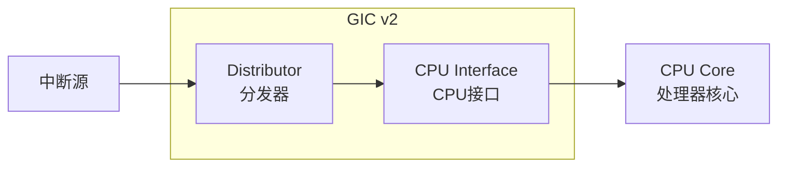
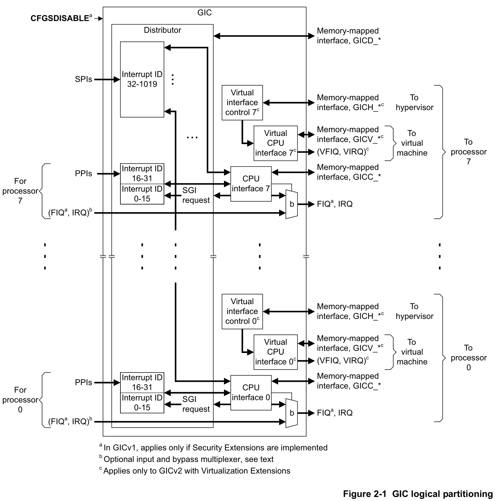
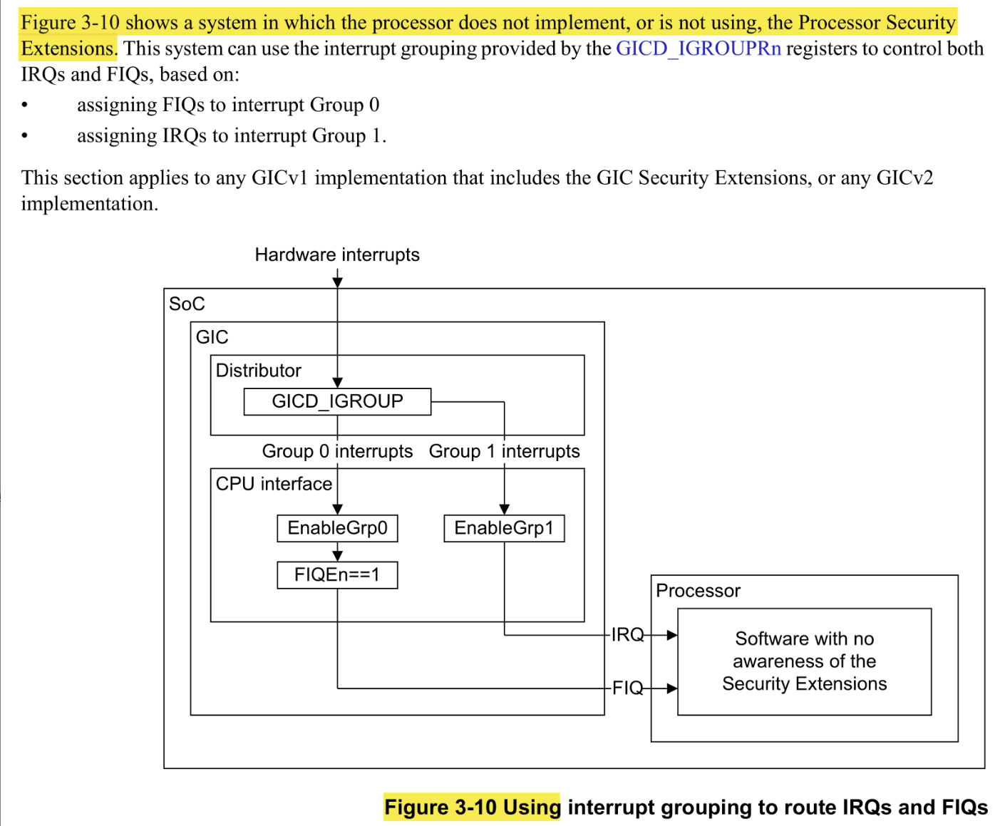
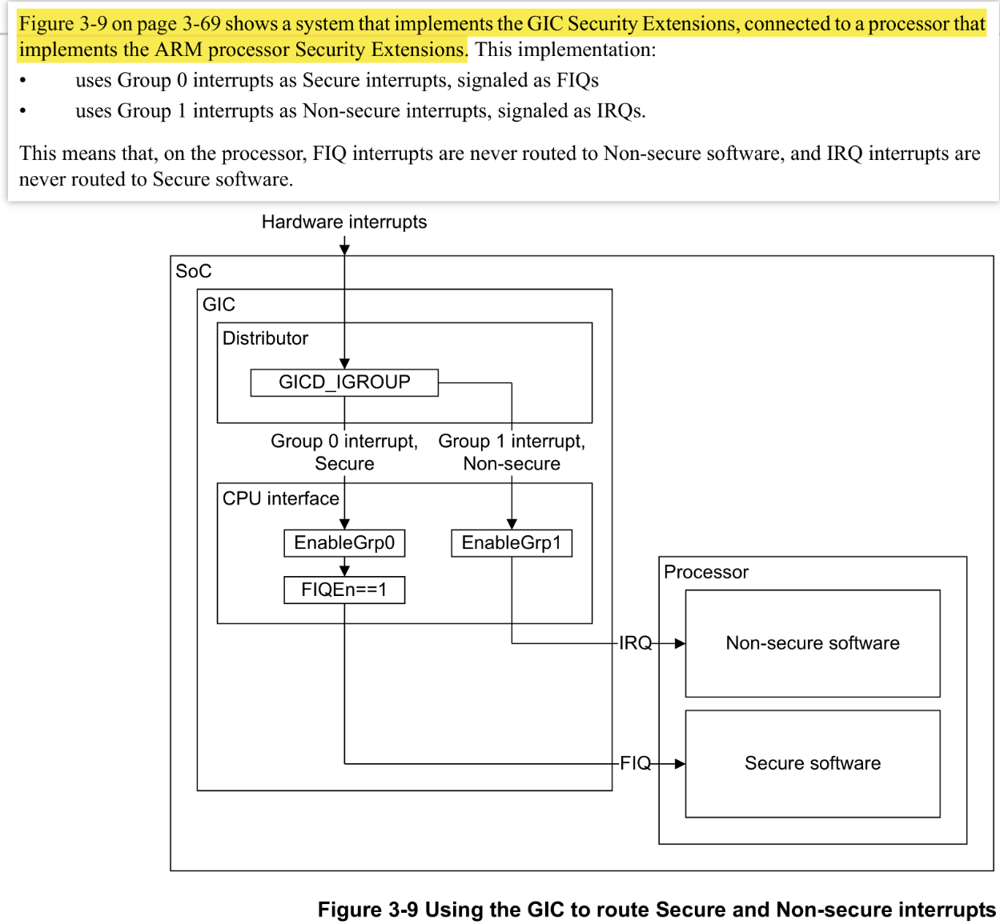
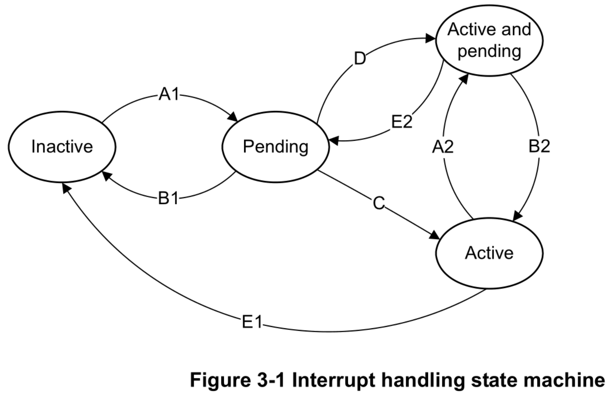

# 中断控制器GICv2以及Liteos_a内核使用流程分析

[TOC]

# 1、一句话总结GICv2

GICv2是ARM架构的标准中断控制器，通过Distributor全局管理和CPU Interface核间协作，实现多核系统的优先级仲裁、状态机管理和高效中断路由。

使用过程中有任何细节问题参考ARM GICv2的说明书：
[ARM Generic Interrupt Controller Architecture version 2.0 - Architecture Specification](https://developer.arm.com/documentation/ihi0048/latest/)

# 2、GICv2使用中断的通用流程

## 2.1、GICv2的整体架构图

**Distributor（分发器）**：

- 全局中断管理（IRQ 0-1020）
- 中断优先级排序
- 中断路由到目标CPU
- 中断使能/禁用控制

**CPU Interface（CPU接口）**：

- 每CPU核心独立实例
- 中断信号（IRQ/FIQ）生成
- 中断确认/完成处理
- 优先级掩码设置

**中断源类型**：

| 类型 |  范围   |    特性     |     用途      |
| :--: | :-----: | :---------: | :-----------: |
| SGI  |  0-15   |  软件触发   | 核间通信(IPI) |
| PPI  |  16-31  | 每个CPU私有 | 定时器中断等  |
| SPI  | 32-1020 |  全局共享   |   外设中断    |

## 2.2、初始化流程

* 1、关闭中断从Distrbutor到CPU Interface的总开关：
  - 通过GICD_CTLR禁止Group0、1到CPU Interface的中断转发。由于GIC在start-up或reset之后初始值就是关闭的状态，所以此步骤可省略。

* 2、关闭CPU Interfae到CPU Core的开关：
  - 通过GICC_CTLR。由于GIC在start-up或reset之后初始值就是关闭的状态，所以此步骤可省略

* 3、设置中断分组：

  - 通过GICD_IGROUPRn

  - 要在使能/禁用中断单独开关之前

  - 由于GIC在start-up或reset之后初始值就是将所有中断转发至Group0，直接使用Group0是也可以不用设置。

* 4、设置中断的触发方式

  - 通过GICD_ICFGR 

  - 要在使能/禁用中断单独开关之前

* 5、设置中断的目标响应CPU：

  - 通过GICD_ITARGETSR 

  - 要在使能/禁用中断单独开关之前

* 6、设置中断的优先级：

  - 通过GICD_IPRIORITYR 

  - 要在使能/禁用中断单独开关之前

* 7、设置中断从Distributor到CPU Interface的单独开关：
  - 通过GICD_ICENABLER

* 8、设置CPU能够响应的中断范围：
  - 通过GICC_PMR

* 9、开启CPU Interface到CPU Core的中断转发：
  - 通过GICC_CTLR

* 10、开启中断从Distrbutor到CPU Interface的总开关：
  - 通过GICD_CTLR

## 2.3、创建流程

* 1、内核提供中断处理函数
  - 比如Liteos_a内核通过LOS_HwiCreate函数创建

* 2、打开中断单独从Distributor到CPU Interface的开关
  - 比如Liteos_a内核通过HalIrqUnmask函数，底层是使用GICD_ISENABLER写1实现
  - 所有GICv2系统必须通过`GICD_ISENABLER`寄存器写1来最终完成中断使能，这是硬件规范要求。

## 2.4、响应流程

### 2.4.1、bypass模式

bypass模式下中断无优先级、分组、编号等等机制，需要程序员自行设计处理流程。

1、中断源产生中断

2、CPU Core的IRQ/FIQ接口

3、CPU处理

- 保存现场
- 执行中断处理程序
- 恢复现场，返回中断前程序继续运行

### 2.4.2、GIC管理模式

1、中断源产生中断

2、到GIC Distributor，根据分组将中断转发到Group0/1中

- GIC DIstributor根据设置的中断优先级，
转发优先级较高(数值较低)的

- GIC DIstributor根据设置的中断目标CPU，
  裁决哪个CPU响应，之后将中断转发
  至对应的CPU Interface

- 对于多个中断，GIC使用硬件机制保存了每一个处于Pending状态的中断，就像硬件维护了一个Pending List，每一个Pending中断会在合适的时机转发至CPU处理

- （GICD_ISPENDRn、GICD_ICPENDRn、GICD_SPENDSGIRn、GICD_CPENDSGIRn寄存器中保存了中断的Pending状态，）

3、CPU Interface根据设置的中断掩码，决定是否将中断转发至CPU Core

4、CPU Interface根据设置，决定将中断通过IRQ/FIQ转发给CPU Core

5、CPU Core收到IRQ/FIQ信号：

- 1）保存现场
- 2）读取GICC_IAR寄存器判断是哪个中断，此时GIC会将此中断标记为Active状态，防止其他CPU Core重复响应
- 3）执行中断处理程序
- 4）将原始的GICC_IAR寄存器数值写入GICC_EOIR通知GIC完成中断的处理，GIC会将该中断标记为Inactive状态，以允许同号中断再次进入。
- 5）恢复现场，返回中断之前的程序继续运行原程序。

# 3、GICv2管理中断的框架

## 3.1、中断转发路径

添加GIC中相关配置寄存器时的中断路径转发流程：

不使用安全扩展时的中断转发路径：

使用安全扩展时的中断转发路径：

## 3.2、中断状态机模型

各个状态的触发时机：

* 1、A1和A2触发时机：A1表示此中断此时未被触发过，A2表示此中断正处于运行状态。
  * 当中断处于Inactive状态时，触发的是A1；当中断处于Active状态时，触发的是A2。
  * SPI和PPI：
    * 外设发出SPI或PPI的中断信号；
    * 写GICD_ISPENDRn寄存器中中断对应的bit。
  * SGI：
    * 软件写GICD_SGIR寄存器的相应bit；
    * 软件写GICD_SPENDSGIRn寄存器的相应bit。

* 2、B1和B2触发时机：B1表示此中断已经触发但未执行，B2表示此中断正在执行且被多次触发。
  - 当中断处于Pending状态时，触发的是B1；当中断处于Active and Pending状态时，触发的是B2。
  - SPI和PPI：
    - 电平触发的中断，外设将中断的有效电平改为无效电平；
    - 上升沿触发的中断，软件写GICD_ICPENDRn寄存器相应bit。
  - SGI：
    - 目标CPU写GICD_CPENDSGIRn寄存器相应bit。

* 3、C的触发时机：C表示此中断被触发、有足够的优先级、软件读取完GICC_IAR寄存器、并且在硬件将Pending修改为Active期间没有发生重复触发（写Pending状态或者再次触发）。

  - 当前处于Pending状态的中断有足够高的组优先级能够被CPU Core相应。

  * SPI、PPI、SGI：
    - 当软件从GICC_IAR中读取当前CPU Interface的Pending等待队列之后，
       GIC会将这个中断的状态修改为Active；

  * 在读取GICC_IAR发生的动作如下：
    * 将中断状态从Pending→Active（触发Transition C）。
    * 更新CPU Interface的运行优先级（Running Priority）为当前中断的组优先级。
    * 清除该中断的Pending状态。

* 4、D的触发时机：这里的同时说的包括两种，一个是写操作在读取GIC_IAR之前，一个在之后，
  但是硬件在读取GICC_IAR之后没有及时将中断状态从Pending修改为Active，中断被再次触发或者进行了写Pending操作，此时硬件会检测到这个竞态，提供了直接从Pending到Active and Pending的路径D。目的就是为了解决竞态窗口中Pending残留的问题。

  - 当中断处于Pending状态，CPU读取GICC_IAR、同时有相同中断被触发或者通过软件强制写这个中断的状态为Pending时发生。

  * SPI和PPI：以下三个条件同时成立时会触发D

    * 中断被使能；
    * 完成GICC_IAR的读取操作；
    * 对于电平触发了边沿触发有不同的条件

      - 电平触发：在读取GICC_IAR之后，外设保持了此中断的有效电平。（⚠️即在读取GICC_IAR之后硬件未能及时将中断状态从Pending修改为Active，此时硬件检测到此中断仍处于有效电平，所以直接通过D解决Pending残留。）

      - 边沿触发：1️⃣在读取GICC_IAR之后，新边沿被触发，GIC直接将此编号的中断从Pending 通过 D 变为 Active and Pending。（Active是对旧边沿触发的中断操作，Pending是对新边沿触发的中断操作）（⚠️这个也是为了解决竞态提供的D）

  * SGI：

    - 同一编号的SGI被触发多次：在极短时间内，同一源CPU多次触发相同编号的SGI到同一目标CPU时，一个中断从Pending转换为Active（C），其他的中断从Pending转换为 Active and Pending（D）。（⚠️为了处理竞态中的Pending残留）

    - 同一编号的SGI被触发一次：当CPU读GICC_IAR准备响应这个SGI时，同时发生了写GICD_SPENDSGIRn这样的操作，会将这个SGI的状态从Pending转换为Active and Pending。（⚠️为了处理竞态中的Pending残留）

* 5、E1和E2触发时机：

  - 当CPU处理完中断之后，写GICC_EIOR或GICC_DIR之后会同步修改中断状态。

  - 走E1表示当前中断只触发了一次，走E2表示当前中断被触发了多次。

  * SPI、PPI、SGI：

    - 写GICC_EOIR之后修改状态，表示Priority Drop和Interrupt Deactivation同步进行，此时GICC_CTLR.EOImode == 0；

    - 写GICC_DIR之后修改状态，表示Priority Drop和Interrupt Deactivation分开，此时GICC_CTLR.EOImode == 1；

# 4、Liteos_a内核中使用GICv2的案例

在ARM V7-A架构中，Liteos_a内核使用GIC-V2的SPI中断处理流程整体上遵循：

* 1、中断初始化 
* 2、中断源触发并向CPU发送中断信号 
* 3、到达GIC Distributor决定是否转发至CPU Interface 
* 4、到达CPU Interface决定是否转发至CPU Core 
* 5、CPU Core保存现场 
* 6、CPU Core执行中断处理程序 
* 7、CPU Core恢复现场并返回原程序

具体见思维导图：[Liteos_a内核在ARMv7-a架构下使用GICv2的流程分析.zxm](Liteos_a内核在ARMv7-a架构下使用GICv2的流程分析.zxm)

