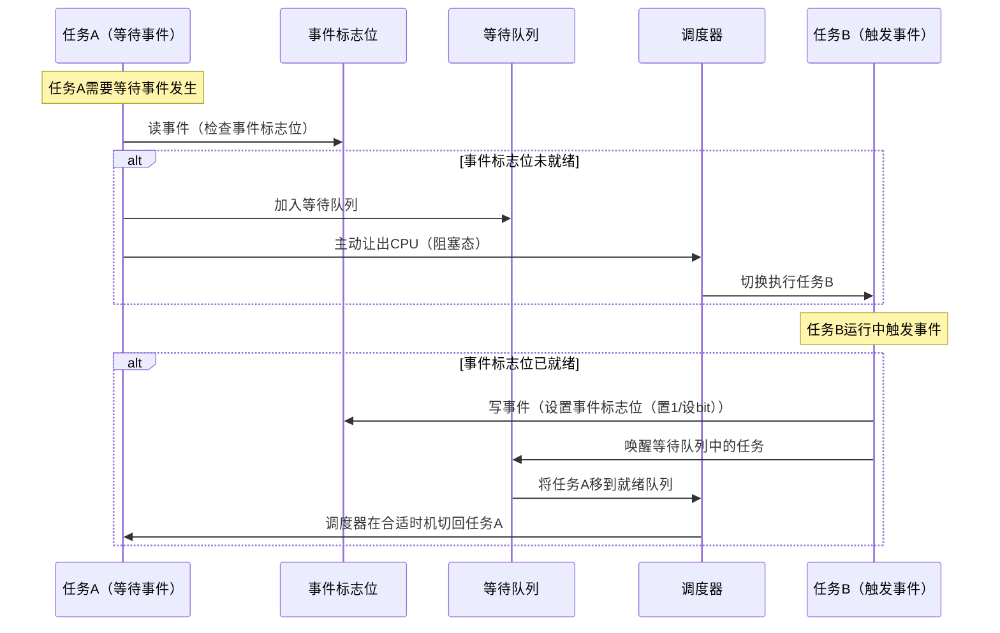
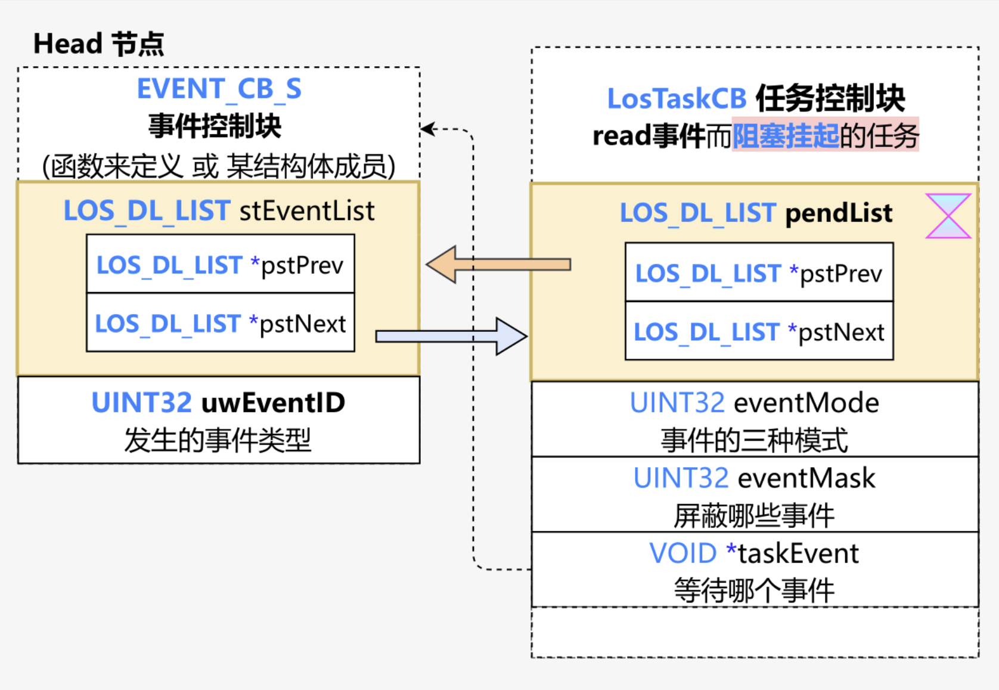

# 事件Event机制与Liteos_a内核事件机制分析

[TOC]

# 1、事件的通用知识点

## 1.1、事件的概念

​	事件是操作系统内核中用于**任务间通信和同步的核心机制**，本质上是**对于系统状态变化的抽象通知**。事件的核心特征包括：

- **异步通知**：硬件中断、资源就绪等状态变化通过事件传递，无需任务主动轮询。
- **同步原语**：任务可阻塞等待特定事件发生，实现精确同步（如多任务协作）。
- **无数据传递**：仅传递状态变化信号，不携带具体数据（区别于消息队列）。
- **多对多关联**：一个任务可等待多个事件，多个任务可等待同一事件。
    - 一对多同步模型：一个任务等待多个事件的触发。可以是任意一个事件发生时唤醒任务处理事件，也可以是几个事件都发生后才唤醒任务处理事件。
    - 多对多同步模型：多个任务等待多个事件的触发。


## 1.2、事件的通用结构

### 1.2.1、事件控制块

**核心作用**：管理单个事件的完整生命周期，包括状态跟踪、等待队列挂载及同步控制。

**通用结构设计**：

```c
struct event_control_block {
    UINT32 event_flags;   		// 事件标志位（位图，支持多事件状态）
    struct List wait_queue;		// 等待队列头（双向链表结构）
};
```


### 1.2.2、事件标志位

**核心作用**：位图设计（如32位），每位代表一个独立事件类型（如bit0=定时器到期、bit1=I/O就绪）。	

**通用结构设计**：在事件控制块中的 event_flags 是一个32位无符号整形的变量，使用其中的每一个bit来表示一个事件的状态，通常事件的状态有：

* bit 为 1 ==> 表示有事件发生
* bit 为 0 ==> 表示无事件发生


### 1.2.3、事件等待队列

**核心作用**：关联阻塞任务与事件，实现任务休眠与精准唤醒。

**通用结构设计**：比如使用双向循环链表，将任务挂载到链表中。

```c
struct List wait_queue {
    struct List *prev;
    struct List *next;
};
```


## 1.3、事件的运行时序图




# 2、Liteos_a内核中事件的实现

## 2.1、Liteos_a内核中事件的概念

Liteos_a内核的事件模块提供的事件，具有如下特点：

- 任务通过创建事件控制块来触发事件或等待事件。
- 事件间相互独立，内部实现为一个32位无符号整型，每一位标识一种事件类型。（0表示该时间类型未发生，1表示该事件类型已经发生，一共31种事件类型，第25bit位(`0x02U << 24`)系统保留）
- 事件仅用于任务间的同步，不提供数据传输功能。
- 多次向事件控制块写入同一事件类型，在被清零前等效于只写入一次。
- 多个任务可以对同一事件进行读写操作。
- 支持事件读写超时机制。


## 2.2、Liteos_a内核的事件运行机制

### 2.2.1、事件初始化

​	创建一个事件控制块，该控制块维护一个已处理的事件集合，以及等待特定事件的任务链表。


### 2.2.2、写事件

​	会向事件控制块写入指定的事件，事件控制块更新事件集合，并遍历任务链表，根据任务等待具体条件满足情况决定是否唤醒相关任务。


### 2.2.3、读事件

​	如果读取的事件已存在时，会直接同步返回。其他情况会根据超时时间以及事件触发情况，来决定返回时机：等待的事件条件在超时时间耗尽之前到达，阻塞任务会被直接唤醒，否则超时时间耗尽该任务才会被唤醒。

​	读事件条件满足与否取决于入参eventMask和mode，eventMask即需要关注的事件类型掩码。mode是具体处理方式，分以下三种情况：

- LOS_WAITMODE_AND：逻辑与，基于接口传入的事件类型掩码eventMask，只有这些事件都已经发生才能读取成功，否则该任务将阻塞等待或者返回错误码。
- LOS_WAITMODE_OR：逻辑或，基于接口传入的事件类型掩码eventMask，只要这些事件中有任一种事件发生就可以读取成功，否则该任务将阻塞等待或者返回错误码。
- LOS_WAITMODE_CLR：这是一种附加读取模式，需要与所有事件模式或任一事件模式结合使用（LOS_WAITMODE_AND | LOS_WAITMODE_CLR或 LOS_WAITMODE_OR | LOS_WAITMODE_CLR）。在这种模式下，当设置的所有事件模式或任一事件模式读取成功后，会自动清除事件控制块中对应的事件类型位。


### 2.2.4、事件清零

​	根据指定掩码，去对事件控制块的事件集合进行清零操作。当掩码为0时，表示将事件集合全部清零。当掩码为0xffff时，表示不清除任何事件，保持事件集合原状。


### 2.2.5、事件销毁

销毁指定的事件控制块。


### 2.2.6、事件运作原理图


## 2.3、Liteos_a内核事件模块的总结

​	分析到这里，可以看出Liteos_a内核完整的实现了 1.1 ~ 1.3 小节中事件通用的所有机制。接下来就借助Liteos_a内核的源代码继续分析，Liteos_a内核是如何通过代码将事件的这些机制一一实现的。


# 3、Liteos_a内核事件开发案例

## 3.1、接口说明

Liteos_a内核的事件模块提供下面几种功能：

| 功能分类     	| 接口描述                                            |
| ------------ | ------------------------------------------------- |
| 初始化事件   | LOS_EventInit：初始化一个事件控制块                 |
| 读/写事件    | LOS_EventRead：读取指定事件类型，超时时间为相对时间：单位为Tick <br />LOS_EventWrite：写指定的事件类型 |
| 清除事件     | LOS_EventClear：清除指定的事件类型                |
| 校验事件掩码 | LOS_EventPoll：根据用户传入的事件ID、事件掩码及读取模式，返回用户传入的事件是否符合预期<br />LOS_EventDestroy：销毁指定的事件控制块 |
| 销毁事件     | LOS_EventDestroy：销毁指定的事件控制块               |


## 3.2、开发流程

事件的典型开发流程：

* 1、初始化事件控制块
* 2、阻塞读事件控制块
* 3、写入相关事件
* 4、阻塞任务被唤醒，读取事件并检查是否满足要求
* 5、处理事件控制块
* 6、事件控制块销毁

特别说明：
- 进行事件读写操作时，事件的第25bit(`0x02U << 24`)为保留bit位，不可以进行位设置。
- 对同一事件反复写入，算作一次写入。


## 3.3、编程实例

### 3.3.1、实例描述

示例中，任务Example_TaskEntry创建一个任务Example_Event，Example_Event读事件阻塞，Example_TaskEntry向该任务写事件。可以通过示例日志中打印的先后顺序理解事件操作时伴随的任务切换。

* 1、在任务Example_TaskEntry创建任务Example_Event，其中任务Example_Event优先级高于Example_TaskEntry。
* 2、在任务Example_Event中读事件0x00000001，阻塞，发生任务切换，执行任务Example_TaskEntry。
* 3、在任务Example_TaskEntry向任务Example_Event写事件0x00000001，发生任务切换，执行任务Example_Event。
* 4、Example_Event得以执行，直到任务结束。
* 5、Example_TaskEntry得以执行，直到任务结束。


### 3.3.2、编程示例

​	本演示代码在`./kernel/liteos_a/testsuites/kernel/src/osTest.c`中编译验证，在TestTaskEntry中调用验证入口函数Example_EventEntry。

示例代码：

```c
#include "los_event.h"
#include "los_task.h"
#include "securec.h"

/* 任务ID */
UINT32 g_testTaskId;

/* 事件控制结构体 */
EVENT_CB_S g_exampleEvent;

/* 等待的事件类型 */
#define EVENT_WAIT      0x00000001
#define EVENT_TIMEOUT   500
/* 用例任务入口函数 */
VOID Example_Event(VOID)
{
     UINT32 event;

    /*
     * 超时等待方式读事件,超时时间为100 ticks, 
	 * 若100 ticks后未读取到指定事件，读事件超时，任务直接唤醒
	 */
    dprintf("Example_Event wait event 0x%x \n", EVENT_WAIT);

    event = LOS_EventRead(&g_exampleEvent, EVENT_WAIT, 
                          LOS_WAITMODE_AND, EVENT_TIMEOUT);
    if (event == EVENT_WAIT) {
        dprintf("Example_Event,read event :0x%x\n", event);
    } else {
        dprintf("Example_Event,read event timeout\n");
    }
}

UINT32 Example_EventEntry(VOID)
{
    UINT32 ret;
    TSK_INIT_PARAM_S task1;

    /* 事件初始化 */
    ret = LOS_EventInit(&g_exampleEvent);
    if (ret != LOS_OK) {
        dprintf("init event failed .\n");
        return -1;
    }

    /* 创建任务 */
    (VOID)memset_s(&task1, sizeof(TSK_INIT_PARAM_S), 0, sizeof(TSK_INIT_PARAM_S));
    task1.pfnTaskEntry = (TSK_ENTRY_FUNC)Example_Event;
    task1.pcName       = "EventTsk1";
    task1.uwStackSize  = LOSCFG_BASE_CORE_TSK_DEFAULT_STACK_SIZE;
    task1.usTaskPrio   = 5;
    ret = LOS_TaskCreate(&g_testTaskId, &task1);
    if (ret != LOS_OK) {
        dprintf("task create failed.\n");
        return LOS_NOK;
    }

    /* 写g_testTaskId 等待事件 */
    dprintf("Example_TaskEntry write event.\n");

    ret = LOS_EventWrite(&g_exampleEvent, EVENT_WAIT);
    if (ret != LOS_OK) {
        dprintf("event write failed.\n");
        return LOS_NOK;
    }

    /* 清标志位 */
    dprintf("EventMask:%d\n", g_exampleEvent.uwEventID);
    LOS_EventClear(&g_exampleEvent, ~g_exampleEvent.uwEventID);
    dprintf("EventMask:%d\n", g_exampleEvent.uwEventID);

    return LOS_OK;
}
```

编译运行得到的结果为：

```bash
Example_Event wait event 0x1 
Example_TaskEntry write event.
Example_Event,read event :0x1
EventMask:1
EventMask:0
```


# 4、Liteos_a内核事件的源码分析

## 4.1、事件控制块 EVENT_CB_S

```c
// kernel_liteos_a\kernel\include\los_event.h
typedef struct tagEvent {
    // 事件掩码 bit[25]不使用，为 1 表示事件发生、为 0 表示事件未发生
    UINT32 uwEventID;
    // 等待上述事件的任务，被挂载到这个链表上
    LOS_DL_LIST stEventList;
} EVENT_CB_S, *PEVENT_CB_S;
```

事件控制块 ECB 和任务控制块 TCB 的连接方式：




## 4.2、事件的读取方式 AND/OR/CLR

```c
// kernel_liteos_a\kernel\include\los_event.h
/**
 * @ingroup los_event
 * Event reading mode: The task waits for all its expected events to occur.
 */
#define LOS_WAITMODE_AND                    4U

/**
 * @ingroup los_event
 * Event reading mode: The task waits for any of its expected events to occur.
 */
#define LOS_WAITMODE_OR                     2U

/**
 * @ingroup los_event
 * Event reading mode: The event flag is immediately cleared after the event is read.
 */
#define LOS_WAITMODE_CLR                    1U
```


## 4.3、事件初始化 LOS_EventInit

```c
// kernel_liteos_a\kernel\base\ipc\los_event.c
/*
    1、将PEVENT_CB_S eventCB中的 事件掩码 清零
    2、将PEVENT_CB_S eventCB中的 等待链表 初始化为指向自己的 单节点双向循环链表
*/
LITE_OS_SEC_TEXT_INIT UINT32 LOS_EventInit(PEVENT_CB_S eventCB)
{
    UINT32 intSave;

    if (eventCB == NULL) {
        return LOS_ERRNO_EVENT_PTR_NULL;
    }

    intSave = LOS_IntLock();
    // 1、将PEVENT_CB_S eventCB中的 事件掩码 清零
    eventCB->uwEventID = 0;
    // 2、将PEVENT_CB_S eventCB中的 等待链表 初始化为指向自己的 单节点双向循环链表
    LOS_ListInit(&eventCB->stEventList);
    LOS_IntRestore(intSave);
    OsHookCall(LOS_HOOK_TYPE_EVENT_INIT, eventCB);
    return LOS_OK;
}
```


## 4.4、事件检测 LOS_EventPoll

```c
// kernel_liteos_a\kernel\base\ipc\los_event.c
/*
    brief：该API用于根据事件ID、事件掩码和事件读取模式，检测用户预期的事件是否已发生，
    并基于事件读取模式对事件进行处理。事件ID必须指向有效的内存地址。
    1、检查参数
    2、按照读取模式mode 读取事件ID eventID是否是 事件掩码eventMask当中的事件
*/
LITE_OS_SEC_TEXT UINT32 LOS_EventPoll(UINT32 *eventID, UINT32 eventMask, UINT32 mode)
{
    UINT32 ret;
    UINT32 intSave;

    // 检查参数
    //     空指针检查
    //     事件掩码有效性检查
    //     保留位检查
    //     模式冲突检测
    ret = OsEventParamCheck((VOID *)eventID, eventMask, mode);
    if (ret != LOS_OK) {
        return ret;
    }

    SCHEDULER_LOCK(intSave);
    // 2、按照读取模式mode 读取事件ID eventID是否是 事件掩码eventMask当中的事件
    ret = OsEventPoll(eventID, eventMask, mode);
    SCHEDULER_UNLOCK(intSave);
    return ret;
}
```

其中的 OsEventPoll 函数：

```c
// kernel_liteos_a\kernel\base\ipc\los_event.c
LITE_OS_SEC_TEXT UINT32 OsEventPoll(UINT32 *eventID, UINT32 eventMask, UINT32 mode)
{
    UINT32 ret = 0;

    LOS_ASSERT(OsIntLocked());
    LOS_ASSERT(LOS_SpinHeld(&g_taskSpin));

    // 1、OR模式检测
    if (mode & LOS_WAITMODE_OR) {   
        if ((*eventID & eventMask) != 0) {
            ret = *eventID & eventMask;// 返回匹配的事件位
        }
    } else {
        // 2、AND模式检测
        if ((eventMask != 0) && (eventMask == (*eventID & eventMask))) {
            ret = *eventID & eventMask;
        }
    }

     // 3、根据读取模式mode
     // 根据是否设置了附加读取模式(LOS_WAITMODE_CLR)确定
     // 是否要在读取完之后清除这个事件
    if (ret && (mode & LOS_WAITMODE_CLR)) {
        *eventID = *eventID & ~ret;
    }

    return ret;
}
```


## 4.5、读事件 LOS_EventRead

```c
// kernel_liteos_a\kernel\base\ipc\los_event.c
LITE_OS_SEC_TEXT UINT32 LOS_EventRead(PEVENT_CB_S eventCB, UINT32 eventMask, 
                                      UINT32 mode, UINT32 timeout)
{
    return OsEventRead(eventCB, eventMask, mode, timeout, FALSE);
}
/*
    1、参数检查
    2、调用具体的读事件函数OsEventReadImp
*/
LITE_OS_SEC_TEXT STATIC UINT32 OsEventRead(PEVENT_CB_S eventCB, UINT32 eventMask, 
                                           UINT32 mode, UINT32 timeout, BOOL once)
{
    UINT32 ret;
    UINT32 intSave;

    // 1、参数合法性检查
    // 2、中断上下文检查：不能在中断中读事件
    // 3、系统任务检查：不能在系统任务中读事件
    ret = OsEventReadCheck(eventCB, eventMask, mode);
    if (ret != LOS_OK) {
        return ret;
    }

    SCHEDULER_LOCK(intSave);
    // 1、尝试非阻塞方式读事件
    // 2、非阻塞读事件失败，0等待立即返回
    // 3、非0等待，当前正在运行的任务：
    //     保存事件掩码；
    //     设置任务的等待状态信息；
    //     调用ops->wait将自己挂到事件等待链表eventCB->stEventList中；
    // 4、事件被唤醒，再读一次事件
    //     超时唤醒；
    //     事件发生唤醒。
    ret = OsEventReadImp(eventCB, eventMask, mode, timeout, once);
    SCHEDULER_UNLOCK(intSave);
    return ret;
}
```

其中的 OsEventReadImp 函数：

```c
// kernel_liteos_a\kernel\base\ipc\los_event.c
/*
这里虽然是读事件，但是本意是为了任务间的同步，所以有：
- 事件触发模式（一次性模式）：等待新事件的发生
- 状态检测模式（标准模式）：检查条件是否满足
    1、尝试非阻塞方式读事件
    2、非阻塞读事件失败，0等待立即返回
    3、非0等待，当前正在运行的任务：
        保存事件掩码；
        设置任务的等待状态信息；
        调用ops->wait将自己挂到事件等待链表eventCB->stEventList中；
    4、事件被唤醒，再读一次事件
        超时唤醒；
        事件发生唤醒。
*/
LITE_OS_SEC_TEXT STATIC UINT32 OsEventReadImp(PEVENT_CB_S eventCB, UINT32 eventMask, 
                                              UINT32 mode, UINT32 timeout, BOOL once)
{
    UINT32 ret = 0;
    LosTaskCB *runTask = OsCurrTaskGet();
    OsHookCall(LOS_HOOK_TYPE_EVENT_READ, eventCB, eventMask, mode, timeout);

    // 1、首先尝试非阻塞方式检测事件是否已经发生
    if (once == FALSE) {
        ret = OsEventPoll(&eventCB->uwEventID, eventMask, mode);
    }

    // 事件未发生
    if (ret == 0) {
        // 2、不等待，立即返回
        if (timeout == 0) {
            return ret;
        }

        // 检查是否可以进行任务调度
        if (!OsPreemptableInSched()) {
            return LOS_ERRNO_EVENT_READ_IN_LOCK;
        }

        // 3、非0等待
        runTask->eventMask = eventMask;// 保存事件掩码
        runTask->eventMode = mode;// 保存事件模式
        runTask->taskEvent = eventCB;// 保存事件控制块
        // 这个函数设置任务的等待状态信息，标记任务正在等待事件。
        OsTaskWaitSetPendMask(OS_TASK_WAIT_EVENT, eventMask, timeout);
        // 这里将当前任务加入事件控制块的等待队列，并挂起当前任务,直到：
        // - 事件发生（通过 `LOS_EventWrite` 触发）
        // - 超时发生
        // - 任务被强制唤醒
        ret = runTask->ops->wait(runTask, &eventCB->stEventList, timeout);
        if (ret == LOS_ERRNO_TSK_TIMEOUT) {
            return LOS_ERRNO_EVENT_READ_TIMEOUT;
        }
        // 4、任务被唤醒后，需要再次检测事件状态，因为：
        // - 可能是超时唤醒
        // - 可能是事件发生唤醒，但需要根据mode确定具体哪些事件位匹配
        ret = OsEventPoll(&eventCB->uwEventID, eventMask, mode);
    }
    return ret;
}
```


## 4.6、写事件 LOS_EventWrite

```c
// kernel_liteos_a\kernel\base\ipc\los_event.c
LITE_OS_SEC_TEXT UINT32 LOS_EventWrite(PEVENT_CB_S eventCB, UINT32 events)
{
    return OsEventWrite(eventCB, events, FALSE);
}
/*
    1、参数合法性检查
    2、在调度器锁保护下执行事件写入和任务唤醒
    3、根据需要触发任务调度
*/
LITE_OS_SEC_TEXT STATIC UINT32 OsEventWrite(PEVENT_CB_S eventCB, UINT32 events, 
                                            BOOL once)
{
    UINT32 intSave;
    UINT8 exitFlag = 0;
    
    // 参数检查：事件控制块不能为空 
    if (eventCB == NULL) {
        return LOS_ERRNO_EVENT_PTR_NULL;
    }

    // 参数检查：事件位不能使用保留位(bit25)
    if (events & LOS_ERRTYPE_ERROR) {
        return LOS_ERRNO_EVENT_SETBIT_INVALID;
    }

    // 加锁保护事件操作
    SCHEDULER_LOCK(intSave);
    // 执行实际的事件写入和任务唤醒
    OsEventWriteUnsafe(eventCB, events, once, &exitFlag);
    SCHEDULER_UNLOCK(intSave);

    // 如果有任务被唤醒，触发任务调度
    if (exitFlag == 1) {
        // 多处理器系统中通知所有CPU
        LOS_MpSchedule(OS_MP_CPU_ALL);
        // 触发任务调度
        LOS_Schedule();
    }
    return LOS_OK;
}
```

其中的 OsEventWriteUnsafe 函数：

```c
// kernel_liteos_a\kernel\base\ipc\los_event.c
/*
    1、首先设置事件控制块中的事件位
    2、然后遍历等待该事件的任务队列
    3、对每个任务调用 `OsEventResume` 尝试唤醒
    4、根据once参数决定是否只唤醒一个任务
    5、如果有任务被唤醒，设置调度标志 
*/
LITE_OS_SEC_TEXT VOID OsEventWriteUnsafe(PEVENT_CB_S eventCB, UINT32 events, 
                                         BOOL once, UINT8 *exitFlag)
{
    LosTaskCB *resumedTask = NULL;
    LosTaskCB *nextTask = NULL;
    BOOL schedFlag = FALSE;
    // 调用钩子函数(如果已注册)
    OsHookCall(LOS_HOOK_TYPE_EVENT_WRITE, eventCB, events);
    // 设置事件位(按位或操作)
    eventCB->uwEventID |= events;
    // 如果有任务在等待这个事件
    if (!LOS_ListEmpty(&eventCB->stEventList)) {
        // 遍历等待队列中的所有任务
        for (resumedTask = LOS_DL_LIST_ENTRY((&eventCB->stEventList)->pstNext, 
                                             LosTaskCB, pendList);
             &resumedTask->pendList != &eventCB->stEventList;) {
            // 保存下一个任务指针(因为当前任务可能被移出队列)
            nextTask = LOS_DL_LIST_ENTRY(resumedTask->pendList.pstNext, LosTaskCB, 
                                         pendList);
            // 尝试唤醒任务，如果成功则设置调度标志
            if (OsEventResume(resumedTask, eventCB, events)) {
                schedFlag = TRUE;
            }
            // 如果是一次性写入模式，只唤醒一个任务后就退出
            if (once == TRUE) {
                break;
            }
            // 移动到下一个任务
            resumedTask = nextTask;
        }
    }

    // 如果有任务被唤醒，设置退出标志
    if ((exitFlag != NULL) && (schedFlag == TRUE)) {
        *exitFlag = 1;
    }
}
```

其中的 OsEventResume 函数：

```c
// kernel_liteos_a\kernel\base\ipc\los_event.c
/*
    1、根据任务的等待模式(OR或AND)和事件掩码判断是否满足唤醒条件
    2、如果满足条件，清除任务的事件关联和等待状态
    3、调用任务的wake操作函数唤醒任务，就是重新加入就绪队列并设置重新调度的标志，
       等待安全调度点之后触发调度。
*/
LITE_OS_SEC_TEXT STATIC UINT8 OsEventResume(LosTaskCB *resumedTask, 
                                            const PEVENT_CB_S eventCB, UINT32 events)
{
    UINT8 exitFlag = 0;
    // 判断任务等待的条件是否满足:
    // 1. OR模式：任一指定事件位被触发
    //           这个任务是OR模式唤醒的，并且它的事件掩码eventMask 
    // 			 与上这次的事件events 不为空，表示这次事件发生了就可以将其唤醒。
    // 2. AND模式：所有指定事件位都被触发
    //          这个任务是AND模式唤醒的，并且它的事件掩码eventMask 
    // 			与上这次的事件events == 它的事件掩码eventMask，
    //          表示这次事件就是它要等待的唯一事件。
    if (((resumedTask->eventMode & LOS_WAITMODE_OR) && 
        ((resumedTask->eventMask & events) != 0)) ||
        ((resumedTask->eventMode & LOS_WAITMODE_AND) &&
        ((resumedTask->eventMask & eventCB->uwEventID) == resumedTask->eventMask))) {
        // 设置退出标志
        exitFlag = 1;
        // 清除任务的事件关联
        resumedTask->taskEvent = NULL;
        // 清除任务的等待状态，就是将标志位清零，表示任务不再处于等待状态
        //  resumeTask->waitID = 0;
        //  resumeTask->waitFlag = 0;
        OsTaskWakeClearPendMask(resumedTask);
        // 唤醒任务
        resumedTask->ops->wake(resumedTask);
    }

    return exitFlag;
}
```


## 4.7、事件清除 LOS_EventClear

```c
// kernel_liteos_a\kernel\base\ipc\los_event.c
LITE_OS_SEC_TEXT_MINOR UINT32 LOS_EventClear(PEVENT_CB_S eventCB, UINT32 eventMask)
{
    UINT32 intSave;

    if (eventCB == NULL) {
        return LOS_ERRNO_EVENT_PTR_NULL;
    }
    OsHookCall(LOS_HOOK_TYPE_EVENT_CLEAR, eventCB, eventMask);
    // 加锁禁止调度，保护写操作不被其他任务打断
    SCHEDULER_LOCK(intSave);
    // 从任务控制块中清除特定任务eventMask的标志位
    eventCB->uwEventID &= eventMask;
    SCHEDULER_UNLOCK(intSave);

    return LOS_OK;
}
```


## 4.8、事件销毁 LOS_EventDestroy

```c
// kernel_liteos_a\kernel\base\ipc\los_event.c
/*
    1、参数检查
    2、检查事件控制块是否可以销毁
    3、清除事件控制块
    4、（如果注册）调用钩子函数并返回
注意：
    这里只是重置了等待队列，而没有释放 eventCB 本身的内存；
    事件控制块可以通过多种方式创建：
    - 静态分配（如全局变量或栈变量）
    - 动态分配（通过malloc/LOS_MemAlloc等函数）
    由于创建方式多样，销毁函数无法确定应该如何释放内存，因此将内存释放的责任留给了调用者。
*/
LITE_OS_SEC_TEXT_INIT UINT32 LOS_EventDestroy(PEVENT_CB_S eventCB)
{
    UINT32 intSave;

    // 任务控制块不为空
    if (eventCB == NULL) {
        return LOS_ERRNO_EVENT_PTR_NULL;
    }

    SCHEDULER_LOCK(intSave);
    // 还有任务在等待事件
    if (!LOS_ListEmpty(&eventCB->stEventList)) {
        SCHEDULER_UNLOCK(intSave);
        return LOS_ERRNO_EVENT_SHOULD_NOT_DESTROY;
    }

    // 将事件ID清零，删除所有事件标志位
    eventCB->uwEventID = 0;
    // 重置等待队列
    // 该函数首先将节点从链表中删除（通过调整前后节点的指针），
    // 然后调用 `LOS_ListInit` 重新初始化节点：
    LOS_ListDelInit(&eventCB->stEventList);
    SCHEDULER_UNLOCK(intSave);
    // 调用事件销毁的钩子函数（如果已注册），并返回成功状态码。
    OsHookCall(LOS_HOOK_TYPE_EVENT_DESTROY, eventCB);
    return LOS_OK;
}
```

其中静态分配和动态分配事件控制块的内存释放案例：

```c
// 方式1：静态分配的事件控制块
EVENT_CB_S g_staticEvent;

void TaskFunc(void)
{
    // 初始化
    LOS_EventInit(&g_staticEvent);
    
    // 使用事件...
    
    // 销毁事件（只清除内部状态，不释放内存）
    LOS_EventDestroy(&g_staticEvent);
    
    // 可以再次初始化和使用
    LOS_EventInit(&g_staticEvent);
}

// 方式2：动态分配的事件控制块
void AnotherTask(void)
{
    // 动态分配内存
    EVENT_CB_S *dynamicEvent = (EVENT_CB_S *)LOS_MemAlloc(m_aucSysMem0, 
                                                          sizeof(EVENT_CB_S));
    if (dynamicEvent != NULL) {
        // 初始化
        LOS_EventInit(dynamicEvent);
        
        // 使用事件...
        
        // 销毁事件（只清除内部状态）
        LOS_EventDestroy(dynamicEvent);
        
        // 释放内存（调用者负责）
        LOS_MemFree(m_aucSysMem0, dynamicEvent);
    }
}
```


# 5、对Liteos_a内核使用事件机制的思考

## 5.1、事件控制块结构体的问题

1、为什么一个事件控制块中的所有事件都是用同一个等待链表？

* 如果一个事件使用一个等待链表，会出现一个任务等待多个事件时无法确定要挂载到哪个事件对应链表上的问题，所以一个事件控制块中32个事件共用一个等待链表。这样在事件发生时，遍历这一个链表找出对应的任务唤醒即可。

2、一个等待链表维护事件控制块上的所有事件的等待任务，遍历时间复杂度为O(n)，为何选择这种模式？

* 实时性保证：在实时操作系统中，最重要的是确定性和可预测性，而不仅仅是追求最高效率。O(n)的时间复杂度虽然不是最优的，但它是确定性的，可以在系统设计时进行评估和考虑。
* 实际应用场景：在大多数嵌入式系统应用中，等待同一个事件控制块的任务数量通常较少（一般不会超过10个），因此O(n)的时间复杂度在实际应用中影响有限。

* 设计权衡：Liteos_a 作为一个轻量级操作系统，在设计时需要平衡以下因素：
    * 内存占用 ：使用一个共享等待链表可以减少内存占用
    * 代码复杂度 ：简化的事件机制实现更容易维护和验证
    * 执行效率 ：虽然是O(n)，但在小规模系统中性能影响可控

* 优先级继承：Liteo_a 的调度器支持优先级继承机制，这意味着即使在遍历等待链表时，高优先级任务仍然能够得到优先处理，减轻了O(n)复杂度对实时性的影响。

* 中断禁止时间：在事件触发处理过程中，系统会短暂禁止中断（通过 SCHEDULER_LOCK / SCHEDULER_UNLOCK 宏），O(n)的遍历虽然不是最优，但在任务数量有限的情况下，禁止中断的时间仍然可控，不会显著影响系统的实时响应能力。

* 3、针对第2个问题中O(n)时间复杂度可能的优化方向：如果在特定应用场景中，事件等待任务数量较多，可以考虑以下优化方向：

    * 分离等待链表 ：为不同的事件位或事件组合维护单独的等待链表，减少遍历次数
    * 优先级队列 ：将等待链表按任务优先级组织，优先处理高优先级任务
    * 事件订阅机制 ：实现类似观察者模式的事件订阅机制，直接通知关注特定事件的任务但这些优化都会增加内存占用和代码复杂度，在资源受限的嵌入式系统中需要谨慎评估。

    但这些优化都会增加内存占用和代码复杂度，在资源受限的嵌入式系统中需要谨慎评估。


​	下面把 Liteos_a 内核 Event 事件机制在源码中的使用位置、使用原因、收益、潜在问题与取舍做一个系统性的归纳，结合源码路径与调用点，用具体文件来锚定这些结论。

## 5.2、OH工程项目中哪些地方使用事件

按场景/模块归类，并给出典型的使用文件：

1、内核基础 IPC：事件 API 定义与实现

- 事件类型与 API 声明在`kernel_liteos_a\kernel\include\los_event.h`，包括

2、设备与协议栈（使用最为广泛）

- USB Gadget/Function（CDC ACM、UVC、HID、MassStorage 等）使用事件在“控制/数据传输完成、读数据就绪、线程退出”等时机做任务同步，例如：
  - `third_party_NuttX\drivers\usbdev\gadget\cdcacm.c`
  - `third_party_NuttX\drivers\usbdev\gadget\f_uvc.c`
  - `third_party_NuttX\drivers\usbdev\gadget\usbd_video.c`
  - `third_party_NuttX\drivers\usbdev\gadget\f_hid.c`
  - `third_party_NuttX\drivers\usbdev\gadget\f_mass_storage.c`
  - `third_party_NuttX\drivers\usbdev\gadget\fconfig\src\f_generic.c`
  - `third_party_NuttX\drivers\usbdev\gadget\fconfig\src\usbd_generic_epfile.c` 
- USB 网卡与 FreeBSD 网络子系统适配：链路状态、传输完成用事件唤醒等待线程，例如：
  - `third_party_FreeBSD\sys\dev\usb\net\usb_ethernet.c`
  - `third_party_FreeBSD\sys\dev\usb\net\usb_ethernet.h`
  - `third_party_FreeBSD\sys\dev\usb\net\if_urndis.c`
  - `third_party_NuttX\drivers\usbdev\gadget\rndis.c`
- 存储：USB Mass Storage 用事件等待/通知数据处理与线程退出等，例如：
  - `third_party_FreeBSD\sys\dev\usb\storage\umass.c`

3、内核网络服务/用户服务

- Telnet 设备：命令到达/更多命令等用事件同步前后台，例如：
  - `kernel_liteos_a\net\telnet\src\telnet_dev.c`

4、POSIX/第三方内核语义的适配层

- FreeBSD/Linux KPI 适配：用 Event 复刻/承载 condvar、wait queue、workqueue、semaphore 等等待/唤醒语义，例如：
  - `third_party_FreeBSD\sys\kern\kern_condvar.c`
  - `third_party_FreeBSD\sys\compat\linuxkpi\common\src\linux_workqueue.c`
  - `third_party_FreeBSD\sys\compat\linuxkpi\common\include\linux\wait.h`
  - `third_party_FreeBSD\sys\compat\linuxkpi\common\include\linux\workqueue.h`
  - `third_party_FreeBSD\sys\compat\linuxkpi\common\src\linux_semaphore.c`
- musl pthread 适配：pthread 结构里自带一个 Event，对应若干同步点，例如：
  - `third_party_musl\porting\liteos_a\kernel\include\pthread.h`

5、驱动与平台层的其它场景

- 例如以太网平台层头文件也内嵌了事件对象：
    - `device_soc_hisilicon\common\platform\hieth-sf\include\hieth.h`


## 5.3、为什么要使用事件

1、轻量级、位掩码式的多条件同步

- 一个 EVENT_CB_S 提供 32 个 bit 的“条件位”，任务可用 AND/OR 组合等待；写侧只需置位即可，不传输数据。

2、一对多/多对多的等待-唤醒

- 多个任务可同时等待同一个 EventCB 的不同或相同 bit；一个写入可同时满足多个任务。

3、内核统一的阻塞/唤醒与超时语义

- 由内核负责挂起当前任务至事件等待队列，支持超时、清除模式（CLR）等，行为可预测。

4、内存占用与代码复杂度的平衡

- 相比 semaphore/queue 的“数量/数据语义”，Event 更节省，尤其在大量“状态就绪/完成标志”类场景。

5、作为适配层“通用砖块”

- 在 FreeBSD/Linux KPI、musl pthread 等上层语义下，Event 可以作为底座承载 wait/condvar/workqueue 的等待-唤醒，统一实现、减少重复。


## 5.4、在这些地方使用事件带来的好处

1、对驱动与协议栈

- 低开销状态同步：如“读缓冲就绪”“传输完成”“需要退出”等，用置位/清位表示，减少锁竞争与复杂排队结构。
  - 示例：CDC ACM 将“读就绪”用 bit 表示，读线程用 LOS_EventRead 阻塞等待，写侧用 LOS_EventWrite 通知，见  `third_party_NuttX\drivers\usbdev\gadget\cdcacm.c`
- 多条件复用一个控制块：同一个外设的若干“子状态”（多个端点、不同阶段）可以映射到 32 个 bit，减少对象数量与分配/销毁开销。
  - 示例：通用 EP 文件中把“完成事件”“端点事件 All”统一由 Event 管理；见 `third_party_NuttX\drivers\usbdev\gadget\fconfig\src\usbd_generic_epfile.c、f_generic.c`

2、对内核服务/网络服务

- 简化前后台交互：例如 Telnet 的“有更多命令可读”只需置位并唤醒后台处理线程；见`kernel_liteos_a\net\telnet\src\telnet_dev.c`

3、对 POSIX/第三方语义适配

- 用一个通用原语复用 `wait/condvar/workqueue/semaphore` 等等待-唤醒点，降低移植成本与维护成本。
  - 示例：FreeBSD condvar 用 Event 完成“发信号/广播+等待”的基本闭环；见`third_party_FreeBSD\sys\kern\kern_condvar.c`

4、对实时性与可预测性

- 事件写入是“状态置位”而非排队入列，通常执行路径更短；等待带超时，组合模式 AND/OR/CLR 明确，便于分析最坏时延。

5、对内存与资源

- 一个 EVENT_CB_S 就能服务 32 个条件位，明显比“多个信号量/队列”节省内存/句柄数量，适合受限设备。


## 5.5、在这些地方使用事件带来的坏处/局限

1、不传输数据、无计数语义

- Event 只保存 32 位状态，不携带数据，不计数；若同一 bit 重复触发会“合并”，无法表达“发生了 N 次”。这不适合需要“逐条消费”的场景（应使用队列或计数信号量）。

2、32 位上限与复用管理

- 一个 EventCB 只有 32 个 bit，需要谨慎分配与复用；过度复用会使语义变复杂。

3、等待队列是“单链表”，唤醒时 O(n)

- 写事件时需要遍历等待链表，复杂度 O(n)。在热点路径或等待者较多时会增加唤醒开销。

4、清除/读/写的竞态与时序易错

- AND/OR/CLR/超时等组合很多，稍不注意就会出现“先清后写”“误清 bit”等竞态，编码需要遵循严格的约定与测试覆盖。

5、多核下的并发保护成本

- 需要使用自旋锁保护事件对象与等待队列，频繁写事件可能增加锁竞争。


## 5.6、有坏处为什么仍然使用

1、绝大多数内核/驱动场景只需要“状态可见/同步”，不需要“逐条计数/携带数据”

- 例如“传输完成”“有数据可读”“线程退出”等，用 bit 表达即可，简单高效。

2、在嵌入式/实时系统中，等待同一事件的任务数通常很少

- O(n) 遍历成本在实际中常常很小，而且等待队列插入往往按优先级管理，唤醒能快速触达高优先级任务，符合实时诉求。

3、更小的内存占用与统一的原语接口，降低系统复杂度

- 对比“为每个状态都造一个信号量/队列”，Event 的复用性更强，接口简单，统一管理阻塞/唤醒/超时，便于审计与测试。

4、是移植不同行为语义（FreeBSD/Linux/musl）的良好“通用砖块”

- 用一个 Event 即可承接不同上层语义的等待-唤醒，减少适配层内的原语种类，提升可维护性。

5、成熟度与覆盖率高

- 内核与测试套件大量使用，已经验证了 AND/OR/CLR/超时等边界，降低引入新的同步原语的风险。


## 5.7、如何在工程中取舍

实践建议如下：

- 1、当你需要“状态型/边沿合并”的一对多/多对多同步（如：就绪/完成/退出标志），优先考虑 Event。
- 2、需要“逐条计数/携带数据”的场景，优先用队列或计数信号量；需要互斥进入临界区用互斥量；需要“等待条件+自动释放锁”的场景用 condvar（在适配层里可能仍由 Event 承载）。
- 3、等待者可能很多、唤醒是热点路径的场景，评估 O(n) 成本；如确实成为瓶颈，可考虑拆分事件对象、分层分桶，或在上层对等待者进行分组以减小每次遍历的 n。
- 4、设计事件 bit 的分配表并文档化，避免复用混乱；充分使用测试用例中演示的 AND/OR/CLR/超时组合，减少竞态。

