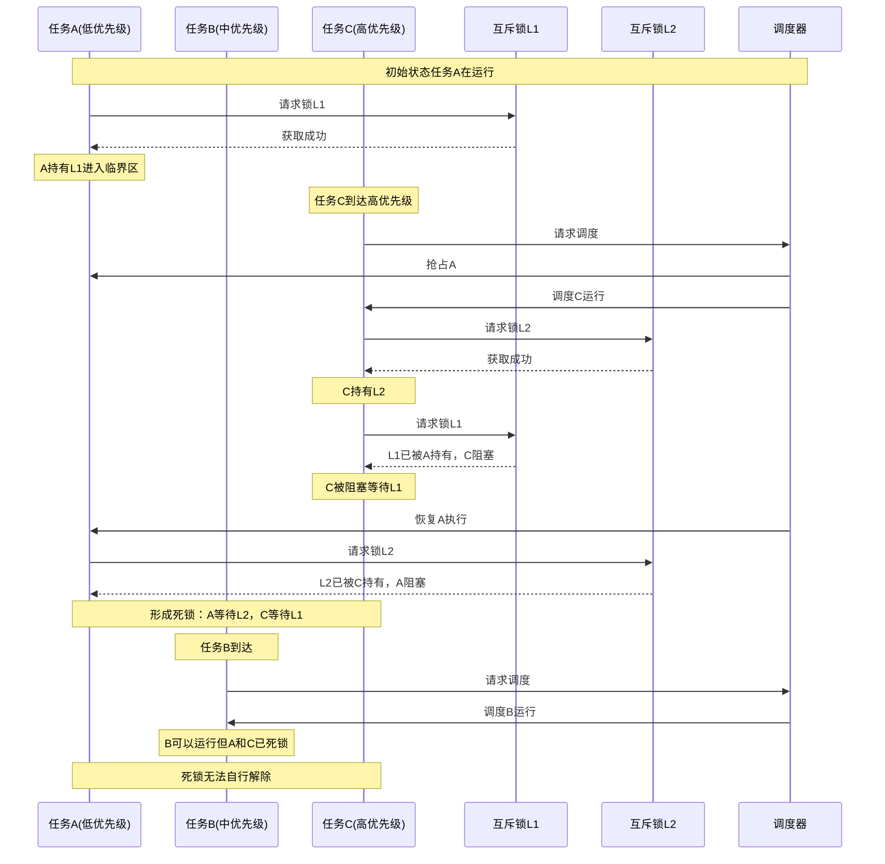
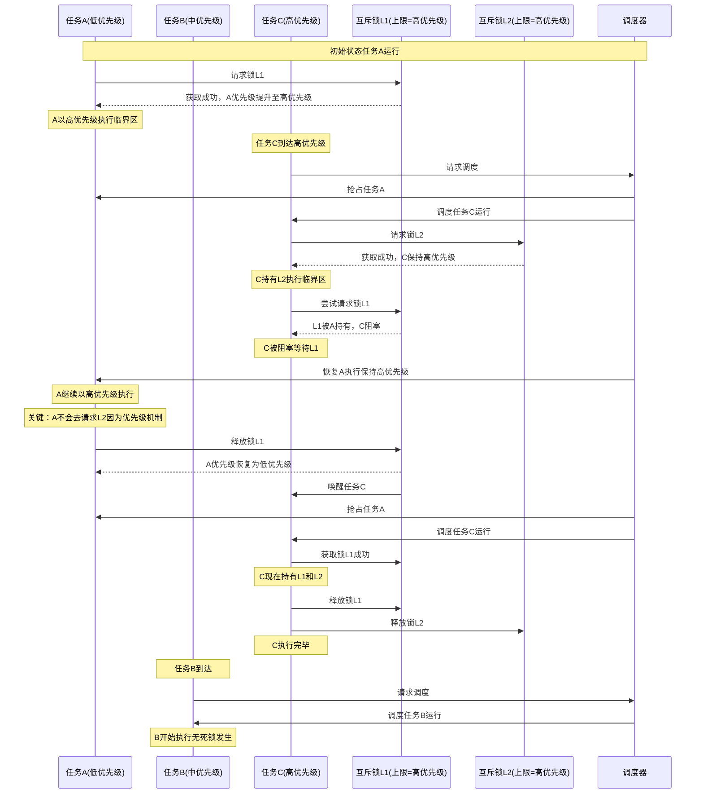
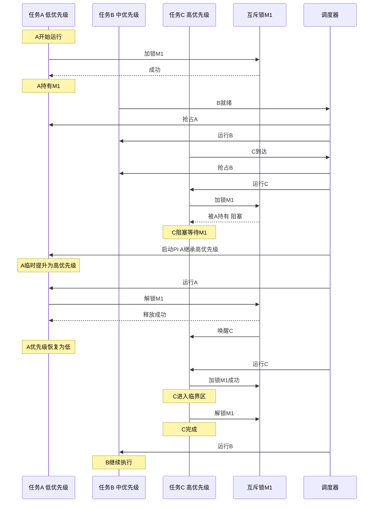
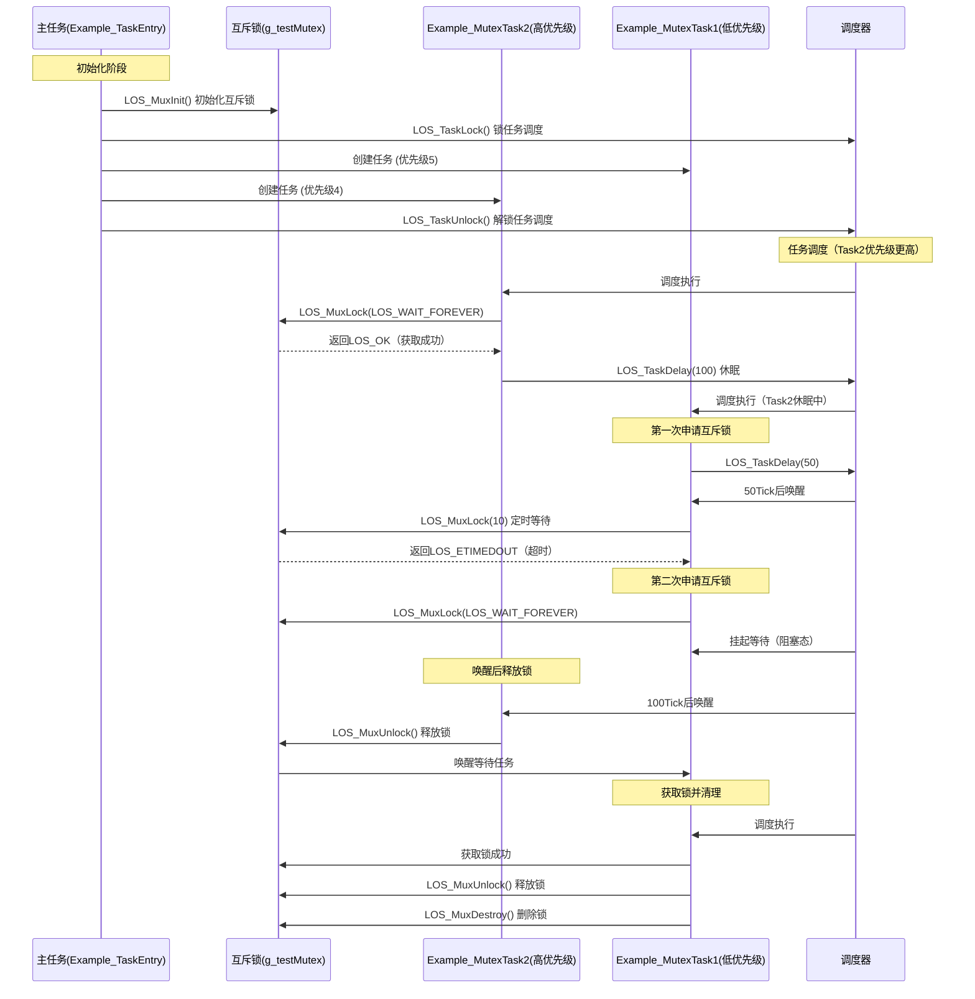

# 互斥锁Mutex机制与Liteos_a内核互斥锁机制分析

[TOC]

# 0、一句话总结

​	互斥锁通过对临界区的加锁/解锁确保同一时刻仅有一个执行流访问共享资源，并配合阻塞等待、优先级继承与超时等机制来消除竞态、缓解优先级反转、限定等待时限，从而保障内核数据一致性与执行正确性。


# 1、互斥锁的通用知识点

## 1.1、互斥锁的概念

​	互斥锁是操作系统内核最核心的同步原语之一，用于保护临界区，使得任意时刻最多只有一个执行流（线程/任务）进入该临界区。

- 互斥语义：同一时刻仅一个持有者，其他竞争者需等待。
- 睡眠等待：与自旋锁不同，互斥锁允许持锁者以外的线程阻塞睡眠，节省 CPU。
- 可与调度/优先级配合：在实时系统中，互斥锁常结合“优先级继承/上限”等机制，抑制优先级反转。
- 不传递数据：像事件一样，互斥锁只负责同步，不携带数据（不同于消息队列）。
- 常见形态：普通互斥锁、递归互斥锁、读写锁（严格不属于“互斥锁”但目标类似）、rtmutex（带 PI 的实时互斥）。


## 1.2、互斥锁的通用结构

### 1.2.1、互斥锁控制块

核心作用：管理互斥锁的拥有者、递归计数、等待队列、优先级继承元数据，以及在 SMP 上的原子状态与内存序。

```c
struct mutex_control_block {
    volatile int state;			// 锁状态（0=未持有，1=持有），或更丰富的位图（包含竞争标记）
    struct Task *owner;			// 当前持锁任务（无符号或句柄）
    uint32_t lock_count;		// 递归计数（递归互斥锁才用）
    WaitQueue wait_queue;		// 等待队列（一般为双向链表，按优先级/时间或 FIFO 排序）
    bool priority_inherit;		// 是否启用优先级继承（PI：Priority inheritance）
    int orig_owner_prio;		// 持锁者原始优先级（用于 PI 恢复）
    // 可选：优先级上限（PCP）、天花板协议、统计信息、抢占/不可中断标志等
};
```


### 1.2.2、优先级继承/优先级天花板

**优先级继承协议**（PI）：

* 仅在**高优先级任务因请求锁被阻塞时**，临时提升持有锁的低优先级任务的优先级（提升至阻塞任务的优先级）。这是一种**被动响应机制**，优先级提升仅在阻塞发生后触发。

**优先级天花板协议**（PCP）：

* 在任务获取锁时，**立即将其优先级提升至预设的“天花板优先级”（通常为所有可能获取该锁的任务的最高优先级）**。此策略在锁持有期间持续生效，**预防性地阻断所有可能抢占的中间优先级任务**，避免链式反转，链式反转发生条件如下：

    - **多任务嵌套锁**：多个任务嵌套请求多个互斥锁（如任务A持有锁1后请求锁2，任务B持有锁2后请求锁1）。

    - **优先级交叉依赖**：高优先级任务依赖低优先级任务已持有的锁，低优先级任务又依赖其他锁或被中优先级任务抢占。

    - **阻塞链形成**：任务间因锁的嵌套请求形成环形依赖或长阻塞链，导致高优先级任务无法及时执行。


### 1.2.3、等待队列

核心作用：保存阻塞的任务，支持优先级排序或 FIFO、公平性策略以及超时唤醒。

```c
struct WaitQueue {
    struct ListNode head;           // 双向链表表头
    // 节点中包含Task指针、期望超时、等待状态、唤醒原因等
};
```


## 1.3、互斥锁的加解锁时序图

### 1.3.1、无PCP/PI时任务死锁时序图




### 1.3.2、启用PCP的任务加解锁时序图




### 1.3.3、启用PI的任务加解锁时序图




# 2、Liteos_a内核中互斥锁的实现

## 2.1、Liteos_a内核中互斥锁的基本概念

​	Liteos_a内核中的互斥锁又称互斥型信号量，用于实现对共享资源的独占式处理。当有任务持有时，这个任务获得该互斥锁的所有权。当该任务释放它时，任务失去该互斥锁的所有权。当一个任务持有互斥锁时，其他任务将不能再持有该互斥锁。多任务环境下往往存在多个任务竞争同一共享资源的应用场景，互斥锁可被用于对共享资源的保护从而实现独占式访问。

​	Liteos_a内核中的互斥锁属性包含3个属性：协议属性、优先级上限属性和类型属性。协议属性用于处理不同优先级的任务申请互斥锁，协议属性包含如下三种：

- LOS_MUX_PRIO_NONE 不对申请互斥锁的任务的优先级进行继承或保护操作。
- LOS_MUX_PRIO_INHERIT 优先级继承属性，默认设置为该属性，对申请互斥锁的任务的优先级进行继承。在互斥锁设置为本协议属性情况下，申请互斥锁时，如果高优先级任务阻塞于互斥锁，则把持有互斥锁任务的优先级备份到任务控制块的优先级位图中，然后把任务优先级设置为和高优先级任务相同的优先级；持有互斥锁的任务释放互斥锁时，从任务控制块的优先级位图恢复任务优先级。
- LOS_MUX_PRIO_PROTECT 优先级保护属性，对申请互斥锁的任务的优先级进行保护。在互斥锁设置为本协议属性情况下，申请互斥锁时，如果任务优先级小于互斥锁优先级上限，则把任务优先级备份到任务控制块的优先级位图中，然后把任务优先级设置为互斥锁优先级上限属性值；释放互斥锁时，从任务控制块的优先级位图恢复任务优先级。

互斥锁的类型属性用于标记是否检测死锁，是否支持递归持有，类型属性包含如下三种：

- LOS_MUX_NORMAL 普通互斥锁，不会检测死锁。如果任务试图对一个互斥锁重复持有，将会引起这个线程的死锁。如果试图释放一个由别的任务持有的互斥锁，或者如果一个任务试图重复释放互斥锁都会引发不可预料的结果。
- LOS_MUX_RECURSIVE 递归互斥锁，默认设置为该属性。在互斥锁设置为本类型属性情况下，允许同一个任务对互斥锁进行多次持有锁，持有锁次数和释放锁次数相同，其他任务才能持有该互斥锁。如果试图持有已经被其他任务持有的互斥锁，或者如果试图释放已经被释放的互斥锁，会返回错误码。
- LOS_MUX_ERRORCHECK 错误检测互斥锁，会自动检测死锁。在互斥锁设置为本类型属性情况下，如果任务试图对一个互斥锁重复持有，或者试图释放一个由别的任务持有的互斥锁，或者如果一个任务试图释放已经被释放的互斥锁，都会返回错误码。


## 2.2、Liteos_a内核的互斥锁运行机制

​	多任务环境下会存在多个任务访问同一公共资源的场景，而有些公共资源是非共享的，需要任务进行独占式处理。互斥锁怎样来避免这种冲突呢？

​	用互斥锁处理非共享资源的同步访问时，如果有任务访问该资源，则互斥锁为加锁状态。此时其他任务如果想访问这个公共资源则会被阻塞，直到互斥锁被持有该锁的任务释放后，其他任务才能重新访问该公共资源，此时互斥锁再次上锁，如此确保同一时刻只有一个任务正在访问这个公共资源，保证了公共资源操作的完整性。

互斥锁运作示意图：


## 2.3、Liteos_a内核互斥锁模块的总结

​	分析到这里，可以看出Liteos_a内核完整的实现了 1.1 ~ 1.3 小节中互斥锁所有的通用机制。接下来就借助Liteos_a内核的源代码继续分析，Liteos_a内核是如何通过代码将互斥锁的这些机制一一实现的。


# 3、Liteos_a内核互斥锁开发案例

## 3.1、接口说明

| 功能分类             | 接口描述                                                     |
| -------------------- | ------------------------------------------------------------ |
| 初始化和销毁互斥锁   | - LOS_MuxInit：互斥锁初始化 <br />- LOS_MuxDestroy：销毁指定的互斥锁 |
| 互斥锁的申请和释放   | - LOS_MuxLock：申请指定的互斥锁 <br />- LOS_MuxTrylock：尝试申请指定的互斥锁，不阻塞 <br />- LOS_MuxUnlock：释放指定的互斥锁 |
| 校验互斥锁           | - LOS_MuxIsValid：判断互斥锁释放有效 <br />- LOS_MuxAttrDestroy：销毁指定的互斥锁属性 |
| 设置和获取互斥锁属性 | - LOS_MuxAttrGetType：获取指定互斥锁属性的类型属性 <br />- LOS_MuxAttrSetType：设置指定互斥锁属性的类型属性 <br />- LOS_MuxAttrGetProtocol：获取指定互斥锁属性的协议属性 <br />- LOS_MuxAttrSetProtocol：设置指定互斥锁属性的协议属性 <br />- LOS_MuxAttrGetPrioceiling：获取指定互斥锁属性的优先级上限属性 <br />- LOS_MuxAttrSetPrioceiling：设置指定互斥锁属性的优先级上限属性 <br />- LOS_MuxGetPrioceiling：获取互斥锁优先级上限属性 <br />- LOS_MuxSetPrioceiling：设置互斥锁优先级上限属性 |


## 3.2、开发流程

互斥锁典型场景的开发流程：

* 1、初始化互斥锁LOS_MuxInit。

* 2、申请互斥锁LOS_MuxLock。

    * 申请模式有三种：无阻塞模式、永久阻塞模式、定时阻塞模式。

        - 无阻塞模式：任务需要申请互斥锁，若该互斥锁当前没有任务持有，或者持有该互斥锁的任务和申请该互斥锁的任务为同一个任务，则申请成功；

        - 永久阻塞模式：任务需要申请互斥锁，若该互斥锁当前没有被占用，则申请成功。否则，该任务进入阻塞态，系统切换到就绪任务中优先级高者继续执行。任务进入阻塞态后，直到有其他任务释放该互斥锁，阻塞任务才会重新得以执行；

        - 定时阻塞模式：任务需要申请互斥锁，若该互斥锁当前没有被占用，则申请成功。否则该任务进入阻塞态，系统切换到就绪任务中优先级高者继续执行。任务进入阻塞态后，指定时间超时前有其他任务释放该互斥锁，或者用 户指定时间超时后，阻塞任务才会重新得以执行。

* 3、释放互斥锁LOS_MuxUnlock。

    - 如果有任务阻塞于指定互斥锁，则唤醒被阻塞任务中优先级高的，该任务进入就绪态，并进行任务调度；

    - 如果没有任务阻塞于指定互斥锁，则互斥锁释放成功。

* 4、销毁互斥锁LOS_MuxDestroy。

特别说明：

* 两个任务不能对同一把互斥锁加锁。如果某任务对已被持有的互斥锁加锁，则该任务会被挂起，直到持有该锁的任务对互斥锁解锁，才能执行对这把互斥锁的加锁操作。

* 互斥锁不能在中断服务程序中使用。

* Liteos_a内核作为实时操作系统需要保证任务调度的实时性，尽量避免任务的长时间阻塞，因此在获得互斥锁之后，应该尽快释放互斥锁。


## 3.3、编程实例

### 3.3.1、实例描述

1、任务Example_TaskEntry创建一个互斥锁，锁任务调度，创建两个任务Example_MutexTask1、Example_MutexTask2。Example_MutexTask2优先级高于Example_MutexTask1，解锁任务调度。

2、Example_MutexTask2被调度，以永久阻塞模式申请互斥锁，并成功获取到该互斥锁，然后任务休眠100Tick，Example_MutexTask2挂起，Example_MutexTask1被唤醒。

3、Example_MutexTask1以定时阻塞模式申请互斥锁，等待时间为10Tick，因互斥锁仍被Example_MutexTask2持有，Example_MutexTask1挂起。10Tick超时时间到达后，Example_MutexTask1被唤醒，以永久阻塞模式申请互斥锁，因互斥锁仍被Example_MutexTask2持有，Example_MutexTask1挂起。

4、100Tick休眠时间到达后，Example_MutexTask2被唤醒， 释放互斥锁，唤醒Example_MutexTask1。Example_MutexTask1成功获取到互斥锁后，释放，删除互斥锁。


### 3.3.2、编程示例

​	本演示代码在`./kernel/liteos_a/testsuites/kernel/src/osTest.c`中编译验证，在TestTaskEntry中调用验证入口函数Example_MutexEntry。

```c
#include <string.h>
#include "los_mux.h"

/* 互斥锁 */
LosMux g_testMutex;
/* 任务ID */
UINT32 g_testTaskId01;
UINT32 g_testTaskId02;

VOID Example_MutexTask1(VOID)
{
    UINT32 ret;
    LOS_TaskDelay(50);

    dprintf("task1 try to get mutex, wait 10 ticks.\n");
    /* 申请互斥锁 */
    ret = LOS_MuxLock(&g_testMutex, 10);

    if (ret == LOS_OK) {
        dprintf("task1 get mutex g_testMux.\n");
        /* 释放互斥锁 */
        LOS_MuxUnlock(&g_testMutex);
        return;
    }
    if (ret == LOS_ETIMEDOUT) {
        dprintf("task1 timeout and try to get mutex, wait forever.\n");
        /* 申请互斥锁 */
        ret = LOS_MuxLock(&g_testMutex, LOS_WAIT_FOREVER);
        if (ret == LOS_OK) {
            dprintf("task1 wait forever, get mutex g_testMux.\n");
            /* 释放互斥锁 */
            LOS_MuxUnlock(&g_testMutex);
            /* 删除互斥锁 */
            LOS_MuxDestroy(&g_testMutex);
            dprintf("task1 post and delete mutex g_testMux.\n");
            return;
        }
    }
    return;
}

VOID Example_MutexTask2(VOID)
{
    dprintf("task2 try to get mutex, wait forever.\n");
    /* 申请互斥锁 */
    (VOID)LOS_MuxLock(&g_testMutex, LOS_WAIT_FOREVER);

    dprintf("task2 get mutex g_testMux and suspend 100 ticks.\n");

    /* 任务休眠100Ticks */
    LOS_TaskDelay(100);

    dprintf("task2 resumed and post the g_testMux\n");
    /* 释放互斥锁 */
    LOS_MuxUnlock(&g_testMutex);
    return;
}

UINT32 Example_MutexEntry(VOID)
{
    UINT32 ret;
    TSK_INIT_PARAM_S task1;
    TSK_INIT_PARAM_S task2;

    /* 初始化互斥锁 */
    LOS_MuxInit(&g_testMutex, NULL);

    /* 锁任务调度 */
    LOS_TaskLock();

    /* 创建任务1 */
    memset(&task1, 0, sizeof(TSK_INIT_PARAM_S));
    task1.pfnTaskEntry = (TSK_ENTRY_FUNC)Example_MutexTask1;
    task1.pcName       = "MutexTsk1";
    task1.uwStackSize  = LOSCFG_BASE_CORE_TSK_DEFAULT_STACK_SIZE;
    task1.usTaskPrio   = 5;
    ret = LOS_TaskCreate(&g_testTaskId01, &task1);
    if (ret != LOS_OK) {
        dprintf("task1 create failed.\n");
        return LOS_NOK;
    }

    /* 创建任务2 */
    memset(&task2, 0, sizeof(TSK_INIT_PARAM_S));
    task2.pfnTaskEntry = (TSK_ENTRY_FUNC)Example_MutexTask2;
    task2.pcName       = "MutexTsk2";
    task2.uwStackSize  = LOSCFG_BASE_CORE_TSK_DEFAULT_STACK_SIZE;
    task2.usTaskPrio   = 4;
    ret = LOS_TaskCreate(&g_testTaskId02, &task2);
    if (ret != LOS_OK) {
        dprintf("task2 create failed.\n");
        return LOS_NOK;
    }

    /* 解锁任务调度 */
    LOS_TaskUnlock();

    return LOS_OK;
}
```

编译运行得到的结果为：

```bash
task2 try to get mutex, wait forever.
task2 get mutex g_testMux and suspend 100 ticks.
task1 try to get mutex, wait 10 ticks.
task1 timeout and try to get mutex, wait forever.
task2 resumed and post the g_testMux
task1 wait forever, get mutex g_testMux.
task1 post and delete mutex g_testMux.
```


### 3.3.3、示例的时序图




# 4、Liteos_a内核互斥锁的源码分析

## 4.1、互斥锁控制块 LosMux

```c
// 定义互斥锁优先级协议枚举
enum {
    // 无优先级协议，不处理优先级反转问题
    // 当高优先级任务等待低优先级任务持有的锁时，可能发生优先级反转
    LOS_MUX_PRIO_NONE = 0,
    // 优先级继承协议，防止优先级反转
    // 当高优先级任务等待锁时，临时提升持锁任务的优先级至等待任务的优先级
    LOS_MUX_PRIO_INHERIT = 1,
    // 优先级保护协议（优先级上限协议）
    // 持锁任务的优先级临时提升到预设的上限值，避免被更高优先级任务抢占
    LOS_MUX_PRIO_PROTECT = 2
};

// 定义互斥锁类型枚举
enum {
    // 普通互斥锁，不支持递归加锁
    // 同一任务重复加锁会导致死锁
    LOS_MUX_NORMAL = 0,
    // 递归互斥锁，支持同一任务多次加锁
    // 必须调用相同次数的unlock才能真正释放锁
    LOS_MUX_RECURSIVE = 1,
    // 错误检查互斥锁，提供额外的错误检测
    // 检测非法操作如重复加锁、非持锁者解锁等
    LOS_MUX_ERRORCHECK = 2,
    // 默认互斥锁类型，设置为递归锁
    // LiteOS-A默认使用递归锁以提供更好的易用性
    LOS_MUX_DEFAULT = LOS_MUX_RECURSIVE
};

// 定义互斥锁属性结构体
typedef struct {
    // 互斥锁协议类型，用于指定优先级继承策略
    // 可选值：LOS_MUX_PRIO_NONE(无协议)、LOS_MUX_PRIO_INHERIT(优先级继承)、
    // 		  LOS_MUX_PRIO_PROTECT(优先级保护)
    UINT8 protocol;
    // 优先级上限值，当使用优先级保护协议时生效
    // 持有该互斥锁的任务临时提升到此优先级，防止优先级反转
    UINT8 prioceiling;
    // 互斥锁类型，定义锁的行为特性
    // 可选值：LOS_MUX_NORMAL(普通锁)、LOS_MUX_RECURSIVE(递归锁)、
    //		  LOS_MUX_ERRORCHECK(错误检查锁)
    UINT8 type;
    // 保留字段，用于内存对齐和未来扩展
    // 确保结构体大小为4字节对齐
    UINT8 reserved;
// 结构体定义结束，定义类型别名LosMuxAttr
} LosMuxAttr;

// 定义互斥锁控制块结构体
typedef struct OsMux {
    // 魔数，用于验证互斥锁对象的有效性
    // 通常设置为OS_MUX_MAGIC常量，防止野指针访问
    UINT32 magic;        /**< magic number */
    // 互斥锁属性，包含协议、类型等配置信息
    // 引用上面定义的LosMuxAttr结构体
    LosMuxAttr attr;     /**< Mutex attribute */
    // 持锁链表，记录当前任务持有的所有互斥锁
    // 用于任务退出时自动释放所有持有的锁，防止死锁
    LOS_DL_LIST holdList; /**< The task holding the lock change */
    // 等待队列，存储等待获取此互斥锁的任务列表
    // 按优先级排序，高优先级任务优先获得锁
    LOS_DL_LIST muxList; /**< Mutex linked list */
    // 锁的当前持有者，指向拥有此互斥锁的任务控制块
    // NULL表示锁未被持有，非NULL指向LosTaskCB结构
    VOID *owner;         /**< The current thread that is locking a mutex */
    // 锁计数器，记录递归锁被同一任务重复获取的次数
    // 对于递归锁，必须unlock相同次数才能真正释放锁
    UINT16 muxCount;     /**< Times of locking a mutex */
    
// 结构体定义结束，定义类型别名LosMux
} LosMux;
```


## 4.2、互斥锁初始化 LOS_MuxInit

```c
// kernel_liteos_a\kernel\base\ipc\los_mux.c
/*
    1、参数检查
    2、设置LosMuxAttr属性，NULL时则使用LosMux的默认属性
    3、初始化LosMux结构体
*/
LITE_OS_SEC_TEXT UINT32 LOS_MuxInit(LosMux *mutex, const LosMuxAttr *attr)
{
    UINT32 intSave;

    // 参数检查：如果互斥锁指针为空，返回无效参数错误
    if (mutex == NULL) {
        return LOS_EINVAL;
    }

    // 处理互斥锁属性
    if (attr == NULL) {
        // 如果没有提供属性，使用默认属性初始化
        (VOID)LOS_MuxAttrInit(&mutex->attr);
    } else {
        // 如果提供了属性，复制到互斥锁结构体中
        (VOID)memcpy_s(&mutex->attr, sizeof(LosMuxAttr), attr, sizeof(LosMuxAttr));
    }

    // 检查互斥锁属性是否有效
    if (OsCheckMutexAttr(&mutex->attr) != LOS_OK) {
        return LOS_EINVAL;
    }

    // 锁定调度器，进入临界区，防止初始化过程被中断
    SCHEDULER_LOCK(intSave);
    // 初始化互斥锁计数为0（表示未被任何任务持有）
    mutex->muxCount = 0;
    // 初始化互斥锁拥有者为NULL（表示无拥有者）
    mutex->owner = NULL;
    // 初始化等待队列链表（用于存放等待获取该互斥锁的任务）
    LOS_ListInit(&mutex->muxList);
    // 设置互斥锁魔数，标记为有效互斥锁
    // 魔数用于快速检查互斥锁是否已初始化和有效
    mutex->magic = OS_MUX_MAGIC;
    // 解锁调度器，退出临界区
    SCHEDULER_UNLOCK(intSave);
    return LOS_OK;
}
```

其中 LOS_MuxAttrInit 函数：

```c
// kernel_liteos_a\kernel\base\ipc\los_mux.c
/*
    1、设置互斥锁的属性
*/
LITE_OS_SEC_TEXT UINT32 LOS_MuxAttrInit(LosMuxAttr *attr)
{
    // 参数检查：如果传入的属性指针为空，返回无效参数错误
    if (attr == NULL) {
        return LOS_EINVAL;
    }

    // 设置默认协议为优先级继承(LOS_MUX_PRIO_INHERIT)
    // 优先级继承：当高优先级任务等待低优先级任务持有的锁时，低优先级任务临时继承高优先级任务的优先级
    attr->protocol    = LOS_MUX_PRIO_INHERIT;
    
    // 设置优先级上限为系统最低优先级
    // 在优先级保护协议中使用，持有互斥锁的任务临时提升到这个优先级
    attr->prioceiling = OS_TASK_PRIORITY_LOWEST;
    
    // 设置互斥锁类型为默认类型
    // 默认类型通常是普通互斥锁(NORMAL)，不检查重复加锁和所有权
    attr->type = LOS_MUX_DEFAULT;
    
    return LOS_OK;
}
```

其中 OsCheckMutexAttr 函数：

```c
// kernel_liteos_a\kernel\base\ipc\los_mux.c
/*
    1、检查互斥锁的属性是否在正常范围内
*/
STATIC UINT32 OsCheckMutexAttr(const LosMuxAttr *attr)
{
    // 检查互斥锁类型是否在有效范围内
    // 有效类型包括：普通(NORMAL)、递归(RECURSIVE)和错误检查(ERRORCHECK)
    if (((INT8)(attr->type) < LOS_MUX_NORMAL) || (attr->type > LOS_MUX_ERRORCHECK)) {
        return LOS_NOK;
    }

    // 检查优先级上限是否在有效范围内
    // 优先级必须在系统支持的最高优先级和最低优先级之间
    if (((INT8)(attr->prioceiling) < OS_TASK_PRIORITY_HIGHEST) || 
        (attr->prioceiling > OS_TASK_PRIORITY_LOWEST)) {
        return LOS_NOK;
    }

    // 检查互斥锁协议是否在有效范围内
    // 有效协议包括：无优先级继承(NONE)、优先级继承(INHERIT)和优先级保护(PROTECT)
    if (((INT8)(attr->protocol) < LOS_MUX_PRIO_NONE) || 
        (attr->protocol > LOS_MUX_PRIO_PROTECT)) {
        return LOS_NOK;
    }
    return LOS_OK;
}

```


## 4.3、阻塞申请互斥锁 LOS_MuxLock

```c
/*
    1、参数检查
    2、中断上下文、系统任务中不能调用此函数
    3、加锁之后调用下层函数OsMuxLockUnsafe
*/
LITE_OS_SEC_TEXT UINT32 LOS_MuxLock(LosMux *mutex, UINT32 timeout)
{
    LosTaskCB *runTask = NULL;
    UINT32 intSave;
    UINT32 ret;

    // 参数检查：如果互斥锁指针为空，返回无效参数错误
    if (mutex == NULL) {
        return LOS_EINVAL;
    }

    // 检查是否在中断上下文中调用，互斥锁不能在中断中使用
    if (OS_INT_ACTIVE) {
        return LOS_EINTR;
    }

    // 检查是否在系统任务中,系统任务不能调用含有阻塞的API
    runTask = (LosTaskCB *)OsCurrTaskGet();
    /* DO NOT Call blocking API in system tasks */
    if (runTask->taskStatus & OS_TASK_FLAG_SYSTEM_TASK) {
        PRINTK("Warning: DO NOT call %s in system tasks.\n", __FUNCTION__);
        OsBackTrace();
    }

    SCHEDULER_LOCK(intSave);
    // 调用不安全版本的互斥锁加锁函数
    ret = OsMuxLockUnsafe(mutex, timeout);
    SCHEDULER_UNLOCK(intSave);
    return ret;
}
```

其中 OsMuxLockUnsafe 函数：

```c
/*
    1、参数检查：互斥锁魔数、互斥锁属性、死锁检查
    2、调用OsMuxPendOp，执行实际的加锁逻辑
*/
UINT32 OsMuxLockUnsafe(LosMux *mutex, UINT32 timeout)
{
    // 获取当前运行的任务控制块
    LosTaskCB *runTask = OsCurrTaskGet();

    // 检查互斥锁的魔数是否有效，确保互斥锁已正确初始化
    if (mutex->magic != OS_MUX_MAGIC) {
        return LOS_EBADF;
    }

    // 检查互斥锁属性是否有效
    if (OsCheckMutexAttr(&mutex->attr) != LOS_OK) {
        return LOS_EINVAL;
    }

    // 对于错误检查型互斥锁，检查是否存在自锁情况
    // 如果当前任务已经持有该锁，则返回死锁错误
    if ((mutex->attr.type == LOS_MUX_ERRORCHECK) && (mutex->owner == (VOID *)runTask)) {
        return LOS_EDEADLK;
    }

    // 调用互斥锁挂起操作函数，执行实际的加锁逻辑
    return OsMuxPendOp(runTask, mutex, timeout);
}
```

其中 OsMuxPendOp 函数：

```c
/*
    1、初始化静态互斥锁
    2、分情况进行加锁操作
        情况1：互斥锁未被任何任务持有，可以直接获取
        情况2：递归锁情况下，当前任务已持有该锁，可以再次获取
        情况3：锁被其他任务持有，需要等待
*/
STATIC UINT32 OsMuxPendOp(LosTaskCB *runTask, LosMux *mutex, UINT32 timeout)
{
    UINT32 ret;

    // 检查互斥锁链表是否已初始化，如果未初始化则进行初始化
    // 这是为了支持静态初始化的互斥锁
    //  可能的静态初始化宏定义
    //      #define STATIC_MUX_INIT { .magic = OS_MUX_MAGIC, .attr = {...}, 
    //                                .muxCount = 0, .owner = NULL }
    //  使用静态初始化
    //      LosMux myMutex = STATIC_MUX_INIT;
    // 这种静态初始化方式可能不会完全初始化所有字段，特别是链表指针。
    // 因此，当第一次使用这个互斥锁时， OsMuxPendOp 函数会检查并完成剩余的初始化工作。    
    if ((mutex->muxList.pstPrev == NULL) || (mutex->muxList.pstNext == NULL)) {
        /* This is for mutex macro initialization. */
        mutex->muxCount = 0;
        mutex->owner = NULL;
        LOS_ListInit(&mutex->muxList);
    }

    // 情况1：互斥锁未被任何任务持有，可以直接获取
    if (mutex->muxCount == 0) {
        // 增加锁计数
        mutex->muxCount++;
        // 设置锁的拥有者为当前任务
        mutex->owner = (VOID *)runTask;
        // 将互斥锁添加到任务的持有锁列表中
        LOS_ListTailInsert(&runTask->lockList, &mutex->holdList);
        // 如果互斥锁使用优先级保护协议，则提升任务优先级到互斥锁的优先级上限
        // 这里未考虑到EDF调度算法中如何设置这个优先级，这得重新考虑方案
        if (mutex->attr.protocol == LOS_MUX_PRIO_PROTECT) {
            SchedParam param = { 0 };
            runTask->ops->schedParamGet(runTask, &param);
            param.priority = mutex->attr.prioceiling;
            runTask->ops->priorityInheritance(runTask, &param);
        }
        return LOS_OK;
    }

    // 情况2：递归锁情况下，当前任务已持有该锁，可以再次获取
    if (((LosTaskCB *)mutex->owner == runTask) && (mutex->attr.type == LOS_MUX_RECURSIVE)) {
        // 增加锁计数
        mutex->muxCount++;
        return LOS_OK;
    }

    // 情况3：锁被其他任务持有，需要等待
    // 如果超时时间为0，表示不等待，直接返回错误
    if (!timeout) {
        return LOS_EINVAL;
    }

    // 检查当前是否可以进行任务调度，如果不能则返回死锁错误
    // 这是为了防止在不可抢占的上下文中阻塞导致死锁
    if (!OsPreemptableInSched()) {
        return LOS_EDEADLK;
    }

    // 如果使用优先级继承协议，设置优先级继承
    OsMuxBitmapSet(mutex, runTask);

    // 设置任务正在等待的互斥锁
    runTask->taskMux = (VOID *)mutex;
    // 根据任务优先级找到在等待队列中的插入位置
    LOS_DL_LIST *node = OsSchedLockPendFindPos(runTask, &mutex->muxList);
    if (node == NULL) {
        ret = LOS_NOK;
        return ret;
    }

    // 设置任务的等待状态和超时时间
    OsTaskWaitSetPendMask(OS_TASK_WAIT_MUTEX, (UINTPTR)mutex, timeout);
    // 将任务挂起，等待互斥锁
    ret = runTask->ops->wait(runTask, node, timeout);
    if (ret == LOS_ERRNO_TSK_TIMEOUT) {
        // 超时之后恢复优先级
        OsMuxBitmapRestore(mutex, NULL, runTask);
        runTask->taskMux = NULL;
        ret = LOS_ETIMEDOUT;
    }

    return ret;
}
```

其中 OsMuxBitmapSet 函数：

```c
/*
    1、协议判断，非优先级继承直接返回
    2、互斥锁owner的优先级 小于 当前尝试获得互斥锁的任务，则提升互斥锁owner的优先级
*/
STATIC VOID OsMuxBitmapSet(const LosMux *mutex, const LosTaskCB *runTask)
{
    // 如果互斥锁不使用优先级继承协议，直接返回
    if (mutex->attr.protocol != LOS_MUX_PRIO_INHERIT) {
        return;
    }

    SchedParam param = { 0 };
    // 获取互斥锁的当前拥有者
    LosTaskCB *owner = (LosTaskCB *)mutex->owner;
    // 比较拥有者和等待任务的调度参数（主要是优先级）
    INT32 ret = OsSchedParamCompare(owner, runTask);
    // 如果拥有者优先级低于等待任务，则提升拥有者的优先级
    // ret > 0 表示owner的优先级数值大于runTask（优先级数值越小，优先级越高）    
    if (ret > 0) {
        // 获取等待任务的调度参数
        runTask->ops->schedParamGet(runTask, &param);
        // 将拥有者的优先级提升到等待任务的优先级
        // 这里会将原来的优先级存储在bitmap中
        owner->ops->priorityInheritance(owner, &param);
    }
}
```

其中 OsSchedLockPendFindPos 函数：

```c
/*
    1、当前任务的优先级runTask 与 互斥锁等待队列上的任务lockList 进行优先级比较
        runTask优先级 > lockList上第一个任务的优先级 --> runtask插入互斥锁队列头部
        runTask优先级 > lockList上最后一个任务的优先级 --> runtask插入互斥锁队列尾部
        runTask优先级在中间，调用SchedLockPendFindPosSub继续查找具体位置
*/
LOS_DL_LIST *OsSchedLockPendFindPos(const LosTaskCB *runTask, LOS_DL_LIST *lockList)
{
    // 如果等待队列为空，直接返回队列头
    if (LOS_ListEmpty(lockList)) {
        return lockList;
    }

    // 获取等待队列中的第一个任务
    LosTaskCB *pendedTask1 = OS_TCB_FROM_PENDLIST(LOS_DL_LIST_FIRST(lockList));
    // 比较第一个等待任务和当前任务的调度参数
    INT32 ret = OsSchedParamCompare(pendedTask1, runTask);
    // 如果第一个等待任务优先级低于当前任务，插入到队列头部
    if (ret > 0) {
        return lockList->pstNext;
    }

    // 比较最后一个等待任务和当前任务的调度参数
    LosTaskCB *pendedTask2 = OS_TCB_FROM_PENDLIST(LOS_DL_LIST_LAST(lockList));
    // 如果最后一个等待任务优先级高于或等于当前任务，插入到队列尾部
    ret = OsSchedParamCompare(pendedTask2, runTask);
    if (ret <= 0) {
        return lockList;
    }

    // 如果当前任务的优先级在队列中间，需要找到具体的插入位置
    return SchedLockPendFindPosSub(runTask, lockList);
}
```

其中 SchedLockPendFindPosSub 函数：

```c
STATIC INLINE LOS_DL_LIST *SchedLockPendFindPosSub(const LosTaskCB *runTask, const LOS_DL_LIST *lockList)
{
    LosTaskCB *pendedTask = NULL;

    // 遍历互斥锁维护的等待链表，顺序遍历找到合适的位置
    LOS_DL_LIST_FOR_EACH_ENTRY(pendedTask, lockList, LosTaskCB, pendList) {
        INT32 ret = OsSchedParamCompare(pendedTask, runTask);
        if (ret < 0) {
            continue;
        } else if (ret > 0) {
            return &pendedTask->pendList;
        } else {
            return pendedTask->pendList.pstNext;
        }
    }
    return NULL;
}

```

其中 OsMuxBitmapRestore 函数：

```c
/*
    1、判断互斥锁继承协议是否符合条件
    2、恢复拥有者的原始优先级，从bitmap中恢复之前存储的优先级
*/
VOID OsMuxBitmapRestore(const LosMux *mutex, const LOS_DL_LIST *list, const LosTaskCB *runTask)
{
    // 如果互斥锁不使用优先级继承协议，直接返回
    if (mutex->attr.protocol != LOS_MUX_PRIO_INHERIT) {
        return;
    }

    SchedParam param = { 0 };
    // 获取互斥锁的当前拥有者
    LosTaskCB *owner = (LosTaskCB *)mutex->owner;
    // 获取等待任务的调度参数
    runTask->ops->schedParamGet(runTask, &param);
    // 恢复拥有者的原始优先级
    // 这里会从bitmap中恢复之前存储的优先级
    owner->ops->priorityRestore(owner, list, &param);
}
```


## 4.4、非阻塞申请指互斥锁 LOS_MuxTrylock

```c
LITE_OS_SEC_TEXT UINT32 LOS_MuxTrylock(LosMux *mutex)
{
    LosTaskCB *runTask = NULL;
    UINT32 intSave;
    UINT32 ret;

    if (mutex == NULL) {
        return LOS_EINVAL;
    }

    if (OS_INT_ACTIVE) {
        return LOS_EINTR;
    }

    runTask = (LosTaskCB *)OsCurrTaskGet();
    /* DO NOT Call blocking API in system tasks */
    if (runTask->taskStatus & OS_TASK_FLAG_SYSTEM_TASK) {
        PRINTK("Warning: DO NOT call %s in system tasks.\n", __FUNCTION__);
        OsBackTrace();
    }

    SCHEDULER_LOCK(intSave);
    ret = OsMuxTrylockUnsafe(mutex, 0);
    SCHEDULER_UNLOCK(intSave);
    return ret;
}
```

其中 OsMuxTrylockUnsafe 函数：

```c
/*
     1、参数检查：互斥锁魔数、互斥锁属性、锁的持有者和锁的协议
    2、调用OsMuxPendOp，执行实际的加锁逻辑
*/
UINT32 OsMuxTrylockUnsafe(LosMux *mutex, UINT32 timeout)
{
    // 获取当前运行的任务控制块
    LosTaskCB *runTask = OsCurrTaskGet();

    // 检查互斥锁的魔数是否有效，确保互斥锁已正确初始化
    if (mutex->magic != OS_MUX_MAGIC) {
        return LOS_EBADF;
    }

    // 检查互斥锁属性是否有效
    if (OsCheckMutexAttr(&mutex->attr) != LOS_OK) {
        return LOS_EINVAL;
    }

    // 当前任务不是这把锁的owner
    // 当前任务是这把锁的owner,但是锁的协议不是LOS_MUX_RECURSIVE
    if ((mutex->owner != NULL) &&
        (((LosTaskCB *)mutex->owner != runTask) || (mutex->attr.type != LOS_MUX_RECURSIVE))) {
        return LOS_EBUSY;
    }

    // 调用互斥锁挂起操作函数，执行实际的加锁逻辑
    return OsMuxPendOp(runTask, mutex, timeout);
}
```

其中 OsMuxPendOp 函数看前文 4.4 小结 LOS_MuxLock 的分析。


## 4.5、销毁互斥锁 LOS_MuxDestroy

```c
/*
这里只是将互斥锁的结构体清零，并未释放内存；
因为互斥锁LosMux结构体不是由LOS_MuxInit时分配内存；
互斥锁可以使用静态分配内存、动态分配内存，那么内存释放也应该由调用者释放。
    1、参数检查
    2、清除LosMux *mutex结构体，赋值为0
*/
LITE_OS_SEC_TEXT UINT32 LOS_MuxDestroy(LosMux *mutex)
{
    UINT32 intSave;

    // 参数检查：如果传入的互斥锁指针为空，返回无效参数错误
    if (mutex == NULL) {
        return LOS_EINVAL;
    }

    SCHEDULER_LOCK(intSave);
    // 检查互斥锁的魔数是否有效
    // 魔数(magic)用于标识互斥锁是否已经被正确初始化
    // 如果魔数不匹配，说明互斥锁未初始化或已被破坏
    if (mutex->magic != OS_MUX_MAGIC) {
        SCHEDULER_UNLOCK(intSave);
        return LOS_EBADF;
    }

    // 检查互斥锁是否正在被使用
    // muxCount > 0 表示互斥锁当前被某个任务持有
    // 不能销毁正在使用的互斥锁，这会导致持有锁的任务出现问题
    if (mutex->muxCount != 0) {
        SCHEDULER_UNLOCK(intSave);
        return LOS_EBUSY;
    }

    // 使用安全的内存设置函数将互斥锁结构体清零
    // 这样做可以彻底清除互斥锁的所有状态，包括魔数
    // 清除后的互斥锁将不再被识别为有效互斥锁
    (VOID)memset_s(mutex, sizeof(LosMux), 0, sizeof(LosMux));
    SCHEDULER_UNLOCK(intSave);
    return LOS_OK;
}
```

这个销毁函数只是做“校验+清零”，并不负责释放互斥锁结构体所占用的内存。因此：
- 互斥锁是“静态存储期/静态分配”（如全局静态变量或静态全局结构体成员）时，销毁只需调用 LOS_MuxDestroy，内存不释放（变量本身仍然存在）。
- 互斥锁嵌在“动态分配”的对象里时，先调用 LOS_MuxDestroy 把互斥锁置为未初始化，再由调用方释放该对象的堆内存。


### 4.5.1、静态分配的互斥锁：销毁但不释放内存

示例1：JFFS2 全局锁 g_jffs2FsLock
- 声明为静态全局变量，初始化后贯穿文件系统生命周期；卸载/退出时仅调用 LOS_MuxDestroy，未释放内存（变量是静态的）。

```c
static LosMux g_jffs2FsLock;  /* lock for all jffs2 ops */
// ... existing code ...
if (LOS_MuxInit(&g_jffs2FsLock, NULL) != LOS_OK) {
    // ... existing code ...
}
// ... existing code ...
(void)LOS_MuxDestroy(&g_jffs2FsLock);
// ... existing code ...
```

示例2：System V 共享内存全局锁 g_sysvShmMux
- 同样是静态全局变量，通过宏 IPC_SHM_SYS_VSHM_MUTEX 引用；初始化/使用/销毁均为“仅销毁，不释放内存”。

```c
STATIC LosMux g_sysvShmMux;
#define IPC_SHM_SYS_VSHM_MUTEX  g_sysvShmMux
// ... existing code ...
ret = LOS_MuxInit(sysvShmMux, NULL);
// ... existing code ...
(VOID)LOS_MuxDestroy(sysvShmMux);
// ... existing code ...
```


### 4.5.2、动态分配对象内的互斥锁：先销毁互斥锁，再释放对象内存

示例1：进程地址空间对象 LosVmSpace（堆分配），内含 regionMux
- 在释放地址空间时，按顺序：Release -> Destroy -> 最后 free 整个空间对象。

```c
STATUS_T LOS_VmSpaceFree(LosVmSpace *space)
{
    // ... existing code ...
    (VOID)LOS_MuxRelease(&space->regionMux);
    (VOID)LOS_MuxDestroy(&space->regionMux);
    // 释放堆内存
    LOS_MemFree(m_aucSysMem0, space);
    return LOS_OK;
}
```

示例2：MTD 分区节点 mtd_partition（堆分配），内含 lock
- 删除分区时，先销毁互斥锁，再 free 节点内存。

```c
static INT32 OsResourceRelease(mtd_partition *node, const CHAR *type, partition_param *param)
{
    (VOID)LOS_MuxDestroy(&node->lock);
    LOS_ListDelete(&node->node_info);
    (VOID)memset_s(node, sizeof(mtd_partition), 0, sizeof(mtd_partition));
    free(node);
    // ... existing code ...
    return ENOERR;
}
```


## 4.6、其他接口

以上结构已经将Liteos_a内核中互斥锁的核心机制的代码实现分析完整，其他接口暂不分析，各位可自行前往官网分析其他接口的源码：https://github.com/openharmony/kernel_liteos_a


# 5、对Liteos_a内核互斥锁机制的思考

## 5.1、OH工程项目中哪些地方使用到互斥锁

基于代码搜索结果，LiteOS-A内核项目中互斥锁的使用场景主要包括：

* 1、核心内存管理模块

    - **虚拟内存管理**：kernel/base/vm/los_vm_map.c中的`regionMux`保护每个进程VM空间的区域红黑树，`g_vmSpaceListMux`保护全局VM空间链表

    - **共享内存**kernel/base/vm/shm.c中使用`regionMux`保护共享内存区域操作

    - **内存页面错误处理**：kernel/base/vm/los_vm_fault.c中使用`regionMux`和`vnode->mapping.mux_lock`


* 2、进程间通信(IPC)模块

    - **LiteIPC服务**：kernel/extended/liteipc/hm_liteipc.c中的`g_serviceHandleMapMux`保护服务句柄映射表

    - **Futex操作**：kernel/base/ipc/los_futex.c中每个hash桶的`listLock`保护futex链表


* 3、系统日志模块
    - **HiLog缓冲区**：kernel/extended/hilog/los_hilog.c中的`g_hiLogDev.mtx`保护环形缓冲区读写操作


* 4、安全模块
    - **VID管理**：security/vid/vid.c中的`processCB->timerIdMap.vidMapLock`保护VID定时器映射


* 5、网络协议栈
    - **LWIP移植层**：net/lwip-2.1/porting/src/sys_arch.c将`LosMux`封装为`sys_mutex_t`供LWIP使用


* 6、文件系统

    - **VFS层**：`g_vnodeMux`、`g_vnodeHashMux`保护虚拟节点操作

    - **JFFS2文件系统**：`g_jffs2FsLock`保护JFFS2操作


## 5.2、这些地方为什么要使用互斥锁

1、保护共享数据结构

```c
typedef struct VmSpace {
    LOS_RB_HEAD(VmMapRbHead, VmMapNode) vmMapRbHead;
    LosMux              regionMux;      /**< region red-black tree mutex lock */
    // ... existing code ...
}
```
虚拟内存区域使用红黑树管理，多个任务可能同时访问同一进程的VM空间，需要互斥锁保护数据结构完整性。

2、防止竞态条件

```c
int HiLogWriteInternal(const char *buffer, size_t bufLen)
{
    // ... existing code ...
    (VOID)LOS_MuxAcquire(&g_hiLogDev.mtx);
    HiLogCoverOldLog(bufLen);
    HiLogHeadInit(&header, bufLen);
    // ... existing code ...
    (VOID)LOS_MuxRelease(&g_hiLogDev.mtx);
    // ... existing code ...
}
```
HiLog环形缓冲区需要原子性地进行写入操作，防止多个任务同时写入导致日志损坏。

3、维护资源一致性

```c
STATIC LosMux g_serviceHandleMapMux;

STATIC UINT32 GetServiceHandle(UINT32 serviceId, UINT32 *serviceHandle)
{
    (VOID)LOS_MuxLock(&g_serviceHandleMapMux, LOS_WAIT_FOREVER);
    // 访问服务句柄映射表
    (VOID)LOS_MuxUnlock(&g_serviceHandleMapMux);
    // ... existing code ...
}
```
LiteIPC服务句柄映射表被多个进程同时访问，需要保证查找、插入、删除操作的原子性。


## 5.3、在这些地方使用互斥锁带来哪些好处

1、数据一致性保障

- **原子操作**：确保复杂的数据结构操作（如红黑树插入/删除）不被中断
- **内存可见性**：通过内存屏障确保其他CPU核心看到最新的数据状态

2、系统稳定性

- **防止死锁**：LiteOS-A的互斥锁支持优先级继承（`LOS_MUX_PRIO_INHERIT`），避免优先级反转
- **错误检测**：支持错误检查类型（`LOS_MUX_ERRORCHECK`），能检测重复加锁等错误

3、功能正确性

```c
STATIC INLINE STATUS_T LOS_MuxAcquire(LosMux *m)
{
    return LOS_MuxLock(m, LOS_WAIT_FOREVER);
}
```
虚拟内存模块使用`LOS_WAIT_FOREVER`确保必须获得锁才能进行关键操作，保证内存管理的正确性。

4、调试性

- **钩子机制**：支持`LOS_HOOK_TYPE_MUX_PEND`、`LOS_HOOK_TYPE_MUX_POST`等钩子用于性能监控和调试
- **状态查询**：提供`LOS_MuxIsValid()`等API进行状态检查


## 5.4、在这些地方使用互斥锁带来哪些坏处

1、性能开销

- **上下文切换**：当锁被占用时，任务会被阻塞并可能发生任务切换，带来调度开销
- **cache失效**：多核环境下锁的获取/释放会导致cache line失效，影响性能

2、延迟问题

```c
(VOID)LOS_MuxAcquire(&g_hiLogDev.mtx);
```
HiLog写入操作会阻塞等待锁，在高频日志输出场景下可能造成任务延迟。

3、优先级反转风险

尽管支持优先级继承，但在复杂的嵌套锁场景下仍可能出现优先级反转问题。

4、死锁风险

虽然提供了错误检查机制，但在多锁嵌套场景下仍存在死锁风险，需要谨慎的锁顺序设计。


## 5.5、有坏处为什么还要使用

1、正确性优于性能

在操作系统内核中，数据一致性和系统稳定性比性能更重要。内存管理、进程间通信等核心功能的正确性是系统运行的基础。

2、风险可控

- **设计模式**：采用RAII风格的获取/释放模式，降低编程错误
- **超时机制**：支持超时参数，避免无限等待
- **错误处理**：完善的错误码机制便于问题排查

3、替代方案的限制

- **自旋锁不适用**：对于可能长时间持有的锁（如文件系统操作），自旋锁会浪费CPU
- **无锁算法复杂**：对于复杂数据结构（如红黑树），无锁算法实现复杂且容易出错


## 5.6、如何在工程中取舍

1、锁粒度设计

```c
// 每个VM空间有独立的regionMux，而不是全局锁
typedef struct VmSpace {
    LosMux regionMux;
    // ... existing code ...
}
```
采用细粒度锁设计，每个VM空间独立锁，减少锁竞争。

2、锁类型选择

- **短期操作**：使用自旋锁（如`los_spinlock.h`中定义的API）
- **长期操作**：使用互斥锁（如文件I/O、网络操作）
- **中断上下文**：只能使用自旋锁

3、性能优化策略

```c
typedef LosMux sys_mutex_t;
```
网络协议栈将互斥锁封装为LWIP标准接口，便于移植且保持性能。

4、错误检测机制

```c
LITE_OS_SEC_TEXT UINT32 LOS_MuxAttrSetType(LosMuxAttr *attr, INT32 type)
{
    if ((attr == NULL) || (type < LOS_MUX_NORMAL) || (type > LOS_MUX_ERRORCHECK)) {
        return LOS_EINVAL;
    }
    // ... existing code ...
}
```
在开发阶段使用错误检查类型，在发布版本使用普通类型以获得更好性能。

5、混合同步机制

根据具体场景选择合适的同步原语：
- **读写锁**：读多写少的场景
- **条件变量**：复杂的等待条件
- **原子操作**：简单的计数器操作

