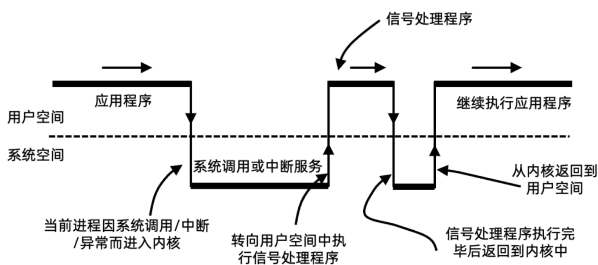
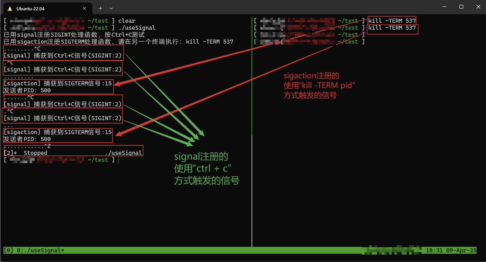
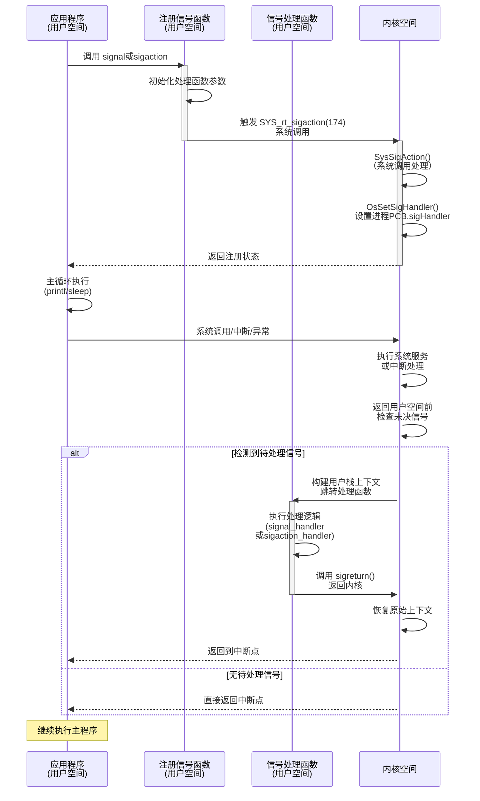
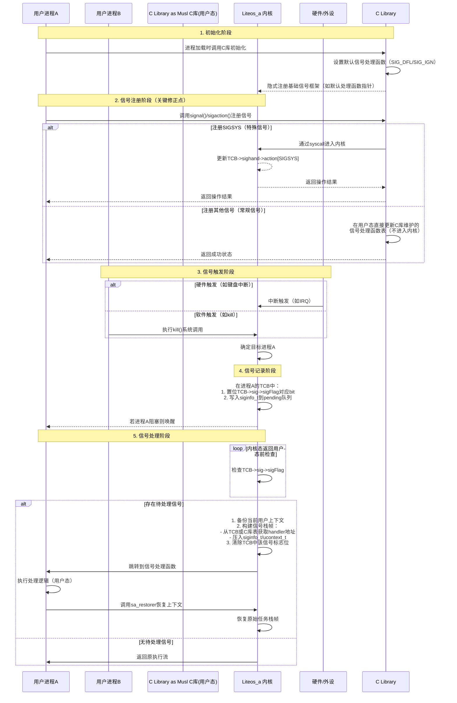

# 信号Signal机制与Liteos_a内核信号机制分析

[TOC]

# 0、一句话总结

​	信号（Signal）是**操作系统提供的异步事件通知机制**，通过软中断形式在进程间传递控制指令或异常事件，强制中断进程当前执行流并触发预设响应（终止、忽略或自定义处理）。


# 1、信号的通用知识点

## 1.1、信号的概念

- **本质**：软件层面的“软中断”，由内核、硬件事件或其他进程触发，用于异步通知目标进程事件发生（如用户输入`Ctrl+C`、内存错误、子进程终止等）。
- **核心特性**：
  - **异步性**：信号随时可能中断进程正常流程，转去执行处理函数。
  - **轻量级**：仅传递信号编号（实时信号除外），不携带数据。
  - **全局性**：可发送至指定进程、进程组或所有进程（需权限）。
  - **非排队性**：同类型非实时信号多次触发时仅保留一次（可能丢失），实时信号支持排队。


## 1.2、信号的通用结构

### 1.2.1、信号的标识体系

```bash
信号组成结构：
┌─────────────────┐
│   信号编号       │ ← 唯一标识符(通常为正整数)
├─────────────────┤
│   信号名称       │ ← 符号化标识(如SIG_XXX)
├─────────────────┤
│   信号语义       │ ← 信号含义和用途
├─────────────────┤
│   默认行为       │ ← 系统预定义处理方式
└─────────────────┘
```


### 1.2.2、通用信号类型

| 类别     | 信号类型       | 功能描述         | 典型特征           |
| -------- | -------------- | ---------------- | ------------------ |
| 终止类   | 进程终止信号   | 请求进程正常退出 | 可被捕获处理       |
| 强制类   | 强制终止信号   | 立即终止进程     | 不可被忽略或捕获   |
| 中断类   | 用户中断信号   | 用户请求中断     | 通常由键盘输入触发 |
| 停止类   | 进程暂停信号   | 暂停进程执行     | 可恢复执行         |
| 异常类   | 程序异常信号   | 程序运行异常     | 通常导致进程终止   |
| 用户类   | 用户自定义信号 | 应用程序自定义   | 默认被忽略         |
| 子进程类 | 子进程状态信号 | 子进程状态变化   | 用于进程管理       |
| 定时类   | 定时器信号     | 定时器到期       | 用于时间管理       |

```java
  #define SIGHUP    1  //终端挂起或者控制进程终止
  #define SIGINT    2  //键盘中断（ctrl + c）
  #define SIGQUIT   3  //键盘的退出键被按下
  #define SIGILL    4  //非法指令
  #define SIGTRAP   5  //跟踪陷阱（trace trap），启动进程，跟踪代码的执行
  #define SIGABRT   6  //由abort(3)发出的退出指令
  #define SIGIOT    SIGABRT //abort发出的信号
  #define SIGBUS    7  //总线错误 
  #define SIGFPE    8  //浮点异常
  #define SIGKILL   9  //常用的命令 kill 9 123 | 不能被忽略、处理和阻塞
  #define SIGUSR1   10  //用户自定义信号1 
  #define SIGSEGV   11  //无效的内存引用， 段违例（segmentation violation），进程试图去访问其虚地址空间以外的位置 
  #define SIGUSR2   12  //用户自定义信号2
  #define SIGPIPE   13  //向某个非读管道中写入数据 
  #define SIGALRM   14  //由alarm(2)发出的信号，默认行为为进程终止
  #define SIGTERM   15  //终止信号
  #define SIGSTKFLT 16  //栈溢出
  #define SIGCHLD   17  //子进程结束信号
  #define SIGCONT   18  //进程继续（曾被停止的进程）
  #define SIGSTOP   19  //终止进程     | 不能被忽略、处理和阻塞
  #define SIGTSTP   20  //控制终端（tty）上 按下停止键
  #define SIGTTIN   21  //进程停止，后台进程企图从控制终端读
  #define SIGTTOU   22  //进程停止，后台进程企图从控制终端写
  #define SIGURG    23  //I/O有紧急数据到达当前进程
  #define SIGXCPU   24  //进程的CPU时间片到期
  #define SIGXFSZ   25  //文件大小的超出上限
  #define SIGVTALRM 26  //虚拟时钟超时
  #define SIGPROF   27  //profile时钟超时
  #define SIGWINCH  28  //窗口大小改变
  #define SIGIO     29  //I/O相关
  #define SIGPOLL   29  //
  #define SIGPWR    30  //电源故障，关机
  #define SIGSYS    31  //系统调用中参数错，如系统调用号非法 
  #define SIGUNUSED SIGSYS//不使用
  #define _NSIG 65
```


### 1.2.3、进程信号控制块

```bash
进程信号管理结构：
┌────────────────┐
│  未决信号集     │ ← 已发送但未处理的信号
├────────────────┤
│  信号屏蔽集     │ ← 被阻塞的信号类型
├────────────────┤
│  信号处理表     │ ← 信号处理函数映射
├────────────────┤
│  信号队列       │ ← 排队等待的信号(可靠信号)
└────────────────┘
```


## 1.3、信号的收发流程图

```bash
信号处理完整时序流程：

信号发送者          目标进程           内核调度器         信号处理器
     │                │                  │                │
     │ 1.发送信号      │                  │                │
     │──────────────→ │                  │                │
     │                │ 2.信号入队        │                │
     │                │──────────────→   │                │
     │                │                  │ 3.标记未决信号   │
     │                │                  │──────────────→ │
     │ 4.继续执行      │                  │                │
     │ (异步发送)      │                  │                │
     │                │ 5.进程调度        │                │
     │                │←──────────────   │                │
     │                │                  │ 6.检查信号屏蔽   │
     │                │                  │──────────────→ │
     │                │                  │                │ 7.信号可处理?
     │                │                  │                │ ┌─────────┐
     │                │                  │                │ │ 是/否   │
     │                │                  │                │ └─────────┘
     │                │ 8.保存上下文      │                │
     │                │←──────────────   │                │
     │                │                  │                │ 9.执行处理函数
     │                │                  │                │ ┌─────────┐
     │                │                  │                │ │用户处理 │
     │                │                  │                │ │或默认   │
     │                │                  │                │ └─────────┘
     │                │ 10.恢复上下文     │                │
     │                │←──────────────   │                │
     │                │                  │ 11.清除未决标记 │
     │                │                  │──────────────→ │
     │                │ 12.继续正常执行   │                │
```

**关键时序控制点：**

- **信号发送**：异步操作，发送方立即返回
- **信号排队**：根据信号类型决定是否支持排队
- **信号检测**：仅在特定时机检测(如系统调用返回、中断返回)
- **上下文切换**：保存当前执行状态，切换到信号处理
- **处理完成**：恢复原执行状态，清理信号标记


# 2、Liteos_a内核中信号的实现

## 2.1、Liteos_a内核中信号的概念

​	信号(signal)是一种常用的进程间异步通信机制，用软件的方式模拟中断信号，当一个进程需要传递信息给另一个进程时，则会发送一个信号给内核，再由内核将信号传递至指定进程，而指定进程不必进行等待信号的动作。


## 2.2、Liteos_a内核的信号运行机制

信号的运作流程分为三个部分，运作流程及相关接口（用户态接口）：

| 功能分类         | 接口**名称**                                                 | 描述                                                         |
| ---------------- | ------------------------------------------------------------ | ------------------------------------------------------------ |
| 注册信号回调函数 | signal                                                       | 注册信号总入口及注册和去注册某信号的回调函数。               |
| 注册信号回调函数 | sigaction                                                    | 功能同signal，但增加了信号发送相关的配置选项，目前仅支持SIGINFO结构体中的部分参数。 |
| 发送信号         | kill<br />raise <br />alarm <br />abort<br />pthread_kill <br /> | 发送信号给某个进程或进程内发送消息给某线程，为某进程下的线程设置信号标志位。 |
| 触发回调         | 无                                                           | 由系统调用与中断触发，内核态与用户态切换前会先进入用户态指定函数并处理完相应回调函数，再回到原用户态程序继续运行。 |

**特别说明**：信号机制为提供给用户态程序进程间通信的能力，故推荐使用上表1列出的用户态POSIX相关接口。

**注册回调函数：**

```
void *signal(int sig, void (*func)(int))(int);
```

- 31 号信号，该信号用来注册该进程的回调函数处理入口，不可重复注册。
- 0-30 号信号，该信号段用来注册与去注册回调函数。

**注册回调函数：**

```
int sigaction(int, const struct sigaction *__restrict, struct sigaction *__restrict);
```

支持信号注册的配置修改和配置获取，目前仅支持SIGINFO的选项，SIGINFO内容见sigtimedwait接口内描述。

**发送信号：**

- 进程接收信号存在默认行为，单不支持POSIX标准所给出的STOP及CONTINUE、COREDUMP功能。
- 进程无法屏蔽SIGSTOP、SIGKILL、SIGCONT信号。
- 某进程后被杀死后，若其父进程不回收该进程，其转为僵尸进程。
- 进程接收到某信号后，直到该进程被调度后才会执行信号回调。
- 进程结束后会发送SIGCHLD信号给父进程，该发送动作无法取消。
- 无法通过信号唤醒处于DELAY状态的进程。


## 2.3、Liteos_a内核信号处理流程图

用户注册的信号处理函数设置与使用流程：

* 1、用户态调用signal、sigaction等函数注册信号的处理函数时。
  通过SYS_rt_sigaction 174号（__NR_rt_sigaction ）系统调用进入内核。
* 2、内核__NR_rt_sigaction 174号系统调用中将传入的信号处理函数地址设置到进程PCB的sigHandler成员中。
* 3、进程在运行时接收到信号，会在合适时机调用对应的信号处理函数，这里的合适时机，就是在系统从内核态进入用户态之前，包括系统调用返回、中断返回、异常返回等。

信号处理函数调用链：

```c
-----------------------------------------------------------------------------------------------------
用户态:
// src\signal\signal.c 中的 signal 函数
// porting\liteos_a\user\src\signal\sigaction.c 中的 sigaction 函数
signal
-->sigaction
    -->__sigaction
        -->__libc_sigaction
            -->syscall(SYS_rt_sigaction,...
-----------------------------------------------------------------------------------------------------
    |
	| 使用svc指令进入内核态
    |
    V
内核态:
// syscall\syscall_lookup.h 系统调用列表中的__NR_rt_sigaction(174)
// syscall\ipc_syscall.c 中的 SysSigAction 函数
SysSigAction
    -->OsSigAction(addr)
        -->OsSetSigHandler(addr)
            -->OsCurrProcessGet()->sigHandler = addr; // 设置进程得信号处理函数
-----------------------------------------------------------------------------------------------------
```

信号处理流程图：




## 2.4、Liteos_a内核信号模块的总结

分析到这里，可以看出Liteos_a内核完整的实现了 1.1 ~ 1.3 小节中信号所有的通用机制。接下来就借助Liteos_a内核的源代码继续分析，Liteos_a内核是如何通过代码将信号的这些机制一一实现的。


# 3、Liteos_a内核信号开发案例

## 3.1、接口说明

| 功能分类         | 接口**名称**                                                 | 描述                                                         |
| ---------------- | ------------------------------------------------------------ | ------------------------------------------------------------ |
| 注册信号回调函数 | signal                                                       | 注册信号总入口及注册和去注册某信号的回调函数。               |
| 注册信号回调函数 | sigaction                                                    | 功能同signal，但增加了信号发送相关的配置选项，目前仅支持SIGINFO结构体中的部分参数。 |
| 发送信号         | kill<br />raise <br />alarm <br />abort<br />pthread_kill sigprocmask | kill：向指定pid进程发送信号。<br />raise：向调用者发送一个sig信号。<br />alarm：设置实时定时器，在指定时间后向当前进程发送 `SIGALRM`信号。<br />abort：强制终止当前进程，并生成核心转储文件（若系统配置允许）。<br />pthread_kill：向同一进程内的指定线程发送信号。<br />sigprocmask：阻塞被设置在set当中的信号，即被阻塞的信号被保留下来，等待阻塞接触之后再被执行 |
| 触发回调         | 无                                                           | 由系统调用与中断触发，内核态与用户态切换前会先进入用户态指定函数并处理完相应回调函数，再回到原用户态程序继续运行。 |


## 3.2、开发流程

信号的运行流程：注册 --> 触发 --> 记录 --> 处理

* 1、注册：进程A使用signal、sigaction注册某个信号的处理函数；

* 2、触发：执行进程A、进程B，进程B发送这个信号给进程A；

* 3、记录：系统将信号的相关信息保存在进程A的PCB中；

* 4、处理：进程A进入用户态执行信号处理函数。


## 3.3、编程实例

### 3.3.1、实例描述

运行程序，使用信号指定的方式发送信号。


### 3.3.2、编程示例

```c
#include <stdio.h>
#include <signal.h>
#include <unistd.h>

// 用于signal注册的处理函数（处理SIGINT）
void signal_handler(int sig) {
    printf("\n[signal] 捕获到Ctrl+C信号(SIGINT:%d)\n", sig);
}

// 用于sigaction注册的处理函数（处理SIGTERM）
void sigaction_handler(int sig, siginfo_t *info, void *ucontext) {
    printf("\n[sigaction] 捕获到SIGTERM信号:%d\n", sig);
    printf("发送者PID: %d\n", info->si_pid);
}

int main() {
    // 1. 使用signal注册SIGINT（Ctrl+C触发）
    if (signal(SIGINT, signal_handler) == SIG_ERR) {
        perror("signal注册失败");
        return 1;
    }
    printf("已用signal注册SIGINT处理函数，按Ctrl+C测试\n");

    // 2. 使用sigaction注册SIGTERM（需通过kill命令触发）
    struct sigaction sa;
    sa.sa_sigaction = sigaction_handler;  // 指定处理函数
    sigemptyset(&sa.sa_mask);             // 清空阻塞信号集
    sa.sa_flags = SA_SIGINFO;             // 启用附加信息
    if (sigaction(SIGTERM, &sa, NULL) < 0) {
        perror("sigaction注册失败");
        return 1;
    }
    printf("已用sigaction注册SIGTERM处理函数，请在另一个终端执行：kill -TERM %d\n", getpid());

    // 3. 等待信号
    while(1) {
        printf(".");
        fflush(stdout);  // 确保实时输出
        sleep(1);
    }

    return 0;
}
```


### 3.3.3、实例测试结果




### 3.3.4、实例时序图




# 4、Liteos_a内核信号的源码分析

Liteos_a内核中信号从初始化到被处理的流程为：（这是核心流程，具体细节看源码再做分析）

* 1、初始化：当一个程序被加载时会在c库初始化时对信号机制进行初始化；
  * 在程序被加载是进程C库初始化，其中会初始化信号模块在用户态的内容，主要是设置到信号的默认处理函数。

* 2、注册：进程A使用signal、sigaction注册某个信号的处理函数；
  * SIGSYS信号会进入内核设置信号的总入口，非SIGSYS信号会直接使用函数调用在用户态设置信号的处理函数。

* 3、触发：执行进程A、进程B，进程B发送这个信号给进程A；
  * 每个信号会有特定的触发方式，有硬件触发(如按键盘)、软件触发(如kill)。

* 4、记录：系统将信号的相关信息保存在进程A的PCB中；
  * 信号触发之后会进入内核态，将TCB->sig->sigFlag中对应bit置位成1，表示任务的这个信号已经送达。

* 5、处理：进程A进入用户态执行信号处理函数。
  * 在内核态返回用户态时（中断、异常、syscall返回）会先判断当前任务是否有待处理的信号，即判断TCB->sig->sigFlag中是否有被置位成1的标志位，有的话将信号的上下文恢复，并借助当前Task的用户栈运行信号处理函数。


**注意**：其中第5点中，由于某些系统调用会进行任务切换，但是在执行任务切换LOS_Schedule()函数中已经使用 `OsCurrTaskSet((VOID *)newTask);`  设置了新的Task，所以在处理信号时借用的那个Task一定就是从内核态返回用户态的那个Task（即每一次系统调用、中断、异常进入之前的那个Task）。

以下就以Liteos_a内核与musl c库来进行信号的运行流程代码分析，整体时序图为：




## 4.1、信号的初始化

```c
// Liteos_a内核的用户态信号signal模块的初始化是在用户态c库初始化时进行的，
// 最终会调用到信号机制在用户态C库的初始化函数
程序被加载，到C库初始化
    __libc_start_main
    	libc_start_main_stage2
    		__sig_init
                // 1、注册SIGSYS信号的处理函数到内核PCB->sigHandler成员中
                signal(SIGSYS, arm_do_signal);
                // 2、初始化信号操作中使用的自旋锁
                pthread_spin_init(&sig_lite_lock, 0);
                // 3、初始化信号默认处理程序，调用__sig_add_def_action
                __sig_add_def_action();
```

其中的 signal注册 SIGSYS信号的处理函数设置为 arm_do_signal：
```c
// third_party_musl\porting\liteos_a\user\src\signal\arm\restore.s
.syntax unified                 ; 使用统一的 ARM 汇编语法，兼容 ARM 和 Thumb 指令集
.global arm_signal_process      ; 声明 arm_signal_process 为全局符号，可被其他文件引用
.global arm_do_signal           ; 声明 arm_do_signal 为全局符号，可被其他文件引用
.hidden arm_do_signal           ; 将 arm_do_signal 标记为隐藏符号，限制其可见性
.type arm_do_signal,%function   ; 声明 arm_do_signal 为函数类型
arm_do_signal:                   ; arm_do_signal 函数开始
    stmfd sp!, {r0-r12}          ; 将寄存器 r0 到 r12 压入栈中，保存当前上下文
                                 ; stmfd 是"存储多个寄存器，满递减栈"的指令
                                 ; '!' 表示更新 sp 寄存器
    mov r4, sp                   ; 将当前栈指针保存到 r4 寄存器中
                                 ; r4 将作为临时变量保存原始栈指针
    bic sp, sp, #7               ; 将栈指针对齐到 8 字节边界
                                 ; bic 指令执行位清除操作，这里清除 sp 的低 3 位
                                 ; 确保栈对齐，这对某些 ARM 处理器的性能很重要
    blx arm_signal_process       ; 调用 C 函数 arm_signal_process 处理信号
								 ; 参数为要处理的信号标号，保存在r0寄存器中
                                 ; blx 指令会切换到 ARM/Thumb 状态并保存返回地址
    mov sp, r4                   ; 恢复原始栈指针
                                 ; 从 r4 恢复之前保存的栈指针值
    ldmfd sp!, {r0-r12}          ; 从栈中恢复之前保存的寄存器值
                                 ; ldmfd 是"加载多个寄存器，满递减栈"的指令
                                 ; '!' 表示更新 sp 寄存器
    b __restore                  ; 跳转到 __restore 函数
                                 ; 这里musl实现的时根据不同的信号处理函数使用不同的系统调用
                                 ; liteos_a内核阉割了musl原来的功能
                                 ; 这将执行信号处理完成后的系统调用返回
.global __restore
.hidden __restore
.type __restore,%function
__restore:
    mov r7,#119                  ; 将系统调用号 119 (sigreturn) 加载到 r7 寄存器
                                 ; 内核会验证系统调用号为119时
                                 ; 表示是从信号处理函数执行之后返回到内核态
                                 ; 系统下一次返回用户态则是从原系统调用返回，而不是返回到信号处理函数
    swi 0x0                      ; 执行软件中断，触发系统调用

.global __restore_rt
.hidden __restore_rt
.type __restore_rt,%function
__restore_rt:
    mov r7,#173                  ; 将系统调用号 173 (rt_sigreturn) 加载到 r7 寄存器
                                 ; 内核会验证系统调用号为173时
                                 ; 表示是从信号处理函数执行之后返回到内核态
                                 ; 系统下一次返回用户态则是从原系统调用返回，而不是返回到信号处理函数
    swi 0x0                      ; 执行软件中断，触发系统调用

```

其中 arm_signal_process 函数：

```c
// third_party_musl\porting\liteos_a\user\src\signal\sigaction.c
void arm_signal_process(unsigned int receivedSig)
{
    // 调用内部函数 __sig_operation 处理接收到的信号
    // receivedSig 参数是从内核传递过来的信号编号
	__sig_operation(receivedSig);
}

static void __sig_operation(unsigned int receivedSigno)
{
    // 声明循环变量
    int i;
    // 声明两个信号集：mask用于临时屏蔽当前处理的信号，oldmask用于保存原始信号掩码
    sigset_t mask, oldmask;

    // 初始化信号集为空集
    sigemptyset(&mask);
    sigemptyset(&oldmask);

    // 遍历所有可能的信号处理项
    for (i = 0; i < sizeof(sig_default_action) / sizeof(struct sig_default_act); i++) {
        // 检查三个条件：
        // 1. 该信号未被标记为忽略
        // 2. 信号编号匹配接收到的信号
        // 3. 该信号有对应的处理函数
        if (!g_sig_arr[i].ign_flag && 
            g_sig_arr[i].signo == receivedSigno && 
            g_sig_arr[i].act.sa_handler) {
            // 将当前处理的信号添加到屏蔽集中
            sigaddset(&mask, receivedSigno);
            // 屏蔽当前信号，防止信号处理函数执行期间再次接收到相同信号
            // 并保存原始信号掩码到oldmask
            sigprocmask(SIG_BLOCK, &mask, &oldmask);
            // 屏蔽信号处理函数中指定要屏蔽的其他信号
            sigprocmask(SIG_BLOCK, &g_sig_arr[i].act.sa_mask, NULL);
            // 调用用户注册的信号处理函数，传入信号编号作为参数
            (*g_sig_arr[i].act.sa_handler)(g_sig_arr[i].signo);
            // 恢复原始信号掩码，解除信号屏蔽
            sigprocmask(SIG_SETMASK, &oldmask, NULL);
            // 信号已处理，函数返回
            return;
        }
    }
    // 如果循环结束仍未找到匹配的信号处理项，函数默认返回，不做任何处理
}
```

其中的 __sig_add_def_action 函数：

```c
// third_party_musl\porting\liteos_a\user\src\signal\sigaction.c
/*
    信号处理函数所在数组：g_sig_arr
    默认信号处理函数数组：sig_default_action
*/
static void __sig_add_def_action()
{
	int i;

	// 循环处理所有信号
	for (i = 0; i < sizeof(sig_default_action) / sizeof(struct sig_default_act); i++) {
		// 设置信号的编号
		g_sig_arr[i].signo = (unsigned char)sig_default_action[i].singNo;
		// 设置信号的默认处理函数
		g_sig_arr[i].act.sa_handler = sig_default_action[i].action;
		// 初始化信号的屏蔽掩码，即清理
		sigemptyset(&g_sig_arr[i].act.sa_mask);
		// 设置信号执行的标志
		g_sig_arr[i].act.sa_flags = sig_default_action[i].flag;
		// 设置信号为不可被忽略
		g_sig_arr[i].ign_flag = false;
	}
}
```

其中 sig_default_action 是文件中定义的默认信号处理函数数组：

```c
// third_party_musl\porting\liteos_a\user\src\signal\sigaction.c
static void __sig_core(int signo) { exit(-1); }
static void __sig_kill(int signo) { exit(-1); }
static void __sig_cont(int signo) { exit(-1); }
static void __sig_stop(int signo) { exit(-1); }
static void __sig_ignore(int signo) { exit(-1); }

static const struct sig_default_act sig_default_action[] = {
	{SIGHUP, 0, __sig_kill},
	{SIGINT, 0, __sig_kill},
	{SIGQUIT, 0, __sig_core},
	{SIGILL, 0, __sig_core},
	{SIGTRAP, 0, __sig_core},
	{SIGABRT, 0, __sig_core},
	{SIGBUS, 0, __sig_core},
	{SIGFPE, 0, __sig_core},
	{SIGKILL, SIG_FLAG_NOIGNORE, __sig_kill},
	{SIGUSR1, 0, __sig_kill},
	{SIGSEGV, 0, __sig_core},
	{SIGUSR2, 0, __sig_kill},
	{SIGPIPE, 0, __sig_kill},
	{SIGALRM, 0, __sig_kill},
	{SIGTERM, 0, __sig_kill},
	{SIGSTKFLT, 0, __sig_kill},
	{SIGCHLD, 0, __sig_ignore},
	{SIGCONT, SIG_FLAG_NOIGNORE, __sig_cont},
	{SIGSTOP, SIG_FLAG_NOIGNORE, __sig_stop},
	{SIGTSTP, 0, __sig_stop},
	{SIGTTIN, 0, __sig_stop},
	{SIGTTOU, 0, __sig_stop},
	{SIGURG, 0, __sig_ignore},
	{SIGXCPU, 0, __sig_core},
	{SIGXFSZ, 0, __sig_core},
	{SIGVTALRM, 0, __sig_kill},
	{SIGPROF, 0, __sig_kill},
	{SIGWINCH, 0, __sig_ignore},
	{SIGIO, 0, __sig_kill},
	{SIGPWR, 0, __sig_kill},
	{SIGSYS, 0, __sig_ignore},
	{32, 0, __sig_ignore},
	... // 34 ~ 63 都和 32、64相同
	{64, 0, __sig_ignore},
};
```


## 4.2、信号的注册

```c
// third_party_musl\src\signal\signal.c
// 1、构造struct sigaction sa_old, sa结构体：用于记录信号处理信息；
// 2、调用__sigaction函数设置信号处理函数；
// 3、成功返回旧信号处理函数。
void (*signal(int sig, void (*func)(int)))(int)
    // third_party_musl\porting\liteos_a\user\src\signal\sigaction.c
    // 1、参数有效性检查
    // 2、对SIGABRT信号特殊处理，加锁并，屏蔽所有信号
    // 3、调用实际的信号处理设置函数__libc_sigaction
    // 4、处理完成之后，释放锁并恢复原来的信号掩码
    int __sigaction(int sig, const struct sigaction *restrict sa, struct sigaction *restrict old)
        // 1、先对新的信号处理函数 sa进行设置
        // 2、SIGSYS 注册时，syscall进入内核将信号处理函数和信号信息设置到PCB当中；
        // 3、非SIGSYS 注册时，在用户态设置对应的信号处理函数和信号信息即可，减少非必要syscall
        // 4、处理旧的信号信息
    	int __libc_sigaction(int sig, const struct sigaction *restrict sa, struct sigaction *restrict old)
            if (sig == SIGSYS) {
                // SIGSYS 信号注册，syscall进入内核态
                return syscall(SYS_rt_sigaction, sig, sa?&ksa:0, old?&ksa_old:0, _NSIG/8);
            } else {
                // 非SIGSYS 信号注册，用户态函数调用设置其对应的都信号处理函数
                r = __sig_action_opr(sig, (const sigaction_t*)sa? &ksa : 0, 
                                     (sigaction_t*)old? & ksa_old : 0);
            }
```

其中 `syscall(SYS_rt_sigaction, ...)` 系统调用：

```c
// third_party_musl\porting\liteos_a\user\src\signal\sigaction.c
// SIGSYS 信号注册，syscall进入内核态
return syscall(SYS_rt_sigaction, sig, sa?&ksa:0, old?&ksa_old:0, _NSIG/8);
// kernel_liteos_a\syscall\syscall_lookup.h
	SYSCALL_HAND_DEF(__NR_rt_sigaction, SysSigAction, int, ARG_NUM_4)
        SysSigAction
        	OsSigAction
                // 1、参数检查
		        if (!GOOD_SIGNO(sig) || sig < 1 || act == NULL) { return -EINVAL; }
                // 2、将参数数据安全拷贝到内核态
        		if (LOS_ArchCopyFromUser(&action, act, sizeof(sigaction_t)) != LOS_OK) { 
                    return -EFAULT; }
                // 3、判断传入信号sig是否为SIGSYS
                if (sig == SIGSYS) {
                    // 3.1、是：获取PCB中的PCB->sigHandler成员，并判断是否存在
                    addr = OsGetSigHandler();
                    // 存在：将信号处理函数地址设置到PCB->sigHandler成员中，。返回0
                    if (addr == 0) {
                        OsSetSigHandler((unsigned long)(UINTPTR)action.sa_handler);
                        	OsCurrProcessGet()->sigHandler = addr;
                        return LOS_OK;
                    }
                    //  不存在：返回 -EINVAL
                    return -EINVAL;
                }
				// 3.2、否：返回 0
				return LOS_OK;             
```

其中的 `__sig_action_opr` 函数：

```c
// 非SIGSYS 信号注册，用户态函数调用设置其对应的都信号处理函数
r = __sig_action_opr(sig, (const sigaction_t*)sa? &ksa : 0, (sigaction_t*)old? & ksa_old : 0);
    // 1、参数检查
	if (act == NULL) return -EINVAL;
	if (sig < SIGHUP || sig > (_NSIG - 1)) return -EINVAL;
	handler = act->sa_handler;
	/* Skip sig that can not be catched */
	if (__sig_cannot_catche(sig, handler)) return -EINVAL;
    // 2、加锁保护，保护信号处理表时的操作
	pthread_spin_lock(&sig_lite_lock);
    // 3、__sig_find_action查找信号处理项
	sigact = __sig_find_action(sig);
    // 4、根据处理函数类型进行处理
    // - SIG_IGN ：设置忽略标志，使信号被忽略
	if (handler == SIG_IGN && sigact) {
		sigact->ign_flag = true;
	}
	// - SIG_DFL ：恢复信号的默认处理动作	
	else if (handler == SIG_DFL) {
		ret = __sig_dfl_opr(sig, sigact, act);
	}
	// - 用户自定义函数 ：更新处理函数、信号掩码和标志
	else {
		sigact->act.sa_handler = handler;
		sigact->act.sa_mask = act->sa_mask;
		sigact->act.sa_flags = act->sa_flags;
	}
	// 5、解锁并返回
	pthread_spin_unlock(&sig_lite_lock);
	return ret;
```

其中 `__sig_dfl_opr` 函数：

```c
// third_party_musl\porting\liteos_a\user\src\signal\sigaction.c
static int __sig_dfl_opr(int sig, sigactq_t *sigact, const sigaction_t *act)
{
	sa_sighandler_t def_handler = NULL;

    // 1、调用__sig_find_def_action查找默认处理函数
	def_handler = __sig_find_def_action(sig);

    // 2、将默认处理函数设置到入参sigact中，上层调用者在记录
	// 旧处理信息时使用(返回到__libc_sigaction函数中使用)
	if (def_handler != NULL) {
		/* Replace it from signal action queue */
		sigact->act.sa_handler = def_handler;
		sigact->act.sa_mask = act->sa_mask;
		sigact->act.sa_flags = act->sa_flags;
	}
	return 0;
}
```


## 4.3、信号的触发

1、硬件类

- 用户输入：比如在终端上按下组合键ctrl+C，产生SIGINT信号；
- 硬件异常：CPU检测到内存非法访问等异常，通知内核生成相应信号，并发送给发生事件的进程；

2、软件类：通过系统调用，发送signal信号：kill()，raise()，sigqueue()，alarm()，setitimer()，abort()。

- kill 命令就是一个发送信号的工具，用于向进程或进程组发送信号。例如: kill -9 PID (SIGKILL)来杀死PID进程。
- sigqueue()：只能向一个进程发送信号，不能向进程组发送信号；主要针对实时信号提出，与sigaction()组合使用，当然也支持非实时信号的发送；
- alarm()：用于调用进程指定时间后发出SIGALARM信号；
- setitimer()：设置定时器，计时达到后给进程发送SIGALRM信号，功能比alarm更强大；
- abort()：向进程发送SIGABORT信号，默认进程会异常退出；
- raise()：用于向进程自身发送信号。


## 4.4、信号的记录

​	信号在触发时会将信号已经到来这一消息记录到PCB，如何存储？得看一下内核里面如何处理这些信号相关信息：结构体成员和相关处理函数。以`kill(pid, SIGUSR1)`为例：

```c
kill(pid, SIGUSR1)
    syscall(SYS_kill, pid, SIGUSR1);
	SYSCALL_HAND_DEF(__NR_kill, SysKill, int, ARG_NUM_2)
        SysKill
        	OsKillLock
        		// 按照传入的pid分发不同处理流程
        		ret = OsKill(pid, sig, OS_USER_KILL_PERMISSION);
    				// 1、 pid > 0：向指定进程发送信号
                    if (pid > 0) {
                        ret = OsDispatch(pid, &info, permission);
                    }
					// 2、 pid = -1：向系统中所有进程发送信号
					else if (pid == -1) {
                        ret = OsSendSignalToAllProcess(&info, permission);
                    }
                    // 3、 pid < 0：向指定进程组发送信号
                    // 4、 pid = 0：向当前进程组发送信号 
					else {
                        ret = OsSendSignalToProcessGroup(pid, &info, permission);
                    }
```

其中 OsDispatch 函数：

```c
ret = OsDispatch(pid, &info, permission);
    return OsSigProcessSend(spcb, info);
        // 1、创建 ProcessSignalInfo 结构体，用于在信号处理过程中传递信息
        struct ProcessSignalInfo info = {
            .sigInfo = sigInfo,
            .defaultTcb = NULL,
            .unblockedTcb = NULL,
            .awakenedTcb = NULL,
            .receivedTcb = NULL
        };
        // 2、参数检查：检查信号信息指针是否为空
        if (info.sigInfo == NULL) { return -EFAULT; }       
		// 3、根据信号类型分别处理
        // 3.1、SIGKILL信号
        if (info.sigInfo->si_signo == SIGKILL) {
            // - 将信号添加到进程共享信号集OsSigAddSet；
            OsSigAddSet(&spcb->sigShare, info.sigInfo->si_signo);
            	*set |= SIGNO2SET((unsigned int)signo);
            // - 遍历进程中所有线程，对每个线程调用 SigProcessKillSigHandler 函数。
            (void)OsSigProcessForeachChild(spcb, SigProcessKillSigHandler, &info);
	        // - return 0; 
            return 0;
        }
		// 3.2、非SIGKILL信号：如SIGUSR1
		else {
            // 遍历进程中所有线程，对每个线程调用 SigProcessSignalHandler 函数
            ret = OsSigProcessForeachChild(spcb, SigProcessSignalHandler, &info);
        }
        // 4、检查遍历过程中是否出错，如有错误则返回错误码
        if (ret < 0) { return ret; }
        // 5、选择处理线程：
		// 如果没有线程被唤醒或接收到信号，
		// 则调用 SigProcessLoadTcb 选择一个合适的线程来处理信号
        SigProcessLoadTcb(&info, sigInfo);
		return 0;
```

其中 OsSigProcessForeachChild 函数：

```c
int OsSigProcessForeachChild(LosProcessCB *spcb, ForEachTaskCB handler, void *arg)
{
    int ret;

    // 遍历进程中所有线程，对每个线程调用 handler 即 SigProcessKillSigHandler 函数。
    LosTaskCB *taskCB = NULL;
    LOS_DL_LIST_FOR_EACH_ENTRY(taskCB, &(spcb->threadSiblingList), LosTaskCB, threadList) {
        ret = handler(taskCB, arg);
        OS_RETURN_IF(ret != 0, ret);
    }
    return LOS_OK;
}
```

其中 SigProcessSignalHandler 函数：

```c
static int SigProcessKillSigHandler(LosTaskCB *tcb, void *arg)
{
    struct ProcessSignalInfo *info = (struct ProcessSignalInfo *)arg;
    return OsPendingTaskWake(tcb, info->sigInfo->si_signo);
}

STATIC UINT32 OsPendingTaskWake(LosTaskCB *taskCB, INT32 signo)
{
	// 1、检查任务是否处于挂起且为用户进程中，否返回0
    if (!OsTaskIsPending(taskCB) || !OsProcessIsUserMode(OS_PCB_FROM_TCB(taskCB))) {
        return 0;
    }

    // 2、信号不是SIGKILL且任务不是因等待信号而挂起，则直接返回0
    if ((signo != SIGKILL) && (taskCB->waitFlag != OS_TASK_WAIT_SIGNAL)) {
        return 0;
    }

    // 3、根据任务的等待类型执行不同的唤醒操作
    switch (taskCB->waitFlag) {
        case OS_TASK_WAIT_PROCESS:
        case OS_TASK_WAIT_GID:
        case OS_TASK_WAIT_ANYPROCESS:
            OsWaitWakeTask(taskCB, OS_INVALID_VALUE);
            break;
        case OS_TASK_WAIT_JOIN:
            OsTaskWakeClearPendMask(taskCB);
            taskCB->ops->wake(taskCB);
            break;
        case OS_TASK_WAIT_SIGNAL:
            OsSigWaitTaskWake(taskCB, signo);
            break;
        case OS_TASK_WAIT_LITEIPC:
            OsTaskWakeClearPendMask(taskCB);
            taskCB->ops->wake(taskCB);
            break;
        case OS_TASK_WAIT_FUTEX:
            OsFutexNodeDeleteFromFutexHash(&taskCB->futex, TRUE, NULL, NULL);
            OsTaskWakeClearPendMask(taskCB);
            taskCB->ops->wake(taskCB);
            break;
        default:
            break;
    }

    return 0;
}
```

其中 OsSigWaitTaskWake 函数：

```c
// 该函数用于唤醒正在等待特定信号的任务
STATIC INLINE VOID OsSigWaitTaskWake(LosTaskCB *taskCB, INT32 signo)
{
    sig_cb *sigcb = &taskCB->sig;
	// 只有当任务确实在等待列表中 且 等待的信号集合包含当前信号时才会执行唤醒操作
    // 唤醒过程包括：保存信号信息、清除挂起状态、执行唤醒操作、清空等待信号集合
    if (!LOS_ListEmpty(&sigcb->waitList) && OsSigIsMember(&sigcb->sigwaitmask, signo)) {
        // 将临时信号信息移动到未阻塞信号信息结构中，以便任务唤醒后能够获取信号信息
        OsMoveTmpInfoToUnbInfo(sigcb, signo);
        // 清除任务的挂起掩码
        OsTaskWakeClearPendMask(taskCB);
        // 调用任务的唤醒操作函数，将任务从等待状态唤醒
        // 只是将其重新加入调度队列，并未开开始执行
        taskCB->ops->wake(taskCB);
        // 清空任务的信号等待掩码，表示不再等待任何信号
        OsSigEmptySet(&sigcb->sigwaitmask);
    }
}
```

其中 SigProcessSignalHandler 函数：

```c
static int SigProcessSignalHandler(LosTaskCB *tcb, void *arg)
{
    // 1、默认任务控制块尚未设置，则将当前任务设为默认任务
    struct ProcessSignalInfo *info = (struct ProcessSignalInfo *)arg;
    int ret;
    int isMember;

    if (tcb == NULL) {
        return 0;
    }

    /* If the default tcb is not set, then set this one as default. */
    if (!info->defaultTcb) {
        info->defaultTcb = tcb;
    }

    /* 2、检查当前任务是否正在等待这个信号：sigwaitmask 是任务正在等待的信号集合
          是：如果任务正在等待这个信号，且尚未有任务被唤醒来处理这个信号：
            向任务分发信号；OsTcbDispatch
            将此任务设置为已唤醒的任务；
          否：继续3
	*/
    isMember = OsSigIsMember(&tcb->sig.sigwaitmask, info->sigInfo->si_signo);
    if (isMember && (!info->awakenedTcb)) {
        /* This means the task is waiting for this signal. Stop looking for it and use this tcb.
         * The requirement is: if more than one task in this task group is waiting for the signal,
         * then only one indeterminate task in the group will receive the signal.
         */
        ret = OsTcbDispatch(tcb, info->sigInfo);
        OS_RETURN_IF(ret < 0, ret);

        /* set this tcb as awakenedTcb */
        info->awakenedTcb = tcb;
        OS_RETURN_IF(info->receivedTcb != NULL, SIG_STOP_VISIT); /* Stop search */
    }

    /* Is this signal unblocked on this thread? */
    /* 3、检查这个信号在此线程上是否被阻塞：sigprocmask 是任务的信号屏蔽集合，如果信号在集合中表示被阻塞
        是：如果信号未被阻塞，且尚未有任务接收到信号，且当前任务不是已唤醒的任务
            如果未阻塞任务尚未设置，则将此任务设为未阻塞任务；
            向任务分发信号；OsTcbDispatch
            将此任务设置为已接收信号的任务
        否：执行4
     */
    isMember = OsSigIsMember(&tcb->sig.sigprocmask, info->sigInfo->si_signo);
    if ((!isMember) && (!info->receivedTcb) && (tcb != info->awakenedTcb)) {
        /* if unblockedTcb of this signal is not set, then set it. */
        if (!info->unblockedTcb) {
            info->unblockedTcb = tcb;
        }

        ret = OsTcbDispatch(tcb, info->sigInfo);
        OS_RETURN_IF(ret < 0, ret);
        /* set this tcb as receivedTcb */
        info->receivedTcb = tcb;
        OS_RETURN_IF(info->awakenedTcb != NULL, SIG_STOP_VISIT); /* Stop search */
    }
    
	// 4、返回0，返回上层继续搜索其他任务
    return 0; /* Keep searching */
}
```

其中 OsTcbDispatch 函数：

```c
int OsTcbDispatch(LosTaskCB *stcb, siginfo_t *info)
{
    bool masked = FALSE;
    sig_cb *sigcb = &stcb->sig;

    OS_RETURN_IF_NULL(sigcb);
    /* If signo is 0, not send signal, just check process or pthread exist */
    // 1、信号编号为0：直接返回，这是检查进程或线程是否存在的信号
    if (info->si_signo == 0) {
        return 0;
    }
    
    /* 2、检查信号是否被任务屏蔽
        是：
            如果等待列表为空，或者等待列表不为空但信号不在等待信号集中
                是：
                    将信号添加到挂起信号标志中，表示信号被阻塞但已到达
                否：
                    不处理，继续执行
        否：
            将信号添加到信号标志中，表示信号已到达且未被阻塞
	*/
    /*
    	这里是设置了TCB中信号的标志位：
    		/ 已屏蔽信号操作
            / 将信号添加到挂起信号标志中，表示信号被阻塞但已到达
            / 这里就是si_signo == SIGUSR1
            OsSigAddSet(&sigcb->sigPendFlag, info->si_signo);
            / 未屏蔽信号的操作
            / 将信号添加到信号标志中，表示信号已到达且未被阻塞
            / 这里就是si_signo == SIGUSR1
            OsSigAddSet(&sigcb->sigFlag, info->si_signo);
	*/
    masked = (bool)OsSigIsMember(&sigcb->sigprocmask, info->si_signo);
    if (masked) {
        /* If signal is in wait list and mask list, need unblock it */
        if (LOS_ListEmpty(&sigcb->waitList)  ||
            (!LOS_ListEmpty(&sigcb->waitList) && 
             !OsSigIsMember(&sigcb->sigwaitmask, info->si_signo))) {
            OsSigAddSet(&sigcb->sigPendFlag, info->si_signo);
        }
    } else {
        /* unmasked signal actions */
        OsSigAddSet(&sigcb->sigFlag, info->si_signo);
    }

    // 3、将信号信息添加到临时列表中，以便后续处理
    if (OsAddSigInfoToTmpList(sigcb, info) == LOS_NOK) {
        return -ENOMEM;
    }
    
	// 4、尝试唤醒因等待信号而挂起的任务
    return OsPendingTaskWake(stcb, info->si_signo);
}
```

其中 OsPendingTaskWake 函数见上文分析。


## 4.5、信号的处理

内核会将PCB中记录的未处理的信号拿出来，在从内核态返回用户态时进行信号的处理，时机有：
- 系统调用返回
- 中断返回
- 异常返回


以系统调用返回用户态时为例：

```c
用户态：syscall(__SYS_NUM_, xx, ...)，最终会执行svc 指令陷入内核；
内核态：从中断向量表中无处SVC对应的处理函数 _osExceptSwiHdl
	调用OsArmA32SyscallHandle函数处理系统调用的内容
    OsArmA32SyscallHandle 处理完之后要返回用户态之前：
    1、判断系统调用不是119号，恢复信号上下文：BLX     OsSaveSignalContext
    2、返回用户态执行信号处理函数：RFEIA   SP!   @ Return to user
    3、用户态使用119号系统调用回到内核态_osExceptSwiHdl
    4、判断系统调用为119号，恢复原先第1步中的上下文：OsRestorSignalContext
    5、返回用户态执行原先的流程：RFEIA   SP!   @ Return to user
```

其中系统调用不是119号时：

```c
1、系统调用不是119号，恢复信号上下文：BLX     OsSaveSignalContext
    - 从内核信号位图中找到一个信号：UINT32 signo = (UINT32)FindFirstSetedBit(sigcb->sigFlag) + 1;
    - 调用OsInitSignalContext函数设置信号signo和信号处理函数总入口sigHandler
       newSp->PC = sigHandler;
       newSp->R0 = signo;  这里就是si_signo == SIGUSR1
5、返回用户态执行信号处理函数：RFEIA   SP!   @ Return to user
    - 第1步设置了新栈newSP的返回地址PC和参数R0，所以这次返回即返回用户态信号处理函数中执行，而不是原先程序
		这里liteos_a内核是回到信号处理函数总入口：arm_do_signal
```

其中 arm_do_signal 函数见前文分析。

其中系统调用是119号时：

```c
4、判断系统调用为119号，恢复原先第1步中的上下文：OsRestorSignalContext
    - 设置原先程序的返回地址，和原先系统调用执行结束的返回值
5、返回用户态执行原先的流程：RFEIA   SP!   @ Return to user
    - 这次返回即返回用户态原先程序。
```


# 5、对信号机制的思考

## 5.1、OH工程项目中哪些地方使用到信号

1、进程间通信（IPC）

- **核心实现**：kernel_liteos_a\kernel\base\ipc\los_signal.c提供了完整的信号处理框架
- **系统调用接口**：kernel_liteos_a\syscall\ipc_syscall.c实现了信号相关的系统调用
- **主要功能**：进程间异步通信、事件通知、状态同步

2、任务管理与调度

- **任务信号处理**：kernel_liteos_a\kernel\base\core\los_task.c处理任务间的信号通信
- **任务生命周期管理**：通过SIGNAL_KILL、SIGNAL_SUSPEND等信号控制任务的创建、挂起、终止
- **多核调度**：SIGNAL_AFFI信号用于多核环境下的任务亲和性调度

3、异常处理与错误管理

- **异常信号**：SIGSEGV（段错误）、SIGBUS（总线错误）、SIGFPE（浮点异常）等
- **信号上下文保存**：kernel_liteos_a\kernel\base\ipc\los_signal.c和kernel_liteos_a\kernel\base\ipc\los_signal.c管理异常处理时的上下文切换

4、用户态与内核态交互

- **系统调用中断**：信号可以中断正在执行的系统调用
- **用户进程控制**：通过信号实现用户态进程的控制和管理
- **权限检查**：信号发送时进行权限验证和安全检查

5、消息队列与同步机制

- **消息队列通知**：kernel_liteos_a\syscall\ipc_syscall.c使用信号通知消息队列事件
- **同步原语**：配合信号量、互斥锁等同步机制使用


## 5.2、这些地方为什么要使用信号

1、异步通信需求

- **非阻塞特性**：信号提供异步、非阻塞的通信方式，发送方无需等待接收方响应
- **实时响应**：能够及时通知紧急事件和状态变化

2、系统资源管理

- **进程生命周期控制**：通过SIGKILL、SIGTERM等信号管理进程的创建和销毁
- **资源回收**：异常终止时通过信号机制进行资源清理

3、错误处理与恢复

- **异常检测**：硬件异常（如内存访问错误）可以通过信号及时通知应用程序
- **错误隔离**：防止错误在系统中传播，保护系统稳定性

4、标准兼容性

- **POSIX标准**：遵循POSIX信号标准，保证与其他Unix-like系统的兼容性
- **应用移植**：便于现有应用程序的移植和集成


## 5.3、在这些地方使用信号带来哪些好处

1、系统架构优势

- **解耦设计**：发送方和接收方松耦合，提高系统模块化程度
- **简化编程模型**：提供统一的异步通信接口，简化应用开发
- **扩展性强**：易于添加新的信号类型和处理逻辑

2、性能优势

- **低开销**：信号传递开销小，适合高频通信场景
- **内核优化**：直接在内核层面实现，避免用户态-内核态频繁切换
- **批量处理**：支持信号队列和批量处理机制

3、可靠性优势

- **异常恢复**：提供异常处理和恢复机制
- **状态一致性**：通过信号掩码确保关键代码段的原子性
- **死锁避免**：异步特性有助于避免某些死锁情况

4、实时性优势

- **中断响应**：能够中断当前执行流程，及时处理紧急事件
- **优先级处理**：支持不同优先级的信号处理


## 5.4、在这些地方使用信号带来哪些坏处

1、复杂性问题

- **竞态条件**：异步特性容易引入竞态条件和时序问题
- **调试困难**：信号的异步性使得程序行为难以预测和调试
- **状态管理复杂**：需要仔细管理信号掩码和处理状态

2、可靠性风险

- **信号丢失**：在某些情况下信号可能被丢失或覆盖
- **处理器重入**：信号处理函数的重入性问题
- **上下文污染**：信号处理可能影响主程序的执行上下文

3、性能开销

- **上下文切换**：频繁的信号处理会增加上下文切换开销
- **内存开销**：需要维护信号相关的数据结构和状态信息
- **缓存影响**：信号处理可能影响CPU缓存效率

4、安全性问题

- **权限检查复杂**：需要复杂的权限验证机制
- **攻击面扩大**：信号机制可能成为安全攻击的入口点


## 5.5、有坏处为什么还要使用

1、功能必要性

- **标准要求**：POSIX标准要求，是操作系统的基本功能
- **应用需求**：许多应用程序依赖信号机制实现核心功能
- **系统完整性**：信号是现代操作系统不可缺少的组成部分

2、技术权衡

- **收益大于成本**：虽然有复杂性，但带来的功能价值更大
- **成熟的解决方案**：经过长期发展，已有成熟的设计模式和最佳实践
- **可控的风险**：通过良好的设计和实现可以将风险控制在可接受范围内

3、替代方案限制

- **性能考虑**：其他IPC机制（如管道、消息队列）在某些场景下性能不如信号
- **兼容性要求**：需要保持与现有系统和应用的兼容性
- **实现复杂度**：完全替代信号机制的实现复杂度更高


## 5.6、如何在工程中取舍

1、设计原则

- **最小化使用**：仅在必要时使用信号，优先考虑其他同步机制
- **明确语义**：为每个信号定义清晰的语义和使用场景
- **错误处理**：建立完善的错误处理和恢复机制

2、实现策略

- **分层设计**：将信号处理逻辑分层，降低复杂性
- **状态管理**：使用状态机模式管理复杂的信号处理流程
- **测试覆盖**：加强信号相关代码的测试覆盖率

3、性能优化

- **批量处理**：合并多个信号的处理，减少上下文切换
- **缓存优化**：优化信号处理的内存访问模式
- **锁优化**：减少信号处理中的锁竞争

4、安全考虑

- **权限最小化**：严格控制信号发送权限
- **输入验证**：对信号参数进行严格验证
- **资源限制**：限制信号队列长度和处理频率


## 5.7、总结

信号机制在OHOS Liteos_a内核中扮演着重要角色，主要体现在以下几个方面：

1、核心价值

- **系统完整性**：作为操作系统的基础设施，信号机制是实现进程间通信、异常处理、资源管理的重要手段
- **标准兼容**：遵循POSIX标准，保证了系统的兼容性和可移植性
- **性能效率**：在特定场景下提供了高效的异步通信方式

2、应用场景

信号机制在OH Liteos_a中主要用于：
- 进程生命周期管理（创建、挂起、终止）
- 异常处理和错误恢复
- 系统调用中断和用户态-内核态交互
- 消息队列通知和同步机制
- 多核环境下的任务调度

3、设计权衡

虽然信号机制带来了复杂性和潜在风险，但其提供的功能价值和标准兼容性使其成为不可替代的系统组件。关键在于：
- **合理使用**：在适当的场景下使用信号，避免滥用
- **风险控制**：通过良好的设计和实现控制复杂性和安全风险
- **持续优化**：不断优化性能和可靠性

4、未来发展

随着系统复杂性的增加，信号机制需要在保持兼容性的同时，继续优化性能、增强安全性、简化使用复杂度，以适应现代操作系统的发展需求。

