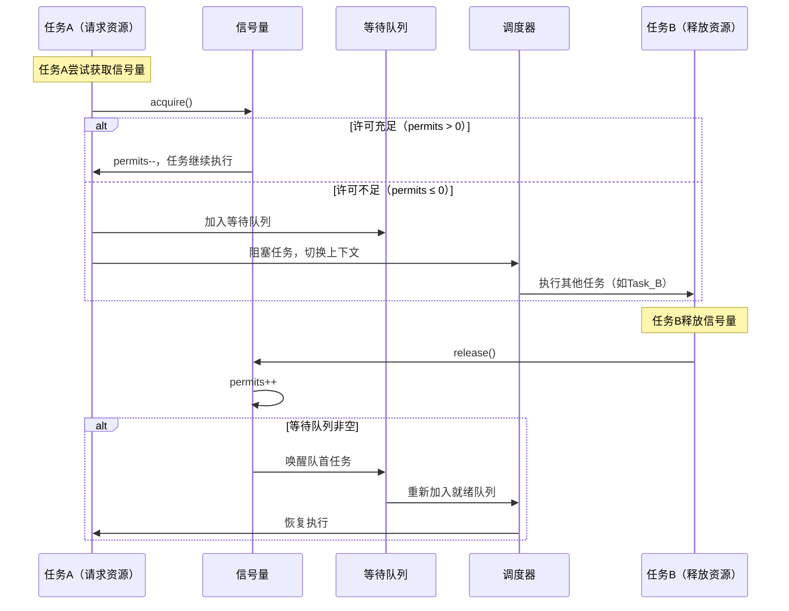
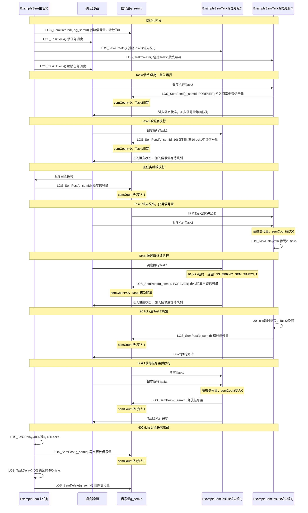
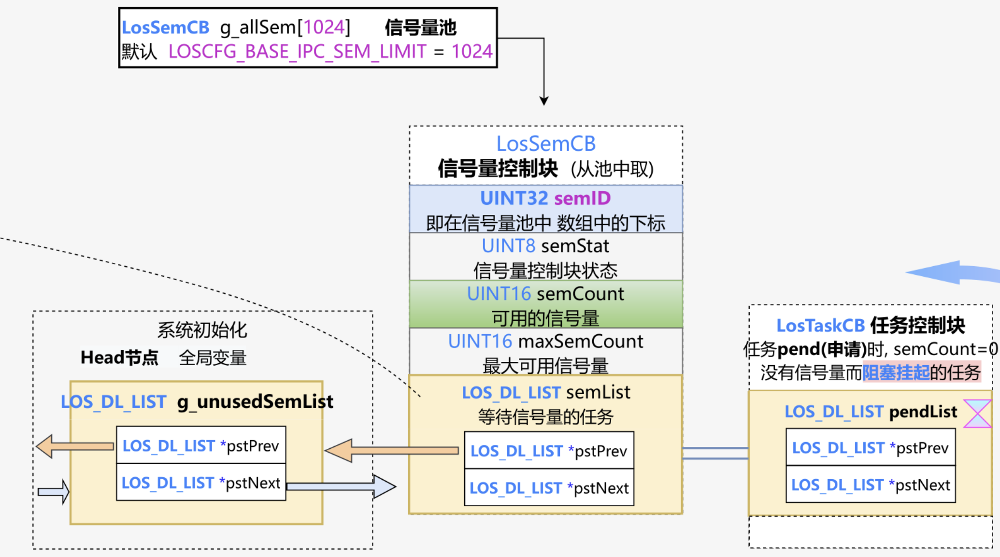

# 信号量Semaphore机制与Liteos_a内核信号量机制分析

[TOC]

# 1、信号量的通用知识点

## 1.1、信号量的概念

信号量是一种**基于计数器的同步原语**，用于控制多个线程/任务对共享资源的并发访问。其核心特征包括：

- **资源配额管理**：通过计数器（`permits`）限制同时访问资源的线程数量。计数器初始值表示可用资源总数，获取信号量时计数器减1，释放时加1。
- **阻塞唤醒机制**：当资源不足（计数器≤0）时，请求线程进入阻塞状态，加入等待队列；资源释放时唤醒等待队列中的线程。
- **类型区分：**
    - **计数信号量（Counting Semaphore）**：计数器范围≥0，允许多线程并发访问资源（如连接池）。
    - **二进制信号量（Binary Semaphore）**：计数器取值仅0或1，功能等同于互斥锁（Mutex）。
- **应用场景：**
    - 限流控制（如数据库连接池、API并发请求）。
    - 生产者-消费者模型（协调生产/消费速率）。
    - 互斥访问（二进制信号量替代互斥锁）。


## 1.2、信号量的通用结构

### 1.2.1、信号量控制块

**核心作用**：管理信号量状态、计数器及等待队列。
**通用结构设计**​：

```c
struct semaphore_control_block {  
    int permits;               // 可用许可计数器  
    struct List wait_queue;    // 等待队列（双向链表）  
    bool is_fair;             // 公平模式标志（可选）  
};  
```


### 1.2.2、许可计数器

**核心作用**：

- `permits > 0`：表示剩余可用资源数量。
- `permits ≤ 0`：表示资源耗尽，后续线程需阻塞。 ​

**操作规则**​：

- **获取许可（P操作）**：`permits--`；若`permits < 0`则线程阻塞。
- **释放许可（V操作）**：`permits++`；若`permits ≤ 0`则唤醒一个等待线程。


### 1.2.3、等待队列

**核心作用**：管理因资源不足而阻塞的线程，按公平策略（FIFO）或非公平策略（竞争）排序。
 ​**唤醒策略**​：

- **公平模式**：按等待顺序唤醒（先阻塞先唤醒）。
- **非公平模式**：唤醒顺序由调度器决定，可能产生线程饥饿。


## 1.3、信号量的运行时序图




## 1.4、信号量关键机制说明

1、**原子性操作：**`acquire()`和`release()`需保证原子性，避免竞态条件（如CAS实现）。

2、**死锁预防：**

- 必须成对调用`acquire()`/`release()`，否则导致资源泄漏或永久阻塞。
- 避免嵌套获取多个信号量（可能引发死锁）。

3、**性能优化：**

- 单进程优先使用轻量级信号量（如`SemaphoreSlim`），跨进程需内核级信号量。


# 2、Liteos_a内核中信号量的实现

## 2.1、Liteos_a内核中信号量的概念

​	Liteos_a内核中的信号量是一种任务间通信的机制，可以实现任务间同步或共享资源的互斥访问。

​	一个信号量的数据结构中，通常有一个计数值，用于对有效资源数的计数，表示剩下的可被使用的共享资源数，其值的含义分两种情况：

- 0，表示该信号量当前不可获取，因此可能存在正在等待该信号量的任务。
- 正值，表示该信号量当前可被获取。

Liteos_a内核中以同步为目的的信号量和以互斥为目的的信号量在使用上有如下不同：

- 用作互斥时，初始信号量计数值不为0，表示可用的共享资源个数。在需要使用共享资源前，先获取信号量，然后使用一个共享资源，使用完毕后释放信号量。这样在共享资源被取完，即信号量计数减至0时，其他需要获取信号量的任务将被阻塞，从而保证了共享资源的互斥访问。另外，当共享资源数为1时，建议使用二值信号量，一种类似于互斥锁的机制。
- 用作同步时，初始信号量计数值为0。任务1因获取不到信号量而阻塞，直到任务2或者某中断释放信号量，任务1才得以进入Ready或Running态，从而达到了任务间的同步。


## 2.2、Liteos_a内核的信号量运行机制

### 2.2.1、信号量控制块

```c
// kernel_liteos_a\kernel\base\include\los_sem_pri.h
typedef struct {
    UINT16            semStat;          /* 信号量状态 */
    UINT16            semType;          /* 信号量类型 */
    UINT16            semCount;         /* 信号量计数 */
    UINT16            semId;            /* 信号量索引号 */
    LOS_DL_LIST       semList;          /* 用于插入阻塞于信号量的任务 */
} LosSemCB;
```


### 2.2.2、信号量运作原理

​	信号量允许多个任务在同一时刻访问共享资源，但会限制同一时刻访问此资源的最大任务数目。当访问资源的任务数达到该资源允许的最大数量时，会阻塞其他试图获取该资源的任务，直到有任务释放该信号量。

- 信号量初始化：始化时为配置的N个信号量申请内存（N值可以由用户自行配置，通过LOSCFG_BASE_IPC_SEM_LIMIT宏实现），并把所有信号量初始化成未使用，加入到未使用链表中供系统使用。
- 信号量创建：从未使用的信号量链表中获取一个信号量，并设定初值。
- 信号量申请：若其计数器值大于0，则直接减1返回成功。否则任务阻塞，等待其它任务释放该信号量，等待的超时时间可设定。当任务被一个信号量阻塞时，将该任务挂到信号量等待任务队列的队尾。
- 信号量释放：若没有任务等待该信号量，则直接将计数器加1返回。否则唤醒该信号量等待任务队列上的第一个任务。
- 信号量删除：将正在使用的信号量置为未使用信号量，并挂回到未使用链表。


### 2.2.3、信号量运作示意图


## 2.3、Liteos_a内核信号量模块的总结

​	分析到这里，可以看出Liteos_a内核完整的实现了 1.1 ~ 1.4 小节中信号量所有的通用机制。接下来就借助Liteos_a内核的源代码继续分析，Liteos_a内核是如何通过代码将信号量的这些机制一一实现的。


# 3、Liteos_a内核信号量开发案例

## 3.1、接口说明

创建/删除信号量：

| 接口名称        | 描述                              |
| ------------------- | --------------------------------- |
| LOS_SemCreate       | 创建信号量，返回信号量ID。        |
| LOS_BinarySemCreate | 创建二值信号量，其计数值最大为1。 |
| LOS_SemDelete       | 删除指定的信号量。                |

申请/释放信号量：

| 接口名称 | 描述                               |
| ------------ | ---------------------------------- |
| LOS_SemPend  | 申请指定的信号量，并设置超时时间。 |
| LOS_SemPost  | 释放指定的信号量。                 |


## 3.2、开发流程

信号量的典型开发流程：

* 1、创建信号量LOS_SemCreate，若要创建二值信号量则调用LOS_BinarySemCreate。
* 2、申请信号量LOS_SemPend。
* 3、释放信号量LOS_SemPost。
* 4、删除信号量LOS_SemDelete。

**注意：** 由于中断不能被阻塞，因此不能在中断中使用阻塞模式申请信号量。


## 3.3、编程实例

### 3.3.1、实例描述

本实例实现如下功能：

* 1、测试任务ExampleSem创建一个信号量，锁任务调度，创建两个任务ExampleSemTask1、ExampleSemTask2, ExampleSemTask2优先级高于ExampleSemTask1，两个任务中申请同一信号量，解锁任务调度后两任务阻塞，测试任务ExampleSem释放信号量。
* 2、ExampleSemTask2得到信号量，被调度，然后任务休眠20Ticks，ExampleSemTask2延迟，ExampleSemTask1被唤醒。
* 3、ExampleSemTask1定时阻塞模式申请信号量，等待时间为10Ticks，因信号量仍被ExampleSemTask2持有，ExampleSemTask1挂起，10Ticks后仍未得到信号量，ExampleSemTask1被唤醒，试图以永久阻塞模式申请信号量，ExampleSemTask1挂起。
* 4、20Tick后ExampleSemTask2唤醒， 释放信号量后，ExampleSemTask2执行完，ExampleSemTask1得到信号量被调度运行，最后释放信号量。
* 5、ExampleSemTask1执行完，400Ticks后任务ExampleSem被唤醒，执行删除信号量。


### 3.3.2、编程示例

​	本演示代码在`./kernel/liteos_a/testsuites/kernel/src/osTest.c`中编译验证，在TestTaskEntry中调用验证入口函数ExampleSem。
示例代码如下：

```c
#include "los_sem.h"
#include "securec.h"

/* 任务ID */
static UINT32 g_testTaskId01;
static UINT32 g_testTaskId02;

/* 测试任务优先级 */
#define TASK_PRIO_LOW   5
#define TASK_PRIO_HI    4

/* 信号量结构体id */
static UINT32 g_semId;

VOID ExampleSemTask1(VOID)
{
    UINT32 ret;

    dprintf("ExampleSemTask1 try get sem g_semId, timeout 10 ticks.\n");

    /* 定时阻塞模式申请信号量，定时时间为10ticks */
    ret = LOS_SemPend(g_semId, 10);
    /* 申请到信号量 */
    if (ret == LOS_OK) {
         LOS_SemPost(g_semId);
         return;
    }
    /* 定时时间到，未申请到信号量 */
    if (ret == LOS_ERRNO_SEM_TIMEOUT) {
        dprintf("ExampleSemTask1 timeout and try get sem g_semId wait forever.\n");

        /*永久阻塞模式申请信号量*/
        ret = LOS_SemPend(g_semId, LOS_WAIT_FOREVER);
        dprintf("ExampleSemTask1 wait_forever and get sem g_semId.\n");
        if (ret == LOS_OK) {
            dprintf("ExampleSemTask1 post sem g_semId.\n");
            LOS_SemPost(g_semId);
            return;
        }
    }
}

VOID ExampleSemTask2(VOID)
{
    UINT32 ret;
    dprintf("ExampleSemTask2 try get sem g_semId wait forever.\n");

    /* 永久阻塞模式申请信号量 */
    ret = LOS_SemPend(g_semId, LOS_WAIT_FOREVER);
    if (ret == LOS_OK) {
        dprintf("ExampleSemTask2 get sem g_semId and then delay 20 ticks.\n");
    }

    /* 任务休眠20 ticks */
    LOS_TaskDelay(20);

    dprintf("ExampleSemTask2 post sem g_semId.\n");
    /* 释放信号量 */
    LOS_SemPost(g_semId);
    return;
}

UINT32 ExampleSem(VOID)
{
    UINT32 ret;
    TSK_INIT_PARAM_S task1;
    TSK_INIT_PARAM_S task2;

   /* 创建信号量 */
    LOS_SemCreate(0, &g_semId);

    /* 锁任务调度 */
    LOS_TaskLock();

    /* 创建任务1 */
    (VOID)memset_s(&task1, sizeof(TSK_INIT_PARAM_S), 0, sizeof(TSK_INIT_PARAM_S));
    task1.pfnTaskEntry = (TSK_ENTRY_FUNC)ExampleSemTask1;
    task1.pcName       = "TestTask1";
    task1.uwStackSize  = LOSCFG_BASE_CORE_TSK_DEFAULT_STACK_SIZE;
    task1.usTaskPrio   = TASK_PRIO_LOW;
    ret = LOS_TaskCreate(&g_testTaskId01, &task1);
    if (ret != LOS_OK) {
        dprintf("task1 create failed .\n");
        return LOS_NOK;
    }

    /* 创建任务2 */
    (VOID)memset_s(&task2, sizeof(TSK_INIT_PARAM_S), 0, sizeof(TSK_INIT_PARAM_S));
    task2.pfnTaskEntry = (TSK_ENTRY_FUNC)ExampleSemTask2;
    task2.pcName       = "TestTask2";
    task2.uwStackSize  = LOSCFG_BASE_CORE_TSK_DEFAULT_STACK_SIZE;
    task2.usTaskPrio   = TASK_PRIO_HI;
    ret = LOS_TaskCreate(&g_testTaskId02, &task2);
    if (ret != LOS_OK) {
        dprintf("task2 create failed.\n");
        return LOS_NOK;
    }

    /* 解锁任务调度 */
    LOS_TaskUnlock();

    /* 任务休眠400 ticks */
    LOS_TaskDelay(400);

    ret = LOS_SemPost(g_semId);

    /* 任务休眠400 ticks */
    LOS_TaskDelay(400);

    /* 删除信号量 */
    LOS_SemDelete(g_semId);
    return LOS_OK;
}
```

编译运行得到的结果为：

```bash
ExampleSemTask2 try get sem g_semId wait forever.
ExampleSemTask1 try get sem g_semId, timeout 10 ticks.
ExampleSemTask1 timeout and try get sem g_semId wait forever.
ExampleSemTask2 get sem g_semId and then delay 20 ticks.
ExampleSemTask2 post sem g_semId.
ExampleSemTask1 wait_forever and get sem g_semId.
ExampleSemTask1 post sem g_semId.
```


### 3.3.3、实例的时序图



关键执行流程说明：

* 1、初始化阶段 ：主任务创建计数为0的信号量，锁调度后创建两个任务，Task2优先级(4)高于Task1优先级(5)
* 2、第一次信号量竞争 ：解锁调度后，Task2优先执行并申请信号量阻塞，Task1也申请信号量阻塞，主任务释放信号量
* 3、Task2获得信号量 ：由于优先级高，Task2优先获得信号量，然后休眠20 ticks
* 4、Task1超时重试 ：Task1的10 ticks定时等待超时，然后转为永久阻塞模式再次申请信号量
* 5、Task2释放Task1获得 ：20 ticks后Task2唤醒并释放信号量，Task1获得信号量并立即释放
* 6、清理阶段 ：主任务在400 ticks延时后清理信号量资源


# 4、Liteos_a内核信号量的源码分析

## 4.1、信号量控制块 LosSemCB

```c
// kernel_liteos_a\kernel\base\include\los_sem_pri.h
typedef struct {
    UINT8 semStat; 		 /**< Semaphore state */
    UINT16 semCount; 	 /**< Number of available semaphores */
    UINT16 maxSemCount;  /**< Max number of available semaphores */
    UINT32 semID; 		 /**< Semaphore control structure ID */
    LOS_DL_LIST semList; /**< Queue of tasks that are waiting on a semaphore */
} LosSemCB;

其中semID的高16位存放版本号、低16位存放索引：
假设系统配置 LOSCFG_BASE_IPC_SEM_LIMIT = 32 ：
    1. 系统初始化时创建32个信号量控制块
    2. 第5个控制块首次分配时，ID为 0x00000005 （版本0，索引5）
    3. 该信号量被删除后，控制块回到未使用链表，ID变为 0x00010005 （版本1，索引5）
    4. 再次分配这个控制块时，应用获得ID 0x00010005
    5. 如果有任务仍持有旧ID 0x00000005 尝试操作，会被检测为无效ID
这种机制确保了即使信号量控制块被重复使用，系统也能区分不同时期创建的信号量，提高了系统的稳定性和安全性。
```

信号量控制块 SCB 和任务控制块 TCB 的连接方式：




## 4.2、信号量初始化 OsSemInit

```c
// kernel_liteos_a\kernel\base\ipc\los_sem.c
/*
    1、初始化 系统信号量空闲链表g_unusedSemList
    2、为信号量池 分配内存
    3、初始化每一个信号量控制块
        semNode->semID：高16位当做版本号(0-0xFFFF 65535循环使用)
        semNode->semID：低16位当做在信号量空闲链表中的索引(0:LOSCFG_BASE_IPC_SEM_LIMIT-1)
        semNode->semStat：状态标记为OS_SEM_UNUSED
        semNode->semList：加入信号量空闲链表
    (可选)4、初始化信号量调试功能
*/
/*
 * Description  : Initialize the semaphore doubly linked list
 * Return       : LOS_OK on success, or error code on failure
 */
LITE_OS_SEC_TEXT_INIT UINT32 OsSemInit(VOID)
{
    LosSemCB *semNode = NULL;
    UINT32 index;

    // 初始化未使用信号量的双向链表
    LOS_ListInit(&g_unusedSemList);
    /* system resident memory, don't free */
    // 为所有信号量控制块分配内存
    // 注意：这是系统常驻内存，不会被释放    
    g_allSem = (LosSemCB *)LOS_MemAlloc(m_aucSysMem0, 
                                        (LOSCFG_BASE_IPC_SEM_LIMIT * sizeof(LosSemCB)));
    if (g_allSem == NULL) {
        return LOS_ERRNO_SEM_NO_MEMORY;
    }

    // 初始化每个信号量控制块并加入未使用链表
    for (index = 0; index < LOSCFG_BASE_IPC_SEM_LIMIT; index++) {
        semNode = ((LosSemCB *)g_allSem) + index;
        // 设置初始ID，(高16位)版本号为0、(低16位)ID为[0:LOSCFG_BASE_IPC_SEM_LIMIT-1]
        semNode->semID = SET_SEM_ID(0, index);
        // 标记为未使用状态
        semNode->semStat = OS_SEM_UNUSED;
        // 加入未使用链表
        LOS_ListTailInsert(&g_unusedSemList, &semNode->semList);
    }

    // 初始化信号量调试功能
    if (OsSemDbgInitHook() != LOS_OK) {
        return LOS_ERRNO_SEM_NO_MEMORY;
    }
    return LOS_OK;
}
```


## 4.3、信号量的创建 LOS_SemCreate

```c
// kernel_liteos_a\kernel\base\ipc\los_sem.c
LITE_OS_SEC_TEXT_INIT UINT32 LOS_SemCreate(UINT16 count, UINT32 *semHandle)
{
    // 标准信号量，设置其计数最大数值为OS_SEM_COUNT_MAX(65534)
    return OsSemCreate(count, OS_SEM_COUNT_MAX, semHandle);
}

/*
    1、参数检查
    2、从信号量空闲链表中拿到一个信号量控制块
    3、按照传入参数初始化这个控制块
    4、将信号量ID返回给调用者semHandle
*/
/*
 * Description  : Create a semaphore,
 * Input        : count     --- semaphore count,
 *                maxCount  --- Max number of available semaphores,
 *                semHandle --- Index of semaphore,
 * Return       : LOS_OK on success ,or error code on failure
 */
LITE_OS_SEC_TEXT_INIT UINT32 OsSemCreate(UINT16 count, UINT16 maxCount, UINT32 *semHandle)
{
    UINT32 intSave;
    LosSemCB *semCreated = NULL;
    LOS_DL_LIST *unusedSem = NULL;
    UINT32 errNo;
    UINT32 errLine;

    // 检查信号量句柄是否存在
    if (semHandle == NULL) {
        return LOS_ERRNO_SEM_PTR_NULL;
    }

    // 检查初始计数值是否超过最大计数值,出错时记录错误码
    if (count > maxCount) {
        OS_GOTO_ERR_HANDLER(LOS_ERRNO_SEM_OVERFLOW);
    }

    // 关闭调度，保护临界区
    SCHEDULER_LOCK(intSave);

    // 信号量空闲链表为NULL时记录debug信息
    if (LOS_ListEmpty(&g_unusedSemList)) {
        SCHEDULER_UNLOCK(intSave);
        OsSemInfoGetFullDataHook();
        OS_GOTO_ERR_HANDLER(LOS_ERRNO_SEM_ALL_BUSY);
    }

    // 拿到信号量空闲链表中第一个信号量控制块
    unusedSem = LOS_DL_LIST_FIRST(&g_unusedSemList);
    // 从信号量空闲链表中删除该控制块
    LOS_ListDelete(unusedSem);
    // 开启调度，保护临界区
    SCHEDULER_UNLOCK(intSave);
    // 从信号量控制块的semList成员得到结构体首地址
    semCreated = GET_SEM_LIST(unusedSem);
    // 设置初始计数值
    semCreated->semCount = count;
    // 将状态标记为已使用 OS_SEM_USED
    semCreated->semStat = OS_SEM_USED;
    // 设置最大计数值
    semCreated->maxSemCount = maxCount;
    // 初始化等待任务链表
    LOS_ListInit(&semCreated->semList);
    // 将信号量ID返回给调用者
    *semHandle = semCreated->semID;
    OsHookCall(LOS_HOOK_TYPE_SEM_CREATE, semCreated);
    OsSemDbgUpdateHook(semCreated->semID, OsCurrTaskGet()->taskEntry, count);
    return LOS_OK;

ERR_HANDLER:
    OS_RETURN_ERROR_P2(errLine, errNo);
}
```


## 4.4、二值信号量的创建 LOS_BinarySemCreate

```c
// kernel_liteos_a\kernel\base\ipc\los_sem.c
LITE_OS_SEC_TEXT_INIT UINT32 LOS_BinarySemCreate(UINT16 count, UINT32 *semHandle)
{
    // 二进制信号量：设置技术最大值为 OS_SEM_BINARY_COUNT_MAX(1)
    return OsSemCreate(count, OS_SEM_BINARY_COUNT_MAX, semHandle);
}
```

其中 OsSemCreate 函数同上 LOS_SemCreate 中的分析。


## 4.5、信号量的删除 LOS_SemDelete

```c
// kernel_liteos_a\kernel\base\ipc\los_sem.c
/*
    1、参数检查
    2、获取信号量控制块
    3、信号量有效性检查(版本号)
    4、检查是否有任务正在等待该信号量
    5、归还信号量控制块
    6、其他操作，之后返回
*/
LITE_OS_SEC_TEXT_INIT UINT32 LOS_SemDelete(UINT32 semHandle)
{
    UINT32 intSave;
    LosSemCB *semDeleted = NULL;
    UINT32 errNo;
    UINT32 errLine;

    // 检查信号量句柄的索引部分是否有效，即是否在系统配置的信号量数量范围内。
    if (GET_SEM_INDEX(semHandle) >= (UINT32)LOSCFG_BASE_IPC_SEM_LIMIT) {
        OS_GOTO_ERR_HANDLER(LOS_ERRNO_SEM_INVALID);
    }

    // 获取信号量控制块
    semDeleted = GET_SEM(semHandle);

    // 关闭调度，保护临界区
    SCHEDULER_LOCK(intSave);

    // 检查信号量是否已经处于未使用状态
    // 检查信号量ID是否匹配（防止使用已被删除并重新分配的信号量）
    // 因为信号量控制块会被重复使用，每次使用的semDeleted->semID高16位的版本号不同
    if ((semDeleted->semStat == OS_SEM_UNUSED) || (semDeleted->semID != semHandle)) {
        SCHEDULER_UNLOCK(intSave);
        OS_GOTO_ERR_HANDLER(LOS_ERRNO_SEM_INVALID);
    }

    // 检查是否有任务正在等待该信号量
    // 如果有任务正在等待该信号量，则不能删除，返回错误。
    if (!LOS_ListEmpty(&semDeleted->semList)) {
        SCHEDULER_UNLOCK(intSave);
        OS_GOTO_ERR_HANDLER(LOS_ERRNO_SEM_PENDED);
    }

    //归还信号量控制块
    // 将信号量控制块插入到未使用链表的尾部
    LOS_ListTailInsert(&g_unusedSemList, &semDeleted->semList);
    // 将信号量状态设置为未使用
    semDeleted->semStat = OS_SEM_UNUSED;
    // 关键点 ：更新信号量ID，将(高16位)版本号加1，保持(低16位)索引不变
    // 这样可以防止其他任务使用旧的信号量句柄访问已删除的信号量
    semDeleted->semID = SET_SEM_ID(GET_SEM_COUNT(semDeleted->semID) + 1, 
                                   GET_SEM_INDEX(semDeleted->semID));

    // 调用钩子函数
    // 调用信号量删除的钩子函数和调试更新钩子函数。
    OsHookCall(LOS_HOOK_TYPE_SEM_DELETE, semDeleted);
    OsSemDbgUpdateHook(semDeleted->semID, NULL, 0);

    // 解锁调度器，返回成功。
    SCHEDULER_UNLOCK(intSave);
    return LOS_OK;

ERR_HANDLER:
    OS_RETURN_ERROR_P2(errLine, errNo);
}
```


## 4.6、信号量的获取 LOS_SemPend

```c
// kernel_liteos_a\kernel\base\ipc\los_sem.c
/*
    1、参数检查
    2、使用环境检查
    3、信号量有效性检查
    4、尝试获取信号量
    5、检查是否可以进行调度
    6、任务阻塞等待
    7、解锁并返回
*/
LITE_OS_SEC_TEXT UINT32 LOS_SemPend(UINT32 semHandle, UINT32 timeout)
{
    UINT32 intSave;
    LosSemCB *semPended = GET_SEM(semHandle);
    UINT32 retErr = LOS_OK;
    LosTaskCB *runTask = NULL;

    // 检查信号量句柄的索引部分是否有效，即是否在系统配置的信号量数量范围内。
    if (GET_SEM_INDEX(semHandle) >= (UINT32)LOSCFG_BASE_IPC_SEM_LIMIT) {
        OS_RETURN_ERROR(LOS_ERRNO_SEM_INVALID);
    }

    // 检查是否在中断上下文中调用（不允许）
    if (OS_INT_ACTIVE) {
        PRINT_ERR("!!!LOS_ERRNO_SEM_PEND_INTERR!!!\n");
        OsBackTrace();
        return LOS_ERRNO_SEM_PEND_INTERR;
    }

    // 检查是否是系统任务调用（不允许）
    runTask = OsCurrTaskGet();
    if (runTask->taskStatus & OS_TASK_FLAG_SYSTEM_TASK) {
        OsBackTrace();
        return LOS_ERRNO_SEM_PEND_IN_SYSTEM_TASK;
    }

    // 关闭调度，保护临界区
    SCHEDULER_LOCK(intSave);

    // 检查信号量ID是否匹配（防止使用已被删除并重新分配的信号量）
    if ((semPended->semStat == OS_SEM_UNUSED) || (semPended->semID != semHandle)) {
        retErr = LOS_ERRNO_SEM_INVALID;
        goto OUT;
    }
    /* Update the operate time, no matter the actual Pend success or not */
    // 更新信号量操作时间，用于调试。
    OsSemDbgTimeUpdateHook(semHandle);

    if (semPended->semCount > 0) {
        // 如果信号量计数大于0，则直接减1并成功返回
        semPended->semCount--;
        OsHookCall(LOS_HOOK_TYPE_SEM_PEND, semPended, runTask, timeout);
        goto OUT;
    } else if (!timeout) {
        // 如果信号量计数为0且timeout为0（非阻塞模式），则立即返回失败
        retErr = LOS_ERRNO_SEM_UNAVAILABLE;
        goto OUT;
    }

    // 检查当前是否可以进行调度，如果在锁中则不允许阻塞等待。
    // 即可以调度才能够阻塞等待，否则会发生死锁
    if (!OsPreemptableInSched()) {
        PRINT_ERR("!!!LOS_ERRNO_SEM_PEND_IN_LOCK!!!\n");
        OsBackTrace();
        retErr = LOS_ERRNO_SEM_PEND_IN_LOCK;
        goto OUT;
    }

    OsHookCall(LOS_HOOK_TYPE_SEM_PEND, semPended, runTask, timeout);
    // 设置任务的等待状态和等待对象
    OsTaskWaitSetPendMask(OS_TASK_WAIT_SEM, semPended->semID, timeout);
    // 任务进入阻塞状态等待信号量
    retErr = runTask->ops->wait(runTask, &semPended->semList, timeout);
    // 如果等待超时，将任务超时错误码转换为信号量超时错误码
    if (retErr == LOS_ERRNO_TSK_TIMEOUT) {
        retErr = LOS_ERRNO_SEM_TIMEOUT;
    }

OUT:
    // 解锁调度器，返回结果。
    SCHEDULER_UNLOCK(intSave);
    return retErr;
}
```


## 4.7、信号量的释放 LOS_SemPost

```c
// kernel_liteos_a\kernel\base\ipc\los_sem.c
/*
    1、参数检查
    2、释放信号量
    3、根据需要触发调度
*/
LITE_OS_SEC_TEXT UINT32 LOS_SemPost(UINT32 semHandle)
{
    UINT32 intSave;
    UINT32 ret;
    BOOL needSched = FALSE;

    // 检查信号量句柄的索引部分是否有效。
    if (GET_SEM_INDEX(semHandle) >= LOSCFG_BASE_IPC_SEM_LIMIT) {
        return LOS_ERRNO_SEM_INVALID;
    }

    // 锁定调度器，保护临界区
    SCHEDULER_LOCK(intSave);
    // 调用 OsSemPostUnsafe 函数释放信号量
    ret = OsSemPostUnsafe(semHandle, &needSched);
    // 解锁调度器
    SCHEDULER_UNLOCK(intSave);
    // 如果有任务被唤醒，则触发任务调度
    if (needSched) {
        // 在多处理器系统中通知所有CPU进行调度
        LOS_MpSchedule(OS_MP_CPU_ALL);
        // 触发当前CPU的任务调度
        LOS_Schedule();
    }

    return ret;
}
```

其中的 OsSemPostUnsafe 函数：

```c
// kernel_liteos_a\kernel\base\ipc\los_sem.c
/*
    1、参数检查
    2、如果有任务在等待该信号量：唤醒在等待的任务，并设置需要调度的标志
    3、如果没有任务在等待该信号量：信号量的引用计数semPosted->semCount++
*/
LITE_OS_SEC_TEXT UINT32 OsSemPostUnsafe(UINT32 semHandle, BOOL *needSched)
{
    LosTaskCB *resumedTask = NULL;
    LosSemCB *semPosted = GET_SEM(semHandle);
    // 检查信号量ID是否匹配及信号量是否处于使用状态。
    //      检查信号量的ID和版本号 semPosted->semID != semHandle
    if ((semPosted->semID != semHandle) || (semPosted->semStat == OS_SEM_UNUSED)) {
        return LOS_ERRNO_SEM_INVALID;
    }

    /* Update the operate time, no matter the actual Post success or not */
    // 更新信号量操作时间，用于调试。
    OsSemDbgTimeUpdateHook(semHandle);

    // 如果信号量计数已达最大值，则返回溢出错误。
    //  1. 防止资源计数溢出
    //  2. 检测程序逻辑错误
    //  3. 内存资源限制
    //  4. 系统稳定性保证
    //  5. 二值信号量的特殊情况
    if (semPosted->semCount == OS_SEM_COUNT_MAX) {
        return LOS_ERRNO_SEM_OVERFLOW;
    }
    // 如果有任务在等待该信号量
    if (!LOS_ListEmpty(&semPosted->semList)) {
        // 获取等待队列中的第一个任务
        resumedTask = OS_TCB_FROM_PENDLIST(LOS_DL_LIST_FIRST(&(semPosted->semList)));
        // 清除任务的等待标记
        OsTaskWakeClearPendMask(resumedTask);
        // 唤醒任务
        resumedTask->ops->wake(resumedTask);
        // 设置需要调度标志
        if (needSched != NULL) {
            *needSched = TRUE;
        }
    } else { // 如果没有任务等待,增加信号量计数
        semPosted->semCount++;
    }
    // 调用信号量释放的钩子函数。
    OsHookCall(LOS_HOOK_TYPE_SEM_POST, semPosted, resumedTask);
    return LOS_OK;
}
```


# 5、对Liteos_a内核使用信号量机制的思考

## 5.1、为什么信号量要固定数量？且分配一块固定内存供其使用？

1、实时性保证

- 确定性内存分配 ：在系统初始化时一次性分配所有信号量控制块，避免运行时动态分配带来的不确定性延迟
- 避免内存碎片 ：固定大小的连续内存块避免了频繁分配/释放导致的内存碎片问题
- 快速访问 ：通过数组索引直接访问，时间复杂度为 O(1)

2、资源管理和安全性

- 资源上限控制 ：通过 LOSCFG_BASE_IPC_SEM_LIMIT 宏限制最大信号量数量，防止资源耗尽
- 内存泄漏防护 ：系统常驻内存（注释中的 "system resident memory, don't free"），避免内存泄漏
- 简化管理 ：使用链表管理未使用的信号量，创建时从链表头取出，删除时放回链表

3、嵌入式系统特点

- 内存受限 ：嵌入式系统内存有限，需要精确控制内存使用
- 可预测性 ：系统行为需要可预测，固定分配符合这一要求
- 启动时分配 ：在系统启动时完成所有基础资源分配，运行时不再进行大块内存操作


## 5.2、为什么中断中不能申请信号量？

有两个导致系统无法正常执行的原因：

* 1、中断中如果申请了被打断任务已经获取的同一个信号量，系统会出现死锁，导致系统卡住，无法正常运行。
* 2、中断中如果要进行阻塞等待，要任务切换，把栈指针切换到了其他地方。在切换栈指针之后，中断找不到原来的中断栈上的正确数据，导致程序从错误的栈中读取数据从而执行错误的程序，最终系统可能就死机。

中断中不能申请信号量的根本原因是：

* 信号量申请失败时的任务调度会破坏硬件期望的中断处理流程，这是所有现代处理器架构的硬件限制，无法通过软件绕过。

那么比较完整的原因如下：

* 1、硬件栈指针绑定问题

    - 中断发生时硬件自动将上下文保存到 中断栈 （SP_irq）

    - 信号量申请失败会触发 任务调度 ，切换栈指针到用户栈（SP_usr）

    - 中断返回时硬件期望从 中断栈 恢复上下文，但栈指针已被改变

    - 结果：系统无法找到正确的返回地址，导致崩溃

* 2、中断处理的原子性要求

    - 中断处理必须是 不可被打断的原子操作

    - 信号量申请可能导致当前任务 阻塞和调度

    - 这违背了中断处理的原子性原则

    - 结果：破坏中断响应的实时性和可预测性

* 3、硬件中断状态机的限制

    - 中断控制器等待CPU发送 ACK确认信号

    - 如果中断中调度到其他任务，ACK信号无法正确发送

    - 结果：中断控制器停止工作，系统失去中断响应能力

* 4、处理器特权级别冲突

    - 中断处理运行在 特权模式 （如ARM的IRQ模式）

    - 任务调度可能切换到 用户模式 任务

    - 硬件状态机无法处理这种特权级别的不一致

    - 结果：触发处理器异常，系统崩溃


​	基于对源码的深入分析，下面对 Liteos_a 内核信号量机制在源码中的使用位置、使用原因、收益、潜在问题与取舍做一个系统性的归纳，结合源码路径与调用点，用具体文件来锚定这些结论。

## 5.3、OH工程项目中哪些地方使用信号量

按场景/模块归类，并给出典型的使用文件：

1、内核基础 IPC：信号量 API 定义与实现

- 信号量类型与 API 声明在`kernel_liteos_a\kernel\include\los_sem.h`，包括：
  - `LOS_SemCreate`：创建计数信号量
  - `LOS_BinarySemCreate`：创建二值信号量
  - `LOS_SemDelete`：删除信号量
  - `LOS_SemPend`：申请信号量（支持超时）
  - `LOS_SemPost`：释放信号量
- 信号量核心实现在`kernel_liteos_a\kernel\base\ipc\los_sem.c`
- 信号量私有定义在 `kernel_liteos_a\kernel\base\include\los_sem_pri.h`，定义了 `LosSemCB` 控制块结构体
- 信号量调试支持在`kernel_liteos_a\kernel\base\ipc\los_sem_debug.c`

2、内核服务与系统管理

- **控制台模块**：使用信号量控制控制台访问权限，实现互斥访问
  - `kernel_liteos_a\kernel\common\console.c`中的 `consoleSem` 用于控制台权限管理
  - 通过 `LOS_SemPend(consoleCB->consoleSem, LOS_WAIT_FOREVER)` 获取控制台访问权限
  - 通过 `LOS_SemPost(consoleCB->consoleSem)` 释放控制台访问权限

- **黑盒日志模块**：使用多个信号量同步日志操作和错误信息保存
  - `kernel_liteos_a\kernel\extended\blackbox\los_blackbox_core.c`中使用：
    - `g_opsListSem`：保护模块操作列表的并发访问
    - `g_tempErrInfoSem`：保护临时错误信息的并发访问
    - `g_tempErrLogSaveSem`：用于错误日志保存任务的同步

3、POSIX/第三方内核语义的适配层

- **FreeBSD 兼容层**：用信号量实现 Linux/FreeBSD 的同步语义
  - `third_party_FreeBSD\sys\compat\linuxkpi\common\src\linux_semaphore.c`中实现：
    - `_sema_init`：初始化信号量，调用 `LOS_SemCreate`
    - `_sema_lock`：获取信号量，调用 `LOS_SemPend`
    - `_sema_unlock`：释放信号量，调用 `LOS_SemPost`
    - `_sema_trylock`：尝试获取信号量，调用 `LOS_SemPend(sem, LOS_NO_WAIT)`
    - `_sema_destory`：销毁信号量，调用 `LOS_SemDelete`

- **musl 库适配**：定义信号量数量限制，与内核配置对接
  - `third_party_musl\porting\liteos_a\kernel\include\limits.h`中定义：
    - `SEM_NSEMS_MAX LOSCFG_BASE_IPC_SEM_LIMIT`：将 musl 的信号量数量限制与内核配置关联
  - `third_party_musl\src\thread\sem_open.c`中使用 `SEM_NSEMS_MAX` 限制命名信号量数量

4、驱动与平台层

- **Wi-Fi 驱动**：使用信号量封装进行同步操作
  - `device_soc_hisilicon\common\platform\wifi\hi3881v100\driver\oal\oal_semaphore.h`中定义：
    - `oal_sema_init`：调用 `LOS_SemCreate` 初始化信号量
    - `oal_down`：信号量申请操作的封装
    - 将 `LosSemCB` 类型定义为 `oal_semaphore_stru`


## 5.4、这些地方为什么要使用信号量机制

1、计数型资源管理

- 信号量提供计数语义，可以管理有限数量的资源（如缓冲区、连接数等）
- 支持二值信号量（互斥）和计数信号量（资源池）两种模式

2、任务间同步与互斥

- 提供阻塞式等待机制，任务可以在资源不可用时自动挂起
- 支持超时等待（`LOS_SemPend` 的 timeout 参数），避免无限等待
- 内核统一管理等待队列，支持优先级继承和调度

3、跨模块的通用同步原语

- 作为基础 IPC 机制，可以被上层不同语义（POSIX、FreeBSD、Linux KPI）复用
- 提供统一的错误处理和调试接口

4、实时性保证

- 支持优先级调度，高优先级任务可以抢占低优先级任务
- 等待队列按优先级排序，确保实时任务能及时获得资源


## 5.5、这些地方使用信号量带来的好处

1、对内核服务模块

- **控制台模块**：通过 `consoleSem` 实现控制台的互斥访问，避免多任务同时操作控制台导致的输出混乱
  - 示例：在`kernel_liteos_a\kernel\common\console.c`中，`ConsoleCtrlRightsCapture` 函数使用信号量确保只有一个任务能获得控制台控制权

- **黑盒日志模块**：多信号量协作实现复杂的日志同步逻辑
  - `g_opsListSem` 保护模块注册列表，避免并发注册冲突
  - `g_tempErrInfoSem` 保护临时错误信息，确保错误信息的完整性
  - `g_tempErrLogSaveSem` 实现生产者-消费者模式，错误发生时唤醒日志保存任务

2、对 POSIX/第三方语义适配

- **统一底层实现**：FreeBSD 兼容层通过信号量实现 Linux 语义的 semaphore，减少移植工作量
  - 示例：`third_party_FreeBSD\sys\compat\linuxkpi\common\src\linux_semaphore.c` 中的 `_sema_lock` 直接调用 `LOS_SemPend`，实现语义映射

- **配置统一管理**：musl 库的 `SEM_NSEMS_MAX` 直接使用内核的 `LOSCFG_BASE_IPC_SEM_LIMIT`，避免配置不一致

3、对驱动模块

- **封装简化**：Wi-Fi 驱动通过 OAL 层封装，提供统一的信号量接口，屏蔽底层差异
- **资源管理**：可以用计数信号量管理驱动中的有限资源（如 DMA 通道、中断资源等）

4、对系统整体

- **内存效率**：信号量控制块结构简单，内存占用小
- **调试支持**：统一的调试接口（`kernel_liteos_a\kernel\base\ipc\los_sem_debug.c`）便于问题定位
- **可配置性**：通过 `LOSCFG_BASE_IPC_SEM_LIMIT` 可以根据系统需求调整信号量数量


## 5.6、这些地方使用信号量带来的坏处/局限

1、优先级反转问题

- 低优先级任务持有信号量时，高优先级任务被阻塞，可能导致优先级反转
- LiteOS-A 的信号量不支持优先级继承机制，无法自动解决此问题

2、死锁风险

- 多个信号量的嵌套使用可能导致死锁，如黑盒日志模块中多个信号量的使用需要谨慎设计获取顺序
- 缺乏死锁检测机制，问题发生时难以快速定位

3、等待队列的线性遍历开销

- 信号量等待队列使用链表实现，唤醒时需要 O(n) 遍历
- 在等待任务较多的场景下，`LOS_SemPost` 的开销会增加

4、资源泄漏风险

- 如果任务异常退出而未释放信号量，会导致资源永久占用
- 缺乏自动回收机制，需要应用层保证正确的资源管理

5、调试复杂性

- 信号量状态的可见性有限，难以追踪复杂的同步问题
- 虽然有调试接口，但在运行时动态分析同步问题仍然困难


## 5.7、有坏处为什么仍然使用

1、嵌入式系统的实际需求匹配

- 大多数嵌入式应用的并发度不高，等待队列长度通常很小，O(n) 遍历成本可接受
- 优先级反转在实际应用中通过合理的任务设计可以避免

2、简单性与可靠性的平衡

- 信号量机制简单直观，相比复杂的同步机制（如读写锁、条件变量）更容易正确使用
- 经过大量验证的成熟机制，稳定性高

3、标准兼容性要求

- POSIX 标准要求提供信号量支持，必须实现以满足兼容性
- 第三方组件（FreeBSD、musl）依赖信号量接口，移除会导致兼容性问题

4、资源受限环境的优势

- 内存占用小，适合资源受限的嵌入式环境
- 实现简单，代码量小，便于维护和验证

5、分层设计的需要

- 作为基础同步原语，为上层提供构建复杂同步机制的基础
- 统一的底层实现简化了系统架构


## 5.8、如何在工程中取舍

1、选择合适的同步机制

- **互斥访问场景**：优先使用二值信号量（`LOS_BinarySemCreate`），如控制台访问控制
- **资源计数场景**：使用计数信号量（`LOS_SemCreate`），如缓冲区池管理
- **复杂同步场景**：考虑使用事件（Event）或消息队列（Queue），避免多信号量嵌套

2、避免优先级反转

- 合理设计任务优先级，避免跨优先级的资源竞争
- 持有信号量的时间尽可能短，减少阻塞高优先级任务的时间
- 考虑使用互斥锁（Mutex）替代信号量，利用其优先级继承特性

3、防范死锁

- 建立信号量获取的全局顺序，所有任务按相同顺序获取多个信号量
- 使用超时机制（`LOS_SemPend` 的 timeout 参数）避免无限等待
- 在关键路径上使用 `LOS_SemPend(sem, LOS_NO_WAIT)` 进行非阻塞尝试

4、合理配置资源

- 根据实际需求设置 `LOSCFG_BASE_IPC_SEM_LIMIT`，避免资源浪费或不足
- 监控信号量使用情况，通过调试接口（kernel_liteos_a\kernel\base\ipc\los_sem_debug.c）分析资源使用模式

5、错误处理与恢复

- 始终检查信号量 API 的返回值，处理可能的错误情况
- 在任务退出路径上确保正确释放持有的信号量
- 考虑实现看门狗机制，检测长时间持有信号量的异常情况

6、调试与监控

- 利用信号量调试功能监控系统运行状态
- 在开发阶段启用 `LOSCFG_DEBUG_SEMAPHORE` 进行详细调试
- 建立信号量使用的文档和规范，便于团队协作和问题排查

