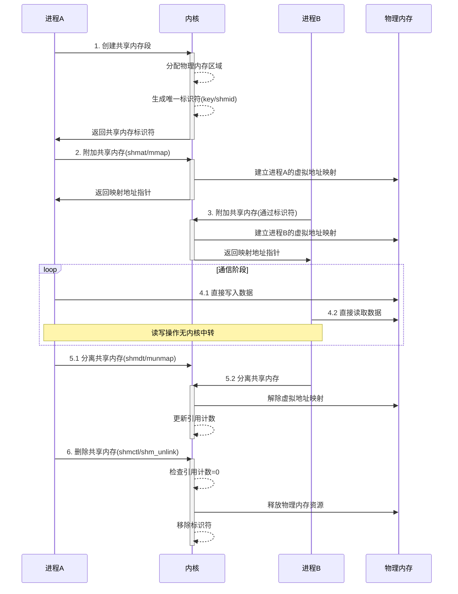
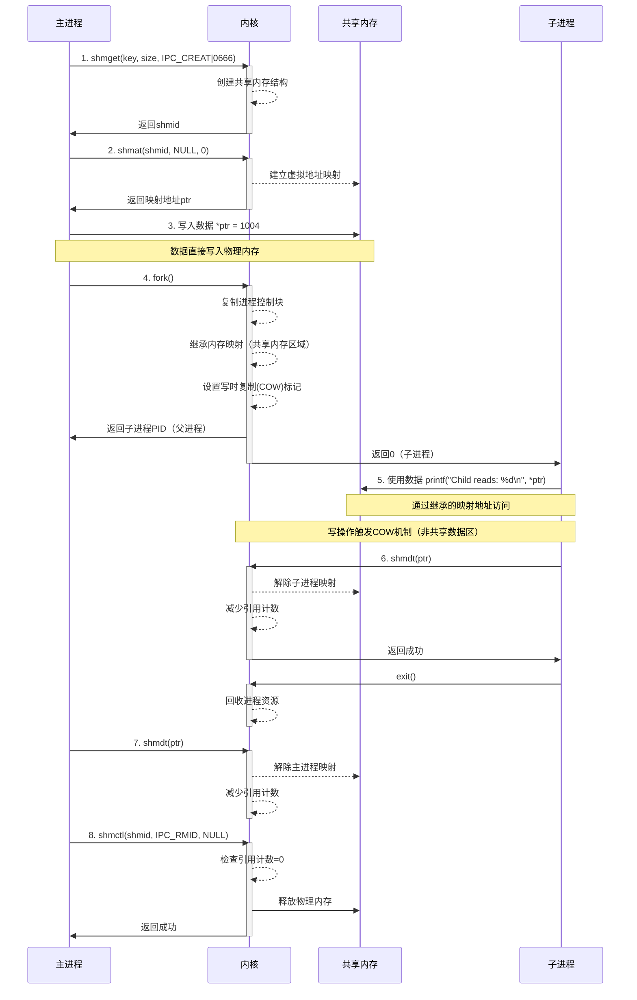
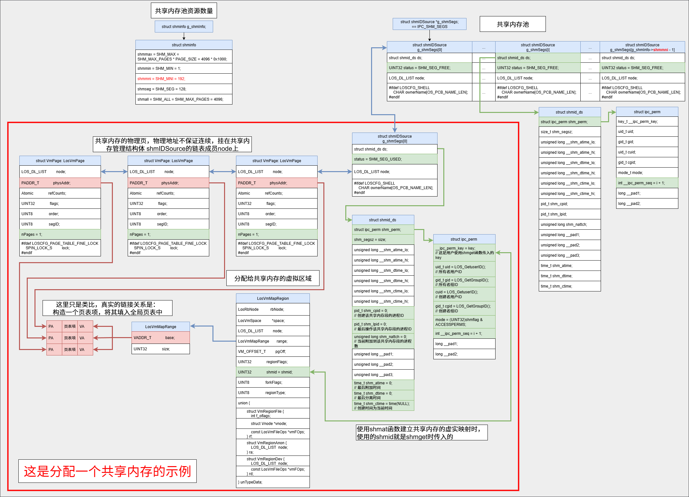

# 共享内存Shm机制与Liteos_a内核Shm机制分析

[TOC]

# 0、一句话总结

​	共享内存是一种高效的进程间通信机制，通过将同一块物理内存映射到多个进程的虚拟地址空间，实现进程间的直接数据共享，避免了数据拷贝开销，是速度最快的IPC方式。


# 1、共享内存的通用知识点

## 1.1、共享内存的概念

​	共享内存（Shared Memory）是一种进程间通信（IPC）机制，允许两个或多个进程访问同一块内存区域。 6 其核心思想是：将一份物理内存映射到不同进程各自的虚拟地址空间，使得每个进程都可以读写这片相同的物理内存。 4

关键特征：

- 直接访问 ：进程可以像访问自己的内存一样访问共享内存，无需系统调用
- 高效性 ：避免了用户态与内核态之间的数据拷贝，是最快的IPC方式 9
- 无同步机制 ：共享内存本身不提供同步控制，需要配合信号量、互斥锁等机制使用 5
- 生命周期 ：通常随内核生命周期，不会因进程结束而自动销毁 9


## 1.2、共享内存的通用结构

### 1.2.1、物理接连层面结构

```bash
物理内存
    ┌─────────────────┐
    │   共享内存区域    │ ← 同一块物理内存
    └─────────────────┘
            ↑
            │ 映射关系
	 ────────────────
	 │				│
     ↓              ↓
┌──────────┐    ┌──────────┐
│ 进程A的   │    │ 进程B的   │
│虚拟地址空间│    │虚拟地址空间│
└──────────┘    └──────────┘
```


### 1.2.2、逻辑管理结构

**内存区域（Shared Memory Region）**

- 一段连续的物理内存空间，由操作系统分配和管理。
- 大小固定（通常需按页对齐），存储进程间共享的数据。

**唯一标识符（Unique Identifier）**

- 用于全局标识共享内存（如 `key`或路径名），确保进程能定位同一资源。

**映射机制（Mapping Mechanism）**

- 进程通过虚拟地址映射将共享内存区域附加到自身地址空间，使物理内存对进程表现为普通内存地址。

**管理结构（Management Metadata）**

- 内核维护的元数据结构（如权限、引用计数、状态），用于控制共享内存的生命周期和访问权限。


## 1.3、共享内存的使用时序图

以下是共享内存通信的运行时序图，基于共享内存的核心运行流程抽象绘制（不依赖特定操作系统实现）：




### 1.3.1、关键流程说明

1、**创建阶段**
	进程A通过系统调用（如`shmget`或`shm_open`）向内核申请共享内存，内核分配物理内存并返回唯一标识符。此阶段确定内存大小和权限。

2、**映射阶段**
	进程A/B调用附加函数（如`shmat`或`mmap`），内核将同一块物理内存映射到各进程的**虚拟地址空间**。映射后进程可直接通过指针访问内存，无需内核介入。

3、**通信阶段**
进程通过映射的地址指针**直接读写物理内存**，数据立即可见。此阶段需注意：

- 无内置同步机制，需额外使用信号量/互斥锁
- 读写操作绕过内核，实现零拷贝

4、**清理阶段**

**分离**：进程主动解除映射（`shmdt`/`munmap`），内核减少引用计数

**删除**：当引用计数归零时，创建者显式删除共享内存段释放资源


### 1.3.2、核心特性

**高效性**：通信阶段完全在用户空间操作，避免数据拷贝

**生命周期**：共享内存独立于进程存在，需手动管理删除（除非配置自动回收机制如Python的引用计数）

**同步依赖**：时序图中通信阶段隐含风险，实际必须增加同步机制（如生产者-消费者模型中的信号量）


## 1.4 共享内存关键机制说明

### 1.4.1 同步机制

**无内置同步**：共享内存本身**不提供任何同步机制**，多进程并发读写可能导致数据竞态（Race Condition）。

**依赖外部同步**：需结合信号量、互斥锁等机制实现互斥访问（如写入时加锁）。


### 1.4.2 生命周期管理

**独立于进程**：共享内存的生命周期**随内核持续**，进程退出后仍存在，需显式删除或系统重启才释放。

**引用计数**：

- `shmat`（映射）增加引用计数，`shmdt`（解除映射）减少计数。
- 仅当引用计数归零且显式删除时，内存才被释放。


### 1.4.3 权限与访问控制

**权限标识**：创建时需指定读写权限（如 `0666`），类似文件权限模型。

**最小化原则**：权限应限制为仅必要进程可访问，防止未授权读写。


### 1.4.4 动态调整与兼容性

**静态分配**：传统实现（如System V）不支持动态调整大小，需预先分配。

**动态扩展**：现代实现（如POSIX）支持 `ftruncate()`动态调整内存大小。


### 1.4.5 跨平台差异

|     **特性**     |       System V       |         POSIX          |
| :--------------: | :------------------: | :--------------------: |
|   **命名方式**   |      整数 `key`      | 文件路径（如 `/shm`）  |
|   **生命周期**   | 内核级（需显式删除） | 文件系统级（可持久化） |
| **动态调整大小** |        不支持        |          支持          |
|   **适用场景**   |       传统系统       |     现代跨平台应用     |


# 2、Liteos_a内核中共享内存的实现

## 2.1、Liteos_a内核中共享内存的概念

​	Liteos_a内核中的共享内存与通用概念类似，核心原理都是分配一块物理内存，分别映射到不同进程的地址空间中，进程直接在这块内存上进行读写操作，完成进程间通信。


## 2.2、Liteos_a内核的共享内存运行机制

同上。


## 2.3、Liteos_a内核共享内存的运行流程图

同上。


## 2.4、Liteos_a内核共享内存模块的总结

​	分析到这里，可以看出Liteos_a内核完整的实现了 1.1 ~ 1.3 小节中共享内存所有的通用机制。接下来就借助Liteos_a内核的源代码继续分析，Liteos_a内核是如何通过代码将共享内存的这些机制一一实现的。


# 3、Liteos_a内核共享内存开发案例

## 3.1、接口说明

共享内存的开发接口分为 System V 方式和 Posix 方式：

* System V 方式：
  * shmget()：创建或者获取一个共享内存段。
  * shmat()：将共享内存映射到进程地址空间。
  * shmdt()：解除映射。
  * shmctl()：控制共享内存段（如删除、权限设置等）。
* Posix 方式：
  * （Liteos_a内核不支持）shm_open()：创建或打开一个共享内存对象。
  * mmap()：将共享内存对象映射到进程地址空间。
  * munmap()：解除映射。
  * （Liteos_a内核不支持）shm_unlink()：删除共享内存对象。

由于Liteos_a内核未适配 Posix 方式的共享内存开发接口，固下列示例使用System V方式。


## 3.2、开发流程

典型的开发流程：

* 1、创建共享内存：指定大小、权限、标识符
* 2、映射到进程：将共享内存映射到进程虚拟地址空间
* 3、数据读写操作：进程直接访问共享内存进行数据交换
* 4、解除映射关系：断开进程与共享内存的连接
* 5、删除共享内存：释放物理内存资源


## 3.3、编程实例

### 3.3.1、实例描述

实例流程如下：

* 1、主进程使用shmget创建共享内存。
* 2、主进程使用shmat将共享内存映射到进程地址空间。
* 3、主进程讲数据写入共享内存。
* 4、fork创建子进程，即等同于使用shmat将共享内存映射到进程地址空间。
* 5、子进程中使用共享进程中的数据。
* 6、子进程使用shmdt解除与共享内存的映射，并exit退出。
* 7、主进程使用shmdt解除与共享内存的映射。
* 8、主进程使用shmctl删除共享内存。


### 3.3.2、编程示例

```c
#include <sys/ipc.h>
#include <sys/shm.h>
#include <stdio.h>
#include <unistd.h>
#define SHM_SIZE 1024

int main() {
    int shm_id;
    int *ptr;
    pid_t pid;

    // 创建共享内存
    shm_id = shmget((key_t)1004, SHM_SIZE, IPC_CREAT | 0666);
    if (shm_id == -1) {
        perror("shmget failed");
        return 1;
    }

    // 映射到进程地址空间
    ptr = (int*)shmat(shm_id, NULL, 0);
    if (ptr == (void*)-1) {
        perror("shmat failed");
        return 1;
    }

    *ptr = 1004;  // 父进程写入数据
    printf("Parent writes: %d\n", *ptr);

    pid = fork();
    if (pid == 0) {  // 子进程读取数据
        printf("Child reads: %d\n", *ptr);
        shmdt(ptr);  // 子进程解除映射
        exit(0);
    } else {
        wait(NULL);   // 等待子进程结束
        shmdt(ptr);   // 父进程解除映射
        shmctl(shm_id, IPC_RMID, 0);  // 删除共享内存
    }
    return 0;
}

// 运行结果
[ daniel@LAPTOP-AQBS0OG2 ~/test ] ./shm_sysV
Parent writes: 1004
Child reads: 1004
[ daniel@LAPTOP-AQBS0OG2 ~/test ]
```


### 3.3.3、示例时序图




# 4、Liteos_a内核共享内存的源码分析

共享内存的开发接口分为 System V 方式和 Posix 方式：

* System V 方式：
  * shmget()：创建或者获取一个共享内存段。
  * shmat()：将共享内存映射到进程地址空间。
  * shmdt()：解除映射。
  * shmctl()：控制共享内存段（如删除、权限设置等）。
* Posix 方式：
  * （Liteos_a内核不支持）shm_open()：创建或打开一个共享内存对象。
  * mmap()：将共享内存对象映射到进程地址空间。
  * munmap()：解除映射。
  * （Liteos_a内核不支持）shm_unlink()：删除共享内存对象。

由于Liteos_a内核未适配 Posix 方式的共享内存开发接口，固下列着重介绍System V方式z宏的四种接口。


## 4.1、共享内存初始化 OsShmCBInit

在Liteos_a内核中，共享内存所使用的物理内存，是从堆内存中分配的。

```c
// kernel_liteos_a\arch\arm\arm\src\startup\reset_vector_mp.S
reset_vector --> main
// kernel_liteos_a\kernel\common\los_config.c
OsMain
    OsInitCall(LOS_INIT_LEVEL_VM_COMPLETE);
	LOS_MODULE_INIT(ShmInit, LOS_INIT_LEVEL_VM_COMPLETE);
		ShmInit
			g_shmSegs = OsShmCBInit(&IPC_SHM_SYS_VSHM_MUTEX, &IPC_SHM_INFO, 
                                    &IPC_SHM_USED_PAGE_COUNT);
```

其中 OsShmCBInit 函数：

```c
struct shmIDSource *OsShmCBInit(LosMux *sysvShmMux, struct shminfo *shmInfo, 
                                UINT32 *shmUsedPageCount)
{
    UINT32 ret;
    UINT32 i;

    if ((sysvShmMux == NULL) || (shmInfo == NULL) || (shmUsedPageCount == NULL)) {
        return NULL;
    }
	// 1、初始化共享内存的互斥锁，用于并发时得数据完整性保护
    ret = LOS_MuxInit(sysvShmMux, NULL);
    if (ret != LOS_OK) {
        goto ERROR;
    }

    // 设置共享内存的大小统计信息
    shmInfo->shmmax = SHM_MAX;
    shmInfo->shmmin = SHM_MIN;
    shmInfo->shmmni = SHM_MNI;
    shmInfo->shmseg = SHM_SEG;
    shmInfo->shmall = SHM_ALL;

    // 2、分配内存，这是从TLSF算法管理的堆内存中分配的
    struct shmIDSource *shmSegs = 
        LOS_MemAlloc((VOID *)OS_SYS_MEM_ADDR, sizeof(struct shmIDSource) * shmInfo->shmmni);
    if (shmSegs == NULL) {
        (VOID)LOS_MuxDestroy(sysvShmMux);
        goto ERROR;
    }
    (VOID)memset_s(shmSegs, (sizeof(struct shmIDSource) * shmInfo->shmmni),
                   0, (sizeof(struct shmIDSource) * shmInfo->shmmni));

    for (i = 0; i < shmInfo->shmmni; i++) {
        shmSegs[i].status = SHM_SEG_FREE;
        shmSegs[i].ds.shm_perm.seq = i + 1;
        LOS_ListInit(&shmSegs[i].node);
    }
    *shmUsedPageCount = 0;

    return shmSegs;

ERROR:
    VM_ERR("ShmInit fail\n");
    return NULL;
}
```

初始化之后，且被映射到一块虚拟内存区域上使用之后的共享内存结构如图：




## 4.2、创建/获取共享内存 shmget

```c
// third_party_musl\src\ipc\shmget.c
int shmget(key_t key, size_t size, int flag)
    syscall(SYS_shmget, key, size, flag);
    SYSCALL_HAND_DEF(__NR_shmget, SysShmGet, int, ARG_NUM_3)
    int SysShmGet(key_t key, size_t size, int shmflg)
```

其中 SysShmGet 函数：

```c
INT32 ShmGet(key_t key, size_t size, INT32 shmflg)
{
    INT32 ret;
    INT32 shmid;
	// 1、加锁，保证共享内存操作的互斥性
    SYSV_SHM_LOCK();

    // 2、如果key是 IPC_PRIVATE ，调用ShmAllocSeg创建新的共享内存段
    if (key == IPC_PRIVATE) {
        ret = ShmAllocSeg(key, size, shmflg);
    } 
	// 3、如果key不是IPC_PRIVATE先查找是否已存在key对应的共享内存段，
	else {
        // 3.1、查找是否已经存在 key 对应的共享内存段
        ret = ShmFindSegByKey(key);
        // 3.1.1、没找到
        if (ret < 0) {
            if (((UINT32)shmflg & IPC_CREAT) == 0) {
                ret = -ENOENT;
                goto ERROR;
            } else {
                // 但是指定了 IPC_CREAT 操作，调用ShmAllocSeg创建新的共享内存段
                ret = ShmAllocSeg(key, size, shmflg);
            }
        }
        // 3.1.2、找到了，今其他权限检查等等操作
        else {
            shmid = ret;
            if (((UINT32)shmflg & IPC_CREAT) &&
                ((UINT32)shmflg & IPC_EXCL)) {
                ret = -EEXIST;
                goto ERROR;
            }
            ret = ShmPermCheck(ShmFindSeg(shmid), (UINT32)shmflg & ACCESSPERMS);
            if (ret != 0) {
                ret = -ret;
                goto ERROR;
            }
            ret = ShmSegValidCheck(shmid, size, shmflg);
        }
    }
    if (ret < 0) {
        goto ERROR;
    }

    // 4、解锁
    SYSV_SHM_UNLOCK();

    // 5、返回shmid或新分配的段号
    return ret;
ERROR:
    set_errno(-ret);
    SYSV_SHM_UNLOCK();
    PRINT_DEBUG("%s %d, ret = %d\n", __FUNCTION__, __LINE__, ret);
    return -1;
}

```

其中 ShmAllocSeg 函数：

```c
STATIC INT32 ShmAllocSeg(key_t key, size_t size, INT32 shmflg)
{
    INT32 segNum = -1;
    struct shmIDSource *seg = NULL;
    size_t count;
	// 1、参数检查
    INT32 ret = ShmAllocSegCheck(key, &size, &segNum);
    if (ret < 0) {
        return ret;
    }

    // 2、获取分配到的共享内存段结构体指针
    seg = &IPC_SHM_SEGS[segNum];
    // 3、分配物理页，挂到seg->node 链表上
    //    LOS_PhysPagesAlloc函数中会分配 size >> PAGE_SHIFT 个物理页
    count = LOS_PhysPagesAlloc(size >> PAGE_SHIFT, &seg->node);
    if (count != (size >> PAGE_SHIFT)) {
        (VOID)LOS_PhysPagesFree(&seg->node);
        seg->status = SHM_SEG_FREE;
#ifdef LOSCFG_KERNEL_IPC_PLIMIT
        OsIPCLimitShmFree(size);
#endif
        return -ENOMEM;
    }

    // 4、设置共享内存的各种属性
    ShmSetSharedFlag(seg);
    IPC_SHM_USED_PAGE_COUNT += size >> PAGE_SHIFT;

    seg->status |= SHM_SEG_USED;
    seg->ds.shm_perm.mode = (UINT32)shmflg & ACCESSPERMS;
    seg->ds.shm_perm.key = key;
    seg->ds.shm_segsz = size;
    seg->ds.shm_perm.cuid = LOS_GetUserID();
    seg->ds.shm_perm.uid = LOS_GetUserID();
    seg->ds.shm_perm.cgid = LOS_GetGroupID();
    seg->ds.shm_perm.gid = LOS_GetGroupID();
    seg->ds.shm_lpid = 0;
    seg->ds.shm_nattch = 0;
    seg->ds.shm_cpid = LOS_GetCurrProcessID();
    seg->ds.shm_atime = 0;
    seg->ds.shm_dtime = 0;
    seg->ds.shm_ctime = time(NULL);
#ifdef LOSCFG_SHELL
    (VOID)memcpy_s(seg->ownerName, OS_PCB_NAME_LEN, 
                   OsCurrProcessGet()->processName, OS_PCB_NAME_LEN);
#endif

    // 5、返回分配到的共享内存段编号
    return segNum;
}
```


## 4.3、映射共享内存 shmat

```c
// third_party_musl\src\ipc\shmat.c
void *shmat(int id, const void *addr, int flag)
    return (void *)syscall(SYS_shmat, id, addr, flag);
	SYSCALL_HAND_DEF(__NR_shmat, SysShmAt, void *, ARG_NUM_3)
	void *SysShmAt(int shmid, const void *shmaddr, int shmflg)
        ret = ShmAt(shmid, shmaddr, shmflg);
```

其中 ShmAt 函数：

```c
VOID *ShmAt(INT32 shmid, const VOID *shmaddr, INT32 shmflg)
{
    INT32 ret;
    UINT32 prot = PROT_READ;
    mode_t acc_mode = SHM_S_IRUGO;
    struct shmIDSource *seg = NULL;
    LosVmMapRegion *r = NULL;

    // 1、参数检查
    ret = ShmatParamCheck(shmaddr, shmflg);
    if (ret != 0) {
        set_errno(ret);
        return (VOID *)-1;
    }

    if ((UINT32)shmflg & SHM_EXEC) {
        prot |= PROT_EXEC;
        acc_mode |= SHM_S_IXUGO;
    } else if (((UINT32)shmflg & SHM_RDONLY) == 0) {
        prot |= PROT_WRITE;
        acc_mode |= SHM_S_IWUGO;
    }

    // 2、加锁
    SYSV_SHM_LOCK();
    
    // 3、查找对应的共享内存段结构
    seg = ShmFindSeg(shmid);
    if (seg == NULL) {
        SYSV_SHM_UNLOCK();
        return (VOID *)-1;
    }

    ret = ShmPermCheck(seg, acc_mode);
    if (ret != 0) {
        goto ERROR;
    }
	// 4、当前共享内存的附加进程数量 +1
    seg->ds.shm_nattch++;
    
    // 5、分配虚拟内存映射区域
    r = ShmatVmmAlloc(seg, shmaddr, shmflg, prot);
    if (r == NULL) {
        seg->ds.shm_nattch--;
        SYSV_SHM_UNLOCK();
        return (VOID *)-1;
    }

    r->shmid = shmid;
    r->regionFlags |= VM_MAP_REGION_FLAG_SHM;
    seg->ds.shm_atime = time(NULL);
    seg->ds.shm_lpid = LOS_GetCurrProcessID();
    
    // 6、解锁
    SYSV_SHM_UNLOCK();

    // 7、返回映射的虚拟地址
    return (VOID *)(UINTPTR)r->range.base;
ERROR:
    set_errno(ret);
    SYSV_SHM_UNLOCK();
    PRINT_DEBUG("%s %d, ret = %d\n", __FUNCTION__, __LINE__, ret);
    return (VOID *)-1;
}
```

其中 ShmatVmmAlloc 函数：

```c
LosVmMapRegion*
ShmatVmmAlloc(struct shmIDSource *seg, const VOID *shmaddr, INT32 shmflg, UINT32 prot)
{
    // 1、获取当前进程的虚拟进程空间
    LosVmSpace *space = OsCurrProcessGet()->vmSpace;
    LosVmMapRegion *region = NULL;
    UINT32 flags = MAP_ANONYMOUS | MAP_SHARED;
    UINT32 mapFlags = flags | MAP_FIXED;
    VADDR_T vaddr;
    UINT32 regionFlags;
    INT32 ret;

    if (shmaddr != NULL) {
        flags |= MAP_FIXED_NOREPLACE;
    }
    regionFlags = OsCvtProtFlagsToRegionFlags(prot, flags);
    // 2、加锁保护
    (VOID)LOS_MuxAcquire(&space->regionMux);
    // 3.1、如果没有指定映射地址，自动分配一块合适的虚拟内存区域
    if (shmaddr == NULL) {
        region = LOS_RegionAlloc(space, 0, seg->ds.shm_segsz, regionFlags, 0);
    }
    // 3.2、如果指定了映射地址, 检查目标地址区间是否已被占用，除非指定了SHM_REMAP，地址区间冲突，返回EINVAL
    else {
        if ((UINT32)shmflg & SHM_RND) {
            vaddr = ROUNDDOWN((VADDR_T)(UINTPTR)shmaddr, SHMLBA);
        } else {
            vaddr = (VADDR_T)(UINTPTR)shmaddr;
        }
        if (!((UINT32)shmflg & SHM_REMAP) && (LOS_RegionFind(space, vaddr) ||
            LOS_RegionFind(space, vaddr + seg->ds.shm_segsz - 1) ||
            LOS_RegionRangeFind(space, vaddr, seg->ds.shm_segsz - 1))) {
            ret = EINVAL;
            goto ERROR;
        }
        // 如果指定了映射地址, 地址不冲突，进行实际的内存映射
        vaddr = (VADDR_T)LOS_MMap(vaddr, seg->ds.shm_segsz, prot, mapFlags, -1, 0);
        // 查找映射后的区域结构体
		region = LOS_RegionFind(space, vaddr);
    }

    if (region == NULL) {
        ret = ENOMEM;
        goto ERROR;
    }
    // 4、建立物理页与虚拟地址的映射关系
    ShmVmmMapping(space, &seg->node, region->range.base, regionFlags);
--------------------------------------------------------------------------------------------
        LOS_DL_LIST_FOR_EACH_ENTRY(vmPage, pageList, LosVmPage, node) {
            pa = VM_PAGE_TO_PHYS(vmPage);
            LOS_AtomicInc(&vmPage->refCounts);
            ret = LOS_ArchMmuMap(&space->archMmu, va, pa, 1, regionFlags);
            if (ret != 1) {
                VM_ERR("LOS_ArchMmuMap failed, ret = %d", ret);
            }
            va += PAGE_SIZE;
        }
--------------------------------------------------------------------------------------------
    // 5、解锁
    (VOID)LOS_MuxRelease(&space->regionMux);
    // 6、返回映射的虚拟内存区域结构体
    return region;
ERROR:
    set_errno(ret);
    (VOID)LOS_MuxRelease(&space->regionMux);
    return NULL;
}
```

其中 LOS_MMap 函数：

```c
VADDR_T LOS_MMap(VADDR_T vaddr, size_t len, unsigned prot, 
                 unsigned long flags, int fd, unsigned long pgoff)
{
    STATUS_T status;
    VADDR_T resultVaddr;
    UINT32 regionFlags;
    LosVmMapRegion *newRegion = NULL;
    struct file *filep = NULL;
    // 1、获取当前进程的虚拟内存空间
    LosVmSpace *vmSpace = OsCurrProcessGet()->vmSpace;

    len = ROUNDUP(len, PAGE_SIZE);
    STATUS_T checkRst = OsCheckMMapParams(&vaddr, flags, len, pgoff);
    if (checkRst != LOS_OK) {
        return checkRst;
    }

    if (LOS_IsNamedMapping(flags)) {
        status = fs_getfilep(fd, &filep);
        if (status < 0) {
            return -EBADF;
        }

        status = OsNamedMmapingPermCheck(filep, flags, prot);
        if (status < 0) {
            return status;
        }
    }

    // 2、加锁，保护虚拟内存空间的区域分配
    (VOID)LOS_MuxAcquire(&vmSpace->regionMux);
    /* user mode calls mmap to release heap physical memory without releasing heap virtual space */
	// 3、用户态调用mmap释放堆物理内存但不释放堆虚拟空间
    status = OsUserHeapFree(vmSpace, vaddr, len);
--------------------------------------------------------------------------------------------
    	 vmRegion = LOS_RegionFind(vmSpace, addr);
    		region = OsFindRegion(&vmSpace->regionRbTree, addr, 1);
                rangeKey.base = vaddr;
                rangeKey.size = len;
                if (LOS_RbGetNode(regionRbTree, (VOID *)&rangeKey, &pstRbNode)) {。。
                    ulCmpResult = pstTree->pfCmpKey(pKey, pNodeKey);
                    if (RB_EQUAL == ulCmpResult) {*ppstNode = pstX; return TRUE; }
                        // pstTree->pfCmpKey为OsRegionRbCmpKeyFn：
                        // 1、OsRegionRbCmpKeyFn函数中是只要这个地址和红黑树中的一个节点对应虚拟内存区域是包含和被包含的关系，就判断mmap传入的地址是在用户态堆内存当中的。
                        // 2、包含和被包含意思为：[sA1   [sA2, sE2]    sE1] 或者 [sA2   [sA1, sE1]    sE2]
                        // 3、所以在LOS_RegionFind当中将传入的虚拟地址长度设置为1即可，因为只需要判断这个地址在一个虚拟区域当中即可。
--------------------------------------------------------------------------------------------
    if (status == LOS_OK) {
        resultVaddr = vaddr;
        goto MMAP_DONE;
    }

    regionFlags = OsCvtProtFlagsToRegionFlags(prot, flags);
    // 4、分配新的虚拟内存区域
    newRegion = LOS_RegionAlloc(vmSpace, vaddr, len, regionFlags, pgoff);
    if (newRegion == NULL) {
        resultVaddr = (VADDR_T)-ENOMEM;
        goto MMAP_DONE;
    }
    newRegion->regionFlags |= VM_MAP_REGION_FLAG_MMAP;
    resultVaddr = newRegion->range.base;

    // 5.1、文件映射，建立文件与区域的映射关系
    if (LOS_IsNamedMapping(flags)) {
        status = OsNamedMMap(filep, newRegion);
--------------------------------------------------------------------------------------------
            if (filep->ops != NULL && filep->ops->mmap != NULL) {
                if (vnode->type == VNODE_TYPE_CHR || vnode->type == VNODE_TYPE_BLK) {
                    LOS_SetRegionTypeDev(region);
                } else {
                    LOS_SetRegionTypeFile(region);
                }
                // 调用具体文件系统的映射函数
				// 比如Fatfs：里面是做一个标记，记录这个filep和region是有关系的
                int ret = filep->ops->mmap(filep, region);
                if (ret != LOS_OK) {
                    file_release(filep);
                    return LOS_ERRNO_VM_MAP_FAILED;
                }
            } else {
                VM_ERR("mmap file type unknown");
                file_release(filep);
                return LOS_ERRNO_VM_MAP_FAILED;
            }
--------------------------------------------------------------------------------------------
    }
    // 5.2、匿名映射，设置区域类型 
    else {
        status = OsAnonMMap(newRegion);
--------------------------------------------------------------------------------------------
        	LOS_SetRegionTypeAnon(region);
        		// 设置这个内存区域的类型
        		region->regionType = VM_MAP_REGION_TYPE_ANON;
--------------------------------------------------------------------------------------------
    }

    if (status != LOS_OK) {
        LOS_RbDelNode(&vmSpace->regionRbTree, &newRegion->rbNode);
        LOS_RegionFree(vmSpace, newRegion);
        resultVaddr = (VADDR_T)-ENOMEM;
        goto MMAP_DONE;
    }

MMAP_DONE:
    // 6、解锁
    (VOID)LOS_MuxRelease(&vmSpace->regionMux);
    // 7、返回分配到的虚拟地址或错误码
    return resultVaddr;
}
```


## 4.4、解除共享内存映射 shmdt

```c
// third_party_musl\src\ipc\shmdt.c
int shmdt(const void *addr)
	syscall(SYS_shmdt, addr);
	SYSCALL_HAND_DEF(__NR_shmdt, SysShmDt, int, ARG_NUM_1)
	int SysShmDt(const void *shmaddr)
        ret = ShmDt(shmaddr);
```

其中 ShmDt 函数：

```c
INT32 ShmDt(const VOID *shmaddr)
{
    // 1) 获取当前进程的虚拟内存空间
    LosVmSpace *space = OsCurrProcessGet()->vmSpace;
    struct shmIDSource *seg = NULL;
    LosVmMapRegion *region = NULL;
    INT32 shmid;
    INT32 ret;

    if (IS_PAGE_ALIGNED(shmaddr) == 0) {
        ret = EINVAL;
        goto ERROR;
    }

    // 2) 加锁，保护虚拟内存空间
    (VOID)LOS_MuxAcquire(&space->regionMux);
    // 3) 查找对应的虚拟内存区域
    region = LOS_RegionFind(space, (VADDR_T)(UINTPTR)shmaddr);
    if ((region == NULL) || !OsIsShmRegion(region)) {
        ret = EINVAL;
        goto ERROR_WITH_LOCK;
    }
    // 4) 获取共享内存段ID
    shmid = region->shmid;

    if (region->range.base != (VADDR_T)(UINTPTR)shmaddr) {
        ret = EINVAL;
        goto ERROR_WITH_LOCK;
    }

    /* remove it from aspace */
    // 5) 从地址空间中移除该区域
    // 5.1) 从红黑树中删除该区域节点
    LOS_RbDelNode(&space->regionRbTree, &region->rbNode);
	// 5.2) 解除MMU映射
    LOS_ArchMmuUnmap(&space->archMmu, region->range.base, region->range.size >> PAGE_SHIFT);
	// 6) 解锁
    (VOID)LOS_MuxRelease(&space->regionMux);
    /* free it */
    // 7) 释放区域结构体
    free(region);

    // 8) 加锁，保护共享内存段
    SYSV_SHM_LOCK();
	// 9) 查找共享内存段结构体
    seg = ShmFindSeg(shmid);
    if (seg == NULL) {
        ret = EINVAL;
        SYSV_SHM_UNLOCK();
        goto ERROR;
    }
	// 10) 递减物理页的引用计数
    ShmPagesRefDec(seg);
    // 11) 当前附加到该段的进程数减1
    seg->ds.shm_nattch--;
    if ((seg->ds.shm_nattch <= 0) &&
        (seg->status & SHM_SEG_REMOVE)) {
		// 11.1) 如果没有进程附加且标记为删除, 释放共享内存段
        ShmFreeSeg(seg, &IPC_SHM_USED_PAGE_COUNT);
    } else {
        seg->ds.shm_dtime = time(NULL);
        seg->ds.shm_lpid = LOS_GetCurrProcessID();
    }
    // 12) 解锁
    SYSV_SHM_UNLOCK();

    // 13) 成功返回0
    return 0;

ERROR_WITH_LOCK:
    (VOID)LOS_MuxRelease(&space->regionMux);
ERROR:
    set_errno(ret);
    PRINT_DEBUG("%s %d, ret = %d\n", __FUNCTION__, __LINE__, ret);
    return -1;
}
```


## 4.5、控制共享内存 shmctl

```c
// third_party_musl\src\ipc\shmctl.c
int shmctl(int id, int cmd, struct shmid_ds *buf)
	__syscall(SYS_shmctl, id, IPC_CMD(cmd), buf);
	SYSCALL_HAND_DEF(__NR_shmctl, SysShmCtl, int, ARG_NUM_3)
	int SysShmCtl(int shmid, int cmd, struct shmid_ds *buf)
        ret = ShmCtl(shmid, cmd, buf);
```

其中 ShmCtl 函数：

```c
INT32 ShmCtl(INT32 shmid, INT32 cmd, struct shmid_ds *buf)
{
    struct shmIDSource *seg = NULL;
    INT32 ret = 0;
    struct shm_info shmInfo = { 0 };
    struct ipc_perm shm_perm;

    // 1) 获取共享内存段状态
    cmd = ((UINT32)cmd & ~IPC_64);

    // 加锁
    SYSV_SHM_LOCK();

    // 2) 设置共享内存段权限等信息
    if ((cmd != IPC_INFO) && (cmd != SHM_INFO)) {
        seg = ShmFindSeg(shmid);
        if (seg == NULL) {
            SYSV_SHM_UNLOCK();
            return -1;
        }
    }

    if ((buf == NULL) && (cmd != IPC_RMID)) {
        ret = EINVAL;
        goto ERROR;
    }

    switch (cmd) {
        case IPC_STAT:
		...
        // 3) 删除共享内存段 
        case IPC_RMID:
            ret = ShmPermCheck(seg, SHM_M);
            if (ret != 0) {
                ret = EPERM;
                goto ERROR;
            }

            seg->status |= SHM_SEG_REMOVE;
            // 没有进程附加时立即释放
            if (seg->ds.shm_nattch <= 0) {
                ShmFreeSeg(seg, &IPC_SHM_USED_PAGE_COUNT);
----------------------------------------------------------------------------------------------
					count = LOS_PhysPagesFree(&seg->node);
                        LOS_DL_LIST_FOR_EACH_ENTRY_SAFE(page, nPage, list, LosVmPage, node) {
                            LOS_ListDelete(&page->node);
                            if (LOS_AtomicDecRet(&page->refCounts) <= 0) {
                                seg = &g_vmPhysSeg[page->segID];
                                LOS_SpinLockSave(&seg->freeListLock, &intSave);
                                // 1、先按照页面对应物理地址能够释放的最大的阶数释放页面
                                // 2、剩余页面也按照从大到小的阶数 进行释放
                                OsVmPhysPagesFreeContiguous(page, ONE_PAGE);
                                LOS_AtomicSet(&page->refCounts, 0);
                                LOS_SpinUnlockRestore(&seg->freeListLock, intSave);
                            }
                            count++;
                        }
----------------------------------------------------------------------------------------------
            }
            break;
        case IPC_INFO:
		...
    }

    SYSV_SHM_UNLOCK();
    return ret;

ERROR:
    set_errno(ret);
    SYSV_SHM_UNLOCK();
    PRINT_DEBUG("%s %d, ret = %d\n", __FUNCTION__, __LINE__, ret);
    return -1;
}
```


# 5、对共享内存机制的思考

## 5.1、OH工程项目中哪些地方使用到共享内存

**内核层面的System V共享内存**：
- `kernel_liteos_a\kernel\base\vm\shm.c`实现了完整的System V IPC共享内存机制
- 支持shmget、shmat、shmdt、shmctl等标准接口
- 提供了共享内存段的创建、映射、分离和控制功能

**HDF驱动框架中的共享内存队列(SMQ)**：

- `drivers_hdf_core\interfaces\inner_api\hdi\base\hdi_smq_meta.h`定义了SharedMemQueueMeta模板类
- 基于ashmem实现的高性能共享内存队列，用于驱动与用户态的数据传输
- 支持同步和异步两种通信模式

**HDF框架的共享内存工具**：
- `drivers_hdf_core\interfaces\inner_api\utils\shared_mem.h`和`drivers_hdf_core\adapter\uhdf2\utils\src\shared_mem.cpp`封装了ashmem接口
- 提供SharedMemCreate、SharedMemSetProt、SharedMemGetSize等便捷接口

**容器和进程间通信**：

- `kernel_liteos_a\kernel\extended\container\los_ipc_container.c`中的IPC容器管理
- 支持进程fork时的共享内存继承和隔离

**测试和验证场景**：

- 大量的单元测试用例验证共享内存功能的正确性
- 包括基本功能测试、容器隔离测试、进程限制测试等


## 5.2、这些地方为什么要使用共享内存

**高性能数据传输需求**：
- HDF驱动框架需要在内核态驱动和用户态应用之间进行大量数据交换
- 传统的read/write系统调用需要数据拷贝，性能开销大
- 共享内存提供零拷贝的数据传输方式

**进程间通信的效率要求**：
- 系统中多个进程需要共享大块数据
- 消息队列和管道不适合传输大量数据
- 共享内存是最快的IPC机制

**驱动框架的架构需求**：
- OHOS采用微内核架构，驱动运行在用户态
- 需要高效的内核-用户态通信机制
- 共享内存队列提供了理想的解决方案

**标准兼容性要求**：

- 需要支持POSIX标准的System V IPC接口
- 保证应用程序的可移植性


## 5.3、在这些地方使用共享内存带来哪些好处

**性能优势**：

- 零拷贝数据传输，避免了内核态和用户态之间的数据拷贝开销
- 直接内存访问，读写速度接近本地内存访问
- 减少系统调用次数，降低上下文切换开销

**高吞吐量**：

- 支持大块数据的高速传输
- 特别适合音视频、图像等大数据量的处理场景
- SMQ机制支持批量数据传输

**灵活性**：
- 支持多进程同时访问同一块共享内存
- 可以实现复杂的数据结构共享
- 支持动态大小调整

**标准化**：
- 遵循POSIX标准，保证了代码的可移植性
- 提供了完整的权限控制机制
- 支持标准的IPC操作接口

**架构优势**：
- 支持微内核架构下的高效通信
- 为HDF驱动框架提供了理想的数据传输机制
- 支持容器化和进程隔离


## 5.4、在这些地方使用共享内存带来哪些坏处

**同步复杂性**：
- 共享内存本身不提供同步机制，需要额外的信号量、互斥锁等
- 容易出现竞态条件和数据不一致问题
- 调试和排错困难

**内存管理复杂**：
- 需要精确控制共享内存的生命周期
- 内存泄漏风险较高，特别是在进程异常退出时
- 需要实现复杂的引用计数和清理机制

**安全风险**：
- 进程间可以直接访问共享数据，存在数据被恶意修改的风险
- 权限控制相对复杂
- 缓冲区溢出可能影响多个进程

**系统资源消耗**：
- 占用物理内存资源，特别是大块共享内存
- 需要额外的内核数据结构来管理共享内存段
- 可能导致内存碎片化

**调试困难**：

- 多进程并发访问使得问题重现困难
- 内存状态难以跟踪和调试
- 错误定位复杂


## 5.5、有坏处为什么还要使用

**性能收益远大于复杂性成本**：
- 在高性能要求的场景下，共享内存带来的性能提升是其他IPC机制无法比拟的
- 特别是在音视频处理、图像处理等大数据量场景中，性能优势明显

**架构必然选择**：

- HDF驱动框架的设计理念要求驱动运行在用户态，共享内存是最佳选择

**成熟的解决方案**：
- 通过完善的设计模式和最佳实践可以有效控制复杂性
- 框架层面提供了封装良好的接口，降低了使用难度
- 丰富的测试用例保证了稳定性

**标准化要求**：
- 需要支持POSIX标准，保证系统的兼容性
- 为上层应用提供标准的IPC接口

**技术发展趋势**：
- 现代操作系统普遍采用共享内存作为高性能IPC机制
- 硬件性能的提升使得内存访问成为瓶颈，共享内存的优势更加明显


## 5.6、如何在工程中取舍

**场景驱动的选择策略**：
- 大数据量传输：优先选择共享内存
- 简单消息传递：使用消息队列或管道
- 实时性要求高：使用共享内存+信号量组合
- 安全性要求高：谨慎使用，加强权限控制

**分层设计原则**：

- 底层提供高性能的共享内存机制
- 中间层封装同步和管理逻辑
- 上层提供简单易用的接口

**资源控制策略**：
- 实施进程级别的共享内存使用限制
- 通过`kernel_liteos_a\kernel\extended\plimit\los_ipclimit.c`等机制控制资源使用
- 定期清理无用的共享内存段

**安全加固措施**：

- 严格的权限检查和访问控制
- 数据完整性校验
- 异常处理和恢复机制

**开发和维护策略**：
- 提供完善的调试工具和日志机制
- 建立标准的开发规范和最佳实践
- 持续的测试和验证


## 5.7、总结

​	共享内存在OHOS项目中扮演着关键角色，特别是在HDF驱动框架和高性能IPC场景中。虽然共享内存带来了同步复杂性、内存管理复杂性等挑战，但其在性能、吞吐量和架构适配方面的优势使其成为不可替代的技术选择。

​	通过合理的架构设计、完善的封装机制、严格的资源控制和安全措施，可以有效地管理共享内存的复杂性，充分发挥其性能优势。在实际工程中，需要根据具体的应用场景、性能要求和安全需求来权衡选择，采用分层设计和场景驱动的策略，确保系统的高性能、稳定性和安全性。

​	共享内存机制的成功应用体现了OHOS在系统架构设计上的前瞻性和技术先进性，为构建高性能、可扩展的操作系统奠定了坚实基础。

