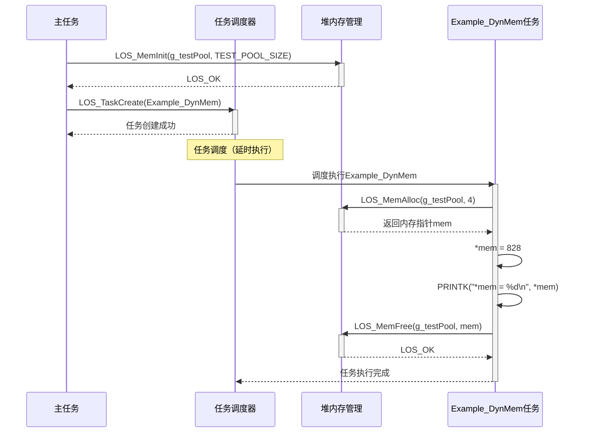
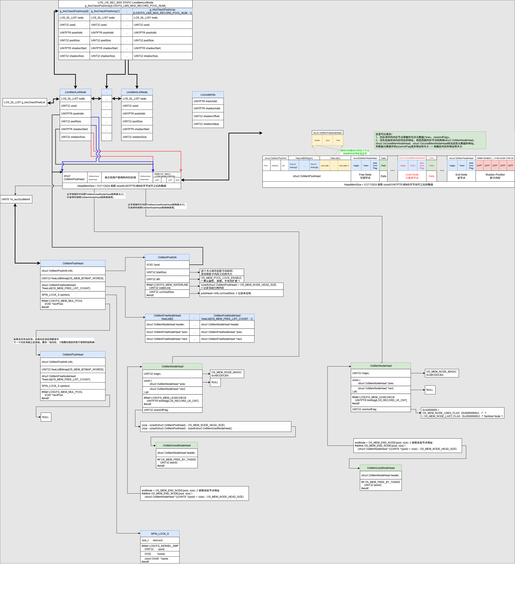
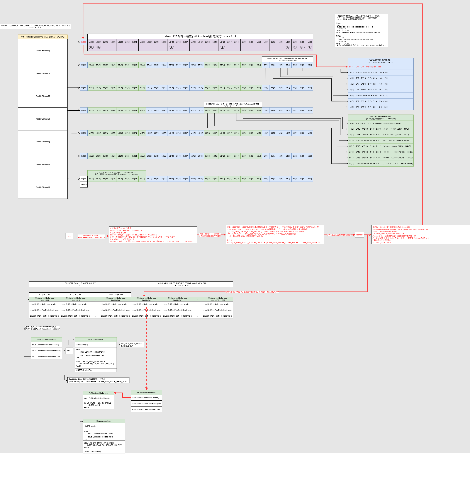
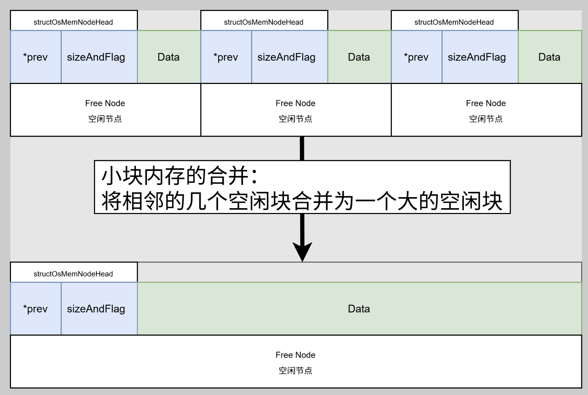

# 堆内存与Liteos_a内核堆内存TLSF机制分析

[TOC]

# 0、一句话总结

堆内存是操作系统或运行时环境管理的一块**动态分配内存区域**，通过内存管理器以块为单位按需分配和释放，核心机制包括**空闲块组织**、**碎片优化**和**分配策略**。

TLSF（Two-Level Segregated Fit）算法通过**两级位图索引**（快速定位空闲块）和**分级空闲链表**（按大小隔离管理），在保证实时性的同时显著降低碎片。


# 1、堆内存的通用知识点

## 1.1、堆内存的概念

**堆内存（Heap Memory）** 是程序运行时动态分配的内存空间，与静态内存（编译时固定）和栈内存（自动管理）并列。核心特征：

- **动态性**：生命周期由开发者控制（手动分配/释放）
- **无序性**：分配的内存块在地址空间非连续
- **按需分配**：支持任意大小的内存请求（需字节对齐）
- **全局性**：通常进程内所有线程共享

本质：**内存资源池**，提供灵活的内存使用能力，代价是潜在碎片和分配开销。


## 1.2、堆内存的通用结构

所有堆内存系统均包含三层抽象结构：

```
+-----------------------+
                              |     内存管理器          | <-- 核心控制逻辑
                              +----------+------------+
                                         |
              +--------------------------+--------------------------+
              |                          |                          |
+-------------+------------+ +-----------+-----------+ +------------+-----------+
|  空闲块索引结构           |  |   已分配块元数据        | |   用户数据区域          |
| (如：位图/链表/树)        |  | (块大小、状态标记等)     | | (返回给用户的指针)       |
+---------------------------+ +-----------------------+ +------------------------+
          ▲                            ▲                          ▲
          |                            |                          |
+---------+---------+         +---------+---------+      +--------+--------+
|   空闲内存块链表    |         |   已分配内存块      |      | 实际存储的用户数据 |
| 1 → 3 → 7 → ...   |         | (含隐藏管理头)      |      | (如数组、结构体)   |
+-------------------+         +-------------------+      +-------------------+
```


**核心组件说明：**

| **组件**           | **作用**                                           | **通用实现**                            |
| ------------------ | -------------------------------------------------- | --------------------------------------- |
| **内存管理器**     | 总控逻辑：处理分配/释放请求                        | `malloc`/`free`等接口实现层             |
| **空闲块索引结构** | 快速查找可用内存块                                 | 空闲链表、位图、TLSF分级位图            |
| **块元数据**       | 隐藏在每个块头部，记录块大小、分配状态、前后块关系 | 通常8-16字节的隐藏头（如`size\|flags`） |
| **用户数据区域**   | 返回给程序使用的内存地址                           | 元数据头之后的首地址                    |
| **哨兵节点**       | 标记堆的起始和结束，避免边界错误                   | 特殊标记值（如`0xDEADBEEF`）            |


## 1.3、堆内存关键机制说明

### 1.3.1 空闲块组织机制

**目标**：快速定位满足请求的空闲块

- **空闲链表（Free List）**
  - 单向链表：简单但查找效率O(n)
  - 双向链表：支持快速块合并
  - **分离空闲链表**：按块大小分级（如<32B, 32-64B, ...），提升搜索效率
- **位图索引（Bitmap）**
  - 用比特位标记块状态（0空闲/1占用）
  - 适用场景：固定大小块分配（如页式分配器）
- **树结构**
  - 红黑树：按块大小排序，支持O(log n)查找
  - **TLSF（Two-Level Segregate Fit）**：
    - 第一级：按2^n大小分区（如128B-256B）
    - 第二级：每区间分8个子链表
    - *优势*：O(1)分配复杂度，实时系统首选


### 1.3.2 碎片优化机制

| **碎片类型** | **成因**                       | **解决方案**                                                 |
| ------------ | ------------------------------ | ------------------------------------------------------------ |
| **外部碎片** | 空闲块分散，无法合并满足大请求 | ▶ **块合并（Coalescing）**：释放时合并相邻空闲块 ▶ **分割（Splitting）**：大块拆分为需求块+新空闲块 |
| **内部碎片** | 分配块大于请求大小             | ▶ **精确匹配策略**（如Best Fit） ▶ **对齐优化**（按8/16字节对齐减少填充） |


### 1.3.3 分配策略机制

| **策略**      | **原理**                   | **优劣**                                |
| ------------- | -------------------------- | --------------------------------------- |
| **First Fit** | 选择第一个足够大的空闲块   | ✅ 分配快 ❌ 易产生外部碎片               |
| **Best Fit**  | 选择能满足需求的最小空闲块 | ✅ 减少内部碎片 ❌ 搜索开销大，易留小碎片 |
| **Worst Fit** | 选择最大的空闲块           | ✅ 避免小碎片 ❌ 破坏大块连续性           |
| **Next Fit**  | 从上次查找位置继续搜索     | ✅ 平均分配速度优化 ❌ 碎片分布不均       |


### 1.3.4 安全保护机制

- **边界标记（Boundary Tags）**

  块头尾存储魔数（Magic Number），检测越界写：

  ```
  struct BlockHeader {
      size_t size;          // 块大小
      uint32_t magic;       // 魔数（如0xABCD1234）
      BlockHeader* prev;    // 前驱块（合并用）
  };
  ```

- **双向链表校验**

  释放时检查：`prev->next == current && next->prev == current`

- **惰性释放（Lazy Free）**

  释放后填充特殊值（如`0xDEADBEEF`），检测Use-After-Free错误


## 1.4、堆内存的通用本质的总结

堆内存管理是**时空效率的权衡艺术**：

- **时间效率**：通过索引结构（链表/树/位图）加速分配

- **空间效率**：通过碎片优化机制提高内存利用率

- **安全防护**：元数据校验保障操作可靠性

  其设计直接影响系统性能（如实时性、吞吐量）和稳定性（内存安全）。


# 2、Liteos_a内核中堆内存的实现

## 2.1、Liteos_a内核中堆内存的概念

​	内存管理模块管理系统的内存资源，它是操作系统的核心模块之一，主要包括内存的初始化、分配以及释放。Liteos_a内核的堆内存管理提供内存初始化、分配、释放等功能。在系统运行过程中，堆内存管理模块通过对内存的申请/释放来管理用户和OS对内存的使用，使内存的利用率和使用效率达到最优，同时最大限度地解决系统的内存碎片问题。


## 2.2、Liteos_a内核堆内存运行机制

​	堆内存管理，即在内存资源充足的情况下，根据用户需求，从系统配置的一块比较大的连续内存（内存池，也是堆内存）中分配任意大小的内存块。当用户不需要该内存块时，又可以释放回系统供下一次使用。与静态内存相比，动态内存管理的优点是按需分配，缺点是内存池中容易出现碎片。Liteos_a内核的堆内存在TLSF算法的基础上，对区间的划分进行了优化，获得更优的性能，降低了碎片率。动态内存核心算法框图如下：


​	根据空闲内存块的大小，使用多个空闲链表来管理。根据内存空闲块大小分为两个部分：[4, 127]和[27, 231]，如上图size class所示：

* 1、对[4,127]区间的内存进行等分，如上图下半部分所示，分为31个小区间，每个小区间对应内存块大小为4字节的倍数。每个小区间对应一个空闲内存链表和用于标记对应空闲内存链表是否为空的一个比特位，值为1时，空闲链表非空。[4,127]区间的31个小区间内存对应31个比特位进行标记链表是否为空。

* 2、大于127字节的空闲内存块，按照2的次幂区间大小进行空闲链表管理。总共分为24个小区间，每个小区间又等分为8个二级小区间，见上图上半部分的Size Class和Size SubClass部分。每个二级小区间对应一个空闲链表和用于标记对应空闲内存链表是否为空的一个比特位。总共24*8=192个二级小区间，对应192个空闲链表和192个比特位进行标记链表是否为空。

​	例如，当有40字节的空闲内存需要插入空闲链表时，对应小区间[40,43]，第10个空闲链表，位图标记的第10比特位。把40字节的空闲内存挂载第10个空闲链表上，并判断是否需要更新位图标记。当需要申请40字节的内存时，根据位图标记获取存在满足申请大小的内存块的空闲链表，从空闲链表上获取空闲内存节点。如果分配的节点大于需要申请的内存大小，进行分割节点操作，剩余的节点重新挂载到相应的空闲链表上。当有580字节的空闲内存需要插入空闲链表时，对应二级小区间[2^9,2^9+2^6]，第31+2*8=47个空闲链表，并使用位图的第47个比特位来标记链表是否为空。把580字节的空闲内存挂载第47个空闲链表上，并判断是否需要更新位图标记。当需要申请580字节的内存时，根据位图标记获取存在满足申请大小的内存块的空闲链表，从空闲链表上获取空闲内存节点。如果分配的节点大于需要申请的内存大小，进行分割节点操作，剩余的节点重新挂载到相应的空闲链表上。如果对应的空闲链表为空，则向更大的内存区间去查询是否有满足条件的空闲链表，实际计算时，会一次性查找到满足申请大小的空闲链表。

内存管理结构如下图所示：


- 内存池池头部分 内存池池头部分包含内存池信息、位图标记数组和空闲链表数组。内存池信息包含内存池起始地址及堆区域总大小，内存池属性。位图标记数组有7个32位无符号整数组成，每个比特位标记对应的空闲链表是否挂载空闲内存块节点。空闲内存链表包含223个空闲内存头节点信息，每个空闲内存头节点信息维护内存节点头和空闲链表中的前驱、后继空闲内存节点。
- 内存池节点部分 包含3种类型节点：未使用空闲内存节点，已使用内存节点和尾节点。每个内存节点维护一个前序指针，指向内存池中上一个内存节点，还维护内存节点的大小和使用标记。空闲内存节点和已使用内存节点后面的内存区域是数据域，尾节点没有数据域。


## 2.4、Liteos_a内核堆内存模块的总结

分析到这里，可以看出Liteos_a内核完整的实现了 1.1 ~ 1.3 小节中堆内存所有的通用机制。接下来就借助Liteos_a内核的源代码继续分析，Liteos_a内核是如何通过代码将堆内存的这些机制一一实现的。


# 3、Liteos_a内核堆内存开发案例

## 3.1、使用场景

​	堆内存管理的主要工作是动态分配并管理用户申请到的内存区间，主要用于用户需要使用大小不等的内存块的场景，当用户需要使用内存时，可以通过操作系统的动态内存申请函数索取指定大小的内存块。一旦使用完毕，通过内存释放函数释放所占用内存，使之可以重复使用。


## 3.2、接口说明

| 功能分类               | 接口描述                                                     |
| ---------------------- | ------------------------------------------------------------ |
| 初始化和删除内存池     | - LOS_MemInit：初始化一块指定的动态内存池，大小为size <br />- LOS_MemDeInit：删除指定内存池，仅打开LOSCFG_MEM_MUL_POOL时有效 |
| 申请、释放动态内存     | - LOS_MemAlloc：从指定动态内存池中申请size长度的内存 <br />- LOS_MemFree：释放从指定动态内存中申请的内存 <br />- LOS_MemRealloc： - 按size大小重新分配内存块，并将原内存块内容拷贝到新内存块。如果新内存块申请成功，则释放原内存块 <br />- LOS_MemAllocAlign：从指定动态内存池中申请长度为size且地址按boundary字节对齐的内存 |
| 获取内存池信息         | - LOS_MemPoolSizeGet：获取指定动态内存池的总大小 <br />- LOS_MemTotalUsedGet：获取指定动态内存池的总使用量大小 <br />- LOS_MemInfoGet：获取指定内存池的内存结构信息，包括空闲内存大小、已使用内存大小、空闲内存块数量、已使用的内存块数量、最大的空闲内存块大小 <br />- LOS_MemPoolList：打印系统中已初始化的所有内存池，包括内存池的起始地址、内存池大小、空闲内存总大小、已使用内存总大小、最大的空闲内存块大小、空闲内存块数量、已使用的内存块数量。仅打开LOSCFG_MEM_MUL_POOL时有效 |
| 获取内存块信息         | - LOS_MemFreeNodeShow：打印指定内存池的空闲内存块的大小及数量 |
| 检查指定内存池的完整性 | - LOS_MemIntegrityCheck：对指定内存池做完整性检查，仅打开LOSCFG_BASE_MEM_NODE_INTEGRITY_CHECK时有效 |

说明：

- 由于动态内存管理需要管理控制块数据结构来管理内存，这些数据结构会额外消耗内存，故实际用户可使用内存总量小于配置项OS_SYS_MEM_SIZE的大小。
- 对齐分配内存接口LOS_MemAllocAlign/LOS_MemMallocAlign因为要进行地址对齐，可能会额外消耗部分内存，故存在一些遗失内存，当系统释放该对齐内存时，同时回收由于对齐导致的遗失内存。


## 3.3、开发流程

使用动态内存的典型场景开发流程：

* 1、初始化LOS_MemInit。 初始一个内存池后生成一个内存池控制头、尾节点EndNode，剩余的内存被标记为FreeNode内存节点。注：EndNode作为内存池末尾的节点，size为0。

* 2、请任意大小的动态内存LOS_MemAlloc。 判断动态内存池中是否存在大于申请量大小的空闲内存块空间，若存在，则划出一块内存块，以指针形式返回，若不存在，返回NULL。如果空闲内存块大于申请量，需要对内存块进行分割，剩余的部分作为空闲内存块挂载到空闲内存链表上。

* 3、释放动态内存LOS_MemFree。 回收内存块，供下一次使用。调用LOS_MemFree释放内存块，则会回收内存块，并且将其标记为FreeNode。在回收内存块时，相邻的FreeNode会自动合并。


## 3.4、编程实例

### 3.4.1、实例描述

本实例执行以下步骤：

* 1、初始化一个动态内存池。
* 2、从动态内存池中申请一个内存块。
* 3、在内存块中存放一个数据。
* 4、打印出内存块中的数据。
* 5、释放该内存块。


### 3.4.2、编程示例

```c
#include "los_memory.h"

#define TEST_POOL_SIZE (2*1024*1024)
__attribute__((aligned(4))) UINT8 g_testPool[TEST_POOL_SIZE];

VOID Example_DynMem(VOID)
{
    UINT32 *mem = NULL;
    UINT32 ret;

    /*初始化内存池*/
    ret = LOS_MemInit(g_testPool, TEST_POOL_SIZE);
    if (LOS_OK  == ret) {
        printf("Mem init success!\n");
    } else {
        printf("Mem init failed!\n");
        return;
    }

    /*分配内存*/
    mem = (UINT32 *)LOS_MemAlloc(g_testPool, 4);
    if (NULL == mem) {
        printf("Mem alloc failed!\n");
        return;
    }
    printf("Mem alloc success!\n");

    /*赋值*/
    *mem = 828;
    printf("*mem = %d\n", *mem);

    /*释放内存*/
    ret = LOS_MemFree(g_testPool, mem);
    if (LOS_OK == ret) {
        printf("Mem free success!\n");
    } else {
        printf("Mem free failed!\n");
    }

    return;
}
UINT32 ExampleDynMemEntry(VOID) 
{     
    UINT32 ret;     
    TSK_INIT_PARAM_S initParam = {0};
    initParam.pfnTaskEntry = (TSK_ENTRY_FUNC)Example_DynMem;
    initParam.usTaskPrio = 10; 
    initParam.pcName = "Example_DynMem";
    initParam.uwStackSize = LOSCFG_BASE_CORE_TSK_DEFAULT_STACK_SIZE;
    initParam.uwResved   = LOS_TASK_STATUS_DETACHED;

    /* 创建高优先级任务，由于锁任务调度，任务创建成功后不会马上执行 */
    ret = LOS_TaskCreate(&g_taskHiID, &initParam);
    if (ret != LOS_OK) {
        LOS_TaskUnlock();
        PRINTK("Example_DynMem create Failed! ret=%d\n", ret);
        return LOS_NOK;
    }      
    PRINTK("Example_DynMem create Success!\n");
    while(1){};
    return LOS_OK;
}
```

输出结果如下：

```bash
Mem init success!
Mem alloc success!
*mem = 828
Mem free success!
```


### 3.4.3、示例时序图




# 4、Liteos_a内核堆内存的源码分析

## 4.1、初始化内存池 LOS_MemInit

初始化之后的内存池：



内存池中的空闲节点链表 和 位图：



合并相邻空闲节点：



代码：

```c
UINT32 LOS_MemInit(VOID *pool, UINT32 size)
{
    if ((pool == NULL) || (size <= OS_MEM_MIN_POOL_SIZE)) {
        return OS_ERROR;
    }

    size = OS_MEM_ALIGN(size, OS_MEM_ALIGN_SIZE);
    if (OsMemPoolInit(pool, size)) {
        return OS_ERROR;
    }

#ifdef LOSCFG_MEM_MUL_POOL
    if (OsMemPoolAdd(pool, size)) {
        (VOID)OsMemPoolDeInit(pool, size);
        return OS_ERROR;
    }
#endif

    OsHookCall(LOS_HOOK_TYPE_MEM_INIT, pool, size);
    return LOS_OK;
}
```

其中 OsMemPoolInit 函数：

```c
STATIC UINT32 OsMemPoolInit(VOID *pool, UINT32 size)
{
    // 1、获取内存池的头部
    // 将pool指针转换为内存池头部结构体指针
    struct OsMemPoolHead *poolHead = (struct OsMemPoolHead *)pool;
    struct OsMemNodeHead *newNode = NULL;
    struct OsMemNodeHead *endNode = NULL;

    (VOID)memset_s(poolHead, sizeof(struct OsMemPoolHead), 0, sizeof(struct OsMemPoolHead));

#ifdef LOSCFG_KERNEL_LMS
    UINT32 resize = 0;
    if (g_lms != NULL) {
        /*
         * resize == 0, shadow memory init failed, no shadow memory for this pool, 
         * 		set poolSize as original size.
         * resize != 0, shadow memory init successful, set poolSize as resize.
         */
        // 2、初始化影子内存
        resize = g_lms->init(pool, size);
        size = (resize == 0) ? size : resize;
    }
#endif

    // 3、初始化内存池的头部结构体
    LOS_SpinInit(&poolHead->spinlock); // 初始化自旋锁
    poolHead->info.pool = pool; // 记录内存池基地址
    poolHead->info.totalSize = size; // 记录内存池总大小
    poolHead->info.attr = OS_MEM_POOL_LOCK_ENABLE; /* 默认属性：加锁，不支持扩展 */
    
	// 4、设置供用户使用内存的头节点
    newNode = OS_MEM_FIRST_NODE(pool); // 获取第一个可用节点地址
    // 设置节点大小（减去头部和节点头）
    newNode->sizeAndFlag = 
        (size - sizeof(struct OsMemPoolHead) - OS_MEM_NODE_HEAD_SIZE); 
    newNode->ptr.prev = NULL; // 前驱节点为空
    newNode->magic = OS_MEM_NODE_MAGIC; // 设置magic值用于校验
    
    // 5、将新节点加入空闲链表
    OsMemFreeNodeAdd(pool, (struct OsMemFreeNodeHead *)newNode);

 	// 6、设置供用户使用内存的尾节点
    /* 最后一个内存节点 */
    endNode = OS_MEM_END_NODE(pool, size); // 获取末尾节点地址
    endNode->magic = OS_MEM_NODE_MAGIC; // 设置magic值
#if OS_MEM_EXPAND_ENABLE
    endNode->ptr.next = NULL; // 扩展模式下，next指针为空
    OsMemSentinelNodeSet(endNode, NULL, 0); // 设置哨兵节点
#else
    endNode->sizeAndFlag = 0; // 非扩展模式下，sizeAndFlag为0
    endNode->ptr.prev = newNode; // 前驱指向newNode
    OS_MEM_NODE_SET_USED_FLAG(endNode->sizeAndFlag); // 设置已使用标志
#endif

	// 7、设置内存水线
#ifdef LOSCFG_MEM_WATERLINE
    poolHead->info.curUsedSize = 
        sizeof(struct OsMemPoolHead) + OS_MEM_NODE_HEAD_SIZE; // 记录当前已用内存
    poolHead->info.waterLine = poolHead->info.curUsedSize; // 记录水位线
#endif
    
// 7、标记影子内存
#ifdef LOSCFG_KERNEL_LMS
    if (resize != 0) {
        OsLmsFirstNodeMark(pool, newNode); // LMS模式下标记第一个节点
    }
#endif
    return LOS_OK;
}
```

其中 OsMemFreeNodeAdd 函数：

```c
STATIC INLINE VOID OsMemFreeNodeAdd(VOID *pool, struct OsMemFreeNodeHead *node)
{
    // 根据节点的sizeAndFlag字段计算其应插入的空闲链表索引
    UINT32 index = OsMemFreeListIndexGet(node->header.sizeAndFlag);
    if (index >= OS_MEM_FREE_LIST_COUNT) {
        LOS_Panic("The index of free lists is error, index = %u\n", index);
        return;
    }
    // 将该空闲节点插入到对应的空闲链表中
    OsMemListAdd(pool, index, node);
}
```

其中 OsMemFreeListIndexGet 函数：

```c
#define OS_MEM_SMALL_BUCKET_MAX_SIZE    128

STATIC INLINE UINT32 OsMemFreeListIndexGet(UINT32 size)
{
    // 1、计算第一级索引（主类），通常是size的log2值或小块特殊处理
    UINT32 fl = OsMemFlGet(size);
    // 如果是小块内存, size < 128 字节
    if (size < OS_MEM_SMALL_BUCKET_MAX_SIZE) { 
        return fl; // 直接返回主类索引
    }

    // 2、计算第二级索引（次类），用于大块内存的更细粒度划分
 	UINT32 sl = OsMemSlGet(size, fl); 
    
    // 3、返回最终的空闲链表索引：小块区间+大块主类偏移+次类偏移
    // OS_MEM_SMALL_BUCKET_COUNT = 31
    // fl = 7
    // OS_MEM_LARGE_START_BUCKET = 7
    // OS_MEM_SLI = 3
    // sl = 0
    // return (31 + ((7 - 7) << 3) + 0) = 31
    return (OS_MEM_SMALL_BUCKET_COUNT + \
            ((fl - OS_MEM_LARGE_START_BUCKET) << OS_MEM_SLI) + sl);
}
```

其中 OsMemFlGet 函数：
```c
/* Get the first level: f = log2(size). */
STATIC INLINE UINT32 OsMemFlGet(UINT32 size)
{
    // 如果小于128字节，属于小块区间
    if (size < OS_MEM_SMALL_BUCKET_MAX_SIZE) {
        // 每4字节为一组，返回组号（从0开始）
        return ((size >> 2) - 1); /* 2: The small bucket setup is 4. */
    }
    
    // 大块直接返回log2(size)，即最高位1的位置
    return OsMemLog2(size);
----------------------------------------------------------------------------
		return OsMemFLS(size);
			return (OS_MEM_BITMAP_MASK - CLZ(bitmap));
----------------------------------------------------------------------------
}
```

其中 OsMemSlGet 函数：

```c
/* Get the second level: s = (size - 2^f) * 2^SLI / 2^f. */
STATIC INLINE UINT32 OsMemSlGet(UINT32 size, UINT32 fl)
{
    // size = 128
    // OS_MEM_SLI = 3       
    // fl = 7
    // OS_MEM_FREE_LIST_NUM = (1 << OS_MEM_SLI) = 1 << 3 = 8
    // return (((128 << 3) >> 7) - 8));
    return (((size << OS_MEM_SLI) >> fl) - OS_MEM_FREE_LIST_NUM);
}
```

其中 OsMemListAdd 函数：

```c
STATIC INLINE VOID 
OsMemListAdd(struct OsMemPoolHead *pool, UINT32 listIndex, struct OsMemFreeNodeHead *node)
{
    // 根据内存大小获取的空闲链表索引，取出对应的空闲链表
    struct OsMemFreeNodeHead *firstNode = pool->freeList[listIndex];
	// 更改新节点和链表头节点链接关系
    if (firstNode != NULL) {
        firstNode->prev = node;
    }
    node->prev = NULL;
    node->next = firstNode;
    pool->freeList[listIndex] = node;
    // 更新位图
    OsMemSetFreeListBit(pool, listIndex);
----------------------------------------------------------
        #define BITMAP_INDEX(index) ((index) >> 5)
        head->freeListBitmap[BITMAP_INDEX(index)] |= 1U << (index & 0x1f);
----------------------------------------------------------
    // 设置新节点的魔数
    node->header.magic = OS_MEM_NODE_MAGIC;
}

```


## 4.2、删除内存池 LOS_MemDeInit

```c
UINT32 LOS_MemDeInit(VOID *pool)
{
    struct OsMemPoolHead *tmpPool = (struct OsMemPoolHead *)pool;

    // 1. 核心校验：判空、签名一致性、容量下限，非法则直接报错返回
    if ((tmpPool == NULL) ||
        (tmpPool->info.pool != pool) ||
        (tmpPool->info.totalSize <= OS_MEM_MIN_POOL_SIZE)) {
        return OS_ERROR;
    }

    // 2. 删除内存池：若删除失败（返回非0），则报错返回
    if (OsMemPoolDelete(tmpPool)) {
        return OS_ERROR;
    }

    // 3. 去初始化：按池总大小清理并释放内部管理结构（元数据/链表等）
    OsMemPoolDeInit(tmpPool, tmpPool->info.totalSize);

    // 4. 通知并返回：触发去初始化Hook，最后返回成功码
    OsHookCall(LOS_HOOK_TYPE_MEM_DEINIT, tmpPool);
    return LOS_OK;
}
```

其中 OsMemPoolDelete 函数：

```c
STATIC UINT32 OsMemPoolDelete(const VOID *pool)
{
    UINT32 ret = LOS_NOK;
    VOID *nextPool = NULL;
    VOID *curPool = NULL;

    // 1. 初始化返回码与游标；进入删除流程（do-while(0) 便于使用 break 快速退出）
    do {
        // 2. 头结点删除快速路径：若目标即为 g_poolHead，直接将头指向下一个，标记成功并跳出
        if (pool == g_poolHead) {
            g_poolHead = ((struct OsMemPoolHead *)g_poolHead)->nextPool;
            ret = LOS_OK;
            break;
        }

        // 3. 常规删除：从头开始遍历，维护前驱(curPool)与当前(nextPool)，找到目标则断链
        curPool = g_poolHead;
        nextPool = g_poolHead;
        while (nextPool != NULL) {
            if (pool == nextPool) {
                // 找到目标节点：前驱->next 指向 目标->next，完成移除并标记成功
                ((struct OsMemPoolHead *)curPool)->nextPool = 
                    ((struct OsMemPoolHead *)nextPool)->nextPool;
                ret = LOS_OK;
                break;
            }
            // 推进游标：前驱前移到当前，当前前移到下一个
            curPool = nextPool;
            nextPool = ((struct OsMemPoolHead *)nextPool)->nextPool;
        }
    } while (0);

    // 4. 返回删除结果：若找到则为 LOS_OK，否则保持 LOS_NOK
    return ret;
}
```

其中 OsMemPoolDeInit 函数：

```c
STATIC VOID OsMemPoolDeInit(const VOID *pool, UINT32 size)
{
#ifdef LOSCFG_KERNEL_LMS
    // 1. 若启用 LMS 并已注册全局管理器，先回调其 deInit 做上层/扩展清理
    if (g_lms != NULL) {
        // 2. 通过 LMS 回调释放与该内存池相关的外部状态或资源
        g_lms->deInit(pool);
    }
#endif
    // 3. 安全清理池头：使用 memset_s 在 size 上限内，仅清零 OsMemPoolHead 头部，避免越界与未定义行为
    (VOID)memset_s(pool, size, 0, sizeof(struct OsMemPoolHead));

    // 4. 去初始化完成：函数无返回值，到此为止完成本地清理
}
```


## 4.3、申请堆内存 LOS_MemAlloc

```c
VOID *LOS_MemAlloc(VOID *pool, UINT32 size)
{
    if ((pool == NULL) || (size == 0)) {
        // 1) 如果pool == NULL, size大于0，则调用OsVmBootMemAlloc分配，否则返回NULL
        return (size > 0) ? OsVmBootMemAlloc(size) : NULL;
    }

    // 2) 如果申请的大小小于最小分配单元，则按最小分配单元处理
    if (size < OS_MEM_MIN_ALLOC_SIZE) {
        size = OS_MEM_MIN_ALLOC_SIZE;
    }

    // 3) poolHead指向内存池头部结构体
    struct OsMemPoolHead *poolHead = (struct OsMemPoolHead *)pool;
    VOID *ptr = NULL;
    UINT32 intSave;

    do {
        if (OS_MEM_NODE_GET_USED_FLAG(size) || OS_MEM_NODE_GET_ALIGNED_FLAG(size)) {
            break;
        }
        MEM_LOCK(poolHead, intSave);
        // 4) 调用实际的分配函数OsMemAlloc
        ptr = OsMemAlloc(poolHead, size, intSave);
        MEM_UNLOCK(poolHead, intSave);
    } while (0);

    // 5) 调用内存分配钩子（用于调试或统计）
    OsHookCall(LOS_HOOK_TYPE_MEM_ALLOC, pool, ptr, size);
    // 6) 返回分配到的内存指针
    return ptr;
}
```

其中 OsMemAlloc 函数：

```c
STATIC INLINE VOID *OsMemAlloc(struct OsMemPoolHead *pool, UINT32 size, UINT32 intSave)
{
    struct OsMemNodeHead *allocNode = NULL;

    // 1. 分配前完整性/并发状态检查：若检测失败直接返回（避免在损坏或非法状态下继续分配）
#ifdef LOSCFG_BASE_MEM_NODE_INTEGRITY_CHECK
    if (OsMemAllocCheck(pool, intSave) == LOS_NOK) {
        return NULL;
    }
#endif

    UINT32 allocSize = OS_MEM_ALIGN(size + OS_MEM_NODE_HEAD_SIZE, OS_MEM_ALIGN_SIZE);
#if OS_MEM_EXPAND_ENABLE
retry:
#endif
    // 2. 从空闲链获取满足对齐后的块；若没有可用块且允许扩展，则尝试扩展内存池，失败则打印诊断信息并返回
    // 从空闲链表中查找一个合适的空闲节点
    allocNode = OsMemFreeNodeGet(pool, allocSize);
    if (allocNode == NULL) {
#if OS_MEM_EXPAND_ENABLE
        if (pool->info.attr & OS_MEM_POOL_EXPAND_ENABLE) {
            INT32 ret = OsMemPoolExpand(pool, allocSize, intSave);
            if (ret == 0) {
                goto retry; // 扩容成功后重试获取空闲块
            }
        }
#endif
        MEM_UNLOCK(pool, intSave);
        PRINT_ERR("---------------------------------------------------"
                  "--------------------------------------------------------\n");
        OsMemInfoPrint(pool);
        PRINT_ERR("[%s] No suitable free block, require free node size: 0x%x\n",
                  __FUNCTION__, allocSize);
        PRINT_ERR("----------------------------------------------------"
                  "-------------------------------------------------------\n");
        MEM_LOCK(pool, intSave);
        return NULL;
    }

    // 3. 若获得的空闲块明显大于需求，则进行拆分；随后标记为已用并更新用水位统计
    if ((allocSize + OS_MEM_NODE_HEAD_SIZE + OS_MEM_MIN_ALLOC_SIZE) <= allocNode->sizeAndFlag) {
        OsMemSplitNode(pool, allocNode, allocSize);
    }
    OS_MEM_NODE_SET_USED_FLAG(allocNode->sizeAndFlag);
    OsMemWaterUsedRecord(pool, OS_MEM_NODE_GET_SIZE(allocNode->sizeAndFlag));

    // 4. 可选的泄漏登记与已用节点构造：完成分配并返回给调用者的可用地址
#ifdef LOSCFG_MEM_LEAKCHECK
    OsMemLinkRegisterRecord(allocNode);
#endif
    return OsMemCreateUsedNode((VOID *)allocNode);
}
```

其中 OsMemFreeNodeGet 函数：

```c
STATIC INLINE struct OsMemNodeHead *OsMemFreeNodeGet(VOID *pool, UINT32 size)
{
    // 将pool指针转换为内存池头部结构体指针
    struct OsMemPoolHead *poolHead = (struct OsMemPoolHead *)pool;
    UINT32 index;
    // 查找下一个合适的空闲块，并返回其指针，同时获得其在空闲链表中的索引
    struct OsMemFreeNodeHead *firstNode = OsMemFindNextSuitableBlock(pool, size, &index);
    if (firstNode == NULL) {
        return NULL;
    }

    // 从空闲链表中删除该节点
    OsMemListDelete(poolHead, index, firstNode);

    // 返回该空闲节点的头部指针
    return &firstNode->header;
}
```

其中 OsMemFindNextSuitableBlock 函数：

```c
STATIC INLINE struct OsMemFreeNodeHead* 
OsMemFindNextSuitableBlock(VOID *pool, UINT32 size, UINT32 *outIndex)
{
    struct OsMemPoolHead *poolHead = (struct OsMemPoolHead *)pool;
    UINT32 fl = OsMemFlGet(size);
    UINT32 sl;
    UINT32 index, tmp;
    UINT32 curIndex = OS_MEM_FREE_LIST_COUNT;
    UINT32 mask;

    do {
        if (size < OS_MEM_SMALL_BUCKET_MAX_SIZE) {
            // 1 小块区间直接用fl作为索引
            index = fl;
        } else {
            // 2 大块区间，计算二级索引sl和全局索引curIndex
            sl = OsMemSlGet(size, fl);
            curIndex = ((fl - OS_MEM_LARGE_START_BUCKET) << OS_MEM_SLI) + \
                		sl + OS_MEM_SMALL_BUCKET_COUNT;
            index = curIndex + 1;
        }

        // 3 查找index及之后的非空链表索引
        tmp = OsMemNotEmptyIndexGet(poolHead, index);
        if (tmp != OS_MEM_FREE_LIST_COUNT) {
            index = tmp;
            goto DONE;
        }
		// 4 没找到，按32对齐继续查找后续位图
        for (index = LOS_Align(index + 1, 32); 
             index < OS_MEM_FREE_LIST_COUNT; index += 32) { /* 32: align size */
            mask = poolHead->freeListBitmap[BITMAP_INDEX(index)];
            if (mask != 0) {
                // 5 找到非空位，定位到具体索引
                index = OsMemFFS(mask) + index;
                goto DONE;
            }
        }
    } while (0);

    // 6 如果curIndex未被设置，说明没有合适块，返回NULL
    if (curIndex == OS_MEM_FREE_LIST_COUNT) {
        return NULL;
    }

    // 7 查找当前索引链表中合适的块
    *outIndex = curIndex;
    return OsMemFindCurSuitableBlock(poolHead, curIndex, size);
DONE:
    // 8 找到合适的索引，返回链表头节点
    *outIndex = index;
    return poolHead->freeList[index];
}
```

其中 OsMemCreateUsedNode 函数：

```c
STATIC INLINE VOID *OsMemCreateUsedNode(VOID *addr)
{
    // 获取内存节点头
    struct OsMemUsedNodeHead *node = (struct OsMemUsedNodeHead *)addr;

#if OS_MEM_FREE_BY_TASKID
    OsMemNodeSetTaskID(node);
#endif

#ifdef LOSCFG_KERNEL_LMS
    struct OsMemNodeHead *newNode = (struct OsMemNodeHead *)node;
    if (g_lms != NULL) {
        g_lms->mallocMark(newNode, OS_MEM_NEXT_NODE(newNode), OS_MEM_NODE_HEAD_SIZE);
    }
#endif
    // 这里返回了sizeof(struct OsMemUsedNodeHead)之后的地址
    // TLSF管理空闲内存是按照： [元数据(struct OsMemUsedNodeHead), 可用内存]的方式进行管理的
    // 所以node + 1之后的地址就是可用内存的首地址
    // 而用户只需要可用内存的首地址，不需要元数据的地址，即返回可用内存的首地址
    return node + 1;
}
```


## 4.4、释放堆内存 LOS_MemFree

```c
UINT32 LOS_MemFree(VOID *pool, VOID *ptr)
{
    UINT32 intSave;
    UINT32 ret = LOS_NOK;

    if ((pool == NULL) || (ptr == NULL) || !OS_MEM_IS_ALIGNED(pool, sizeof(VOID *)) ||
        !OS_MEM_IS_ALIGNED(ptr, sizeof(VOID *))) {
        return ret;
    }
    OsHookCall(LOS_HOOK_TYPE_MEM_FREE, pool, ptr);

    // 1、获取内存池头
    struct OsMemPoolHead *poolHead = (struct OsMemPoolHead *)pool;
    struct OsMemNodeHead *node = NULL;

    do {
        UINT32 gapSize = *(UINT32 *)((UINTPTR)ptr - sizeof(UINT32));
        if (OS_MEM_NODE_GET_ALIGNED_FLAG(gapSize) && OS_MEM_NODE_GET_USED_FLAG(gapSize)) {
            PRINT_ERR("[%s:%d]gapSize:0x%x error\n", __FUNCTION__, __LINE__, gapSize);
            break;
        }
		// 2、通过可用内存 减去 内存元数据结构体大小，获取内粗对应节点的结构体地址
        node = (struct OsMemNodeHead *)((UINTPTR)ptr - OS_MEM_NODE_HEAD_SIZE);

        if (OS_MEM_NODE_GET_ALIGNED_FLAG(gapSize)) {
            gapSize = OS_MEM_NODE_GET_ALIGNED_GAPSIZE(gapSize);
            if ((gapSize & (OS_MEM_ALIGN_SIZE - 1)) || 
                (gapSize > ((UINTPTR)ptr - OS_MEM_NODE_HEAD_SIZE))) {
                PRINT_ERR("illegal gapSize: 0x%x\n", gapSize);
                break;
            }
            node = (struct OsMemNodeHead *)((UINTPTR)ptr - gapSize - OS_MEM_NODE_HEAD_SIZE);
        }
        MEM_LOCK(poolHead, intSave);
        // 3、释放节点
        ret = OsMemFree(poolHead, node);
        MEM_UNLOCK(poolHead, intSave);
    } while (0);

    return ret;
}

```

其中 OsMemFree 函数：

```c
STATIC INLINE UINT32 OsMemFree(struct OsMemPoolHead *pool, struct OsMemNodeHead *node)
{
    UINT32 ret = OsMemCheckUsedNode(pool, node);
    if (ret != LOS_OK) {
        PRINT_ERR("OsMemFree check error!\n");
        return ret;
    }

#ifdef LOSCFG_MEM_WATERLINE
    pool->info.curUsedSize -= OS_MEM_NODE_GET_SIZE(node->sizeAndFlag);
#endif

    node->sizeAndFlag = OS_MEM_NODE_GET_SIZE(node->sizeAndFlag);
#ifdef LOSCFG_MEM_LEAKCHECK
    OsMemLinkRegisterRecord(node);
#endif
#ifdef LOSCFG_KERNEL_LMS
    struct OsMemNodeHead *nextNodeBackup = OS_MEM_NEXT_NODE(node);
    struct OsMemNodeHead *curNodeBackup = node;
    if (g_lms != NULL) {
        g_lms->check((UINTPTR)node + OS_MEM_NODE_HEAD_SIZE, TRUE);
    }
#endif
	// 1) 合并 当前要释放节点和地址相邻前一个节点
    struct OsMemNodeHead *preNode = node->ptr.prev; /* merage preNode */
    if ((preNode != NULL) && !OS_MEM_NODE_GET_USED_FLAG(preNode->sizeAndFlag)) {
		// 将前一个节点从空闲链表删除
        OsMemFreeNodeDelete(pool, (struct OsMemFreeNodeHead *)preNode);
		// 进行合并操作，这个函数是将自己与前一个节点进行合并
        OsMemMergeNode(node);
        node = preNode;
    }

	// 2) 合并 当前要释放节点和地址相邻后一个节点
    struct OsMemNodeHead *nextNode = OS_MEM_NEXT_NODE(node); /* merage nextNode */
    if ((nextNode != NULL) && !OS_MEM_NODE_GET_USED_FLAG(nextNode->sizeAndFlag)) {
        OsMemFreeNodeDelete(pool, (struct OsMemFreeNodeHead *)nextNode);
        OsMemMergeNode(nextNode);
    }

#if OS_MEM_EXPAND_ENABLE
    if (pool->info.attr & OS_MEM_POOL_EXPAND_ENABLE) {
        /* if this is a expand head node, and all unused, free it to pmm */
        if ((node->ptr.prev != NULL) && (node->ptr.prev > node)) {
            if (TryShrinkPool(pool, node)) {
                return LOS_OK;
            }
        }
    }
#endif
	// 3) 把合并后的节点重新加入空闲链表的对应位置
    OsMemFreeNodeAdd(pool, (struct OsMemFreeNodeHead *)node);
#ifdef LOSCFG_KERNEL_LMS
    if (g_lms != NULL) {
        g_lms->freeMark(curNodeBackup, nextNodeBackup, OS_MEM_NODE_HEAD_SIZE);
    }
#endif
    return ret;
}
```

其中 OsMemFreeNodeDelete 函数：

```c
STATIC INLINE VOID OsMemFreeNodeDelete(VOID *pool, struct OsMemFreeNodeHead *node)
{
	// 获取节点在空闲链表中的索引
    UINT32 index = OsMemFreeListIndexGet(node->header.sizeAndFlag);
    if (index >= OS_MEM_FREE_LIST_COUNT) {
        LOS_Panic("The index of free lists is error, index = %u\n", index);
        return;
    }
	// 从空闲链表中删除节点
    OsMemListDelete(pool, index, node);
}
```

其中 OsMemMergeNode 函数：

```c
STATIC INLINE VOID OsMemMergeNode(struct OsMemNodeHead *node)
{
    struct OsMemNodeHead *nextNode = NULL;

	// 当前节点的前一个节点 内存大小 加上当前节点内存大小
    node->ptr.prev->sizeAndFlag += node->sizeAndFlag;
	// 修改当前节点后一个节点的前驱
    nextNode = (struct OsMemNodeHead *)((UINTPTR)node + node->sizeAndFlag);
    if (!OS_MEM_NODE_GET_LAST_FLAG(nextNode->sizeAndFlag)) {
        nextNode->ptr.prev = node->ptr.prev;
    }
}
```

其中 OsMemFreeNodeAdd 函数：

```c
STATIC INLINE VOID OsMemFreeNodeAdd(VOID *pool, struct OsMemFreeNodeHead *node)
{
    // 根据节点的sizeAndFlag字段计算其应插入的空闲链表索引
    // HeapInit时 node->header.sizeAndFlag 为堆内存中第一个 OsMemNodeHead 内存节点的剩余内存
    // 设置节点大小（减去头部和节点头）
    // node->header.sizeAndFlag = (size - sizeof(struct OsMemPoolHead) - OS_MEM_NODE_HEAD_SIZE); 
    UINT32 index = OsMemFreeListIndexGet(node->header.sizeAndFlag);
    if (index >= OS_MEM_FREE_LIST_COUNT) {
        LOS_Panic("The index of free lists is error, index = %u\n", index);
        return;
    }
    // 将该空闲节点插入到对应的空闲链表中
    OsMemListAdd(pool, index, node);
}
```

其中 OsMemFreeListIndexGet 和 OsMemListAdd 函数看前文分析。


# 5、对堆内存机制的思考

## 5.1、内存分配的案例

​	问题1、4-128的内存我知道是按照2的整数倍进行分配的：比如用户申请1、2、3、4字节的内存，都是分配4字节；用户申请13、14、15、16字节的内存都是分配16字节；

​	问题2、但是更大的按照2^N，2的幂次方进行分配的内存最小是按照多少字节省钱的呢？比如用户申请2^7 + 1字节的内存，这时候分配多少呢？

回答：在 LiteOS-A 的 TLSF 内存分配算法中

**对于大于128字节的内存请求**：系统会根据实际请求大小、对齐要求和可用内存块情况进行分配，而不是简单地按2的幂次方分配。

**内存分配过程**：

- 首先计算实际需要的内存大小（包括用户请求大小+节点头大小）
- 然后按照对齐要求进行对齐
- 在对应的空闲链表中查找合适的内存块
- 如果找到的块比需要的大很多，会进行分割

**内存对齐机制**

从代码中可以看到，内存对齐是通过以下宏实现的：
```c
#define OS_MEM_ALIGN_SIZE           sizeof(UINTPTR)
#define OS_MEM_ALIGN(p, alignSize)  (((UINTPTR)(p) + (alignSize) - 1) & ~((UINTPTR)((alignSize) - 1)))
```

当用户申请内存时，实际分配的大小会通过以下方式计算：
```c
UINT32 allocSize = OS_MEM_ALIGN(size + OS_MEM_NODE_HEAD_SIZE, OS_MEM_ALIGN_SIZE);
```


**具体区间分析**

1、区间 [128, 144)

对于这个区间的内存请求：
- 首先会计算一级索引 fl = 7（log2(128) = 7）
- 然后计算二级索引，例如对于130字节：sl = (((130 << 3) >> 7) - 8) = 0
- 系统会在对应的空闲链表中查找合适的内存块
- 实际分配的大小取决于对齐要求和可用内存块，可能是130字节、140字节等

2、区间 [73728, 81920)

同样，对于这个区间：
- 会计算对应的一级和二级索引
- 根据实际请求大小和对齐要求找到合适的内存块
- 可能分配到74KB、74KB+4、76KB+12字节等不同大小

**结论**

1、内存分配不是简单按2的幂次方分配，而是根据实际请求大小和对齐要求

2、同一区间内的不同请求可能会分配到不同大小的内存块

3、最终分配的内存大小取决于具体的请求大小、对齐要求和可用内存块情况

4、但所有分配都会满足系统的对齐要求（通常是按指针大小对齐）

5、这种灵活的分配机制既能满足内存对齐要求，又能减少内存碎片，提高内存利用率。


## 5.2、内存静态与动态元数据的区别

​	TLSF（Two-Level Segregated Fit）算法与伙伴系统（Buddy System）在内存元数据管理机制上存在本质区别，这些差异直接影响其性能、碎片控制和应用场景。以下是两者除**元数据可复用性**外的系统性对比：

1、**元数据存储位置与结构**

| **维度**       | **TLSF算法**                                             | **伙伴算法**                                           |
| -------------- | -------------------------------------------------------- | ------------------------------------------------------ |
| **存储位置**   | 元数据（`bhdr_t`）与用户内存**物理相邻**，位于内存块头部 | 元数据（位图或链表）存储在**独立区域**，与用户内存分离 |
| **元数据结构** | 包含块大小、前后块指针、空闲链表指针（双向链表）         | 仅记录块大小和伙伴块状态（位图标记空闲/占用）          |
| **空间开销**   | 固定开销（通常8-16字节/块）                              | 与总内存量相关（位图大小 = 总内存/最小块大小）         |


2、**内存管理机制差异**

| **机制**     | **TLSF算法**                                       | **伙伴算法**                                           |
| ------------ | -------------------------------------------------- | ------------------------------------------------------ |
| **分配策略** | **Good-Fit**：通过两级位图快速定位接近需求大小的块 | **精确2的幂匹配**：仅分配2^n大小的块，内部碎片严重     |
| **合并条件** | 释放时**立即合并**物理相邻的空闲块                 | 仅当**伙伴块完全空闲**时才合并（递归检查）             |
| **碎片控制** | 外部碎片少（合并灵活），内部碎片可控（按需分割）   | 外部碎片极少，但内部碎片可达**50%**（如申请65K得128K） |


3、**时间复杂度与实时性**

| **指标**            | **TLSF算法**                                  | **伙伴算法**                                     |
| ------------------- | --------------------------------------------- | ------------------------------------------------ |
| **分配/释放复杂度** | **O(1)**：位图索引+链表操作，与空闲块数量无关 | **O(log N)**：递归拆分/合并伙伴块，N为最大块阶数 |
| **时间确定性**      | 严格恒定（实时系统首选）                      | 非严格恒定（合并递归深度不定）                   |


4、**适用场景对比**

| **场景**     | **TLSF算法**                                 | **伙伴算法**                       |
| ------------ | -------------------------------------------- | ---------------------------------- |
| **内存类型** | **虚拟内存池**（支持非连续物理地址）         | **物理内存页管理**（要求地址连续） |
| **分配粒度** | 字节级对齐（最小块16字节）                   | 页级对齐（最小块4KB）              |
| **典型应用** | 实时系统（μC/OS-II、LiteOS）、频繁小内存分配 | Linux内核页分配、大块物理内存管理  |


5、**碎片分布示意图**

```
### TLSF碎片特征
  [用户块1: 64B] [空闲块: 32B] [用户块2: 128B]  
  → 外部碎片分散但可合并

### 伙伴算法碎片特征
  [用户块: 128B] [内部碎片: 64B]  （申请65B得128B）
  → 内部碎片集中于分配块尾部
```


6、总结：核心设计哲学差异

* TLSF**：以**空间局部性**为核心，元数据与用户数据绑定，通过物理相邻性实现快速合并，牺牲少量元数据空间换取碎片优化和O(1)操作；

* 伙伴系统**：以**地址对齐性**为核心，独立元数据简化管理逻辑，依赖幂次块划分保证低外部碎片，但内部碎片代价高昂。

