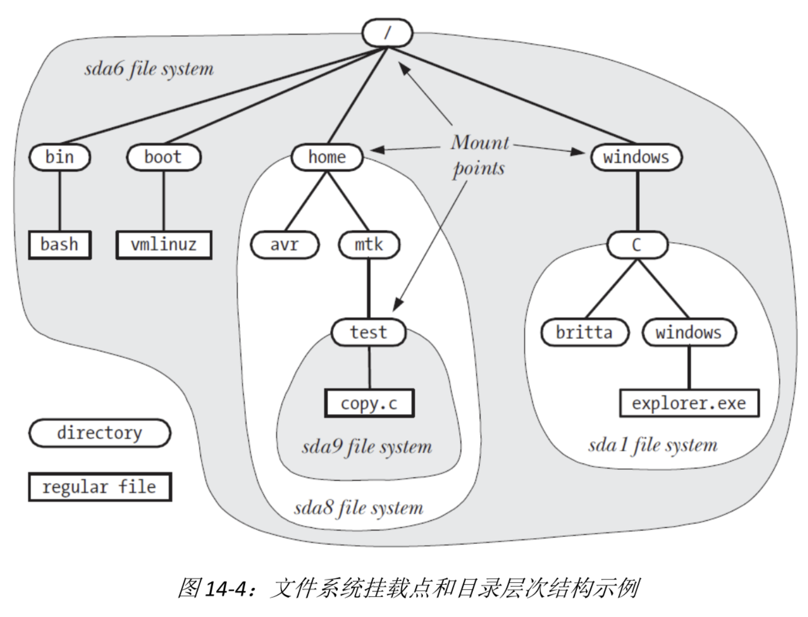
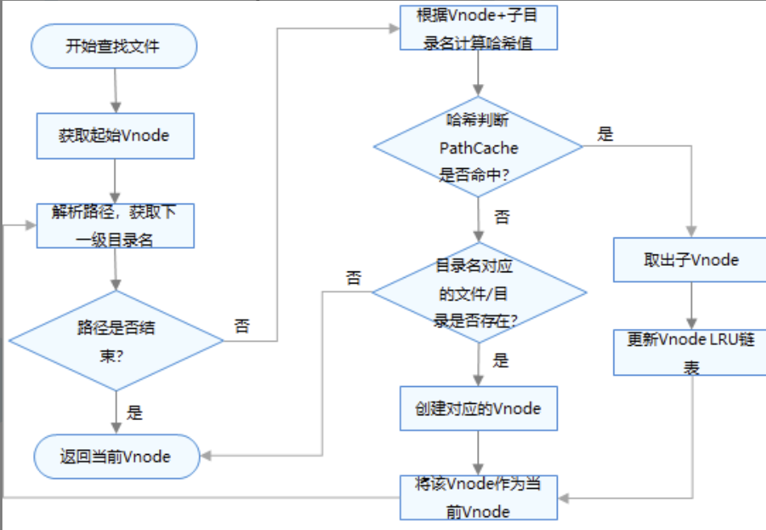
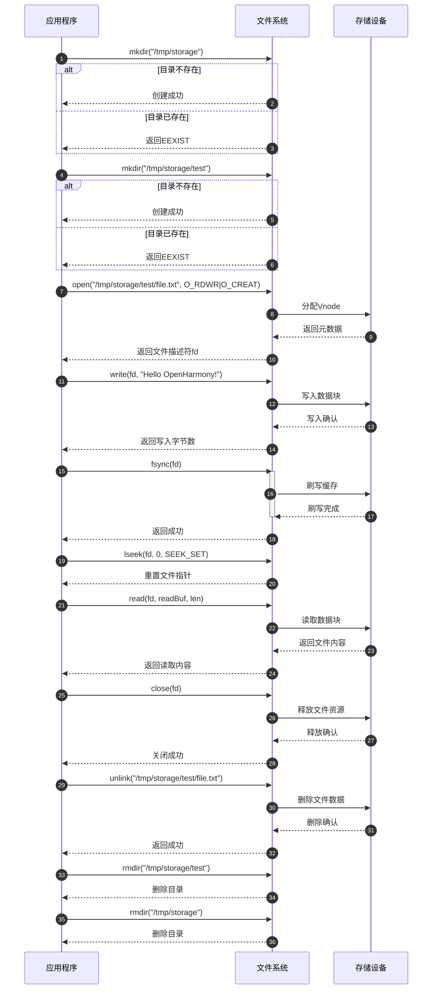
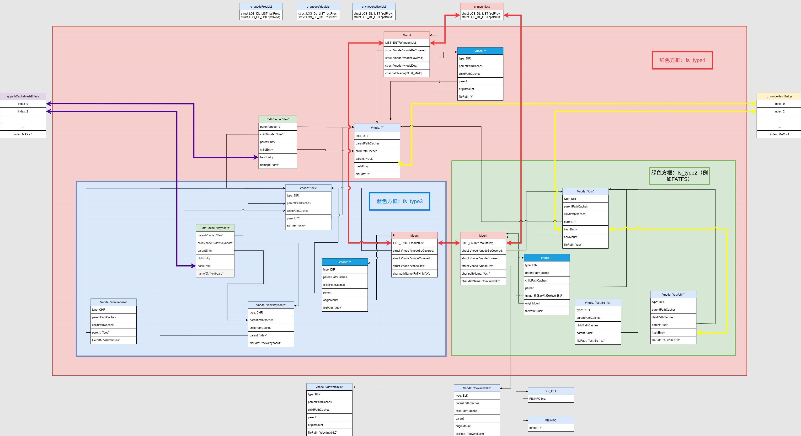

# 文件系统及Liteos_a内核文件系统分析

[TOC]


# 0、一句话总结

​	文件系统是操作系统用于组织、存储和管理文件及存储空间的软件机制，通过分层结构实现数据持久化、快速检索和安全控制。

本文不分析具体文件系统的数据格式，重点聚焦在内核态中实现的文件系统管理层，具体的文件系统。比如FATFS见其他分析文章： [FAT文件系统分析.md](../other/FAT文件系统分析.md) 


# 1、文件系统的通用知识点

## 1.1、文件系统的概念

**通用定义**：

* 文件系统是操作系统中负责管理存储设备（如磁盘、SSD）上数据的软件子系统，提供文件的逻辑抽象、物理存储映射及访问控制。

**核心作用**：

- 数据组织 ：将存储设备划分为逻辑块，以目录结构持久化保存数据
- 统一接口 ：为上层应用程序提供标准的文件操作接口(如open、read、write、close)
- 资源管理 ：负责文件的创建、存储、读取、修改、删除和权限控制。
- 抽象层 ：屏蔽底层存储设备的复杂性，提供简单统一的文件访问方式现代操作系统采用**虚拟文件系统(VFS)**作为核心设计理念。VFS是一个内核软件层，为各类文件系统提供统一的操作界面和应用编程接口，使得应用程序可以透明地访问不同类型的文件系统(如ext4、NTFS、FAT32等)。


## 1.2、文件系统的通用结构

### 1.2.1、分层结构

现代文件系统采用分层架构设计，从上到下包含以下层次：

```c
应用程序层
    ↓
系统调用接口(System Call Interface)
    ↓  
虚拟文件系统层(VFS)
    ↓
具体文件系统实现层(ext4/NTFS/FAT32等)
    ↓
缓存层(Buffer Cache)
    ↓
块设备驱动层
    ↓
物理存储设备
```


### 1.2.2、文件读写流程

```bash
文件读取完整流程：
┌─────────────────────────────────────────────────────────────┐
│ 应用程序调用：read(file_handle, buffer, size)                │
└─────────────────┬───────────────────────────────────────────┘
                  ▼
┌─────────────────────────────────────────────────────────────┐
│ 1. 系统调用层：验证参数，获取文件对象                          │
└─────────────────┬───────────────────────────────────────────┘
                  ▼
┌─────────────────────────────────────────────────────────────┐
│ 2. 文件系统抽象层：通过文件句柄找到对应的文件控制块            │
└─────────────────┬───────────────────────────────────────────┘
                  ▼
┌─────────────────────────────────────────────────────────────┐
│ 3. 具体文件系统：                                            │
│    ├─ 计算要读取的数据块号                                   │
│    ├─ 通过文件控制块的块指针定位数据块                        │
│    └─ 处理直接/间接指针                                      │
└─────────────────┬───────────────────────────────────────────┘
                  ▼
┌─────────────────────────────────────────────────────────────┐
│ 4. 缓存层：                                                  │
│    ├─ 检查缓存是否有所需数据                                 │
│    ├─ 缓存命中：直接返回数据                                 │
│    └─ 缓存未命中：向下层请求数据                             │
└─────────────────┬───────────────────────────────────────────┘
                  ▼
┌─────────────────────────────────────────────────────────────┐
│ 5. 块设备层：                                                │
│    ├─ 将逻辑块号转换为物理扇区号                             │
│    ├─ 构造I/O请求                                            │
│    └─ 提交给设备驱动                                         │
└─────────────────┬───────────────────────────────────────────┘
                  ▼
┌─────────────────────────────────────────────────────────────┐
│ 6. 设备驱动：执行实际的磁盘读取操作                           │
└─────────────────┬───────────────────────────────────────────┘
                  ▼
┌─────────────────────────────────────────────────────────────┐
│ 7. 数据返回：                                                │
│    ├─ 数据从磁盘读取到内核缓冲区                             │
│    ├─ 更新缓存                                               │
│    ├─ 复制数据到用户空间缓冲区                               │
│    └─ 更新文件位置指针                                       │
└─────────────────────────────────────────────────────────────┘
```


### 1.2.3、目录结构

典型的文件系统目录层次结构：

```bash
文件系统目录树结构：

                    / (根目录)
                    │
        ┌───────────┼───────────┬───────────┐
        │           │           │           │
      bin/        etc/        home/       tmp/
        │           │           │           │
    ┌───┴───┐   ┌───┴───┐   ┌───┴───┐   ┌───┴───┐
    │       │   │       │   │       │   │       │
  ls.exe  cat.exe config.txt passwd  user1/  user2/  temp.log
                                      │       │
                                  ┌───┴───┐ ┌─┴─┐
                                  │       │ │   │
                              documents/ photos/ work/
                                  │       │     │
                              ┌───┴───┐   │   ┌─┴─┐
                              │       │   │   │   │
                          report.txt notes.txt │ project1/
                                              │     │
                                          pic1.jpg  │
                                                    │
                                                code.c
```

目录项内部结构详图：

```bash
目录数据块内容示例 (/home/user1/)：

┌─────────────────────────────────────────────────────────────┐
│                    目录数据块                                │
├─────────────────────────────────────────────────────────────┤
│ 目录项1：                                                    │
│ ┌─────────┬──────────┬──────────┬─────────────────────────┐ │
│ │ 文件ID  │ 记录长度  │ 名称长度  │      文件名              │ │
│ │  1001   │    16    │    1     │         .               │ │
│ └─────────┴──────────┴──────────┴─────────────────────────┘ │
├─────────────────────────────────────────────────────────────┤
│ 目录项2：                                                    │
│ ┌─────────┬──────────┬──────────┬─────────────────────────┐ │
│ │ 文件ID  │ 记录长度  │ 名称长度  │      文件名              │ │
│ │  1000   │    16    │    2     │        ..               │ │
│ └─────────┴──────────┴──────────┴─────────────────────────┘ │
├─────────────────────────────────────────────────────────────┤
│ 目录项3：                                                    │
│ ┌─────────┬──────────┬──────────┬─────────────────────────┐ │
│ │ 文件ID  │ 记录长度  │ 名称长度  │      文件名              │ │
│ │  1010   │    20    │    9     │    documents            │ │
│ └─────────┴──────────┴──────────┴─────────────────────────┘ │
├─────────────────────────────────────────────────────────────┤
│ 目录项4：                                                    │
│ ┌─────────┬──────────┬──────────┬─────────────────────────┐ │
│ │ 文件ID  │ 记录长度  │ 名称长度  │      文件名              │ │
│ │  1020   │    16    │    6     │      photos             │ │
│ └─────────┴──────────┴──────────┴─────────────────────────┘ │
├─────────────────────────────────────────────────────────────┤
│ 目录项5：                                                    │
│ ┌─────────┬──────────┬──────────┬─────────────────────────┐ │
│ │ 文件ID  │ 记录长度  │ 名称长度  │      文件名              │ │
│ │  1030   │    16    │    4     │       work              │ │
│ └─────────┴──────────┴──────────┴─────────────────────────┘ │
└─────────────────────────────────────────────────────────────┘

说明：
- "." 表示当前目录，指向自身
- ".." 表示父目录，指向上级目录
- 每个目录项包含：文件ID、记录长度、文件名长度、文件名
- 文件ID用于索引对应的文件控制块
```

目录查找过程示意图：

```bash
路径解析过程：/home/user1/documents/report.txt

步骤1：从根目录开始
┌─────────────────┐
│   根目录 (/)     │
│   文件ID: 1     │ ──→ 读取根目录数据块
└─────────────────┘     ↓
                       查找 "home" 目录项
                        ↓
步骤2：进入home目录
┌─────────────────┐
│   home目录       │
│   文件ID: 100   │ ──→ 读取home目录数据块
└─────────────────┘     ↓
                       查找 "user1" 目录项
                        ↓
步骤3：进入user1目录
┌─────────────────┐
│   user1目录      │
│   文件ID: 1001  │ ──→ 读取user1目录数据块
└─────────────────┘     ↓
                       查找 "documents" 目录项
                        ↓
步骤4：进入documents目录
┌─────────────────┐
│ documents目录    │
│   文件ID: 1010  │ ──→ 读取documents目录数据块
└─────────────────┘     ↓
                       查找 "report.txt" 文件项
                        ↓
步骤5：找到目标文件
┌─────────────────┐
│  report.txt     │
│   文件ID: 2001  │ ──→ 获取文件控制块
└─────────────────┘     ↓
                       返回文件信息
```

目录与文件的关系图：

```bash
目录项 ──→ 文件控制块 ──→ 数据块

┌─────────────────┐    ┌─────────────────┐    ┌─────────────────┐
│    目录项        │    │   文件控制块     │    │    数据块        │
│                 │    │                 │    │                 │
│ - 文件名        │───→│ - 文件ID        │───→│ - 实际文件内容   │
│ - 文件ID        │    │ - 文件大小      │    │ - 目录项列表     │
│ - 记录长度      │    │ - 文件类型      │    │   (如果是目录)   │
│ - 名称长度      │    │ - 权限信息      │    │                 │
└─────────────────┘    │ - 时间戳        │    └─────────────────┘
                       │ - 数据块指针    │
                       └─────────────────┘

示例：
目录项 "documents"     文件控制块 1010      数据块 (包含子目录项)
├─ 文件名: documents   ├─ 文件ID: 1010      ├─ report.txt (ID:2001)
├─ 文件ID: 1010        ├─ 大小: 512字节     ├─ notes.txt (ID:2002)
├─ 记录长度: 20        ├─ 类型: 目录         └─ . (ID:1010)
└─ 名称长度: 9         ├─ 权限: rwxr-xr-x       └─ .. (ID:1001)
                      ├─ 创建时间: ...
                      └─ 数据块指针: [块地址]
```


## 1.3、文件系统核心设计总结

文件系统的通用性体现在：

* 分层抽象：逻辑文件与物理存储分离（用户无需感知扇区地址）。

* 元数据核心：索引节点统一描述文件属性，目录项仅存储文件名与索引节点号映射。

* 动态扩展：索引分配 + 多级指针平衡大/小文件存储效率。

* 故障容忍：日志/写时复制确保操作原子性与数据一致性。


# 2、Liteos_a内核中文件系统的实现

## 2.1、文件系统函数调用流程图


## 2.2、挂载点和目录层次




## 2.3、VFS运行机制

VFS层主要通过函数指针，实现对不同文件系统类型调用不同接口实现标准接口功能；

通过Vnode与PathCache机制，提升路径搜索以及文件访问的性能；

通过挂载点管理进行分区管理；

通过FD管理进行进程间FD隔离等。

**1、文件系统操作函数指针**

* VFS层通过函数指针的形式，将统一调用按照不同的文件系统类型，分发到不同文件系统中进行底层操作。各文件系统的各自实现一套Vnode虚拟节点操作、Mount挂载点操作以及File文件操作接口，并以函数指针结构体的形式存储于对应Vnode、Mount挂载点、File结构体中，实现VFS层对下层的访问。

**2、内核 Vnode 节点**
Vnode：Vnode是具体**文件**或**目录**在VFS层的抽象封装，它屏蔽了不同文件系统的差异，实现资源的统一管理。Vnode节点主要有以下几种类型：

- 挂载点：挂载具体文件系统，如/、/storage
- 设备节点：/dev目录下的节点，对应于一个设备，如/dev/mmcblk0
- 文件/目录节点：对应于具体文件系统中的文件/目录，如/bin/init、/usr/usr1

Vnode通过哈希以及LRU机制进行管理。当系统启动后，对文件或目录的访问会优先从哈希链表中查找Vnode缓存，若缓存没有命中，则并从对应文件系统中搜索目标文件或目录，创建并缓存对应的Vnode。当Vnode缓存数量达到上限时，将淘汰长时间未访问的Vnode，其中挂载点Vnode与设备节点Vnode不参与淘汰。当前系统中Vnode的规格默认为512，该规格可以通过LOSCFG_MAX_VNODE_SIZE进行配置。Vnode数量过大，会造成较大的内存占用；Vnode数量过少，则会造成搜索性能下降。下图展示了Vnode的创建流程：


**3、路径缓存 PathCache**

PathCache是路径缓存，它通过哈希表存储，利用父节点Vnode的地址和子节点的文件名，可以从PathCache中快速查找到子节点对应的Vnode。下图展示了文件/目录的查找流程。



**4、页缓存 PageCache**

PageCache是内核中文件的缓存。当前PageCache仅支持缓存二进制文件，在初次访问文件时通过mmap映射到内存中，下次再访问时，直接从PageCache中读取，可以提升对同一个文件的读写速度。另外基于PageCache可实现以文件为基底的进程间通信。

**5、Fd管理**

Fd（File Descriptor）是描述一个打开的文件/目录的描述符。当前Liteos_a内核中，fd总规格为896，分为三种类型：

- 普通文件描述符，系统总规格为512。
- Socket描述符，系统总规格为128。
- 消息队列描述符，系统总规格为256。

当前Liteos_a内核中，对不同进程中的fd进行隔离，即进程只能访问本进程的fd，所有进程的fd映射到全局fd表中进行统一分配管理。进程的文件描述符最多有256个。

**6、挂载点管理**
当前Liteos_a内核中，对系统中所有挂载点通过链表进行统一管理。挂载点结构体中，记录了该挂载分区内的所有Vnode。当分区卸载时，会释放分区内的所有Vnode。


## 2.4、数据传输路径

```bash
用户空间应用
	--> VFS层
		--> 文件系统（如FATFS）
			--> 块设备驱动（如SD卡驱动）
				--> 物理存储芯片（SD卡、U盘）
```


## 2.5、Liteos_a内核文件系统模块的总结

​	分析到这里，可以看出Liteos_a内核完整的实现了 1.1 ~ 1.3 小节中文件系统所有的通用机制。接下来就借助Liteos_a内核的源代码继续分析，Liteos_a内核是如何通过代码将文件系统的这些机制一一实现的。


# 3、Liteos_a内核文件系统开发案例

## 3.1、接口说明

**文件操作接口**

| 函数名                      | 功能描述         |
| --------------------------- | ---------------- |
| open                        | 打开文件         |
| read/pread/readv/preadv     | 读取文件         |
| write/pwrite/writev/pwritev | 写入文件         |
| lseek                       | 设置文件偏移     |
| close                       | 关闭文件         |
| unlink                      | 删除文件         |
| fstat                       | 查询文件信息     |
| fallocate                   | 预分配文件大小   |
| truncate                    | 文件截断         |
| link                        | 创建硬链接       |
| symlink                     | 创建软链接       |
| readlink                    | 读取软链接       |
| dup                         | 复制文件句柄     |
| fsync                       | 文件内容刷入设备 |
| ioctl                       | 设备控制         |
| fcntl                       | 文件控制操作     |

**目录操作接口**

| 函数名    | 功能描述     |
| --------- | ------------ |
| mkdir     | 创建目录     |
| opendir   | 打开目录     |
| readdir   | 读取目录     |
| closedir  | 关闭目录     |
| telldir   | 获取目录偏移 |
| seekdir   | 设置目录偏移 |
| rewinddir | 重置目录偏移 |
| scandir   | 读取目录数据 |
| rmdir     | 删除目录     |

**路径与属性操作接口**

| 函数名     | 功能描述              |
| ---------- | --------------------- |
| chdir      | 切换当前路径          |
| getcwd     | 获取当前路径          |
| realpath   | 相对/绝对路径转换     |
| rename     | 文件/目录重命名       |
| chmod      | 修改文件/目录属性     |
| chown      | 修改文件/目录所有者   |
| stat/lstat | 查询文件/目录信息     |
| access     | 查询文件/目录访问权限 |

**分区操作接口**

| 函数名 | 功能描述         |
| ------ | ---------------- |
| mount  | 挂载分区         |
| umount | 卸载分区         |
| statfs | 查询挂载分区信息 |
| format | 格式化分区       |
| sync   | 分区内容刷入设备 |


## 3.2、开发流程

文件系统的主要开发流程包括挂载/卸载分区，以及系列目录的创建/删除、文件的读写等等操作。


## 3.3、编程实例

### 3.3.1、实例描述

使用系统提供的文件接口（mount、read、write）进行文件的挂载、读、写等操作。


### 3.3.2、编程示例

```c
#include <stdio.h>
#include <string.h>
#include <sys/stat.h>
#include <sys/mount.h>
#include <fcntl.h>
#include <unistd.h>
#include <errno.h>

#define LOS_OK 0
#define LOS_NOK -1

int main(void)
{
    int ret;
    int fd = -1;
    ssize_t len;
    off_t off;
    char mntName[64] = "/tmp/storage";         // 修改为/tmp目录下的路径
    char devName[64] = "/dev/sda1";            // 修改为Linux常见设备名
    char dirName[64] = "/tmp/storage/test";    // 修改路径
    char fileName[64] = "/tmp/storage/test/file.txt"; // 增加数组大小
    char writeBuf[32] = "Hello OpenHarmony!";
    char readBuf[32] = {0};

    /* 创建目录"/tmp/storage" */
    ret = mkdir(mntName, 0777);
    if (ret != LOS_OK && errno != EEXIST) {
        printf("mkdir failed: %s\n", strerror(errno));
        return LOS_NOK;
    }

    /*
     * 如果没有root权限，可以注释掉挂载和卸载操作，直接使用普通目录
     */
    /*
    ret = mount(devName, mntName, "ext4", 0, NULL);
    if (ret != LOS_OK) {
        printf("mount failed: %s\n", strerror(errno));
        printf("继续执行，不挂载设备\n");
    }
    */

    /* 创建目录"/tmp/storage/test" */
    ret = mkdir(dirName, 0777);
    if (ret != LOS_OK && errno != EEXIST) {
        printf("mkdir failed: %s\n", strerror(errno));
        return LOS_NOK;
    }

    /* 创建可读写文件"/tmp/storage/test/file.txt" */
    fd = open(fileName, O_RDWR | O_CREAT, 0777);
    if (fd < 0) {
        printf("open file failed: %s\n", strerror(errno));
        return LOS_NOK;
    }

    /* 将writeBuf中的内容写入文件 */
    len = write(fd, writeBuf, strlen(writeBuf));
    if (len != strlen(writeBuf)) {
        printf("write file failed: %s\n", strerror(errno));
        close(fd);
        return LOS_NOK;
    }

    /* 将文件内容刷入存储设备中 */
    ret = fsync(fd);
    if (ret != LOS_OK) {
        printf("fsync failed: %s\n", strerror(errno));
        close(fd);
        return LOS_NOK;
    }

    /* 将读写指针偏移至文件头 */
    off = lseek(fd, 0, SEEK_SET);
    if (off != 0) {
        printf("lseek failed: %s\n", strerror(errno));
        close(fd);
        return LOS_NOK;
    }

    /* 将文件内容读出至readBuf中 */
    len = read(fd, readBuf, sizeof(readBuf) - 1); // 保留一个字节给字符串结束符
    if (len < 0) {
        printf("read file failed: %s\n", strerror(errno));
        close(fd);
        return LOS_NOK;
    }
    readBuf[len] = '\0'; // 确保字符串正确结束
    printf("读取内容: %s\n", readBuf);

    /* 关闭文件 */
    ret = close(fd);
    if (ret != LOS_OK) {
        printf("close failed: %s\n", strerror(errno));
        return LOS_NOK;
    }

    /* 删除文件"/tmp/storage/test/file.txt" */
    ret = unlink(fileName);
    if (ret != LOS_OK) {
        printf("unlink failed: %s\n", strerror(errno));
        return LOS_NOK;
    }

    /* 删除目录"/tmp/storage/test" */
    ret = rmdir(dirName);
    if (ret != LOS_OK) {
        printf("rmdir failed: %s\n", strerror(errno));
        return LOS_NOK;
    }

    /*
     * 卸载分区"/tmp/storage"
     * 同样需要root权限，如果前面没有挂载，这里也不需要卸载
     */
    /*
    ret = umount(mntName);
    if (ret != LOS_OK) {
        printf("umount failed: %s\n", strerror(errno));
        return LOS_NOK;
    }
    */

    /* 删除目录"/tmp/storage" */
    ret = rmdir(mntName);
    if (ret != LOS_OK) {
        printf("rmdir failed: %s\n", strerror(errno));
        return LOS_NOK;
    }

    printf("操作成功完成！\n");
    return LOS_OK;
}
```


### 3.3.3、示例时序图




# 4、Liteos_a内核文件系统的源码分析

## 4.1、文件系统相关数据结构

主要涉及虚拟节点、文件、挂载点、路径缓存等结构：

* struct Vnode：Liteos_a内核中用来表示一个文件或者目录的虚拟节点的结构体

* struct VnodeOps：操作Vnode的函数集合

* struct Mount：Liteos_a内核中用来表示一个挂载点的结构体

* struct MountOps：用来操作挂载点的操作函数集合

* struct file：Liteos_a内核中用来表示一个文件的结构体

* struct file_operations_vfs：用来操作文件的操作函数集合

* struct PathCache：Liteos_a内核中用来记录两个Vnode之间路径关系的缓存结构体

 VFS层整体框架图：红色Mount点、蓝色Vnode、绿色PathCache。




## 4.2、FS操作函数集注册 FSMAP_ENTRY

```c
一、系统注册文件系统操作函数集
1、代码编写时：提供全局文件系统映射表
    // third_party_NuttX\fs\mount\fs_mount.c
    extern struct fsmap_t g_fsmap[];
    LOS_HAL_TABLE_BEGIN(g_fsmap, fsmap);

    extern struct fsmap_t g_fsmap_end;
    LOS_HAL_TABLE_END(g_fsmap_end, fsmap);

2、文件编译时：将g_fsmap、g_fsmap_end符号放置在指定的段中
// kernel_liteos_a\kernel\include\los_tables.h
g_fsmap符号在 .liteos.table.fsmap.begin 段中
    #ifndef LOS_HAL_TABLE_BEGIN
    #define LOS_HAL_TABLE_BEGIN(label, name)                                     \
        __asm__(".section \".liteos.table." X_STRING(name) ".begin\",\"aw\"\n"   \
                ".globl " X_STRING(LOS_LABEL_DEFN(label)) "\n"                   \
                ".type    " X_STRING(LOS_LABEL_DEFN(label)) ",object\n"          \
                ".p2align " X_STRING(LOSARC_P2ALIGNMENT) "\n"                    \
                X_STRING(LOS_LABEL_DEFN(label)) ":\n"                            \
                ".previous\n"                                                    \
                )
    #endif
g_fsmap_end符号在 .liteos.table.fsmap.finish 段中
    #ifndef LOS_HAL_TABLE_END
    #define LOS_HAL_TABLE_END(label, name)                                       \
        __asm__(".section \".liteos.table." X_STRING(name) ".finish\",\"aw\"\n"  \
                ".globl " X_STRING(LOS_LABEL_DEFN(label)) "\n"                   \
                ".type    " X_STRING(LOS_LABEL_DEFN(label)) ",object\n"          \
                ".p2align " X_STRING(LOSARC_P2ALIGNMENT) "\n"                    \
                X_STRING(LOS_LABEL_DEFN(label)) ":\n"                            \
                ".previous\n"                                                    \
                )
    #endif
在链接脚本中定义段的位置：kernel_liteos_a\tools\build\liteos.ld
    .data ALIGN(0x1000) : {
        ...
        ...
        . = ALIGN(0x4);
        KEEP(*( SORT (.liteos.table.*)));
    } > ram

3、编写具体的文件系统映射表
    // kernel_liteos_a\kernel\include\los_tables.h
    #ifndef LOS_HAL_TABLE_ENTRY
    #define LOS_HAL_TABLE_ENTRY(name)                                  \
        LOSBLD_ATTRIB_SECTION(".liteos.table." X_STRING(name) ".data") \
        LOSBLD_ATTRIB_USED
    #endif

    // third_party_NuttX\include\nuttx\fs\fs.h
    struct fsmap_t
    {
    const char                      *fs_filesystemtype;
    const struct                    MountOps *fs_mops;
    const BOOL                      is_mtd_support;
    const BOOL                      is_bdfs;
    };

    #define FSMAP_ENTRY(_l, _name, _mop, _is_mtd_support, _is_bdfs)                      \
    struct fsmap_t _l LOS_HAL_TABLE_ENTRY(fsmap) =  \
    {                                                       \
    _name,                                              \
    &_mop,                                               \
    _is_mtd_support,                                    \
    _is_bdfs                                                \
    }

4、不同文件系统提供的注册函数
    FSMAP_ENTRY(fat_fsmap, "vfat", fatfs_mops, FALSE, TRUE);
    FSMAP_ENTRY(jffs_fsmap, "jffs2", jffs_operations, TRUE, TRUE);
    FSMAP_ENTRY(procfs_fsmap, "procfs", procfs_operations, FALSE, FALSE);
    FSMAP_ENTRY(nfs_fsmap, "nfs", nfs_mount_operations, FALSE, FALSE);
    FSMAP_ENTRY(ramfs_fsmap, "ramfs", tmpfs_operations, FALSE, FALSE);
不同文件系统根据链接时的顺序，放在 .liteos.table.fsmap.data 段中
.liteos.table.fsmap.begin
.liteos.table.fsmap.data
    fat_fsmap
    jffs_fsmap
    procfs_fsmap
    ramfs_fsmap
.liteos.table.fsmap.finish
```


## 4.3、文件系统初始化 los_vfs_init

文件系统初始化 los_vfs_init 函数主要流程：

* 1、初始化文件系统相关的全局变量
* 2、初始化全局文件列表 tg_filelist
* 3、初始化Vnode系统，设置根目录 "/"
* 4、初始化路径缓存
* 5、初始化Vnode哈希表
* 6、初始化设备 Vnode

los_vfs_init通过LOS_MODULE_INIT宏注册为内核基础模块初始化函数

```c
// kernel_liteos_a\fs\vfs\operation\vfs_init.c
void los_vfs_init(void)
{
    uint retval;
    static bool g_vfs_init = false;
    if (g_vfs_init) {
        return;
    }

#ifdef LOSCFG_FS_FAT_DISK
    // 初始化磁盘操作的自旋锁
    spin_lock_init(&g_diskSpinlock);
    spin_lock_init(&g_diskFatBlockSpinlock);
#endif
    // 初始化文件系统相关的全局变量，此函数目前为空
    files_initialize();
    // 初始化全局文件列表
    files_initlist(&tg_filelist);
-------------------------------------------------------------------------
        // 全局文件信号量的初始化
        sem_init(&list->fl_sem, 0, 1); 
-------------------------------------------------------------------------

	// 1、初始化Vnode系统的互斥锁
    // 2、初始化空闲Vnode链表 g_vnodeFreeList
    // 3、初始化虚拟Vnode链表（设备节点）g_vnodeVirtualList
    // 4、初始化活动Vnode链表 g_vnodeActiveList
    // 5、分配根Vnode ：VnodeAlloc(NULL, &g_rootVnode);
    // 6、设置根Vnode(g_rootVnode)信息：(mode)根目录权限、
    //      (type)Vnode类型为目录、(filePath)路径为"/"
    retval = VnodesInit();
    if (retval != LOS_OK) {
        PRINT_ERR("los_vfs_init VnodeInit failed error %d\n", retval);
        return;
    }
    // 遍历路径缓存哈希表的所有桶；
    // 初始化每个哈希桶的链表头g_pathCacheHashEntrys[i]
    retval = PathCacheInit();
    if (retval != LOS_OK) {
        PRINT_ERR("los_vfs_init PathCacheInit failed error %d\n", retval);
        return;
    }
    retval = VnodeHashInit();
-------------------------------------------------------------------------
        // 初始化每个哈希桶的链表头
        LOS_ListInit(&g_vnodeHashEntrys[i]);
        // 初始化哈希表的互斥锁
        LOS_MuxInit(&g_vnodeHashMux, NULL);
-------------------------------------------------------------------------
    if (retval != LOS_OK) {
        PRINT_ERR("los_vfs_init VnodeHashInit failed error %d\n", retval);
        return;
    }

	// 1、查找或创建"/dev"目录节点 VnodeLookup
	// 2、为设备目录"/dev"创建挂载点  MountAlloc
    retval = VnodeDevInit();
-------------------------------------------------------------------------
        // 创建/dev目录节点
        VnodeLookup("/dev", &devNode, V_CREATE | V_DUMMY);
        // 为设备目录“/dev”创建挂载点
        MountAlloc(devNode, NULL);
-------------------------------------------------------------------------
    if (retval != LOS_OK) {
        PRINT_ERR("los_vfs_init VnodeDevInit failed error %d\n", retval);
        return;
    }

    g_vfs_init = true;
}
LOS_MODULE_INIT(los_vfs_init, LOS_INIT_LEVEL_KMOD_BASIC);
```


## 4.4、挂载 mount

### 4.4.1、函数介绍

```c
// third_party_musl\src\linux\mount.c
int mount(const char *special, const char *dir, const char *fstype,
          unsigned long flags, const void *data)
{
	return syscall(SYS_mount, special, dir, fstype, flags, data);
}

// kernel_liteos_a\syscall\fs_syscall.c
int SysMount(const char *source, const char *target, const char *filesystemtype,
             unsigned long mountflags, const void *data)
{
    ...
}

参数
1. special ：要挂载的设备或文件系统源，通常是一个设备文件路径（如"/dev/sda1"）
2. dir ：挂载点目录，文件系统将被挂载到这个目录上
3. fstype ：文件系统类型，如"fat"、"jffs2"、"ext4"等
4. flags ：挂载标志，控制挂载行为的位掩码
5. data ：文件系统特定的数据，通常是一个选项字符串或特定结构体

返回值
- 成功：返回0
- 失败：返回-1，并设置errno表示错误原因

常用的flags标志
// third_party_musl\include\sys\mount.h
- MS_RDONLY ：以只读方式挂载
- MS_NOSUID ：禁止SUID和SGID位
- MS_NODEV ：禁止访问设备文件
- MS_NOEXEC ：禁止执行文件
- MS_SYNCHRONOUS ：同步写入
- MS_REMOUNT ：重新挂载已挂载的文件系统
```


### 4.4.2、示例代码

```c
示例1：挂载FAT文件系统
// 将SD卡挂载到/sdcard目录
int ret = mount("/dev/mmcblk0p1", "/sdcard", "vfat", 0, NULL);
if (ret != 0) {
    perror("挂载SD卡失败");
    return -1;
}
printf("SD卡挂载成功\n");

示例2：以只读方式挂载JFFS2文件系统
// 将Flash设备挂载到/data目录，只读模式
int ret = mount("/dev/mtdblock2", "/data", "jffs2", MS_RDONLY, NULL);
if (ret != 0) {
    perror("挂载JFFS2文件系统失败");
    return -1;
}
printf("JFFS2文件系统挂载成功\n");

示例3：带选项挂载
// 挂载FAT文件系统并指定编码选项
const char *options = "iocharset=utf8,uid=1000";
int ret = mount("/dev/sda1", "/mnt/usb", "vfat", 0, options);
if (ret != 0) {
    perror("挂载USB设备失败");
    return -1;
}
printf("USB设备挂载成功\n");
```


### 4.4.3、mount源码分析

Liteos_a内核mount接口函数调用链：

```c
用户态：用户态C库提供
mount
    syscall：
	SYS_mount / __NR_mount
        内核态：SysMount
            - 权限检查 ：首先检查当前进程是否具有挂载文件系统的权限（CAP_FS_MOUNT）
            - 参数复制 ：将用户空间的参数（目标路径、文件系统类型、源路径、数据）复制到内核空间
            - 特殊处理 ：
                - 对ramfs进行特殊处理（不需要源路径）
                - 对NFS文件系统调用专门的挂载函数
            - 执行挂载 ：调用实际的 mount 函数执行挂载操作
		    ret = mount(sourceRet, targetRet, 
                        (filesystemtype ? fstypeRet : NULL), 
                        mountflags, dataRet);
            - 资源清理 ：释放所有分配的内存资源
            - 返回结果 ：返回挂载操作的结果
```

其中 执行挂载的 mount 函数：

```c
// third_party_NuttX\fs\mount\fs_mount.c
/*
    1. **参数验证**
      - 检查文件系统类型参数是否为空
      - 验证目标路径和文件系统类型参数

    2. **查找文件系统类型**
      - 通过`mount_findfs`查找指定的文件系统类型
      - 获取文件系统的挂载操作函数集

    3. **处理块设备**
      - 如果是块设备文件系统，查找对应的块设备驱动
      - 获取设备的Vnode

    4. **查找挂载点**
      - 获取VFS全局锁防止并发访问
      - 通过`VnodeLookup`查找挂载点对应的Vnode
      - 检查挂载点是否已被挂载

    5. **挂载缓存处理**（在LOSCFG_MNT_CONTAINER配置下）
      - 检查是否可以从缓存中恢复挂载
      - 如果找到匹配的缓存挂载，直接使用缓存信息

    6. **MTD分区处理**（在LOSCFG_DRIVERS_MTD配置下）
      - 为MTD分区设置挂载点名称

    7. **分配挂载结构体**
      - 调用`MountAlloc`分配挂载结构体
      - 设置挂载标志

    8. **调用文件系统特定的挂载方法**
      - 增加挂载点Vnode的使用计数
      - 调用文件系统的Mount方法
      - 减少挂载点Vnode的使用计数
      - 处理挂载失败的情况

    9. **设置挂载关系**
      - 设置Vnode的挂载标志
      - 复制文件路径
      - 设置设备Vnode和操作函数集
      - 复制挂载点和设备名称

    10. **添加到挂载列表**
        - 将新挂载添加到系统挂载列表
        - 在挂载容器配置下，添加到挂载缓存

    11. **根目录处理**
        - 如果挂载点是根目录，更新系统根目录Vnode

    12. **完成挂载**
        - 释放VFS全局锁
        - 返回成功状态

    13. **错误处理**
        - 使用多个错误处理标签处理不同阶段的错误
        - 释放已分配的资源
        - 设置适当的错误码
*/
int mount(const char *source, const char *target,
          const char *filesystemtype, unsigned long mountflags,
          const void *data)
{
  int ret;                        // 存储函数调用返回值
  int errcode = 0;                // 存储错误码
  struct Mount* mnt = NULL;       // 挂载点结构体指针
  struct Vnode *device = NULL;    // 设备Vnode指针
  struct Vnode *mountpt_vnode = NULL; // 挂载点Vnode指针
  const struct fsmap_t *fsmap = NULL; // 文件系统映射结构体指针
  const struct MountOps *mops = NULL; // 挂载操作函数集指针
  LIST_HEAD *mount_list = NULL;   // 挂载点链表头指针
#ifdef LOSCFG_DRIVERS_MTD
  mtd_partition *partition = NULL; // MTD分区指针
#endif

  // 检查文件系统类型参数是否为空
  if (filesystemtype == NULL)
    {
      errcode = -EINVAL;          // 设置无效参数错误码
      goto errout;                // 跳转到错误处理
    }

  /* 验证必需的指针参数 */
  DEBUGASSERT(target && filesystemtype);

  /* 查找指定的文件系统。先尝试块驱动文件系统 */
  // 查找文件系统类型，如果找不到或者是块设备文件系统但没有提供源设备，则报错
  if ((fsmap = mount_findfs(filesystemtype)) == NULL || (fsmap->is_bdfs && !source))
    {
      PRINT_ERR("Failed to find file system %s\n", filesystemtype);
      errcode = -ENODEV;          // 设置设备不存在错误码
      goto errout;                // 跳转到错误处理
    }

  // 获取文件系统的挂载操作函数集
  mops = fsmap->fs_mops;

  // 如果是块设备文件系统且提供了源设备
  if (fsmap->is_bdfs && source)
    {
      /* 确保提供了块驱动参数 */
      DEBUGASSERT(source);

      /* 查找块驱动 */
      // 查找块设备驱动
      ret = find_blockdriver(source, mountflags, &device);
      if (ret < 0)
        {
          PRINT_ERR("Failed to find block driver %s\n", source);
          errcode = ret;          // 设置错误码
          goto errout;            // 跳转到错误处理
        }
    }

  // 获取VFS全局锁，防止并发访问
  VnodeHold();
  // 查找挂载点对应的Vnode
  ret = VnodeLookup(target, &mountpt_vnode, 0);

  /* 挂载点必须是一个已存在的Vnode */
  // 如果找不到挂载点
  if (ret != OK)
    {
      PRINT_ERR("Failed to find valid mountpoint %s\n", target);
      errcode = -EINVAL;          // 设置无效参数错误码
      goto errout_with_lock;      // 跳转到带锁的错误处理
    }
  
  // 检查挂载点是否已经被挂载（VNODE_FLAG_MOUNT_NEW标志表示该Vnode是挂载点）
  if (mountpt_vnode->flag & VNODE_FLAG_MOUNT_NEW)
    {
#ifdef LOSCFG_MNT_CONTAINER
      // 在挂载容器配置下，遍历挂载列表检查是否已挂载
      struct Mount *tMnt = NULL;
      LOS_DL_LIST_FOR_EACH_ENTRY(tMnt, GetMountList(), struct Mount, mountList)
        {
          if (tMnt->vnodeCovered == mountpt_vnode)
            {
              PRINT_ERR("can't mount to %s, already mounted.\n", target);
              errcode = -EINVAL;  // 设置无效参数错误码
              goto errout_with_lock; // 跳转到带锁的错误处理
            }
        }
#else
      // 非挂载容器配置下，直接报错
      PRINT_ERR("can't mount to %s, already mounted.\n", target);
      errcode = -EINVAL;          // 设置无效参数错误码
      goto errout_with_lock;      // 跳转到带锁的错误处理
#endif
    }

#ifdef LOSCFG_MNT_CONTAINER
    // 挂载容器配置下，检查是否可以从缓存中恢复挂载
    struct Mount *cacheMnt = NULL;
    if (source != NULL)
      {
        // 遍历挂载缓存
        LOS_DL_LIST_FOR_EACH_ENTRY(cacheMnt, GetMountCache(), struct Mount, mountList)
          {
            // 如果找到相同源设备的缓存挂载
            if (strcmp(cacheMnt->devName, source) == 0)
              {
                // 分配新的挂载结构体
                struct Mount *newMnt = (struct Mount *)zalloc(sizeof(struct Mount));
                if (newMnt == NULL)
                  {
                    PRINT_ERR("New mount alloc failed no memory!\n");
                    errcode = -EINVAL; // 设置无效参数错误码
                    goto errout;       // 跳转到错误处理
                  }
                // 复制缓存的挂载信息
                *newMnt = *cacheMnt;
                // 添加到挂载列表
                LOS_ListTailInsert(GetMountList(), &(newMnt->mountList));
                // 增加被覆盖Vnode的挂载计数
                cacheMnt->vnodeCovered->mntCount++;
                // 释放VFS全局锁
                VnodeDrop();
                return OK;         // 返回成功
              }
          }
      }
#endif

  /* 将块驱动绑定到文件系统实例。文件系统返回对某个不透明的、依赖于fs的结构的引用，
   * 该结构封装了这种绑定。
   */

  // 检查文件系统是否支持挂载操作
  if (mops->Mount == NULL)
    {
      /* 文件系统不支持绑定操作??? */
      PRINTK("ERROR: Filesystem does not support bind\n");
      errcode = -ENOSYS;          // 设置不支持的操作错误码
      goto errout_with_lock;      // 跳转到带锁的错误处理
    }

  /* 增加我们传递给文件系统的引用的引用计数 */
#ifdef LOSCFG_DRIVERS_MTD
  // 如果是MTD支持的文件系统且设备不为空
  if (fsmap->is_mtd_support && (device != NULL))
    {
      // 获取MTD分区信息
      partition = (mtd_partition *)((struct drv_data *)device->data)->priv;
      // 为挂载点名称分配内存
      partition->mountpoint_name = (char *)zalloc(strlen(target) + 1);
      if (partition->mountpoint_name == NULL)
        {
          errcode = -ENOMEM;      // 设置内存不足错误码
          goto errout_with_lock;  // 跳转到带锁的错误处理
        }
      // 复制挂载点名称
      (void)strncpy_s(partition->mountpoint_name, strlen(target) + 1, target, strlen(target));
      partition->mountpoint_name[strlen(target)] = '\0';
    }
#endif

  // 分配挂载结构体
  mnt = MountAlloc(mountpt_vnode, (struct MountOps*)mops);

#ifdef LOSCFG_FS_ZPFS
  // 如果是ZPFS文件系统，进行特殊准备
  if (strcmp(filesystemtype, ZPFS_NAME) == 0)
    {
      ret = ZpfsPrepare(source, target, mnt);
      if (ret < 0)
        {
          errcode = ret;          // 设置错误码
          goto errout_with_mountpt; // 跳转到带挂载点的错误处理
        }
    }
#endif

  // 设置挂载标志
  mnt->mountFlags = mountflags;

  // 增加挂载点Vnode的使用计数
  mountpt_vnode->useCount++;
  // 调用文件系统特定的挂载方法
  ret = mops->Mount(mnt, device, data);
  // 减少挂载点Vnode的使用计数
  mountpt_vnode->useCount--;
  
  // 如果挂载失败
  if (ret != 0)
    {
      /* Vnode因某种原因对blkdrvr不满意。回退我们未能传递的引用的计数，
       * 并以错误退出。
       */
      PRINT_ERR("Bind method failed: %d\n", ret);
      errcode = ret;              // 设置错误码
#ifdef LOSCFG_DRIVERS_MTD
      // 如果是MTD支持的文件系统，释放挂载点名称
      if (fsmap->is_mtd_support && (device != NULL) && (partition != NULL))
        {
          free(partition->mountpoint_name);
          partition->mountpoint_name = NULL;
        }
#endif
      goto errout_with_mountpt;   // 跳转到带挂载点的错误处理
    }
    
  // 设置被覆盖Vnode的挂载源标志
  mnt->vnodeBeCovered->flag |= VNODE_FLAG_MOUNT_ORIGIN;
  // 设置覆盖Vnode的挂载新标志
  mnt->vnodeCovered->flag |= VNODE_FLAG_MOUNT_NEW;
  // 复制挂载点Vnode的文件路径
  mnt->vnodeCovered->filePath = strdup(mountpt_vnode->filePath);
  // 设置设备Vnode
  mnt->vnodeDev = device;
  // 设置挂载操作函数集
  mnt->ops = mops;
  
  // 如果目标路径不为空，复制到挂载结构体
  if (target && (strlen(target) != 0))
    {
      ret = strcpy_s(mnt->pathName, PATH_MAX, target);
      if (ret != EOK)
        {
          PRINT_ERR("Failed to copy mount point pathname, errno %d\n", ret);
        }
    }

  // 如果源设备路径不为空，复制到挂载结构体
  if (source && (strlen(source) != 0))
    {
      ret = strcpy_s(mnt->devName, PATH_MAX, source);
      if (ret != EOK)
        {
          PRINT_ERR("Failed to copy dev name, errno %d\n", ret);
        }
    }

  /* 我们已经拥有它，现在用驱动程序特定的信息填充它。 */
  // 获取挂载列表
  mount_list = GetMountList();
  // 将新挂载添加到挂载列表
  LOS_ListAdd(mount_list, &mnt->mountList);

#ifdef LOSCFG_MNT_CONTAINER
  // 在挂载容器配置下，将挂载信息添加到缓存
  if (source != NULL)
    {
      // 分配新的挂载结构体用于缓存
      struct Mount *newMnt = (struct Mount *)zalloc(sizeof(struct Mount));
      if (newMnt == NULL)
        {
          PRINT_ERR("New mount alloc failed no memory!\n");
          errcode = -EINVAL;      // 设置无效参数错误码
          goto errout;            // 跳转到错误处理
        }
      // 复制挂载信息到缓存
      *newMnt = *mnt;
      // 添加到挂载缓存列表
      LOS_ListTailInsert(GetMountCache(), &(newMnt->mountList));
    }
#endif

  // 如果挂载点是根目录，更改根目录Vnode
  if (!strcmp("/", target))
    {
      ChangeRoot(mnt->vnodeCovered);
    }

  // 释放VFS全局锁
  VnodeDrop();

  /* 我们可以释放对blkdrver_vnode的引用，如果文件系统想要保留blockdriver vnode
   * （它应该这样做），那么它必须调用vnode_addref()。挂载点vnode上有一个引用，
   * 它将一直存在，直到调用umount()。
   */

  return OK;  // 返回成功

  /* 很多goto！但它们使错误处理变得更简单 */

errout_with_mountpt:  // 带挂载点的错误处理标签
  if (mnt)
    {
      free(mnt);  // 释放挂载结构体
    }
errout_with_lock:  // 带锁的错误处理标签
  VnodeDrop();  // 释放VFS全局锁
errout:  // 错误处理标签
  set_errno(-errcode);  // 设置错误码
  return VFS_ERROR;  // 返回错误
}
```

其中 mops->Mount 函数，是具体的文件系统提供的函数，比如  fatfs_mount：

```c
// kernel_liteos_a\fs\fat\os_adapt\fatfs.c
/*
## 1. 准备阶段
    - 声明必要的变量，包括Vnode指针、文件系统实例、目录文件信息和分区信息等
    - 通过 fat_bind_check 函数检查块设备是否可以绑定为FAT文件系统，并获取分区信息
    - 设置分区名称为"vfat"，标识这是一个FAT文件系统分区
## 2. 资源分配与初始化
    - 分配FAT文件系统实例内存
    - 如果启用了FAT虚拟分区功能，初始化相关字段
    - 创建文件系统同步对象(互斥锁)，用于多线程访问控制
    - 锁定文件系统，防止并发访问
    - 初始化文件系统类型和设置物理驱动器ID
## 3. 文件系统识别与初始化
    - 获取扇区大小并验证其有效性（在支持多扇区大小的配置下）
    - 分配文件系统窗口缓冲区，用于读写扇区数据
    - 查找FAT分区，获取分区格式和起始扇区
    - 初始化FAT文件系统对象，设置文件系统参数
## 4. 根目录创建与VFS集成
    - 设置文件系统的用户ID、组ID和访问权限
    - 分配目录文件结构，用于表示根目录
    - 初始化根目录的目录对象和文件信息结构
    - 分配Vnode结构，用于表示根目录在VFS中的节点
    - 设置挂载结构的数据和覆盖的Vnode
    - 设置Vnode的各种属性，包括父节点、文件操作函数集、私有数据等
    - 计算根目录的哈希值并将Vnode插入哈希表
## 5. 完成挂载与错误处理
    - 解锁文件系统
    - 返回成功状态
    - 如果在任何步骤中出现错误，通过goto语句跳转到相应的错误处理标签
    - 根据错误发生的阶段释放已分配的资源，确保不会发生内存泄漏
*/
int fatfs_mount(struct Mount *mnt, struct Vnode *blk_device, const void *data)
{
    struct Vnode *vp = NULL;
    FATFS *fs = NULL;
    DIR_FILE *dfp = NULL;
    los_part *part = NULL;
    QWORD start_sector;
    BYTE fmt;
    DWORD hash;
    FRESULT result;
    int ret;

    // 检查块设备是否可以绑定为FAT文件系统，并获取分区信息
    ret = fat_bind_check(blk_device, &part);
    if (ret != 0) {
        goto ERROR_EXIT;
    }

    // 设置分区名称为"vfat"，标识这是一个FAT文件系统分区
    ret = SetDiskPartName(part, "vfat");
    if (ret != 0) {
        ret = EIO;
        goto ERROR_EXIT;
    }

    // 分配FAT文件系统实例内存
    fs = (FATFS *)zalloc(sizeof(FATFS));
    if (fs == NULL) {
        ret = ENOMEM;
        goto ERROR_PARTNAME;
    }

#ifdef LOSCFG_FS_FAT_VIRTUAL_PARTITION
    fs->vir_flag = FS_PARENT;
    fs->parent_fs = fs;
    fs->vir_amount = DISK_ERROR;
    fs->vir_avail = FS_VIRDISABLE;
#endif

    // 创建文件系统同步对象(互斥锁：LOS_MuxInit)
    ret = ff_cre_syncobj(0, &fs->sobj);
    if (ret == 0) { /* create sync object failed */
        ret = EINVAL;
        goto ERROR_WITH_FS;
    }

    // 尝试锁定文件系统，防止并发访问
    ret = lock_fs(fs);
    if (ret == FALSE) {
        ret = EBUSY;
        goto ERROR_WITH_MUX;
    }

    fs->fs_type = 0;
    fs->pdrv = part->part_id;

#if FF_MAX_SS != FF_MIN_SS  /* Get sector size (multiple sector size cfg only) */
    // 通过磁盘IO控制获取扇区大小
    if (disk_ioctl(fs->pdrv, GET_SECTOR_SIZE, &(fs->ssize)) != RES_OK) {
        ret = EIO;
        goto ERROR_WITH_LOCK;
    }
    if (fs->ssize > FF_MAX_SS || fs->ssize < FF_MIN_SS || (fs->ssize & (fs->ssize - 1))) {
        ret = EIO;
        goto ERROR_WITH_LOCK;
    }
#endif

    // 分配文件系统窗口缓冲区，用于读写扇区数据
    fs->win = (BYTE *)ff_memalloc(SS(fs));
    if (fs->win == NULL) {
        ret = ENOMEM;
        goto ERROR_WITH_LOCK;
    }

    // 查找FAT分区，获取分区格式和起始扇区
    result = find_fat_partition(fs, part, &fmt, &start_sector);
    if (result != FR_OK) {
        ret = fatfs_2_vfs(result);
        goto ERROR_WITH_FSWIN;
    }

    // 初始化FAT文件系统对象，设置文件系统参数
    result = init_fatobj(fs, fmt, start_sector);
    if (result != FR_OK) {
        ret = fatfs_2_vfs(result);
        goto ERROR_WITH_FSWIN;
    }

    fs->fs_uid = mnt->vnodeBeCovered->uid;
    fs->fs_gid = mnt->vnodeBeCovered->gid;
    fs->fs_dmask = GetUmask();
    fs->fs_fmask = GetUmask();
    fs->fs_mode = mnt->vnodeBeCovered->mode & (S_IRWXU | S_IRWXG | S_IRWXO);

    dfp = (DIR_FILE *)zalloc(sizeof(DIR_FILE));
    if (dfp == NULL) {
        ret = ENOMEM;
        goto ERROR_WITH_FSWIN;
    }

    dfp->f_dir.obj.fs = fs;
    dfp->f_dir.obj.sclust = 0; /* set start clust 0, root */
    dfp->f_dir.obj.attr = AM_DIR;
    dfp->f_dir.obj.objsize = 0; /* dir size is 0 */
    dfp->fno.fsize = 0;
    dfp->fno.fdate = 0;
    dfp->fno.ftime = 0;
    dfp->fno.fattrib = AM_DIR;
    dfp->fno.sclst = 0;
    dfp->fno.fsize = fs->csize * SS(fs);
    dfp->fno.fname[0] = '/'; /* Mark as root dir */
    dfp->fno.fname[1] = '\0';
    LOS_ListInit(&(dfp->fno.fp_list));

    /*
        1、FATFS在这里重新分配了一个Vnode
        当做挂载之后FATFS的根节点，
        2、其父节点为：
        Vnode->parent = Mount->vnodeBeCovered
        3、自己为：
        Vnode = Mount->vnodeCovered
    */
    ret = VnodeAlloc(&fatfs_vops, &vp);
    if (ret != 0) {
        ret = ENOMEM;
        goto ERROR_WITH_FSWIN;
    }

    mnt->data = fs;
    mnt->vnodeCovered = vp;

    vp->parent = mnt->vnodeBeCovered;
    vp->fop = &fatfs_fops;
    vp->data = dfp;
    vp->originMount = mnt;
    vp->uid = fs->fs_uid;
    vp->gid = fs->fs_gid;
    vp->mode = mnt->vnodeBeCovered->mode;
    vp->type = VNODE_TYPE_DIR;

    // 计算根目录的哈希值
    hash = fatfs_hash(0, 0, 0);
    // 将Vnode插入哈希表 g_vnodeHashEntrys ，便于快速查找
    ret = VfsHashInsert(vp, hash);
    if (ret != 0) {
        ret = -ret;
        goto ERROR_WITH_LOCK;
    }
    // 解锁
    unlock_fs(fs, FR_OK);

    return 0;

ERROR_WITH_FSWIN:
    ff_memfree(fs->win);
ERROR_WITH_LOCK:
    unlock_fs(fs, FR_OK);
ERROR_WITH_MUX:
    ff_del_syncobj(&fs->sobj);
ERROR_WITH_FS:
    free(fs);
ERROR_PARTNAME:
    if (part->part_name) {
        free(part->part_name);
        part->part_name = NULL;
    }
ERROR_EXIT:
    return -ret;
}
```


### 4.4.4、挂载过程中的数据结构变化

**1、挂载前系统状态**

```c
### Vnode列表

- 根目录"/"的Vnode（在g_vnodeActiveList中）
- 设备"/dev/mtkblock0"的Vnode（在g_vnodeActiveList中）
- 设备"/dev/mtkblock1"的Vnode（在g_vnodeActiveList中）
- 目录"/mnt/fs1"的Vnode（在g_vnodeActiveList中）

### PathCache

- "/"的路径缓存（在g_pathCacheHashEntrys中）
- "/dev"的路径缓存（在g_pathCacheHashEntrys中）
- "/dev/mtkblock0"的路径缓存（在g_pathCacheHashEntrys中）
- "/dev/mtkblock1"的路径缓存（在g_pathCacheHashEntrys中）
- "/mnt"的路径缓存（在g_pathCacheHashEntrys中）
- "/mnt/fs1"的路径缓存（在g_pathCacheHashEntrys中）

### Mount列表

- g_mountList中只有根文件系统的Mount结构体

```

**2、挂载过程中的关键步骤**

```c

1. 查找文件系统类型

    - 通过 mount_findfs 找到FAT文件系统的fsmap
    - 获取FAT文件系统的挂载操作函数集mops
2. 查找块设备

    - 通过 find_blockdriver 找到"/dev/mtkblock1"的Vnode（device）
3. 查找挂载点

    - 通过 VnodeLookup 找到"/mnt/fs1"的Vnode（mountpt_vnode）
4. 分配挂载结构体

    - 调用 MountAlloc 分配Mount结构体（mnt）
    - 初始化mnt->vnodeBeCovered为mountpt_vnode（即"/mnt/fs1"的Vnode）
5. 调用FAT文件系统的挂载方法

    - 调用 mops->Mount(mnt, device, data)
    - FAT文件系统创建新的Vnode表示FAT文件系统的根目录
    - 设置mnt->vnodeCovered为新创建的FAT根目录Vnode
    - 设置mnt->data为FAT文件系统特定的数据结构
6. 设置挂载关系

    - 设置mnt->vnodeBeCovered->flag |= VNODE_FLAG_MOUNT_ORIGIN（"/mnt/fs1"的Vnode）
    - 设置mnt->vnodeCovered->flag |= VNODE_FLAG_MOUNT_NEW（FAT根目录Vnode）
    - 设置mnt->vnodeDev = device（"/dev/mtkblock1"的Vnode）
7. 添加到挂载列表

    - 将mnt添加到g_mountList中
```

**3、挂载后系统状态**

```c
### Vnode列表

- 根目录"/"的Vnode（在g_vnodeActiveList中）
- 设备"/dev/mtkblock0"的Vnode（在g_vnodeActiveList中）
- 设备"/dev/mtkblock1"的Vnode（在g_vnodeActiveList中）
- 目录"/mnt/fs1"的Vnode（在g_vnodeActiveList中，标记为VNODE_FLAG_MOUNT_ORIGIN）
- 新增 ：FAT文件系统根目录的Vnode（在g_vnodeActiveList中，标记为VNODE_FLAG_MOUNT_NEW）

### PathCache

- 保持不变，没有新增路径缓存

### Mount列表

- 原有的根文件系统Mount结构体
- 新增 ：FAT文件系统的Mount结构体，包含：
    - vnodeCovered - 指向FAT文件系统根目录的Vnode
    - vnodeBeCovered - 指向"/mnt/fs1"的Vnode
    - vnodeDev - 指向"/dev/mtkblock1"的Vnode
    - ops - 指向FAT文件系统的挂载操作函数集
    - data - 指向FAT文件系统特定的数据结构
    - pathName - "/mnt/fs1"
    - devName - "/dev/mtkblock1"
```

**4、访问挂载点的过程**

```c
当用户访问"/mnt/fs1"时：

1. 系统通过路径查找找到"/mnt/fs1"的Vnode
2. 检测到该Vnode有VNODE_FLAG_MOUNT_ORIGIN标志
3. 通过Mount结构体找到vnodeCovered（FAT根目录Vnode）
4. 将访问重定向到FAT根目录Vnode
5. 后续的文件操作都在FAT文件系统中进行
   这样，用户就可以通过访问"/mnt/fs1"来访问优盘中的文件，实现了文件系统的挂载。
```


## 4.5、卸载 unmount

### 4.5.1、函数介绍

```c
// third_party_musl\src\linux\mount.c
int umount(const char *special)
{
	return syscall(SYS_umount2, special, 0);
}

int umount2(const char *special, int flags)
{
	return syscall(SYS_umount2, special, flags);
}

// kernel_liteos_a\syscall\fs_syscall.c
int SysUmount2(const char *target, int flags)
{
    if (flags != 0) {
        return -EINVAL;
    }
    return SysUmount(target);
}

参数：
1. special：要卸载的文件系统的挂载点路径或设备名称
2. flags : 控制卸载行为的标志位，常见的标志包括：
    - MNT_FORCE : 强制卸载，即使文件系统忙
    - MNT_DETACH : 执行延迟卸载，立即分离文件系统，但在文件系统不再忙时才清理资源
    - MNT_EXPIRE : 将文件系统标记为过期，当下一次尝试访问时才真正卸载
    - UMOUNT_NOFOLLOW : 不解析符号链接

返回值：
- 成功时返回 0
- 失败时返回 -1，并设置 errno 表示错误原因

功能
umount 函数用于卸载文件系统。它实际上是调用 umount2 函数并将 flags 参数设置为 0。
这个函数会将指定的文件系统从文件系统层次结构中分离出来，使其不再可访问。
umount2 是 umount 的扩展版本，提供了更多的卸载选项。它允许通过 flags 参数指定卸载的行为，
例如强制卸载或延迟卸载。在内部，它通过系统调用 SYS_umount2 实现功能。
```


### 4.5.2、示例代码

```c
// 示例1：挂载 FAT 文件系统
#include <stdio.h>
#include <sys/mount.h>
#include <errno.h>
#include <string.h>

int main(void)
{
    int ret;
    
    // 挂载 FAT 文件系统
    ret = mount("/dev/mmcblk0p1", "/sdcard", "vfat", 0, NULL);
    if (ret != 0) {
        printf("挂载失败: %s\n", strerror(errno));
        return -1;
    }
    
    printf("FAT 文件系统挂载成功\n");
    
    // 使用文件系统...
    
    // 卸载文件系统
    ret = umount("/sdcard");
    if (ret != 0) {
        printf("卸载失败: %s\n", strerror(errno));
        return -1;
    }
    
    printf("文件系统卸载成功\n");
    return 0;
}
```


### 4.5.3、unmount 源码分析

```c
用户态：用户态C库提供umount / umount2函数
    syscall:
    SYS_umount2 / __NR_umount2
        SysUmount(target);
			umount
```

其中 SysUmount 调用过的 unmount函数：

```c
// third_party_NuttX\fs\mount\fs_umount.c
int umount(const char *target)
{
  // 声明变量：挂载点vnode、块设备驱动vnode、被覆盖的vnode和挂载结构
  struct Vnode *mountpt_vnode = NULL;  // 挂载点的Vnode
  struct Vnode *blkdrvr_vnode = NULL;  // 块设备驱动的Vnode
  struct Vnode *covered_vnode = NULL;  // 被挂载点覆盖的原始Vnode
  struct Mount *mnt = NULL;            // 挂载结构
  int ret;                             // 返回值

  /* 验证必需的指针参数 */
  if (target == NULL)                  // 如果目标路径为空
    {
      ret = -EFAULT;                   // 设置错误码为EFAULT（无效地址）
      goto errout;                     // 跳转到错误处理
    }

  /* 查找挂载点 */
  VnodeHold();                         // 获取VFS全局锁
  ret = VnodeLookup(target, &mountpt_vnode, 0); // 查找目标路径对应的Vnode
  if (ret != OK || !mountpt_vnode)     // 如果查找失败或Vnode为空
    {
      goto errout;                     // 跳转到错误处理
    }
  
  /* 验证Vnode是否为挂载点 */
  if (!mountpt_vnode || !(mountpt_vnode->flag & VNODE_FLAG_MOUNT_NEW)) // 检查是否有挂载点标志
    {
      ret = -EINVAL;                   // 设置错误码为EINVAL（无效参数）
      goto errout;                     // 跳转到错误处理
    }

#ifdef LOSCFG_MNT_CONTAINER
  /* 在挂载容器配置下验证Vnode是否为挂载点 */
  struct Mount *tMnt = NULL;
  bool found = false;
  // 遍历挂载列表查找对应的挂载结构
  LOS_DL_LIST_FOR_EACH_ENTRY(tMnt, GetMountList(), struct Mount, mountList)
    {
      if (tMnt->vnodeCovered == mountpt_vnode) // 如果找到匹配的挂载结构
        {
          found = true;                // 设置找到标志
          break;                       // 跳出循环
        }
    }

  if (!found)                          // 如果在挂载列表中未找到
    {
      ret = -EINVAL;                   // 设置错误码为EINVAL
      goto errout;                     // 跳转到错误处理
    }

  // 如果挂载点有多个引用（被多次挂载）
  if (tMnt->vnodeCovered->mntCount > 0)
    {
      tMnt->vnodeCovered->mntCount--;  // 减少引用计数
      LOS_ListDelete(&tMnt->mountList); // 从挂载列表中删除
      free(tMnt);                      // 释放挂载结构
      VnodeDrop();                     // 释放VFS全局锁
      return OK;                       // 返回成功
    }
#endif

  /* 获取挂载点覆盖的Vnode和挂载结构 */
  mnt = mountpt_vnode->originMount;    // 获取挂载结构
  if (!mnt)                            // 如果挂载结构为空
    {
      ret = -EINVAL;                   // 设置错误码为EINVAL
      goto errout;                     // 跳转到错误处理
    }
  
  covered_vnode = mnt->vnodeBeCovered; // 获取被覆盖的原始Vnode
  // 检查被覆盖的Vnode是否有效且有挂载源标志
  if (!covered_vnode || !(covered_vnode->flag & VNODE_FLAG_MOUNT_ORIGIN))
    {
      ret = -EINVAL;                   // 设置错误码为EINVAL
      goto errout;                     // 跳转到错误处理
    }

  /* 从文件系统解绑块驱动（销毁任何文件系统私有数据） */
  // 检查挂载操作函数集和卸载函数是否存在
  if (mnt->ops == NULL || mnt->ops->Unmount == NULL)
    {
      /* 文件系统不支持解绑操作 */
      ret = -EINVAL;                   // 设置错误码为EINVAL
      goto errout;                     // 跳转到错误处理
    }

  /* 释放挂载点下的Vnode */
  if (fs_in_use(mnt, target))          // 检查文件系统是否正在使用
    {
      ret = -EBUSY;                    // 设置错误码为EBUSY（设备或资源忙）
      goto errout;                     // 跳转到错误处理
    }

  // 释放挂载点下的所有Vnode
  ret = VnodeFreeAll(mnt);
  if (ret != OK)                       // 如果释放失败
    {
      goto errout;                     // 跳转到错误处理
    }
  
  /* 卸载文件系统 */
  ret = mnt->ops->Unmount(mnt, &blkdrvr_vnode); // 调用文件系统特定的卸载函数
  if (ret != OK)                       // 如果卸载失败
    {
      goto errout;                     // 跳转到错误处理
    }
  
#ifdef LOSCFG_MNT_CONTAINER
  // 在挂载容器配置下，从挂载缓存中删除对应项
  struct Mount *tCacheMnt = NULL;
  LOS_DL_LIST_FOR_EACH_ENTRY(tCacheMnt, GetMountCache(), struct Mount, mountList)
    {
      if (tCacheMnt->vnodeCovered == mountpt_vnode) // 如果找到匹配的缓存项
        {
          LOS_ListDelete(&tCacheMnt->mountList); // 从缓存列表中删除
          free(tCacheMnt);                       // 释放缓存结构
          break;                                 // 跳出循环
        }
    }
#endif

  VnodeFree(mountpt_vnode);            // 释放挂载点Vnode
  LOS_ListDelete(&mnt->mountList);     // 从挂载列表中删除

  free(mnt);                           // 释放挂载结构

  /* 卸载方法是否返回了包含的块驱动 */
  if (blkdrvr_vnode)                   // 如果有块驱动Vnode
    {
      ; /* 卸载后的块驱动操作 */      // 这里没有实际操作，可能是预留的
    }

  covered_vnode->newMount = NULL;      // 清除被覆盖Vnode的新挂载指针

#ifdef LOSCFG_MNT_CONTAINER
  // 在挂载容器配置下，检查被覆盖的Vnode是否还在其他挂载缓存中
  tCacheMnt = NULL;
  found = false;
  LOS_DL_LIST_FOR_EACH_ENTRY(tCacheMnt, GetMountCache(), struct Mount, mountList)
    {
      if (tCacheMnt->vnodeBeCovered == covered_vnode) // 如果找到匹配项
        {
          found = true;                // 设置找到标志
          break;                       // 跳出循环
        }
    }
  
  if (!found)                          // 如果未找到
    {
      covered_vnode->flag &= ~(VNODE_FLAG_MOUNT_ORIGIN); // 清除挂载源标志
    }
#else
  covered_vnode->flag &= ~(VNODE_FLAG_MOUNT_ORIGIN); // 清除挂载源标志
#endif

  VnodeDrop();                         // 释放VFS全局锁

  return OK;                           // 返回成功

  /* 很多goto！但它们使错误处理更简单 */
errout:
  VnodeDrop();                         // 释放VFS全局锁
  set_errno(-ret);                     // 设置错误码
  return VFS_ERROR;                    // 返回错误
}
```

其中 mnt->ops->Unmount(mnt, &blkdrvr_vnode); 调用文件系统特定的卸载函数，比如fatfs_umount ：

```c
// kernel_liteos_a\fs\fat\os_adapt\fatfs.c
int fatfs_umount(struct Mount *mnt, struct Vnode **blkdriver)
{
    struct Vnode *device;
    FATFS *fs = (FATFS *)mnt->data;
    los_part *part;
    int ret;

    // 加锁，防止并发访问文件系统
    ret = lock_fs(fs);
    if (ret == FALSE) {
        return -EBUSY;
    }

    // 根据物理驱动号获取分区信息
    part = get_part(fs->pdrv);
    if (part == NULL) {
        unlock_fs(fs, FR_OK);
        return -ENODEV;
    }
    // 子主题1获取分区对应的块设备Vnode
    device = part->dev;
    if (device == NULL) {
        unlock_fs(fs, FR_OK);
        return -ENODEV;
    }
#ifdef LOSCFG_FS_FAT_CACHE
    // 如果启用FAT缓存，先同步缓存到SD卡
    ret = OsSdSync(part->disk_id);
    if (ret != 0) {
        unlock_fs(fs, FR_DISK_ERR);
        return -EIO;
    }
#endif
    // 如果分区名不为空（已分配），释放分区名所占内存
    if (part->part_name != NULL) {
        free(part->part_name);
        part->part_name = NULL;
    }

    // 获取设备的驱动数据
    struct drv_data *dd = device->data;
    if (dd->ops == NULL) {
        unlock_fs(fs, FR_OK);
        return ENODEV;
    }

    // 获取块设备操作集；
    const struct block_operations *bops = dd->ops;
    if (bops != NULL && bops->close != NULL) {
        // 如果有close操作，关闭块设备
        bops->close(*blkdriver);
    }

    if (fs->win != NULL) {
        // 如果存在，释放FATFS的窗口缓冲区
        ff_memfree(fs->win);
    }

    // 解锁
    unlock_fs(fs, FR_OK);
    
	// 删除FATFS的同步对象（互斥锁）
    ret = ff_del_syncobj(&fs->sobj);
    if (ret == FALSE) {
        return -EINVAL;
    }
    // 释放FATFS对象内存
    free(fs);

    // 返回块设备Vnode指针
    *blkdriver = device;

    return 0;
}
```


## 4.6、源码分析总结

暂时只分析这些接口，这些文件系统中的接口基本上都有一个流程：

* 1、用户态传入参数，使用系统调用进入内核
* 2、内核中在系统调用接口中进入VFS层进行参数、权限校验，并提供VFS层的Vnode虚拟节点，接着调用下层具体文件系统提供的函数，比如fatfs。
* 3、进入具体文件系统比如fatfs，fatfs的接口会设置fatfs需要使用的数据结构。之后调用驱动程序的接口继续磁盘的读写等操作。
* 4、完成之后原路返回。


# 5、对文件系统机制的思考

## 5.1、为什么会有不同类型的文件系统

文件系统类型的多样化源于不同应用场景在**存储介质特性、性能需求、可靠性要求、功能扩展性以及操作系统生态**等方面的差异。以下从五个关键维度分析其根本原因：


### 5.1.1、**存储介质差异驱动专用设计**

不同存储介质需针对性优化：

- **机械硬盘（HDD）**：需优化磁头寻道时间。例如**NTFS**（Windows）和**EXT4**（Linux）采用日志机制减少磁盘碎片，提升连续读写性能。
- **闪存设备（SSD/eMMC）**：需避免频繁写入导致的寿命损耗。**F2FS**（Flash-Friendly File System）通过动态热冷数据分离、TRIM指令和垃圾回收算法延长闪存寿命，适用于手机存储（如Android的`/data`分区）。
- **内存设备**：**tmpfs**直接利用RAM实现纳秒级读写，用于临时数据（如Linux的`/tmp`目录），但断电即失。

**示例对比**：同一SSD上，EXT4的随机写入性能可能因日志冗余写入而劣于F2FS，而F2FS在非闪存介质上反而效率低下。


### 5.1.2、**应用场景决定功能需求**

1. **单机与分布式需求**
   - **本地文件系统**（如NTFS、EXT4）：满足单机高吞吐，但无法扩展至多节点。
   - **分布式文件系统**（如HDFS、Ceph）：通过数据分片和冗余存储（如3副本）解决PB级数据存储与高可用问题，支撑云计算和大数据平台。
2. **读写模式差异**
   - **只读场景**：**SquashFS**以高压缩率（节省50%+空间）和快速挂载特性，广泛用于固件镜像（如路由器系统）。
   - **频繁修改场景**：**UBIFS**针对NAND闪存设计，支持动态坏块管理和磨损均衡，适用工控设备日志存储。


### 5.1.3、**操作系统生态与兼容性约束**

- **平台绑定**：

  Windows默认采用**NTFS**（支持ACL权限加密），macOS依赖**APFS**（空间共享与快照功能），Linux则以**EXT4**为主流。跨平台设备（如U盘）需使用**FAT32/exFAT**（无权限控制但Win/macOS/Linux通用）。

- **嵌入式场景**：轻量级系统（如IoT设备）采用**JFFS2**（NOR闪存优化）或**UBIFS**，而完整Linux系统需EXT4等支持完整POSIX特性。


### 5.1.4、**性能与可靠性权衡**

- **高性能计算**：**Lustre**、**GPFS**通过并行I/O实现TB/s级吞吐，满足超算中心需求。
- **容错性优先**：分布式系统（如Ceph）以最终一致性为代价，换取节点故障时的自动修复能力。
- **实时性要求**：工业控制系统需**确定性读写延迟**，传统文件系统因缓存机制难以满足，需定制RTOS方案。


### 5.1.5、**技术演进与新需求推动**

1. **从单机到网络化**：

   NFS解决早期文件共享问题，但单服务器瓶颈催生**集群文件系统**（如Red Hat GFS），进一步演化至**去中心化架构**（如Ceph的CRUSH算法）。

2. **AI与大数据驱动**：

   HDFS为MapReduce设计，支持流式大数据访问；对象存储（如Amazon S3）通过REST API适配云原生应用，突破传统目录树结构。


### 5.1.6、总结

文件系统的分化本质是**技术适配场景**的结果：

- **介质特性**（HDD/闪存/内存）→ 专用优化（F2FS vs EXT4）；
- **功能需求**（只读/读写/分布式）→ 架构选择（SquashFS/HDFS）；
- **生态约束**（OS兼容性）→ 格式妥协（FAT32跨平台）；
- **性能与可靠性的取舍**→ 设计侧重点（Ceph容错 vs Lustre吞吐）。

未来随着存储硬件革新（如SCM存储级内存）和AI负载普及，文件系统将持续分层演进，而非趋向单一标准。

