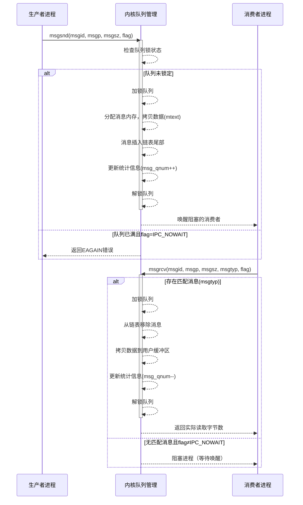
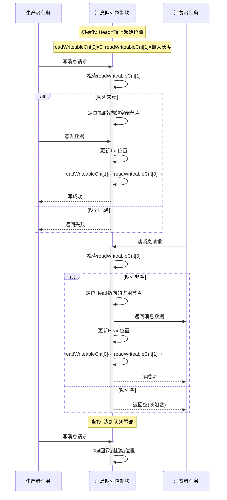
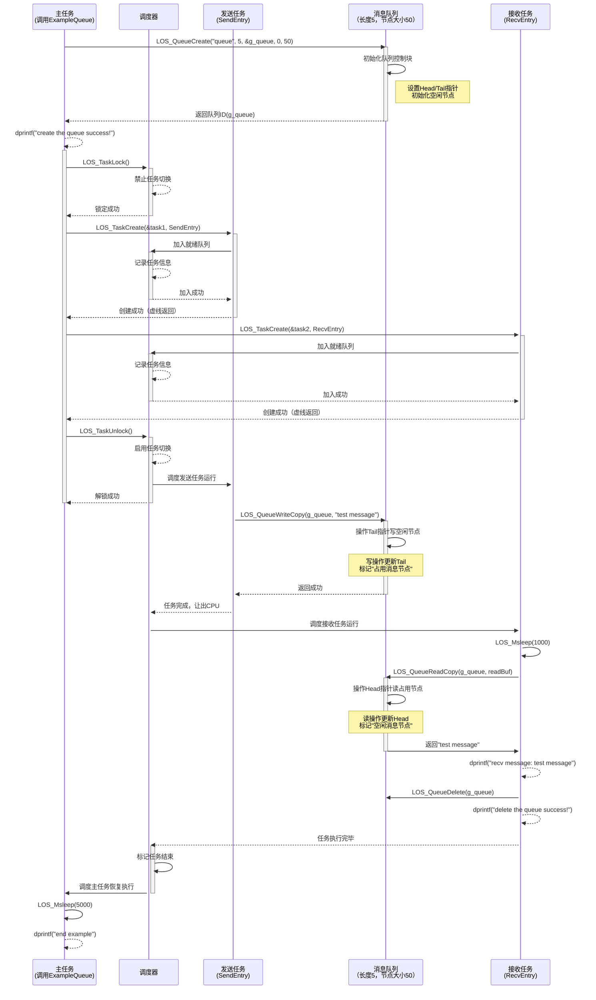
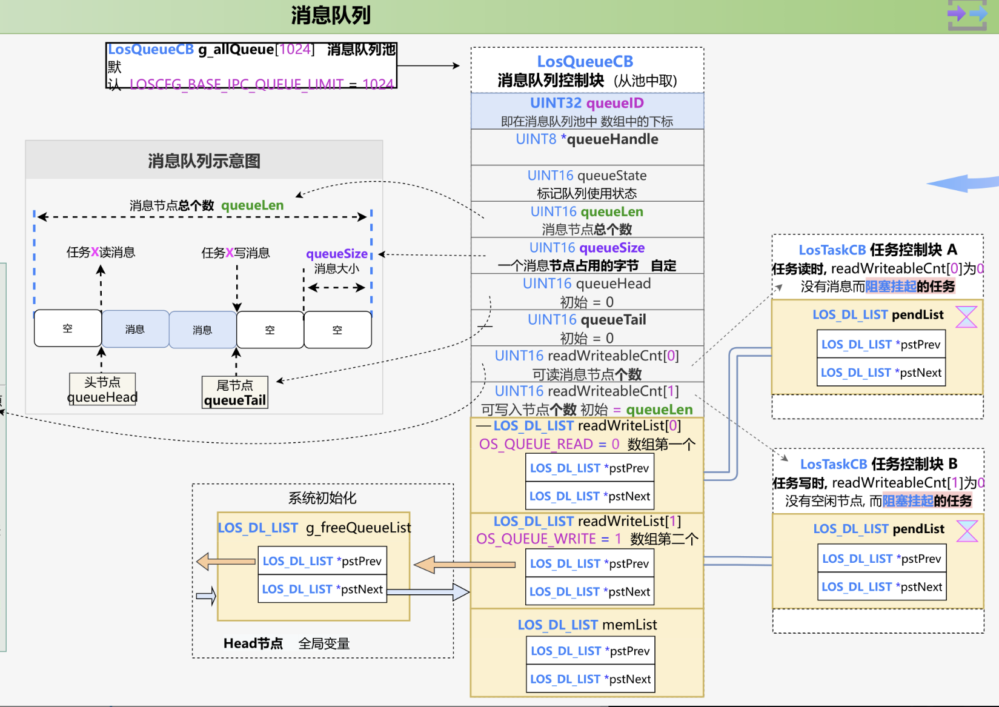

# 消息队列Queue机制与Liteos_a内核Queue机制分析

[TOC]

# 0、一句话总结

​	消息队列是操作系统提供的一种进程间通信（IPC）机制，通过在内核中维护的消息链表结构，允许进程以异步方式发送和接收带有类型标识的消息，实现进程间的数据传输和同步协调。


# 1、消息队列的通用知识点

## 1.1、消息队列的概念

​	消息队列是一种进程间通信或同一进程的不同线程间的通信方式。 从本质上说，消息队列就是一个队列结构的中间件，消息放入这个中间件之后就可以直接返回，并不需要系统立即处理，而另外会有一个程序读取这些数据，并按顺序处理。 

​	消息队列提供一种机制，以便允许进程不必通过共享地址空间来实现通信和同步。 它是由内核管理的一个消息集合，每个消息都有一个类型值，用于区分不同类型的消息。

消息队列的主要特点包括：

- 异步通信 ：发送进程无需等待接收进程立即处理消息 
- 类型化消息 ：每个消息都有类型标识，支持选择性接收
- 内核管理 ：消息存储在内核空间，独立于进程生命周期
- FIFO特性 ：消息按先进先出的顺序处理
- 解耦性 ：生产者与消费者之间通过队列间接通信，降低了系统间的依赖


## 1.2、消息队列的通用结构

```c
// 1、消息队列控制块
struct MessageQueue {
    int qid;                    // 队列标识符
    struct Message *head;       // 队列头指针
    struct Message *tail;       // 队列尾指针
    int count;                  // 消息数量
    int max_size;               // 最大消息数
    pthread_mutex_t lock;       // 互斥锁
    pthread_cond_t not_empty;   // 非空条件变量
    pthread_cond_t not_full;    // 非满条件变量
};

// 消息结构
struct Message {
    long type;                  // 消息类型
    void *data;                 // 消息数据
    size_t size;                // 数据大小
    struct Message *next;       // 下一个消息指针
};
```


## 1.3、消息队列的运行时序图




## 1.4、消息队列关键机制说明

同步机制

- 互斥锁 ：保护队列数据结构的并发访问
- 条件变量 ：实现生产者-消费者同步模式
- 阻塞/非阻塞 ：支持同步和异步操作模式 

消息传递模式

- 点对点 ：一对一消息传递
- 发布订阅 ：一对多消息分发
- 消息类型过滤 ：基于消息类型的选择性接收 

内存管理

- 动态分配 ：根据消息大小动态分配内存
- 缓冲区管理 ：维护消息缓冲区的分配和释放
- 内存回收 ：及时释放已处理消息的内存空间


# 2、Liteos_a内核中消息队列的实现

## 2.1、Liteos_a内核中消息队列的概念

​	队列又称消息队列，是一种常用于任务间通信的数据结构。队列接收来自任务或中断的不固定长度消息，并根据不同的接口确定传递的消息是否存放在队列空间中。

​	任务能够从队列里面读取消息，当队列中的消息为空时，挂起读取任务；当队列中有新消息时，挂起的读取任务被唤醒并处理新消息。任务也能够往队列里写入消息，当队列已经写满消息时，挂起写入任务；当队列中有空闲消息节点时，挂起的写入任务被唤醒并写入消息。

​	可以通过调整读队列和写队列的超时时间来调整读写接口的阻塞模式，如果将读队列和写队列的超时时间设置为0，就不会挂起任务，接口会直接返回，这就是非阻塞模式。反之，如果将读队列和写队列的超时时间设置为大于0的时间，就会以阻塞模式运行。

​	消息队列提供了异步处理机制，允许将一个消息放入队列，但不立即处理。同时队列还有缓冲消息的作用，可以使用队列实现任务异步通信，队列具有如下特性：

- 消息以先进先出的方式排队，支持异步读写。
- 读队列和写队列都支持超时机制。
- 每读取一条消息，就会将该消息节点设置为空闲。
- 发送消息类型由通信双方约定，可以允许不同长度（不超过队列的消息节点大小）的消息。
- 一个任务能够从任意一个消息队列接收和发送消息。
- 多个任务能够从同一个消息队列接收和发送消息。
- 创建队列时所需的队列空间，接口内系统自行动态申请内存。


## 2.2、Liteos_a内核的消息队列运行机制

### 2.2.1、队列控制块

```c
/**
  * 队列控制块数据结构
  */
typedef struct {
    UINT8 *queueHandle; /**< Pointer to a queue handle */
    UINT16 queueState;  /**< Queue state */
    UINT16 queueLen;    /**< Queue length */
    UINT16 queueSize;   /**< Node size */
    UINT32 queueID;     /**< queueID */
    UINT16 queueHead;   /**< Node head */
    UINT16 queueTail;   /**< Node tail */
    UINT16 readWriteableCnt[OS_QUEUE_N_RW];   /**< Count of readable or writable resources, 
    												0:readable, 1:writable */
    LOS_DL_LIST readWriteList[OS_QUEUE_N_RW]; /**< the linked list to be read or written, 
    												0:readlist, 1:writelist */
    LOS_DL_LIST memList;                      /**< Pointer to the memory linked list */
} LosQueueCB;
```

每个队列控制块中都含有队列状态，表示该队列的使用情况：

- OS_QUEUE_UNUSED：队列未被使用。
- OS_QUEUE_INUSED：队列被使用中。


### 2.2.2、队列运作原理

如下所示：

- 创建队列时，创建队列成功会返回队列ID。
- 在队列控制块中维护着一个消息头节点位置Head和一个消息尾节点位置Tail，用于表示当前队列中消息的存储情况。Head表示队列中被占用的消息节点的起始位置。Tail表示被占用的消息节点的结束位置，也是空闲消息节点的起始位置。队列刚创建时，Head和Tail均指向队列起始位置。
- 写队列时，根据readWriteableCnt[1]判断队列是否可以写入，不能对已满（readWriteableCnt[1]为0）队列进行写操作。写队列支持两种写入方式：向队列尾节点写入，也可以向队列头节点写入。尾节点写入时，根据Tail找到起始空闲消息节点作为数据写入对象，如果Tail已经指向队列尾部则采用回卷方式。头节点写入时，将Head的前一个节点作为数据写入对象，如果Head指向队列起始位置则采用回卷方式。
- 读队列时，根据readWriteableCnt[0]判断队列是否有消息需要读取，对全部空闲（readWriteableCnt[0]为0）队列进行读操作会引起任务挂起。如果队列可以读取消息，则根据Head找到最先写入队列的消息节点进行读取。如果Head已经指向队列尾部则采用回卷方式。
- 删除队列时，根据队列ID找到对应队列，把队列状态置为未使用，把队列控制块置为初始状态，并释放队列所占内存。


## 2.3、Liteos_a内核消息队列读写示意图

下图读写队列做了示意，图中只画了尾节点写入方式，没有画头节点写入，但是两者是类似的。


Liteos_a内核中读写消息队列时序图示意：




## 2.4、Liteos_a内核消息队列模块的总结

​	分析到这里，可以看出Liteos_a内核完整的实现了 1.1 ~ 1.3 小节中消息队列所有的通用机制。接下来就借助Liteos_a内核的源代码继续分析，Liteos_a内核是如何通过代码将消息队列的这些机制一一实现的。


# 3、Liteos_a内核消息队列开发案例

## 3.1、接口说明

| 功能分类              | 接口描述                                                     |
| --------------------- | ------------------------------------------------------------ |
| 创建/删除消息队列     | - LOS_QueueCreate：创建一个消息队列，由系统动态申请队列空间 <br />- LOS_QueueDelete：根据队列ID删除一个指定队列 |
| 读/写队列（不带拷贝） | - LOS_QueueRead：读取指定队列头节点中的数据（队列节点中的数据实际上是一个地址） <br />- LOS_QueueWrite：向指定队列尾节点中写入入参bufferAddr的值（即buffer的地址） <br />- LOS_QueueWriteHead：向指定队列头节点中写入入参bufferAddr的值（即buffer的地址） |
| 读/写队列（带拷贝）   | - LOS_QueueReadCopy：读取指定队列头节点中的数据 <br />- LOS_QueueWriteCopy：向指定队列尾节点中写入入参bufferAddr中保存的数据 <br />- LOS_QueueWriteHeadCopy：向指定队列头节点中写入入参bufferAddr中保存的数据 |
| 获取队列信息          | - LOS_QueueInfoGet：获取指定队列的信息，包括队列ID、队列长度、消息节点大小、头节点、尾节点、可读节点数量、可写节点数量、等待读操作的任务、等待写操作的任务 |


## 3.2、开发流程

典型的开发流程为：

* 1、用LOS_QueueCreate创建队列。创建成功后，可以得到队列ID。
* 2、通过LOS_QueueWrite或者LOS_QueueWriteCopy写队列。
* 3、通过LOS_QueueRead或者LOS_QueueReadCopy读队列。
* 4、通过LOS_QueueInfoGet获取队列信息。
* 5、通过LOS_QueueDelete删除队列。

特别说明：

- 系统支持的最大队列数是指：整个系统的队列资源总个数，而非用户能使用的个数。例如：系统软件定时器多占用一个队列资源，那么用户能使用的队列资源就会减少一个。
- 创建队列时传入的队列名和flags暂时未使用，作为以后的预留参数。
- 队列接口函数中的入参timeOut是相对时间。
- LOS_QueueReadCopy和LOS_QueueWriteCopy及LOS_QueueWriteHeadCopy是一组接口，LOS_QueueRead和LOS_QueueWrite及LOS_QueueWriteHead是一组接口，每组接口需要配套使用。
- 鉴于LOS_QueueWrite和LOS_QueueWriteHead和LOS_QueueRead这组接口实际操作的是数据地址，用户必须保证调用LOS_QueueRead获取到的指针所指向的内存区域在读队列期间没有被异常修改或释放，否则可能导致不可预知的后果。
- LOS_QueueRead和LOS_QueueReadCopy接口的读取长度如果小于消息实际长度，消息将被截断。
- 鉴于LOS_QueueWrite和LOS_QueueWriteHead和LOS_QueueRead这组接口实际操作的是数据地址，也就意味着实际写和读的消息长度仅仅是一个指针数据，因此用户使用这组接口之前，需确保创建队列时的消息节点大小，为一个指针的长度，避免不必要的浪费和读取失败。


## 3.3、编程实例

### 3.3.1、实例描述

创建一个队列，两个任务。任务1调用写队列接口发送消息，任务2通过读队列接口接收消息。

* 1、通过LOS_TaskCreate创建任务1和任务2。
* 2、通过LOS_QueueCreate创建一个消息队列。

* 3、在任务1 SendEntry中发送消息。

* 4、在任务2 RecvEntry中接收消息。

* 5、通过LOS_QueueDelete删除队列。


### 3.3.2、编程示例

​	本演示代码在`./kernel/liteos_a/testsuites/kernel/src/osTest.c`中编译验证，在TestTaskEntry中调用验证入口函数ExampleQueue，为方便用户观察，建议调用ExampleQueue前先调用 LOS_Msleep(5000) 进行短时间延时，避免其他打印过多。

示例代码为：

```c
#include "los_task.h"
#include "los_queue.h"
static UINT32 g_queue;
#define BUFFER_LEN 50

VOID SendEntry(VOID)
{
    UINT32 ret = 0;
    CHAR abuf[] = "test message";
    UINT32 len = sizeof(abuf);

    ret = LOS_QueueWriteCopy(g_queue, abuf, len, 0);
    if(ret != LOS_OK) {
        dprintf("send message failure, error: %x\n", ret);
    }
}

VOID RecvEntry(VOID)
{
    UINT32 ret = 0;
    CHAR readBuf[BUFFER_LEN] = {0};
    UINT32 readLen = BUFFER_LEN;

    LOS_Msleep(1000);
    ret = LOS_QueueReadCopy(g_queue, readBuf, &readLen, 0);
    if(ret != LOS_OK) {
        dprintf("recv message failure, error: %x\n", ret);
    }

    dprintf("recv message: %s\n", readBuf);

    ret = LOS_QueueDelete(g_queue);
    if(ret != LOS_OK) {
        dprintf("delete the queue failure, error: %x\n", ret);
    }

    dprintf("delete the queue success!\n");
}

UINT32 ExampleQueue(VOID)
{
    dprintf("start queue example\n");
    UINT32 ret = 0;
    UINT32 task1, task2;
    TSK_INIT_PARAM_S initParam = {0};

    ret = LOS_QueueCreate("queue", 5, &g_queue, 0, 50);
    if(ret != LOS_OK) {
        dprintf("create queue failure, error: %x\n", ret);
    }

    dprintf("create the queue success!\n");

    initParam.pfnTaskEntry = (TSK_ENTRY_FUNC)SendEntry;
    initParam.usTaskPrio = 9;
    initParam.uwStackSize = LOSCFG_BASE_CORE_TSK_DEFAULT_STACK_SIZE;
    initParam.pcName = "SendQueue";

    LOS_TaskLock();
    ret = LOS_TaskCreate(&task1, &initParam);
    if(ret != LOS_OK) {
        dprintf("create task1 failed, error: %x\n", ret);
        LOS_QueueDelete(g_queue);
        return ret;
    }

    initParam.pcName = "RecvQueue";
    initParam.pfnTaskEntry = (TSK_ENTRY_FUNC)RecvEntry;
    ret = LOS_TaskCreate(&task2, &initParam);
    if(ret != LOS_OK) {
        dprintf("create task2 failed, error: %x\n", ret);
        LOS_QueueDelete(g_queue);
        return ret;
    }

    LOS_TaskUnlock();
    LOS_Msleep(5000);
    return ret;
}
```

编译运行得到的结果为：

```bash
start queue example
create the queue success!
recv message: test message
delete the queue success!
```


### 3.3.3、示例时序图




## 3.4、指针拷贝与数值拷贝案例分析

### 3.4.1、指针拷贝

```c
// testsuites\kernel\sample\kernel_base\ipc\queue\full\It_los_queue_008.c
#include "It_los_queue.h"
#ifdef __cplusplus
#if __cplusplus
extern "C" {
#endif /* __cpluscplus */
#endif /* __cpluscplus */

static UINT32 Testcase(VOID)
{
    UINT32 ret;
    CHAR buff1[QUEUE_SHORT_BUFFER_LENGTH] = "UniDSP";
    CHAR buff2[QUEUE_SHORT_BUFFER_LENGTH] = "";

    // 8, Set the node size of the queue.
    ret = LOS_QueueCreate("Q1", 1, &g_testQueueID01, 0, 8); 
    ICUNIT_GOTO_EQUAL(ret, LOS_OK, ret, EXIT);

    // 这里将缓冲区数组buff1的地址 &buff1 传入
    // 在LOS_QueueWrite中
    //     return LOS_QueueWriteCopy(queueID, &bufferAddr, bufferSize, timeout);
    // 将&bufferAddr == &(&buff1)，即指向指针的指针传入LOS_QueueWriteCopy
    // 在LOS_QueueWriteCopy中就是将buff1数组的地址写入队列中的一个消息当中
    // 8, Write the setting size of queue buffer.
    ret = LOS_QueueWrite(g_testQueueID01, &buff1, 8, 0); 
    ICUNIT_GOTO_EQUAL(ret, LOS_OK, ret, EXIT);

    // LOS_QueueRead这里最终会执行：
    //     if (memcpy_s(bufferAddr, *bufferSize, queueNode, msgDataSize) != EOK) {
    // 是将上一步骤当中指向缓冲区buff1的地址，比如是0xxxxxxxxx，存入buff2当中
    // 如果buff2的地址为0xyyyyyyyy，那么0xyyyyyyyy内存中存储的值就是0xxxxxxxxx
	// 8, Read the setting size of queue buffer.
    ret = LOS_QueueRead(g_testQueueID01, &buff2, 8, 0); 
    ICUNIT_GOTO_EQUAL(ret, LOS_OK, ret, EXIT);

    ret = LOS_QueueDelete(g_testQueueID01);
    ICUNIT_ASSERT_EQUAL(ret, LOS_OK, ret);

    return LOS_OK;

EXIT:
    ret = LOS_QueueDelete(g_testQueueID01);
    ICUNIT_ASSERT_EQUAL(ret, LOS_OK, ret);
    return LOS_OK;
}

VOID ItLosQueue008(VOID)
{
    TEST_ADD_CASE("ItLosQueue008", Testcase, TEST_LOS, TEST_QUE, 
                  TEST_LEVEL2, TEST_FUNCTION);
}

#ifdef __cplusplus
#if __cplusplus
}
#endif /* __cpluscplus */
#endif /* __cpluscplus */

```


### 3.4.2、数值拷贝

```c
// testsuites\kernel\sample\kernel_base\ipc\queue\full\It_los_queue_112.c
#include "It_los_queue.h"
#ifdef __cplusplus
#if __cplusplus
extern "C" {
#endif /* __cpluscplus */
#endif /* __cpluscplus */

#define QUEUE_SHORT_BUFFER_LENGTH	12

static VOID TaskF01(VOID)
{
    UINT32 ret;
    CHAR buff1[QUEUE_SHORT_BUFFER_LENGTH] = "UniDSP";
    CHAR buff2[QUEUE_SHORT_BUFFER_LENGTH] = "";
    UINT32 readSize;

    // QUEUE_SHORT_BUFFER_LENGTH 定义了每条消息的最大值
    ret = LOS_QueueCreate("Q1", 3, &g_testQueueID01, 
                          0, QUEUE_SHORT_BUFFER_LENGTH); // 3, Set the queue length.
    ICUNIT_GOTO_EQUAL(ret, LOS_OK, ret, EXIT);

    TEST_HwiClear(HWI_NUM_TEST);

    g_testCount++;
    // 这里使用的是 LOS_QueueWriteCopy 函数
    // 传入 &buff1 作为数据源地址
    // QUEUE_SHORT_BUFFER_LENGTH 指定了要复制的数据大小
    // 函数会将 buff1 中的实际数据内容（"UniDSP"字符串）复制到队列中
    ret = LOS_QueueWriteCopy(g_testQueueID01, &buff1, QUEUE_SHORT_BUFFER_LENGTH, 0);
    ICUNIT_GOTO_EQUAL(ret, LOS_OK, ret, EXIT);
    // 使用 LOS_QueueReadCopy 函数
    // 传入 &buff2 作为目标缓冲区地址
    // &readSize 用于接收实际读取的数据大小
    // 函数会将队列中的数据内容复制到 buff2 中
    readSize = QUEUE_SHORT_BUFFER_LENGTH;
    ret = LOS_QueueReadCopy(g_testQueueID01, &buff2, &readSize, 0);
    ICUNIT_GOTO_EQUAL(ret, LOS_OK, ret, EXIT);

    // 执行完LOS_QueueWriteCopy和LOS_QueueReadCopy代码后：
    // buff1 保持不变，仍然是 "UniDSP"
    // buff2 被填充为 "UniDSP"，即队列中存储的数据内容
    // readSize 被设置为实际读取的数据大小
    
g_testCount++;

    LOS_TaskDelete(g_testTaskID01);

    return;
EXIT:
    g_testCount = 0;
    LOS_TaskDelete(g_testTaskID01);
}
```


# 4、Liteos_a内核消息队列的源码分析

## 4.1、消息队列控制块 LosQueueCB

```c
// 队列控制块数据结构
typedef struct {
    UINT8 *queueHandle; /**< Pointer to a queue handle */
    UINT16 queueState;  /**< Queue state */
    UINT16 queueLen;    /**< Queue length */
    UINT16 queueSize;   /**< Node size */
    UINT32 queueID;     /**< queueID */
    UINT16 queueHead;   /**< Node head */
    UINT16 queueTail;   /**< Node tail */
    UINT16 readWriteableCnt[OS_QUEUE_N_RW];   /**< Count of readable or writable resources, 
    												0:readable, 1:writable */
    LOS_DL_LIST readWriteList[OS_QUEUE_N_RW]; /**< the linked list to be read or written, 
    												0:readlist, 1:writelist */
    LOS_DL_LIST memList;                      /**< Pointer to the memory linked list */
} LosQueueCB;

//	每个队列控制块中都含有队列状态，表示该队列的使用情况：
// 	- OS_QUEUE_UNUSED：队列未被使用。
// 	- OS_QUEUE_INUSED：队列被使用中。
```


## 4.2、初始化消息队列 OsQueueInit

初始化之后的示意图：



OsQueueInit 函数：

```c
/*
    1、传入 队列全局空闲链表g_freeQueueList
    2、调用OsAllQueueCBInit返回所有队列控制块的起始地址g_allQueue
*/
LITE_OS_SEC_TEXT_INIT UINT32 OsQueueInit(VOID)
{
#ifndef LOSCFG_IPC_CONTAINER
    g_allQueue = OsAllQueueCBInit(&g_freeQueueList);
    if (g_allQueue == NULL) {
        return LOS_ERRNO_QUEUE_NO_MEMORY;
    }
#endif
    return LOS_OK;
}
```

其中 OsAllQueueCBInit 函数：

```c
// kernel\common\los_config.h
/**
 * @ingroup los_config
 * Maximum supported number of queues rather than the number of usable queues
 */
#ifndef LOSCFG_BASE_IPC_QUEUE_LIMIT
#define LOSCFG_BASE_IPC_QUEUE_LIMIT 1024
#endif

// kernel\base\ipc\los_queue.c
LITE_OS_SEC_BSS LosQueueCB *g_allQueue = NULL;
LITE_OS_SEC_BSS STATIC LOS_DL_LIST g_freeQueueList;
#define FREE_QUEUE_LIST g_freeQueueList

/*
    1、分配队列池：分配内存
    2、初始化队列池中的每一个队列控制块：设置队列的ID索引
    3、将每一个队列的queueNode->readWriteList[OS_QUEUE_WRITE]
       挂到全局队列空闲链表freeQueueList中
*/
LITE_OS_SEC_TEXT_INIT LosQueueCB *OsAllQueueCBInit(LOS_DL_LIST *freeQueueList)
{
    UINT32 index;

    // 参数检查：确保空闲队列链表指针有效
    if (freeQueueList == NULL) {
        return NULL;
    }

    // 计算需要分配的内存大小：队列控制块数量 * 每个控制块的大小
    // LOSCFG_BASE_IPC_QUEUE_LIMIT默认1024
    UINT32 size = LOSCFG_BASE_IPC_QUEUE_LIMIT * sizeof(LosQueueCB);
    /* system resident memory, don't free */
    // 从系统内存池m_aucSysMem0分配内存，这是系统常驻内存，不会被释放
    LosQueueCB *allQueue = (LosQueueCB *)LOS_MemAlloc(m_aucSysMem0, size);
    if (allQueue == NULL) {
        return NULL;
    }
    // 使用安全的内存设置函数将分配的内存清零
    (VOID)memset_s(allQueue, size, 0, size);
    // 初始化空闲队列链表头
    LOS_ListInit(freeQueueList);
    // 遍历所有队列控制块，进行初始化并添加到空闲队列链表中
    for (index = 0; index < LOSCFG_BASE_IPC_QUEUE_LIMIT; index++) {
        // 获取当前队列控制块的指针
        LosQueueCB *queueNode = ((LosQueueCB *)allQueue) + index;
        // 设置队列ID为索引值
        queueNode->queueID = index;
        // 将队列控制块添加到空闲队列链表尾部
        // 注意：这里使用readWriteList[OS_QUEUE_WRITE]作为链表节点
        // 这是因为队列控制块中的readWriteList字段是一个双向链表数组        
        LOS_ListTailInsert(freeQueueList, &queueNode->readWriteList[OS_QUEUE_WRITE]);
    }

#ifndef LOSCFG_IPC_CONTAINER
    // 调用队列调试初始化钩子函数
    // 如果钩子函数初始化失败，则释放已分配的内存并返回NULL
    if (OsQueueDbgInitHook() != LOS_OK) {
        (VOID)LOS_MemFree(m_aucSysMem0, allQueue);
        return NULL;
    }
#endif
    // 返回队列控制块数组的首地址
    return allQueue;
}
```


## 4.3、创建消息队列 LOS_QueueCreate

```c
/*
    1、参数检查 ：验证输入参数的有效性
    2、内存分配 ：为队列数据缓冲区分配内存
    3、获取队列控制块 ：从预先初始化的空闲队列控制块池中获取一个控制块
    4、初始化队列控制块 ：设置队列的各种属性和状态
    5、返回队列ID ：将创建的队列ID返回给调用者
*/
LITE_OS_SEC_TEXT_INIT UINT32 LOS_QueueCreate(CHAR *queueName, UINT16 len, UINT32 *queueID,
                                             UINT32 flags, UINT16 maxMsgSize)
{
    LosQueueCB *queueCB = NULL;
    UINT32 intSave;
    LOS_DL_LIST *unusedQueue = NULL;
    UINT8 *queue = NULL;
    UINT16 msgSize;

    // 忽略队列名称和标志参数，当前实现中未使用这些参数
    (VOID)queueName;
    (VOID)flags;

    // 参数检查：队列ID指针不能为空
    if (queueID == NULL) {
        return LOS_ERRNO_QUEUE_CREAT_PTR_NULL;
    }

    // 参数检查：消息大小不能超过最大限制
    // OS_NULL_SHORT通常是0xFFFF，减去sizeof(UINT32)=4是为了在每个消息末尾预留存储消息大小的空间
    // 每条消息最大数据传递长度为：65535 - 4 = 65531个字节
    if (maxMsgSize > (OS_NULL_SHORT - sizeof(UINT32))) {
        return LOS_ERRNO_QUEUE_SIZE_TOO_BIG;
    }

    // 参数检查：队列长度和消息大小不能为0
    if ((len == 0) || (maxMsgSize == 0)) {
        return LOS_ERRNO_QUEUE_PARA_ISZERO;
    }

    // 计算实际每条消息占用的空间大小 = 用户数据大小 + 消息大小字段(UINT32)
    msgSize = maxMsgSize + sizeof(UINT32);

    /*
     * 内存分配是耗时操作，为了缩短禁用中断的时间，
     * 将内存分配放在进入临界区之前进行
     */
    // 从动态内存池m_aucSysMem1分配队列数据缓冲区
    // 总大小 = 队列长度 * 每条消息大小    
    queue = (UINT8 *)LOS_MemAlloc(m_aucSysMem1, (UINT32)len * msgSize);
    if (queue == NULL) {
        return LOS_ERRNO_QUEUE_CREATE_NO_MEMORY;
    }

    // 进入临界区，禁用调度
    SCHEDULER_LOCK(intSave);
    // 检查是否有空闲的队列控制块
    if (LOS_ListEmpty(&FREE_QUEUE_LIST)) {
        // 如果没有空闲队列控制块，解锁调度器并释放已分配的内存
        SCHEDULER_UNLOCK(intSave);
        OsQueueCheckHook();
        // 释放已分配的队列数据缓冲区
        (VOID)LOS_MemFree(m_aucSysMem1, queue);
        return LOS_ERRNO_QUEUE_CB_UNAVAILABLE;
    }

    // 从空闲队列链表中获取第一个节点
    unusedQueue = LOS_DL_LIST_FIRST(&FREE_QUEUE_LIST);
    // 从空闲链表中删除该节点
    LOS_ListDelete(unusedQueue);
    // 通过链表节点获取队列控制块
    // GET_QUEUE_LIST是一个宏，用于从链表节点指针获取队列控制块指针    
    queueCB = GET_QUEUE_LIST(unusedQueue);
    // 初始化队列控制块的各个字段
    queueCB->queueLen = len;// 设置队列长度
    queueCB->queueSize = msgSize;// 设置每条消息的大小
    queueCB->queueHandle = queue;// 设置队列数据缓冲区指针
    queueCB->queueState = OS_QUEUE_INUSED;// 设置队列状态为使用中
    queueCB->readWriteableCnt[OS_QUEUE_READ] = 0;// 可读消息数初始化为0
    queueCB->readWriteableCnt[OS_QUEUE_WRITE] = len; // 可写消息数量，初始化为队列长度
    queueCB->queueHead = 0;// 队列头指针初始化为0
    queueCB->queueTail = 0; // 队列尾指针初始化为0
    // 初始化队列的读写等待链表
    LOS_ListInit(&queueCB->readWriteList[OS_QUEUE_READ]);// 初始化读等待链表
    LOS_ListInit(&queueCB->readWriteList[OS_QUEUE_WRITE]);// 初始化写等待链表
    LOS_ListInit(&queueCB->memList);// 初始化内存等待链表

    // 调用队列调试更新钩子函数，记录创建队列的任务入口点
    OsQueueDbgUpdateHook(queueCB->queueID, OsCurrTaskGet()->taskEntry);
    // 退出临界区，恢复调度
    SCHEDULER_UNLOCK(intSave);

    // 将队列ID返回给调用者
    *queueID = queueCB->queueID;
    // 调用钩子函数，通知队列创建事件
    OsHookCall(LOS_HOOK_TYPE_QUEUE_CREATE, queueCB);
    return LOS_OK;
}
```


## 4.4、删除消息队列 LOS_QueueDelete

```c
/*
    1、参数检查阶段
    2、临界区保护和队列状态检查
    3、检查队列是否正在被任务使用
    4、检查队列是否处于一致状态
    5、释放队列资源
    6、错误处理
*/
LITE_OS_SEC_TEXT_INIT UINT32 LOS_QueueDelete(UINT32 queueID)
{
    LosQueueCB *queueCB = NULL;
    UINT8 *queue = NULL;
    UINT32 intSave;
    UINT32 ret;

    // 检查队列ID是否有效，如果索引超出范围则返回错误
    // GET_QUEUE_INDEX(queueID)取出队列ID的低16位中的索引
    if (GET_QUEUE_INDEX(queueID) >= LOSCFG_BASE_IPC_QUEUE_LIMIT) {
        return LOS_ERRNO_QUEUE_NOT_FOUND;
    }

    // 进入临界区，禁用调度
    SCHEDULER_LOCK(intSave);
    // 获取队列控制块
    queueCB = (LosQueueCB *)GET_QUEUE_HANDLE(queueID);
    // 检查队列是否存在且处于使用状态
    if ((queueCB->queueID != queueID) || (queueCB->queueState == OS_QUEUE_UNUSED)) {
        ret = LOS_ERRNO_QUEUE_NOT_CREATE;
        goto QUEUE_END;
    }

    // 检查是否有任务正在等待从队列读取数据
    if (!LOS_ListEmpty(&queueCB->readWriteList[OS_QUEUE_READ])) {
        ret = LOS_ERRNO_QUEUE_IN_TSKUSE;
        goto QUEUE_END;
    }

    // 检查是否有任务正在等待向队列写入数据
    if (!LOS_ListEmpty(&queueCB->readWriteList[OS_QUEUE_WRITE])) {
        ret = LOS_ERRNO_QUEUE_IN_TSKUSE;
        goto QUEUE_END;
    }

    // 检查是否有任务正在等待队列内存
    if (!LOS_ListEmpty(&queueCB->memList)) {
        ret = LOS_ERRNO_QUEUE_IN_TSKUSE;
        goto QUEUE_END;
    }

    // 检查队列的可读计数和可写计数之和是否等于队列长度
    // 如果不等于，说明队列处于不一致状态，可能有任务正在操作队列
    if ((queueCB->readWriteableCnt[OS_QUEUE_WRITE] + 
         queueCB->readWriteableCnt[OS_QUEUE_READ]) != queueCB->queueLen) {
        ret = LOS_ERRNO_QUEUE_IN_TSKWRITE;
        goto QUEUE_END;
    }

    // 保存队列数据缓冲区指针，用于后续释放内存
    queue = queueCB->queueHandle;
    // 清空队列控制块中的队列数据缓冲区指针
    queueCB->queueHandle = NULL;
    // 将队列状态设置为未使用
    queueCB->queueState = OS_QUEUE_UNUSED;
    // 更新队列ID，增加计数部分，保持索引部分不变
    // 这样做是为了防止在删除队列后立即创建新队列时出现ID冲突
    // 队列ID的高16位存放版本号，低16位存放索引    
    queueCB->queueID = SET_QUEUE_ID(GET_QUEUE_COUNT(queueCB->queueID) + 1, 
                                    GET_QUEUE_INDEX(queueCB->queueID));
    OsQueueDbgUpdateHook(queueCB->queueID, NULL);

    // 将队列控制块插入到空闲队列链表尾部，使其可以被重新使用
    LOS_ListTailInsert(&FREE_QUEUE_LIST, &queueCB->readWriteList[OS_QUEUE_WRITE]);
    // 退出临界区，恢复调度
    SCHEDULER_UNLOCK(intSave);
    OsHookCall(LOS_HOOK_TYPE_QUEUE_DELETE, queueCB);
    // 释放队列数据缓冲区内存
    ret = LOS_MemFree(m_aucSysMem1, (VOID *)queue);
    return ret;

QUEUE_END:
    SCHEDULER_UNLOCK(intSave);
    return ret;
}
```


## 4.5、读消息队列 LOS_QueueRead

```c
// 和LOS_QueueReadCopy区别
// LOS_QueueRead：bufferSize是值传递
// LOS_QueueReadCopy: &bufferSize是指针传递
LITE_OS_SEC_TEXT UINT32 
LOS_QueueRead(UINT32 queueID, VOID *bufferAddr, UINT32 bufferSize, UINT32 timeout)
{
    // 调用LOS_QueueReadCopy函数实现队列读取功能
    // 将bufferSize的地址传递给LOS_QueueReadCopy，使其能够返回实际读取的数据大小
    return LOS_QueueReadCopy(queueID, bufferAddr, &bufferSize, timeout);
}

```

其中的 LOS_QueueReadCopy 函数：

```c
/*
    1、检查读取参数的有效性
    2、构造操作类型：读操作 + 从队列头部读取
    3、调用队列操作函数执行实际的读取操作
*/
LITE_OS_SEC_TEXT UINT32 
LOS_QueueReadCopy(UINT32 queueID, VOID *bufferAddr, UINT32 *bufferSize, UINT32 timeout)
{
    UINT32 ret;
    UINT32 operateType;

    // 检查读取参数的有效性
    ret = OsQueueReadParameterCheck(queueID, bufferAddr, bufferSize, timeout);
    if (ret != LOS_OK) {
        return ret;
    }

    // 构造操作类型：读操作 + 从队列头部读取
    // OS_QUEUE_READ表示读操作，OS_QUEUE_HEAD表示队列头部
    // 在层函数会校验operateType[1:0]两位，[1]表示Head O rTail，[0]表示Read Or Write
    operateType = OS_QUEUE_OPERATE_TYPE(OS_QUEUE_READ, OS_QUEUE_HEAD);
    // 调用队列操作函数执行实际的读取操作
    return OsQueueOperate(queueID, operateType, bufferAddr, bufferSize, timeout);
}
```

其中的 OsQueueOperate 函数：

```c
/*
    1、进入临界区保护
    2、参数检查
    3、检查队列状态（是否有可读/可写消息）
    4、如需等待，将任务加入等待链表
    5、执行实际的数据读写操作
    6、唤醒等待相反操作的任务（如有）
    7、更新队列状态
    8、退出临界区
*/
UINT32 OsQueueOperate(UINT32 queueID, UINT32 operateType, 
                      VOID *bufferAddr, UINT32 *bufferSize, UINT32 timeout)
{
    UINT32 ret;
    // 从操作类型中提取读写标志
    UINT32 readWrite = OS_QUEUE_READ_WRITE_GET(operateType);
    UINT32 intSave;
    // 调用钩子函数，通知队列读取事件
    OsHookCall(LOS_HOOK_TYPE_QUEUE_READ, (LosQueueCB *)GET_QUEUE_HANDLE(queueID), 
               operateType, *bufferSize, timeout);

    // 进入临界区，禁用调度
    SCHEDULER_LOCK(intSave);

    // 获取队列控制块
    LosQueueCB *queueCB = (LosQueueCB *)GET_QUEUE_HANDLE(queueID);
    // 检查队列操作参数
    ret = OsQueueOperateParamCheck(queueCB, queueID, operateType, bufferSize);
    if (ret != LOS_OK) {
        goto QUEUE_END;
    }

    // 检查队列是否有可读/可写的消息
    //   readWrite == 0时表示读队列
    //   readWrite == 1时表示写队列
    // queueCB->readWriteableCnt[readWrite] == 0 表示无可读可写的消息
    if (queueCB->readWriteableCnt[readWrite] == 0) {
        // 如果没有可读/可写的消息，且不等待，则返回队列空/满错误
        if (timeout == LOS_NO_WAIT) {
            ret = OS_QUEUE_IS_READ(operateType) ? \
									LOS_ERRNO_QUEUE_ISEMPTY : \
									LOS_ERRNO_QUEUE_ISFULL;
            goto QUEUE_END;
        }

        // 检查当前是否可以进行抢占调度
        // 如果在锁调度的状态下，不能进行阻塞等待
        if (!OsPreemptableInSched()) {
            ret = LOS_ERRNO_QUEUE_PEND_IN_LOCK;
            goto QUEUE_END;
        }

        // 获取当前运行的任务
        LosTaskCB *runTask = OsCurrTaskGet();
        // 设置任务的等待状态和等待队列ID
        OsTaskWaitSetPendMask(OS_TASK_WAIT_QUEUE, queueCB->queueID, timeout);
        // 将任务加入队列的等待链表，并进入等待状态
        ret = runTask->ops->wait(runTask, &queueCB->readWriteList[readWrite], timeout);
        // 如果等待超时，转换错误码并返回
        if (ret == LOS_ERRNO_TSK_TIMEOUT) {
            ret = LOS_ERRNO_QUEUE_TIMEOUT;
            goto QUEUE_END;
        }
    } else {
        // 如果有可读/可写的消息，减少可读/可写计数
        queueCB->readWriteableCnt[readWrite]--;
    }

    // 执行实际的队列缓冲区操作（读取或写入数据）
    OsQueueBufferOperate(queueCB, operateType, bufferAddr, bufferSize);

    // 检查是否有任务在等待相反操作（读等待写，写等待读）
    // 当前为读队列时，查看写队列的等待链表是否不为空
    if (!LOS_ListEmpty(&queueCB->readWriteList[!readWrite])) {
        // 获取等待链表中的第一个任务
        LosTaskCB *resumedTask = 
				OS_TCB_FROM_PENDLIST(LOS_DL_LIST_FIRST(&queueCB->readWriteList[!readWrite]));
        // 清除任务的等待状态
        OsTaskWakeClearPendMask(resumedTask);
        // 唤醒等待任务
        resumedTask->ops->wake(resumedTask);
        // 退出临界区
        SCHEDULER_UNLOCK(intSave);
        // 多处理器环境下，通知所有CPU进行调度
        LOS_MpSchedule(OS_MP_CPU_ALL);
        LOS_Schedule();
        // 触发任务调度
        return LOS_OK;
    } else {
        // 如果没有任务等待，增加相反操作的可读/可写计数
        // 即当前为读队列，那么没有任务等待写队列时，读完之后将可写的消息数量加一
        queueCB->readWriteableCnt[!readWrite]++;
    }

QUEUE_END:
    SCHEDULER_UNLOCK(intSave);
    return ret;
}
```

其中的 OsQueueBufferOperate 函数：

```c
/*
    1、根据操作类型确定队列位置并更新队列指针
    2、计算队列节点的内存地址
    3、根据操作类型执行读或写操作：
        读操作：读取消息大小，复制消息内容到用户缓冲区
        写操作：复制用户数据到队列节点，存储消息大小
*/
STATIC VOID OsQueueBufferOperate(LosQueueCB *queueCB, UINT32 operateType, 
                                 VOID *bufferAddr, UINT32 *bufferSize)
{
    UINT8 *queueNode = NULL;
    UINT32 msgDataSize;
    UINT16 queuePosition;

    /* get the queue position */
    /* 根据操作类型确定队列位置 */
    switch (OS_QUEUE_OPERATE_GET(operateType)) {
        case OS_QUEUE_READ_HEAD:
            // 从队列头部读取，获取当前头部位置
            queuePosition = queueCB->queueHead;
            // 头部指针前移，如果到达队列末尾则回到开始位置（循环队列）
            ((queueCB->queueHead + 1) == queueCB->queueLen) ? \
                (queueCB->queueHead = 0) : (queueCB->queueHead++);
            break;
        case OS_QUEUE_WRITE_HEAD:
            // 向队列头部写入，头部指针后移
            (queueCB->queueHead == 0) ? \
                (queueCB->queueHead = queueCB->queueLen - 1) : (--queueCB->queueHead);
            // 获取新的头部位置
            queuePosition = queueCB->queueHead;
            break;
        case OS_QUEUE_WRITE_TAIL:
            // 向队列尾部写入，获取当前尾部位置
            queuePosition = queueCB->queueTail;
            // 尾部指针前移，如果到达队列末尾则回到开始位置（循环队列）
            ((queueCB->queueTail + 1) == queueCB->queueLen) ? \
                (queueCB->queueTail = 0) : (queueCB->queueTail++);
            break;
        default:  /* read tail, reserved. */
            /* 从尾部读取，保留功能 */
            PRINT_ERR("invalid queue operate type!\n");
            return;
    }

    // 计算队列节点的内存地址
    queueNode = &(queueCB->queueHandle[(queuePosition * (queueCB->queueSize))]);

    if (OS_QUEUE_IS_READ(operateType)) {
        // 读操作：从队列节点读取数据

        // 首先读取消息大小（存储在消息末尾）
        if (memcpy_s(&msgDataSize, sizeof(UINT32), 
                     queueNode + queueCB->queueSize - sizeof(UINT32),
            sizeof(UINT32)) != EOK) {
            PRINT_ERR("get msgdatasize failed\n");
            return;
        }
        // 取用户缓冲区大小和消息实际大小的较小值
        msgDataSize = (*bufferSize < msgDataSize) ? *bufferSize : msgDataSize;
        // 将消息内容复制到用户缓冲区
        if (memcpy_s(bufferAddr, *bufferSize, queueNode, msgDataSize) != EOK) {
            PRINT_ERR("copy message to buffer failed\n");
            return;
        }

        // 返回实际读取的数据大小
        *bufferSize = msgDataSize;
    } else {
        // 写操作：向队列节点写入数据

        // 将用户数据复制到队列节点
        // 这里没有校验数据的大小，因为在更高层的函数中校验过了
        if (memcpy_s(queueNode, queueCB->queueSize, bufferAddr, *bufferSize) != EOK) {
            PRINT_ERR("store message failed\n");
            return;
        }
        // 将消息大小存储在消息末尾
        if (memcpy_s(queueNode + queueCB->queueSize - sizeof(UINT32), 
					 sizeof(UINT32), bufferSize,
            sizeof(UINT32)) != EOK) {
            PRINT_ERR("store message size failed\n");
            return;
        }
    }
}
```


## 4.6、读消息队列 LOS_QueueWrite

```c
// 和LOS_QueueWriteCopy区别
// LOS_QueueWrite：bufferAddr是指向缓冲区的指针,bufferSize是缓冲区的大小
//                  队列只存储指针，原始数据的内存管理由应用负责
// LOS_QueueWriteCopy: &bufferAddr是指向缓冲区指针的地址，bufferSize是指向bufferAddr指针的大小
//                  队列负责存储数据的完整副本
LITE_OS_SEC_TEXT UINT32 
LOS_QueueWrite(UINT32 queueID, VOID *bufferAddr, UINT32 bufferSize, UINT32 timeout)
{
    // 检查缓冲区地址是否为空，如果为空则返回错误码
    if (bufferAddr == NULL) {
        return LOS_ERRNO_QUEUE_WRITE_PTR_NULL;
    }
    // 将bufferSize设置为指针大小，因为这里只传递指针而非实际数据
    // 这是与LOS_QueueWriteCopy的主要区别，LOS_QueueWrite只传递指针    
    bufferSize = sizeof(CHAR *);
    // 调用LOS_QueueWriteCopy函数，但传入的是bufferAddr的地址，即指针的指针
    // 这样队列中存储的是指针值，而非指针指向的数据    
    return LOS_QueueWriteCopy(queueID, &bufferAddr, bufferSize, timeout);
}
```

其中 LOS_QueueWriteCopy 函数：

```c
/*
    1、向指定队列的尾部写入数据，并复制数据内容
    2、执行参数检查、构造操作类型，然后调用底层操作函数
*/
LITE_OS_SEC_TEXT UINT32 
LOS_QueueWriteCopy(UINT32 queueID, VOID *bufferAddr, UINT32 bufferSize, UINT32 timeout)
{
    UINT32 ret;
    UINT32 operateType;

    // 调用参数检查函数，验证队列ID、缓冲区地址、缓冲区大小和超时参数
    // 注意这里传递的是bufferSize的地址，使得函数可以修改bufferSize的值
    ret = OsQueueWriteParameterCheck(queueID, bufferAddr, &bufferSize, timeout);
    if (ret != LOS_OK) {
        return ret;
    }

    // 构造操作类型：写操作 + 队列尾部
    // OS_QUEUE_WRITE表示写操作，OS_QUEUE_TAIL表示队列尾部    
    operateType = OS_QUEUE_OPERATE_TYPE(OS_QUEUE_WRITE, OS_QUEUE_TAIL);
    // 调用队列操作函数执行实际的写入操作
    // 传递bufferSize的地址，使得函数可以返回实际写入的数据大小    
    return OsQueueOperate(queueID, operateType, bufferAddr, &bufferSize, timeout);
}
```

其中 OsQueueOperate 函数看 第4.5小节的分析。


## 4.7、获取消息队列信息 LOS_QueueInfoGet

```c
/*
    - 参数验证 ：检查输入参数的有效性
    - 临界区保护 ：确保获取队列信息的过程不被中断
    - 队列状态检查 ：验证队列是否存在且处于使用状态
    - 基本信息收集 ：获取队列的基本属性（长度、大小、头尾指针等）
    - 等待任务信息收集 ：使用位图记录等待队列操作的任务
    - 安全退出 ：无论成功与否，都确保正确退出临界区
*/
LITE_OS_SEC_TEXT_MINOR UINT32 LOS_QueueInfoGet(UINT32 queueID, QUEUE_INFO_S *queueInfo)
{
    UINT32 intSave;
    UINT32 ret = LOS_OK;
    LosQueueCB *queueCB = NULL;
    LosTaskCB *tskCB = NULL;

    // 检查队列信息结构体指针是否为空
    if (queueInfo == NULL) {
        return LOS_ERRNO_QUEUE_PTR_NULL;
    }

    // 检查队列ID是否有效（ID低16位索引是否在范围内）
    if (GET_QUEUE_INDEX(queueID) >= LOSCFG_BASE_IPC_QUEUE_LIMIT) {
        return LOS_ERRNO_QUEUE_INVALID;
    }

    // 清空队列信息结构体
    (VOID)memset_s((VOID *)queueInfo, sizeof(QUEUE_INFO_S), 0, sizeof(QUEUE_INFO_S));
    SCHEDULER_LOCK(intSave);

    // 获取队列控制块
    queueCB = (LosQueueCB *)GET_QUEUE_HANDLE(queueID);
    // 检查队列是否存在且处于使用状态
    // 这里队列ID高16位存放版本号，队列被释放之后再次使用版本号会更新
    if ((queueCB->queueID != queueID) || (queueCB->queueState == OS_QUEUE_UNUSED)) {
        ret = LOS_ERRNO_QUEUE_NOT_CREATE;
        goto QUEUE_END;
    }

    // 填充队列基本信息
    queueInfo->uwQueueID = queueID;// 填充队列ID
    queueInfo->usQueueLen = queueCB->queueLen;// 填充队列长度（可容纳的消息数量）
    queueInfo->usQueueSize = queueCB->queueSize;// 填充每条消息的大小
    queueInfo->usQueueHead = queueCB->queueHead;// 填充队列头指针位置
    queueInfo->usQueueTail = queueCB->queueTail; // 填充队列尾指针位置
    queueInfo->usReadableCnt = 
        queueCB->readWriteableCnt[OS_QUEUE_READ];// 填充可读消息数量OS_QUEUE_READ=0
    queueInfo->usWritableCnt = 
        queueCB->readWriteableCnt[OS_QUEUE_WRITE];// 填充可写消息数量OS_QUEUE_WRITE=1
   
    // 遍历等待读取队列的任务列表
    // LOS_DL_LIST_FOR_EACH_ENTRY是一个宏，用于遍历双向链表中的每个元素
    LOS_DL_LIST_FOR_EACH_ENTRY(tskCB, &queueCB->readWriteList[OS_QUEUE_READ], 
                               LosTaskCB, pendList) {
        // 使用位操作记录等待读取的任务ID
        // 每个任务对应一个位，1ULL表示无符号长长整型的1
        queueInfo->uwWaitReadTask |= 1ULL << tskCB->taskID;
    }

    // 遍历等待写入队列的任务列表
    LOS_DL_LIST_FOR_EACH_ENTRY(tskCB, &queueCB->readWriteList[OS_QUEUE_WRITE], 
                               LosTaskCB, pendList) {
        // 使用位操作记录等待写入的任务ID
        queueInfo->uwWaitWriteTask |= 1ULL << tskCB->taskID;
    }

    // 遍历等待队列内存的任务列表
    LOS_DL_LIST_FOR_EACH_ENTRY(tskCB, &queueCB->memList, LosTaskCB, pendList) {
        // 使用位操作记录等待内存的任务ID
        queueInfo->uwWaitMemTask |= 1ULL << tskCB->taskID;
    }

QUEUE_END:
    SCHEDULER_UNLOCK(intSave);
    return ret;
}
```


# 5、对消息队列机制的思考

## 5.1、OH工程项目中哪些地方使用到消息队列

**1、内核层消息队列**

- **LiteOS内核队列**：kernel_liteos_a/kernel/base/ipc/los_queue.c 和kernel_liteos_a/kernel/include/los_queue.h
  - 提供基础的IPC（进程间通信）机制
  - 支持任务间消息传递
- **POSIX消息队列**：kernel_liteos_a/compat/posix/src/mqueue.c
  - 兼容POSIX标准的消息队列接口
  - 支持优先级消息传递

**2、HDF框架层消息队列**

- **HDF消息队列**：drivers_hdf_core/framework/utils/include/osal_msg_queue.h
  - 驱动框架内部消息传递
  - 设备驱动间通信
- **平台队列**：drivers_hdf_core/framework/support/platform/src/fwk/platform_queue.c
  - 平台设备消息处理
  - 异步任务调度

**3、设备驱动层消息队列**

- **摄像头缓冲队列**：drivers_hdf_core/framework/model/camera/buffer_manager/include/buffer_queue.h
  - 视频帧缓冲管理
  - 生产者-消费者模式
- **WiFi消息引擎**：drivers_hdf_core/framework/model/network/wifi/platform/include/message/message_config.h
  - 网络数据包处理
  - SDIO通信消息：device_soc_hisilicon/common/platform/wifi/hi3881v100/driver/oal/oal_sdio_comm.h

**4、USB设备消息队列**

- **USB进程消息队列**：`third_party_FreeBSD/sys/dev/usb/usb_process.c`
  - USB设备事件处理
  - 异步USB传输管理


## 5.2、这些地方为什么要使用消息队列

**1、解耦合需求**

- **生产者-消费者分离**：如摄像头驱动中，数据采集线程和数据处理线程需要解耦
- **模块间通信**：不同驱动模块间需要异步通信机制

**2、异步处理需求**

- **中断处理**：中断服务程序需要快速返回，将耗时操作放入队列异步处理
- **I/O操作**：网络、存储等I/O操作需要异步处理避免阻塞

**3、缓冲需求**

- **速度匹配**：处理不同速度的生产者和消费者
- **突发处理**：应对突发的大量消息或数据

**4、优先级调度**

- **实时性要求**：不同消息具有不同优先级，需要优先级队列
- **系统稳定性**：关键系统消息需要优先处理


## 5.3、在这些地方使用消息队列带来哪些好处

**1、系统架构优势**

- **模块解耦**：降低模块间依赖，提高系统可维护性
- **并发处理**：支持多线程/多任务并发处理
- **扩展性**：易于添加新的消息处理器

**2、性能优势**

- **异步处理**：避免阻塞，提高系统响应性
- **批量处理**：可以批量处理消息，提高效率
- **缓冲机制**：平滑处理峰值负载

**3、可靠性优势**

- **错误隔离**：单个消息处理失败不影响其他消息
- **重试机制**：支持消息重发和错误恢复
- **流量控制**：防止系统过载

**4、实时性优势**

- **优先级调度**：重要消息优先处理
- **确定性延迟**：可预测的消息处理时间


## 5.4、在这些地方使用消息队列带来哪些坏处

**1、内存开销**

- **队列缓冲区**：需要预分配内存空间
- **消息结构**：每个消息都有额外的元数据开销
- **内存碎片**：频繁的消息分配/释放可能导致内存碎片

**2、性能开销**

- **上下文切换**：消息传递可能触发任务切换
- **同步开销**：队列操作需要同步机制（锁、信号量）
- **拷贝开销**：消息数据可能需要多次拷贝

**3、复杂性增加**

- **调试困难**：异步处理使得问题定位更困难
- **时序问题**：消息顺序和时序可能引入新的bug
- **死锁风险**：不当的同步可能导致死锁

**4、延迟问题**

- **处理延迟**：消息需要排队等待处理
- **不确定性**：在高负载下处理时间不可预测


## 5.5、有坏处为什么还要使用

**1、权衡考虑**

尽管消息队列有一些缺点，但在嵌入式系统中仍然广泛使用，主要原因：

- **架构必需性**：现代操作系统的模块化架构要求异步通信
- **实时性要求**：嵌入式系统需要快速响应外部事件
- **资源限制**：有限的CPU和内存资源需要高效的任务调度
- **可维护性**：复杂系统需要清晰的模块边界

**2、收益大于成本**

- **开发效率**：简化了并发编程的复杂性
- **系统稳定性**：提高了系统的容错能力
- **性能优化**：通过异步处理提升整体性能


## 5.6、如何在工程中取舍

**1、使用场景判断**

**适合使用消息队列的场景：**

- 需要异步处理的I/O操作
- 不同优先级的任务调度
- 生产者-消费者模式
- 需要解耦的模块间通信

**不适合使用消息队列的场景：**

- 简单的同步调用
- 对延迟极其敏感的实时操作
- 内存极其受限的场景
- 简单的单线程应用

**2、设计原则**

**队列大小设计**：

```c
#define DEFAULT_DISPATCHER_QUEUE_SIZE 128  // WiFi消息队列
#define PLAT_QUEUE_DEPTH_MAX 32           // 平台队列
```

**优先级设计**：

```c
#define DEFAULT_DISPATCHER_PRIORITY_COUNT 2
```

**超时机制**：

```c
#define QUEUE_OPER_TIMEOUT 1000
#define USER_TO_KERNEL_SYNC_MESSAGE_TIMEOUT 10000L
```

3、优化策略

- **内存池管理**：使用内存池减少分配开销
- **零拷贝技术**：减少数据拷贝次数
- **批量处理**：合并多个小消息
- **优先级调度**：关键消息优先处理


## 5.7、总结

消息队列在OHOS系统中扮演着关键角色，从内核IPC到设备驱动，网络通信到多媒体处理，都广泛使用了消息队列机制。

**核心价值：**

1. **系统架构**：提供了清晰的模块化架构基础
2. **并发处理**：支持高效的多任务并发
3. **实时响应**：满足嵌入式系统的实时性要求
4. **可靠性**：提高系统的稳定性和容错能力

**使用建议：**

1. 根据具体场景选择合适的队列类型和大小
2. 合理设计优先级和超时机制
3. 注意内存管理和性能优化
4. 充分考虑调试和维护的便利性

消息队列虽然增加了一定的复杂性和开销，但其带来的架构优势、性能提升和可维护性改善，使其成为现代嵌入式操作系统不可或缺的核心机制。在OHOS这样的复杂系统中，消息队列的合理使用是保证系统高效、稳定运行的重要基础。

