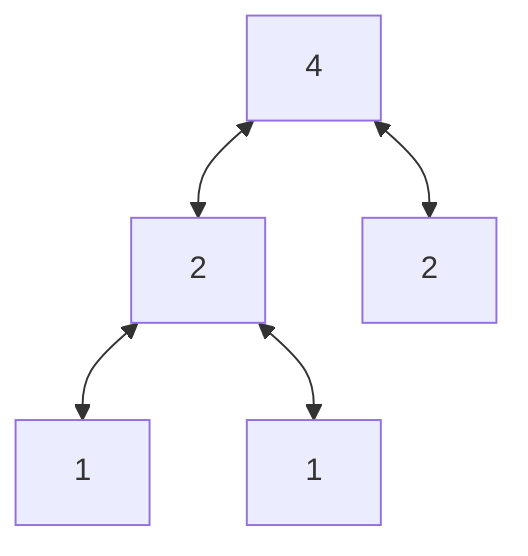
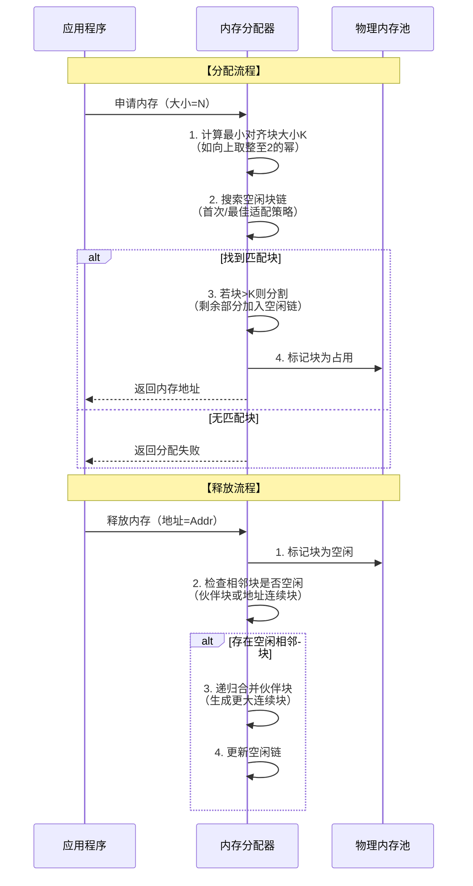
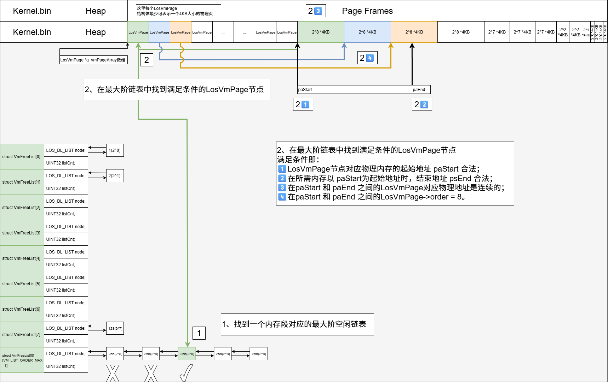
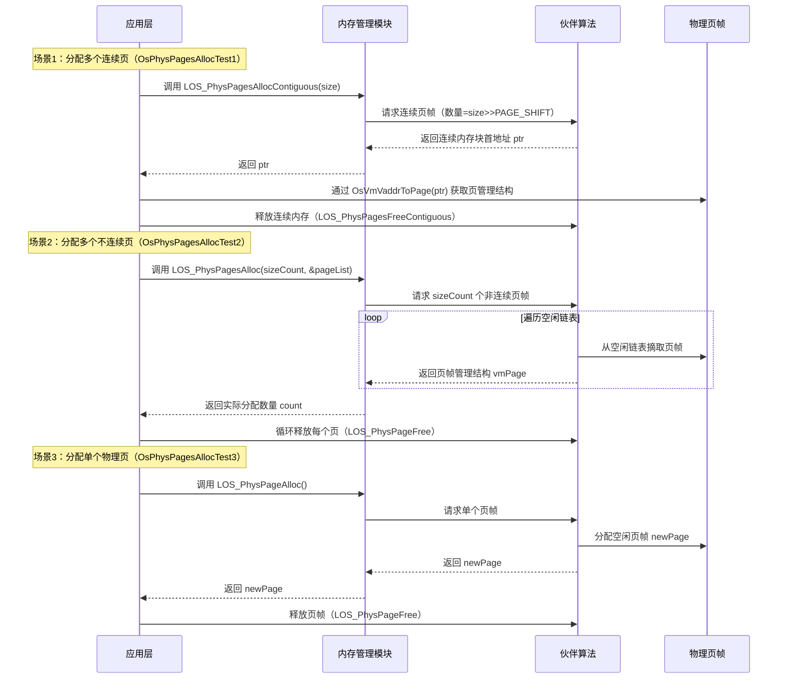
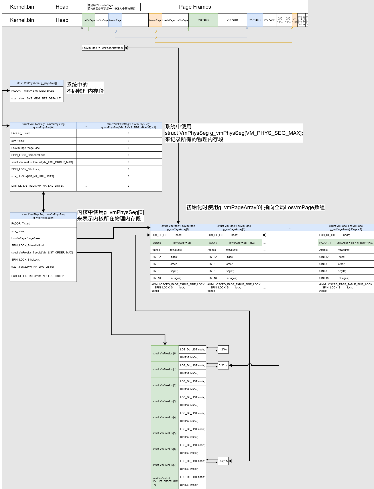
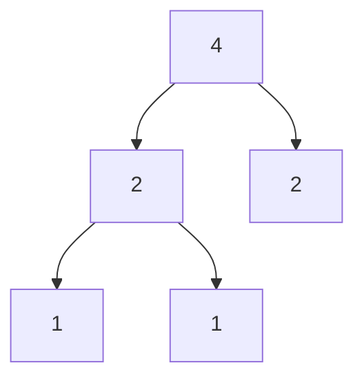

# 物理内存与Liteos_a内核物理内存分析

[TOC]

# 0、一句话总结

​	物理内存是计算机硬件中实际存在的RAM，作为CPU直接访问的高速数据缓存区，用于临时存储操作系统内核、运行中程序的代码及数据，其容量与速度直接影响系统性能。对物理内存的管理方法通常采取使用分治思想的伙伴系统。

以下是分治思想的示意图：

* 拆分：(4) ==> (2 + 2) ==> (1 + 1 + 2)
* 合并：(1 + 1 + 2) ==> (2 + 2) ==> (4)




# 1、物理内存的通用知识点

## 1.1、物理内存的概念

**定义**：物理内存是硬件层面的易失性存储介质（断电数据丢失），由内存条上的DRAM芯片组成，通过内存控制器与CPU直连。

**核心作用**：

- 为操作系统内核提供运行空间（如进程调度、文件系统管理）；
- 缓存频繁访问的数据，减少CPU等待磁盘I/O的时间；
- 通过内存管理单元（MMU）实现虚拟地址到物理地址的转换，支撑多任务隔离。

**关键特性**：

| **特性** | **说明**                                                  |
| :------: | :-------------------------------------------------------- |
| 高速访问 | 纳秒级延迟，远高于磁盘（毫秒级）                          |
| 容量有限 | 受硬件规格限制（如DDR4单条最大128GB），需配合虚拟内存扩展 |
|  易失性  | 断电后数据丢失，需持久化存储辅助                          |


## 1.2、物理内存的通用结构

物理内存的组织遵循分层模型：

**存储单元（Cell）**：

- 最小单位是位（bit），8位组成1字节（Byte），每个字节有唯一物理地址。

**内存芯片（Chip）**：

- DRAM芯片阵列构成内存模块（如DIMM条），通过电容电荷存储数据，需定期刷新防漏电。

**通道与控制器**：

- **内存通道**：CPU与内存间的并行数据传输通路（如双通道、四通道）；
- **内存控制器**：集成于CPU或北桥芯片，调度读写请求、地址解码及刷新操作

单节点/通用平台示意（从低地址到高地址）:

```bash
低地址
+-----------------------------------------------------+
| 平台/固件/启动阶段占用或保留区（示例：启动代码/表）        |
+-----------------------------------------------------+
|                    可用物理内存                       |
|  ┌───────────────────────────────────────────────┐  |
|  │ 以固定粒度划分的帧/块（示意）：                   │  |
|  │ [帧][帧][帧][帧][帧][帧][帧][帧] ...            │  |
|  │ [帧][帧][帧][帧][帧][帧][帧][帧] ...            │  |
|  │                                               │  |
|  │ （可从中划出“连续物理大块预留区”，满足特殊需求）    │  |
|  │    +--------------------------------------+   │  |
|  │    | 连续物理大块预留区（如大块DMA/实时）      |  │  |
|  │    +--------------------------------------+   │  |
|  └───────────────────────────────────────────────┘  |
+-----------------------------------------------------+
|                物理地址空洞（非RAM）                  |
+-----------------------------------------------------+
|          设备MMIO/芯片寄存器映射/专用保留区             |
+-----------------------------------------------------+
高地址
```

多节点/NUMA（Non-Uniform Memory Access）形态的通用抽象（仅展示“分节点 + 上下各自可能包含保留/空洞/MMIO”这种层次）：

```bash
低地址
+-----------------------------------------------------+
| Node 0: 平台/固件/启动保留 | Node 0: 可用RAM | 空洞    |
+-----------------------------------------------------+
| Node 0: 设备MMIO/寄存器映射/专用保留                   |
+-----------------------------------------------------+
| Node 1: 平台/固件/启动保留 | Node 1: 可用RAM | 空洞    |
+-----------------------------------------------------+
| Node 1: 设备MMIO/寄存器映射/专用保留                   |
+-----------------------------------------------------+
高地址
（注：不同节点的区域彼此在物理地址上分段出现；实际数量可多于2个）
```

图例与要点说明（通用抽象）

- 可用物理内存：实际可供分配的RAM区域，通常按固定粒度（帧/块）管理；帧大小由平台/配置决定。
- 连续物理大块预留区：为需要严格物理连续性的场景（如部分外设的DMA、实时场景）预留，避免外部碎片影响分配成功率。
- 设备MMIO/芯片寄存器映射：非RAM的物理地址段，用于将设备寄存器或外设空间映射到处理器的物理地址空间。
- 物理地址空洞：地址存在但无物理内存（未填充DRAM），常见于不同容量/通道/排布或平台保留的结果。
- 平台/固件/启动保留：由固件/启动阶段使用或为平台数据保留的地址范围，不参与一般内存分配。
- 多节点（NUMA）：可用RAM可能按节点分段出现；调度与分配通常优先使用本地节点以降低延迟。上述划分仅为结构层面的抽象，具体位置、大小与数量由硬件与固件决定。


## 1.3、物理内存的分配释放时序图




## 1.4、物理内存关键机制说明

1、**内存碎片问题**：

- **外部碎片**：空闲内存分散为小间隙，总空闲足够但无法分配连续大块（图1示例）；
- **内部碎片**：分配单元因对齐或最小块限制导致的未利用空间（如申请500B但分配512B）。

2、**分配策略对比**：

|   **策略**   |         **原理**         |      **优势**      |        **劣势**        |
| :----------: | :----------------------: | :----------------: | :--------------------: |
| **最先匹配** | 按地址顺序分配首个足够块 | 简单快速，保留大块 |     易产生外部碎片     |
| **最佳匹配** | 分配大于需求的最小空闲块 |    减少大块浪费    | 碎片小而多，合并开销大 |
| **最差匹配** |      分配最大空闲块      |    避免微小碎片    |     易耗尽大块资源     |

3、**连续内存分配的限制**：

- **地址连续性要求**：早期系统需为进程分配连续物理内存，易因碎片导致分配失败；
- **现代解决方案**：
  - **分页机制**：物理内存划分为固定大小页框（如4KB），程序可占用非连续页框；
  - **分段机制**：按逻辑模块（代码/数据/堆栈）分配独立内存段，支持动态扩展。


# 2、Liteos_a内核中物理内存的实现

## 2.1、Liteos_a内核中物理内存的概念

​	物理内存是计算机上最重要的资源之一，指的是实际的内存设备提供的、可以通过CPU总线直接进行寻址的内存空间，其主要作用是为操作系统及程序提供临时存储空间。Liteos_a内核管理物理内存是通过分页实现的，除了内核堆占用的一部分内存外，其余可用内存均以4KiB为单位划分成页帧，内存分配和内存回收便是以页帧为单位进行操作。内核采用伙伴算法管理空闲页面，可以降低一定的内存碎片率，提高内存分配和释放的效率，但是一个很小的块往往也会阻塞一个大块的合并，导致不能分配较大的内存块。


## 2.2、Liteos_a内核的物理内存运行机制

如下图所示，Liteos_a内核的物理内存使用分布视图，主要由内核镜像、内核堆及物理页组成。

物理内存使用分布图：

```bash
┌───────────────────────────────────────────────┐
│ Kernel.bin     │    Heap     │   Page Frames  │
└───────────────────────────────────────────────┘
```

Liteos_a内核会把物理地址和虚拟地址对应起来，上述物理内存分布在虚拟内存空间中占据中间一部分（Kernel Space），其虚拟地址空间如下图所示：


### 2.2.1、伙伴算法

​	伙伴算法把所有空闲页帧分成9个内存块组，每组中内存块包含2的幂次方个页帧，例如：第0组的内存块包含2的0次方个页帧，即1个页帧；第8组的内存块包含2的8次方个页帧，即256个页帧。相同大小的内存块挂在同一链表上进行管理。

* 申请内存：系统申请12KiB内存，即3个页帧时，9个内存块组中索引为3的链表挂着一块大小为8个页帧（8 * 4KB = 32KB）的内存块满足要求，分配出12KiB内存后还剩余20KiB内存，即5个页帧，将5个页帧分成2的幂次方之和，即4跟1，尝试查找伙伴进行合并。4个页帧的内存块没有伙伴则直接插到索引为2的链表上，继续查找1个页帧的内存块是否有伙伴，索引为0的链表上此时有1个，如果两个内存块地址连续则进行合并，并将内存块挂到索引为1的链表上，否则不做处理。

* 内存申请示意图：

  

* 释放内存：系统释放12KiB内存，即3个页帧，将3个页帧分成2的幂次方之和，即2跟1，尝试查找伙伴进行合并，索引为1的链表上有1个内存块，若地址连续则合并，并将合并后的内存块挂到索引为2的链表上，索引为0的链表上此时也有1个，如果地址连续则进行合并，并将合并后的内存块挂到索引为1的链表上，此时继续判断是否有伙伴，重复上述操作。

* 内存释放示意图：

  


## 2.3、Liteos_a内核物理内存分配示意图

Liteos_a内核的物理内存页分配和释放流程如下：

* 1、在物理内存页空闲链表中 找到满足 要分配长度size的最小物理内存段。
* 2、检查维护这个物理内存的元数据中相关参数的合法性。之后即可使用这块物理内存。




## 2.4、Liteos_a内核物理内存模块的总结

​	分析到这里，可以看出Liteos_a内核完整的实现了 1.1 ~ 1.4 小节中物理内存所有的通用机制。接下来就借助Liteos_a内核的源代码继续分析，Liteos_a内核是如何通过代码将物理内存的这些机制一一实现的。


# 3、Liteos_a内核物理内存开发案例

## 3.1、接口说明

| 功能分类     | 接口描述                                                     |
| ------------ | ------------------------------------------------------------ |
| 申请物理内存 | - LOS_PhysPageAlloc：申请一个物理页 <br />- LOS_PhysPagesAlloc：申请物理页并挂在对应的链表上 <br />- LOS_PhysPagesAllocContiguous：申请多页地址连续的物理内存 |
| 释放物理内存 | - LOS_PhysPageFree：释放一个物理页 <br />- LOS_PhysPagesFree：释放挂在链表上的物理页 <br />- LOS_PhysPagesFreeContiguous：释放多页地址连续的物理内存 |
| 查询地址     | - LOS_VmPageGet：根据物理地址获取其对应的物理页结构体指针 <br />- LOS_PaddrToKVaddr：根据物理地址获取其对应的内核虚拟地址 |


## 3.2、开发流程

​	内存申请时根据需要调用相关接口，小内存申请建议使用堆内存申请相关接口，4KiB及以上内存申请可以使用上述物理内存相关接口。

说明：

- 物理内存申请相关接口需要在OsSysMemInit接口完成初始化之后再使用；
- 内存申请的基本单位是页帧，即4KiB；
- 物理内存申请时，有地址连续要求的使用LOS_PhysPagesAllocContiguous接口，无地址连续的要求尽量使用LOS_PhysPagesAlloc接口，将连续的大块内存留给有需要的模块使用。


## 3.3、编程实例

### 3.3.1、实例描述

编程示例主要是调用申请、释放接口对内存进行操作，包括申请一个页以及多个页的示例。


### 3.3.2、编程示例

```c
#include "los_vm_phys.h"

#define PHYS_PAGE_SIZE 0x4000

// 申请一个页
VOID OsPhysPagesAllocTest3(VOID)
{
    PADDR_T newPaddr;
    VOID *kvaddr = NULL;
    LosVmPage *newPage = NULL;

    newPage = LOS_PhysPageAlloc();
    if (newPage == NULL) {
        printf("LOS_PhysPageAlloc fail\n");
        return;
    }
    printf("LOS_PhysPageAlloc success\n");

    newPaddr = VM_PAGE_TO_PHYS(newPage);
    kvaddr = OsVmPageToVaddr(newPage);

    // Handle the physical memory

    // Free the physical memory
    LOS_PhysPageFree(newPage);
}

// 申请多个页，不要求连续
VOID OsPhysPagesAllocTest2(VOID)
{
    UINT32 sizeCount;
    UINT32 count;
    UINT32 size = PHYS_PAGE_SIZE;
    LosVmPage *vmPageArray[PHYS_PAGE_SIZE >> PAGE_SHIFT] = { NULL };
    UINT32 i = 0;
    LosVmPage *vmPage = NULL;
    PADDR_T pa;

    size = LOS_Align(size, PAGE_SIZE);
    if (size == 0) {
        return;
    }
    sizeCount = size >> PAGE_SHIFT;

    LOS_DL_LIST_HEAD(pageList);

    count = LOS_PhysPagesAlloc(sizeCount, &pageList);
    if (count < sizeCount) {
        printf("failed to allocate enough pages (ask %zu, got %zu)\n", sizeCount, count);
        goto ERROR;
    }
    printf("LOS_PhysPagesAlloc success\n");
    while ((vmPage = LOS_ListRemoveHeadType(&pageList, LosVmPage, node))) {
        pa = vmPage->physAddr;
        vmPageArray[i++] = vmPage;
        // Handle the physical memory
    }

    // Free the physical memory
    for (i = 0; i < sizeCount; ++i) {
        LOS_PhysPageFree(vmPageArray[i]);
    }

    return;

ERROR:
    (VOID)LOS_PhysPagesFree(&pageList);
}

// 申请多个连续页
VOID OsPhysPagesAllocTest1(VOID)
{
    VOID *ptr = NULL;
    LosVmPage *page = NULL;
    UINT32 size = PHYS_PAGE_SIZE;

    ptr = LOS_PhysPagesAllocContiguous(ROUNDUP(size, PAGE_SIZE) >> PAGE_SHIFT);
    if (ptr == NULL) {
        printf("LOS_PhysPagesAllocContiguous fail\n");
        return;
    }

    printf("LOS_PhysPagesAllocContiguous success\n");

    // Handle the physical memory

    // Free the physical memory
    page = OsVmVaddrToPage((VOID *)ptr);
    LOS_PhysPagesFreeContiguous((VOID *)ptr, size >> PAGE_SHIFT);
}

UINT32 ExamplePhyMemCaseEntry(VOID)
{
    OsPhysPagesAllocTest1();
    OsPhysPagesAllocTest2();
    OsPhysPagesAllocTest3();
    return LOS_OK;
}
```

编译运行得到的结果为：

```bash
LOS_PhysPagesAllocContiguous success
LOS_PhysPagesAlloc success
LOS_PhysPageAlloc success
```


### 3.3.3、示例时序图




# 4、Liteos_a内核物理内存的源码分析

## 4.1、虚拟内存页 LosVmPage

物理内存就是在RAM上的一块地址，在Liteos_a内核中使用一个虚拟页来表示一个对应的物理页，最少可表示一个4KB大小的物理页。

```c
// kernel_liteos_a\kernel\base\include\los_vm_page.h
typedef struct VmPage {
    LOS_DL_LIST         node;// 挂接到虚拟内存对象/队列的双向链表节点，用于页的组织与遍历
    PADDR_T             physAddr;// 该页对应的物理地址（通常为页框起始物理地址，对齐到页大小）
    Atomic              refCounts;// 引用计数：被映射/持有的次数，降为0时可回收
    UINT32              flags;// 页状态标志位：如脏/保留/锁定/可回收等状态与属性
    UINT8               order;// 所在伙伴/空闲链的阶（表示2^order连续页块大小）
    UINT8               segID;// 所属内存段/区域标识（用于区分不同内存域/池/区）
    UINT16              nPages;// 用于内核堆场景的页数（表示该分配块包含的页数量）
#ifdef LOSCFG_PAGE_TABLE_FINE_LOCK
    SPIN_LOCK_S         lock;// 细粒度锁：保护与该页相关的表项/元数据并发修改
#endif
} LosVmPage;
```


## 4.2、物理内存初始化 OsVmPageStartup 

Liteos_a内核中物理内存申请相关接口需要在OsSysMemInit接口完成初始化之后再使用。

```c
整体调用链
reset_vector
    main
        OsMain
            OsSysMemInit
                OsVmPageStartup
```

```c
VOID OsVmPageStartup(VOID)
{
    struct VmPhysSeg *seg = NULL;
    LosVmPage *page = NULL;
    paddr_t pa;
    UINT32 nPage;
    INT32 segID;

    // 1、调整物理内存区域，预留内核映像空间
    OsVmPhysAreaSizeAdjust(ROUNDUP((g_vmBootMemBase - KERNEL_ASPACE_BASE), PAGE_SIZE));

    /*
     * Pages getting from OsVmPhysPageNumGet() interface here contain the memory
     * struct LosVmPage occupied, which satisfies the equation:
     * nPage * sizeof(LosVmPage) + nPage * PAGE_SIZE = OsVmPhysPageNumGet() * PAGE_SIZE.
     */
    // 2、表示除去内核镜像剩余物理内存可分配nPages个4KB页面
    UINT32 pageNum = OsVmPhysPageNumGet();
    nPage = pageNum * PAGE_SIZE / (sizeof(LosVmPage) + PAGE_SIZE);
    g_vmPageArraySize = nPage * sizeof(LosVmPage);
    
    // 3、分配g_vmPageArray数组，表述物理页对应的页表项数组占用的内存
    // 这个内存在__bss_end之后
    g_vmPageArray = (LosVmPage *)OsVmBootMemAlloc(g_vmPageArraySize);
    OsVmPhysAreaSizeAdjust(ROUNDUP(g_vmPageArraySize, PAGE_SIZE));
    
    // 4、在struct VmPhysSeg g_vmPhysSeg[VM_PHYS_SEG_MAX];
    // 数组中取出一项分配给系统内存段使用
    OsVmPhysSegAdd();
-------------------------------------------------------------------------------------------
    	ret = OsVmPhysSegCreate(g_physArea[i].start, g_physArea[i].size);
-------------------------------------------------------------------------------------------
    // 5、初始化系统内存物理段中的的 空闲链表 、LRU链表 等
    OsVmPhysInit();
#ifdef LOSCFG_KERNEL_PLIMITS
	// 6、设置内存限制
    OsMemLimitSetLimit(pageNum * PAGE_SIZE);
#endif

    // 7、循环设置每一个物理内存segment
    for (segID = 0; segID < g_vmPhysSegNum; segID++) {
        seg = &g_vmPhysSeg[segID];
        nPage = seg->size >> PAGE_SHIFT;
        UINT32 count = nPage >> 3; /* 3: 2 ^ 3, nPage / 8, cycle count */
        UINT32 left = nPage & 0x7; /* 0x7: nPage % 8, left page */

        for (page = seg->pageBase, pa = seg->start; count > 0; count--) {
            /* note: process large amount of data, optimize performance */
            // 每一次 VMPAGEINIT 会初始化一个物理页对应的 LosVmPage 结构体
            // 设置 LosVmPage 结构体对应的物理页 起始地址 等信息
            // 	-其中将 LosVmPage->order = VM_LIST_ORDER_MAX; 
            //  -表示当前物理页不属于任何伙伴系统
            // 后续也使用这个LosVmPage->order判断LosVmPage表示的内存大小
            VMPAGEINIT(page, pa, segID);
            VMPAGEINIT(page, pa, segID);
            VMPAGEINIT(page, pa, segID);
            VMPAGEINIT(page, pa, segID);
            VMPAGEINIT(page, pa, segID);
            VMPAGEINIT(page, pa, segID);
            VMPAGEINIT(page, pa, segID);
            VMPAGEINIT(page, pa, segID);
        }
        for (; left > 0; left--) {
            VMPAGEINIT(page, pa, segID);
        }
        // 初始化该物理段的伙伴系统空闲链表
        OsVmPageOrderListInit(seg->pageBase, nPage);
    }
}

```

其中 OsVmPhysSegCreate 函数：

```c
// 创建了一个struct VmPhysSeg *seg 物理段
// 起始地址 = 内核镜像-->g_vmPageArray数组之后
// 大小 为外接内存总大小 - 内核镜像 - g_vmPageArray数组大小
STATIC INT32 OsVmPhysSegCreate(paddr_t start, size_t size)
{
    struct VmPhysSeg *seg = NULL;

    if (g_vmPhysSegNum >= VM_PHYS_SEG_MAX) {
        return -1;
    }

    seg = &g_vmPhysSeg[g_vmPhysSegNum++];
    for (; (seg > g_vmPhysSeg) && ((seg - 1)->start > (start + size)); seg--) {
        *seg = *(seg - 1);
    }
    seg->start = start;
    seg->size = size;

    return 0;
}
```

其中 VMPAGEINIT 宏：

```c
#define VMPAGEINIT(page, pa, segID) do {    \
    OsVmPageInit(page, pa, segID);          \
    (page)++;                               \
    (pa) += PAGE_SIZE;                      \
} while (0)

// 初始化LosVmPage结构体的链表节点、状态、引用计数、
// 物理地址、所属物理段ID、伙伴阶数、页数等基本信息。
STATIC VOID OsVmPageInit(LosVmPage *page, paddr_t pa, UINT8 segID)
{
    LOS_ListInit(&page->node);
    page->flags = FILE_PAGE_FREE;
    LOS_AtomicSet(&page->refCounts, 0);
    page->physAddr = pa;
    page->segID = segID;
    page->order = VM_LIST_ORDER_MAX;
    page->nPages = 0;
#ifdef LOSCFG_PAGE_TABLE_FINE_LOCK
    LOS_SpinInit(&page->lock);
#endif
}
```

初始化之后内核数据结构类似如图：




## 4.3、申请一个物理页 LOS_PhysPageAlloc

```c
LOS_PhysPageAlloc
    return OsVmPhysPagesGet(ONE_PAGE);
		page = OsVmPhysPagesAlloc(seg, nPages);
```

其中 OsVmPhysPagesAlloc 函数：

```c
STATIC LosVmPage *OsVmPhysPagesAlloc(struct VmPhysSeg *seg, size_t nPages)
{
    struct VmFreeList *list = NULL;
    LosVmPage *page = NULL;
    LosVmPage *tmp = NULL;
    UINT32 order;
    UINT32 newOrder;

    // 1、计算能容纳nPages的最小阶数
    order = OsVmPagesToOrder(nPages);
    // 2、阶数比默认最大阶 小
    if (order < VM_LIST_ORDER_MAX) {
        for (newOrder = order; newOrder < VM_LIST_ORDER_MAX; newOrder++) {
            // 获取当前阶的空闲链表	
            list = &seg->freeList[newOrder];
            if (LOS_ListEmpty(&list->node)) {
                continue;
            }
            // 找到有空闲块的链表，取第一个空闲页
            page = LOS_DL_LIST_ENTRY(LOS_DL_LIST_FIRST(&list->node), LosVmPage, node);
            // 跳转到分配处理
            goto DONE;
        }
    }
    // 3、阶数比默认最大阶 大
    else {
        newOrder = VM_LIST_ORDER_MAX - 1;
        // 查找足够大的连续空闲块
        page = OsVmPhysLargeAlloc(seg, nPages);
        if (page != NULL) {
            goto DONE;
        }
    }
    return NULL;
DONE:
    // 4、从链表中移除分配到的所有伙伴块
    for (tmp = page; tmp < &page[nPages]; tmp = &tmp[1 << newOrder]) {
        OsVmPhysFreeListDelUnsafe(tmp);
    }
    // 5、如果实际分配阶比需求阶大，则拆分多余的伙伴块
    OsVmPhysPagesSpiltUnsafe(page, order, newOrder);
    // 6、回收多余的页（如不是2的幂次，可能有多余页）
    OsVmRecycleExtraPages(&page[nPages], nPages, ROUNDUP(nPages, (1 << min(order, newOrder))));
-------------------------------------------------------------------------------------------
		OsVmPhysPagesFreeContiguous(page, endPage - startPage);
-------------------------------------------------------------------------------------------
    return page;
}

```

其中 OsVmPhysPagesFreeContiguous 函数：

```c
/*
    1、先按照页面对应物理地址能够释放的最大的阶数释放页面
    2、剩余页面也按照从大到小的阶数 进行释放
*/
VOID OsVmPhysPagesFreeContiguous(LosVmPage *page, size_t nPages)
{
    paddr_t pa;
    UINT32 order;
    size_t n;

    while (TRUE) {
        pa = VM_PAGE_TO_PHYS(page);           // 获取当前page对应的物理地址
        // #define VM_PHYS_TO_ORDER(phys)   (min(LOS_LowBitGet((phys) >> PAGE_SHIFT), VM_LIST_ORDER_MAX - 1))
        // (phys) >> PAGE_SHIFT : 表示当前物理地址按照 4KB 为单位时的 数量
        // LOS_LowBitGet((phys) >> PAGE_SHIFT) : 表示 当前物理地址最低可以作为 4KB单位大小的阶数
        //      - 0阶 : 2^0 * 4KB
        //      - 1阶 : 2^1 * 4KB
        //      - 2阶 : 2^2 * 4KB
        //      ...
        //      - 8阶 : 2^8 * 4KB
        // order = (min(LOS_LowBitGet((phys) >> PAGE_SHIFT), VM_LIST_ORDER_MAX - 1))
        // 表示当前物理地址可以作为 最小 order 阶 的首地址
        order = VM_PHYS_TO_ORDER(pa);         // 计算该物理地址对应的伙伴阶数
        n = VM_ORDER_TO_PAGES(order);         // 计算该阶数下的页面数量
        if (n > nPages) {                     // 如果当前阶的页面数大于剩余要释放的页面数
            break;                            // 跳出循环
        }
        OsVmPhysPagesFree(page, order);        // 释放当前阶的页面块
        nPages -= n;                          // 剩余页面数递减
        page += n;                            // page指针前移
    }

    while (nPages > 0) {
        order = LOS_HighBitGet(nPages);       // 获取nPages的最高位（即最大可用阶）
        n = VM_ORDER_TO_PAGES(order);         // 计算该阶下的页面数量
        OsVmPhysPagesFree(page, order);       // 释放该阶的页面块
        nPages -= n;                          // 剩余页面数递减
        page += n;                            // page指针前移
    }
}
```

其中  OsVmPhysLargeAlloc 函数：

```c
/*
1. 获取当前物理段的最大阶（最大块大小）空闲链表。
2. 遍历该链表中的每一个最大阶空闲块，尝试以该块为起点，查找是否有足够数量的连续最大阶空闲块，能满足 nPages 的分配需求。
3. 对每个候选起点，循环检查后续每个最大阶块是否也是空闲且连续，直到覆盖所需空间或遇到不连续为止。
4. 如果找到足够大的连续空间，返回第一个块的指针；否则遍历下一个候选块。
5. 如果所有最大阶空闲块都无法满足需求，返回 NULL。
该函数用于在伙伴系统最大阶空闲链表中查找一块足够大的连续物理页区域，适用于大块物理内存分配的场景。

1. OsVmPhysLargeAlloc函数并不是在LosVmPhysSeg结构体的freeList最大阶空闲链表中“查找所有内存” 
    它并不是在整个freeList数组中查找，而是 只在最大阶（VM_LIST_ORDER_MAX-1）对应的空闲链表中遍历 ，每次以链表中的一个最大阶空闲块为起点，尝试分配一大块连续内存。
2. 最大阶空闲链表只是用来找到一个可能的起始地址 没错，最大阶空闲链表中的每个节点（LosVmPage）都被当作“候选起始块”。 
    但仅仅有一个起始块还不够，必须保证从这个起始块开始，后续的每个最大阶块也都是空闲的，且连续。
3. 后续的连续性检查是在LosVmPage数组中完成的 你的理解完全正确。找到一个起始块后，代码会直接在 seg->pageBase 
    指向的LosVmPage数组中，依次向后跳跃最大阶块的步长，检查每个块的order是否等于最大阶，
    只有全部满足才算找到一块足够大的连续空闲内存。
总结
- 最大阶空闲链表只提供“候选起点”。
- 真正的连续性检查和分配逻辑，是在LosVmPage数组中完成的。
- 只有所有连续的最大阶块都空闲，才会返回该起点，分配成功。
*/
STATIC LosVmPage *OsVmPhysLargeAlloc(struct VmPhysSeg *seg, size_t nPages)
{
    struct VmFreeList *list = NULL;           // 空闲链表指针
    LosVmPage *page = NULL;                   // 当前遍历到的物理页指针
    LosVmPage *tmp = NULL;                    // 临时物理页指针
    PADDR_T paStart;                          // 起始物理地址
    PADDR_T paEnd;                            // 结束物理地址
    size_t size = nPages << PAGE_SHIFT;       // 需要分配的总字节数

    list = &seg->freeList[VM_LIST_ORDER_MAX - 1]; // 获取最大阶的空闲链表
    LOS_DL_LIST_FOR_EACH_ENTRY(page, &list->node, LosVmPage, node) { // 遍历最大阶空闲链表
        paStart = page->physAddr;             // 当前块的起始物理地址
        paEnd = paStart + size;               // 计算所需连续空间的结束地址
        if (paEnd > (seg->start + seg->size)) { // 如果超出物理段范围
            continue;                         // 跳过本块，查找下一个
        }

        for (;;) {                            // 检查从paStart到paEnd范围内的每个最大阶块
            paStart += PAGE_SIZE << (VM_LIST_ORDER_MAX - 1); // 前移一个最大阶块的大小
            // (paStart >= paEnd) 表示找到目标
            if ((paStart >= paEnd) || (paStart < seg->start) ||
                (paStart >= (seg->start + seg->size))) {     // 检查是否越界或已到达目标
                break;
            }
            tmp = &seg->pageBase[(paStart - seg->start) >> PAGE_SHIFT]; // 计算下一个最大阶块的LosVmPage指针
            // tmp->order == (VM_LIST_ORDER_MAX - 1) 说明内存的地址是连续的
            if (tmp->order != (VM_LIST_ORDER_MAX - 1)) {    // 如果不是最大阶空闲块
                break;                                      // 说明不连续，退出检查
            }
        }
        if (paStart >= paEnd) {                             // 如果检查到足够大的连续空间
            return page;                                    // 返回第一个块的指针
        }
    }

    return NULL;                                            // 没有找到合适的连续大块，返回NULL
}
```

内存结构图：


## 4.4、申请多页地址连续的物理内存 LOS_PhysPagesAllocContiguous

```c
VOID *LOS_PhysPagesAllocContiguous(size_t nPages)
{
    LosVmPage *page = NULL;

    if (nPages == 0) {
        return NULL;
    }
	// 地址连续的多页，也是用这个函数，传入的参数 nPages > 1
    page = OsVmPhysPagesGet(nPages);
    if (page == NULL) {
        return NULL;
    }

    return OsVmPageToVaddr(page);
}
```


## 4.5、释放一个物理页 LOS_PhysPageFree

```c
VOID LOS_PhysPageFree(LosVmPage *page)
{
    UINT32 intSave;
    struct VmPhysSeg *seg = NULL;

    if (page == NULL) {
        return;
    }

    if (LOS_AtomicDecRet(&page->refCounts) <= 0) {
        // 获取当前物理页所在段的VmPhysSeg结构体指针
        seg = &g_vmPhysSeg[page->segID];
        LOS_SpinLockSave(&seg->freeListLock, &intSave);
		// 释放一个物理页面
        OsVmPhysPagesFreeContiguous(page, ONE_PAGE);
		// 这个物理页面的引用计数置为 0
        LOS_AtomicSet(&page->refCounts, 0);

        LOS_SpinUnlockRestore(&seg->freeListLock, intSave);
    }
// 开启LOSCFG_KERNEL_PLIMITS时，里面就是将内存限制使用量 - PAGE_SIZE大小
#ifdef LOSCFG_KERNEL_PLIMITS
    OsMemLimitMemFree(PAGE_SIZE);
#endif
}
```

其中 OsVmPhysPagesFreeContiguous 函数：

```c
VOID OsVmPhysPagesFreeContiguous(LosVmPage *page, size_t nPages)
{
    paddr_t pa;
    UINT32 order;
    size_t n;

    // 1) 计算当前起始页的“天然可释放块”属性：由物理地址推导对齐阶(order)与该阶对应页数(n)
    while (TRUE) {
        pa = VM_PAGE_TO_PHYS(page);
        order = VM_PHYS_TO_ORDER(pa);
        n = VM_ORDER_TO_PAGES(order);
        // 若天然块大于剩余待释放页数，结束该阶段
        if (n > nPages) {
            break;
        }
        // 2) 优先按“天然对齐的大块”释放：减少碎片、利于伙伴合并
        OsVmPhysPagesFree(page, order);
        nPages -= n;
        page += n;
    }

    // 3) 使用最高位分解策略：将剩余页数按2^k从大到小拆分并逐块释放，直到归零
    while (nPages > 0) {
        order = LOS_HighBitGet(nPages);
        n = VM_ORDER_TO_PAGES(order);
        OsVmPhysPagesFree(page, order);
        nPages -= n;
        page += n;
    }

    // 4) 结束：连续区域已按伙伴友好方式完成拆分释放，后续由底层进行合并
}

```

其中 OsVmPhysPagesFree 函数：

```c

VOID OsVmPhysPagesFree(LosVmPage *page, UINT8 order)
{
    paddr_t pa;
    LosVmPage *buddyPage = NULL;

    // 1) 参数校验：入参为空或阶数越界则直接返回
    if ((page == NULL) || (order >= VM_LIST_ORDER_MAX)) {
        return;
    }

    // 2) 若未达最高阶，计算起始物理地址并定位同阶“伙伴块”，判断是否可合并
    if (order < VM_LIST_ORDER_MAX - 1) {
        pa = VM_PAGE_TO_PHYS(page);
        do {
            // 2.1) 通过异或当前阶大小获取伙伴物理地址；若伙伴不存在或阶数不匹配则停止合并
            pa ^= VM_ORDER_TO_PHYS(order);
            buddyPage = OsVmPhysToPage(pa, page->segID);
            if ((buddyPage == NULL) || (buddyPage->order != order)) {
                break;
            }
            // 3) 伙伴可合并：先从空闲链表移除伙伴，提升阶数，并对齐到更高阶块基地址，继续尝试更高阶合并
            OsVmPhysFreeListDelUnsafe(buddyPage);
            order++;
            pa &= ~(VM_ORDER_TO_PHYS(order) - 1);
            page = OsVmPhysToPage(pa, page->segID);
        } while (order < VM_LIST_ORDER_MAX - 1);
    }

    // 4) 将最终（合并后或原始）的块加入对应阶的空闲链表
    OsVmPhysFreeListAddUnsafe(page, order);
}

```

其中 OsVmPhysFreeListDelUnsafe 函数：
```c
STATIC VOID OsVmPhysFreeListDelUnsafe(LosVmPage *page)
{
    struct VmPhysSeg *seg = NULL;
    struct VmFreeList *list = NULL;

    // 1) 参数合法性检查：segID/order 越界则直接触发致命错误（调用者需保证传入页处于空闲链表且持有必要的锁）
    if ((page->segID >= VM_PHYS_SEG_MAX) || (page->order >= VM_LIST_ORDER_MAX)) {
        LOS_Panic("The page segment id(%u) or order(%u) is invalid\n", page->segID, page->order);
    }

    // 2) 根据页的 segID/order 获取对应物理段与该阶自由链表
    seg = &g_vmPhysSeg[page->segID];
    list = &seg->freeList[page->order];

    // 3) 从自由链表移除该页：更新计数并将其节点从链表删除
    list->listCnt--;
    LOS_ListDelete(&page->node);

    // 4) 状态重置：将 page->order 置为无效，表明该页已不再属于任何自由链表阶
    page->order = VM_LIST_ORDER_MAX;
}
```

其中 OsVmPhysFreeListAddUnsafe 函数：

```c
STATIC VOID OsVmPhysFreeListAddUnsafe(LosVmPage *page, UINT8 order)
{
    struct VmPhysSeg *seg = NULL;
    struct VmFreeList *list = NULL;

    // 1) 参数合法性检查：确保 segID 未越界（调用方需保证已持有必要锁且 page 处于可添加状态）
    if (page->segID >= VM_PHYS_SEG_MAX) {
        LOS_Panic("The page segment id(%d) is invalid\n", page->segID);
    }

    // 2) 写入阶次信息：把目标块的阶（order）记录到页描述符，便于后续在对应阶的空闲链中管理
    page->order = order;

    // 3) 解析所属物理段与目标空闲链：根据 segID 找到物理段，再根据 order 选取对应阶的空闲链
    seg = &g_vmPhysSeg[page->segID];
    list = &seg->freeList[order];

    // 4) 执行插入与计数：将页插入该阶空闲链表尾部，并递增该阶空闲块数量
    LOS_ListTailInsert(&list->node, &page->node);
    list->listCnt++;
}
```


## 4.6、释放多页地址连续的物理内存 LOS_PhysPagesFreeContiguous

```c
VOID LOS_PhysPagesFreeContiguous(VOID *ptr, size_t nPages)
{
    UINT32 intSave;
    struct VmPhysSeg *seg = NULL;
    LosVmPage *page = NULL;

    if (ptr == NULL) {
        return;
    }

    page = OsVmVaddrToPage(ptr);
    if (page == NULL) {
        VM_ERR("vm page of ptr(%#x) is null", ptr);
        return;
    }
    page->nPages = 0;

    seg = &g_vmPhysSeg[page->segID];
    LOS_SpinLockSave(&seg->freeListLock, &intSave);
	// 传入的 nPages > 1
    OsVmPhysPagesFreeContiguous(page, nPages);

    LOS_SpinUnlockRestore(&seg->freeListLock, intSave);
#ifdef LOSCFG_KERNEL_PLIMITS
    OsMemLimitMemFree(nPages * PAGE_SIZE);
#endif
}
```


# 5、对物理内存机制的思考

## 5.1、为什么使用伙伴系统来管理物理内存页？而不是像TLSF/SLAB这种算法来管理？


最简答案：因为“物理页管理”的目标和约束与 TLSF/SLAB不同。页管理需要以固定粒度（页/2^k页）高效地提供对齐良好且尽可能连续的物理块，并在释放时可靠合并以对抗外部碎片；这正是伙伴系统最擅长的。而 TLSF/SLAB 的擅长点分别是“变长小块堆分配”和“固定对象缓存”，它们建立在页之上，既不保证连续物理页，也不替代底层对齐/合并能力。

更具体的对比要点：
- 角色定位
  - 伙伴系统：页/高阶页分配器，提供连续、2^k 对齐的物理块；释放可递归合并，持续恢复大块。
  - TLSF：通用堆分配器，面向任意大小小块的 O(1) 分配/回收和低外部碎片；不专注连续物理页。
  - SLAB/SLUB：对象缓存分配器，先向下申请页，再切成固定大小对象；优化对象生命周期与缓存命中；并不产出连续物理页。
- 为什么页层需要伙伴而不是 TLSF/SLAB
  - 连续性与对齐是底层刚需：DMA、大页、页表预留、设备/IOMMU 映射都要物理连续且对齐良好的块。伙伴系统用分裂/合并保证2^k对齐，并能在释放时快速合并回大块。
  - 可预测的最坏时延与简单元数据：伙伴系统只维护分阶空闲链表和少量标记，路径短、锁粒度易控；TLSF要维护复杂索引/位图，作为物理页管理会增加元数据和并发复杂度，却仍无法更好保证连续性。
  - 层次协作的必要性：上层（SLAB/TLSF）需要以“页”为输入来切分对象或变长块，底层若不用页/伙伴，回收/迁移/隔离/I/O 映射等系统机制将失去统一的最小单位与连续性保证。
- 碎片权衡
  - 伙伴系统牺牲部分“内部碎片”（只能以2^k页分配），换来“外部碎片可合并”和“连续性强”；这与页粒度的主流需求（1、2、4、…、2^k页）高度匹配。
  - 需要大量任意尺寸的小块时，交给 SLAB/TLSF（建立在页之上）更合适。
- 性能现实
  - 伙伴分配/释放复杂度约为按阶 O(log N)，但N很小且常配合每CPU快速路径，单页路径接近常数；相比整体内存访问/缺页/I/O 开销，去掉伙伴层意义不大，却会丢失连续性和可合并能力。
- 一句话总结
  - 底层用伙伴系统管理“页/高阶页”，确保对齐、连续性与可合并；上层再用 SLAB/TLSF 面向对象/变长小块。两类分配器目标不同、互补协同，不能互相替代。    


## 5.2、伙伴系统的合并拆分对应的分治思想

一、分治思想（Divide and Conquer）

- 分（Divide）：把原问题拆成若干结构相同、规模更小的子问题。
- 治（Conquer）：递归解决这些子问题（直到足够小可直接解）。
- 合（Combine）：把子问题的解合并成原问题的解。
- 适用前提：子问题彼此独立/弱相关，自相似结构，合并成本低。


二、在伙伴系统中的映射

- 分：当需要 2^k 页，但当前只有更大块 2^j(j>k) 时，不断二分：2^j → 2^(j-1)+2^(j-1) … 直到得到 2^k。
- 治：选择其中一块作为结果，另一块回收到对应阶的空闲链。
- 合：释放时，若同阶“伙伴”空闲，则合并成更大块，递归向上继续合并，直到不能再合并。


三、最最简洁的示例（一步到位）

- 场景：初始只有一块 4 页（阶2）。
- 申请 1 页（阶0）：
  1. 分裂：4 → 2+2（阶1+阶1）
  2. 再分裂：取一块2 → 1+1（阶0+阶0）
  3. 治：返回其中一个 1 页；另一个 1 页、以及那块 2 页，分别回收到对应阶的空闲链
- 释放这 1 页：
  1. 合：若其伙伴 1 页空闲 → 合成 2 页
  2. 再合：若其伙伴 2 页空闲 → 合成 4 页
  3. 直到无法再合并为止，完成


四、极简伪代码（仅展示核心）

- 分配（分+治）：
  - 找到阶≥k的空闲块；若是更大阶，循环二分直到阶==k；返回
- 释放（合）：
  - 当同阶伙伴空闲时，摘掉伙伴并合并到更高一阶；否则把当前块挂回本阶空闲链，结束
  这就是伙伴系统把“分治”落地到“块二分/伙伴合并”的最小核心。



