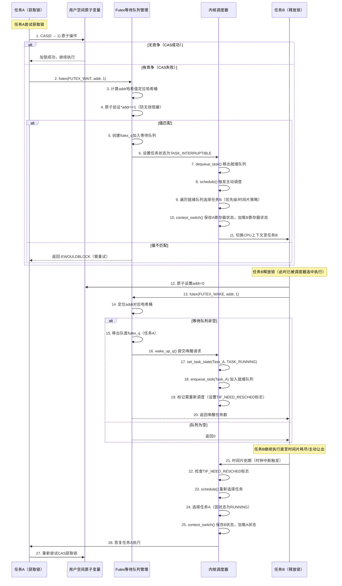
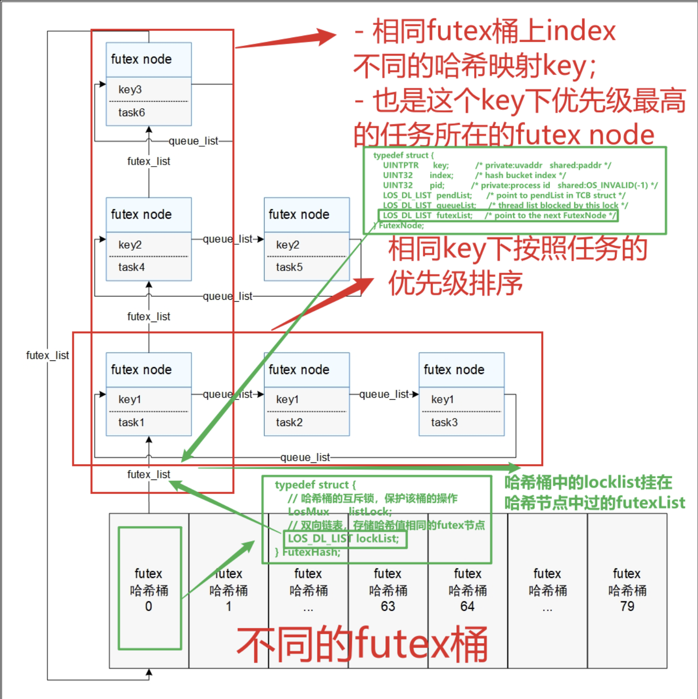
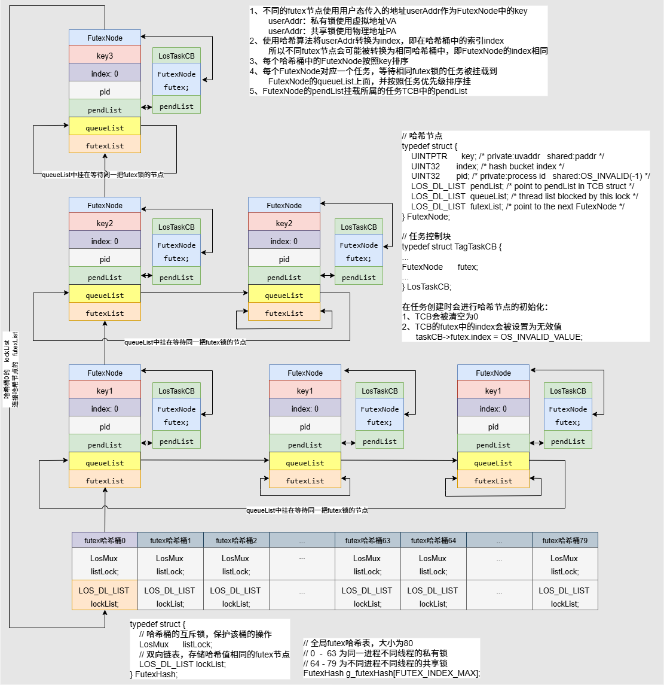
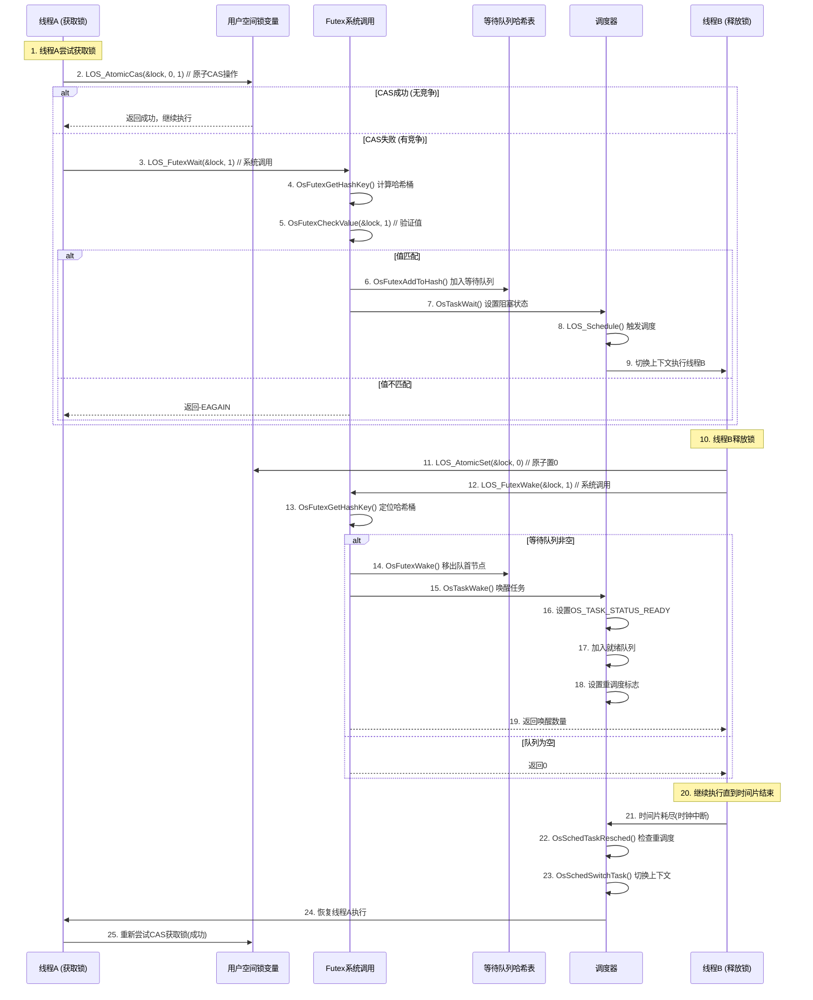
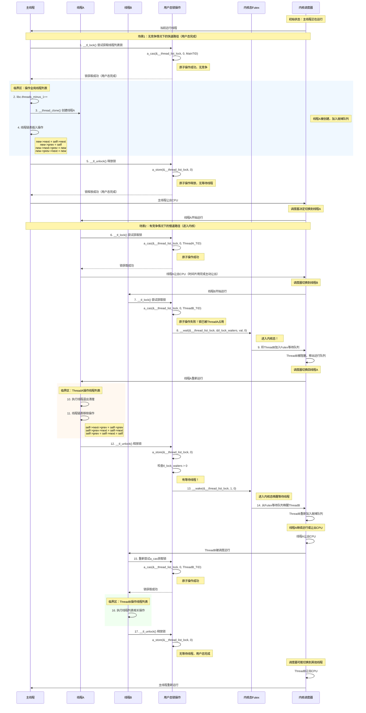

# 用户态快速互斥锁Futex机制与Liteos_a内核Futex机制分析

[TOC]

# 0、一句话总结

Futex机制实现了用户态锁逻辑、内核态锁调度，从而避免无竞争时的系统调用开销：

* Futex通过用户空间原子变量与内核等待队列的混合机制，在无竞争时完全避免系统调用开销，仅在竞争发生时才通过FUTEX_WAIT/FUTEX_WAKE系统调用进入内核进行阻塞/唤醒操作，从而实现高效的用户空间同步原语，是pthread互斥锁、条件变量等高级同步机制的底层构建基础。


# 1、Futex的通用知识点

## 1.1、Futex的概念

​	Futex（Fast Userspace Mutex）是一种**混合用户空间-内核空间的同步原语**，由IBM研究人员于2002年提出并在Linux 2.5.7中首次实现。Futex介绍：https://zh.wikipedia.org/wiki/Futex

 其核心特征包括：

- **双层设计架构**：结合用户空间原子操作与内核空间等待队列，在无竞争时完全避免系统调用，仅在竞争时才进入内核。
- **最小化内核介入**：大多数同步操作在用户空间通过原子指令完成，只有在需要阻塞或唤醒时才进行系统调用。
- **地址标识机制**：通过共享内存中的32位整数地址作为同步点，支持跨进程同步。
- **应用场景**：
  - 作为pthread互斥锁、条件变量、信号量的底层实现基础
  - 实现读写锁、屏障等高级同步原语
  - 支持优先级继承（PI）和健壮性（Robust）特性


## 1.2、Futex的通用结构

### 1.2.1、用户空间状态变量

**核心作用**：存储同步对象的状态信息，支持原子操作。

**结构特征**：

```c
// 用户空间futex变量（32位对齐整数）
uint32_t futex_word;  // 状态值：0=未锁定，1=已锁定，TID=拥有者ID
```

**状态定义**：
- **简单锁模式**：0表示未锁定，1表示已锁定
- **PI模式**：存储拥有者线程ID（TID）及等待者标志位
- **原子操作**：通过CAS（Compare-And-Swap）等原子指令修改状态


### 1.2.2、内核等待队列哈希表

**核心作用**：管理因竞争而阻塞的任务，通过地址哈希快速定位等待队列。

**结构设计**：
```c
struct futex_hash_bucket {
    struct list_head chain;     // 等待队列链表
    spinlock_t lock;           // 保护队列的自旋锁
};

struct futex_q {
    struct list_head list;     // 链表节点
    struct task_struct *task;  // 等待的任务
    union futex_key key;       // futex标识键
};
```

**哈希映射机制**：
- 通过futex地址生成唯一的`futex_key`
- 多个futex可能哈希到同一队列（哈希冲突）
- 每个阻塞任务对应一个`futex_q`结构


### 1.2.3、系统调用接口

**核心作用**：提供用户空间与内核空间的交互接口。

**接口定义**：

```c
long syscall(SYS_futex, uint32_t *uaddr, int futex_op, uint32_t val,
            const struct timespec *timeout, uint32_t *uaddr2, uint32_t val3);
```

**主要操作**：
- **FUTEX_WAIT**：原子检查值并阻塞等待
- **FUTEX_WAKE**：唤醒指定数量的等待任务
- **FUTEX_CMP_REQUEUE**：条件重排队操作
- **FUTEX_WAKE_OP**：复合唤醒操作


## 1.3、Futex的加解锁时序图

用户态无竞争即可加锁成功，用户态有竞争才会进入内核态执行阻塞等待，并任务调度。



## 1.4、Futex关键机制说明

1、**原子性保证**：FUTEX_WAIT操作中的"检查值-阻塞"过程是原子的，避免了检查与阻塞之间的竞态条件。

2、**性能优化策略**：

- **快速路径**：无竞争时完全在用户空间执行，零系统调用开销
- **慢速路径**：仅在竞争时进入内核，最小化上下文切换
- **哈希表优化**：通过地址哈希快速定位等待队列，支持大规模并发

3、**跨进程支持**：
- 通过共享内存映射支持进程间同步
- 内核内部将不同进程的虚拟地址映射到相同的物理地址
- 支持FUTEX_PRIVATE_FLAG优化单进程内线程同步

4、**高级特性**：
- **优先级继承（PI）**：防止优先级反转问题
- **健壮性（Robust）**：处理持锁进程异常退出的情况
- **超时机制**：支持带超时的等待操作

* **批量操作**：FUTEX_WAITV支持同时等待多个futex（类似WaitForMultipleObjects）


# 2、Liteos_a内核中Futex的实现

## 2.1、Liteos_a内核中Futex的概念

​	Liteos_a内核中的Futex(Fast userspace mutex，用户态快速互斥锁)是内核提供的一种系统调用能力，通常作为基础组件与用户态的相关锁逻辑结合组成用户态锁，是一种用户态与内核态共同作用的锁，例如用户态mutex锁、barrier与cond同步锁、读写锁。其用户态部分负责锁逻辑，内核态部分负责锁调度。

​	当用户态线程请求锁时，先在用户态进行锁状态的判断维护，若此时不产生锁的竞争，则直接在用户态进行上锁返回；反之，则需要进行线程的挂起操作，通过Futex系统调用请求内核介入来挂起线程，并维护阻塞队列。

​	当用户态线程释放锁时，先在用户态进行锁状态的判断维护，若此时没有其他线程被该锁阻塞，则直接在用户态进行解锁返回；反之，则需要进行阻塞线程的唤醒操作，通过Futex系统调用请求内核介入来唤醒阻塞队列中的线程。


## 2.2、Liteos_a内核的Futex运行机制

### 2.2.1、Futex哈希桶

```c
/* private: 0~63    hash index_num
 * shared:  64~79   hash index_num */

#define FUTEX_INDEX_PRIVATE_MAX     64
#define FUTEX_INDEX_SHARED_MAX      16
#define FUTEX_INDEX_MAX             (FUTEX_INDEX_PRIVATE_MAX + FUTEX_INDEX_SHARED_MAX)

typedef struct {
    LosMux      listLock;
    LOS_DL_LIST lockList;
} FutexHash;

// 64个私有桶、16个共享桶
FutexHash g_futexHash[FUTEX_INDEX_MAX];
```


### 2.2.2、Futex节点

```c
typedef struct {
    UINTPTR      key;           /* private:uvaddr   shared:paddr */
    UINT32       index;         /* hash bucket index */
    UINT32       pid;           /* private:process id   shared:OS_INVALID(-1) */
    LOS_DL_LIST  pendList;      /* point to pendList in TCB struct */
    LOS_DL_LIST  queueList;     /* thread list blocked by this lock */
    LOS_DL_LIST  futexList;     /* point to the next FutexNode */
} FutexNode;
```


### 2.2.3、Futex设计图

​	当用户态产生锁的竞争或释放需要进行相关线程的调度操作时，会触发Futex系统调用进入内核，此时会将用户态锁的地址传入内核，并在内核的Futex中以锁地址来区分用户态的每一把锁，因为用户态可用虚拟地址空间为1GiB，为了便于查找、管理，内核Futex采用哈希桶来存放用户态传入的锁。

​	当前哈希桶共有80个，0-63号桶用于存放私有锁（以虚拟地址进行哈希），64-79号桶用于存放共享锁（以物理地址进行哈希），私有/共享属性通过用户态锁的初始化以及Futex系统调用入参确定。

​	每个futex哈希桶中存放被futex_list串联起来的哈希值相同的futex node，每个futex node对应一个被挂起的task，node中key值唯一标识一把用户态锁，具有相同key值的node被queue_list串联起来表示被同一把锁阻塞的task队列，官网的介绍图如下所示：



加上Task更具体的结构图如下：



其中：

* `FutexNode->key` 为用户态传入的地址
* `FutexNode->index` 为用户态传入的地址进行哈希之后映射的哈希桶在数组中的索引。


## 2.3、Liteso_a内核Futex读写时序图

Liteos_a内核中典型的FUtex读写时序图：




## 2.4、Liteos_a内核Futex模块的总结

​	分析到这里，可以看出Liteos_a内核完整的实现了 1.1 ~ 1.3 小节中用户态快速互斥锁Futex所有的通用机制。接下来就借助Liteos_a内核的源代码继续分析，Liteos_a内核是如何通过代码将用户态快速互斥锁Futex的这些机制一一实现的。


# 3、Liteos_a内核Futex开发案例

## 3.1、接口说明

Futex模块支持以下三种操作：

| 功能分类       | 接口**名称**   | 描述                                  |
| -------------- | -------------- | ------------------------------------- |
| 设置线程等待   | OsFutexWait    | 向Futex表中插入代表被阻塞的线程的node |
| 唤醒被阻塞线程 | OsFutexWake    | 唤醒一个被指定锁阻塞的线程            |
| 调整锁的地址   | OsFutexRequeue | 调整指定锁在Futex表中的位置           |

**特别说明：** Futex系统调用通常与用户态逻辑共同组成用户态锁，故推荐使用用户态POSIX接口的锁。


## 3.2、开发流程

​	Futex只是内核提供的一套系统调用接口，用户态具体要如何使用可自行安排。接下来就以OpenHarmony当中使用Liteos_a内核适配的musl c库中pthread创建和退出时使用的线程列表锁：`__thread_list_lock` 为例，看一下在用户态如何借助futex系统调用实现用户态锁逻辑、内核态锁调度。线程列表锁实现了三个接口：

* `__tl_lock` ==> 加锁

* `__tl_unlock` ==> 解锁
* `__tl_sync` ==> 同步锁的状态


### 3.2.1、加锁 __tl_lock

```c
// third_party_musl\porting\liteos_a\user\src\thread\pthread_create.c
void __tl_lock(void)
{
    // 当前线程TID
	int tid = __pthread_self()->tid;
    // 当前锁的持有者
	int val = __thread_list_lock;	// volatile int __thread_list_lock;
    // 1、如果当前线程已经持有锁，则再次上锁成功
	if (val == tid) {
		tl_lock_count++;
		return;
	}
    // 运行到这里，表示当前线程未持有锁
    // 调用原子操作a_cas(比较成功并交换，返回参数1的原始值)：
    // 		1) 锁未被持有(即__thread_list_lock == 0)，则将当前线程TID赋值给
    //				__thread_list_lock表示当前线程上锁成功，
    //              返回__thread_list_lock原始值，即返回0；
    //		2) 锁已被持有(即__thread_list_lock != 0)，则直接返回__thread_list_lock原始值，即返回非0。
    //		3) val == 0 表示首次上锁成功，不进入内核态，返回调用者；
    //		4) val != 0 表示上锁失败，进入内核态，等待其他线程释放
	while ((val = a_cas(&__thread_list_lock, 0, tid)))
        // 只有上锁失败才会进入试图内核态等待其他线程解锁
		__wait(&__thread_list_lock, &tl_lock_waiters, val, 0);
}
```

其中 __wait 函数：

```c
// third_party_musl\porting\liteos_a\user\src\thread\__wait.c
void __wait(volatile int *addr, volatile int *waiters, int val, int priv)
{
	int spins=100;
	if (priv) priv = FUTEX_PRIVATE;
	// 自旋等待循环，条件是：
	// 	- 自旋次数未用完
	// 	- 且没有其他等待者（ waiters 为 NULL 或 *waiters 为0）
	while (spins-- && (!waiters || !*waiters)) {
		// 如果 addr 处的值仍然等于 val （表示锁仍被持有），则调用 a_spin() 进行短暂的自旋等待
		if (*addr==val) a_spin();
		// 如果 addr 处的值已经改变（不等于 val ），说明锁已被释放，直接返回上层函数重新尝试获取锁
		else return;	
	}
	// 如果 waiters 不为 NULL，则原子地增加等待者计数
	if (waiters) a_inc(waiters);
	// 进入真正的等待循环，只要 addr 处的值仍等于 val （锁仍被持有），就继续等待
	while (*addr==val) {
		// - 调用 futex 系统调用使线程进入睡眠状态，直到 addr 处的值改变
		// - 首先尝试带 priv 标志的调用，如果返回 -ENOSYS （表示不支持），则回退到不带 priv 标志的调用
		// - 0xffffffffu 参数表示无限等待（超时值）		
		// 
		// 为什么要先尝试 FUTEX_WAIT|priv 再尝试 FUTEX_WAIT
		// 这里的设计主要是为了兼容性和性能考虑：		
		// 		1. 内核版本兼容性 ：
		//    		FUTEX_PRIVATE 标志（也称为 FUTEX_PRIVATE_FLAG）是在 Linux 2.6.22 版本中引入的。
        //			在较旧的内核版本中，这个标志可能不被支持，调用会返回 -ENOSYS 错误。
		// 		2. 性能优化 ：
		//    		FUTEX_PRIVATE 标志告诉内核这个 futex 只在当前进程内使用，不需要跨进程同步。
        //			这允许内核进行一些优化，比如避免某些全局哈希表查找，减少锁竞争，从而提高性能。
		// 		3. 优先使用高效实现 ：
		//    		代码中的逻辑是"先尝试更高效的方式，如果不支持则回退到通用方式"，这是一种常见的系统编程模式。
		__syscall(SYS_futex, addr, FUTEX_WAIT|priv, val, 0xffffffffu) != -ENOSYS
		|| __syscall(SYS_futex, addr, FUTEX_WAIT, val, 0xffffffffu);
	}
	// 如果 waiters 不为 NULL，则原子地减少等待者计数，表示当前线程不再等待
	if (waiters) a_dec(waiters);
}
```


### 3.2.2、解锁 __tl_unlock

```c
// third_party_musl\porting\liteos_a\user\src\thread\pthread_create.c
void __tl_unlock(void)
{
    // 1、锁的计数大于0，则直接将锁计数减1
    // 这里计数值 > 0表示被相同线程多次持有
	// 	tl_lock_count == 0 时：表示被一个线程第一次持有
	// 	tl_lock_count == 1时，表示被一个线程第二次持有，其他累加
	// 
	// 因为在__tl_lock上锁时，使用的是__thread_list_lock来判断锁的持有者，
	// 不是tl_lock_count计数值为0表示未持有，为1表示被持有1次，为2被持有2次。
	if (tl_lock_count) {
		tl_lock_count--;
		return;
	}
    // 2、锁计数为0，表示当前锁未被持有
    // 将__thread_list_lock设置为0，表示将锁的持有者设置为空
	a_store(&__thread_list_lock, 0);
    // 3、如果有线程等待锁，将其唤醒
	if (tl_lock_waiters) __wake(&__thread_list_lock, 1, 0);
}
```

其中 __wake 函数：

```c
// third_party_musl\porting\liteos_a\user\src\internal\pthread_impl.h
static inline void __wake(volatile void *addr, int cnt, int priv)
{
    // 如果priv不为0，则将priv设置为FUTEX_PRIVATE标志
    // FUTEX_PRIVATE表示该futex只在当前进程内使用，可以优化性能	
	if (priv) priv = FUTEX_PRIVATE;
	// 如果cnt小于0，则将cnt设置为INT_MAX
    // 这意味着唤醒所有等待该地址的线程
	if (cnt<0) cnt = INT_MAX;
    // 尝试使用带FUTEX_PRIVATE标志的futex系统调用唤醒线程
    // 如果返回-ENOSYS（表示不支持该操作），则使用不带FUTEX_PRIVATE的调用
    // 这是一个短路逻辑，第一个调用失败才会执行第二个调用	
	__syscall(SYS_futex, addr, FUTEX_WAKE|priv, cnt) != -ENOSYS ||
	__syscall(SYS_futex, addr, FUTEX_WAKE, cnt);
}
```


### 3.2.3、同步 __tl_sync

```c
// third_party_musl\porting\liteos_a\user\src\thread\pthread_create.c
void __tl_sync(pthread_t td)
{
    // 调用内存屏障，确保之前的内存操作都已完成
    // 防止指令重排，保证内存操作的顺序性	
	a_barrier();
    // 获取线程列表锁的当前状态
    // __thread_list_lock是一个全局变量，表示当前持有线程列表锁的线程ID	
	int val = __thread_list_lock;
    // 如果锁未被持有(值为0)，则直接返回
    // 这意味着不需要同步，因为没有线程正在修改线程列	
	if (!val) return;
    // 如果锁被持有，则当前线程等待锁被释放
    // 参数说明：
    // 1. &__thread_list_lock: 要监视的锁变量地址
    // 2. &tl_lock_waiters: 等待者计数器地址
    // 3. val: 期望的锁值(当前持有锁的线程ID)
    // 4. 0: 非私有futex标志	
	__wait(&__thread_list_lock, &tl_lock_waiters, val, 0);
    // 如果有其他线程也在等待这个锁，则唤醒其中一个
    // 这确保了在当前线程完成同步后，其他等待的线程也能继续执行	
	if (tl_lock_waiters) __wake(&__thread_list_lock, 1, 0);
}
```

其中 __wait 函数见 3.2.1 小节分析。


## 3.3、开发实例

### 3.3.1、实例描述

​	在OH中使用Liteos_a内核适配的musl c库中的 `third_party_musl\porting\liteos_a\user\src\thread\pthread_create.c` 文件中，针对pthread并使用futex系统调用构造的线程列表锁 __thread_list_lock ，以此来保护用户态创建和销毁thread时的并发操作。


### 3.3.2、实例代码

```c
// third_party_musl\porting\liteos_a\user\src\thread\pthread_create.c
// 线程创建函数简化示例
int pthread_create(pthread_t *restrict res, const pthread_attr_t *restrict attrp, 
                  void *(*entry)(void *), void *restrict arg)
{
    // ... 初始化线程结构体等操作 ...
    
    // 在修改线程列表前，获取线程列表锁
    __tl_lock();
    
    // 临界区：修改全局线程列表
    if (!libc.threads_minus_1++) libc.need_locks = 1;
    
    // 创建新线程
    ret = __thread_clone(start_func, flags, new_thread, stack);
    
    if (ret >= 0) {
        // 将新线程添加到线程链表中
        new_thread->next = self->next;
        new_thread->prev = self;
        new_thread->next->prev = new_thread;
        new_thread->prev->next = new_thread;
        
        *res = new_thread;
    }
    
    // 释放线程列表锁
    __tl_unlock();
    
    // ... 其他操作 ...
    
    return ret;
}

// 线程退出函数简化示例
void pthread_exit(void *result)
{
    pthread_t self = __pthread_self();
    
    // ... 其他清理操作 ...
    
    // 获取线程列表锁
    __tl_lock();
    
    // 临界区：修改全局线程列表
    if (!--libc.threads_minus_1) libc.need_locks = -1;
    
    // 从线程链表中移除当前线程
    self->next->prev = self->prev;
    self->prev->next = self->next;
    self->prev = self->next = self;
    
    // 释放线程列表锁
    __tl_unlock();
    
    // ... 退出线程 ...
}
```


### 3.3.3、加解锁流程

**1）线程创建场景**

**获取锁**：

```c
__tl_lock();
```

当前线程调用 `__tl_lock()` 尝试获取线程列表锁。

如果锁未被持有，通过原子操作 `a_cas` 将 `__thread_list_lock` 设置为当前线程 ID。

如果锁已被其他线程持有，则进入等待状态。

**临界区操作**：

```c
// 修改线程计数
if (!libc.threads_minus_1++) libc.need_locks = 1;

// 创建新线程并添加到线程链表
new_thread->next = self->next;
new_thread->prev = self;
new_thread->next->prev = new_thread;
new_thread->prev->next = new_thread;
```

在锁的保护下安全地修改共享的线程列表。

确保线程列表的一致性，防止多线程并发修改导致的数据竞争。

**释放锁**：

```c
__tl_unlock();
```

操作完成后释放锁。

如果有其他线程在等待这个锁，会唤醒其中一个。


**2）线程退出场景**

**获取锁**：

```c
__tl_lock();
```

退出线程获取线程列表锁，确保安全修改线程列表。

**临界区操作**：

```c
// 更新线程计数
if (!--libc.threads_minus_1) libc.need_locks = -1;

// 从线程链表中移除当前线程
self->next->prev = self->prev;
self->prev->next = self->next;
self->prev = self->next = self;
```

安全地从线程链表中移除当前线程。

更新线程计数，如果只剩一个线程，则禁用锁机制。

**释放锁**：

```c
__tl_unlock();
```

释放锁，允许其他线程访问线程列表。


**3）线程同步场景**

在某些情况下，线程可能需要等待线程列表操作完成，但不需要修改线程列表：

```c
void wait_for_thread_list_operations(void)
{
    // 等待线程列表操作完成
    __tl_sync(NULL);
    
    // 继续执行其他操作
    // ...
}
```

`__tl_sync()` 会等待当前持有锁的线程释放锁。

不会尝试获取锁，只是确保线程列表当前没有被修改。

适用于需要读取线程列表但不修改的场景。


### 3.3.4、实例时序图




# 4、Liteos_a内核Futex的源码分析

## 4.1、Futex内核结构

### 4.1.1、Futex哈希桶

```c
/* private: 0~63    hash index_num
 * shared:  64~79   hash index_num */

#define FUTEX_INDEX_PRIVATE_MAX     64
#define FUTEX_INDEX_SHARED_MAX      16
#define FUTEX_INDEX_MAX             (FUTEX_INDEX_PRIVATE_MAX + FUTEX_INDEX_SHARED_MAX)

typedef struct {
    LosMux      listLock;
    LOS_DL_LIST lockList;
} FutexHash;

// 64个私有桶、16个共享桶
FutexHash g_futexHash[FUTEX_INDEX_MAX];
```


### 4.1.2、Futex节点

```c
typedef struct {
    UINTPTR      key;           /* private:uvaddr   shared:paddr */
    UINT32       index;         /* hash bucket index */
    UINT32       pid;           /* private:process id   shared:OS_INVALID(-1) */
    LOS_DL_LIST  pendList;      /* point to pendList in TCB struct */
    LOS_DL_LIST  queueList;     /* thread list blocked by this lock */
    LOS_DL_LIST  futexList;     /* point to the next FutexNode */
} FutexNode;
```


## 4.2、Futex初始化 OsFutexInit

```c
/*
    1、为静态分配的哈希桶进行初始化：FutexHash g_futexHash[FUTEX_INDEX_MAX];
        初始化每个哈希桶的链表LOS_DL_LIST lockList；
        初始化每个哈希桶的互斥锁LosMux listLock；
*/
UINT32 OsFutexInit(VOID)
{
    INT32 count;
    UINT32 ret;

    for (count = 0; count < FUTEX_INDEX_MAX; count++) {
        // 初始化每个哈希桶的链表
        LOS_ListInit(&g_futexHash[count].lockList);
        // 初始化每个哈希桶的互斥锁
        ret = LOS_MuxInit(&(g_futexHash[count].listLock), NULL);
        if (ret) {
            return ret;
        }
    }

    return LOS_OK;
}
```

其中 LOS_MuxInit 函数：

```c
/*
    1、参数检查
    2、设置LosMuxAttr属性，NULL时则使用LosMux的默认属性
    3、初始化LosMux结构体
*/
LITE_OS_SEC_TEXT UINT32 LOS_MuxInit(LosMux *mutex, const LosMuxAttr *attr)
{
    UINT32 intSave;

    // 参数检查：如果互斥锁指针为空，返回无效参数错误
    if (mutex == NULL) {
        return LOS_EINVAL;
    }

    // 处理互斥锁属性
    if (attr == NULL) {
        // 如果没有提供属性，使用默认属性初始化
        (VOID)LOS_MuxAttrInit(&mutex->attr);
    } else {
        // 如果提供了属性，复制到互斥锁结构体中
        (VOID)memcpy_s(&mutex->attr, sizeof(LosMuxAttr), attr, sizeof(LosMuxAttr));
    }

    // 检查互斥锁属性是否有效
    if (OsCheckMutexAttr(&mutex->attr) != LOS_OK) {
        return LOS_EINVAL;
    }

    // 锁定调度器，进入临界区，防止初始化过程被中断
    SCHEDULER_LOCK(intSave);
    // 初始化互斥锁计数为0（表示未被任何任务持有）
    mutex->muxCount = 0;
    // 初始化互斥锁拥有者为NULL（表示无拥有者）
    mutex->owner = NULL;
    // 初始化等待队列链表（用于存放等待获取该互斥锁的任务）
    LOS_ListInit(&mutex->muxList);
    // 设置互斥锁魔数，标记为有效互斥锁
    // 魔数用于快速检查互斥锁是否已初始化和有效
    mutex->magic = OS_MUX_MAGIC;
    // 解锁调度器，退出临界区
    SCHEDULER_UNLOCK(intSave);
    return LOS_OK;
}
```


## 4.3、Futex内核接口 SysFutex

```c
/*
    这个函数是用户态futex机制的系统调用入口，它根据flags参数中的操作类型分发到不同的处理函数：
    1. 对于FUTEX_REQUEUE操作：将等待在一个futex上的任务转移到另一个futex的等待队列上
    2. 对于FUTEX_WAKE操作：唤醒等待在指定futex上的任务
    3. 对于FUTEX_WAIT操作：使当前任务在指定futex上等待
    参数说明:
        uAddr: 用户空间中的futex变量地址，作为futex锁的标识
        flags: 操作标志，指定futex操作类型(如FUTEX_WAIT、FUTEX_WAKE、FUTEX_REQUEUE等)
               和属性(如FUTEX_PRIVATE)
        val: 根据操作类型有不同含义，对于WAIT是期望值，对于WAKE是唤醒的任务数量
        absTime: 超时时间，仅在WAIT操作中使用
        newUserAddr: 仅在REQUEUE操作中使用，表示要重新排队的目标futex地址    
*/
int SysFutex(const unsigned int *uAddr, unsigned int flags, int val,
             unsigned int absTime, const unsigned int *newUserAddr)
{
    // 检查是否为REQUEUE操作(将等待在一个futex上的任务转移到另一个futex上)
    if ((flags & FUTEX_MASK) == FUTEX_REQUEUE) {
        // 调用OsFutexRequeue函数处理REQUEUE操作
        // 返回负值是因为内核错误码与用户空间错误码符号相反        
        return -OsFutexRequeue(uAddr, flags, val, absTime, newUserAddr);
    }

    // 检查是否为WAKE操作(唤醒等待在futex上的任务)
    if ((flags & FUTEX_MASK) == FUTEX_WAKE) {
        // 调用OsFutexWake函数唤醒等待在uAddr上的val个任务
        // val表示要唤醒的最大任务数
        return -OsFutexWake(uAddr, flags, val);
    }

    // 默认为WAIT操作(当前任务在futex上等待)
    // 调用OsFutexWait函数使当前任务在uAddr上等待，直到被唤醒或超时
    // val是期望值，只有当uAddr的值等于val时才会等待
    return -OsFutexWait(uAddr, flags, val, absTime);
}
```

SysFutex 分发流程图：


## 4.4、阻塞等待 OsFutexWait

OsFutexWait 函数主要流程：

* 1️⃣找到对应的哈希桶
* 2️⃣把节点FutexNode放到哈希桶的哈希表的对应位置
* 3️⃣把任务加入等待队列
* 4️⃣处理任务被唤醒之后的超时操作

函数调用链：（主要流程，具体看Liteos_a内核源码：https://github.com/openharmony/kernel_liteos_a）

```c
// kernel_liteos_a\syscall\syscall_lookup.h
SYSCALL_HAND_DEF(__NR_futex, SysFutex, int, ARG_NUM_4)
// kernel_liteos_a\syscall\process_syscall.c
	SysFutex
    	OsFutexWait
    		OsFutexWaitTask
                // 1、获取futex锁的key
                UINTPTR futexKey = OsFutexFlagsToKey(userVaddr, flags);
// 1️⃣找到对应的哈希桶
                // 2、获取futex锁对应的哈希桶索引
                UINT32 index = OsFutexKeyToIndex(futexKey, flags);
                FutexHash *hashNode = &g_futexHash[index];
                // 3、使用哈希桶的互斥锁，确保互斥操作哈希桶
                if (OsFutexLock(&hashNode->listLock)) {...
// 2️⃣把节点FutexNode放到哈希桶的哈希表的对应位置
                // 4、将当前任务插入到哈希表中
                if (OsFutexInsertTaskToHash(&taskCB, &node, futexKey, flags)) {...
                    // 4.1、根据TCB获取当前任务的FutexNode
                    *taskCB = OsCurrTaskGet();
                    *node = &((*taskCB)->futex);
                    // 4.2、将FutexNode插入到哈希表中
                    ret = OsFindAndInsertToHash(*node);
                        // 4.2.1、在哈希表中查找是否已存在相同key和pid的futex节点
                        OsFindFutexNode
                        // 4.2.2、如果不存在，则将新节点插入到哈希表中
                        OsFutexInsertNewFutexKeyToHash
                        // 4.2.3、如果存在，则回收已唤醒的任务，并获取新的头节点，
                        // 下面使用OsFutexInsertTasktoPendListh插入
                        OsFutexRecycleAndFindHeadNode：
                        // 4.2.4、之后根据任务优先级将节点插入到等待队列中的适当位置：
                        // 		1. 当前任务优先级高于头节点任务：将新节点设为头节点
                        // 		2. 队列为空且当前任务优先级不高于头节点任务：将新节点插入到队列头部
                        // 		3. 其他情况：根据优先级比较结果，选择从前向后或从后向前查找合适的插入位置
                        OsFutexInsertTasktoPendList
                // 5、设置任务状态为等待FUTEX锁，并设计超时等待时间
                OsTaskWaitSetPendMask(OS_TASK_WAIT_FUTEX, futexKey, timeout);
                // 6、将任务加入等待队列并挂起
// 3️⃣把任务加入等待队列
                taskCB->ops->wait(taskCB, &(node->pendList), timeout);
                // 7、哈希桶操作完成，释放这个哈希桶的互斥锁
                futexRet = OsFutexUnlock(&hashNode->listLock);
                // 8、触发任务调度，从这里就要切到其他任务执行
                OsSchedResched();
// 4️⃣处理任务被唤醒之后的超时操作
                // 9、等待FUTEX锁结束，任务被重新调度到
                // 超时唤醒要把futexNode从哈希表的等待队列中删除
                if (taskCB->taskStatus & OS_TASK_STATUS_TIMEOUT) {
                    taskCB->taskStatus &= ~OS_TASK_STATUS_TIMEOUT;
                    SCHEDULER_UNLOCK(intSave);
                    return OsFutexDeleteTimeoutTaskNode(hashNode, node);
                }
```


## 4.5、唤醒任务 OsFutexWake

OsFutexWake 函数主要流程：

* 1️⃣获取对应的哈希桶g_futexHash[index]
* 2️⃣唤醒等待在这把futex锁上的任务
* 3️⃣触发CPU进行调度

函数调用链：（主要流程，具体看Liteos_a内核源码：https://github.com/openharmony/kernel_liteos_a）

```c
// kernel_liteos_a\syscall\syscall_lookup.h
SYSCALL_HAND_DEF(__NR_futex, SysFutex, int, ARG_NUM_4)
// kernel_liteos_a\syscall\process_syscall.c
	SysFutex
    	OsFutexWake
            // 1、获取futex锁的key
            futexKey = OsFutexFlagsToKey(userVaddr, flags);
// 1️⃣获取对应的哈希桶g_futexHash[index]
            // 2、获取futex锁对应的哈希桶索引
            index = OsFutexKeyToIndex(futexKey, flags);
            // 3、使用哈希桶的互斥锁，确保互斥操作哈希桶
            hashNode = &g_futexHash[index];
            if (OsFutexLock(&hashNode->listLock)) {...
// 2️⃣唤醒等待在这把futex锁上的任务
            // 4、唤醒等待在这把futex锁上的任务
            ret = OsFutexWakeTask(futexKey, flags, wakeNumber, &headNode, &wakeAny);
                // 4.1、定位目标FutexNode位置
                UINT32 index = OsFutexKeyToIndex(futexKey, flags);
                // 4.2、在哈希表中查找匹配的FutexNode节点
                node = OsFindFutexNode(&tempNode);
                // 4.3、唤醒指定数量的等待任务，函数内部逻辑是：循环处理指定数量的任务
                // 		4.3.1、调用OsFutexDeleteAlreadyWakeTaskAndGetNext
                //        	   删除已唤醒的任务节点并获取下一个有效节点，并获取下一个有效节点
                //		s4.3.2、清除其等待状态并唤醒任务
                //		4.3.3、获取队列中的下一个节点其中会更新队列结构并释放不需要的节点。
                OsFutexCheckAndWakePendTask(headNode,wakeNumber,hashNode,newHeadNode,wakeAny);
            // 5、哈希桶操作完成，释放这个哈希桶的互斥锁
            futexRet = OsFutexUnlock(&hashNode->listLock);
// 3️⃣触发CPU进行调度
            // 6、触发任务调度
            if (wakeAny == TRUE) {
                LOS_MpSchedule(OS_MP_CPU_ALL);
                LOS_Schedule();
            }
```


## 4.6、移动等待队列 OsFutexRequeue 

OsFutexRequeue 函数主要流程：

* 1️⃣计算新旧futex的哈希表索引
* 2️⃣处理原futex队列（唤醒部分任务(wakeNumber个)）
  * 2️⃣.1️⃣唤醒前 wakeNumber 个任务
  * 2️⃣.2️⃣count 个任务重新指向到新的futex等待队列，等待被转移
* 3️⃣将 count 任务转移到新futex队列
* 4️⃣根据需要触发任务调度

函数调用链：（主要流程，具体看Liteos_a内核源码：https://github.com/openharmony/kernel_liteos_a）

```c
// kernel_liteos_a\syscall\syscall_lookup.h
SYSCALL_HAND_DEF(__NR_futex, SysFutex, int, ARG_NUM_4)
// kernel_liteos_a\syscall\process_syscall.c
	SysFutex
    	OsFutexRequeue
// 1️⃣计算新旧futex的哈希表索引
            // 1、获取新旧futex锁的哈希桶索引index
            oldFutexKey = OsFutexFlagsToKey(userVaddr, flags);
            newFutexKey = OsFutexFlagsToKey(newUserVaddr, flags);
            oldIndex = OsFutexKeyToIndex(oldFutexKey, flags);
            newIndex = OsFutexKeyToIndex(newFutexKey, flags);
            // 2、使用哈希桶的互斥锁，确保互斥操作哈希桶
            if (OsFutexLock(&oldHashNode->listLock)) {...
// 2️⃣处理原futex队列（唤醒部分任务(wakeNumber个)）
            // 3、处理原futex队列
            // 如果指定了要唤醒的任务数量(wakeNumber > 0)
            //    	通过OsFutexWakeTask唤醒这些任务
            // 如果指定了要重排队的任务数量(requeueCount > 0)，
            // 	 	通过OsFutexRequeueSplitTwoLists 将等待队列分成两部分：
            // 			1、要重排队到新futex的任务
            //      	2、保留在原futex的任务
            oldHeadNode = OsFutexRequeueRemoveOldKeyAndGetHead(oldFutexKey, flags, 
                                                               wakeNumber, newFutexKey, 
                                                               count, &wakeAny);
// 3️⃣将 count 任务转移到新futex队列
            // 3、新futex锁对应哈希桶中是否有已经存在的FutexNode
            //     没有：插入新的
            //     已有：从要插入的queueList中一个个取出来，
            //          使用OsFutexInsertTasktoPendList插入到新futex锁对应的哈希表中
            ret = OsFutexRequeueInsertNewKey(newFutexKey, newIndex, oldHeadNode);
            // 4、哈希桶操作完成，释放这个哈希桶的互斥锁
            if (OsFutexUnlock(&newHashNode->listLock)) {...
// 4️⃣根据需要触发任务调度
            // 5、触发调度
            if (wakeAny == TRUE) {
                LOS_MpSchedule(OS_MP_CPU_ALL);
                LOS_Schedule();
            }
```


# 5、对LiteOS-A内核Futex机制的思考

## 5.1 OH工程项目中哪些地方使用到Futex

通过代码分析，Futex机制的主要应用于以下场景：

1、**pthread互斥锁（pthread_mutex）**

- **内核层面**：`kernel_liteos_a\compat\posix\src\pthread_mutex.c`中的`pthread_mutex_lock/unlock`函数
- **用户态库**：`third_party_musl\src\thread\pthread_mutex_timedlock.c`中通过`__timedwait`调用futex系统调用

2、**pthread条件变量（pthread_cond）**

- `third_party_musl\src\thread\pthread_cond_timedwait.c`中使用futex实现等待和唤醒机制
- 通过`__timedwait_cp`和`__wake`函数调用futex系统调用

3、**通用等待机制**

- `third_party_musl\porting\liteos_a\user\src\thread\__wait.c`中的`__wait`函数为各种同步原语提供基础等待功能
- `third_party_musl\porting\liteos_a\user\src\thread\__timedwait.c`提供带超时的等待功能

4、**系统调用接口**

- `kernel_liteos_a\syscall\process_syscall.c`中的SysFutex函数作为用户态和内核态的桥梁


## 5.2 这些地方为什么要使用Futex

1、**高效的用户态-内核态协作**

- Futex允许在无竞争情况下完全在用户态完成同步操作，避免系统调用开销
- 只有在需要阻塞等待时才进入内核态，实现了"快路径"和"慢路径"的分离

2、**统一的同步原语基础**

- 为pthread_mutex、pthread_cond等POSIX同步原语提供统一的底层实现
- 简化了内核同步机制的设计和维护

3、**支持进程间同步**

- 通过FUTEX_PRIVATE和FUTEX_SHARED标志支持线程间和进程间同步
- 满足不同应用场景的同步需求


## 5.3 在这些地方使用Futex带来哪些好处

1、**性能优势**

- **无竞争快路径**：在third_party_musl\src\thread\pthread_mutex_lock.c中，通过原子操作`a_cas(&m->_m_lock, 0, EBUSY)`实现快速加锁
- **减少系统调用**：大多数情况下避免进入内核态，显著提升性能

2、**内存效率**

- 使用哈希表管理等待队列：kernel_liteos_a\kernel\base\ipc\los_futex.c中的`g_futexHash[FUTEX_INDEX_MAX]`
- 动态分配等待节点，避免静态预分配造成的内存浪费

3、**灵活的等待策略**

- 支持超时等待：通过`absTime`参数实现
- 支持优先级继承：在PI（Priority Inheritance）mutex中使用
- 支持批量唤醒：`FUTEX_WAKE`可指定唤醒的线程数量

4、**良好的可扩展性**

- 哈希表设计支持大量并发等待者
- 分离的private和shared哈希桶提高并发性能


## 5.4 在这些地方使用Futex带来哪些坏处

1、**实现复杂性**

- **代码复杂度高**：kernel_liteos_a\kernel\base\ipc\los_futex.c超过1000行代码，包含复杂的哈希表管理、等待队列操作等
- **调试困难**：涉及用户态和内核态的复杂交互，问题定位困难

2、**内存管理开销**

- 需要为每个等待的线程分配FutexNode结构
- 哈希表冲突可能导致性能下降
- 内存碎片化问题

3、**竞态条件风险**

- 用户态和内核态之间的状态同步复杂
- 需要仔细处理信号、取消等异步事件
- ABA问题和虚假唤醒需要特殊处理

4、**平台依赖性**

- 依赖特定的原子操作指令
- 不同架构下的实现可能存在差异


## 5.5 有坏处为什么还要使用

1、**性能收益远大于成本**

- 在高并发场景下，futex的性能优势非常明显
- 无竞争情况下的零系统调用开销是其他方案无法比拟的

2、**标准化需求**

- POSIX标准要求，必须提供高效的pthread同步原语实现
- 应用程序移植性要求

3、**生态系统兼容性**

- 与Linux futex兼容，便于应用程序移植
- 大量开源软件依赖futex机制

4、**技术成熟度**

- Futex机制经过长期验证，技术相对成熟
- 复杂性是一次性投入，长期收益显著


## 5.6 如何在工程中取舍

1、**场景分析**

```c
// 高频无竞争场景：优先使用futex
if (low_contention && high_frequency) {
    use_futex_based_primitives();
}

// 简单场景：可考虑简化实现
if (simple_use_case && low_performance_requirement) {
    use_simple_blocking_primitives();
}
```

2、**性能权衡**

- **CPU密集型应用**：futex的快路径优势明显，建议使用
- **I/O密集型应用**：同步开销相对较小，可根据复杂度选择
- **实时系统**：需要考虑优先级继承等特性

3、**开发维护成本**

- **团队技术水平**：futex需要较高的技术门槛
- **项目周期**：短期项目可能不适合复杂的futex实现
- **长期维护**：考虑代码可维护性和团队知识传承

4、**系统资源约束**

- **内存受限环境**：评估哈希表和等待队列的内存开销
- **CPU资源**：考虑原子操作和自旋等待的CPU消耗


## 5.7 总结

​	Futex机制在Liteos_a内核中扮演着核心同步原语的角色，它通过用户态-内核态协作设计，在大多数无竞争场景下提供了接近原子操作的性能，同时在需要阻塞等待时提供了完整的内核调度支持。

**主要优势：**

- 极高的无竞争性能
- 统一的同步原语基础
- 良好的可扩展性和灵活性
- 标准兼容性

**主要挑战：**
- 实现复杂度高
- 调试和维护困难
- 内存管理开销
- 竞态条件风险

**工程建议：**

* 在高并发、高性能要求的系统中，futex的收益明显，值得投入
* 需要建立完善的测试和调试机制
* 团队需要具备足够的技术能力
* 考虑渐进式实现，先支持基本功能，再逐步优化

​        
