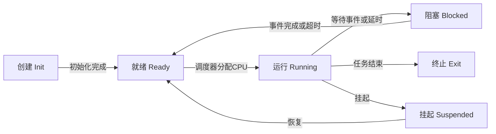
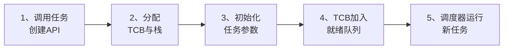
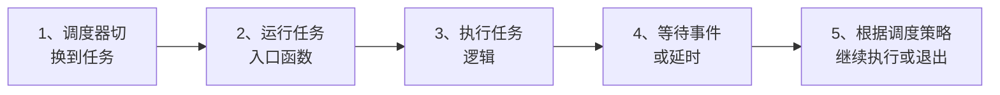
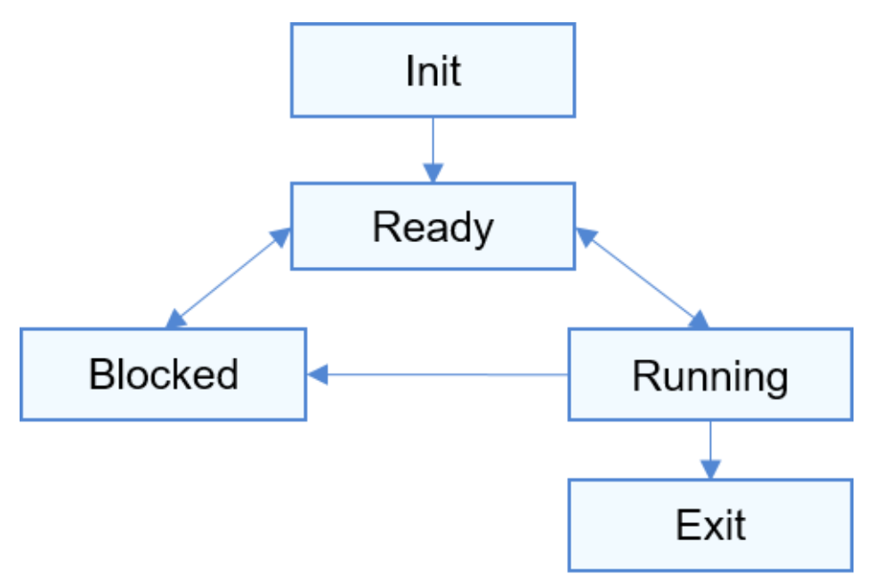
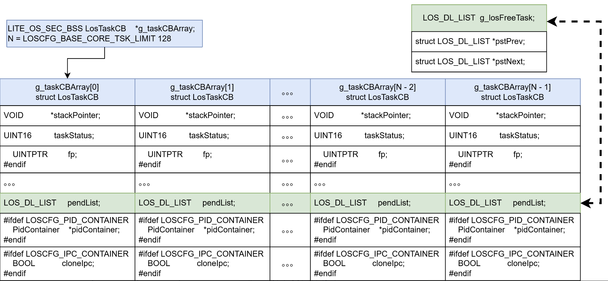

# 线程及Liteos_a内核线程分析

[TOC]

# 1、线程/任务的通用知识点

## 1.1、线程/任务的概念

- **线程（Thread）**：是进程中可独立调度和执行的最小单位，拥有独立的程序计数器（PC）、寄存器状态和栈空间，但共享进程的代码段、数据段和系统资源。
- **任务（Task）**：在嵌入式/RTOS 环境中通常等价于线程，强调执行单元的实时性与确定性。
- 线程/任务是实现程序并发执行的基本调度单元，依赖调度器来分配 CPU 使用权。
- 与进程相比，线程/任务之间的切换开销更小，通信更高效，但隔离性较弱。

**总结**：线程/任务通过共享资源与独立执行流，支撑了多核并行与实时响应；其调度策略与 TCB（Task Control Block）结构是系统性能和实时性的核心。


## 1.2、线程/任务的状态

在生命周期中，线程/任务通常具有以下状态（以 RTOS / Linux 通用模型为例）：

| **状态** | **描述**                                        |
| :------: | ----------------------------------------------- |
| **新建** | 线程/任务已创建但未加入就绪队列，资源初始化中。 |
| **就绪** | 所需资源已分配，等待调度器分配 CPU。            |
| **运行** | 正在 CPU 核心上执行指令。                       |
| **阻塞** | 等待特定事件（如信号量、I/O 完成、延时到期）。  |
| **挂起** | 主动暂停执行，不参与调度（需显式恢复）。        |
| **终止** | 执行结束或被删除，等待资源回收。                |


## 1.3、线程/任务的状态切换

状态转换由**调度器、事件、系统调用**驱动：

- **创建 → 就绪**：初始化 TCB、栈空间并登记到就绪队列。
- **就绪 → 运行**：调度器根据优先级/时间片选中任务执行。
- **运行 → 阻塞**：主动等待资源或事件（如 `osDelay()`、等待信号量）。
- **阻塞 → 就绪**：事件触发或超时到期，由内核唤醒。
- **运行 → 终止**：任务函数返回或调用删除 API。
- **运行/就绪/阻塞 ↔ 挂起**：显式挂起/恢复任务。

线程/任务状态转换流程图为：




## 1.4、线程/任务的内核数据结构

每个线程/任务对应一个 TCB（Task Control Block），存储其调度与执行所需信息。

- **关键字段**：
    - 任务 ID、状态、优先级。
    - 栈指针、寄存器上下文。
    - 时间片计数、延时计数。
    - 资源引用（信号量、消息队列等）。
    - 任务名、创建参数。
- **作用**：
    - 上下文切换时保存/恢复执行环境。
    - 调度器通过 TCB 队列管理所有任务。


## 1.5、线程/任务的初始化

通用初始化流程：

1. **调度器和同步机制初始化**
    - 让调度器具备任务管理能力，初始化内核时钟、中断服务。
2. **TCB 与栈空间分配策略**
    - 动态分配（malloc/heap）或静态分配（编译期分配），RTOS 常用静态分配保证确定性。
3. **创建系统基础任务**
    - 如空闲任务（Idle Task）、系统监控任务、内核维护任务。
4. **启动调度器**
    - 切换到第一个任务执行，进入多任务运行状态。

线程/任务初始化的流程图为：


## 1.6、线程/任务的创建

在用户态（应用层）创建新线程/任务的典型流程：

1. 调用任务创建 API（如 `pthread_create`、`osThreadNew`、`xTaskCreate`）。
2. 进入内核分配 TCB 和栈空间。
3. 初始化任务入口函数、优先级、时间片等参数。
4. 将 TCB 加入就绪队列。
5. 调度器在下一次调度周期运行该任务。

线程/任务创建的流程图为：




## 1.7、线程/任务的执行

- 任务入口函数由调度器在第一次切换时执行。
- 任务可为**循环型**（长期运行）或**一次性**（执行完结束）。
- 执行过程可能与其他任务并发运行，通过同步机制（信号量、互斥锁、事件标志组、消息队列）协调。

**执行流程**（循环任务）：

1. 调度器分配 CPU，切换到任务。
2. 运行任务入口函数。
3. 周期性执行工作，等待事件或延时。
4. 根据调度策略切换走或结束任务。




# 2、Liteos_a内核中线程/任务的实现

Liteos_a内核中线程叫做任务Task。


## 2.1、Liteos_a内核中任务的基本概念

​	从系统的角度看，任务Task是竞争系统资源的最小运行单元。任务可以使用或等待CPU、使用内存空间等系统资源，并独立于其它任务运行。

* Liteos_a 内核中使用一个任务表示一个线程。
* Liteos_a 内核中同优先级进程内的任务统一调度、运行。
* Liteos_a 内核中的任务采用抢占式调度机制，同时支持时间片轮转调度和FIFO调度方式。

* Liteos_a 内核的任务一共有32个优先级（0-31），最高优先级为0，最低优先级为31。

​	当前进程内, 高优先级的任务可抢占低优先级任务，低优先级任务必须在高优先级任务阻塞或结束后才能得到调度。除了官网给出的使用优先级字段的HPF调度算法之外，还支持按照Task的deadline进行任务调度的EDF算法。


## 2.2、Liteos_a内核中任务的状态

**任务状态说明**：

- 初始化（Init）：任务正在被创建。
- 就绪（Ready）：任务在就绪列表中，等待CPU调度。
- 运行（Running）：任务正在运行。
- 阻塞（Blocked）：任务被阻塞挂起。Blocked状态包括：pending（因为锁、事件、信号量等阻塞）、suspended（主动pend）、delay（延时阻塞）、pend time（因为锁、事件、信号量时间等超时等待）。
- 退出（Exit）：任务运行结束，等待父任务回收其控制块资源。


## 2.3、Liteos_a内核中任务的状态切换

**任务状态迁移示意图：**




**任务状态迁移说明：**

- Init→Ready： 任务创建拿到控制块后为初始化阶段（Init状态），当任务初始化完成将任务插入调度队列，此时任务进入就绪状态。
- Ready→Running： 任务创建后进入就绪态，发生任务切换时，就绪列表中最高优先级的任务被执行，从而进入运行态，此刻该任务从就绪列表中删除。
- Running→Blocked： 正在运行的任务发生阻塞（挂起、延时、读信号量等）时，任务状态由运行态变成阻塞态，然后发生任务切换，运行就绪列表中剩余最高优先级任务。
- Blocked→Ready ： 阻塞的任务被恢复后（任务恢复、延时时间超时、读信号量超时或读到信号量等），此时被恢复的任务会被加入就绪列表，从而由阻塞态变成就绪态。
- Ready→Blocked： 任务也有可能在就绪态时被阻塞（挂起），此时任务状态会由就绪态转变为阻塞态，该任务从就绪列表中删除，不会参与任务调度，直到该任务被恢复。
- Running→Ready： 有更高优先级任务创建或者恢复后，会发生任务调度，此刻就绪列表中最高优先级任务变为运行态，那么原先运行的任务由运行态变为就绪态，并加入就绪列表中。
- Running→Exit： 运行中的任务运行结束，任务状态由运行态变为退出态。若为设置了分离属性（ 由头文件 los_task.h 中的宏定义 LOS_TASK_STATUS_DETACHED 设置）的任务，运行结束后将直接销毁。


## 2.4、Liteos_a内核中任务的运行机制

​	Liteos_a 任务管理模块提供任务创建、任务延时、任务挂起和任务恢复、锁任务调度和解锁任务调度、根据ID查询任务控制块信息功能。

​	用户创建任务时，系统会将任务栈进行初始化，预置上下文。此外，系统还会将“任务入口函数”地址放在相应位置。这样在任务第一次启动进入运行态时，将会执行任务入口函数。


## 2.5、Liteos_a内核中任务机制分析总结

​	分析到这里，可以看出Liteos_a内核完整的实现了 1.1 ~ 1.7 小节中任务通用的所有机制。接下来就借助Liteos_a内核的源代码继续分析，Liteos_a内核是如何通过代码将任务的这些机制一一实现的。


# 3、Liteos_a内核任务的源码分析

## 3.1、Liteos_a内核任务的状态定义

Liteos_a内核中Task的状态有如下几种：

```c
// kernel_liteos_a\kernel\base\include\los_sched_pri.h
// The task is init.
#define OS_TASK_STATUS_INIT         0x0001U

// The task is ready.
#define OS_TASK_STATUS_READY        0x0002U

// The task is running.
#define OS_TASK_STATUS_RUNNING      0x0004U

// The task is suspended.
#define OS_TASK_STATUS_SUSPENDED    0x0008U

// The task is blocked.
#define OS_TASK_STATUS_PENDING      0x0010U

// The task is delayed.
#define OS_TASK_STATUS_DELAY        0x0020U

// The time for waiting for an event to occur expires.
#define OS_TASK_STATUS_TIMEOUT      0x0040U

// The task is pend for a period of time.
#define OS_TASK_STATUS_PEND_TIME    0x0080U

// The task is exit.
#define OS_TASK_STATUS_EXIT         0x0100U

// The task is blocked.
#define OS_TASK_STATUS_BLOCKED  (OS_TASK_STATUS_INIT | OS_TASK_STATUS_PENDING | \
                                 OS_TASK_STATUS_DELAY | OS_TASK_STATUS_PEND_TIME | \
                                 OS_TASK_STATUS_SUSPENDED)

// The delayed operation of this task is frozen.
#define OS_TASK_STATUS_FROZEN       0x0200U
```


## 3.2、Liteos_a内核任务的TCB

任务控制快主要有几大板块：
* 执行上下文 ：

    - stackPointer ：保存任务上下文切换时的寄存器状态
    - taskStatus ：使用位掩码管理任务状态（如0x0002=就绪）

* 时间管理 ：

    - 多个时间戳字段用于统计任务执行时间、中断耗时
    - timeSlice 实现时间片轮转调度

* 调度控制 ：

    - ops 包含调度策略函数指针（入队/出队/选择任务等操作）
    - sp 存储具体的调度参数（优先级/时限等）

* 同步机制 ：

    - pendList 用于实现任务阻塞时的等待队列
    - taskMux 和 taskEvent 管理任务持有的同步资源

* 多核扩展 ：

    - CPU亲和性字段支持任务绑定特定核心
    - SMP相关字段实现核间负载均衡

* 调试支持 ：

    - taskName 方便调试时识别任务

    - taskCpup 统计CPU使用率

    - errorNo 记录最近错误原因

* 特殊成员说明：

  - sortList 用于实现精确到cycle级别的超时管理

  - sp 是联合体，根据调度策略（HPF/EDF）复用存储空间

  - ops 实现策略模式，不同调度算法有不同的函数实现

* 条件编译成员（举例）：

  - archMmu 仅在启用虚拟内存时存在

  - cpuAffiMask 只在SMP配置下生效

  - taskCpup 依赖CPUP统计模块的开启

下面列举TCB中主要的几个成员，具体见官方源码中的定义：[Liteos_a内核TCB结构体定义](https://github.com/openharmony/kernel_liteos_a/blob/master/kernel/base/include/los_sched_pri.h)

```c
// kernel_liteos_a\kernel\base\include\los_sched_pri.h
typedef struct TagTaskCB {
    VOID            *stackPointer;      /**< Task stack pointer */
    UINT16          taskStatus;         /**< Task status */
...
    const SchedOps  *ops;
    SchedPolicy     sp;
    UINT32          stackSize;          /**< Task stack size */
    UINTPTR         topOfStack;         /**< Task stack top */
    UINT32          taskID;             /**< Task ID */
    TSK_ENTRY_FUNC  taskEntry;          /**< Task entrance function */
...
#ifdef LOSCFG_KERNEL_VM
    UINTPTR         archMmu;
    UINTPTR         userArea;
    UINTPTR         userMapBase;
    /**< user thread stack size ,real size : userMapSize + USER_STACK_MIN_SIZE */
    UINT32          userMapSize;
    FutexNode       futex;
#endif
    UINTPTR         processCB;          /**< Which belong process */
    LOS_DL_LIST     joinList;           /**< join list */
    LOS_DL_LIST     lockList;           /**< Hold the lock list */
...
} LosTaskCB;
```


## 3.3、Liteos_a内核任务模块初始化

Liteos_a内核中的任务TCB不是使用malloc()等类似函数动态分配其内存。

而是在系统上电复位初始化之后分配一块固定的内存当做任务池，在系统运行过程中分配TCB也是从任务池中返回一个指向TCB结构体的指针；退出的任务，其TCB会被回收到任务池中继续使用。

Liteos_a内核中任务模块的初始化总体流程如下：

* 1、系统上电启动进行硬件和其他必要模块的初始化。
* 2、进行进程初始化时穿插着进行任务初始化。
    * 2.1、分配任务池，并初始化每个CPU核的调度队列。
    * 2.2、之后进程即可使用任务模块。


## 3.4、Liteos_a内核任务相关源码分析

这里只展示核心代码，完整代码见官网：https://github.com/openharmony/kernel_liteos_a


### 3.4.1、任务池初始化源码分析

任务池的初始化过程主要做了两件事情：

* 1、创建任务池
    * 1.1、分配内存创建任务池
    * 1.2、分配任务ID
    * 1.3、调用OsSchedInit初始化调度队列
* 2、初始化调度队列
    * 2.1、取出不同CPU核中的调度队列
    * 2.2、分别初始化调度队列中不同调度算法对应的具体队列的数据结构


任务池初始化之后结构如下：




整体函数调用链为：

```c
// kernel_liteos_a\arch\arm\arm\src\startup\reset_vector_mp.S
reset_vector // 系统上电复位之后的入口
    bl main
// kernel_liteos_a\kernel\common\main.c
    	main
    		OsMain
// kernel_liteos_a\kernel\base\core\los_process.c
    			OsProcessInit
// kernel_liteos_a\kernel\base\core\los_task.c
    				OsTaskInit
// kernel_liteos_a\kernel\base\sched\los_sched.c
    					OsSchedInit
```

OsTaskInit 函数流程如下：

```c
// kernel_liteos_a\kernel\base\core\los_task.c
OsTaskInit
    // 2.1、创建任务池
    // 默认最大任务数量为LOSCFG_BASE_CORE_TSK_LIMIT = 128
    g_taskMaxNum = LOSCFG_BASE_CORE_TSK_LIMIT;
    size = (g_taskMaxNum + 1) * sizeof(LosTaskCB);
    // 为任务池分配内存，并清零
    g_taskCBArray = (LosTaskCB *)LOS_MemAlloc(m_aucSysMem0, size);
    // 2.2、分配任务ID
    // 每个任务分配ID、默认所属进程为64号进程
    // 将任务挂在到全局任务空闲链表g_losFreeTask上
    for (index = 0; index < g_taskMaxNum; index++) {
        g_taskCBArray[index].taskStatus = OS_TASK_STATUS_UNUSED;
        g_taskCBArray[index].taskID = index;
        g_taskCBArray[index].processCB = processCB;
        LOS_ListTailInsert(&g_losFreeTask, &g_taskCBArray[index].pendList);
    }
    // 2.3、调用OsSchedInit初始化调度队列
    // 初始化调度队列结构本身
    // 调度队列为一个队列类型的数据结构体
    ret = OsSchedInit();
```

OsSchedInit函数流程如下：

```c
// kernel_liteos_a\kernel\base\sched\los_sched.c
OsSchedInit
    for (UINT16 cpuid = 0; cpuid < LOSCFG_KERNEL_CORE_NUM; cpuid++) {
        // 3.1、取出不同CPU核中的调度队列
        SchedRunqueue *rq = OsSchedRunqueueByID(cpuid);
        // 3.2、分别初始化调度队列中不同调度算法对应的具体队列的数据结构
        EDFSchedPolicyInit(rq);
        HPFSchedPolicyInit(rq);
    }
```


### 3.4.2、任务创建函数源码分析

Liteos_a内核提供两个创建任务的内核函数，分别是 LOS_TaskCreateOnly 和 LOS_TaskCreate。

LOS_TaskCreate 中主要做几件事情：

* 1、使用LOS_TaskCreateOnly创建任务

* 2、将任务加入就绪队列

* 3、确保新创建的任务触发一次任务调度

其中  LOS_TaskCreateOnly 函数主要做了以下几件事情：

* 1、从空闲链表中获取一个TCB
* 2、初始化这个TCB的各种成员


LOS_TaskCreate 函数源码分析：

```c
// kernel_liteos_a\kernel\base\core\los_task.c
LITE_OS_SEC_TEXT_INIT UINT32 
LOS_TaskCreate(UINT32 *taskID, TSK_INIT_PARAM_S *initParam)
{
...
	// 1、使用LOS_TaskCreateOnly创建任务
    ret = LOS_TaskCreateOnly(taskID, initParam);
...
    SCHEDULER_LOCK(intSave);
    // 2、将任务加入就绪队列
    taskCB->ops->enqueue(OsSchedRunqueue(), taskCB);
    SCHEDULER_UNLOCK(intSave);
...
	// 3、确保新创建的任务触发一次任务调度
    // 先通知其他CPU触发调度
    // 每个CPU维护一个调度运行时队列，但是其中HPF、EDF等调度策略使用的是同一个
    LOS_MpSchedule(OS_MP_CPU_ALL);
    // 再检查是否需要调度，确保新创建加入就绪队列的任务可能需要调度
    // 需要调度则使用LOS_Schedule主动触发调度
    if (OS_SCHEDULER_ACTIVE) {
        LOS_Schedule();
    }
    return LOS_OK;
}
```

 LOS_TaskCreateOnly 函数源码分析：

```c
kernel_liteos_a\kernel\base\core\los_task.c
LITE_OS_SEC_TEXT_INIT UINT32 
LOS_TaskCreateOnly(UINT32 *taskID, TSK_INIT_PARAM_S *initParam)
{
    // 任务名称检查、空指针检查、任务入口函数检查、任务优先级检查、栈大小检查与调整
    UINT32 errRet = TaskCreateParamCheck(taskID, initParam);
...

    // 1、从任务空闲链表g_losFreeTask中获取一个TCB
    LosTaskCB *taskCB = GetFreeTaskCB();
...

    // 2、初始化TCB结构体中的成员
    errRet = TaskCBInit(taskCB, initParam);
...

    // 初始化任务在signal中所使用的信号量semaphore
    errRet = TaskSyncCreate(taskCB);
...

    // 初始化任务栈stack，确保任务在原过程中的局部变量有栈内存可使用
    errRet = TaskStackInit(taskCB, initParam);
...

    // 确保了新创建的任务能够继承父任务的控制台设备，
    // 从而保证任务的输入输出能够正确地重定向到相应的控制台（串口或网络终端）。
    if (OsConsoleIDSetHook != NULL) {
        OsConsoleIDSetHook(taskCB->taskID, OsCurrTaskGet()->taskID);
    }

    *taskID = taskCB->taskID;
...
}
```

其中 TaskCBInit 函数源码分析：

```c
// kernel_liteos_a\kernel\base\core\los_task.c
STATIC UINT32 TaskCBInit(LosTaskCB *taskCB, const TSK_INIT_PARAM_S *initParam)
{
...
    UINT16 policy = (initParam->policy == LOS_SCHED_NORMAL) ? \
						LOS_SCHED_RR : initParam->policy;
    // 初始化TCB结构体的基础数据
    TaskCBBaseInit(taskCB, initParam);

    // 设置Task的调度策略并将TCB加入到PCB的管理当中
    schedParam.policy = policy;
    ret = OsProcessAddNewTask(initParam->processID, taskCB, &schedParam, &numCount);
...
    // 根据调度策略选择调度参数
    if (policy == LOS_SCHED_DEADLINE) {
        initSchedParam.runTimeUs = initParam->runTimeUs;
        initSchedParam.deadlineUs = initParam->deadlineUs;
        initSchedParam.periodUs = initParam->periodUs;
    } else {
        initSchedParam.priority = initParam->usTaskPrio;
    }
    // 调用不同调度策略提供的函数设置TCB的调度参数
    ret = OsSchedParamInit(taskCB, policy, &schedParam, &initSchedParam);
..
}
```


# 4、Liteos_a内核任务编程实例

​	代码实现如下（该示例代码的测试函数可以加在 kernel /liteos_a/testsuites /kernel /src /osTest.c 中的 TestTaskEntry 中进行测试。）：

```c
UINT32 g_taskLoID;
UINT32 g_taskHiID;
#define TSK_PRIOR_HI 4
#define TSK_PRIOR_LO 5
UINT32 ExampleTaskHi(VOID)
{
    UINT32 ret;
    PRINTK("Enter TaskHi Handler.\n");
    /* 延时2个Tick，延时后该任务会挂起，执行剩余任务中最高优先级的任务(g_taskLoID任务) */
    ret = LOS_TaskDelay(2);
    if (ret != LOS_OK) {
        PRINTK("Delay Task Failed.\n");
        return LOS_NOK;
    }
    /* 2个Tick时间到了后，该任务恢复，继续执行 */
    PRINTK("TaskHi LOS_TaskDelay Done.\n");
    /* 挂起自身任务 */
    ret = LOS_TaskSuspend(g_taskHiID);
    if (ret != LOS_OK) {
        PRINTK("Suspend TaskHi Failed.\n");
        return LOS_NOK;
    }
    PRINTK("TaskHi LOS_TaskResume Success.\n");
    return LOS_OK;
}

/* 低优先级任务入口函数 */
UINT32 ExampleTaskLo(VOID)
{
    UINT32 ret;
    PRINTK("Enter TaskLo Handler.\n");
    /* 延时2个Tick，延时后该任务会挂起，执行剩余任务中就高优先级的任务(背景任务) */
    ret = LOS_TaskDelay(2);
    if (ret != LOS_OK) {
        PRINTK("Delay TaskLo Failed.\n");
        return LOS_NOK;
    }
    PRINTK("TaskHi LOS_TaskSuspend Success.\n");
    /* 恢复被挂起的任务g_taskHiID */
    ret = LOS_TaskResume(g_taskHiID);
    if (ret != LOS_OK) {
        PRINTK("Resume TaskHi Failed.\n");
        return LOS_NOK;
    }
    PRINTK("TaskHi LOS_TaskDelete Success.\n");
    return LOS_OK;
}
/* 任务测试入口函数，在里面创建优先级不一样的两个任务 */
UINT32 ExampleTaskCaseEntry(VOID)
{
    UINT32 ret;
    TSK_INIT_PARAM_S initParam = {0};

    /* 锁任务调度 */
    LOS_TaskLock();
    PRINTK("LOS_TaskLock() Success!\n");
    /* 高优先级任务的初始化参数，其资源回收需要其他任务调用 LOS_TaskJoin */
    initParam.pfnTaskEntry = (TSK_ENTRY_FUNC)ExampleTaskHi;
    initParam.usTaskPrio = TSK_PRIOR_HI;
    initParam.pcName = "HIGH_NAME";
    initParam.uwStackSize = LOS_TASK_MIN_STACK_SIZE;
    initParam.uwResved   = LOS_TASK_ATTR_JOINABLE;

    /* 创建高优先级任务，由于锁任务调度，任务创建成功后不会马上执行 */
    ret = LOS_TaskCreate(&g_taskHiID, &initParam);
    if (ret != LOS_OK) {
        LOS_TaskUnlock();
        PRINTK("ExampleTaskHi create Failed! ret=%d\n", ret);
        return LOS_NOK;
    }
    PRINTK("ExampleTaskHi create Success!\n");

    /* 低优先级任务的初始化参数，任务结束后会自行结束销毁 */
    initParam.pfnTaskEntry = (TSK_ENTRY_FUNC)ExampleTaskLo;
    initParam.usTaskPrio = TSK_PRIOR_LO;
    initParam.pcName = "LOW_NAME";
    initParam.uwStackSize = LOS_TASK_MIN_STACK_SIZE;
    initParam.uwResved   = LOS_TASK_STATUS_DETACHED;

    /* 创建低优先级任务，由于锁任务调度，任务创建成功后不会马上执行 */
    ret = LOS_TaskCreate(&g_taskLoID, &initParam);
    if (ret!= LOS_OK) {
        LOS_TaskUnlock();
        PRINTK("ExampleTaskLo create Failed!\n");
        return LOS_NOK;
    }
    PRINTK("ExampleTaskLo create Success!\n");

    /* 解锁任务调度，此时会发生任务调度，执行就绪列表中最高优先级任务 */
    LOS_TaskUnlock();
    ret = LOS_TaskJoin(g_taskHiID, NULL);
    if (ret != LOS_OK) {
        PRINTK("Join ExampleTaskHi Failed!\n");
    } else {
        PRINTK("Join ExampleTaskHi Success!\n");
    }
    while(1){};
    return LOS_OK;
}
```

编译运行得到的结果为：

```c
LOS_TaskLock() Success!
ExampleTaskHi create Success!
ExampleTaskLo create Success!
Enter TaskHi Handler.
Enter TaskLo Handler.
TaskHi LOS_TaskDelay Done.
TaskHi LOS_TaskSuspend Success.
TaskHi LOS_TaskResume Success.
TaskHi LOS_TaskDelete Success.
Join ExampleTaskHi Success!
```


