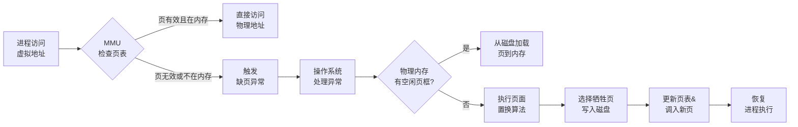
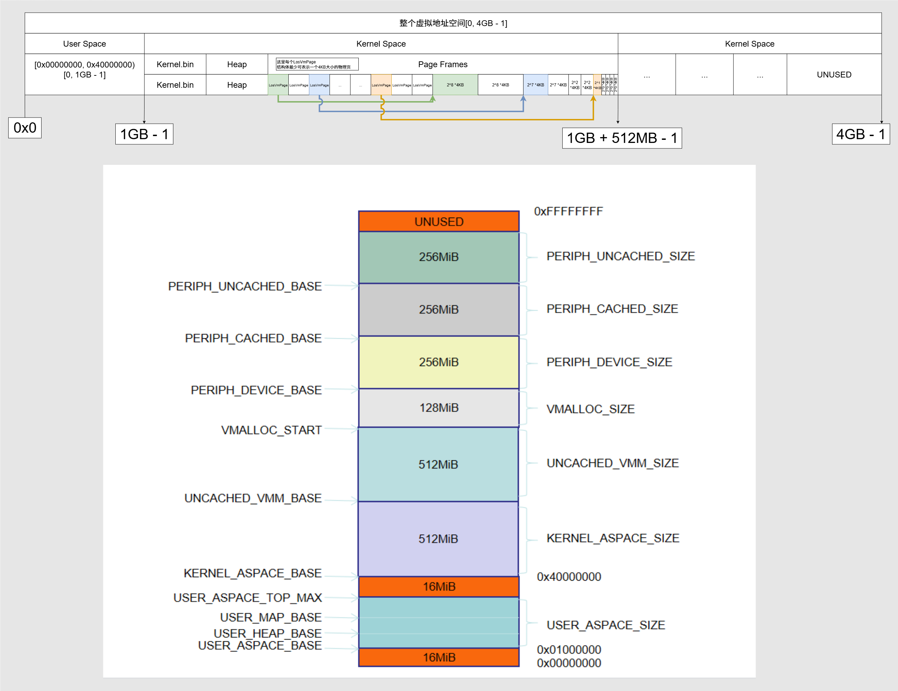
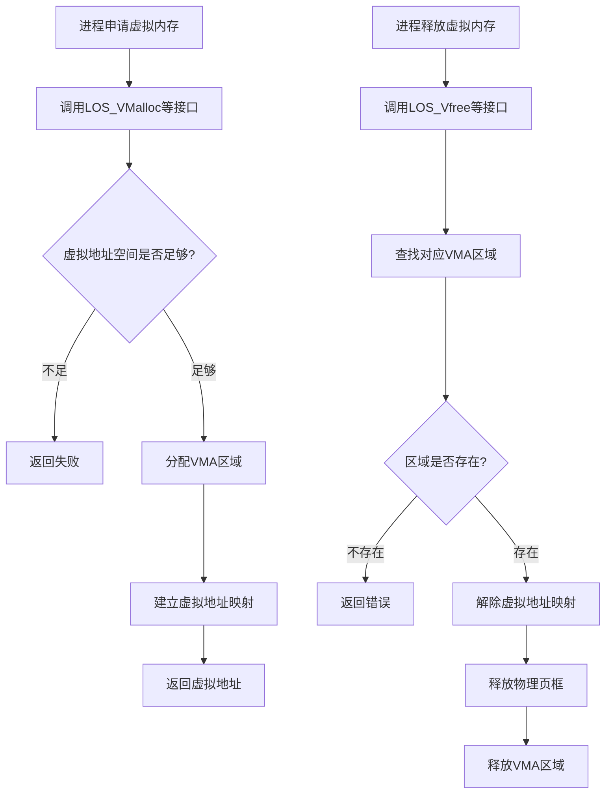
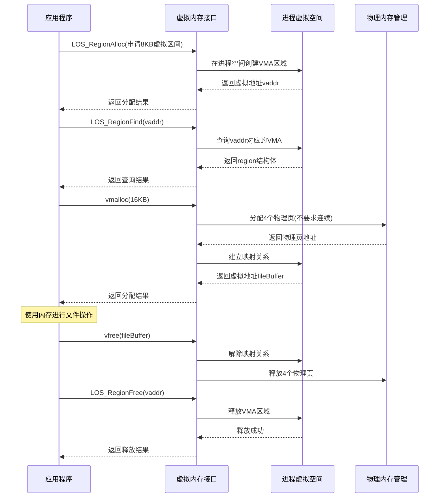

# 虚拟内存与Liteos_a内核虚拟内存分析

[TOC]

# 0、一句话总结

​	虚拟内存是一种通过硬盘空间扩展物理内存、为每个进程提供连续独立地址空间的内存管理技术，解决了物理内存容量不足和进程间内存隔离保护的问题。


# 1、虚拟内存的通用知识点

## 1.1、虚拟内存的概念

虚拟内存（Virtual Memory）是一种**内存管理技术**，它通过软硬件协作实现以下核心能力：

- **地址空间虚拟化**：为每个进程提供独立的、连续的虚拟地址空间（逻辑地址），使程序认为自己独占整个内存，而实际物理内存可能分散或不足。
- **容量扩展**：利用硬盘空间（如页面文件 `PageFile.sys`）作为物理内存的扩展，允许程序使用超过实际RAM容量的内存。
- **透明性**：应用程序无需感知数据实际存储位置（内存或磁盘），由操作系统自动调度。

**核心目标**：解决物理内存不足、提升多任务隔离性及内存利用率。


## 1.2、虚拟内存的通用结构

虚拟内存系统的核心组件包括：

- **地址空间划分**：
  - **虚拟地址空间**（逻辑地址）：进程视角的连续地址范围，划分为固定大小的**页**（Page，通常4KB）或逻辑**段**（Segment）。
  - **物理地址空间**：实际内存被划分为相同大小的**页框**（Page Frame）。
- **映射表结构**：
  - **页表**（Page Table）：存储虚拟页号→物理页框号的映射关系，含状态位（如有效位、修改位）。
  - **段表**（Segment Table）：记录段基址、段长及权限（仅段式/段页式使用）。
- **辅助存储**：
  - **交换空间**（Swap Space）：硬盘上的保留区域（如页面文件），用于存储被换出的页。
- **硬件支持**：
  - **内存管理单元**（MMU）：负责虚拟地址到物理地址的实时转换。
  - **转换后备缓冲器**（TLB）：缓存频繁访问的页表项，加速地址转换。


## 1.3、虚拟内存申请与释放流程

#### **内存申请流程**



#### **内存释放流程**

- **主动释放**：进程主动释放内存（如 `free()`），操作系统标记相关页/段为可复用，更新页表状态。
- **被动回收**：
  - 物理内存不足时，**置换算法**（如LRU）选择“最近最少使用”的页写入交换空间，释放其页框。
  - 修改过的页（脏页）需写回磁盘再释放；未修改页直接丢弃。


## 1.4、虚拟内存关键机制说明

### **1.4.1、地址转换机制**

- **分页模式**：虚拟地址 = **页号 + 页内偏移** → 页表查询 → 物理页框号 + 同一偏移。
- **分段模式**：虚拟地址 = **段号 + 段内偏移** → 段表查询基址/段长 → 物理地址 = 基址 + 偏移（需越界检查）。
- **段页式**：先分段，段内再分页，综合两者优势。


### **1.4.2、页面置换算法**

| **算法**  | **原理**                 | **特点**                   |
| --------- | ------------------------ | -------------------------- |
| **FIFO**  | 淘汰最早进入的页         | 简单，但可能淘汰热点页     |
| **LRU**   | 淘汰最久未使用的页       | 效果优，需硬件记录访问时间 |
| **OPT**   | 淘汰未来最长时间不用的页 | 理论最优，不可实现         |
| **CLOCK** | 基于访问位轮询淘汰       | 平衡效率与开销             |


### **1.4.3、缺页异常处理**

- **触发条件**：访问的页不在内存（页表有效位=0）。
- **处理步骤**：
  1. 挂起进程，保存现场；
  2. 若页在磁盘，将其加载至空闲页框；
  3. 无空闲页框则触发置换；
  4. 更新页表，恢复进程执行。


### **1.4.4、写时复制（COW）**

- **机制**：多个进程共享同一物理页时，仅当某进程尝试**写入**才复制新页，减少冗余拷贝。


### **1.4.5、性能与限制**

- **优势**：
  - 扩展内存容量、隔离进程地址空间、支持动态内存分配。
- **代价**：
  - **性能损耗**：磁盘I/O速度远低于RAM（千倍差距），频繁置换导致系统卡顿。
  - **空间权衡**：过度依赖虚拟内存会加速硬盘磨损，物理内存扩容仍是根本解决方案。

**总结**：虚拟内存的核心价值在于**通过分层存储（内存+磁盘）和地址映射，实现内存资源的抽象化、隔离化与扩展化**。其通用设计围绕地址转换、按需调页、置换策略展开，平衡容量与性能的矛盾。


# 2、Liteos_a内核中虚拟内存的实现

## 2.1、Liteos_a内核中虚拟内存的概念

​	虚拟内存管理是计算机系统管理内存的一种技术。每个进程都有连续的虚拟地址空间，虚拟地址空间的大小由CPU的位数决定，32位的硬件平台可以提供的最大的寻址空间为0-4GiB。整个4GiB空间分成两部分，Liteos_a内核占据3GiB的高地址空间，1GiB的低地址空间留给用户态进程使用。各个进程空间的虚拟地址空间是独立的，代码、数据互不影响。

​	系统将虚拟内存分割为称为虚拟页的内存块，大小一般为4KiB或64KiB，Liteos_a内核默认的页的大小是4KiB，根据需要可以对MMU（Memory Management Units）进行配置。虚拟内存管理操作的最小单位就是一个页，Liteos_a内核中一个虚拟地址区间region包含地址连续的多个虚拟页，也可只有一个页。同样，物理内存也会按照页大小进行分割，分割后的每个内存块称为页帧。虚拟地址空间划分：内核态占高地址3GiB(0x40000000 ~ 0xFFFFFFFF)，用户态占低地址1GiB(0x01000000 ~ 0x3F000000)，具体见下表，详细可以查看或配置los_vm_zone.h文件。


**内核态地址规划：**

| Zone名称      | 描述                                                     | 属性    |
| ------------- | -------------------------------------------------------- | ------- |
| DMA zone      | 供IO设备的DMA使用。                                      | Uncache |
| Normal zone   | 加载内核代码段、数据段、堆和栈的地址区间。               | Cache   |
| high mem zone | 可以分配连续的虚拟内存，但其所映射的物理内存不一定连续。 | Cache   |


**用户态虚地址规划：**

| Zone名称 | 描述                                                   | 属性  |
| -------- | ------------------------------------------------------ | ----- |
| 代码段   | 用户态代码段地址区间。                                 | Cache |
| 堆       | 用户态堆地址区间。                                     | Cache |
| 栈       | 用户态栈地址区间。                                     | Cache |
| 共享库   | 用于加载用户态共享库的地址区间，包括mmap所映射的区间。 | Cache |


**Liteos_a内核虚拟内存结构图：**




## 2.2、Liteos_a内核的虚拟内存运行机制

虚拟内存管理中，虚拟地址空间是连续的，但是其映射的物理内存并不一定是连续的，如下图所示。可执行程序加载运行，CPU访问虚拟地址空间的代码或数据时存在两种情况：

- CPU访问的虚拟地址所在的页，如V0，已经与具体的物理页P0做映射，CPU通过找到进程对应的页表条目（详见[虚实映射](https://gitee.com/openharmony/docs/blob/master/zh-cn/device-dev/kernel/kernel-small-basic-inner-reflect.md)），根据页表条目中的物理地址信息访问物理内存中的内容并返回。
- CPU访问的虚拟地址所在的页，如V2，没有与具体的物理页做映射，系统会触发缺页异常，系统申请一个物理页，并把相应的信息拷贝到物理页中，并且把物理页的起始地址更新到页表条目中。此时CPU重新执行访问虚拟内存的指令便能够访问到具体的代码或数据。

**内存映射示意图：**


## 2.3、Liteos_a内核虚拟内存申请释放流程图



**申请流程**：

- 进程通过`LOS_VMalloc`等接口申请虚拟内存
- 内核检查虚拟地址空间(VAS)是否足够
- 分配虚拟内存区域(VMA)
- 建立虚拟地址到物理内存的映射关系
- 返回分配成功的虚拟地址

**释放流程**：

- 进程通过`LOS_Vfree`等接口释放虚拟内存
- 内核查找对应的VMA区域
- 解除虚拟地址映射关系
- 释放物理页框
- 释放VMA区域资源

> 关键特点：
>
> 1. 采用按需分配策略（COW技术延迟物理内存分配）
> 2. 使用VMA（Virtual Memory Area）管理虚拟内存区域
> 3. 支持延迟分配，物理页框在首次访问时通过缺页异常分配
> 4. 释放时会同时解除映射并回收物理内存
> 5. 通过页表管理虚拟地址到物理地址的转换


## 2.4、Liteos_a内核虚拟内存模块的总结

分析到这里，可以看出Liteos_a内核完整的实现了 1.1 ~ 1.3 小节中虚拟内存所有的通用机制。接下来就借助Liteos_a内核的源代码继续分析，Liteos_a内核是如何通过代码将虚拟内存的这些机制一一实现的。


# 3、Liteos_a内核虚拟内存开发案例

## 3.1、接口说明

获取进程空间系列接口

| 接口名称            | 描述                                 |
| ------------------- | ------------------------------------ |
| LOS_CurrSpaceGet    | 获取当前进程空间结构体指针           |
| LOS_SpaceGet        | 获取虚拟地址对应的进程空间结构体指针 |
| LOS_GetKVmSpace     | 获取内核进程空间结构体指针           |
| LOS_GetVmallocSpace | 获取vmalloc空间结构体指针            |
| LOS_GetVmSpaceList  | 获取进程空间链表指针                 |


虚拟地址区间region相关的操作

| 接口名称                     | 描述                                                 |
| ---------------------------- | ---------------------------------------------------- |
| LOS_RegionFind               | 在进程空间内查找并返回指定地址对应的虚拟地址区间     |
| LOS_RegionRangeFind          | 在进程空间内查找并返回指定地址范围对应的虚拟地址区间 |
| LOS_IsRegionFileValid        | 判断虚拟地址区间region是否与文件关联映射             |
| LOS_RegionAlloc              | 申请空闲的虚拟地址区间                               |
| LOS_RegionFree               | 释放进程空间内特定的region                           |
| LOS_RegionEndAddr            | 获取指定地址区间region的结束地址                     |
| LOS_RegionSize               | 获取region的大小                                     |
| LOS_IsRegionTypeFile         | 判断是否为文件内存映射                               |
| LOS_IsRegionPermUserReadOnly | 判断地址区间是否是用户空间只读属性                   |
| LOS_IsRegionFlagPrivateOnly  | 判断地址区间是否是具有私有属性                       |
| LOS_SetRegionTypeFile        | 设置文件内存映射属性                                 |
| LOS_IsRegionTypeDev          | 判断是否为设备内存映射                               |
| LOS_SetRegionTypeDev         | 设置设备内存映射属性                                 |
| LOS_IsRegionTypeAnon         | 判断是否为匿名映射                                   |
| LOS_SetRegionTypeAnon        | 设置匿名映射属性                                     |


地址校验

| 接口名称                 | 描述                         |
| ------------------------ | ---------------------------- |
| LOS_IsUserAddress        | 判断地址是否在用户态空间     |
| LOS_IsUserAddressRange   | 判断地址区间是否在用户态空间 |
| LOS_IsKernelAddress      | 判断地址是否在内核空间       |
| LOS_IsKernelAddressRange | 判断地址区间是否在内核空间   |
| LOS_IsRangeInSpace       | 判断地址区间是否在进程空间内 |


vmalloc操作

| 接口名称             | 描述                            |
| -------------------- | ------------------------------- |
| LOS_VMalloc          | vmalloc申请内存                 |
| LOS_VFree            | vmalloc释放内存                 |
| LOS_IsVmallocAddress | 判断地址是否是通过vmalloc申请的 |


内存申请系列接口

| 接口名称              | 描述                                                         |
| --------------------- | ------------------------------------------------------------ |
| LOS_KernelMalloc      | 当申请的内存小于16KiB时，系统从堆内存池分配内存；当申请的内存超过16KiB时，系统分配多个连续物理页用于内存分配 |
| LOS_KernelMallocAlign | 申请具有对齐属性的内存，申请规则同LOS_KernelMalloc接口       |
| LOS_KernelFree        | 释放由LOS_KernelMalloc和LOS_KernelMallocAlign接口申请的内存  |
| LOS_KernelRealloc     | 重新分配由LOS_KernelMalloc和LOS_KernelMallocAlign接口申请的内存 |


其他

| 接口名称             | 描述                                                         |
| -------------------- | ------------------------------------------------------------ |
| LOS_PaddrQuery       | 根据虚拟地址获取对应的物理地址                               |
| LOS_VmSpaceFree      | 释放进程空间，包括虚拟内存区间、页表等信息                   |
| LOS_VmSpaceReserve   | 在进程空间中预留一块内存空间                                 |
| LOS_VaddrToPaddrMmap | 将指定长度的物理地址区间与虚拟地址区间做映射，需提前申请物理地址区间 |


## 3.2、开发流程

虚拟内存相关接口的使用：

1、根据进程空间获取的系列接口可以得到进程空间结构体，进而可以读取结构体相应信息。

2、对虚拟地址区间做相关操作：

- 通过 LOS_RegionAlloc 申请虚拟地址区间；
- 通过 LOS_RegionFind、LOS_RegionRangeFind 可以查询是否存在相应的地址区间；
- 通过 LOS_RegionFree 释放虚拟地址区间。

3、vmalloc 接口及内存申请系列接口可以在内核中根据需要申请内存。

特别说明：

​	内存申请系列接口申请的内存要求物理内存是连续的，当系统内存无法满足大块连续内存的申请条件时会申请失败，一般适用于小块内存的申请；vmalloc相关接口申请的内存可以获得不连续的物理内存，但其是以页（当前系统一个页为4096字节）为单位的，当需要申请以页为整数倍的内存时可以通过vmalloc申请，例如文件系统中文件读取需要较大的缓存，便可以通过vmalloc相关接口申请内存。


## 3.3、编程实例

### 3.3.1、实例描述

本示例展示在Liteos_a内核中使用虚拟内存接口的典型场景：

* 1、通过`LOS_RegionAlloc`分配虚拟地址区间

* 2、使用`LOS_RegionFind`查询分配的虚拟地址区间

* 3、通过`vmalloc`申请大块非连续物理内存

* 4、释放虚拟地址区间和vmalloc内存


### 3.3.2、编程示例

```c
#include "los_vm_common.h"
#include "los_vm_map.h"
#include "los_vm_lock.h"
#include "los_vm_dump.h"

void vm_demo(void)
{
    /* 1. 获取当前进程空间结构体 */
    LosProcessCB *process = OsCurrProcessGet();
    LosVmSpace *vmSpace = process->vmSpace;
    
    /* 2. 分配虚拟地址区间 */
    VADDR_T vaddr = 0;
    size_t regionSize = 0x2000; // 8KB虚拟地址区间
    status_t ret = LOS_RegionAlloc(vmSpace, &vaddr, regionSize, 0, 
                                  VM_MAP_REGION_FLAG_PERM_READ | 
                                  VM_MAP_REGION_FLAG_PERM_WRITE);
    if (ret != LOS_OK) {
        PRINT_ERR("Failed to allocate virtual region! error: %d\n", ret);
        return;
    }
    PRINTK("Allocated virtual region at 0x%x\n", vaddr);
    
    /* 3. 查询分配的虚拟地址区间 */
    LosVmMapRegion *region = LOS_RegionFind(vmSpace, vaddr);
    if (region) {
        PRINTK("Found region: start=0x%x, size=0x%x\n", 
              region->range.base, region->range.size);
    }
    
    /* 4. 使用vmalloc申请大块内存 */
    size_t fileCacheSize = 4 * PAGE_SIZE; // 16KB文件缓存
    void *fileBuffer = vmalloc(fileCacheSize);
    if (!fileBuffer) {
        PRINT_ERR("vmalloc failed for file cache!\n");
        goto ERROR;
    }
    PRINTK("vmalloc allocated %d bytes at %p\n", fileCacheSize, fileBuffer);
    
    /* 5. 模拟文件读取操作 */
    // read_file_into_buffer(fileBuffer, fileCacheSize);
    
    /* 6. 释放资源 */
    vfree(fileBuffer);  // 释放vmalloc内存
    
    ERROR:
    /* 7. 释放虚拟地址区间 */
    ret = LOS_RegionFree(vmSpace, vaddr, regionSize);
    if (ret != LOS_OK) {
        PRINT_ERR("Failed to free region! error: %d\n", ret);
    }
}
```


### 3.3.3、示例时序图



**关键说明：**

1、**虚拟地址区间分配**：

- `LOS_RegionAlloc`在进程虚拟地址空间中创建新的VMA区域
- 此时仅预留虚拟地址范围，物理内存尚未分配
- 实际物理内存在首次访问时通过缺页异常分配

2、**vmalloc内存分配**：

- 适用于文件缓存等需要大块内存的场景
- 分配的物理页不要求连续（区别于kmalloc）
- 自动建立虚拟地址到物理页的映射关系

3、**资源释放**：

- 释放顺序应与分配顺序相反
- 先释放vmalloc内存（包含物理页）
- 后释放虚拟地址区间（释放VMA结构）


# 4、Liteos_a内核虚拟内存的源码分析

## 4.1、申请虚拟内存区域 LOS_RegionAlloc

```c
LosVmMapRegion *LOS_RegionAlloc(LosVmSpace *vmSpace, VADDR_T vaddr, 
                                size_t len, UINT32 regionFlags, VM_OFFSET_T pgoff)
{
    VADDR_T rstVaddr;
    LosVmMapRegion *newRegion = NULL;
    BOOL isInsertSucceed = FALSE;
    /**
     * If addr is NULL, then the kernel chooses the address at which to create the mapping;
     * this is the most portable method of creating a new mapping.  If addr is not NULL,
     * then the kernel takes it as where to place the mapping;
     */
    (VOID)LOS_MuxAcquire(&vmSpace->regionMux);
    if (vaddr == 0) {
        // 1、未指定要映射的虚拟地址，使用OsAllocRange函数随机分配region
        rstVaddr = OsAllocRange(vmSpace, len);
    } else {
        /* if it is already mmapped here, we unmmap it */
        // 2、指定了要映射的虚拟地址，使用OsAllocSpecificRange尝试在指定虚拟地址处分配region
        rstVaddr = OsAllocSpecificRange(vmSpace, vaddr, len, regionFlags);
        if (rstVaddr == 0) {
            VM_ERR("alloc specific range va: %#x, len: %#x failed", vaddr, len);
            goto OUT;
        }
    }
    if (rstVaddr == 0) {
        goto OUT;
    }

    // 3、初始化分配的region
    newRegion = OsCreateRegion(rstVaddr, len, regionFlags, pgoff);
    if (newRegion == NULL) {
        goto OUT;
    }
    // 4、将新创建的rstVaddr关联到对应的虚拟空间LosVmSpace中
    newRegion->space = vmSpace;
    // 5、将新创建的region插入到虚拟空间LosVmSpace的红黑树(使用虚拟地址大小进行排序)当中
    isInsertSucceed = OsInsertRegion(&vmSpace->regionRbTree, newRegion);
    if (isInsertSucceed == FALSE) {
        (VOID)LOS_MemFree(m_aucSysMem0, newRegion);
        newRegion = NULL;
    }

OUT:
    (VOID)LOS_MuxRelease(&vmSpace->regionMux);
    return newRegion;
}
```

其中 OsAllocRange 函数：
```c
VADDR_T OsAllocRange(LosVmSpace *vmSpace, size_t len)
{
    LosVmMapRegion *curRegion = NULL;
    LosRbNode *pstRbNode = NULL;
    LosRbNode *pstRbNodeTmp = NULL;
    LosRbTree *regionRbTree = &vmSpace->regionRbTree;
    VADDR_T curEnd = vmSpace->mapBase;
    VADDR_T nextStart;
	// 1、先查找映射区起始地址是否已经有region
    // 在虚拟进程空间的红黑树（使用Region的地址从小到大排序）中查找是否有这个Region对应的节点
    curRegion = LOS_RegionFind(vmSpace, vmSpace->mapBase);
    // 2、此 Region 已经存在
    if (curRegion != NULL) {
        // 2.1、如果映射区起始地址有region，红黑树节点指针pstRbNode更新为当前Region
        pstRbNode = &curRegion->rbNode;
        // 2.2、curEnd设置为该region的结束地址
        curEnd = curRegion->range.base + curRegion->range.size;
        // 2.3、从该节点开始，遍历红黑树中的所有region
        RB_MID_SCAN(regionRbTree, pstRbNode)
            curRegion = (LosVmMapRegion *)pstRbNode;
            nextStart = curRegion->range.base;
            if (nextStart < curEnd) {
                continue;
            }
            if ((nextStart - curEnd) >= len) {
                // 2.4、找到足够大的空闲区间，返回该区间的起始地址
                return curEnd;
            } else {
                curEnd = curRegion->range.base + curRegion->range.size;
            }
        RB_MID_SCAN_END(regionRbTree, pstRbNode)
    }
    // 3、此 Region 不存在
	else {
        // 3.1、如果映射区起始地址没有region，则从头遍历红黑树
        /* rbtree scan is sorted, from small to big */
        RB_SCAN_SAFE(regionRbTree, pstRbNode, pstRbNodeTmp)
            // 3.2、curRegion指向当前Region
            curRegion = (LosVmMapRegion *)pstRbNode;
        	// 3.3、nextStart指向下一个Region的起始地址
            nextStart = curRegion->range.base;
            if (nextStart < curEnd) {
                continue;
            }
            if ((nextStart - curEnd) >= len) {
                // 3.4、找到足够大的空闲区间，返回
                return curEnd;
            } else {
                curEnd = curRegion->range.base + curRegion->range.size;
            }
        RB_SCAN_SAFE_END(regionRbTree, pstRbNode, pstRbNodeTmp)
    }
	// 4、没有找到合适的Region，检查映射区最后一个region到映射区末尾是否有足够空间，
	// 有则返回最后一个Region的结束地址,即最后一个Region到映射区结束的区间
    nextStart = vmSpace->mapBase + vmSpace->mapSize;
    if ((nextStart >= curEnd) && ((nextStart - curEnd) >= len)) {
        return curEnd;
    }

    return 0;
}
```

其中 OsAllocSpecificRange 函数：

```c
VADDR_T 
OsAllocSpecificRange(LosVmSpace *vmSpace, VADDR_T vaddr, size_t len, UINT32 regionFlags)
{
    STATUS_T status;

    // 1、检查请求的地址范围是否在指定的虚拟空间内
    if (LOS_IsRangeInSpace(vmSpace, vaddr, len) == FALSE) {
        return 0;
    }
	// 2、检查请求的地址范围是否与现有区域重叠
    // 2.1、检查起始地址是否已被占用
    if ((LOS_RegionFind(vmSpace, vaddr) != NULL) ||
        // 2.2、结束地址是否已被占用
        (LOS_RegionFind(vmSpace, vaddr + len - 1) != NULL) ||
        // 2.3、整个范围是否已被占用
        (LOS_RegionRangeFind(vmSpace, vaddr, len - 1) != NULL)) {
        
        // 2.4、如果设置了FIXED_NOREPLACE标志，表示不允许替换现有映射，直接返回0
        if ((regionFlags & VM_MAP_REGION_FLAG_FIXED_NOREPLACE) != 0) {
            return 0;
        } 
        // 2.5、如果设置了FIXED标志，表示必须使用指定地址，尝试解除现有映射
        else if ((regionFlags & VM_MAP_REGION_FLAG_FIXED) != 0) {
            status = LOS_UnMMap(vaddr, len);
            if (status != LOS_OK) {
                VM_ERR("unmap specific range va: %#x, len: %#x failed, status: %d", 
                       vaddr, len, status);
                return 0;
            }
        }
        // 3、如果没有设置特殊标志，则尝试在虚拟空间中找到其他合适的地址范围
        else {
            return OsAllocRange(vmSpace, len);
        }
    }

    return vaddr;
}
```

其中 OsCreateRegion 函数：

```c
LosVmMapRegion*
OsCreateRegion(VADDR_T vaddr, size_t len, UINT32 regionFlags, unsigned long offset)
{
    // 1、从系统内存池分配一个 LosVmMapRegion 结构体空间
    LosVmMapRegion *region = LOS_MemAlloc(m_aucSysMem0, sizeof(LosVmMapRegion));
    if (region == NULL) {
        VM_ERR("memory allocate for LosVmMapRegion failed");
        return region;
    }
	// 2、将分配到的结构体空间清零
    (void)memset_s(region, sizeof(LosVmMapRegion), 0, sizeof(LosVmMapRegion));
    // 3、初始化改Region
    region->range.base = vaddr;
    region->range.size = len;
    region->pgOff = offset;
    region->regionFlags = regionFlags;
    region->regionType = VM_MAP_REGION_TYPE_NONE;
    region->forkFlags = 0;
    region->shmid = -1;
    // 4、返回region的地址
    return region;
}
```

其中 OsInsertRegion 函数：

```c
BOOL OsInsertRegion(LosRbTree *regionRbTree, LosVmMapRegion *region)
{
    // 插入到红黑树的合适位置
    if (LOS_RbAddNode(regionRbTree, (LosRbNode *)region) == FALSE) {
        VM_ERR("insert region failed, base: %#x, size: %#x",region->range.base, 
               												region->range.size);
        OsDumpAspace(region->space);
        return FALSE;
    }
    return TRUE;
}

ULONG_T LOS_RbAddNode(LosRbTree *pstTree, LosRbNode *pstNew)
{
    ULONG_T ulSearchNode;
    VOID *pNodeKey = NULL;
    LosRbNode *pstX = NULL;

    if ((NULL == pstTree) || (NULL == pstNew)) {
        return FALSE;
    }
    if ((NULL == pstTree->pfGetKey) || (NULL == pstTree->pfCmpKey)) {
        return FALSE;
    }

    // 1、获取新节点的关键字
    // 其中 pstTree->pfGetKey 就是  OsRegionRbGetKeyFn 函数
    pNodeKey = pstTree->pfGetKey(pstNew);
    // 2、在红黑树中查找该关键字是否已存在，pstX为查找结果节点
    ulSearchNode = LOS_RbGetNode(pstTree, pNodeKey, &pstX);
    if (TRUE == ulSearchNode) {
        return FALSE;
    }

    if (NULL == pstX) {
        return FALSE;
    }

    // 3、将新节点插入到pstX位置，并进行红黑树调整
    LOS_RbInsertOneNodeProcess(pstTree, pstX, pstNew);

    return TRUE;
}

```

其中 pstTree->pfGetKey 就是  OsRegionRbGetKeyFn 函数：

```c
VOID *OsRegionRbGetKeyFn(LosRbNode *pstNode)
{
    // 从红黑树节点找到对应的Region
    LosVmMapRegion *region = (LosVmMapRegion *)LOS_DL_LIST_ENTRY(pstNode, LosVmMapRegion, 
                                                                 rbNode);
    // 返回Region的LosVmMapRange结构体成员
    return (VOID *)&region->range;
}

```

其中 LOS_RbInsertOneNodeProcess 函数：

```c
VOID LOS_RbInsertOneNodeProcess(LosRbTree *pstTree, LosRbNode *pstParent, LosRbNode *pstNew)
{
    LosRbNode *pstNilT = &pstTree->stNilT;
    VOID *pNodeKey = NULL;
    VOID *pKey = NULL;
    ULONG_T ulCmpResult;

    // 1、新插入节点颜色设为红色
    pstNew->lColor = LOS_RB_RED;
    pstNew->pstLeft = pstNew->pstRight = pstNilT;
    // 2、如果父节点为哨兵节点，说明插入的是根节点,直接将新节点设为根节点
    if ((pstNew->pstParent = pstParent) == pstNilT) {
        pstTree->pstRoot = pstNew;
    } 
    // 3、如果父节点为哨兵节点
    else {
        pNodeKey = pstTree->pfGetKey(pstNew);
        pKey = pstTree->pfGetKey(pstParent);
        // 3.1、比较新节点与父节点关键字大小,确定新节点插入位置
        ulCmpResult = pstTree->pfCmpKey(pNodeKey, pKey);
        if (RB_SMALLER == ulCmpResult) {
            pstParent->pstLeft = pstNew;
        } else {
            pstParent->pstRight = pstNew;
        }
    }
    // 4、调用修正函数，维护红黑树性质，即维护红黑树的5条性质
    //    1. 每个节点要么是红色，要么是黑色
    //    2. 根节点是黑色
    //    3. 所有叶子节点是黑色
    //    4. 如果一个节点是红色，那么它的子节点都是黑色
    //    5. 从任意一个节点到其每个叶子节点的路径，都包含相同数量的黑色节点(不包括自己)
    // 插入新节点主要破坏2、4，所以OsRbInsertNodeFixup函数中主要
    // 是针对2、4性质进行调整，按照流程调整即可：
    // 根据新节点、父节点、祖父节点、叔节点的位置关系进行调整
    OsRbInsertNodeFixup(pstTree, pstNew);

    return;
}
```


## 4.2、释放虚拟内存区域 LOS_RegionFree	

```c
STATUS_T LOS_RegionFree(LosVmSpace *space, LosVmMapRegion *region)
{
    if ((space == NULL) || (region == NULL)) {
        VM_ERR("args error, aspace %p, region %p", space, region);
        return LOS_ERRNO_VM_INVALID_ARGS;
    }

    (VOID)LOS_MuxAcquire(&space->regionMux);

#ifdef LOSCFG_FS_VFS
    // 1) 如果该区域是有效的文件映射区域
    if (LOS_IsRegionFileValid(region)) {
		// 移除文件页的映射关系
        OsFilePagesRemove(space, region);
-------------------------------------------------------------------
    		...
    		// 调用文件操作的remove方法，移除一页
            while (size >= PAGE_SIZE) {
                region->unTypeData.rf.vmFOps->remove(region, &space->archMmu, 
                                                     offset);
                offset++;
                size -= PAGE_SIZE;
            }
        	...
-------------------------------------------------------------------
        VnodeHold();
        // 文件节点引用计数减一
        region->unTypeData.rf.vnode->useCount--;
        VnodeDrop();
    } else
#endif

#ifdef LOSCFG_KERNEL_SHM
    // 2) 如果是共享内存区域
    if (OsIsShmRegion(region)) {
        // 释放共享内存相关资源
        OsShmRegionFree(space, region);
    }
    // 3) 如果是设备映射区域
    else if (LOS_IsRegionTypeDev(region)) {
#else
    if (LOS_IsRegionTypeDev(region)) {
#endif
        // 移除设备页映射
        OsDevPagesRemove(&space->archMmu, region->range.base, 
                         region->range.size >> PAGE_SHIFT);
    } 
    // 4) 否则移除匿名页映射
	else {
        OsAnonPagesRemove(&space->archMmu, region->range.base, 
                          region->range.size >> PAGE_SHIFT);
    }
	// 上述1、2、3、4点主要操作就是使用LOS_ArchMmuUnmap函数将映射关系解除

    // 5) 从虚拟空间的红黑树中删除该区域节点
    /* remove it from space */
    LOS_RbDelNode(&space->regionRbTree, &region->rbNode);
------------------------------------------------------------------
    	...
    	// 红黑树的删除操作，
		// 根据 要删除节点、父节点、祖父节点、叔节点的位置关系
		// 分情况按照流程删除即可
    	OsRbDeleteNode(pstTree, pstNode);
        ...
------------------------------------------------------------------
    // 6) 释放该区域结构体占用的内存
	// region使用堆内存，使用LOS_MemFree函数释放TLSF堆内存
    LOS_MemFree(m_aucSysMem0, region);
    (VOID)LOS_MuxRelease(&space->regionMux);
    return LOS_OK;
}
```


## 4.3、vmalloc申请内存 LOS_VMalloc

```c
VOID *LOS_VMalloc(size_t size)
{
    // 1) 获取vmalloc专用的虚拟空间
    LosVmSpace *space = &g_vMallocSpace;
    LosVmMapRegion *region = NULL;
    size_t sizeCount;
    size_t count;
    LosVmPage *vmPage = NULL;
    VADDR_T va;
    PADDR_T pa;
    STATUS_T ret;

    size = LOS_Align(size, PAGE_SIZE);
    if ((size == 0) || (size > space->size)) {
        return NULL;
    }
    sizeCount = size >> PAGE_SHIFT;

    LOS_DL_LIST_HEAD(pageList);
    (VOID)LOS_MuxAcquire(&space->regionMux);

    // 2) 分配sizeCount个物理页，结果放入pageList
    count = LOS_PhysPagesAlloc(sizeCount, &pageList);
    if (count < sizeCount) {
        VM_ERR("failed to allocate enough pages (ask %zu, got %zu)", sizeCount, count);
        goto ERROR;
    }

    /* allocate a region and put it in the aspace list */
    // 3) 在当前 虚拟空间LosVmSpace 分配一个 虚拟内存区域LosVmMapRegion
    region = LOS_RegionAlloc(space, 0, size, 
                             VM_MAP_REGION_FLAG_PERM_READ | VM_MAP_REGION_FLAG_PERM_WRITE, 
                             0);
    if (region == NULL) {
        VM_ERR("alloc region failed, size = %x", size);
        goto ERROR;
    }

    va = region->range.base;
    while ((vmPage = LOS_ListRemoveHeadType(&pageList, LosVmPage, node))) {
        pa = vmPage->physAddr;
        LOS_AtomicInc(&vmPage->refCounts);
         // 4) 建立虚拟地址到物理地址的映射
        ret = LOS_ArchMmuMap(&space->archMmu, va, pa, 1, region->regionFlags);
        if (ret != 1) {
            VM_ERR("LOS_ArchMmuMap failed!, err;%d", ret);
        }
        va += PAGE_SIZE;
    }

    (VOID)LOS_MuxRelease(&space->regionMux);
    // 5) 返回分配到的虚拟地址
    return (VOID *)(UINTPTR)region->range.base;

ERROR:
    (VOID)LOS_PhysPagesFree(&pageList);
    (VOID)LOS_MuxRelease(&space->regionMux);
    return NULL;
}

```


## 4.4、vmalloc释放内存 LOS_VFree

```c
VOID LOS_VFree(const VOID *addr)
{
    // 1) 获取vmalloc专用虚拟空间
    LosVmSpace *space = &g_vMallocSpace;
    LosVmMapRegion *region = NULL;
    STATUS_T ret;

    if (addr == NULL) {
        VM_ERR("addr is NULL!");
        return;
    }

    (VOID)LOS_MuxAcquire(&space->regionMux);

    // 2) 查找addr对应的虚拟内存区域
    region = LOS_RegionFind(space, (VADDR_T)(UINTPTR)addr);
    if (region == NULL) {
        VM_ERR("find region failed");
        goto DONE;
    }

    // 3) 释放该虚拟内存区域
    ret = LOS_RegionFree(space, region);
    if (ret) {
        VM_ERR("free region failed, ret = %d", ret);
    }

DONE:
    (VOID)LOS_MuxRelease(&space->regionMux);
}
```


## 4.5、直接申请物理页 LOS_KernelMalloc

```c
VOID *LOS_KernelMalloc(UINT32 size)
{
    VOID *ptr = NULL;

#ifdef LOSCFG_KERNEL_VM
    // 1) 16KB以下使用堆内存 LOS_MemAlloc
    // #define KMALLOC_LARGE_SIZE    (PAGE_SIZE << 2)
    if (OsMemLargeAlloc(size)) {
        ptr = LOS_PhysPagesAllocContiguous(ROUNDUP(size, PAGE_SIZE) >> PAGE_SHIFT);
    } 
    // 2) 16KB以上申请连续的物理页 LOS_PhysPagesAllocContiguous
    else
#endif
    {
        ptr = LOS_MemAlloc(OS_SYS_MEM_ADDR, size);
    }

    return ptr;
}
```


## 4.6、释放直接申请的物理页 LOS_KernelFree

```c
VOID LOS_KernelFree(VOID *ptr)
{
#ifdef LOSCFG_KERNEL_VM
    UINT32 ret;
    // 1) OsMemIsHeapNode 函数判断当前地址是否为堆内存
    if (OsMemIsHeapNode(ptr) == FALSE) {
        // 2) 如果不是堆节点（即为大块内存），调用 OsMemLargeNodeFree 释放大块内存。
        ret = OsMemLargeNodeFree(ptr);
-----------------------------------------------------------------------
    	...
    		LOS_PhysPagesFreeContiguous((VOID *)ptr, page->nPages);
                // 1、先按照页面对应物理地址能够释放的最大的阶数释放页面
                // 2、剩余页面也按照从大到小的阶数 进行释放
                OsVmPhysPagesFreeContiguous(page, nPages);
    	...
-----------------------------------------------------------------------
        if (ret != LOS_OK) {
            VM_ERR("KernelFree %p failed", ptr);
            return;
        }
    } else
#endif
    {
        // 3) 如果是堆节点，则调用 LOS_MemFree 释放常规堆内存
        (VOID)LOS_MemFree(OS_SYS_MEM_ADDR, ptr);
    }
}
```

