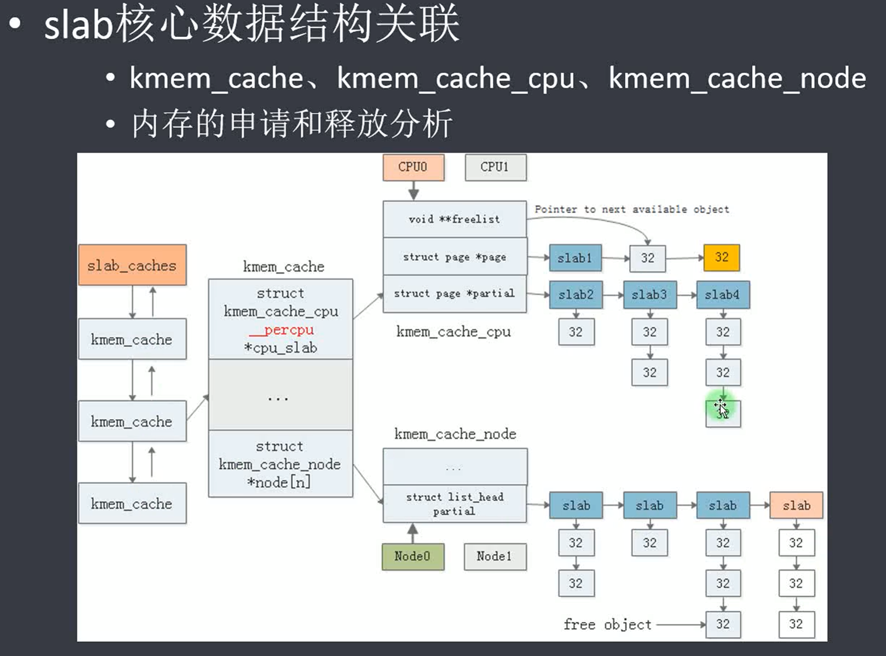

# 虚拟内存管理算法SLAB

[TOC]

# 1、一句话总结

将申请的N(N >= 1)个物理页按照固定大小的object进行初始化，每个object专门为某个具体的数据结构进行内存申请与释放。

* 比如 struct_task 结构体，为其申请N个Page物理页，并将其划分为多个 sizeof(struct_task)大小的object
* 当多个 struct_task 不使用之后，会将这个N个Page物理页回收。
* 其中物理页使用伙伴系统进行管理。

将申请了一个个物理页按照固定大小分割成一个个object并管理，每个object对应一个内存块。

| 分配器   | 全称                        | 设计目标与特点                                               | 适用场景                               | 当前状态                               |
| :------- | :-------------------------- | :----------------------------------------------------------- | :------------------------------------- | :------------------------------------- |
| **SLAB** | **Slab Allocator**          | 源自 Solaris 2.4 的分配算法，功能丰富，稳定性高，但结构复杂，队列多，内存开销较大。 | 需要稳定性和丰富调试功能的大系统       | **Linux 6.5 起已废弃**，已从内核中移除 |
| **SLUB** | **Unqueued SLAB Allocator** | 简化设计，降低开销，扩展性好，性能优秀，**自 Linux 2.6.23 起成为默认分配器**。 | **绝大多数场景**，尤其是大型和NUMA系统 | **Linux 当前默认且主流的分配器**       |
| **SLOB** | **Simple List of Blocks**   | 极度节省内存，设计非常简单，但性能差，易产生碎片，扩展性不佳。 | **内存极度受限的嵌入式系统**           | **Linux 6.4 中已移除**                 |

## 2、SLAB介绍

# 3、SLAB使用方法

# 4、SLAB源码分析

