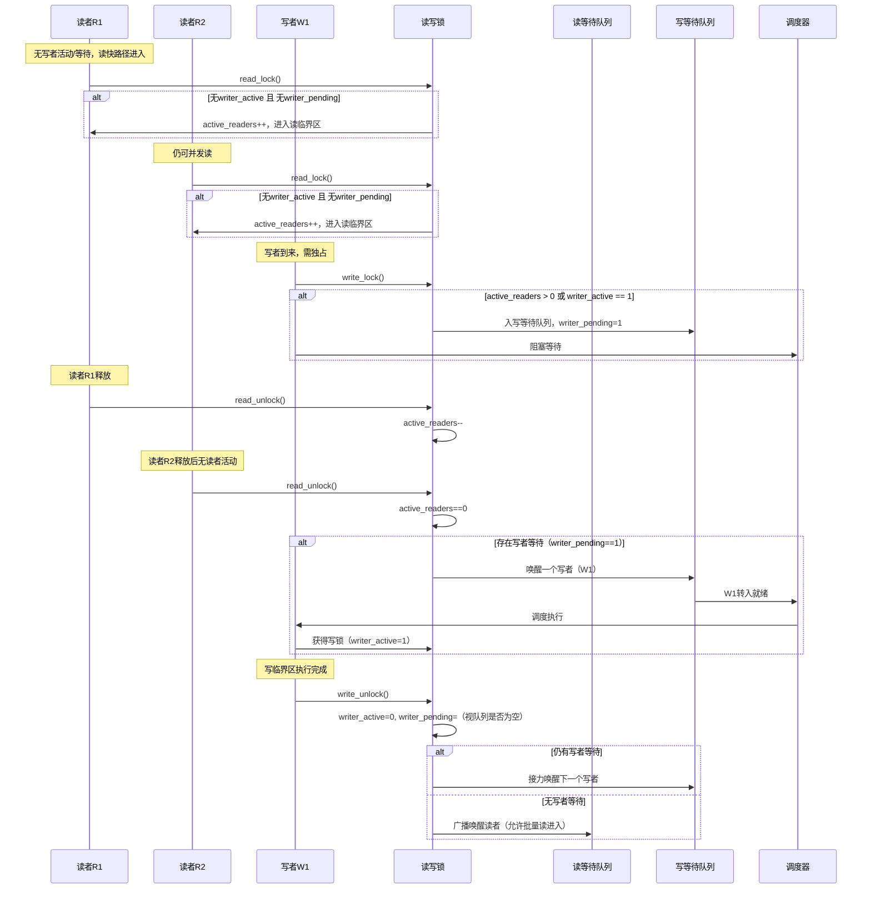
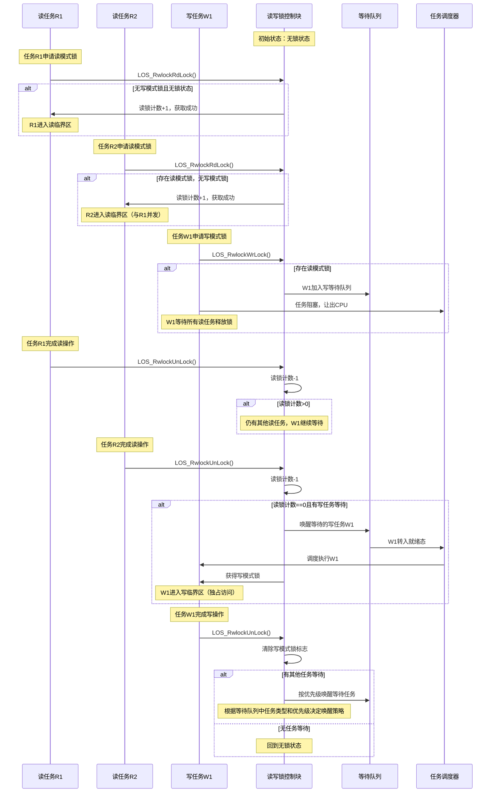
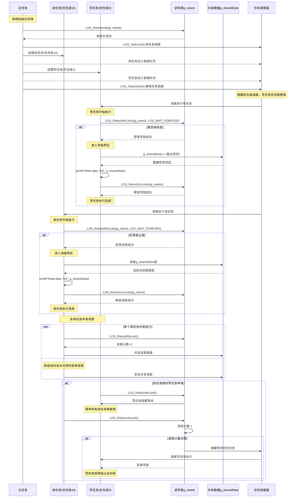

# 读写锁RWLock机制与Liteos_a内核读写锁机制分析

[TOC]

# 0、一句话总结

​	读写锁通过"多读共享、写独占"的并发控制策略，结合原子状态与等待队列，在读多写少场景下以尽量无争用的读路径与有序的写入仲裁，实现更高读吞吐与受控写延迟，并在不同公平策略（读优先/写优先/公平）之间权衡吞吐与饥饿风险。


# 1、读写锁的通用知识点

## 1.1、读写锁的概念

读写锁（RWLock, Read-Write Lock）是一种面向"读多写少"工作负载的同步原语，其核心语义是：

- **读共享**：允许多个读者同时持有锁（不修改共享数据）。
- **写独占**：写者需要独占访问，期间禁止任何读者和其他写者进入。
- **相容矩阵**：
  - 读-读：相容（可并发）
  - 读-写：不相容
  - 写-写：不相容

**典型应用与特性**：

- **适用场景**：读比例远高于写、读路径频繁但写入较少的共享数据结构（如配置快照、只读缓存、目录树元数据等）。
- **公平策略与饥饿**：
  - **读者优先**：新读者在有写者等待时仍可进入，读吞吐高但写者可能饥饿。
  - **写者优先**：一旦有写者等待，后续读者需阻塞，限制写延迟但读吞吐可能下降。
  - **公平（FIFO/队列化）**：严格按到达顺序排队，避免饥饿但上下文切换更多、吞吐可能降低。
- **变体能力**：
  - **可重入写锁（可选）**：同一线程可递归获取写锁（需记录拥有者与递归计数）。
  - **升级/降级**：读->写升级常见但困难（易死锁/活锁）；写->读降级相对安全常见。
  - **Try/Timeout**：非阻塞尝试获取与超时等待。
- **性能与可见性**：
  - **快路径读**：尽量使用原子计数与轻量判定，避免入队阻塞。
  - **写路径**：需要"读者全部退出 + 写者独占进入"的协调。
  - **内存模型**：获取/释放需配合内存屏障，确保写入对后续读者的可见性与顺序性。


## 1.2、读写锁的通用结构

### 1.2.1、读写锁控制块

**核心作用**：以最小争用表达"读共享、写独占"的状态，并提供可配置公平策略和可选能力（升级/降级、可重入、超时等）。

**通用结构设计**：

```c
typedef enum {
    RW_FAIR_READER_PREFER,
    RW_FAIR_WRITER_PREFER,
    RW_FAIR_STRICT_FIFO
} rw_fairness_t;

typedef struct waiter_node {
    struct waiter_node *prev;
    struct waiter_node *next;
    int is_writer;          // 1=writer, 0=reader
    // 附带线程/任务句柄、等待条件等
} waiter_node_t;

typedef struct {
    // 核心共享状态（需原子/受保护）
    int active_readers;     // 正在持有读锁的读者数
    int writer_active;      // 0/1，是否有写者持有锁
    int waiting_readers;    // 统计或通过队列表示
    int waiting_writers;    // 统计或通过队列表示
    int writer_pending;     // 是否存在待写写者（写优先策略中用于阻止新读者进入）

    // 等待队列（可选：分离读/写队列或统一队列带类型）
    waiter_node_t *rq_head, *rq_tail;  // reader queue（可选）
    waiter_node_t *wq_head, *wq_tail;  // writer queue（可选）
    waiter_node_t *fifo_head, *fifo_tail; // 严格公平时的统一队列（可选）

    rw_fairness_t fairness; // 公平策略

    // 可选能力
    int reentrant_write;    // 写锁可重入标志
    void *owner;            // 写锁拥有者（线程/任务标识）
    int write_recursion;    // 写锁递归计数

    // 内部保护
    // spinlock_t internal_lock; // 简化省略：用于保护以上字段的短期自旋
    // 条件变量/事件用于阻塞与唤醒（平台相关）
} rwlock_t;
```


### 1.2.2、读者计数器

**核心作用**：

- `active_readers > 0`：表示当前持有读锁的读者数量。
- `active_readers == 0`：表示无读者活动，写者可尝试获取独占锁。

**操作规则**：
- **获取读锁**：检查无写者活动且策略允许时，`active_readers++`。
- **释放读锁**：`active_readers--`；若归零且有写者等待，唤醒写者。


### 1.2.3、写者状态标志

**核心作用**：
- `writer_active == 1`：表示有写者持有独占锁，禁止任何读者和其他写者进入。
- `writer_active == 0`：表示无写者活动，读者可并发进入。

**操作规则**：
- **获取写锁**：检查无读者和写者活动时，设置`writer_active = 1`。
- **释放写锁**：清除`writer_active = 0`，根据策略唤醒等待的读者或写者。


### 1.2.4、等待队列

**核心作用**：管理因资源冲突而阻塞的读者和写者，按公平策略排序和唤醒。

**唤醒策略**：
- **读者优先**：优先唤醒所有等待的读者（批量进入）。
- **写者优先**：优先唤醒一个等待的写者（写者接力）。
- **严格公平**：按FIFO顺序唤醒，避免饥饿。


## 1.3、读写锁的加解锁时序图

以"写者优先"策略为例，展示两个读者与一个写者竞争的典型过程：




## 1.4、读写锁关键机制说明

1. **原子性操作**：读写锁状态变更需保证原子性，避免竞态条件（如使用CAS或内部互斥保护）。

2. **死锁预防**：
   - 避免嵌套获取多个读写锁。
   - 读锁升级为写锁需谨慎处理，防止多个读者同时尝试升级导致死锁。

3. **饥饿控制**：
   - 读者优先可能导致写者饥饿。
   - 写者优先可能导致读者饥饿。
   - 公平策略通过FIFO排队避免饥饿，但可能降低吞吐量。

4. **性能优化**：
   - 读路径尽量无锁化，使用原子操作快速判定。
   - 写路径需要完整的同步协调，确保独占访问。
   - 适用于读多写少的场景，读写比例失衡时考虑其他同步机制。


# 2、Liteos_a内核中读写锁的实现

## 2.1、Liteos_a内核中读写锁的概念

​	Liteos_a内核中的读写锁与互斥锁类似，可用来同步同一进程中的各个任务，但与互斥锁不同的是，其允许多个读操作并发重入，而写操作互斥。

相对于互斥锁的开锁或闭锁状态，读写锁有三种状态：读模式下的锁，写模式下的锁，无锁。

读写锁的使用规则：

- 保护区无写模式下的锁，任何任务均可以为其增加读模式下的锁。
- 保护区处于无锁状态下，才可增加写模式下的锁。

多任务环境下往往存在多个任务访问同一共享资源的应用场景，读模式下的锁以共享状态对保护区访问，而写模式下的锁可被用于对共享资源的保护从而实现独占式访问。

这种共享-独占的方式非常适合多任务中读数据频率远大于写数据频率的应用中，提高应用多任务并发度。


## 2.2、Liteos_a内核的读写锁运行机制

相较于互斥锁，读写锁如何实现读模式下的锁及写模式下的锁来控制多任务的读写访问呢？

- 若A任务首次获取了写模式下的锁，有其他任务来获取或尝试获取读模式下的锁，均无法再上锁。
- 若A任务获取了读模式下的锁，当有任务来获取或尝试获取读模式下的锁时，读写锁计数均加一。

Liteos_a内核读写锁控制块：

```c
/**
 * @ingroup los_rwlock
 * Rwlock object.
 */
typedef struct OsRwlock {
    INT32 magic : 24;        /**< Magic number */
    INT32 rwCount : 8;       /**< Times of locking the rwlock, rwCount > 0 when rwkick is read mode, 
								  rwCount < 0 when the rwlock is write mode, 
								  rwCount = 0 when the lock is free. */
    VOID *writeOwner;      /**< The current write thread that is locking the rwlock */
    LOS_DL_LIST readList;  /**< Read waiting list */
    LOS_DL_LIST writeList; /**< Write waiting list */
} LosRwlock;
```


## 2.3、Liteso_a内核读写锁读写时序图




## 2.4、Liteos_a内核读写锁模块的总结

​	分析到这里，可以看出Liteos_a内核完整的实现了 1.1 ~ 1.3 小节中读写锁所有的通用机制。接下来就借助Liteos_a内核的源代码继续分析，Liteos_a内核是如何通过代码将读写锁的这些机制一一实现的。


# 3、Liteos_a内核读写锁开发案例

## 3.1、接口说明

| 功能分类           | 接口描述                                                     |
| ------------------ | ------------------------------------------------------------ |
| 读写锁的创建和删除 | - LOS_RwlockInit：创建读写锁 <br />- LOS_RwlockDestroy：删除指定的读写锁 |
| 读模式下的锁的申请 | - LOS_RwlockRdLock：申请指定的读模式下的锁 <br />- LOS_RwlockTryRdLock：尝试申请指定的读模式下的锁 |
| 写模式下的锁的申请 | - LOS_RwlockWrLock：申请指定的写模式下的锁 <br />- LOS_RwlockTryWrLock：尝试申请指定的写模式下的锁 |
| 读写锁的释放       | - LOS_RwlockUnLock：释放指定读写锁                           |
| 读写锁有效性判断   | - LOS_RwlockIsValid：判断读写锁有效性                        |


## 3.2、开发流程

读写锁典型场景的开发流程：

* 1、创建读写锁LOS_RwlockInit。

* 2、申请读模式下的锁LOS_RwlockRdLock或写模式下的锁LOS_RwlockWrLock。

  * 申请读模式下的锁：

    - 若无人持有锁，读任务可获得锁。

    - 若有人持有锁，读任务可获得锁，读取顺序按照任务优先级。

    - 若有人（非自己）持有写模式下的锁，则当前任务无法获得锁，直到写模式下的锁释放。

  * 申请写模式下的锁：

    - 若该锁当前没有任务持有，或者持有该读模式下的锁的任务和申请该锁的任务为同一个任务，则申请成功，可立即获得写模式下的锁。

    - 若该锁当前已经存在读模式下的锁，且读取任务优先级较高，则当前任务挂起，直到读模式下的锁释放。

* 3、申请读模式下的锁和写模式下的锁均有三种：无阻塞模式、永久阻塞模式、定时阻塞模式，区别在于挂起任务的时间。

* 4、释放读写锁LOS_RwlockUnLock。

  - 如果有任务阻塞于指定读写锁，则唤醒被阻塞任务中优先级高的，该任务进入就绪态，并进行任务调度。

  - 如果没有任务阻塞于指定读写锁，则读写锁释放成功。

* 5、删除读写锁LOS_RwlockDestroy。


特别说明：

- 读写锁不能在中断服务程序中使用。
- LiteOS-A内核作为实时操作系统需要保证任务调度的实时性，尽量避免任务的长时间阻塞，因此在获得读写锁之后，应该尽快释放该锁。
- 持有读写锁的过程中，不得再调用LOS_TaskPriSet等接口更改持有读写锁任务的优先级。


## 3.3、编程实例

### 3.3.1、实例描述

测试场景概述：这是一个典型的读写锁应用实例，演示了LiteOS-A内核中读写锁的基本使用方法：

- 共享资源 ：全局变量 g_sharedData （整型数据）
- 同步机制 ：读写锁 g_rwlock
- 并发任务 ：
  - 读任务 ：优先级10，执行读操作，安全读取共享数据
  - 写任务 ：优先级5（更高优先级），执行写操作，独占修改共享数据


关键特性：

* 1、读共享 ：多个读任务可以并发访问 g_sharedData
* 2、写独占 ：写任务需要独占访问，期间阻止所有读写操作
* 3、优先级调度 ：写任务优先级更高，能够优先获得执行机会
* 4、永久阻塞模式 ：使用 LOS_WAIT_FOREVER 参数，任务会一直等待直到获得锁


执行流程：

* 1、初始化读写锁 LOS_RwlockInit()

* 2、创建读任务和写任务

* 3、任务根据优先级和锁状态进行调度执行

* 4、读任务安全读取数据，写任务独占修改数据

* 5、任务完成后释放锁 LOS_RwlockUnLock()


### 3.3.2、编程示例

```c
#include "los_rwlock.h"

LosRwlock g_rwlock;
int g_sharedData = 0;

// 读任务函数
VOID ReadTask(VOID)
{
    UINT32 ret = LOS_RwlockRdLock(&g_rwlock, LOS_WAIT_FOREVER);
    if (ret != LOS_OK) {
        printf("Read lock failed!\n");
        return;
    }
    
    printf("Read data: %d\n", g_sharedData); // 安全读取共享数据
    
    LOS_RwlockUnLock(&g_rwlock);
}

// 写任务函数
VOID WriteTask(VOID)
{
    UINT32 ret = LOS_RwlockWrLock(&g_rwlock, LOS_WAIT_FOREVER);
    if (ret != LOS_OK) {
        printf("Write lock failed!\n");
        return;
    }
    
    g_sharedData++; // 独占修改共享数据
    printf("Write data: %d\n", g_sharedData);
    
    LOS_RwlockUnLock(&g_rwlock);
}

// 初始化测试
UINT32 RwlockSample(VOID)
{
    UINT32 ret;
    TSK_INIT_PARAM_S readTask, writeTask;
    
    // 初始化读写锁
    ret = LOS_RwlockInit(&g_rwlock);
    if (ret != LOS_OK) {
        printf("Rwlock init failed!\n");
        return ret;
    }
    
    /* 锁任务调度 */
    LOS_TaskLock();
    
    // 创建读任务
    readTask.pfnTaskEntry = (TSK_ENTRY_FUNC)ReadTask;
    readTask.usTaskPrio = 10;
    // ... 其他任务参数设置
    ret = LOS_TaskCreate(&readTaskID, &readTask);
    
    // 创建写任务
    writeTask.pfnTaskEntry = (TSK_ENTRY_FUNC)WriteTask;
    writeTask.usTaskPrio = 5; // 写任务优先级更高
    // ... 其他任务参数设置
    ret = LOS_TaskCreate(&writeTaskID, &writeTask);
    
    /* 解锁任务调度 */
    LOS_TaskUnlock();
    
    return LOS_OK;
}
```


### 3.3.3、示例时序图



关键时序特点：

* 1、优先级调度 ：写任务优先级5高于读任务优先级10，在系统调度时优先执行

* 2、写独占机制 ：写任务执行时，读写锁进入写模式，阻止其他任务访问共享资源

* 3、读并发机制 ：多个读任务可以同时持有读锁，实现并发读取

* 4、阻塞等待 ：使用 LOS_WAIT_FOREVER 参数，任务会永久阻塞直到获得锁

* 5、安全访问 ：通过读写锁机制确保共享数据 g_sharedData 的访问安全性


# 4、Liteos_a内核读写锁的源码分析

## 4.1、读写锁控制块 LosRwlock

```c
/**
 * @ingroup los_rwlock
 * Rwlock object.
 */
typedef struct OsRwlock {
    INT32 magic : 24;        /**< Magic number */
    INT32 rwCount : 8;       /**< Times of locking the rwlock, 
    							  rwCount > 0 when rwkick is read mode, rwCount < 0
                                  when the rwlock is write mode, 
                                  rwCount = 0 when the lock is free. */
    VOID *writeOwner;      /**< The current write thread that is locking the rwlock */
    LOS_DL_LIST readList;  /**< Read waiting list */
    LOS_DL_LIST writeList; /**< Write waiting list */
} LosRwlock;
```


## 4.2、创建读写锁 LOS_RwlockInit

```c
/*
    1、参数验证 ：确保传入的读写锁指针有效
    2、临界区保护 ：使用调度器锁保护初始化过程
    3、重复初始化检查 ：防止对已初始化的读写锁进行重复初始化
    4、状态初始化 ：
        - 读写计数器设为0（空闲状态）
        - 写锁拥有者设为NULL
        - 初始化读写等待队列
    5、标记初始化完成 ：设置魔数标记读写锁已正确初始化
*/
UINT32 LOS_RwlockInit(LosRwlock *rwlock)
{
    UINT32 intSave;

    // 参数检查：如果传入的读写锁指针为NULL，返回参数无效错误码
    if (rwlock == NULL) {
        return LOS_EINVAL;
    }

    // 进入临界区，禁止任务调度，防止初始化过程被打断
    SCHEDULER_LOCK(intSave);
    // 检查读写锁是否已经初始化过（通过魔数判断）
    // 如果已初始化，则退出临界区并返回权限错误（不允许重复初始化）    
    if ((rwlock->magic & RWLOCK_COUNT_MASK) == OS_RWLOCK_MAGIC) {
        SCHEDULER_UNLOCK(intSave);
        return LOS_EPERM;
    }

    // 初始化读写计数器为0，表示当前没有任务持有该锁
    rwlock->rwCount = 0;
    // 初始化写锁拥有者为NULL，表示当前没有任务持有写锁
    rwlock->writeOwner = NULL;
    // 初始化读等待队列，用于存放等待获取读锁的任务
    LOS_ListInit(&(rwlock->readList));
    // 初始化写等待队列，用于存放等待获取写锁的任务
    LOS_ListInit(&(rwlock->writeList));
    // 设置魔数，标记读写锁已经被正确初始化
    rwlock->magic = OS_RWLOCK_MAGIC;
    // 退出临界区，恢复任务调度
    SCHEDULER_UNLOCK(intSave);
    return LOS_OK;
}
```


## 4.3、申请指定的读模式下的锁 LOS_RwlockRdLock

```c
// ## 整体流程总结
// 1. 用户调用 LOS_RwlockRdLock 尝试获取读锁
// 2. 参数和环境检查 ：验证读写锁有效性和当前执行环境
// 3. 锁状态检查 ：
//    - 如果锁处于空闲或读模式，且当前任务优先级高于等待写锁的任务，直接获取读锁
//    - 否则，根据timeout参数决定是否阻塞等待
        // ## 实际应用场景举例
        // 假设有以下场景：
        // - 任务A（高优先级）：需要更新共享数据（写操作）
        // - 任务B、C、D（低优先级）：需要读取共享数据（读操作）
        // 如果B正在读取数据，此时A请求写锁，A会被阻塞。如果不检查优先级，C和D也可以获取读锁，导致A长时间等待。
        // 但有了优先级检查后，一旦A（高优先级写任务）在等待，C和D就无法获取读锁，必须等A完成写操作后才能继续。
        // 这种机制确保了系统中高优先级任务能够及时获得资源，维持了实时系统的响应特性，
		// 同时又不完全牺牲并发读取的性能优势。
// 4. 优先级比较 ：通过多层比较函数确定任务优先级，影响锁获取顺序
// 5. 任务挂起 ：如需等待，将任务按优先级插入读等待队列并挂起
/*
    1、参数检查
    2、加锁调用下层读锁函数OsRwlockRdUnsafe
*/
UINT32 LOS_RwlockRdLock(LosRwlock *rwlock, UINT32 timeout)
{
    UINT32 intSave;

    // 调用检查函数验证读写锁参数和当前执行环境是否允许获取锁
    UINT32 ret = OsRwlockCheck(rwlock);
    if (ret != LOS_OK) {
        return ret;
    }

    SCHEDULER_LOCK(intSave);
    // 调用内部函数尝试获取读锁
    ret = OsRwlockRdUnsafe(rwlock, timeout);
    SCHEDULER_UNLOCK(intSave);
    return ret;
}
```

其中 OsRwlockRdUnsafe 函数：

```c
/*
    1、魔数检查
    2、调用OsRwlockRdPendOp尝试获取锁
*/
UINT32 OsRwlockRdUnsafe(LosRwlock *rwlock, UINT32 timeout)
{
    // 检查读写锁是否有效（通过魔数判断）
    if ((rwlock->magic & RWLOCK_COUNT_MASK) != OS_RWLOCK_MAGIC) {
        // 读写锁无效，返回错误
        return LOS_EBADF;
    }

    // 调用核心操作函数尝试获取读锁
    return OsRwlockRdPendOp(OsCurrTaskGet(), rwlock, timeout);
}
```

其中 OsRwlockRdPendOp 函数：

```c
/*
    1、锁处于空闲、读模式，尝试读锁
    2、没读到，非阻塞立即返回
    3、阻塞，判断是否能进行任务切换
    4、当前任务不能在持有写锁时进行读同一把锁，防止死锁
    5、读写锁处于写模式，加入读等待队列
    6、超时或拿到锁，返回
*/
STATIC UINT32 OsRwlockRdPendOp(LosTaskCB *runTask, LosRwlock *rwlock, UINT32 timeout)
{
    UINT32 ret;

    /*
     * 当读写锁处于读模式或空闲模式，且当前读任务优先级高于第一个等待的写任务时，
     * 当前读任务可以获取该读写锁。
     */
    // rwCount >= 0 表示锁处于空闲或读模式 
    if (rwlock->rwCount >= 0) {
        // 比较当前任务与等待写锁队列中优先级最高任务的优先级
        if (OsRwlockPriCompare(runTask, &(rwlock->writeList))) {
            // 检查读计数是否达到最大值
            if (rwlock->rwCount == INT8_MAX) {
                // 读计数已达最大值，返回错误
                return LOS_EINVAL;
            }
            // 增加读计数，表示又有一个任务获取了读锁
            rwlock->rwCount++;
            return LOS_OK;
        }
    }

    // 如果超时参数为0，表示非阻塞调用，但无法立即获取锁，返回错误
    if (!timeout) {
        return LOS_EINVAL;
    }

    // 检查当前是否可以进行任务切换
    if (!OsPreemptableInSched()) {
        // 不可切换，返回死锁错误
        return LOS_EDEADLK;
    }

    /* The current task is not allowed to obtain the write lock when it obtains the read lock. */
    // 当前任务已经持有写锁时，不允许再获取读锁（防止自锁）
    if ((LosTaskCB *)(rwlock->writeOwner) == runTask) {
        return LOS_EINVAL;
    }

    /*
     * 当读写锁处于写模式，或当前读任务优先级低于第一个等待的写任务时，
     * 当前读任务将被挂起等待。
     */    
    // 找到读等待队列中合适的插入位置（按优先级排序）
    LOS_DL_LIST *node = OsSchedLockPendFindPos(runTask, &(rwlock->readList));
    // 将当前任务挂起，等待读锁
    ret = runTask->ops->wait(runTask, node, timeout);
    // 如果等待超时，转换错误码
    if (ret == LOS_ERRNO_TSK_TIMEOUT) {
        return LOS_ETIMEDOUT;
    }

    return ret;
}
```

其中 OsRwlockPriCompare 函数：

```c
/*
这个读写锁没有适配ED调度算法的任务，优先级没有适配
    1、把等待队列中优先级最高的任务拿出来和当前任务进行优先级比较
    2、当前任务优先级 > 等待队列中优先级最高的任务 返回TRUE
    3、或者没有任务等待，也返回TRUE
*/
STATIC BOOL OsRwlockPriCompare(LosTaskCB *runTask, LOS_DL_LIST *rwList)
{
    // 检查等待队列是否为空
    if (!LOS_ListEmpty(rwList)) {
        // 获取等待队列中优先级最高的任务
        LosTaskCB *highestTask = OS_TCB_FROM_PENDLIST(LOS_DL_LIST_FIRST(rwList));
        // 比较当前任务与队列中最高优先级任务的优先级
        if (OsSchedParamCompare(runTask, highestTask) < 0) {
            // 当前任务优先级更高，返回TRUE
            return TRUE;
        }
        // 当前任务优先级不高，返回FALSE
        return FALSE;
    }
    // 等待队列为空，没有任务等待，返回TRUE
    return TRUE;
}
```

其中 OsSchedLockPendFindPos 函数：

```c
/*
    1、当前任务的优先级runTask 与 互斥锁等待队列上的任务lockList 进行优先级比较
        runTask优先级 > lockList上第一个任务的优先级 --> runtask插入互斥锁队列头部
        runTask优先级 > lockList上最后一个任务的优先级 --> runtask插入互斥锁队列尾部
        runTask优先级在中间，调用SchedLockPendFindPosSub继续查找具体位置
*/
LOS_DL_LIST *OsSchedLockPendFindPos(const LosTaskCB *runTask, LOS_DL_LIST *lockList)
{
    // 如果等待队列为空，直接返回队列头
    if (LOS_ListEmpty(lockList)) {
        return lockList;
    }

    // 获取等待队列中的第一个任务
    LosTaskCB *pendedTask1 = OS_TCB_FROM_PENDLIST(LOS_DL_LIST_FIRST(lockList));
    // 比较第一个等待任务和当前任务的调度参数
    INT32 ret = OsSchedParamCompare(pendedTask1, runTask);
    // 如果第一个等待任务优先级低于当前任务，插入到队列头部
    if (ret > 0) {
        return lockList->pstNext;
    }

    // 比较最后一个等待任务和当前任务的调度参数
    LosTaskCB *pendedTask2 = OS_TCB_FROM_PENDLIST(LOS_DL_LIST_LAST(lockList));
    // 如果最后一个等待任务优先级高于或等于当前任务，插入到队列尾部
    ret = OsSchedParamCompare(pendedTask2, runTask);
    if (ret <= 0) {
        return lockList;
    }

    // 如果当前任务的优先级在队列中间，需要找到具体的插入位置
    return SchedLockPendFindPosSub(runTask, lockList);
}
```


## 4.4、尝试申请指定的读模式下的锁 LOS_RwlockTryRdLock

```c
/*
    1、参数、环境检测
    2、加锁调用OsRwlockTryRdUnsafe进行非阻塞读锁
*/
UINT32 LOS_RwlockTryRdLock(LosRwlock *rwlock)
{
    UINT32 intSave;

    // 调用检查函数验证读写锁参数和当前执行环境是否允许获取锁
    UINT32 ret = OsRwlockCheck(rwlock);
    if (ret != LOS_OK) {
        return ret;
    }

    SCHEDULER_LOCK(intSave);
    // 调用内部函数尝试获取读锁，timeout为0表示非阻塞调用
    ret = OsRwlockTryRdUnsafe(rwlock, 0);
    SCHEDULER_UNLOCK(intSave);
    return ret;
}
```

其中 OsRwlockTryRdUnsafe 函数：

```c
/*
    1、参数检查
    2、当前任务已持有写锁，不能再读
    3、优先级比等待写锁任务低，不能读
    4、锁处于写模式，不能读
    5、通过检查，调用OsRwlockRdPendOp尝试读取锁
*/
UINT32 OsRwlockTryRdUnsafe(LosRwlock *rwlock, UINT32 timeout)
{
    // 检查读写锁是否有效（通过魔数判断）
    if ((rwlock->magic & RWLOCK_COUNT_MASK) != OS_RWLOCK_MAGIC) {
        return LOS_EBADF;
    }

    // 检查当前任务是否已持有写锁，防止自锁
    LosTaskCB *runTask = OsCurrTaskGet();
    if ((LosTaskCB *)(rwlock->writeOwner) == runTask) {
        return LOS_EINVAL;
    }

    /*
     * 当读写锁处于读模式或空闲模式，且当前读任务优先级低于第一个等待的写任务时，
     * 当前读任务不能获取读写锁。
     */    
    if ((rwlock->rwCount >= 0) && !OsRwlockPriCompare(runTask, &(rwlock->writeList))) {
        // 当前任务优先级不够高，无法获取锁，返回忙错误
        return LOS_EBUSY;
    }

    // 当读写锁处于写模式时，当前读任务不能获取读写锁。
    if (rwlock->rwCount < 0) {
        return LOS_EBUSY;
    }

    // 通过所有检查后，调用核心操作函数尝试获取读锁
    return OsRwlockRdPendOp(runTask, rwlock, timeout);
}
```

其中的 OsRwlockRdPendOp 函数见上文分析。


## 4.5、申请指定的写模式下的锁 LOS_RwlockWrLock

```c
/*
    1、参数检查
    2、加调度锁调用内部OsRwlockWrUnsafe尝试写锁
*/
UINT32 LOS_RwlockWrLock(LosRwlock *rwlock, UINT32 timeout)
{
    UINT32 intSave;

    // 调用检查函数验证读写锁参数和当前执行环境是否允许获取锁
    UINT32 ret = OsRwlockCheck(rwlock);
    if (ret != LOS_OK) {
        return ret;
    }

    SCHEDULER_LOCK(intSave);
    // 调用内部函数尝试获取写锁
    ret = OsRwlockWrUnsafe(rwlock, timeout);
    SCHEDULER_UNLOCK(intSave);
    return ret;
}
```

其中 OsRwlockWrUnsafe 函数：

```c
/*
    1、锁有效性检查
    2、调用OsRwlockWrPendOp尝试写锁
*/
UINT32 OsRwlockWrUnsafe(LosRwlock *rwlock, UINT32 timeout)
{
    // 检查读写锁是否有效（通过魔数判断）
    if ((rwlock->magic & RWLOCK_COUNT_MASK) != OS_RWLOCK_MAGIC) {
        return LOS_EBADF;
    }

    // 获取当前任务并调用核心操作函数尝试获取写锁
    return OsRwlockWrPendOp(OsCurrTaskGet(), rwlock, timeout);
}
```

其中 OsRwlockWrPendOp 函数：

```c
/*
    1、锁空闲，直接写
    2、当前任务再次写，直接写
    3、非阻塞返回
    4、可以进行任务切换时，当前任务插入锁的写等待队列
*/
STATIC UINT32 OsRwlockWrPendOp(LosTaskCB *runTask, LosRwlock *rwlock, UINT32 timeout)
{
    UINT32 ret;

    /* When the rwlock is free mode, current write task can obtain this rwlock. */
    // 如果读写锁处于空闲状态（rwCount为0），当前写任务可以直接获取该锁
    if (rwlock->rwCount == 0) {
        // 设置rwCount为-1，表示有一个任务持有写锁
        rwlock->rwCount = -1;
        // 记录写锁拥有者为当前任务
        rwlock->writeOwner = (VOID *)runTask;
        return LOS_OK;
    }

    /* Current write task can use one rwlock once again if the rwlock owner is it. */
    // 如果读写锁已被当前任务获取（写锁可重入），允许再次获取
    if ((rwlock->rwCount < 0) && ((LosTaskCB *)(rwlock->writeOwner) == runTask)) {
        // 检查写锁计数是否达到最小值
        if (rwlock->rwCount == INT8_MIN) {
            return LOS_EINVAL;
        }
        // 递减rwCount，表示同一任务多次获取写锁
        rwlock->rwCount--;
        return LOS_OK;
    }

    // 到这里表示rwlock->rwCount > 0,其他任务在读锁、
    //      或者rwlock->rwCount < 0,有其他任务在写锁
    // 如果超时参数为0，表示非阻塞调用，但无法立即获取锁，返回错误
    if (!timeout) {
        return LOS_EINVAL;
    }

    // 检查当前是否可以进行任务切换
    if (!OsPreemptableInSched()) {
        return LOS_EDEADLK;
    }

=
    // 当读写锁处于读模式或被其他写任务获取时，当前写任务将被挂起等待
    // 找到写等待队列中合适的插入位置（按优先级排序）    
    LOS_DL_LIST *node =  OsSchedLockPendFindPos(runTask, &(rwlock->writeList));
    ret = runTask->ops->wait(runTask, node, timeout);
    if (ret == LOS_ERRNO_TSK_TIMEOUT) {
        ret = LOS_ETIMEDOUT;
    }

    return ret;
}
```

其中 OsSchedLockPendFindPos 函数见上文分析。


## 4.6、尝试申请指定的写模式下的锁 LOS_RwlockTryWrLock

```c
/*
    1、参数检查
    3、加调度锁调用下层OsRwlockTryWrUnsafe尝试写锁
*/
UINT32 LOS_RwlockTryWrLock(LosRwlock *rwlock)
{
    UINT32 intSave;

    // 参数检查
    UINT32 ret = OsRwlockCheck(rwlock);
    if (ret != LOS_OK) {
        return ret;
    }

    SCHEDULER_LOCK(intSave);
    // 加调度锁调用下层OsRwlockTryWrUnsafe尝试写锁
    ret = OsRwlockTryWrUnsafe(rwlock, 0);
    SCHEDULER_UNLOCK(intSave);
    return ret;
}
```

其中 OsRwlockTryWrUnsafe 函数：

```c
/*
    1、锁魔数检测
    2、锁处于写模式，但是不是当前任务持有，不能写
    3、调用OsRwlockWrPendOp尝试写锁
*/
UINT32 OsRwlockTryWrUnsafe(LosRwlock *rwlock, UINT32 timeout)
{
    // 检查读写锁是否有效（通过魔数判断）
    if ((rwlock->magic & RWLOCK_COUNT_MASK) != OS_RWLOCK_MAGIC) {
        return LOS_EBADF;
    }

    /* When the rwlock is read mode, current write task will be pended. */
    // 当读写锁处于读模式时（rwCount > 0），当前写任务无法获取锁
    if (rwlock->rwCount > 0) {
        return LOS_EBUSY;
    }

    /* When other write task obtains this rwlock, current write task will be pended. */
    // 获取当前运行任务的控制块
    LosTaskCB *runTask = OsCurrTaskGet();
    // 当读写锁处于写模式（rwCount < 0）且写锁拥有者不是当前任务时，当前写任务无法获取锁
    if ((rwlock->rwCount < 0) && ((LosTaskCB *)(rwlock->writeOwner) != runTask)) {
        return LOS_EBUSY;
    }

    // 通过所有检查后，调用核心操作函数尝试获取写锁
    return OsRwlockWrPendOp(runTask, rwlock, timeout);
}
```

其中 OsRwlockWrPendOp 函数见上文分析。


## 4.7、释放指定读写锁 LOS_RwlockUnLock

```c
/*
    1、参数检查
    2、加调度锁调用OsRwlockUnlockUnsafe尝试解锁
    3、进行调度
*/
UINT32 LOS_RwlockUnLock(LosRwlock *rwlock)
{
    UINT32 intSave;
    BOOL needSched = FALSE;

    // 参数检查
    UINT32 ret = OsRwlockCheck(rwlock);
    if (ret != LOS_OK) {
        return ret;
    }

    SCHEDULER_LOCK(intSave);
    // 加调度锁调用OsRwlockUnlockUnsafe尝试解锁
    ret = OsRwlockUnlockUnsafe(rwlock, &needSched);
    SCHEDULER_UNLOCK(intSave);
    // 进行调度
    LOS_MpSchedule(OS_MP_CPU_ALL);
    if (needSched == TRUE) {
        LOS_Schedule();
    }
    return ret;
}
```

其中 OsRwlockUnlockUnsafe 函数：

```c
/*
    1、锁魔数检查
    2、锁未被持有时不能解锁操作
    3、写锁模式不是当前任务，返回权限错误
    4、多重读锁（rwCount > 1），只需减少计数
    5、多重写锁（rwCount < -1），只需增加计数
    6、如果是最后一个读锁或写锁，调用处理函数OsRwlockPostOp唤醒等待任务
*/
UINT32 OsRwlockUnlockUnsafe(LosRwlock *rwlock, BOOL *needSched)
{
    // 检查读写锁是否有效（通过魔数判断）
    if ((rwlock->magic & RWLOCK_COUNT_MASK) != OS_RWLOCK_MAGIC) {
        return LOS_EBADF;
    }

    // 检查读写锁是否被持有
    if (rwlock->rwCount == 0) {
        // 锁未被持有，返回权限错误
        return LOS_EPERM;
    }

    // 如果是写锁模式且当前任务不是写锁拥有者，返回权限错误
    LosTaskCB *runTask = OsCurrTaskGet();
    if ((rwlock->rwCount < 0) && ((LosTaskCB *)(rwlock->writeOwner) != runTask)) {
        return LOS_EPERM;
    }

    /*
     * When the rwCount of the rwlock more than 1 or less than -1, the rwlock mode will
     * not changed after current unlock operation, so pended tasks can not be waken.
     */
    // 如果是多重读锁（rwCount > 1），只需减少计数
    if (rwlock->rwCount > 1) {
        rwlock->rwCount--;
        return LOS_OK;
    }

    // 如果是多重写锁（rwCount < -1），只需增加计数
    if (rwlock->rwCount < -1) {
        rwlock->rwCount++;
        return LOS_OK;
    }

    // 如果是最后一个读锁或写锁，调用后处理函数唤醒等待任务
    return OsRwlockPostOp(rwlock, needSched);
}
```

其中 OsRwlockPostOp 函数：

```c
/*
    1、重置读写锁状态
    2、获取下一个工作模式
    3、根据模式选择唤醒策略：
        写模式/写优先：唤醒一个写任务
        读模式/读优先：唤醒多个读任务（考虑优先级）
    4、设置调度标志
*/
STATIC UINT32 OsRwlockPostOp(LosRwlock *rwlock, BOOL *needSched)
{
    UINT32 rwlockMode;
    LosTaskCB *resumedTask = NULL;

    // 重置读写锁状态为空闲
    rwlock->rwCount = 0;
    rwlock->writeOwner = NULL;
    // 获取读写锁的下一个工作模式
    rwlockMode = OsRwlockGetMode(&(rwlock->readList), &(rwlock->writeList));
    // 如果没有任务等待，直接返回成功
    if (rwlockMode == RWLOCK_NONE_MODE) {
        return LOS_OK;
    }
    /* In this case, rwlock will wake the first pended write task. */
    // 如果是写模式或写优先模式，唤醒第一个等待的写任务
    if ((rwlockMode == RWLOCK_WRITE_MODE) || (rwlockMode == RWLOCK_WRITEFIRST_MODE)) {
        // 获取写等待队列中的第一个任务
        resumedTask = OS_TCB_FROM_PENDLIST(LOS_DL_LIST_FIRST(&(rwlock->writeList)));
        // 设置读写锁为写模式
        rwlock->rwCount = -1;
        // 记录写锁拥有者
        // 唤醒该任务
        rwlock->writeOwner = (VOID *)resumedTask;
        resumedTask->ops->wake(resumedTask);
        // 设置需要调度标志
        if (needSched != NULL) {
            *needSched = TRUE;
        }
        return LOS_OK;
    }

    // 如果是读模式或读优先模式，开始唤醒读任务
    // 设置读写锁为读模式，初始计数为1
    rwlock->rwCount = 1;
    // 获取并唤醒读等待队列中的第一个任务
    resumedTask = OS_TCB_FROM_PENDLIST(LOS_DL_LIST_FIRST(&(rwlock->readList)));
    resumedTask->ops->wake(resumedTask);
    // 继续唤醒其他符合条件的读任务
    while (!LOS_ListEmpty(&(rwlock->readList))) {
        // 获取读等待队列中的第一个任务
        resumedTask = OS_TCB_FROM_PENDLIST(LOS_DL_LIST_FIRST(&(rwlock->readList)));
        // 如果是读优先模式，需要检查当前读任务与写任务的优先级
        if (rwlockMode == RWLOCK_READFIRST_MODE) {
            // 获取写等待队列中的第一个任务
            LosTaskCB *pendedWriteTask = 
                OS_TCB_FROM_PENDLIST(LOS_DL_LIST_FIRST(&(rwlock->writeList)));
            // 如果当前读任务优先级不高于写任务，停止唤醒读任务
            if (OsSchedParamCompare(resumedTask, pendedWriteTask) >= 0) {
                break;
            }
        }
        // 检查读计数是否达到最大值
        if (rwlock->rwCount == INT8_MAX) {
            return EINVAL;
        }
        // 增加读计数并唤醒该读任务
        rwlock->rwCount++;
        resumedTask->ops->wake(resumedTask);
    }
    // 设置需要调度标志
    if (needSched != NULL) {
        *needSched = TRUE;
    }
    return LOS_OK;
}

```

其中 OsRwlockGetMode 函数：

```c
/*
    1、检查读写等待队列是否为空
    2、根据队列状态确定基本模式
    3、当两个队列都不为空时，比较队首任务优先级决定优先模式
*/
STATIC UINT32 OsRwlockGetMode(LOS_DL_LIST *readList, LOS_DL_LIST *writeList)
{
    // 检查读等待队列是否为空
    BOOL isReadEmpty = LOS_ListEmpty(readList);
    // 检查写等待队列是否为空
    BOOL isWriteEmpty = LOS_ListEmpty(writeList);
    // 如果读写等待队列都为空，返回空闲模式
    if (isReadEmpty && isWriteEmpty) {
        return RWLOCK_NONE_MODE;
    }
    // 如果只有读等待队列不为空，返回读模式
    if (!isReadEmpty && isWriteEmpty) {
        return RWLOCK_READ_MODE;
    }
    // 如果只有写等待队列不为空，返回写模式
    if (isReadEmpty && !isWriteEmpty) {
        return RWLOCK_WRITE_MODE;
    }
    // 如果读写等待队列都不为空，需要比较队列中第一个任务的优先级
    // 获取读等待队列中第一个任务    
    LosTaskCB *pendedReadTask = OS_TCB_FROM_PENDLIST(LOS_DL_LIST_FIRST(readList));
    // 获取写等待队列中第一个任务
    LosTaskCB *pendedWriteTask = OS_TCB_FROM_PENDLIST(LOS_DL_LIST_FIRST(writeList));
    // 比较写任务和读任务的优先级，如果写任务优先级更高或相等，返回写优先模式    
    if (OsSchedParamCompare(pendedWriteTask, pendedReadTask) <= 0) {
        return RWLOCK_WRITEFIRST_MODE;
    }
    // 否则返回读优先模式
    return RWLOCK_READFIRST_MODE;
}
```


## 4.8、判断读写锁有效性 LOS_RwlockIsValid

```c
#define RWLOCK_COUNT_MASK 0x00FFFFFFU

/*
    锁为NULL、锁魔数未设置均无效
*/
BOOL LOS_RwlockIsValid(const LosRwlock *rwlock)
{
    // 锁为NULL、锁魔数未设置
    if ((rwlock != NULL) && ((rwlock->magic & RWLOCK_COUNT_MASK) == OS_RWLOCK_MAGIC)) {
        return TRUE;
    }

    return FALSE;
}
```

   

# 5、对读写锁机制的思考

## 5.1、工程项目中哪些地方使用到读写锁

Liteso_a内核中已经没有在使用读写锁，接下来就从读写锁在工程项目中可能有的应用场景讨论，主要包括：

1、内核子系统

- **哈希表管理**：内核中的哈希表需要支持并发读取和独占写

- **文件系统**：文件元数据、目录结构的并发访问控制
- **内存管理**：页表、内存映射等数据结构的保护
- **设备驱动**：设备状态信息的并发访问控制

2、数据库管理系统

- **事务并发控制**：数据库中的共享锁和排他锁机制
- **索引结构**：B+树等索引的并发读写
- **缓冲池管理**：数据页的并发访问控制
- **元数据管理**：表结构、统计信息等的保护

3、缓存系统

- **多级缓存**：CPU缓存、应用缓存的一致性维护
- **分布式缓存**：Redis、Memcached等的数据同步
- **Web缓存**：页面缓存、对象缓存的管理

4、应用层场景

- **配置管理**：应用配置信息的动态更新
- **统计计数**：访问统计、性能指标的并发更新
- **资源池**：连接池、线程池等资源的管理
- **共享数据结构**：全局变量、单例对象的保护


## 5.2、这些地方为什么要使用读写锁

1、读多写少的访问模式

大多数系统都表现出"读多写少"的特征：
- **文件系统**：文件读取频率远高于写入频率
- **数据库**：查询操作通常比更新操作多得多
- **配置系统**：配置读取频繁，但修改相对较少
- **缓存系统**：缓存命中时只需读取，失效时才需写入

2、数据一致性要求

读写锁确保数据的一致性：
- **防止脏读**：读操作不会看到部分更新的数据
- **保证原子性**：写操作的完整性得到保障
- **维护数据完整性**：避免并发修改导致的数据损坏

3、性能优化需求

相比互斥锁，读写锁能提供更好的并发性能：
- **并发读取**：多个读者可以同时访问数据
- **减少等待时间**：读操作之间不会相互阻塞
- **提高吞吐量**：在读密集场景下显著提升系统性能


## 5.3、在这些地方使用读写锁带来哪些好处

1、性能优势

- **提高并发度**：多个读者可以并发执行，充分利用多核资源
- **减少锁竞争**：读操作之间无竞争，降低锁开销
- **提升响应速度**：读密集应用的响应时间显著改善
- **增加吞吐量**：系统整体处理能力提升

2、资源利用率

- **CPU利用率提升**：多核系统中读操作可以并行执行
- **内存带宽优化**：并发读取能更好地利用内存带宽
- **缓存友好性**：多个读者共享缓存数据，提高缓存命中率

3、系统可扩展性

- **水平扩展能力**：读操作的并发性使系统更容易扩展
- **负载分散**：读负载可以在多个处理器间分散
- **弹性伸缩**：系统能更好地适应负载变化


## 5.4、在这些地方使用读写锁带来哪些坏处

1、复杂性增加

- **实现复杂度**：读写锁的实现比简单互斥锁复杂得多
- **调试困难**：并发问题更难重现和调试
- **维护成本**：代码维护和理解的难度增加

2、潜在的性能问题

- **写者饥饿**：在读密集场景下，写者可能长时间无法获得锁
- **锁升级问题**：从读锁升级到写锁容易导致死锁 
- **上下文切换开销**：频繁的锁操作可能导致过多的上下文切换

3、锁风险

- **锁顺序问题**：多个读写锁的获取顺序不当可能导致死锁 
- **优先级反转**：高优先级线程被低优先级线程阻塞
- **活锁现象**：线程虽然没有阻塞但无法取得进展

4、内存和缓存影响

- **内存开销**：读写锁通常比简单锁占用更多内存
- **缓存一致性开销**：多核系统中的缓存同步成本 
- **False Sharing**：可能导致缓存行的错误共享


## 5.5、有坏处为什么还要使用

1、收益大于成本

在读密集的应用场景中，读写锁带来的性能提升远大于其引入的复杂性成本：
- **性能收益显著**：在读写比例为10:1或更高的场景下，性能提升可达数倍
- **用户体验改善**：响应时间的减少直接改善用户体验
- **系统容量提升**：更高的并发处理能力意味着更大的系统容量

2、业务需求驱动

- **实时性要求**：某些业务场景对读取延迟有严格要求
- **高并发需求**：互联网应用的高并发访问模式
- **成本考虑**：通过软件优化减少硬件投入

3、技术成熟度

- **成熟的实现**：主流操作系统和数据库都提供了稳定的读写锁实现
- **丰富的工具**：有完善的调试和性能分析工具
- **最佳实践**：业界积累了丰富的使用经验和最佳实践


## 5.6、如何在工程中取舍

1、场景分析

**适合使用读写锁的场景：**

- 读写比例 ≥ 5:1 的应用
- 读操作耗时较长的场景
- 数据更新频率低但查询频繁的系统
- 对读取延迟敏感的应用

**不适合使用读写锁的场景：**
- 写操作频繁的应用
- 读操作非常快速的场景
- 对一致性要求极高的系统
- 资源受限的嵌入式系统

2、设计原则

**粒度选择**

```c
// 细粒度锁 - 适合高并发场景
struct hash_table {
    struct bucket {
        rwlock_t lock;  // 每个桶一个锁
        struct list_head entries;
    } buckets[HASH_SIZE];
};

// 粗粒度锁 - 适合简单场景
struct simple_cache {
    rwlock_t lock;      // 整个缓存一个锁
    struct cache_entry *entries;
};
```

**公平性策略**

- **读者优先**：适合读密集且写操作不频繁的场景
- **写者优先**：适合需要保证写操作及时性的场景
- **公平调度**：适合读写操作都比较重要的场景

**性能监控**

```c
// 监控锁的使用情况
struct rwlock_stats {
    atomic_t read_acquisitions;
    atomic_t write_acquisitions;
    atomic_t read_contentions;
    atomic_t write_contentions;
    unsigned long max_read_hold_time;
    unsigned long max_write_hold_time;
};
```

3、替代方案考虑

**RCU (Read-Copy-Update)**

- 适合读操作远多于写操作的场景
- 提供无锁的读操作
- 写操作通过复制-更新-释放模式实现

**无锁数据结构**

- 使用原子操作和CAS指令
- 避免锁的开销和死锁问题
- 实现复杂但性能优异

**分片技术**

- 将数据分割成多个独立的片段
- 每个片段使用独立的锁
- 减少锁竞争，提高并发度

4、实施建议

**渐进式优化**

- 先使用简单的互斥锁实现功能
- 通过性能测试识别瓶颈
- 在确认收益的前提下引入读写锁

**充分测试**

- 进行压力测试验证性能提升
- 使用工具检测死锁和竞态条件
- 在不同负载模式下验证正确性

**文档和培训**

- 详细记录锁的使用规范
- 对开发团队进行并发编程培训
- 建立代码审查机制

**监控和调优**

- 部署锁竞争监控
- 定期分析性能指标
- 根据实际使用情况调整策略


## 5.7、总结

​	读写锁是一种重要的并发控制机制，在读密集的应用场景中能够显著提升系统性能。虽然它增加了实现的复杂性并可能引入新的问题，但在合适的场景下，其带来的性能收益远大于成本。在工程实践中，需要根据具体的应用特征、性能要求和资源约束来决定是否使用读写锁，并采用适当的设计策略和监控手段来确保系统的正确性和高效性。
​        