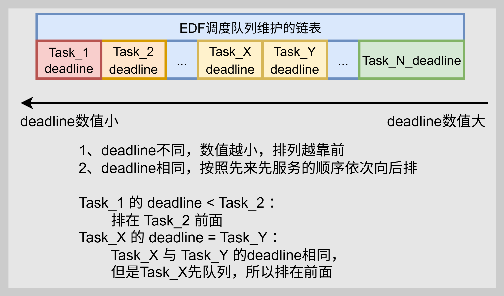
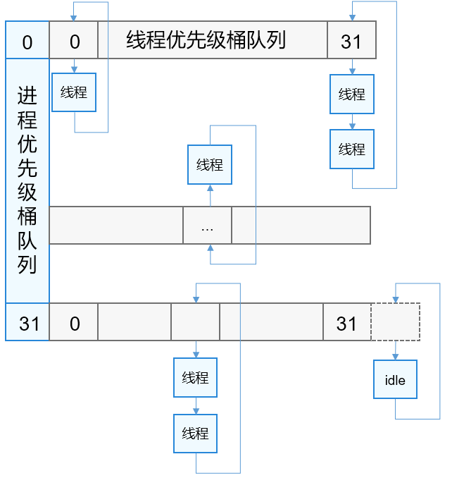
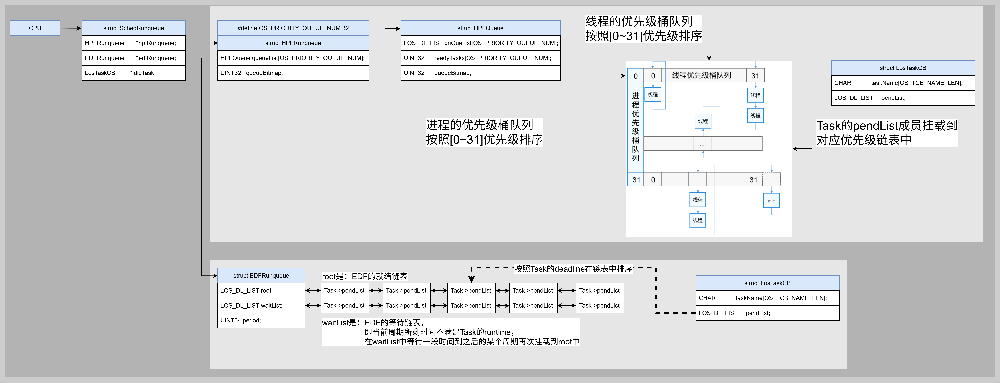
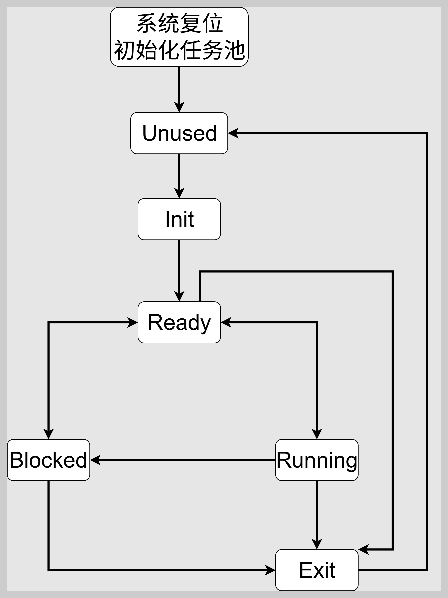

# 调度及Liteos_a内核调度分析

[TOC]

# 1、调度的概念与调度通用流程图

* 调度的概念：调度器的本质是一个资源分配器 ，决定在什么时候、哪个进程/线程可以使用CPU资源，及使用多长时间。在具体的内核中，就是进行进程/线程/任务的切换。

* 调度的通用流程：

    

* 其中涉及到的相关概念：

    * 调度队列
    * TCB
    * 两者的链接方式
    * 设置调度标志的时机
    * 执行调度的时机


# 2、Liteos_a内核中调度的实现

## 2.1、Liteos_a内核调度的基本概念

* Liteos_a 内核采用了两种调度机制，系统从启动开始基于real time的时间轴向前运行，使得调度算法具有很好的实时性。
    * 根据Task的截止时间deadline排序的最早截止时间调度机制。
    * 高优先级优先 + 同优先级时间片轮转的抢占式调度机制。

* Liteos_a 内核的调度算法将 tickless 机制天然嵌入到调度算法中，一方面使得系统具有更低的功耗，另一方面也使得 tick 中断按需响应，减少无用的 tick 中断响应，进一步提高系统的实时性。

* Liteos_a 内核的进程调度策略支持 SCHED_RR（时间片轮转），线程调度策略支持 SCHED_RR 、SCHED_FIFO（先进先出）和SCHED_DEADLINE（最早截止时间）。

* Liteos_a 内核 调度的最小单元为线程，即任务 Task。


## 2.2、Liteos_a内核调度的运行机制

### 2.2.1、EDF调度算法

Liteos_a 内核的EDF调度算法，维护一个根据任务最早截止时间 deadline 进行排序的队列。

* deadline 越小，排列在队列靠前的位置。
* deadline相同，按照入队顺序依次排在后面。

EDF调度队列示意图：




### 2.2.2、HPF调度算法

Liteos_a 内核的HPF调度算法，采用进程优先级队列 + 线程优先级队列的方式。

* 进程优先级范围为0-31，共有32个进程优先级桶队列，每个桶队列对应一个线程优先级桶队列；
* 线程优先级范围也为0-31，一个线程优先级桶队列也有32个优先级队列。

优先级桶队列示意图：




### 2.2.3、调度流程	

​	Liteos_a内核 在系统启动内核初始化之后开始调度，运行过程中创建的进程或线程会被加入到调度队列，系统根据进程和线程的deadline、优先级及线程的时间片消耗情况选择最优的线程进行调度运行，线程一旦调度到就会从调度队列上删除，线程在运行过程中发生阻塞，会被加入到对应的阻塞队列中并触发一次调度，调度其它线程运行。如果调度队列上没有可以调度的线程，则系统就会选择KIdle进程的线程进行调度运行。

调度流程示意图：


## 2.3、Liteos_a内核调度分析的总结

​	分析到这里，可以看出Liteos_a内核完整的实现了第 1 小节中通用调度流程中的所有内容。接下来就借助Liteos_a内核的源代码继续分析，看看Liteos_a内核是如何通过代码将调度的这些机制一一实现的。


# 3、Liteos_a内核调度源码分析

## 3.1、调度相关概念和数据结构

调度策略：

```c
// kernel_liteos_a\kernel\base\include\los_sched_pri.h
#define LOS_SCHED_NORMAL    0U	// 用户设置此调度策略时，内核默认使用 LOS_SCHED_RR
#define LOS_SCHED_FIFO      1U	// 先进先出实时调度,无时间片设置，除非被抢占或自行放弃CPU
#define LOS_SCHED_RR        2U	// 时间片轮转实时调度，每次最多运行固定时间片，或被抢占或自行放弃CPU
#define LOS_SCHED_IDLE      3U	// 空闲调度策略，仅在系统无其他就绪任务时执行
#define LOS_SCHED_DEADLINE  6U	// 截止时间调度, deadline排序，每周期运行满runtime，每次运行有时间片限制
```

调度队列：Liteos_a内核为每个CPU分配一个单独的运行时队列 SchedRunqueue .

```c
// kernel_liteos_a\kernel\base\sched\slos_sched.c
SchedRunqueue g_schedRunqueue[LOSCFG_KERNEL_CORE_NUM];

// kernel_liteos_a\kernel\base\include\los_sched_pri.h
typedef struct {
    SortLinkAttribute timeoutQueue; /* task timeout queue */
    HPFRunqueue       *hpfRunqueue;
    EDFRunqueue       *edfRunqueue;
    UINT64            responseTime; /* Response time for current CPU tick interrupts */
    UINT32            responseID;   /* The response ID of the current CPU tick interrupt */
    LosTaskCB         *idleTask;   /* idle task id */
    UINT32            taskLockCnt;  /* task lock flag */
    UINT32            schedFlag;    /* pending scheduler flag */
} SchedRunqueue;
```

运行时队列 SchedRunqueue 中分别有指向HPF和EDF运行时队列的指针成员，即具体的HPF和EDF调度队列是全部CPU共享。

```c
// kernel_liteos_a\kernel\base\include\los_sched_pri.h
#define OS_PRIORITY_QUEUE_NUM 32
typedef struct {
    LOS_DL_LIST priQueList[OS_PRIORITY_QUEUE_NUM];
    UINT32      readyTasks[OS_PRIORITY_QUEUE_NUM];
    UINT32      queueBitmap;
} HPFQueue;

typedef struct {
    HPFQueue queueList[OS_PRIORITY_QUEUE_NUM];
    UINT32   queueBitmap;
} HPFRunqueue;

typedef struct {
    LOS_DL_LIST root;
    LOS_DL_LIST waitList;
    UINT64 period;
} EDFRunqueue;
```

调度策略和调度运行时队列对应关系：

|                           调度策略                           |      运行队列      |
| :----------------------------------------------------------: | :----------------: |
| LOS_SCHED_NORMAL、<br />LOS_SCHED_FIFO、<br />LOS_SCHED_RR、<br />LOS_SCHED_IDLE | struct HPFRunqueue |
|                      LOS_SCHED_DEADLINE                      | struct EDFRunqueue |


## 3.2、Task与调度队列的链接关系

链接关系：SchedRunqueue 通过HPFRunqueue / EDFRunqueue 链接 LosTaskCB 的 pendList



* struct HPFRunqueue ==> HPF调度队列 ==> 使用
    * struct LosTaskCB
    * --> SchedPolicy  sp;
    * --> SchedHPF hpf;
    * --> UINT16  basePrio; 和 UINT16  priority;排序
* struct HPFRunqueue ==> EDF调度队列 ==> 使用
    * struct LosTaskCB 
    * --> SchedPolicy  sp; 
    * --> SchedEDF edf; 
    * --> UINT64 finishTime; // startTime + deadline排序


## 3.3、Liteos_a内核调度的具体流程分析

### 3.3.1、整体调用链分析

Liteos_a内核整体上遵循调度的通用流程，包括第 1 章节中通用流程中的所有步骤。

接下来分析在32位arm v7-a架构下，Liteos_a内核在调度通用流程中的每一步如何实现，以及每一步使用的具体方式。包括：

* 调度队列如何初始化
* Task的调度参数如何设置
* 调度队列在运行时选择新任务的方式
* 调度队列在运行时进行任务调度的上下文切换方式

等等问题，接下来分析Liteos_a内核调度流程的整体代码调用链：

```assembly
// 0、系统启动
// kernel_liteos_a\arch\arm\arm\src\startup\reset_vector_mp.S （多核启动）
reset_vector
	// 系统启动之后的初始化阶段会进行mmu的初始化
	bl      mmu_setup
	   	/* 设置页表基地址到TTBR0/1寄存器：Set attributes and set temp page table */
        orr     r12, r4, #MMU_TTBRx_FLAGS
        mcr     p15, 0, r12, c2, c0, 0              
		/* 使能MMU：Set SCTLR with r12: Turn on the MMU, I/D cache Disable TRE/AFE */
		mcr     p15, 0, r12, c1, c0, 0 
		/* 转换到虚拟地址：Convert to VA */
		ldr     pc,  =1f 
	bl     main
// kernel_liteos_a\kernel\common\main.c
		OsMain
			OsProcessInit
				OsTaskInit
// 1、调度初始化
					OsSchedInit
--------------------------------------------------------------------------------------------
// 2、选择权限最高的Task
// 2.1、系统启动之后的首次任务调度                    | // 2.2、系统运行过程中的任务调度
reset_vector                                      | LOS_Schedule
	bl main										  | 	OsSchedResched
		OsSchedStart							  |			LosTaskCB *newTask = TopTaskGet(rq);
			LosTaskCB *newTask = TopTaskGet(rq)   |				
// 3、上下文切换：切换地址空间 和 切换寄存器
// 在系统启动阶，前面的mmu初始化中已经设置了ttbr并启用mmu，
// 此时已经运行在某个地址空间当中，
// 而且首次任务调度，没有之前的任务,即不需要地址空间的切换
// 也不需要在两个任务之间调度，只需要选择一个任务并恢复其寄存器即可，
												  |				SchedTaskSwitch(rq, runTask, newTask);
												  |					OsTaskSchedule
				OsTaskContextLoad
// 4、运行Task
					// 恢复新任务的寄存器并跳转执行
					LDMFD   SP!, {R0-R3, R12, LR}
					RFEIA   SP!
					/*
	在Task运行过程中，会发生各种各样的情况，其中能够影响调度的有如下因素
    4.1、时间因素
        - 时间片耗尽 ：通过 OsTickHandler 定期检查当前任务是否用完时间片
        - 定时器到期 ：各种定时器事件触发调度需求
    4.2、任务状态变化
        - 任务唤醒 ：高优先级任务被唤醒，需要抢占当前任务
        - 任务阻塞 ：当前任务因I/O等原因阻塞，需要切换到其他任务
        - 任务创建/退出 ：新任务创建或任务结束改变调度环境
    4.3、优先级变化
        - 动态优先级调整 ：任务优先级发生变化
        - 调度策略切换 ：任务在不同调度类之间切换
    4.4、系统事件
        - 中断处理 ：中断可能唤醒高优先级任务
        - 系统调用 ：某些系统调用可能触发调度
        - 负载均衡 ：SMP系统中的CPU间负载平衡          
*/
--------------------------------------------------------------------------------------------                
/*
    5、设置调度标志
    由于以上因素影响了调度，所以有如下设置标度标志的时机
        5.1、时钟中断
        5.2、任务唤醒
        5.3、调度策略变化
        5.4、创建新Task
        5.5、其他特殊场景
            负载均衡、RCU、空闲注入等特殊场景
*/

/*
	6、是否发生调度事件，是则跳转到第7步，否则跳转到第4步
    在系统运行的各个时间点都可能设置了调度标志，但是某些时间点是进行调度无法保证内核数据的一致性，
    所以系统设置固定的安全调度点，在安全调度点判断是否设置调度标志，是则进行调度，否则继续执行原先的Task。
        6.1、中断返回路径
            - 从内核态返回用户态 ：跳转至 OsSchedIrqEndCheckNeedSched 函数检查 INT_PEND_RESCH
                                并重新获取权限最高的任务 LosTaskCB *newTask = TopTaskGet(rq);
            - 从中断返回 ：从 OsIrqHandler 返回之前在 OsSchedIrqEndCheckNeedSched 函数如果重新获取了下一个Task
                         那么从中断返回的就是新Task的用户态
        6.2、统调用返回
            - 系统调用从内核中的 _osExceptSwiHdl 函数开始处理，先调用 OsArmA32SyscallHandle 函数处理具体的syscall
              如果在处理 OsArmA32SyscallHandle 过程中设置了 INT_PEND_RESCH 标志，那么会在其中继续任务调度，
              当系统再次调度到当前Task，会直接返回当前Task的用户态，不会从 OsArmA32SyscallHandle 继续恢复执行，
              也就是说，系统再进入内核态之后，不会保存在内核态中的状态，如果触发任务调度，下一次就直接返回Task的用户态了。
        6.3、主动调度点
            - LOS_Schedule() 直接调用 ：任务主动让出CPU
            - 阻塞操作 ：如等待I/O、锁等
        6.4、抢占调度
            - 内核抢占 ：在支持内核抢占的系统中，从中断返回内核态时
            - 用户抢占 ：从内核返回用户态时
*/

/*
	7、调度事件类型
    按照第5步中，设置的调度表示时机，总体上分为主动调度和被动调度两大类，每个内核会设置不同的名称：
        7.1、Task主动放弃cpu
        7.2、Task被动放弃cpu
*/	
--------------------------------------------------------------------------------------------
```


在上述 Liteos_a 内核调度流程的整体代码调用链中，相关步骤的具体流程如下:

### 3.3.2、选择新任务TopTaskGet函数代码分析

```c
// kernel_liteos_a\kernel\base\sched\los_sched.c
STATIC LosTaskCB *TopTaskGet(SchedRunqueue *rq)
{
    // 1、最先选择 EDF就绪队列中的Task
    LosTaskCB *newTask = EDFRunqueueTopTaskGet(rq->edfRunqueue);
    if (newTask != NULL) {
        goto FIND;
    }

    // 2、EDF中没有，再选择 HPF就绪队列中的Task
    newTask = HPFRunqueueTopTaskGet(rq->hpfRunqueue);
    if (newTask != NULL) {
        goto FIND;
    }

    // 3、EDF和HPF就绪队列中都没有，就选择该CPU上的Idle任务
    newTask = rq->idleTask;

FIND:
    // 4、要讲任务从就绪队列中删除
    newTask->ops->start(rq, newTask);
    return newTask;
}
```

其中 EDFRunqueueTopTaskGet 函数：

```c
STATIC INLINE LosTaskCB *EDFRunqueueTopTaskGet(EDFRunqueue *rq)
{
    // 1、直接选择就绪队列中deadline最小的Task
    LOS_DL_LIST *root = &rq->root;
    if (LOS_ListEmpty(root)) {
        return NULL;
    }

    // 2、根据链表节点，计算出Task的TCB结构体首地址
    return LOS_DL_LIST_ENTRY(LOS_DL_LIST_FIRST(root), LosTaskCB, pendList);
}
```

其中 HPFRunqueueTopTaskGet 函数：

```c
// kernel_liteos_a\kernel\base\include\los_sched_pri.h
STATIC INLINE LosTaskCB *HPFRunqueueTopTaskGet(HPFRunqueue *rq)
{
    LosTaskCB *newTask = NULL;
    UINT32 baseBitmap = rq->queueBitmap;
#ifdef LOSCFG_KERNEL_SMP
    UINT32 cpuid = ArchCurrCpuid();
#endif

    while (baseBitmap) {
        // 1、选择最高的基础优先级
        UINT32 basePrio = CLZ(baseBitmap);
        HPFQueue *queueList = &rq->queueList[basePrio];
        UINT32 bitmap = queueList->queueBitmap;
        while (bitmap) {
            // 2、选择基础优先级队列中最高的任务优先级
            UINT32 priority = CLZ(bitmap);
            LOS_DL_LIST_FOR_EACH_ENTRY(newTask, &queueList->priQueList[priority], LosTaskCB, pendList) {
#ifdef LOSCFG_KERNEL_SCHED_PLIMIT
                if (!OsSchedLimitCheckTime(newTask)) {
                    bitmap &= ~(1U << (OS_PRIORITY_QUEUE_NUM - priority - 1));
                    continue;
                }
#endif
#ifdef LOSCFG_KERNEL_SMP
                if (newTask->cpuAffiMask & (1U << cpuid)) {
#endif
                    // 3、遍历链表，知道对应的任务，返回其TCB结构体指针
                    return newTask;
#ifdef LOSCFG_KERNEL_SMP
                }
#endif
            }
            bitmap &= ~(1U << (OS_PRIORITY_QUEUE_NUM - priority - 1));
        }
        baseBitmap &= ~(1U << (OS_PRIORITY_QUEUE_NUM - basePrio - 1));
    }
    return NULL;
}
```


### 3.3.3、上下文切换SchedTaskSwitch函数代码分析

```c
// kernel_liteos_a\kernel\base\sched\los_sched.c
STATIC VOID SchedTaskSwitch(SchedRunqueue *rq, LosTaskCB *runTask, LosTaskCB *newTask)
{
	// 1、设置 old task 和 new task 的运行状态
    runTask->taskStatus &= ~OS_TASK_STATUS_RUNNING;
    newTask->taskStatus |= OS_TASK_STATUS_RUNNING;

    // 2、切换到new Tak的地址空间上去
#ifdef LOSCFG_KERNEL_VM
    if (newTask->archMmu != runTask->archMmu) {
        LOS_ArchMmuContextSwitch((LosArchMmu *)newTask->archMmu);
    }
#endif
    
    // 3、调用 OsTaskSchedule 完成寄存器切换并在跳转执行 new task
    OsTaskSchedule(newTask, runTask);
}
```

其中 LOS_ArchMmuContextSwitch 函数：

```c
// kernel_liteos_a\arch\arm\arm\src\los_arch_mmu.c
VOID LOS_ArchMmuContextSwitch(LosArchMmu *archMmu)
{
    // 1、准备当前页表 ttbr 寄存器中的值
    UINT32 ttbcr = OsArmReadTtbcr();
    // 2、为页表 ttbr 寄存器设置新的值
    if (archMmu) {
        ttbr = MMU_TTBRx_FLAGS | (archMmu->physTtb);
        /* enable TTBR0 */
        ttbcr &= ~MMU_DESCRIPTOR_TTBCR_PD0;
    } else {
        ttbr = 0;
        /* disable TTBR0 */
        ttbcr |= MMU_DESCRIPTOR_TTBCR_PD0;
    }

   // 3、按照 ARM 架构的要求，先写入内核空间的 ASID
#ifdef LOSCFG_KERNEL_VM
    /* from armv7a arm B3.10.4, we should do synchronization changes of ASID and TTBR. */
    OsArmWriteContextidr(LOS_GetKVmSpace()->archMmu.asid);
    ISB;
#endif
    // 4、先完ASID之后，更新 TTBR0 值（页表基址寄存器）和 TTBCR 值（控制寄存器）
    OsArmWriteTtbr0(ttbr);
    ISB;
    OsArmWriteTtbcr(ttbcr);
    ISB;
    // 5、更新ASID
#ifdef LOSCFG_KERNEL_VM
    if (archMmu) {
        OsArmWriteContextidr(archMmu->asid);
        ISB;
    }
#endif
}
```


### 3.3.4、上下文切换OsTaskSchedule/OsTaskContextLoad函数代码分析

这个函数实现了任务上下文的切换，主要分为以下几个阶段：

* 1、保存当前任务上下文 （第1-5步）

    - 保存CPU状态寄存器(CPSR)和通用寄存器

    - 保存浮点寄存器(如果启用)

    - 将当前栈指针保存到任务控制块中

* 2、加载新任务上下文 （第6-9步）

    - 清除独占访问标志

    - 切换到新任务的栈

    - 恢复浮点寄存器和通用寄存器

    - 检查任务模式(用户模式或内核模式)

* 3、根据任务模式执行不同的恢复流程

    - 用户模式任务（第10-12步）：启用中断，在SMP系统中释放调度锁，恢复用户模式寄存器

    - 内核模式任务（第13步）：直接恢复寄存器并返回

* 4、使用RFEIA指令返回

    - 从栈中恢复程序状态寄存器(CPSR)和程序计数器(PC)

    - 自动切换到适当的处理器模式并继续执行

```assembly
// kernel_liteos_a\arch\arm\arm\src\los_dispatch.S
/*
 * R0: new task - 新任务的任务控制块指针
 * R1: run task - 当前运行任务的任务控制块指针
 */
OsTaskSchedule:
    /* 1. 保存当前任务的上下文 */
    MRS      R2, CPSR                /* 1.1 获取当前程序状态寄存器(CPSR)值到R2 */
    STMFD    SP!, {R2}               /* 1.2 将CPSR压入栈 */
    STMFD    SP!, {LR}               /* 1.3 将链接寄存器LR(返回地址)压入栈 */
    STMFD    SP!, {LR}               /* 1.4 再次保存LR(可能是为了对齐或双重保护) */
    STMFD    SP!, {R12}              /* 1.5 保存R12寄存器 */

    /* 2. 为用户模式寄存器预留空间 */
    SUB      SP, SP, #(8 * 4)        /* 2.1 在栈上预留8个字(32位)空间，可能是为R0-R3和用户模式SP、LR */

    /* 3. 保存通用寄存器 */
    STMFD    SP!, {R4-R11}           /* 3.1 将R4-R11压入栈 */

    /* 4. 保存浮点寄存器(如果启用FPU) */
    PUSH_FPU_REGS   R2               /* 4.1 保存浮点寄存器，使用R2作为临时寄存器 */

    /* 5. 保存当前任务的栈指针 */
    STR     SP, [R1]                 /* 5.1 将当前SP值存储到R1指向的任务控制块中 */

OsTaskContextLoad:
    /* 6. 清除独占访问标志 */
    CLREX                            /* 6.1 清除独占访问标志，确保任务切换后不会有未完成的独占访问 */

    /* 7. 切换到新任务的栈 */
    LDR     SP, [R0]                 /* 7.1 从R0指向的新任务控制块中加载SP值 */

    /* 8. 恢复浮点寄存器 */
    POP_FPU_REGS    R2               /* 8.1 恢复浮点寄存器，使用R2作为临时寄存器 */

    /* 9. 恢复通用寄存器并检查任务模式 */
    LDMFD   SP!, {R4-R11}            /* 9.1 从栈中恢复R4-R11 */
    LDR     R3, [SP, #(11 * 4)]      /* 9.2 加载保存的CPSR值到R3(栈上偏移11*4的位置) */
    AND     R0, R3, #CPSR_MASK_MODE  /* 9.3 提取CPSR中的模式位 */
    CMP     R0, #CPSR_USER_MODE      /* 9.4 比较是否为用户模式 */
    BNE     OsKernelTaskLoad          /* 9.5 如果不是用户模式，跳转到内核任务加载 */

    /* 10. 用户模式任务处理 */
    MVN     R2, #CPSR_INT_DISABLE     /* 10.1 R2 = ~CPSR_INT_DISABLE (取反，准备启用中断) */
    AND     R3, R3, R2                /* 10.2 清除CPSR中的中断禁用位 */
    STR     R3, [SP, #(11 * 4)]       /* 10.3 将修改后的CPSR值存回栈 */

#ifdef LOSCFG_KERNEL_SMP
    /* 11. SMP多核处理器支持 */
    BL      OsSchedToUserReleaseLock  /* 11.1 在切换到用户模式前释放调度锁 */
#endif

    /* 12. 恢复用户模式寄存器和返回 */
    ADD     SP, SP, #(2 * 4)          /* 12.1 调整SP，跳过栈上的两个字 */
    LDMFD   SP, {R13, R14}^           /* 12.2 恢复用户模式的SP(R13)和LR(R14)，^表示访问用户模式寄存器 */
    ADD     SP, SP, #(2 * 4)          /* 12.3 再次调整SP */
    LDMFD   SP!, {R0-R3, R12, LR}     /* 12.4 恢复R0-R3、R12和LR */
    RFEIA   SP!                       /* 12.5 从栈中恢复CPSR和PC，并返回到用户模式 */

/* 13. 内核模式任务处理 */
OsKernelTaskLoad:
    ADD     SP, SP, #(4 * 4)          /* 13.1 调整SP，跳过栈上的四个字(可能是用户模式寄存器空间) */
    LDMFD   SP!, {R0-R3, R12, LR}     /* 13.2 恢复R0-R3、R12和LR */
    RFEIA   SP!                       /* 13.3 从栈中恢复CPSR和PC，并返回到内核模式 */
```


### 3.3.5、Tick中断OsTickHandler函数代码分析

```c
// kernel_liteos_a\kernel\base\core\los_tick.c
OsTickHandler
    OsSchedTick
```

其中 OsSchedTick 函数：

```c
// kernel_liteos_a\kernel\base\sched\los_sched.c
VOID OsSchedTick(VOID)
{
    // 1、选择当前CPU的运行时队列
    SchedRunqueue *rq = OsSchedRunqueue();

    if (rq->responseID == OS_INVALID_VALUE) {
		// 2、检查超时的任务唤醒之后是否需要重新调度，
        // 是则设置需要重新调度的标志 INT_PEND_RESCH
        if (SchedTimeoutQueueScan(rq)) {
            LOS_MpSchedule(OS_MP_CPU_ALL);
            rq->schedFlag |= INT_PEND_RESCH;
        }
    }
    rq->schedFlag |= INT_PEND_TICK;
    rq->responseTime = OS_SCHED_MAX_RESPONSE_TIME;
}
```

其中 SchedTimeoutQueueScan 函数：

```c
// kernel_liteos_a\kernel\base\sched\los_sched.c
STATIC INLINE BOOL SchedTimeoutQueueScan(SchedRunqueue *rq)
{
...
    // 1、把超时的Task拿出来一个个 SchedTimeoutTaskWake 唤醒
    while (sortList->responseTime <= currTime) {
        LosTaskCB *taskCB = LOS_DL_LIST_ENTRY(sortList, LosTaskCB, sortList);
        OsDeleteNodeSortLink(timeoutQueue, &taskCB->sortList);
        LOS_SpinUnlock(&timeoutQueue->spinLock);
        // 2、唤醒任务，如狗满足入队列的条件，将其重新加入就绪队列，
        // 并设置是否需要重新调度 needSched 的标志
        SchedTimeoutTaskWake(rq, currTime, taskCB, &needSched);
...
    }
...
	// 3、返回是否需要调度的标志
    return needSched;
}
```


# 4、Liteos_a内核任务状态共存图

​	以上我们分析了调度的通用流程，并借助Liteos_a内核分析了一个具体的内核中是如何实现通用流程中的每一步，那么这一节继续借助Liteos_a内核任务状态标志的共存图，来分析在系统运行过程中何时需要进行任务调度。


## 4.1、状态说明

* UNUSED：任务处于未使用状态，任务TCB在空闲链表中。

​	（TCB->pendList挂在空闲链表上）

- INIT：任务正在被初始化，即任务TCB从空闲链表取出，TCB成员正在被初始化。

​	（TCB->pendList没有挂在任何链表上）

- READY：任务被加入调度队列的就绪列表中。

​	（TCB->pendList挂在调度队列的就绪链表上）

- RUNNING：任务获取CPU执行权限，正在执行。

​	（TCB->pendList没有挂在任何链表上）

- SUSPENDED：任务主动挂起，不参与系统运行。

​	（TCB->pendList没有挂在任何链表上）

- PENDING：任务正在等待某项资源。

​	（TCB->pendList挂在等待资源的链表上，比如Sem、Event、Futex等等）

- PEND_TIME：任务等待某项资源的同时，设置了等待的诶最长时间。

​	（TCB->pendList挂在等待资源的链表上，比如Sem、Event、Futex等等）

​	（TCB->sortList挂在CPU运行时队列的erq->timeoutQueue链表中）

- DELAY：任务没有等待任何资源，纯粹的延迟。

​	（TCB->pendList没有挂在任何链表上）

​	（TCB->sortList挂在CPU运行时队列的erq->timeoutQueue链表中）

- TIMEOUT：任务等待的时间到了，在Tick中断中被拿出来，设置一个超时的标志。

​	（TCB->pendList没有挂在任何链表上）

​	（TCB->sortList从CPU运行时队列的erq->timeoutQueue链表中取出）

- EXIT：任务退出之后，设置成EXIT状态，表示正在等待被系统回收。

​	（TCB->pendList没有挂在任何链表上）


## 4.2、符号说明

- **✅** : 可以共存
- **×** : 互斥，不能共存
- **-** : 自身状态（对角线）


## 4.3、状态转换图




## 4.4、任务状态共存矩阵表格

| 状态位        | UN-USED | INIT | READY | RUN-NING | SUSP-ENDED | PEN-DING | PEND-_TIME | DELAY | TIME-OUT | EXIT |
| :------------ | :-----: | :--: | :---: | :------: | :--------: | :------: | :--------: | :---: | :------: | :--: |
| **UNUSED**    |    -    |  ×   |   ×   |    ×     |     ×      |    ×     |     ×      |   ×   |    ×     |  ×   |
| **INIT**      |    ×    |  -   |   x   |    ×     |     ×      |    ×     |     ×      |   ×   |    ×     |  ×   |
| **READY**     |    ×    |  x   |   -   |    ✅     |     ×      |    ×     |     ×      |   ×   |    ✅     |  ×   |
| **RUNNING**   |    ×    |  ×   |   ✅   |    -     |     ×      |    ×     |     ×      |   ×   |    ✅     |  ×   |
| **SUSPENDED** |    ×    |  ×   |   ×   |    ×     |     -      |    ✅     |     ✅      |   ✅   |    ✅     |  ×   |
| **PENDING**   |    ×    |  ×   |   ×   |    ×     |     ✅      |    -     |     ✅      |   ×   |    ✅     |  ×   |
| **PEND_TIME** |    ×    |  ×   |   ×   |    ×     |     ✅      |    ✅     |     -      |   ×   |    ×     |  ×   |
| **DELAY**     |    ×    |  ×   |   ×   |    ×     |     ✅      |    ×     |     ×      |   -   |    ×     |  ×   |
| **TIMEOUT**   |    ×    |  ×   |   ✅   |    ✅     |     ✅      |    ✅     |     ×      |   ×   |    -     |  ×   |
| **EXIT**      |    ×    |  ×   |   ×   |    ×     |     ×      |    ×     |     ×      |   ×   |    ×     |  -   |

* UNUSED：TCB处于空闲链表中。
    * 和其他状态都是互斥的。
* INIT：TCB已经从空心链表中取出来，处于初始化阶段，会将其他状态清除，设置INIT状态。
    * 和其他状态都是互斥的。
* READY：任务被加入调度队列的就绪列表中。
    * 和RUNNING状态共存：当前正在运行的任务由于时间片到期等等原因被加入就绪队列之后、任务调度之前，
         当前正在运行的任务处于READY和RUNNING状态的叠加，等到系统从调度队列中取出
        下一个优先级最高的任务并进行上下文切换之前才会把RUNNING状态清除。
    * 和TIMEOUT状态共存：
        * wait：等待某个资源并设置了超时时间ticks之后，tick中断判断任务超时时间ticks到了之后，会这是TIMEOUT状态并将其重新加入就绪队列之后，此时TIMEOUT和READY状态共存；在等到任务重新RUNNING之后，会从wait函数中返回，会设置TIMEOUT的error并清除TIMEOUT状态。
        * delay：纯粹delay了ticks时间之后，不会设置TIMEOUT状态标志。
        * EDF任务的period周期性等待：当前周期内无法满足EDF任务的deadline要求，直接将其加入超时队列等待几个周期之后，tick中断在几个周期之后会唤醒这个EDF任务并设置TIMEOUT标志，接着将其重新加入EDF的就绪队列。这一操作本质上是delay延迟，所以在重新加入就绪队列之后要清楚TIMEOUT标志，此时READY和TIMEOUT不能共存。

* RUNNING：任务正在运行。
    * 和READY状态共存：同上。
    * 和TIMEOUT状态共存：在从超时队列返回之后，tick中断中设置TIMEOUT标志，重新加入就绪队列并重新被调度处于RUNNING之后，被清除之前可以共存。
        * wait：从wait返回并清除TIMEOUT之前可以共存。

* SUSPENDED：任务被挂起。
    * 和PENDING共存：
        * 任务A调用 LOS_SemPend() 等待信号量，状态变为 PENDING
        * 在等待期间，任务B调用 LOS_TaskSuspend(taskA) ，任务A状态变为 PENDING | SUSPENDED
    * 和PEND_TIME共存：
        * 任务A调用 LOS_SemPend(semHandle, 1000) 带超时等待，状态变为 PENDING | PEND_TIME
        * 在等待期间被挂起，状态变为 PENDING | PEND_TIME | SUSPENDED
    * 和DELAY共存：
        * 任务A调用 LOS_TaskDelay(100) 进行延迟，状态变为 DELAY
        * 在延迟期间被挂起，状态变为 DELAY | SUSPENDED
    * 和TIMEOUT共存：
        * 任务A带超时等待资源，状态为 PENDING | PEND_TIME
        * 超时发生，系统设置 TIMEOUT 标志并清除其他状态，任务状态变为 TIMEOUT
        * 在任务恢复运行前，被其他任务挂起，状态变为 TIMEOUT | SUSPENDED

* PENDING：任务正在等待资源。
    * 和SUSPENDED共存：
        * 任务A等待信号量，状态为 PENDING
        * 任务B调用 LOS_TaskSuspend(taskA) ，任务A状态变为 PENDING | SUSPENDED
    * 和PEND_TIME共存：
        * 任务A调用 LOS_SemPend(semHandle, 1000) 等待信号量，状态变为 PENDING | PEND_TIME
        * 任务A调用 LOS_MuxLock(mutex, 500) 等待互斥锁，状态变为 PENDING | PEND_TIME
    * 和TIMEOUT共存：
        * 任务A带超时等待资源，状态为 PENDING | PEND_TIME
        * 超时发生，系统清除 PENDING | PEND_TIME ，设置 TIMEOUT 标志
        * 如果在超时处理过程中任务被挂起，可能出现 TIMEOUT | SUSPENDED 状态

* PEND_TIME：任务带有超时时间的等到资源。
    * 与PENDING共存：
        * 任务A调用信号量等待操作，设置超时时间，状态变为 PENDING | PEND_TIME
    * 与SUSPENDED共存：
        * 任务A带超时等待资源，状态为 PENDING | PEND_TIME
        * 任务被挂起操作影响，状态变为 PENDING | PEND_TIME | SUSPENDED

* DELAY：任务正在纯粹的延迟。
    * 与SUSPENDED共存：
        * 任务A调用 LOS_TaskDelay(100) 进行延迟，状态变为 DELAY
        * 在延迟期间被挂起，状态变为 DELAY | SUSPENDED

* TIMEOUT：任务在设置时间没有等到资源。

    * 和READY状态共存：
        * ops->wait：等待某个资源并设置了超时时间ticks之后，tick中断判断任务超时时间ticks到了之后，会这是TIMEOUT状态并将其重新加入就绪队列之后，此时TIMEOUT和READY状态共存；在等到任务重新RUNNING之后，会从wait函数中返回，会设置TIMEOUT的error并清除TIMEOUT状态。

    * 与RUNNING共存：
        * 在从超时队列返回之后，tick中断中设置TIMEOUT标志，重新加入就绪队列并重新被调度处于RUNNING之后，被清除之前可以共存。wait：从wait返回并清除TIMEOUT之前可以共存。

    * 与SUSPENDED共存：

        * 任务A带超时等待资源，状态为 PENDING | PEND_TIME

        * 超时发生，系统设置 TIMEOUT 标志并清除其他状态，任务状态变为 TIMEOUT

        * 在任务恢复运行前，被其他任务挂起，状态变为 TIMEOUT | SUSPENDED

    * 和PENDING共存：

        * 任务A带超时等待资源，状态为 PENDING | PEND_TIME

        * 超时发生，系统清除 PENDING | PEND_TIME ，设置 TIMEOUT 标志

        * 如果在超时处理过程中任务被挂起，可能出现 TIMEOUT | SUSPENDED 状态
