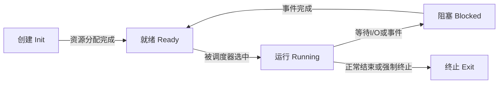
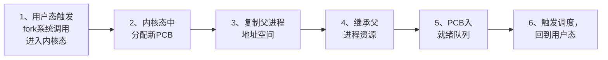
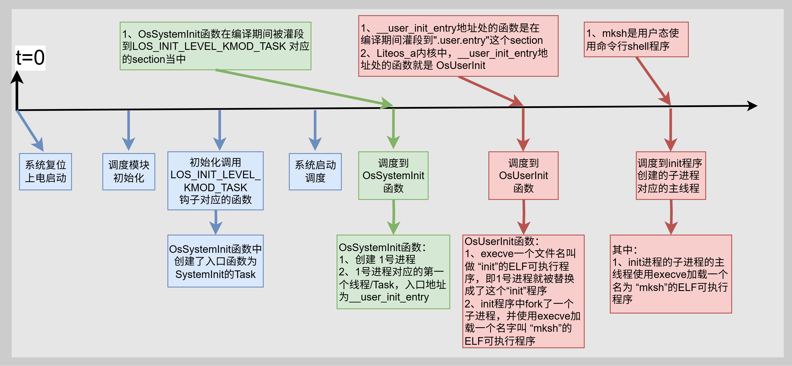
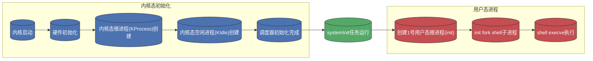

# 进程及Liteos_a内核进程分析

[TOC]

# 1、进程的通用知识点

## 1.1、进程的概念

* 进程是操作系统进行资源管理的最小单元；
* 进程是正在执行的程序实例，包含程序代码、数据、程序计数器（PC）、寄存器值、堆栈及系统资源（如文件、I/O设备）。与静态程序不同，进程是动态实体，具有生命周期（创建、执行、终止）。

* 进程通过动态性和资源独立性，实现了程序的并发执行与系统资源的高效管理。其状态机模型和PCB数据结构是操作系统设计的核心机制，支撑了现代计算机的多任务处理能力。


## 1.2、进程的状态

进程在其生命周期中经历以下状态（基础三状态模型扩展）：

| **状态** |                   **描述**                   |
| :------: | :------------------------------------------: |
| **新建** |         进程刚创建，资源未完全分配。         |
| **就绪** |   已获所需资源（内存、I/O），等待CPU调度。   |
| **运行** | 正在CPU上执行指令（单核CPU仅一个进程运行）。 |
| **阻塞** |     等待事件完成（如I/O操作），释放CPU。     |
| **挂起** |        被系统或用户暂停，不参与调度。        |
| **终止** |      执行结束或被强制终止，资源待回收。      |


## 1.3、进程的状态切换

状态转换由**事件触发**，操作系统通过调度器与中断机制管理：

* **创建 → 就绪**：系统正在分配PCB并设置相关参数。

- **就绪 → 运行**：调度器分配CPU时间片（如时间片轮转算法）。
- **运行 → 阻塞**：进程主动等待资源（如发起I/O请求或申请锁失败）。
- **阻塞 → 就绪**：等待事件完成（如I/O结束），由中断通知系统。
- **运行 → 终止**：进程正常退出（`exit()`）或发生致命错误。

流程图为：




## 1.4、进程的内核数据结构

每个进程对应唯一的PCB，存储管理所需元数据。

- **关键字段**：
    - 进程ID（PID）、状态、优先级。
    - 程序计数器、CPU寄存器值（上下文切换时保存/恢复）。
    - 内存管理信息（页表指针、地址空间范围）。
    - 资源清单（打开的文件、I/O设备）。
- **作用**：进程状态切换时更新PCB，确保执行连续性。


## 1.5、进程的初始化

**通用进程初始化流程大致为：**

* 1、硬件初始化和其他模块初始化
    - **目的**：让 CPU、内存、时钟、中断控制器等核心硬件进入可用状态；初始化内核其他关键子系统（内存管理、同步机制、文件系统框架等）。

* 2、确认进程控制块（PCB）的分配方式
    - **目的**：决定进程在运行时如何占用内存，以及后续创建/回收的性能与可预测性。主流OS有两种策略，一是动态分配（slab/heap）、二是预分配进程池（embedded/小内核常用）

* 3、创建系统特殊/基础进程
    - **目的**：保证调度器启动后系统不会空转，并且有第一个用户态执行入口。主流OS一般会创建内核态根进程、内核态空闲进程、用户态根进程。

* 4、启动调度并转入用户空间执行
    - **目的**：把 CPU 控制权交给调度器，由调度器按策略切换到用户态进程。

流程图为：


## 1.6、进程的创建

​	系统启动之后一般会创建三个进程：内核态主进程、内核态空闲进程、用户态主进程。此时系统还未切换到用户模式运行，所以可直接操作各种资源。当系统初始化完成之后，一般都是运行在用户模式，用户模式的权限不足，那么在用户模式下要创建新进程，操作系统的主流做法基本分为三步：

* 1、用户态使用特殊指令进入内核态。
* 2、在内核态创建进程。
* 3、触发调度回到用户态，系统运行新进程。

大名鼎鼎的**fork()系统调用**就实现了用户态创建进程的功能，其主要步骤如下：

* 1、用户态触发fork系统调用进入内核态。
* 2、内核态中执行fork系统调用分配新PCB，赋予唯一PID。
* 3、复制父进程地址空间（代码、数据、堆栈）。
* 4、继承父进程资源（文件描述符）。
* 5、将PCB加入就绪队列，状态设为就绪。
* 6、触发进程调度，回到用户态。

流程图为：




## 1.7、程序的执行

​	一份源文件被编译为一个静态的可执行文件（比如ELF类型的可执行文件）之后，操作系统要将其代码、数据从磁盘上搬运到内存并为其在内核中分配PCB并设置各种资源之后才能被调度。

​	和进程在用户态的创建使用fork系统调用类似，操作系统加载静态的ELF可执行程序也有一个大名鼎鼎的系统调用，一般是exec()函数中使用的。那么exec使用的系统调用将可执行程序加载到内存主要有以下几个流程：

* 1、文件查找与验证。
* 2、进程创建与地址空间初始化。
* 3、程序文件解析与段映射。
* 4、动态链接库处理。
* 5、执行环境初始化。
* 6、程序执行启动。
* 7、跳转到入口点执行。

流程图为：


# 2、Liteos_a内核中进程的实现

## 2.1、Liteos_a内核进程的基本概念

Liteos-a内核提供的进程模块主要用于实现用户态进程的隔离，内核态被视为一个进程空间，不存在其它进程(KIdle除外，KIdle进程是系统提供的空闲进程，和KProcess共享一个进程空间。KProcess 是内核态进程的根进程，KIdle 是其子进程）。

* 进程模块主要为用户提供多个进程，实现了进程之间的切换和通信，帮助用户管理业务程序流程。

- 进程采用抢占式调度机制，采用高优先级优先+同优先级时间片轮转的调度算法。
- 进程一共有32个优先级(0-31)，用户进程可配置的优先级有22个(10-31)，最高优先级为10，最低优先级为31。
- 高优先级的进程可抢占低优先级进程，低优先级进程必须在高优先级进程阻塞或结束后才能得到调度。
- 每一个用户态进程均拥有自己独立的进程空间，相互之间不可见，实现进程间隔离。
- 用户态根进程init由内核态创建，其它用户态子进程均由init进程fork而来。


## 2.2、Liteos_a内核进程的状态

**进程状态分为以下几种**：

- 初始化（Init）：进程正在被创建。
- 就绪（Ready）：进程在就绪列表中，等待CPU调度。
- 运行（Running）：进程正在运行。
- 阻塞（Pending）：进程被阻塞挂起。本进程内所有的线程均被阻塞时，进程被阻塞挂起。
- 僵尸（Zombies）：进程运行结束，等待父进程回收其控制块资源。


## 2.3、Liteos_a内核进程状态的切换

进程状态迁移示意图：


进程状态迁移说明：

- Init→Ready： 进程创建或 fork 时，拿到对应进程控制块后进入 Init 状态，即进程初始化阶段，当该阶段完成后进程将被插入调度队列，此时进程进入就绪状态。
- Ready→Running： 进程创建后进入就绪态，发生进程切换时，就绪列表中优先级最高且获得时间片的进程被执行，从而进入运行态。若此时该进程中已无其它线程处于就绪态，则进程从就绪列表删除，只处于运行态；若此时该进程中还有其它线程处于就绪态，则该进程依旧在就绪队列，此时进程的就绪态和运行态共存，但对外呈现的进程状态为运行态。
- Running→Pending： 进程在最后一个线程转为阻塞态时， 进程内所有的线程均处于阻塞态，此时进程同步进入阻塞态，然后发生进程切换。
- Pending→Ready： 阻塞进程内的任意线程恢复就绪态时，进程被加入到就绪队列，同步转为就绪态。
- Ready→Pending： 进程内的最后一个就绪态线程转为阻塞态时，进程从就绪列表中删除，进程由就绪态转为阻塞态。
- Running→Ready： 进程由运行态转为就绪态的情况有以下两种：
    - 1、有更高优先级的进程创建或者恢复后，会发生进程调度，此刻就绪列表中最高优先级进程变为运行态，那么原先运行的进程由运行态变为就绪态。
    - 2、若进程的调度策略为 LOS_SCHED_RR（时间片轮转），且存在同一优先级的另一个进程处于就绪态，则该进程的时间片消耗光之后，该进程由运行态转为就绪态，另一个同优先级的进程由就绪态转为运行态。
- Running→Zombies： 当进程的主线程或所有线程运行结束后，进程由运行态转为僵尸态，等待父进程回收资源。

进程的状态切换时间点并未有一个统一的标准，不同内核实现有所不同，但是都会有一个大概的准则，由于进程的状态表示了进程所携带资源的状态，所以在进行状态切换前后要对其资源进行相应调整。比如：

* 就绪态 --> 运行态，就需要进行从就绪队列中退出，获得CPU的控制权；
* 运行态 --> 僵尸态，就需要将其所有资源回收，且在被标记为僵尸态之后，该进程的资源就不该被使用。


## 2.4、Liteos_a内核的进程运行机制

​	Liteos_a内核提供的进程模块主要用于实现用户态进程的隔离，支持用户态进程的创建、退出、资源回收、设置/获取调度参数、获取进程ID、设置/获取进程组ID等功能。

​	用户态进程通过fork父进程而来，fork进程时会将父进程的进程虚拟内存空间clone到子进程，子进程实际运行时通过写时复制机制将父进程的内容按需复制到子进程的虚拟内存空间。

​	进程只是资源管理单元，实际运行是由进程内的各个线程完成的，不同进程内的线程相互切换时会进行进程空间的切换。

进程管理示意图：


## 2.5、Liteos_a内核机制分析的总结

​	分析到这里，可以看出Liteos_a内核完整的实现了 1.1 ~ 1.7 小节中进程通用的所有机制。接下来就借助Liteos_a内核的源代码继续分析，Liteos_a内核是如何通过代码将进程的这些机制一一实现的。


# 3、Liteos_a内核进程源码分析

​	以上分析了进程的相关概念，也分析了Liteos_a内核中进程的具体设计。接下来就来分析Liteos_a内核中的源码，看看在代码中是如何实现上述各种设计的。


## 3.1、Liteos_a内核进程的状态定义

```c
// kernel_liteos_a\kernel\base\include\los_process_pri.h
// The process is created but does not participate in scheduling.
#define OS_PROCESS_STATUS_INIT           OS_TASK_STATUS_INIT

// The process is ready.
#define OS_PROCESS_STATUS_READY          OS_TASK_STATUS_READY

// The process is running.
#define OS_PROCESS_STATUS_RUNNING        OS_TASK_STATUS_RUNNING

// The process is pending
#define OS_PROCESS_STATUS_PENDING       (OS_TASK_STATUS_PENDING | 
										 OS_TASK_STATUS_DELAY | 
										 OS_TASK_STATUS_SUSPENDED)

// The process is run out but the resources occupied by the process are not recovered.
#define OS_PROCESS_STATUS_ZOMBIES        0x0100U
```

可以看到，Liteos_a内核中进程的状态是由每个进程内部Task的状态决定的。

* Liteos_a内核中的线程（Thread）叫做任务（Task），即任务才是调度的实体。

那么Task的状态有如下几种：

```c
// kernel_liteos_a\kernel\base\include\los_sched_pri.h
// The task is init.
#define OS_TASK_STATUS_INIT         0x0001U

// The task is ready.
#define OS_TASK_STATUS_READY        0x0002U

// The task is running.
#define OS_TASK_STATUS_RUNNING      0x0004U

// The task is suspended.
#define OS_TASK_STATUS_SUSPENDED    0x0008U

// The task is blocked.
#define OS_TASK_STATUS_PENDING      0x0010U

// The task is delayed.
#define OS_TASK_STATUS_DELAY        0x0020U

// The time for waiting for an event to occur expires.
#define OS_TASK_STATUS_TIMEOUT      0x0040U

// The task is pend for a period of time.
#define OS_TASK_STATUS_PEND_TIME    0x0080U

// The task is exit.
#define OS_TASK_STATUS_EXIT         0x0100U

// The task is blocked.
#define OS_TASK_STATUS_BLOCKED  (OS_TASK_STATUS_INIT | OS_TASK_STATUS_PENDING | \
                                 OS_TASK_STATUS_DELAY | OS_TASK_STATUS_PEND_TIME | \
                                 OS_TASK_STATUS_SUSPENDED)

// The delayed operation of this task is frozen.
#define OS_TASK_STATUS_FROZEN       0x0200U
```


## 3.2、Liteos_a内核进程的PCB

进程控制块主要有几大板块：
- 进程状态位（processStatus） ：
    - 高12位存储状态标志（如OS_PROCESS_STATUS_ZOMBIES等）
    - 低4位记录当前活跃线程数
    - 通过位操作宏实现状态判断，例如： `OsProcessIsDead`

- 进程关系管理 ：
    - 通过childrenList和siblingList实现进程树结构
    - exitChildList用于暂存已终止但未被回收的子进程

- 线程管理 ：
    - threadGroup指向主线程控制块
    - threadSiblingList链接本进程所有线程的TCB
    - threadNumber和threadCount实现线程数量统计

- 条件编译项 ：
    - LOSCFG_KERNEL_SMP：多核调度相关字段
    - LOSCFG_KERNEL_VM：虚拟内存管理
    - LOSCFG_SECURITY_CAPABILITY：安全能力模型
    - LOSCFG_KERNEL_PLIMITS：资源限制功能

- 特殊字段 ：
    - sigShare：信号共享位图，用于进程间信号传递
    - vmSpace：维护进程独立的地址空间
    - plimits：实现cgroups-like的资源限制功能

下面列举PCB中主要的几个成员，具体见官方源码中的定义：[Liteos_a内核PCB定义文件](https://gitee.com/openharmony/kernel_liteos_a/blob/master/kernel/base/include/los_process_pri.h)

```c
// kernel_liteos_a\kernel\base\include\los_process_pri.h
typedef struct ProcessCB {
    CHAR                 processName[OS_PCB_NAME_LEN]; /**< Process name */
    UINT32               processID;                    /**< Process ID */
    UINT16               processStatus;                /**< [15:4] Process Status; [3:0] The number of threads currently
                                                            running in the process */
...
    LOS_DL_LIST          pendList;                     /**< Block list to which the process belongs */
    LOS_DL_LIST          childrenList;                 /**< Children process list */
    LOS_DL_LIST          exitChildList;                /**< Exit children process list */
    LOS_DL_LIST          siblingList;                  /**< Linkage in parent's children list */
    ProcessGroup         *pgroup;                      /**< Process group to which a process belongs */
    LOS_DL_LIST          subordinateGroupList;         /**< Linkage in group list */
    LosTaskCB            *threadGroup;
    LOS_DL_LIST          threadSiblingList;            /**< List of threads under this process */
    volatile UINT32      threadNumber; /**< Number of threads alive under this process */
    UINT32               threadCount;  /**< Total number of threads created under this process */
    LOS_DL_LIST          waitList;     /**< The process holds the waitLits to support wait/waitpid */
...
    UINTPTR              sigHandler;   /**< Signal handler */
    sigset_t             sigShare;     /**< Signal share bit */
...
#ifdef LOSCFG_KERNEL_VM
    LosVmSpace           *vmSpace;     /**< VMM space for processes */
#endif
#ifdef LOSCFG_FS_VFS
    struct files_struct  *files;       /**< Files held by the process */
#endif
...
#ifdef LOSCFG_DRIVERS_TZDRIVER
    struct Vnode        *execVnode;   /**< Exec bin of the process */
#endif
...
} LosProcessCB;
```


## 3.3、Liteos_a内核进程模块初始化

Liteos_a内核中的进程PCB不是使用malloc()等类似函数动态分配其内存。

而是在系统上电复位初始化之后分配一块固定的内存当做进程池，在系统运行过程中分配PCB也是从内存池中返回一个指向PCB结构体的指针；退出的进程，其PCB会被回收到进程池中继续使用。

Liteos_a内核中进程模块的初始化总体流程如下：

* 1、系统上电启动进行硬件和其他必要模块的初始化。
* 2、内核初始化中进行进程初始化。
    * 2.1、分配进程池和任务池：分配好系统的PCB、TCB资源供用户使用。
    * 2.2、设置0号2号进程：0号内核空闲进程（KIdle）及其空闲任务、2号内核根进程（KProcess）；
    * 2.3、设置1号进程：等待系统开始调度之后运行这个systemInit任务，这个任务会创建1号用户态根进程（Init），并创建1号进程得第一个线程，这第一个线程中要通过exec系统调用拉起shell。


## 3.4、Liteos_a内核进程相关源码分析

这里只展示核心代码，完整代码见官网：https://github.com/openharmony/kernel_liteos_a


### 3.4.1、进程池初始化源码分析

进程池的初始化过程主要做了三件事情：

* 1、创建进程池
    * 1.1、分配内存创建进程池
    * 1.2、分配进程ID
    * 1.3、调用 OsTaskInit 创建任务池
* 2、创建任务池
    * 2.1、分配内存创建任务池
    * 2.2、分配任务ID
    * 2.3、调用OsSchedInit初始化调度队列
* 3、初始化调度队列
    * 3.1、取出不同CPU核中的调度队列
    * 3.2、分别初始化调度队列中不同调度算法对应的具体队列的数据结构

整体函数调用链为：

```c
// kernel_liteos_a\arch\arm\arm\src\startup\reset_vector_mp.S
reset_vector // 系统上电复位之后的入口
    bl main
// kernel_liteos_a\kernel\common\main.c
    	main
    		OsMain
// kernel_liteos_a\kernel\base\core\los_process.c
    			OsProcessInit
// kernel_liteos_a\kernel\base\core\los_task.c
    				OsTaskInit
// kernel_liteos_a\kernel\base\sched\los_sched.c
    					OsSchedInit
```

OsProcessInit函数流程如下：

`````c
// kernel_liteos_a\kernel\base\core\los_process.c
OsProcessInit
    // 1.1、创建进程池
    // LOSCFG_BASE_CORE_PROCESS_LIMIT = 64
    g_processMaxNum = LOSCFG_BASE_CORE_PROCESS_LIMIT;
    size = (g_processMaxNum + 1) * sizeof(LosProcessCB);
    // 为进程池g_processCBArray分配 (64 + 1) * PCB大小的内存，并清零
    g_processCBArray = (LosProcessCB *)LOS_MemAlloc(m_aucSysMem1, size);
    // 1.2、分配进程ID
    // 将进程池中的每个进程 
    // 分配ID = 在进程池数组中的下标 index
    // 设置状态 = 未使用 OS_PROCESS_FLAG_UNUSED
    // 将每一个进程的PCB挂在全局进程空闲链表g_freeProcess中
    for (index = 0; index < g_processMaxNum; index++) {
        g_processCBArray[index].processID = index;
        g_processCBArray[index].processStatus = OS_PROCESS_FLAG_UNUSED;
        LOS_ListTailInsert(&g_freeProcess, &g_processCBArray[index].pendList);
    }
    // 1.3、调用OsTaskInit创建任务池
    // 在系统初始化阶段，使用默认64号进程创建任务池，所有任务挂在64号进程下面；
    // 这样设计可以为后续用户进程的创建预留 0-63号进程空间
    ret = OsTaskInit((UINTPTR)&g_processCBArray[g_processMaxNum]);
`````

OsTaskInit 函数流程如下：

```c
// kernel_liteos_a\kernel\base\core\los_task.c
OsTaskInit
    // 2.1、创建任务池
    // 默认最大任务数量为LOSCFG_BASE_CORE_TSK_LIMIT = 128
    g_taskMaxNum = LOSCFG_BASE_CORE_TSK_LIMIT;
    size = (g_taskMaxNum + 1) * sizeof(LosTaskCB);
    // 为任务池分配内存，并清零
    g_taskCBArray = (LosTaskCB *)LOS_MemAlloc(m_aucSysMem0, size);
    // 2.2、分配任务ID
    // 每个任务分配ID、默认所属进程为64号进程
    // 将任务挂在到全局任务空闲链表g_losFreeTask上
    for (index = 0; index < g_taskMaxNum; index++) {
        g_taskCBArray[index].taskStatus = OS_TASK_STATUS_UNUSED;
        g_taskCBArray[index].taskID = index;
        g_taskCBArray[index].processCB = processCB;
        LOS_ListTailInsert(&g_losFreeTask, &g_taskCBArray[index].pendList);
    }
    // 2.3、调用OsSchedInit初始化调度队列
    // 初始化调度队列结构本身
    // 调度队列为一个队列类型的数据结构体
    ret = OsSchedInit();
```

OsSchedInit函数流程如下：

```c
// kernel_liteos_a\kernel\base\sched\los_sched.c
OsSchedInit
    for (UINT16 cpuid = 0; cpuid < LOSCFG_KERNEL_CORE_NUM; cpuid++) {
        // 3.1、取出不同CPU核中的调度队列
        SchedRunqueue *rq = OsSchedRunqueueByID(cpuid);
        // 3.2、分别初始化调度队列中不同调度算法对应的具体队列的数据结构
        EDFSchedPolicyInit(rq);
        HPFSchedPolicyInit(rq);
    }
```


### 3.4.2、0/2号进程创建的函数调用链分析

0号进程为内核的空闲进程 KIdle；

2号进程为内核的根进程 KProcess；

总的函数调用链如下：

```c
// kernel_liteos_a\arch\arm\arm\src\startup\reset_vector_mp.S
reset_vector // 系统上电复位之后的入口
    bl main
// kernel_liteos_a\kernel\common\main.c
    	main
    		OsMain
    			OsSystemProcessCreate
    				// 创建 2号内核根进程 KProcess
                    LosProcessCB *kerInitProcess = OsGetKernelInitProcess();
                    UINT32 ret = OsSystemProcessInit(kerInitProcess, OS_KERNEL_MODE, "KProcess");
    				// 创建 0号内核空闲进程 KIdle
                    LosProcessCB *idleProcess = OsGetIdleProcess();
                    ret = OsInitPCB(idleProcess, OS_KERNEL_MODE, "KIdle");
                    // 0号KIdle的 父进程为 2号KProcess
                    idleProcess->parentProcess = kerInitProcess;
```

其中 OsGetKernelInitProcess 函数：获取KProcess进程对应的PCB结构体的地址。

```c
// kernel_liteos_a\kernel\base\core\los_process.c
LITE_OS_SEC_TEXT LosProcessCB *OsGetKernelInitProcess(VOID)
{
    // 返回 进程池 中的PCB结构体地址
    return &g_processCBArray[OS_KERNEL_ROOT_PROCESS_ID];
}
```

其中 OsSystemProcessInit 函数：主要是设置 KProcess 进程 的相关资源（文件、安全等等）

`````c
// kernel_liteos_a\kernel\base\core\los_process.c
OsSystemProcessInit
    // 1、初始化进程PCB结构体：设置PCB中的基础信息、内存空间、vid、SECURITY_CAPABILITY等内容
    UINT32 ret = OsInitPCB(processCB, flags, name);
    // 2、为进程分配文件相关资源
    #ifdef LOSCFG_FS_VFS
        processCB->files = alloc_files();
        if (processCB->files == NULL) {
            ret = LOS_ENOMEM;
            goto EXIT;
        }
    #endif
    // 3、设置进程组相关内容
    ProcessGroup *pgroup = OsCreateProcessGroup(processCB);
    // 4、设置安全增强能力
    #ifdef LOSCFG_SECURITY_CAPABILITY
        processCB->user = OsCreateUser(0, 0, 1);
        if (processCB->user == NULL) {
            ret = LOS_ENOMEM;
            goto EXIT;
        }
    #endif
    // 5、设置 进程资源限制管理模块的内容
    // 比如最大文件描述符数量、最大线程数限制、内存使用上限等等
    #ifdef LOSCFG_KERNEL_PLIMITS
        ret = OsPLimitsAddProcess(NULL, processCB);
        if (ret != LOS_OK) {
            ret = LOS_ENOMEM;
            goto EXIT;
        }
    #endif
`````

其中 OsGetIdleProcess 函数：获取Idle进程对应的PCB结构体的地址。

```c
// kernel_liteos_a\kernel\base\core\los_process.c
LITE_OS_SEC_TEXT LosProcessCB *OsGetIdleProcess(VOID)
{
    // 返回 进程池 中的PCB结构体地址
    return &g_processCBArray[OS_KERNEL_IDLE_PROCESS_ID];
}
```

其中 OsInitPCB 函数：主要是设置PCB结构体成员的值。具体内容自行看源码，这里列举部分：

```c
// kernel_liteos_a\kernel\base\core\los_process.c
OsInitPCB
    processCB->processMode = mode;
    processCB->processStatus = OS_PROCESS_STATUS_INIT;
	...
    LOS_ListInit(&processCB->threadSiblingList);
    LOS_ListInit(&processCB->childrenList);
	...
    #ifdef LOSCFG_KERNEL_VM
        if (OsProcessIsUserMode(processCB)) {
            processCB->vmSpace = OsCreateUserVmSpace();
	...
```


### 3.4.3、1号进程创建的函数调用链分析

#### 1）调用链整体流程总结

先给出总结：

* 1、Liteos_a内核在系统初始化过程中，创建了一个Task。
* 2、系统运行之后调度到这个Task，在这个Task中会创建 1 号进程（即用户态根进程）及其主线程。
* 3、之后1号进程的主线程被系统调度到，最终使用exec系统调用加载"/bin/mksh"程序，即启动了一个shell程序作为用户态的第一个程序。


#### 2）调用链流程图






#### 3）调用链具体流程分析

具体分析过程如下：

* 在源代码编写时，使用 LOS_MODULE_INIT(OsSystemInit, LOS_INIT_LEVEL_KMOD_TASK); 将 OsSystemInit 函数放在LOS_INIT_LEVEL_KMOD_TASK 钩子对应的section上，也就是灌段。

* 在内核初始化中 main-->OsMain-->OsInitCall(LOS_INIT_LEVEL_KMOD_TASK); 取出 LOS_INIT_LEVEL_KMOD_TASK钩子中的函数来执行，

    即调用到 OsSystemInit 函数。

* OsSysteminit 函数最终会创建入口地址为 SystemInit 函数的任务

    * 其中调用链为：OsSystemInit --> OsSystemInitTaskCreate --> 创建SystemInit任务

* 等到系统开始调度之后，会调度到这个Task，即运行 SystemInit 函数。

* SystemInit 函数是在单板侧定义的函数，例如OH官网适配的这个 hi3516dv300 单板侧定义的 SystemInit。

    * SystemInit --> SystemInit_UserInitProcess --> OsUserInitProcess

* OsUserInitProcess 函数

    * 创建一个 名为 Init 的 1 号进程，即用户态的根进程。
    * 创建一个入口地址为：__user_init_entry 的Task
    * 将 __user_init_entry 对应的 Task 设置为用户态根进程 Init 的主线程。

* __user_init_entry 这个地址在链接脚本 liteos.ld 中定义，指向了 ".user.entry"这个section

* ".user.entry"这个section被宏定义为

     `#define LITE_USER_SEC_ENTRY __attribute__((section(".user.entry")))`

* 那么在编译时添加 LITE_USER_SEC_ENTRY 这个宏的所有函数，其首地址都会被放在".user.entry"这个section当中。

* Liteos_a内核中把 LITE_USER_SEC_ENTRY VOID OsUserInit(VOID *args) 函数放在了其中。

* 那么最终系统会调度到 OsUserInit 函数，OsUserInit函数中

    * 使用 sys_call3(__NR_execve, (UINTPTR)g_initPath, 0, 0); 通过execve系统调用，执行g_initPath程序

    * g_initPath程序 要么是 "/dev/shm/init" 要么是 "/bin/init"

        ```c
        // kernel_liteos_a\kernel\user\src\los_user_init.c
        #ifdef LOSCFG_QUICK_START
        LITE_USER_SEC_RODATA STATIC CHAR *g_initPath = "/dev/shm/init";
        #else
        LITE_USER_SEC_RODATA STATIC CHAR *g_initPath = "/bin/init";
        #endif
        ```

* 这个 init 可执行程序在 kernel_liteos_a\apps\init\src\init.c 文件中编写

    * kernel_liteos_a\apps\init\src\init.c中的main函数通过fork创建了一个子进程，

        子进程中使用execve 加载了一个 "/bin/mksh" 可执行程序，即启动了mksh这个shell程序。


#### 4）1号进程创建流程中的问题思考

**1、为什么用户态进程不能像内核态根进程和内核态空闲进程那样，在内核初始化过程中直接创建？**

主要是**执行环境**和**资源准备程度**的问题：

- **内核态根进程/空闲进程**
    - 它们运行在**内核态**，使用**内核地址空间**，不依赖用户态内存映射、库加载、系统调用接口等高级抽象。
    - 在内核初始化早期，内存管理、文件系统、驱动等可能还不完整，但内核代码可以直接操作物理资源，所以可以直接创建并运行。
- **用户态进程**
    - 需要完整的**用户态运行环境**：
        - 1、虚拟内存空间已划分好（内核空间/用户空间分离）
        - 2、页表映射完成
        - 3、文件系统挂载可用（否则没法从`/bin/init`加载ELF）
        - 4、系统调用接口正常工作
    - 这些条件往往**要等到内核完成调度初始化并进入正常运行状态后**才能满足。
    - 如果在内核初始化早期就直接创建用户态进程，它会因为缺少这些依赖而无法运行或直接崩溃。

所以，Liteos_a的设计是**先用一个Task进入调度，之后在这个Task里创建用户态根进程**，这是为了确保**创建时机在用户态运行环境完全准备好之后**。


**2、为什么shell程序的启动要经过fork+execve，而不是直接execve？**

这里有**可扩展性**和**职责分离**的考虑：

- **直接execve的问题**
    - 如果`/bin/init`直接execve `/bin/mksh`，那么`init`这个进程就会消失，`mksh`会变成1号进程。
    - 但在类Unix系统中，1号进程（init）是特殊的：
        - 1、它是所有孤儿进程的收养者
        - 2、它负责监控和重启关键服务
        - 3、它在系统关机/重启时执行清理工作
    - 如果shell直接成为1号进程，这些功能就丢了。
- **fork + execve的好处**
    - `init`先`fork`出子进程运行`mksh`，自己继续作为1号进程存在
    - `init`可以监控shell的退出状态（如果shell崩溃可以重启它）
    - 保留init的系统管理功能
    - 灵活性更高，将来可以不止启动shell，还能启动更多用户服务（网络守护进程、日志进程等）

换句话说，`fork + execve`是为了保留`init`的核心角色，同时让shell运行在单独的进程里，互不干扰。


### 3.4.4、Liteos_a内核进程管理初始化源码分析

OsSystemInit 函数定义：

```c
// kernel_liteos_a\kernel\common\los_config.c
STATIC UINT32 OsSystemInit(VOID) {
...
    ret = OsSystemInitTaskCreate();
...
}
LOS_MODULE_INIT(OsSystemInit, LOS_INIT_LEVEL_KMOD_TASK);
```

内核初始化调用 OsSystemInit 的调用链：

```c
// kernel_liteos_a\arch\arm\arm\src\startup\reset_vector_mp.S
reset_vector // 系统上电复位之后的入口
    bl main
// kernel_liteos_a\kernel\common\main.c
    	main
    		OsMain
    			OsInitCall(LOS_INIT_LEVEL_KMOD_TASK);
```

OsSystemInit 调用到 SystemInit 的调用链：

```c
// kernel_liteos_a\kernel\common\los_config.c
OsSystemInit
    OsSystemInitTaskCreate
    	// 创建 入口函数为 SystemInit 的Task
    	sysTask.pfnTaskEntry = (TSK_ENTRY_FUNC)SystemInit;
```

SystemInit 函数定义：

```c
// device_soc_hisilicon\hi3516dv300\sdk_liteos\mpp\module_init\src\system_init.c
void SystemInit(void) {
...
    SystemInit_UserInitProcess();
}
```

SystemInit 函数调用到 OsUserInitProcess 函数调用链：

```c
// device_soc_hisilicon\hi3516dv300\sdk_liteos\mpp\module_init\src\system_init.c
SystemInit
    SystemInit_UserInitProcess
    	OsUserInitProcess
    		// 1、创建 1号进程，即用户态根进程
            LosProcessCB *processCB = OsGetUserInitProcess();
            ret = OsSystemProcessInit(processCB, OS_USER_MODE, "Init");
			// 2、创建1号进程的主线程 入口地址为 __user_init_entry 
			param.pfnTaskEntry = (TSK_ENTRY_FUNC)(CHAR *)&__user_init_entry;
```

`__user_init_entry` 在链接脚本 `liteos.ld` 中定义：指向`.user.entry`这个section

在代码中使用 `LITE_USER_SEC_ENTRY` 宏将函数灌段到 `.user.entry`这个section

```c
// kernel_liteos_a\tools\build\liteos.ld
SECTIONS
{
...
    .user_init USER_INIT_VM_START : ALIGN(0x1000) {
        . = ALIGN(0x4);
        __user_init_load_addr = LOADADDR(.user_init);
        __user_init_entry = .;
        KEEP(libuserinit.O (.user.entry))
        KEEP(libuserinit.O (.user.text))
        KEEP(libuserinit.O (.user.rodata))
        . = ALIGN(0X4);
    } > user_ram AT > ram
...
}

// kernel_liteos_a\kernel\user\include\los_user_init.h
#ifndef LITE_USER_SEC_ENTRY
#define LITE_USER_SEC_ENTRY   __attribute__((section(".user.entry")))
#endif
```

Liteos_a内核中将 `OsUserInit`函数灌段到 `.user.entry`这个section

```c
// kernel_liteos_a\kernel\user\src\los_user_init.c
#ifdef LOSCFG_QUICK_START
LITE_USER_SEC_RODATA STATIC CHAR *g_initPath = "/dev/shm/init";
#else
LITE_USER_SEC_RODATA STATIC CHAR *g_initPath = "/bin/init";
#endif
。。。
LITE_USER_SEC_ENTRY VOID OsUserInit(VOID *args)
{
#ifdef LOSCFG_KERNEL_DYNLOAD
    sys_call3(__NR_execve, (UINTPTR)g_initPath, 0, 0);
#endif
    while (true) {
    }
}
```

`OsUserInit` 函数中拉起的 `g_initPath` 路径上的 `init` 程序是 `kernel_liteos_a\apps\init\src\init.c` 文件编译的来，如果未启用 `LOSCFG_QUICK_START` 宏，即不是快速启动的情况下，会拉起 `/bin/mksh` 这个命令行 `shell` 程序。

```c
int main(int argc, char * const *argv)
{
...
    const char *shellPath = "/bin/mksh";
...
#ifdef LOSCFG_QUICK_START
    const char *samplePath = "/dev/shm/sample_quickstart";
    ret = fork();
    if (ret < 0) {
        printf("Failed to fork for sample_quickstart\n");
    } else if (ret == 0) {
        // 拉起 /dev/shm/sample_quickstart 可执行程序
        (void)execve(samplePath, NULL, NULL);
        exit(0);
    }
...
#endif
    ret = fork();
    if (ret < 0) {
        printf("Failed to fork for shell\n");
    } else if (ret == 0) {
...
    	// 拉起 /bin/mksh 这个可执行程序
        (void)execve(shellPath, NULL, NULL);
        exit(0);
    }
...
}
```
