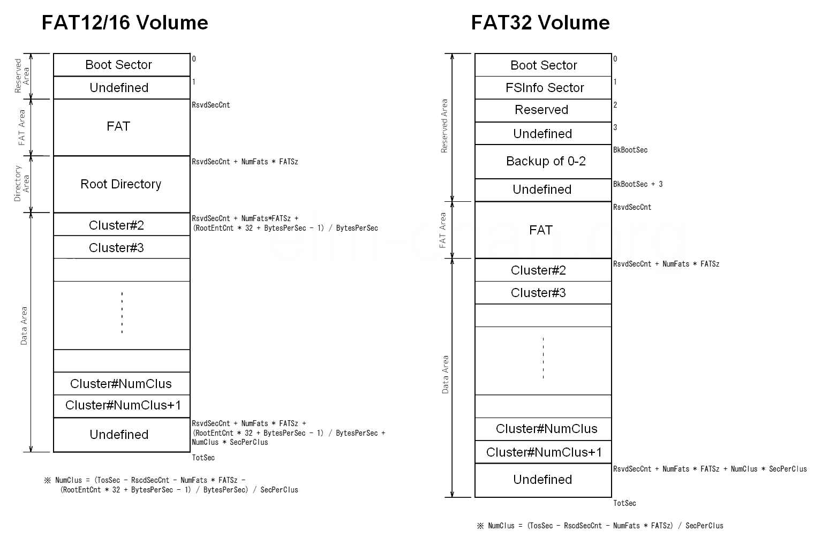
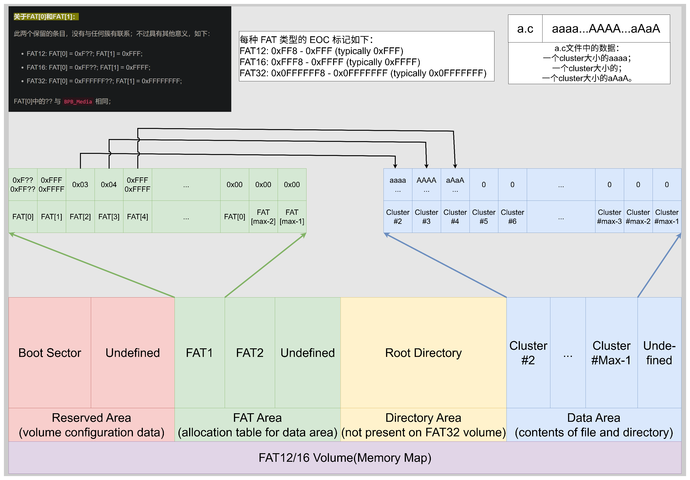
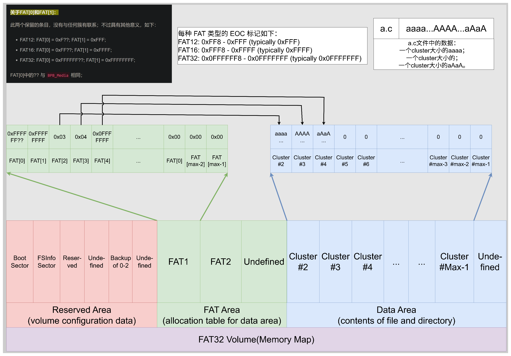
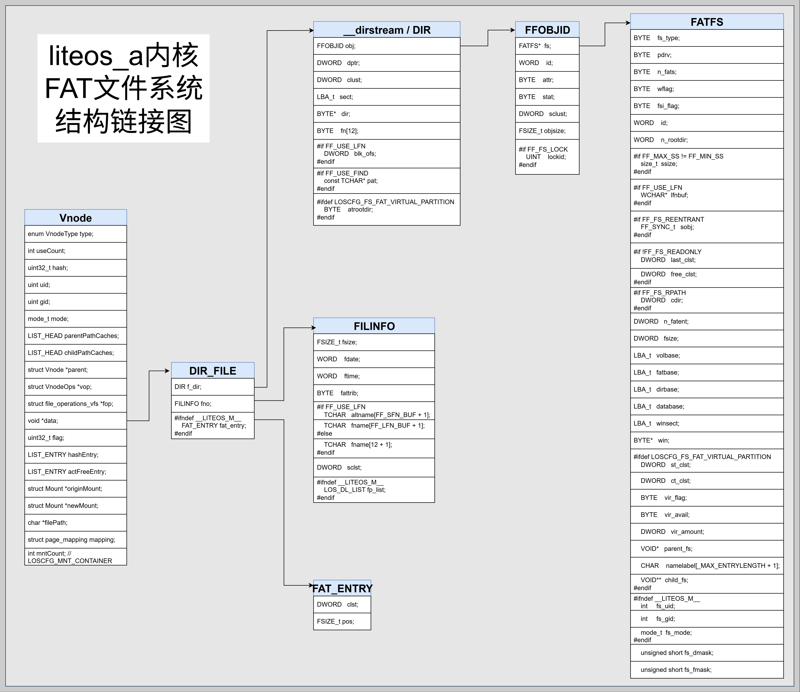

# FAT文件系统分析

[TOC]

# 1、一句话总结

FATFS是一个基于文件分配表(FAT)的文件系统，通过簇管理和链表结构组织数据存储，支持FAT12/16/32三种格式变种，具有跨平台兼容性好但单文件最大4GB限制的特点。

官网：[FATFS](https://elm-chan.org/docs/fat_e.html)


# 2、FATFS整体结构

**磁盘结构分层**：FATFS 将存储介质划分为四个区域（以 FAT12、FAT26 为例）：

- **保留扇区（引导区）**：存储文件系统元数据，如每扇区字节数（通常 512B）、每簇扇区数、FAT 表数量等。包含引导代码和 BIOS 参数块（BPB）。
- **FAT 区**：包含两个相同的 FAT 表（冗余备份），每个 FAT 表项占 4 字节（FAT32），记录簇的分配状态（空闲/占用/坏簇）及文件数据的簇链关系。
- **根目录区**：存储根目录项，每个目录项固定 32 字节，包含文件名、属性、时间戳、起始簇号等。
  - FAT32的根目录在数据区的第一个Cluster中。
- **数据区**：实际文件数据存储区，空间按簇划分（1 簇 = 连续多个扇区），文件数据通过 FAT 表链式管理。




# 3、FATFS数据存储格式

FATFA存储文件方式：

* 1、假设一个a.c文件大小为3个cluster大小
* 2、系统为a.c文件分配的FAT表中表项为FAT[2] --> FAT[3] -->FAT[4]
* 3、在FAT16中，一个FAT表项使用2字节
  * 2字节共16位，可表示2^16 - 1 = 65535个簇，FAT16数据区最多65525个簇，足够了。
  * FAT[2] 中存储0x03，表示存储下一个FAT表项的簇号；
  * FAT[3]中存储0x04，表示存储下一个FAT表项的簇号；
  * FAT[4]中存储0xFF，表示结束；

* 4、之后在数据区的Cluster[2]、Cluster[3]、Cluster[4]中就会存放a.c中的数据。


## 3.1、FAT12/16




## 3.2、FAT32




# 4、FATFS具体数据分析

## 4.1、FAT12/16


## 4.2、FAT32


# 5、FATFS源码分析

源码查看顺序：

* 1、从 API 入手 先看 f_open、f_read、f_write、f_opendir、f_readdir 这些对外接口的实现（在 `ff.c` 中），理解它们如何调用内部的目录、FAT 表管理函数。
* 2、关注目录项和 FAT 表操作 重点分析 dir_find() 、 dir_register() 、 get_fat() 、 put_fat() 、 create_chain() 等函数，这些是文件分配、查找、删除的核心。
* 3、理解数据结构的生命周期 结合 FIL、DIR、FATFS 结构体的定义和使用，理解它们在文件操作中的创建、初始化、销毁过程。
* 4、结合官方文档和注释 FatFs 官方文档非常详细，建议结合 doc/appnote.html 和 doc/sfatfs.html 阅读源码。


## 5.1、Liteos_a内核FATFS结构链接图




## 5.2、FATFS核心数据结构

FATFS作为一个通用的 FAT 文件系统实现，主要通过以下几个核心结构体来管理文件和目录：

* 1、FATFS 文件系统对象，表示一个挂载的 FAT 卷，包含了 FAT 表、根目录、数据区等元信息。
  - 参考定义： `ff.h`
* 2、FIL 文件对象，表示一个打开的文件，包含文件指针、文件大小、当前读写位置、起始簇号等。
  - 参考定义： `ff.h`

* 3、DIR 目录对象，表示一个目录的遍历状态，包含当前目录项、当前扇区等。
  * 参考定义： `ff.h`

* 4、FFOBJID 文件/目录对象的基类，FIL 和 DIR 都包含它，记录了文件系统指针、起始簇号、文件大小等。

核心数据结构：

* `struct FATFS`
* `struct FFOBJID`
* `struct FIL`
* `struct DIR`
* `struct FILINFO`
* `struct FAT_ENTRY`
* `struct MKFS_PARM`
* `struct DIR_FILE`
* `enum FRESULT`

具体定义查看OpenHarmony的FATFS官方仓库：https://github.com/openharmony/third_party_FatFs


## 5.3、FATFS文件/目录操作主要流程
### 5.3.1、文件/目录的打开与查找
用户通过 VFS 层调用，比如 open()，最终会调用 FatFs 的 f_open() 。

f_open() 主要流程：

* 1、通过 mount_volume() 挂载卷，获取 FATFS 对象。
* 2、通过 follow_path() 递归解析路径，每一级目录都用 create_name() 生成目录项名，然后用 dir_find() 查找对应目录项。
* 3、找到文件后，初始化 FIL 结构体，记录文件起始簇号、大小等。
* 4、如果是新建文件，则会分配目录项和簇链。

目录遍历类似，使用 f_opendir() 和 f_readdir() ，内部用 DIR 结构体维护遍历状态。


### 5.3.2、文件的读写

读操作： f_read()

- 通过 FIL 结构体中的当前簇号、文件指针等，定位到数据区的物理扇区。
- 通过 get_fat() 遍历 FAT 表，找到下一个簇。
- 通过 disk_read() 读取底层存储设备的数据。

写操作： f_write()

- 如果写入超出当前簇链，会通过 create_chain() 分配新的簇，并更新 FAT 表。
- 通过 disk_write() 写入底层存储设备。


### 5.3.3、目录项和 FAT 表的管理

目录项（Directory Entry）是 FAT 文件系统的核心，记录了文件名、起始簇号、文件大小等。

FAT 表用于记录每个簇的下一个簇号，实现文件的链式存储。

相关函数如 get_fat() 、 put_fat() 、 clust2sect() 、 dir_register() 、 dir_remove() 等。


## 5.4、FATFS源码分析

### 5.4.1、fatfs_mount

```c
// kernel_liteos_a\fs\fat\os_adapt\fatfs.c
/*
一句话总结：读取磁盘数据，和FAT文件系统格式进行比对，构造FAT文件系统私有数据，为VFS层构造Vnode节点数据
    ## 1. 准备阶段
        - 声明必要的变量，包括Vnode指针、文件系统实例、目录文件信息和分区信息等
        - 通过 fat_bind_check 函数检查块设备是否可以绑定为FAT文件系统，并获取分区信息
        - 设置分区名称为"vfat"，标识这是一个FAT文件系统分区
    ## 2. 资源分配与初始化
        - 分配FAT文件系统实例内存
        - 如果启用了FAT虚拟分区功能，初始化相关字段
        - 创建文件系统同步对象(互斥锁)，用于多线程访问控制
        - 锁定文件系统，防止并发访问
        - 初始化文件系统类型和设置物理驱动器ID
    ## 3. 文件系统识别与初始化
        - 获取扇区大小并验证其有效性（在支持多扇区大小的配置下）
        - 分配文件系统窗口缓冲区，用于读写扇区数据
        - 查找FAT分区，获取分区格式和起始扇区
        - 初始化FAT文件系统对象，设置文件系统参数
    ## 4. 根目录创建与VFS集成
        - 设置文件系统的用户ID、组ID和访问权限
        - 分配目录文件结构，用于表示根目录
        - 初始化根目录的目录对象和文件信息结构
        - 分配Vnode结构，用于表示根目录在VFS中的节点
        - 设置挂载结构的数据和覆盖的Vnode
        - 设置Vnode的各种属性，包括父节点、文件操作函数集、私有数据等
        - 计算根目录的哈希值并将Vnode插入哈希表
    ## 5. 完成挂载与错误处理
        - 解锁文件系统
        - 返回成功状态
        - 如果在任何步骤中出现错误，通过goto语句跳转到相应的错误处理标签
        - 根据错误发生的阶段释放已分配的资源，确保不会发生内存泄漏
*/
int fatfs_mount(struct Mount *mnt, struct Vnode *blk_device, const void *data)
{
	...
}
```


### 5.4.2、fatfs_unmount

```c
// kernel_liteos_a\fs\fat\os_adapt\fatfs.c
/*
一句话总结：释放所有数据，销毁VFS层和FAT文件系统私有数据所占用的内存
- 功能 ： 该函数实现了FAT文件系统的卸载（umount）操作，负责释放文件系统相关的所有资源，并关闭底层块设备。
- 主要流程 ：
    - 加锁文件系统，防止并发访问。
    - 获取分区信息和块设备Vnode，若失败则解锁并返回错误。
    - 如果启用了FAT缓存，先同步缓存到物理设备。
    - 释放分区名内存。
    - 关闭块设备（如果驱动支持）。
    - 释放FATFS的窗口缓冲区。
    - 解锁文件系统。
    - 删除FATFS的同步对象（互斥锁）。
    - 释放FATFS对象本身。
    - 返回块设备Vnode指针。
*/
int fatfs_umount(struct Mount *mnt, struct Vnode **blkdriver)
{
    ...
}
```

其他接口分析方法同上。

