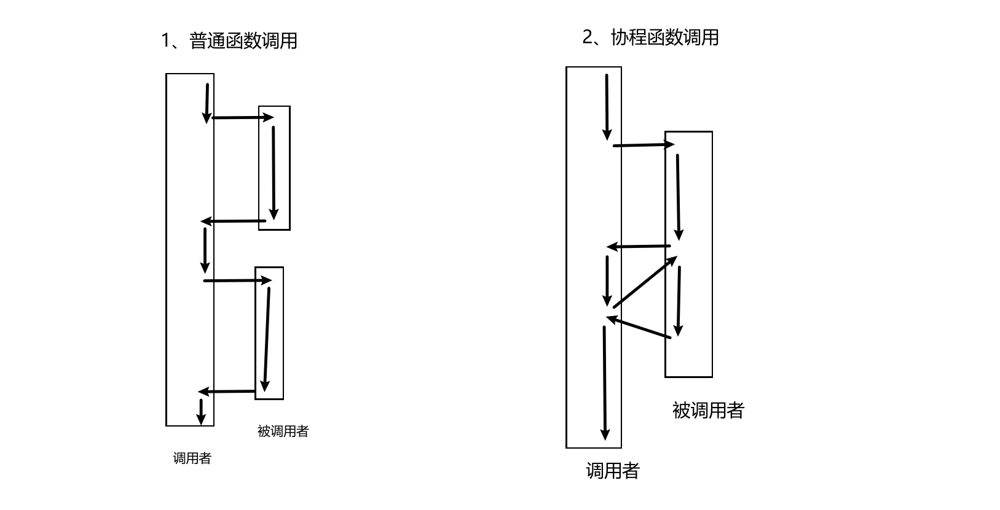
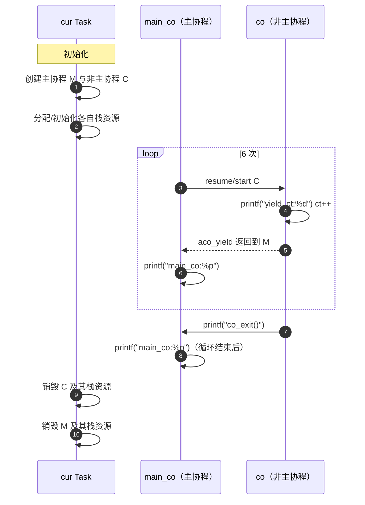
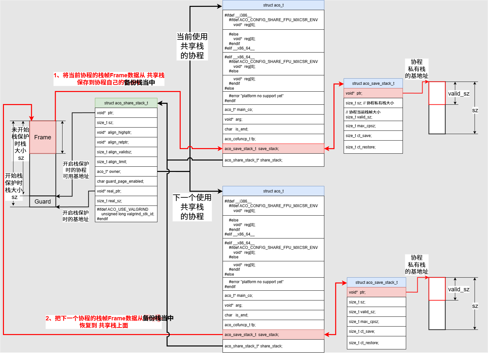

# 协程Coroutine和C语言协程库libaco分析

[TOC]

# 0、一句话总结

​	不同于函数调用总是从起点开始，协程切换可从上次挂起/返回点继续执行。协程的核心是在用户态保存/恢复执行上下文，通过显式的让出与恢复实现单线程内的合作式调度，**让开发者可以用类似编写同步（顺序）代码的方式来表达和管理异步逻辑**，并降低线程切换开销。


# 1、协程的介绍

## 1.1、libaco 协程库的介绍

​	libaco 是一个为 C 语言量身打造的、追求极限性能的轻量级非对称协程库。它通过精简的 API、独立的协程栈、高效的纯汇编上下文切换实现（尤其 x86-64），特别适合需要高并发、低延迟且资源受限的场景（如网络服务）。其核心优势在于 **`aco_yield()`/`aco_resume()`的切换开销极小**。开发者需要注意其非对称模型的特点、栈管理责任以及平台依赖性。它是构建高性能 C 语言并发应用的强大基础组件。


## 1.2、libaco 协程的开发实例

### 1.2.1、协程的介绍

普通函数调用 和 协程函数调用 的执行流对比：

* 普通函数调用（每次都从被调者起点开始）
* 协程调用/切换（首次从起点，之后从上次挂起点的下一行继续）




### 1.2.2、实例介绍

C语言协程库 libaco（https://github.com/hnes/libaco）中给出的示例代码：

* 1、cur Task创建了一个主协程 main_co、一个非主协程 co
* 2、之后主协程 main_co 循环6次：先启动非主协程 co、接着打印 自己的main_co地址
* 3、非主协程 co 中也是循环6次：先打印当前的索引值 ct、接着返回主协程
* 4、非主协程 6 次循环结束，打印 co_exit、主协程6次循环结束打印一次main_co的地址。
* 5、最后cur Task 销毁主协程、非主协程和对应的栈资源。


### 1.2.3、示例代码

```c
#include "aco.h"
#include <stdlib.h>
#include <stdio.h>
#include <unistd.h>
#include "aco_assert_override.h"

void co_fp0() {
    // Get co->arg. The caller of `aco_get_arg()` must be a non-main co.
    int *iretp = (int *)aco_get_arg();
    // Get current co. The caller of `aco_get_co()` must be a non-main co.
    aco_t* this_co = aco_get_co();
    int ct = 0;
    while(ct < 6){
        printf(
            "co:%p save_stack:%p share_stack:%p yield_ct:%d\n",
            this_co, this_co->save_stack.ptr,
            this_co->share_stack->ptr, ct
        );
        // Yield the execution of current co and resume the execution of
        // `co->main_co`. The caller of `aco_yield()` must be a non-main co.
        aco_yield();
        (*iretp)++;
        ct++;
    }
    printf(
        "co:%p save_stack:%p share_stack:%p co_exit()\n",
        this_co, this_co->save_stack.ptr,
        this_co->share_stack->ptr
    );
    // In addition do the same as `aco_yield()`, `aco_exit()` also set
    // `co->is_end` to `1` thus to mark the `co` at the status of "END".
    aco_exit();
}

int main() {
#ifdef ACO_USE_VALGRIND
    if(0){
        printf("%s doesn't have valgrind test yet, "
            "so bypass this test right now.\n",__FILE__
        );
        exit(0);
    }
#endif
    // Initialize the aco environment in the current thread.
    aco_thread_init(NULL);

    // Create a main coroutine whose "share stack" is the default stack
    // of the current thread. And it doesn't need any private save stack
    // since it is definitely a standalone coroutine (which coroutine
    // monopolizes it's share stack).
    aco_t* main_co = aco_create(NULL, NULL, 0, NULL, NULL);

    // Create a share stack with the default size of 2MB and also with a
    // read-only guard page for the detection of stack overflow.
    aco_share_stack_t* sstk = aco_share_stack_new(0);

    int co_ct_arg_point_to_me = 0;
    // Create a non-main coroutine whose share stack is `sstk` and has a
    // default 64 bytes size private save stack. The entry function of the
    // coroutine is `co_fp0`. Set `co->arg` to the address of the int
    // variable `co_ct_arg_point_to_me`.
    aco_t* co = aco_create(main_co, sstk, 0, co_fp0, &co_ct_arg_point_to_me);

    int ct = 0;
    while(ct < 6){
        assert(co->is_end == 0);
        // Start or continue the execution of `co`. The caller of this function
        // must be main_co.
        aco_resume(co);
        // Check whether the co has completed the job it promised.
        assert(co_ct_arg_point_to_me == ct);
        printf("main_co:%p\n", main_co);
        ct++;
    }
    aco_resume(co);
    assert(co_ct_arg_point_to_me == ct);
    // The value of `co->is_end` must be `1` now since it just suspended
    // itself by calling `aco_exit()`.
    assert(co->is_end);

    printf("main_co:%p\n", main_co);

    // Destroy co and its private save stack.
    aco_destroy(co);
    co = NULL;
    // Destroy the share stack sstk.
    aco_share_stack_destroy(sstk);
    sstk = NULL;
    // Destroy the main_co.
    aco_destroy(main_co);
    main_co = NULL;

    return 0;
}
```

运行结果：

```bash
UserName@HostName ~/libaco[v1.2.4]
$ ./output/test_aco_tutorial_0..no_valgrind.standaloneFPUenv 
co:0x55ab44b9d3b0 save_stack:0x55ab44b9d460 share_stack:0x7fe1f8ff2000 yield_ct:0
main_co:0x55ab44b9d2a0
co:0x55ab44b9d3b0 save_stack:0x55ab44b9d460 share_stack:0x7fe1f8ff2000 yield_ct:1
main_co:0x55ab44b9d2a0
co:0x55ab44b9d3b0 save_stack:0x55ab44b9d460 share_stack:0x7fe1f8ff2000 yield_ct:2
main_co:0x55ab44b9d2a0
co:0x55ab44b9d3b0 save_stack:0x55ab44b9d460 share_stack:0x7fe1f8ff2000 yield_ct:3
main_co:0x55ab44b9d2a0
co:0x55ab44b9d3b0 save_stack:0x55ab44b9d460 share_stack:0x7fe1f8ff2000 yield_ct:4
main_co:0x55ab44b9d2a0
co:0x55ab44b9d3b0 save_stack:0x55ab44b9d460 share_stack:0x7fe1f8ff2000 yield_ct:5
main_co:0x55ab44b9d2a0
co:0x55ab44b9d3b0 save_stack:0x55ab44b9d460 share_stack:0x7fe1f8ff2000 co_exit()
main_co:0x55ab44b9d2a0

UserName@HostName ~/libaco[v1.2.4]
$
```


### 1.2.4、示例运行时序图




# 2、协程库libaco的源码分析

C语言协程库 libaco ：https://github.com/hnes/libaco

协程库的各种结构对应关系图：




## 2.1、基础配置

### 2.1.1、FPU与MXCSR的控制字

一句话总结

- 它们就是“本线程的浮点计算规则开关”。libaco 通过保存/恢复（或共享）它们，既保证协程之间的数值隔离，又能在你确认不改动时选择更快的切换路径。

决定浮点计算怎么做的开关，作用如下：

1、数值语义层面（决定“浮点计算怎么做”）

- 舍入方式：就近（ties-to-even）、向零、向正无穷、向负无穷。影响取整、累计误差以及边界条件计算。
- 异常屏蔽/标志：无效、被零除、上溢、下溢、精度丢失等，既可用于调试（打开异常更容易发现数值错误），也可用于严格的 IEEE 行为控制。
- 次正规数处理（MXCSR 的 FTZ/DAZ）：可把非常小的数“冲零”，换取显著性能提升（尤其在音频/信号处理、ML 前后处理里常见），但会牺牲严格的精度/可重复性。
- x87 与 SSE/AVX 的分工：x87 控制字主要影响传统 x87 浮点（含 long double/80-bit 内部精度）；MXCSR 作用于 SSE/AVX 浮点（现代编译器处理 float/double 的主力）。两者共同决定同一线程内所有 C/C++/SIMD 浮点的行为。

2、协程切换层面（避免协程之间“串味”）

- 这些控制字本来是“每线程”的环境，OS 做线程切换会自动保存/恢复；但协程是在同一线程内切换，需要库自己管。
- 如果某个协程改了舍入模式或打开了异常、设置了 FTZ/DAZ，而切走时不保存/恢复，其他协程的浮点计算就会受到影响，出现不可预期的数值差异或性能波动。
- libaco 的策略：
  - 未定义 ACO_CONFIG_SHARE_FPU_MXCSR_ENV：每个协程有独立的 FPU/MXCSR 配置；在协程切换时保存/恢复，确保相互独立但切换稍慢。
  - 定义了该宏：所有协程共享同一份配置；切换更快，但要求你的程序运行期间不修改这些控制字，否则会相互影响。

什么时候该“共享”，什么时候该“独立”

- 选择“共享”（定义宏）：
  - 你能保证运行期间不会调用 fesetround()/fesetenv()、_mm_setcsr()/MXCSR 相关接口，也没有第三方库会这么做。
  - 你追求更快的协程切换，且应用对严格的 IEEE 行为/可重复性没有特别要求（或你在进程启动时统一设置过 FTZ/DAZ 等并不再改动）。
- 选择“独立”（不定义宏，默认安全）：
  - 需要在某些计算阶段切换舍入模式或异常掩码（金融、求解器、几何/渲染中常见）。
  - 依赖可能会改动浮点环境的第三方库（某些 BLAS/向量库、老代码、Fortran 库等）。
  - 需要每个协程拥有不同的数值策略或保证强可重复性。


## 2.1. 协程初始化 aco_thread_init
**核心流程：** 初始化当前线程的协程环境

- 1、保存当前线程的FPU控制字和MXCSR寄存器状态到全局变量 `aco_gtls_fpucw_mxcsr`
- 2、设置临终遗言函数：设置协程保护函数指针 `aco_gtls_last_word_fp`（用于处理异常终止的协程）

```c

static void aco_default_protector_last_word(void){
    aco_t* co = aco_get_co();
    // do some log about the offending `co`
    fprintf(stderr,"error: aco_default_protector_last_word triggered\n");
    fprintf(stderr, "error: co:%p should call `aco_exit()` instead of direct "
        "`return` in co_fp:%p to finish its execution\n", co, (void*)co->fp);
    assert(0);
}
static __thread aco_cofuncp_t aco_gtls_last_word_fp = aco_default_protector_last_word;

void aco_thread_init(aco_cofuncp_t last_word_co_fp){
    // 1、保存当前线程的 FPU/MXCSR 控制字
    // 调用汇编函数 `aco_save_fpucw_mxcsr` ，
    // 将当前线程的 x87 FPU 控制字与 SSE MXCSR 寄存器的值
    // 保存到线程本地存储（TLS）数组 aco_gtls_fpucw_mxcsr 。
    aco_save_fpucw_mxcsr(aco_gtls_fpucw_mxcsr);

    // 2、设置自定义的"遗言"处理器
    // 遗言默认的是：aco_default_protector_last_word 函数
    // 触发时机 ：
    // - 当协程函数异常结束（直接 return 而不是调用 aco_exit() ）时，
    //	 会跳转到共享栈预设的"保护性返回地址"。
    // - 这个地址指向 `aco_funcp_protector_asm` ，它会调用 `aco_funcp_protector` ，
    //   进而执行 aco_gtls_last_word_fp 指向的函数。
    if((void*)last_word_co_fp != NULL)
        aco_gtls_last_word_fp = last_word_co_fp;
}

```


## 2.2. 创建协程 aco_create

**核心流程：** 创建协程对象
- **主协程创建**：
  - `aco_create(NULL, NULL, 0, NULL, NULL)` - 使用当前线程默认栈
  - 作为当前线程的初始上下文抽象，不真正运行 fp
  - 主协程不占用共享栈与拷贝栈

- **非主协程创建**：
  - 1、分配 `aco_t` 结构体内存并初始化
  - 2、设置寄存器初始值（返回地址指向入口函数，栈指针指向共享栈）
  - 3、分配私有保存栈 `save_stack`（默认64字节，可动态扩展）
  - 4、建立与主协程的关联关系

```c
aco_t* aco_create(
        aco_t* main_co, aco_share_stack_t* share_stack,
        size_t save_stack_sz, aco_cofuncp_t fp, void* arg
    ){
    // 1、分配协程对象本体（仅是描述与状态，不含共享栈内存本身）
    aco_t* p = malloc(sizeof(aco_t));
    assertalloc_ptr(p);
    // 将结构体清零，确保默认字段（如寄存器槽位、统计字段）初始为0
    memset(p, 0, sizeof(aco_t));

    // 2、设置协程结构体成员
    // 2.1、非主协程 non-main co 结构体设置
    if(main_co != NULL){ // non-main co
        // 2.1.1、非主协程必须绑定共享栈（share_stack_new/new2 创建）
        assertptr(share_stack);
        p->share_stack = share_stack;
#ifdef __i386__
        // 将“返回地址寄存器槽”预置为协程入口函数 fp：
        // 这样在第一次 resume 时，会像“ret”到 fp，从而进入协程函数执行
        p->reg[ACO_REG_IDX_RETADDR] = (void*)fp;
        // push retaddr
        // 设置 SP 指向共享栈的对齐返回位置 align_retptr（满足 ABI 对齐与保护返回桩）
        p->reg[ACO_REG_IDX_SP] = p->share_stack->align_retptr;
        #ifndef ACO_CONFIG_SHARE_FPU_MXCSR_ENV
            // 若未开启“共享FPU/MXCSR环境”，则为该协程预置独立的数值控制字
            // 这些控制字由 aco_thread_init 存入 TLS（aco_gtls_fpucw_mxcsr）
            p->reg[ACO_REG_IDX_FPU] = aco_gtls_fpucw_mxcsr[0];
            p->reg[ACO_REG_IDX_FPU + 1] = aco_gtls_fpucw_mxcsr[1];
        #endif
#elif  __x86_64__
        // 2.1.2、同 i386：把“返回地址槽”设为 fp，首次切换时“返回”进入 fp
        p->reg[ACO_REG_IDX_RETADDR] = (void*)fp;
        // 将 SP 初始化为共享栈的对齐返回位置
        p->reg[ACO_REG_IDX_SP] = p->share_stack->align_retptr;
        #ifndef ACO_CONFIG_SHARE_FPU_MXCSR_ENV
            // 预置独立的 FPU/MXCSR 控制字（来自 TLS）
            p->reg[ACO_REG_IDX_FPU] = aco_gtls_fpucw_mxcsr[0];
        #endif
#else
        #error "platform no support yet"
#endif
        // 2.1.3、记录主协程指针（用于与 main co 之间的切换关系）
        p->main_co = main_co;
        // 2.1.4、记录协程入口与参数，供协程函数内部使用（通过 aco_get_arg 获取）
        p->arg = arg;
        p->fp = fp; // fp 就是传入的 aco_cofuncp_t fp 协程函数地址

        // 2.1.5、初始化“拷贝栈”容量：0 则使用一个很小的默认值 64
        // 拷贝栈用于共享栈模式下发生抢占时保存该协程活跃帧（见 aco_resume）
        if(save_stack_sz == 0){
            save_stack_sz = 64;
        }
        p->save_stack.ptr = malloc(save_stack_sz);
        assertalloc_ptr(p->save_stack.ptr);
        p->save_stack.sz = save_stack_sz;
#if defined(__i386__) || defined(__x86_64__)
        // 初始时没有任何已保存内容
        p->save_stack.valid_sz = 0;
#else
        #error "platform no support yet"
#endif
        // 2.1.6、至此，非主协程的初始寄存器/SP/数值环境/拷贝栈均准备完毕
        return p;
    }
    // 2.2、主协程 main co 结构体设置
    else { // main co
        // 2.2.1、创建“主协程”（作为当前线程的初始上下文抽象，不真正运行 fp）
        p->main_co = NULL;
        p->arg = arg;
        p->fp = fp;
        // 2.2.2、主协程不占用共享栈与拷贝栈
        p->share_stack = NULL;
        p->save_stack.ptr = NULL;
        return p;
    }
    assert(0);
}
```


## 2.3. 执行协程 aco_resume

**核心流程：** 恢复/启动协程执行
- 检查当前协程是否需要保存栈内容到私有保存栈
- 如果目标协程之前被挂起，从私有保存栈恢复内容到共享栈
- 调用底层汇编函数 `acosw()` 进行上下文切换
- 更新共享栈的所有者信息
- 调用者（主协程）进入"yielded"状态

```c
aco_attr_no_asan
void aco_resume(aco_t* resume_co)
{
    // 1、参数与状态校验：必须是一个非结束的非主协程（main_co != NULL）
    assert(resume_co != NULL && resume_co->main_co != NULL
        && resume_co->is_end == 0
    );

    // 2、共享栈占用检查：若当前共享栈的 owner 不是本协程，则需要先“让路”
    if(resume_co->share_stack->owner != resume_co){
	    // 2.1、若有其他协程正在占用该共享栈，需要先把它的活动帧拷贝到该协程私有的 save_stack
        if(resume_co->share_stack->owner != NULL){
            aco_t* owner_co = resume_co->share_stack->owner;
            assert(owner_co->share_stack == resume_co->share_stack);
#if defined(__i386__) || defined(__x86_64__)
            // 2.1.1、健壮性检查：SP 合法性与对齐边界范围（保证可复制范围正确）
            assert(
                (
                    (uintptr_t)(owner_co->share_stack->align_retptr)
                    >=
                    (uintptr_t)(owner_co->reg[ACO_REG_IDX_SP])
                )
                &&
                (
                    (uintptr_t)(owner_co->share_stack->align_highptr)
                    -
                    (uintptr_t)(owner_co->share_stack->align_limit)
                    <=
                    (uintptr_t)(owner_co->reg[ACO_REG_IDX_SP])
                )
            );
            // 2.1.2、计算当前 owner 在共享栈上的“活跃帧长度”（retptr 到 SP 的距离）
            owner_co->save_stack.valid_sz =
                (uintptr_t)(owner_co->share_stack->align_retptr)
                -
                (uintptr_t)(owner_co->reg[ACO_REG_IDX_SP]);

            // 2.1.3、若保存区容量不足，按 2^n 翻倍扩容直到可容纳全部活跃帧
            if(owner_co->save_stack.sz < owner_co->save_stack.valid_sz){
                free(owner_co->save_stack.ptr);
                owner_co->save_stack.ptr = NULL;
                while(1){
                    owner_co->save_stack.sz = owner_co->save_stack.sz << 1;
                    assert(owner_co->save_stack.sz > 0);
                    if(owner_co->save_stack.sz >= owner_co->save_stack.valid_sz){
                        break;
                    }
                }
                owner_co->save_stack.ptr = malloc(owner_co->save_stack.sz);
                assertalloc_ptr(owner_co->save_stack.ptr);
            }

            // 2.1.4、把 owner 的活跃帧从共享栈拷贝到 owner 的 save_stack（拷贝栈）
            // TODO: optimize the performance penalty of memcpy function call
            //   for very short memory span
            if(owner_co->save_stack.valid_sz > 0) {
    #ifdef __x86_64__
                aco_amd64_optimized_memcpy_drop_in(
                    owner_co->save_stack.ptr,
                    owner_co->reg[ACO_REG_IDX_SP],
                    owner_co->save_stack.valid_sz
                );
    #else
                memcpy(
                    owner_co->save_stack.ptr,
                    owner_co->reg[ACO_REG_IDX_SP],
                    owner_co->save_stack.valid_sz
                );
    #endif
                owner_co->save_stack.ct_save++;     // 统计：发生一次保存
            }
            // 2.1.5、更新历史最大保存尺寸
            if(owner_co->save_stack.valid_sz > owner_co->save_stack.max_cpsz){
                owner_co->save_stack.max_cpsz = owner_co->save_stack.valid_sz;
            }
            // 2.1.6、释放共享栈占用权与已用区长度（为 resume_co 的恢复做准备）
            owner_co->share_stack->owner = NULL;
            owner_co->share_stack->align_validsz = 0;
#else
            #error "platform no support yet"
#endif
        }

        // 2.2、现在共享栈已空闲：将 resume_co 先前保存的活跃帧恢复回共享栈，并占有共享栈
        assert(resume_co->share_stack->owner == NULL);
#if defined(__i386__) || defined(__x86_64__)
        // 2.2.1、安全检查：待恢复的有效长度不能超过对齐限制（预留一个返回地址槽）
        assert(
            resume_co->save_stack.valid_sz
            <=
            resume_co->share_stack->align_limit - sizeof(void*)
        );

        // 2.2.2、把 resume_co 的 save_stack 内容拷贝回共享栈顶端（align_retptr 之下）
        // TODO: optimize the performance penalty of memcpy function call
        //   for very short memory span
        if(resume_co->save_stack.valid_sz > 0) {
    #ifdef __x86_64__
            aco_amd64_optimized_memcpy_drop_in(
                (void*)(
                    (uintptr_t)(resume_co->share_stack->align_retptr)
                    -
                    resume_co->save_stack.valid_sz
                ),
                resume_co->save_stack.ptr,
                resume_co->save_stack.valid_sz
            );
    #else
            memcpy(
                (void*)(
                    (uintptr_t)(resume_co->share_stack->align_retptr)
                    -
                    resume_co->save_stack.valid_sz
                ),
                resume_co->save_stack.ptr,
                resume_co->save_stack.valid_sz
            );
    #endif
            resume_co->save_stack.ct_restore++;  // 统计：发生一次恢复
        }
        // 2.2.3、更新历史最大恢复尺寸（与保存路径共用该统计字段）
        if(resume_co->save_stack.valid_sz > resume_co->save_stack.max_cpsz){
            resume_co->save_stack.max_cpsz = resume_co->save_stack.valid_sz;
        }
        // 2.2.4、标记共享栈的已用字节数（包含顶端的“返回地址槽位”）
        resume_co->share_stack->align_validsz = resume_co->save_stack.valid_sz + sizeof(void*);
        // 2.2.5、占有共享栈
        resume_co->share_stack->owner = resume_co;
#else
        #error "platform no support yet"
#endif
    }

    // 3、切换上下文：设置 TLS 当前协程，然后执行汇编层面的栈/寄存器切换
    aco_gtls_co = resume_co;
    acosw(resume_co->main_co, resume_co);
    // 4、从协程切回 main_co 后，恢复 TLS 当前协程指针为 main_co
    aco_gtls_co = resume_co->main_co;
}
// ... existing code ...
```


## 2.4. 协程上下文切换 acosw

**核心流程：** 底层上下文切换

- 1、保存当前协程的寄存器状态（包括栈指针、基址指针等）
- 2、恢复目标协程的寄存器状态，并跳转执行到标协程上一次的返回地址
- 实现协程间的零拷贝切换（当只有一个协程使用共享栈时）
- 支持x86和x86_64架构，遵循System V ABI规范

整个 libaco 协程库采用**非对称协程模型**（非主协程只能yield到主协程），通过**copy-stack**技术实现多个协程共享栈空间，大大降低了内存使用。

```assembly
aco_attr_no_asan void aco_resume(aco_t* resume_co) {
...
	// fromresume_co->main_co
	// to   : resume_co
	acosw(resume_co->main_co, resume_co);
...
}

/*
    extern void acosw(aco_t* from_co, aco_t* to_co);
    作用：保存当前协程(上下文)到 from_co->reg[]，
    	 再从 to_co->reg[] 恢复目标协程上下文，
    	 并跳转到目标协程的“返回地址”(首次为 fp)
*/
acosw:
// ... existing code ...
#ifdef __i386__
    mov     eax,DWORD PTR [esp+0x4]     // from_co（第1个参数）
    mov     edx,DWORD PTR [esp]         // retaddr（调用者返回地址）
    lea     ecx,[esp+0x4]               // 当前的“逻辑”esp（返回地址之上的栈顶），
    									// 将保存为 from_co 的 SP

    // 将当前上下文寄存器保存到 from_co->reg[]（布局见 aco.h 的 ACO_REG_IDX_*）
    mov     DWORD PTR [eax+0x8],ebp     //<ebp
    mov     DWORD PTR [eax+0x4],ecx     //<esp（保存的是调用点时的SP）
    mov     DWORD PTR [eax+0x0],edx     //<retaddr（返回地址）
    mov     DWORD PTR [eax+0xc],edi     //<edi
    mov     ecx,DWORD PTR [esp+0x8]     // to_co（第2个参数）
    mov     DWORD PTR [eax+0x10],esi    //<esi
    mov     DWORD PTR [eax+0x14],ebx    //<ebx

#ifndef ACO_CONFIG_SHARE_FPU_MXCSR_ENV
    // 保存数值环境控制字到 from_co：FPU控制字与MXCSR（用于“非共享FPU/MXCSR环境”）
    fnstcw  WORD  PTR [eax+0x18]        //<fpucw
    stmxcsr DWORD PTR [eax+0x1c]        //<mxcsr
#endif

    // 从 to_co->reg[] 恢复目标协程上下文
    mov     edx,DWORD PTR [ecx+0x4]     //>esp（目标SP）
    mov     ebp,DWORD PTR [ecx+0x8]     //>ebp
    mov     eax,DWORD PTR [ecx+0x0]     //>retaddr（首次为协程入口fp）
    mov     edi,DWORD PTR [ecx+0xc]     //>edi
    mov     esi,DWORD PTR [ecx+0x10]    //>esi
    mov     ebx,DWORD PTR [ecx+0x14]    //>ebx

#ifndef ACO_CONFIG_SHARE_FPU_MXCSR_ENV
    // 恢复 to_co 的数值环境控制字
    fldcw   WORD  PTR     [ecx+0x18]    //>fpucw
    ldmxcsr DWORD PTR     [ecx+0x1c]    //>mxcsr
#endif

    // 切换栈指针并跳转到目标协程的“返回地址”（首次进入时等价于 call fp）
    xor     ecx,ecx
    mov     esp,edx
    xor     edx,edx
    jmp     eax

#elif __x86_64__
/*
    64位布局（见 aco.h 的 reg[] 索引与此处偏移一致）：
    r12 r13 r14 r15 rip rsp rbx rbp fpucw16 mxcsr32
    0   8   10  18  20  28  30  38  40      44
*/
    // 形参：rdi=from_co, rsi=to_co

    // 保存当前执行点的返回地址与SP
    mov     rdx,QWORD PTR [rsp]         // retaddr（调用者返回地址）
    lea     rcx,[rsp+0x8]               // 逻辑rsp（返回地址之上的栈顶），
    									// 保存为 from_co 的 RSP

    // 将当前上下文寄存器保存到 from_co->reg[]（仅保存必要/约定的寄存器）
    mov     QWORD PTR [rdi+0x0], r12
    mov     QWORD PTR [rdi+0x8], r13
    mov     QWORD PTR [rdi+0x10],r14
    mov     QWORD PTR [rdi+0x18],r15
    mov     QWORD PTR [rdi+0x20],rdx    // retaddr
    mov     QWORD PTR [rdi+0x28],rcx    // rsp
    mov     QWORD PTR [rdi+0x30],rbx
    mov     QWORD PTR [rdi+0x38],rbp

#ifndef ACO_CONFIG_SHARE_FPU_MXCSR_ENV
    // 保存数值环境控制字（非共享模式）
    fnstcw  WORD PTR  [rdi+0x40]
    stmxcsr DWORD PTR [rdi+0x44]
#endif

    // 从 to_co->reg[] 恢复目标协程上下文
    mov     r12,QWORD PTR [rsi+0x0]
    mov     r13,QWORD PTR [rsi+0x8]
    mov     r14,QWORD PTR [rsi+0x10]
    mov     r15,QWORD PTR [rsi+0x18]
    mov     rax,QWORD PTR [rsi+0x20]    // retaddr（首次为协程入口fp）
    mov     rcx,QWORD PTR [rsi+0x28]    // rsp（目标协程栈顶）
    mov     rbx,QWORD PTR [rsi+0x30]
    mov     rbp,QWORD PTR [rsi+0x38]

#ifndef ACO_CONFIG_SHARE_FPU_MXCSR_ENV
    // 恢复 to_co 的数值环境控制字
    fldcw   WORD PTR      [rsi+0x40]
    ldmxcsr DWORD PTR     [rsi+0x44]
#endif

    // 切换到目标栈并无条件跳转到目标“返回地址”
    mov     rsp,rcx
    jmp     rax
#else
    #error "platform not support"
#endif
// ... existing code ...
```


## 2.5. 停止运行 aco_yield

**核心流程：** 让出执行权返回主协程
- 实现为宏：`aco_yield1(aco_gtls_co)`
- 将当前协程栈内容保存到私有保存栈
- 调用 `acosw(当前协程, 主协程)` 切换上下文
- 当前协程进入"yielded"状态

```c
// 1、在 aco_resume 进入 非主协程时 将aco_gtls_co设置为 resume_co
aco_attr_no_asan void aco_resume(aco_t* resume_co)
{
    aco_gtls_co = resume_co;
    acosw(resume_co->main_co, resume_co);
    aco_gtls_co = resume_co->main_co;
}

//extern void aco_yield1(aco_t* yield_co);
#define aco_yield1(yield_co) do {             \
    aco_assertptr((yield_co));                    \
    aco_assertptr((yield_co)->main_co);           \
    // 2、调用acosw从 yield_co 切换到对应的 (yield_co)->main_co
    acosw((yield_co), (yield_co)->main_co);   \
} while(0)

#define aco_yield() do {        \
    aco_yield1(aco_gtls_co);    \
} while(0)


```


## 2.6. 协程退出 aco_exit

**核心流程：** 终止协程执行
- 设置 `co->is_end = 1` 标记协程结束
- 清空共享栈所有者信息和有效大小
- 调用 `aco_yield1()` 返回主协程
- 执行到 `aco_assert(0)` 确保不会继续执行

```c
//extern void aco_yield1(aco_t* yield_co);
#define aco_yield1(yield_co) do {             \
    aco_assertptr((yield_co));                    \
    aco_assertptr((yield_co)->main_co);           \
    acosw((yield_co), (yield_co)->main_co);   \
} while(0)

#define aco_exit1(co) do {     \
    (co)->is_end = 1;           \
    aco_assert((co)->share_stack->owner == (co)); \
    (co)->share_stack->owner = NULL; \
    (co)->share_stack->align_validsz = 0; \
    aco_yield1((co));            \
    aco_assert(0);                  \
} while(0)

#define aco_exit() do {       \
    aco_exit1(aco_gtls_co); \
} while(0)
```

其中在 aco_exit退出时设置的 (co)->is_end = 1; 会在aco_resume时判断：

```c
aco_attr_no_asan void aco_resume(aco_t* resume_co)
{
    // 判断要唤醒的 非主协程 resume_co->is_end == 0 没有结束
    assert(resume_co != NULL && 
           resume_co->main_co != NULL && 
           resume_co->is_end == 0
          );
...
}
```


## 2.7. 创建共享栈 aco_share_stack_new

**核心流程：** 创建共享栈

- 分配 `aco_share_stack_t` 结构体
- 根据参数计算实际栈大小（≥4096字节，页面对齐）
- 使用 `mmap()` 分配栈内存
- 可选择创建只读保护页防止栈溢出
- 设置栈指针对齐和返回地址位置

```c
aco_share_stack_t* aco_share_stack_new(size_t sz){
    /* sz ：共享栈的大小
     * 		sz = 0 : 默认创建 2MB
     * 		sz < 4096 : 默认创建 2KB = 4096 
     * 		sz = 其他，就是用这个数值
     * guard_page_enabled
     * 		1 ： 表示在共享栈的末尾创建一个只读的 "guard page" （可以用来检测执行栈的溢出）。
     * 		0 ： 不创建 guard page
     */
    return aco_share_stack_new2(sz, 1);
}

aco_share_stack_t* aco_share_stack_new2(size_t sz, char guard_page_enabled){
...
    // 1、分配共享栈的元数据结构体 aco_share_stack_t 内存
    aco_share_stack_t* p = malloc(sizeof(aco_share_stack_t)); 
    // 2、分配共享站的内存
    if(guard_page_enabled != 0){
        // 2.1、开启栈保护 guard时
        // p->real_ptr 指向共享栈内存基地址
        p->real_ptr = mmap(NULL, sz, PROT_READ|PROT_WRITE, 
                           MAP_PRIVATE|MAP_ANONYMOUS, -1, 0);
        // p->ptr 指向共享栈的可用内存的基地址
        p->ptr = (void*)(((uintptr_t)p->real_ptr) + u_pgsz);
    } else {
        // 2.2、未开启栈保护时，p->real_ptr未启用
        // p->ptr 指向共享栈内存基地址（同时也是可用内存的基地址）
        p->ptr = malloc(sz);
    }
    // 3、初始化时，设置当前使用共享栈的协程为NULL
    p->owner = NULL;
...
}
```


## 2.8. 销毁协程 aco_destroy

**核心流程：** 销毁协程
- 释放协程的私有保存栈内存（`save_stack.ptr`）
- 释放协程结构体 `aco_t` 内存
- **注意**：不会销毁共享栈（需要单独调用 `aco_share_stack_destroy`）

```c
void aco_destroy(aco_t* co){
    // 1、参数校验：co 必须为有效指针
    assertptr(co);

    // 2、判断是否主协程（main co 不包含共享栈与拷贝栈）
    if(aco_is_main_co(co)){
        // 2.1、主协程：仅释放协程对象本体
        free(co);
    } else {
        // 3、非主协程：可能正在占有共享栈，需要先释放占有权
        if(co->share_stack->owner == co){
            // 3.1、若该协程当前占有共享栈，则清空占有者
            co->share_stack->owner = NULL;
            // 3.2、将共享栈的“已用区”长度复位，标记共享栈空闲
            co->share_stack->align_validsz = 0;
        }
        // 4、释放该协程的拷贝栈内存（非主协程在共享栈模式下才会用到）
        free(co->save_stack.ptr);
        co->save_stack.ptr = NULL;

        // 5、释放协程对象本体
        free(co);
    }
}
```


## 2.9. 销毁共享栈 aco_share_stack_destroy

**核心流程：** 销毁共享栈

- 使用 `munmap()` 释放之前通过 `mmap()` 分配的栈内存
- 释放 `aco_share_stack_t` 结构体内存
- **前提**：确保所有使用该共享栈的协程都已被销毁

```c
void aco_share_stack_destroy(aco_share_stack_t* sstk){
    // 1、参数与内部指针校验：共享栈对象与其可用指针必须有效
    assert(sstk != NULL && sstk->ptr != NULL);

#ifdef ACO_USE_VALGRIND
    // 2、若启用 Valgrind：先注销该共享栈在 Valgrind 中登记的栈区，用于正确的栈分析
    VALGRIND_STACK_DEREGISTER(sstk->valgrind_stk_id);
#endif

    // 3、根据是否启用保护页（guard page）选择释放方式
    if(sstk->guard_page_enabled){
        // 3.1、启用保护页的情况：共享栈是通过 mmap 分配的（包含栈区+保护页）
        //     使用 munmap 释放整段映射（real_ptr/real_sz 指向整段映射）
        assert(0 == munmap(sstk->real_ptr, sstk->real_sz));
        // 3.2、置空内部指针，防止悬挂引用
        sstk->real_ptr = NULL;
        sstk->ptr = NULL;
    } else {
        // 3.3、未启用保护页：共享栈采用 malloc 分配，仅需 free 有效栈区指针
        free(sstk->ptr);
        sstk->ptr = NULL;
    }

    // 4、释放共享栈对象本体
    free(sstk);
}
```


# 3、对于协程库libaco的思考

## 3.1、libaco中非对称协程是什么？

在协程编程模型中，“非对称”与“对称”是两种核心设计范式，其差异主要体现在**控制流转移机制**和**协程间的层级关系**上。以下是针对你问题的具体分析：

**一、非对称协程（Asymmetric Coroutines）**

在 `libaco` 的实现中，“非对称”体现为以下核心特征：

1. 主协程与非主协程的区分

   - **主协程（Main Coroutine）**：独占线程的默认执行栈，负责协调调度（如事件循环），通常不主动让出 CPU。
   - **非主协程（Non-Main Coroutine）**：需显式创建，执行栈独立或共享（通过 `copy-stack` 技术），通过 `aco_yield()` 只能返回到调用它的主协程。

2. 单向控制流转移

   - 非主协程只能通过 `yield` 返回到其调用者（主协程），无法直接切换到其他非主协程。协程间存在明确的“调用者-被调者”关系，类似于函数调用栈的层级结构。

3. 简化调度逻辑

   

   - 因控制流路径固定，无需复杂调度器，降低了上下文切换开销（如 `libaco` 的切换时间低至 10 纳秒）。

> **总结**：非对称协程通过**层级化的调用关系**和**受限的 yield 目标**（仅能返回调用者）实现逻辑简化与性能优化，适合高并发但任务调度关系明确的场景（如网络服务器）。

------

**二、对称协程（Symmetric Coroutines）**

对称协程的核心特点是**平等性**和**自由切换**：

1. 协程间无层级关系
   - 所有协程地位平等，任一协程可通过单一操作（如 `yield`）直接切换到其他任意协程，无需通过中间调度层。
2. 依赖调度器决策
   - 切换目标由调度器动态决定（如轮询、优先级），协程本身不关心调用者身份。
3. 灵活性高，但实现复杂
   - 自由切换机制更灵活，适合复杂任务交互，但需额外调度逻辑，可能增加开销。

------

**三、C语言的对称协程库示例**

尽管非对称模型（如 `libaco`）更常见，但以下库支持对称协程模型：

1. libconcurrency
   - **特点**：基于对称协程设计，允许协程间自由切换，内置调度器支持任务迁移至不同内核线程，适合多核并行场景。
   - **应用**：简化复杂并发逻辑，减少对锁的依赖。
2. coroutine-master（半对称）
   - **定位**：介于对称与非对称之间，支持协程自由调用，但需通过回调/事件通知返回原协程，灵活性优于纯非对称模型。
3. 其他实现
   - **libtask**：轻量级对称协程库，支持多平台（Linux/FreeBSD/OS X），采用协作式调度。
   - **C11 协程库**：部分基于 C11 标准的第三方实现（如 `cpp-C11` 项目），提供跨平台对称协程支持。

>  **关键区别对比**
>
> | **特性**       | **非对称协程（如 libaco）**   | **对称协程（如 libconcurrency）** |
> | -------------- | ----------------------------- | --------------------------------- |
> | **控制流**     | 层级固定，仅能 yield 到调用者 | 自由切换至任意协程                |
> | **调度复杂度** | 低（无需调度器）              | 高（需动态调度器）                |
> | **适用场景**   | 高并发服务器、明确任务链      | 复杂交互任务、多核并行            |
> | **性能优势**   | 上下文切换极快（~10ns）       | 灵活性高，但切换开销可能略高      |

总结

- **非对称协程**（如 `libaco`）通过**固定调用关系**和**受限的 yield 目标**优化性能，适合逻辑清晰的高并发场景。
- **对称协程**（如 `libconcurrency`）通过**平等切换机制**提供更高灵活性，适合复杂任务调度，但需额外调度开销。
- **C 语言对称库**包括 `libconcurrency`、`coroutine-master`（半对称）、`libtask` 等，可根据项目需求选择模型。


## 3.2、为什么要使用汇编函数进行协程之间的上下文切换?

零系统调用、极低开销

- 协程切换本质是“保存当前寄存器集 + 切换栈指针 + 恢复目标寄存器集 + 跳转”，用汇编实现能避免任何不必要的函数栈帧与运行库开销，切换代价可控制在几十纳秒量级。参见上下文切换实现 `acosw.S` 。

精准控制保存/恢复的寄存器集合

- 只保存必要的 callee-saved 寄存器和栈指针/返回地址（x86_64: r12–r15、rbx、rbp、rsp、rip；i386: ebx、esi、edi、ebp、esp、retaddr），并按编译期选项决定是否保存 FPU/MXCSR 控制字（见 ACO_CONFIG_SHARE_FPU_MXCSR_ENV）。这保证“足够正确 + 尽量少”的最优组合。实现见 `acosw.S` 与寄存器槽位定义 `aco.h` 。

可控的调用约定与 ABI 细节

- 手工维护 16 字节对齐（x86_64）与返回地址布局，确保 SSE/AVX 指令与 ABI 对齐要求不被破坏；直接 jmp 到目标“返回地址”（首次为协程入口函数 fp），避免编译器插入额外序言/尾声。参见 `acosw.S` 中的保存/恢复与 jmp。

正确处理 FPU/MXCSR 状态

- 可选地保存/恢复 x87/MXCSR 控制字，避免不同协程的浮点环境互相影响或产生微妙的精度/舍入/异常屏蔽差异（宏开关控制共享或独立）。相关代码见 `acosw.S` 与 `aco.c` 中的初始化。

避免 setjmp/longjmp 和 ucontext 的局限

- setjmp/longjmp 不保证跨栈安全切换且易受优化影响；getcontext/swapcontext 在若干平台上已废弃/不可用且性能较差。纯汇编切换更加可移植、稳定、可控。
- 结合共享栈拷贝策略实现高效“多协程共栈”

- 汇编切换只做“寄存器+栈指针切换”，共享栈真正的“让出/恢复”由 C 层 memcpy 完成（见 `aco_resume` ），这样整体保持清晰的职责划分，极简高效。


## 3.2、其中的各种内存是在哪里？

1、aco_create中分配的协程结构体内存

```c
aco_t* p = malloc(sizeof(aco_t));
```

2、aco_share_stack_new中使用mmap或者malloc分配的内存

    p->real_ptr = mmap(NULL, sz, PROT_READ|PROT_WRITE, 
                       MAP_PRIVATE|MAP_ANONYMOUS, -1, 0);
    p->ptr = malloc(sz);3、aco_create中分配的非主协程私有栈使用malloc分配的内存

```c
p->save_stack.ptr = malloc(save_stack_sz);
```

注意：

* main 协程（main_co）使用“线程默认栈”，这块栈不是 libaco 分配的；

* 非主协程执行时使用“共享栈”（share stack），而不执行时将自己的活跃帧复制到“私有拷贝栈”（save stack）里。

回答：

* malloc分配的内存主要来自heap，大块内存来自mmap
* mmap分配的内存在映射区


进程整体虚拟地址空间：

- malloc 返回的“指针”属于进程用户空间的虚拟地址。小块通常来自 [heap]，大块可能来自上面的“mmap 区域”（glibc 策略）。
- 显式 mmap 返回的指针位于“mmap 区域”的某个匿名映射（或文件映射）。
- 每个线程的用户态栈是一段独立的虚拟映射（通常也是 mmap 出来），但都在“同一个进程虚拟空间”里。

```bash
高地址
┌─────────────────────────────────────────────┐
│                 内核空间（kernel）            │  ← 内核虚拟地址，高半区（用户态不可见/不可达）
└─────────────────────────────────────────────┘
┌─────────────────────────────────────────────┐
│                 用户空间（user）              │
│ ┌─────────────────────────────────────────┐ │
│ │ 线程栈 [stack of thread N]               │ │  ← 每个线程一段独立的用户栈（通常由 pthread 通过 mmap 创建）
│ ├─────────────────────────────────────────┤ │
│ │ 线程栈 [stack of thread 1]               │ │
│ ├─────────────────────────────────────────┤ │
│ │ 线程栈 [stack of main thread]            │ │
│ ├─────────────────────────────────────────┤ │
│ │ 共享库/匿名映射/应用显式 mmap 的区域        │ │  ← “mmap 区域”：匿名/文件映射、VDSO、以及 glibc 可能用 mmap 来服务大 malloc
│ │   · 共享库.so，文件映射                   │ │
│ │   · 匿名映射（MAP_PRIVATE|ANONYMOUS）     │ │
│ │   · libaco 共享栈（guard page + 可用栈）  │ │
│ ├─────────────────────────────────────────┤ │
│ │ 堆 [heap]（brk/sbrk 管理的小块分配）       │ │  ← malloc 常见来自这里；大块也可能直接走匿名 mmap（看 glibc 策略）
│ ├─────────────────────────────────────────┤ │
│ │ BSS（未初始化全局/静态）                   │ │
│ ├─────────────────────────────────────────┤ │
│ │ 数据段（已初始化全局/静态）                 │ │
│ ├─────────────────────────────────────────┤ │
│ │ 代码段（可执行 .text）                    │ │
│ └─────────────────────────────────────────┘ │
└─────────────────────────────────────────────┘
低地址
```


放大“mmap 区域”，看 malloc/mmap 的落点与 libaco 的对应关系：

- aco_share_stack_new2 开启保护页时：用 mmap 获得一整段 real_ptr，第一页设为保护页，可用区从 ptr=real_ptr+pagesize 开始；销毁用 munmap。
- aco_share_stack_new 未开启保护页时：共享栈直接用 malloc 得到一段堆内存（在 [heap]）。

```bash
mmap 区域（进程用户空间的一部分）
┌─────────────────────────────────────────────┐
│ 共享库/文件映射（r-xp/rw-p/...）              │
├─────────────────────────────────────────────┤
│ 匿名映射 A（大 malloc 也可能落在这里）          │  ← glibc 可能用匿名 mmap 来满足大块 malloc
├─────────────────────────────────────────────┤
│ libaco 共享栈（启用 guard page 的情况）        │
│   real_ptr → [保护页 PROT_READ/或 PROT_NONE] │  ← 防溢出保护页，不给写（或完全不可访问）
│               [可用共享栈 RW，p->ptr 起点]    │
│               [..... 向低地址生长 ....]       │
│   销毁时：munmap(real_ptr, real_sz)          │
├─────────────────────────────────────────────┤
│ 匿名映射 B（显式 mmap 申请的其它用途）          │
└─────────────────────────────────────────────┘
```


线程视角与 libaco 的执行关系：

```bash
主线程（或任意线程）视角
┌─────────────────────────────────────────────┐
│ 线程默认栈（pthread 为该线程建立的一段栈）       │  ← main_co 独占当前线程默认栈（非 libaco 分配）
└─────────────────────────────────────────────┘

非主协程（libaco）
- 运行时：RSP/ESP 指向“共享栈”（可能是 mmap 或 malloc 来的那段虚拟内存）
- 让出时：活跃栈帧 memcpy 到“私有拷贝栈 save_stack”（malloc 得到的堆内存，永远不会作为 RSP 使用）
- 恢复时：把 save_stack 的内容 memcpy 回共享栈，再切到该协程（acosw.S 做寄存器+栈指针切换）

对应的内存来源
- aco_t 协程对象：malloc → [heap]
- save_stack.ptr（私有拷贝栈缓冲区）：malloc → [heap]
- share_stack.ptr（共享栈）：
  · 有 guard page：mmap → “mmap 区域”（real_ptr + 一页保护 + 可用栈）
  · 无 guard page：malloc → [heap]
- main_co：直接使用“线程默认栈”（pthread 提供，不由 libaco 分配）
```

